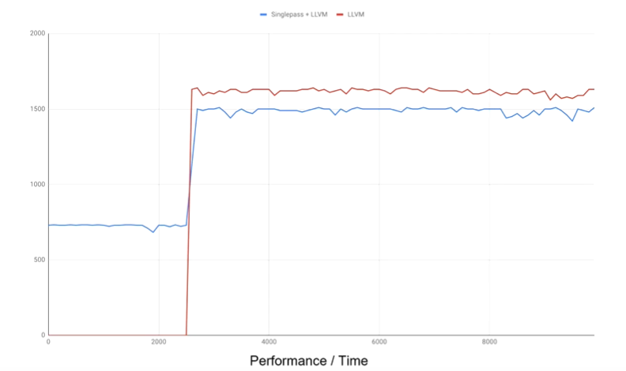
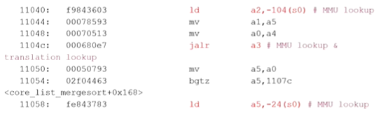
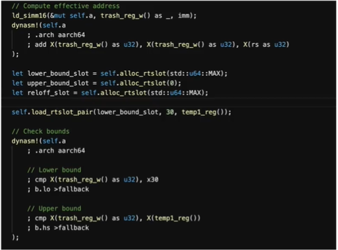
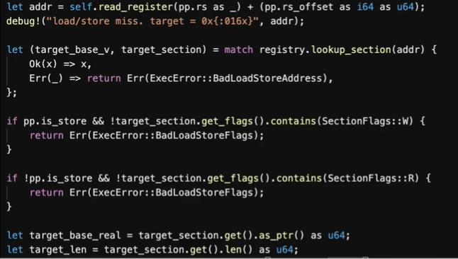
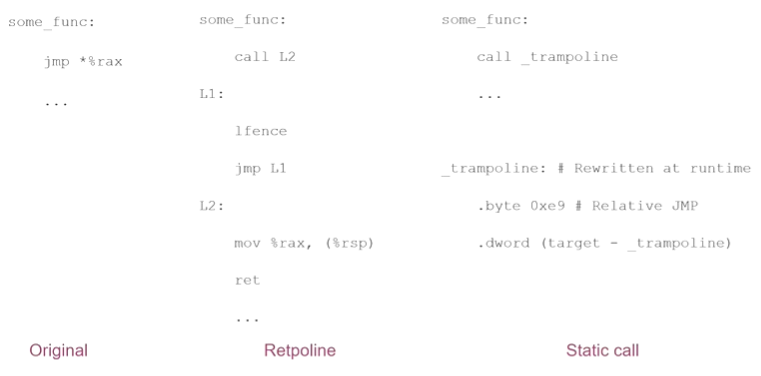

# RustChinaConf2020 精选 | JIT 开发实践

说明：本文为视频演讲文字版，编者听录的时候可能会出现一些误差，欢迎指正。

后期编辑: 大海，编程爱好者，对技术充满热情。


**讲师:**  

[周鹤洋](https://github.com/losfair)是`wasmer`核心开发者，南航2018级本科生，主要掌握编译/OS/VM/微架构等技术，2017年开始使用Rust.

视频地址：[https://www.bilibili.com/video/BV1Yy4y1e7zR?p=18](https://www.bilibili.com/video/BV1Yy4y1e7zR?p=18)

### JIT技术含义及应用场合 ###

​	JIT技术全名为 Just-In-Time compilation，翻译为"即时编译"，是在运行期进行编译的方法，是将源代码或更常见的字节码到机器码的转换，然后直接执行的方法。JIT技术主要应用在各种语言的虚拟机上。在其他场合，比如动态链接器，会在运行之前动态重启程序，对它进行链接; 在linux 内核中, ebpf技术和5.10版本最新引入的static calls机制都使用了类似JIT的机制。

​	以虚拟机(VM)为例来简单介绍下JIT技术的应用。VM技术，可以大致分为三类，简单的解释器，优化的解释器和即时编译。简单的解释器，类似wasmi，由于对标准的实现非常好，导致没有资源去做优化，没有为运行效率做优化。其次是优化解释器，比如CPython,wasm3,BEAM(erlang 解释器). 而第三种则包括绝大多数高性能运行时虚拟机，JVM，CLR，V8，LuaJIT，Wasmer，Wasmtime.

​	虚拟机主要应用于当我们需要执行的目标代码格式与机器指令格式不一致时，需要翻译处理的情况。然而当出现我们无法直接静态地翻译到目标机器指令的特性，比如说动态特性( javascript的一些动态约束)，硬件层面难以实现的沙盒特性，比如WebAssembly的内存隔离, 不同的指令集，比如从riscv动态编译到aarch64或者x86-64指令集情况下，我们就需要使用二进制翻译器去进行Jit编译。

​	jit的优点很明显，可以让程序更效率地运行，可以① 动态优化代码②高效支持语言动态特性和安全要求③ 在一些特殊场合比如static call机制和动态链接器，支持运行环境的初始化操作来避免运行时的大量开销。

​	**我们现在从动态优化方面来讲述jit相对传统静态编译的关键点。**


<center>图1 不同引擎在各JIT优化级别所采用的编译器后端</center>

​	如图1所示，以JavaScriptCore,V8,Wasmer三个引擎为例，他们均实现了用户可以自由选择后端的操作或者在运行时自动在不同后端间切换的方式，使得可以支持编译优化从低优化级别切换到高优化级别，并且经过未经优化代码的时候，再切换回去的操作。

​	这里动态优化的流程是我们通过不断Profile,追踪运行状态，去编译优化等级更高的代码，同时编译开销变大，也会做deoptimize操作，当优化的代码做一些错误的假设时，我们就需要回滚。

**而用来实现动态切换优化级别的主要技术是OSR技术 ，即栈上替换(on-stack replacement).**


<center>图2 切换优化等级:OSR</center>


​	让我们来看看OSR技术的简易流程。如图2所示，调用栈出现了左边的假想情况时，函数Baz代码优化从解释执行提升到 jit级别1 时， 运行时就会触发函数baz的编译，一旦编译完成，则会发生调用栈的重构，使得 原调用栈中所有函数Baz的记录映射到Jit级别1 的堆栈结构上，使得在原来状态基础之上，以Jit级别1的机器码上继续运行。代价 是 提升了计算的复杂度。

​	我曾经的一个工作，  在wasmer中实现的OSR技术。 OSR入口动态加载Image,在OSR退出的时候把image提取出来(从调用栈到wasm抽象表示，回到另一种优化等级的wasmer调用栈内的结构。(<font color=red>8:39</font>)



<center>图3 动态切换机制实例随时间变化的性能曲线</center>

​	图3则是我当时项目benchmark的表现。在图3中，singlepass是我编写的编译最快，运行最慢的后端。llvm是优化等级最高的后端。红线为使用LLVM后端的性能曲线，蓝线为前面2s左右使用singlepass后端，后面使用llvm后端的性能曲线。

​	如果我们直接用llvm编译的话，我们就需要在程序执行之前，在测试程序中等待2s左右。如果我们引入动态切换机制，在程序启动时可以先使用编译快，但执行满的引擎去做执行，当优化等级高的编译器准备好之后，就动态地切换执行流，得到二者的平衡。红线和蓝线后面没有重合，只是由于我们在蓝线上针对一些做了一些额外操作,性能理论上还是一样的。

​	**我要介绍的第二钟动态优化技术 是 内联缓存inline caching。**我了解到有两种典型的用例。

1. 一些动态语言中的method lookup （方法查找）

   ```javascript
   for (let x of list){
       document.write(x); // method lookup
   }
   ```

   ​	其中write函数是可以被动态重写的，但是这种情况发生的概率非常小，所以说我们在运行时可以假设它不变，去编译生成机器码。当假设不成立的时候，回滚。本来需要从哈希表中查找该方法，对缓存不友好，运行速度慢。

   ​	所以我们可以直接对该指令映射为一个缓存槽(slot)，把write函数对应的某些标记和write函数地址写入，检查运行条件是否符合，符合就可以直接执行，避免哈希表查找的开销，否则进行回滚。

2. RISC-V二进制翻译

   
   
   <center>图4  RISC-V 二进制翻译代码示例 </center>
   
   ​	在RISC-V当中，主要有访存指令和跳转指令会涉及到较大的内存结构查找开销。
   
   ​	① 对于全系统模拟的访存指令(load/store)，需要在内存管理单元钟进行tlb lookup，用软件实现非常慢，遍历4层页表。或者在一些高层次结构的模拟时，在b-tree结构去查找内存空间，效率也很低。
   
   ​	对于这种指令，我们可以对指令关联一个缓存槽，当该指令第一次需求查表的时候，将查表预期的虚拟地址范围和真实物理地址  写入到缓存槽中，以后每次执行到该指令时，我们就直接用缓存信息直接提取内存信息即可。
   
   ​	② 如图4，jalr指令，间接跳转指令的例子。对于这种指令，除了需要mmu lookup , 还需要查找Jit 翻译，即被翻译后的字节码(translation lookup)，共两层查找。 而内联缓存技术就可以消除这两层查找的开销。

让我来介绍一下关于内联缓存我所做的简单应用吧。 rvjt-aa64项目 是我所完成的riscv到aarch64的jit引擎([rvjit-aa64](https://github.com/losfair/rvjit-aa64))



<center>图5 rvjit-aa64 快速路径(从内存加载数据)</center>

​	图5展示了访存指令的快速路径，可以看见我们分配了关于上界和下界的两个缓存槽。检查目标虚拟地址是否位于预期界限当中，如果在范围内，就直接加载，不用回滚到解释执行了。否则就走慢速路径，执行查表处理。



<center>图6 rvjit-aa64慢速路径(从内存加载数据)</center>

​	图6展示了访存指令的慢速路径。当发生`load/store miss`时，我们就会针对地址addr进行查表， 检查读写权限和相关信息，如果可以的话就将其写入缓存槽内，下次就可以快速执行。


​	**接下来我来介绍有关内存安全方面的内容。**

​	我们知道rust作为一个以安全性著称的语言，保证safe代码内存安全。所以我们就需要在运行时通过动态的机制确保内存安全。

​	我以空指针检查和访问越界检查为例来介绍Jit如何确保内存安全。

​	①空指针检查:

​	比如在java,c#这类有空指针的语言中，我们会遇到一个很常见的情况。当引用为空的时候，我们不应该对它解引用并且成功。我们应该检查它是否为空，如果为空，应该产生异常而非解引用。一个显而易见的方法是`if (a == null){ throw Exception(...)}`，但这样开销很大。如同下面代码所展示的，在`mov`指令前需要插入`cmp`和`je`指令，就会增加额外的分支预测的开销。

```assembly
1: 1 cmp $0, %rdi
2: je null_pointer_exception 
3: mov %rdi,16(rsp)
...

null_pointer_exception:
	call host_npe_handler
	...
```

​	所以我们可以尝试一些别的方法。利用硬件trap机制，访问空指针时，从第三行mov指令直接trap到sigsegv异常(以Linux为例)，从而让硬件去检查我们的指针有效性。

​	②访问越界检查

​	对于webassembly中线性内存访问 的处理也可以使用trap机制,比如wasmer和wasmtime的处理方法是，直接分配6GB的虚拟地址空间，只对其中有webassembly分配的区域去做映射。一旦访问到存在映射区域以外的区域时,就会抛出异常,被sigsegv处理器捕获。这样是以慢速路径中的时间增加为代价去换取快速路径上的开销,因为慢速路径钟加入了sigsegv异常处理机制，而快速路径则不再需要界限判断。

​	当然具体的细节会复杂一些，比如wasmer中一段代码,采用Unix信号处理同步异常.调用low level的system api去绑定,关联这些异常信号到处理器上,处理器会分发,然后进一步找出路径.


​	**最后我们来介绍一下linux kernel中运用到jit方法的一些技术。**

​	①比如ebpf,是一种允许用户代码安全接入内核的机制. 他有interpreter和jit两种实现方式.大多数主流架构都是用Jit实现.




<center>图7  Retpoline, Static call机制处理间接跳转的简要代码</center>

​		②linux 5.10引入的static call机制。 在此之前，为了缓解 spectre 系列漏洞,特别是spectre v2 漏洞,我们会采用retpoline技术.

依赖于RSB(Return Stack Buffer), 它的目的是所有间接调用不经过分支目标缓存(Branch Target Buffer),这样保证攻击无法生效. 

​	为方便大家理解Retpoline原理，我这里参考了[retpoline: 原理与部署](https://terenceli.github.io/%E6%8A%80%E6%9C%AF/2018/03/24/retpoline)一文来作原理的解释。如图7所示，jmp指令通过rax值进行间接跳转，在original方式下，CPU会询问indirect branch preditor。如果有攻击者之前训练过该分支，就会导致CPU跳转执行特定代码。而retpoline机制阻止CPU的投机执行。在Retpoline方式下，

​	①执行`call L2`后，会将`lfence`地址压栈，并填充到Return Stack Buffer(RSB)，然后跳转到L2位置。

​	②`mov %rax, (%rsp)`指令将间接跳转地址(`*%rax`)放到栈顶，此时栈顶地址和RSB中地址不同。

​	③此时对于`ret`指令如果CPU投机执行时，会使用第一步中放入RSB中的地址，而`lfence`，`jmp L1`指令会导致一个死循环。

​	④CPU发现内存栈上的返回地址和RSB投机地址不同，所以投机执行终止，跳转到`*%rax`

​	这样Retpoline机制就避免了CPU的投机执行。	

​	但是在 linux内核中我们发现,有很多pattern的间接调用目标是一定的,比如虚表所以我们会把它装化成两次直接调用,第二次直接调用代码使用jit重写,如图7  `_trampoline`所示, 这样我们消除了spectre v2的可能性, 而且也减少了间接调用的开销(因为使用了直接调用)


### 在我的项目中是否应该使用jit? ###


<center>图8 wasm引擎执行效率与工程复杂度的表现</center>

​	如图8所示，wasm3虽然是一个解释器，但是相较于Wasmer,LLVM(最好的wasmer jit实现)性能低了10倍，对于解释器来说，是一个非常好的性能表现。并且wasm3的工程复杂度也低了许多。

​	考虑到 执行效率与工程复杂性的关系, 工程复杂性低,意味着出现的Bug数量少, 项目代码也就更安全.。所以对于安全要求高的话,就需要 谨慎考虑jit.	

​	在今年linux内核中 ebpf jit发现了两个LPE bug(CVE-2020-8835, CVE-2020-27194), 即使在使用开发人员众多的linux内核中，较小的语言ebpf当中仍出现了比较严重的bug, 这说明Jit编译器工程复杂度很高,需要团队巨大的资源支持维护.


### 用rust实现jit的体验 ###

​	使用过程宏 处理汇编很方便, 编写一些Low  level的jit体验非常好. rust语言作为源语言去实现目标语言的编译,无法保证其语言之外的安全性,这可以说是一种局限性吧.rust语言相对于c和c++还是比较有优势的.


## 提问环节 ## 

问题1: (猜测: 图3使用的Benchenmark使用了hashmap吗？)

回答: 我使用的Benchmark用hashmap会慢50%左右, 因为hashmap对缓存不友好。


问题2: 在jit空指针检查中，将普通的软件判断替换成trap，变成硬件中断，会提升效率吗？

回答:  trap可以类比为rust当中panic,比如数组越界等,在绝大多数情况下都会执行快速路径,当程序出现bug才会执行trap路径.


问题3: 有关内存越界的问题，如果a内存和b内存相邻，a内存已经被映射了，此时越界访问到b内存，这个检查是否失效？

回答: 因为我们在内联缓存中，存储了上界与下界的缓存。我们会对访问的内存比较上界和下界，如果越界就排除在外了。对于这里的比较开销，我们经过一层的比较，对缓存是友好的，并且相较于查表，开销很大。


问题4: wasmer如何兼容x86和arm指令集?

回答:  我们使用的编译器后端[singlepass](https://crates.io/crates/wasmer-compiler-singlepass)和llvm后端都是支持arm指令的.


**补充**:  通过硬件来提高jit的性能

wasmer 在运行时会做一些检查,比如跳转时要查询某个表,然后在表中找到目标地址,然后跳转.这样我们就需要在代码中做分支处理. 如果在risc-v Physical Memory Protection (PMP)的扩展下,就可以在一些情况避免上面查表的开销. 而苹果m1 中兼容x86的机制,通过硬件上添加一个x86 的[total store ordering](https://www.cs.utexas.edu/~bornholt/post/memory-models.html) (TSO)开关去使用x86内存顺序,提升模拟效率. 同时我们可以看到，arm指令集这几个版本也引入了支持javascript-operations 的一些指令，可以使得我们常用的一些jit目标语言提高执行效率。


参考文章:

1.	[Terenceli](https://github.com/terenceli)  [retpoline: 原理与部署](https://terenceli.github.io/%E6%8A%80%E6%9C%AF/2018/03/24/retpoline)
2.	[Sergio De Simone](https://www.infoq.com/profile/Sergio-De-Simone/)  [How x86 to arm64 Translation Works in Rosetta 2](https://www.infoq.com/news/2020/11/rosetta-2-translation/)

​


