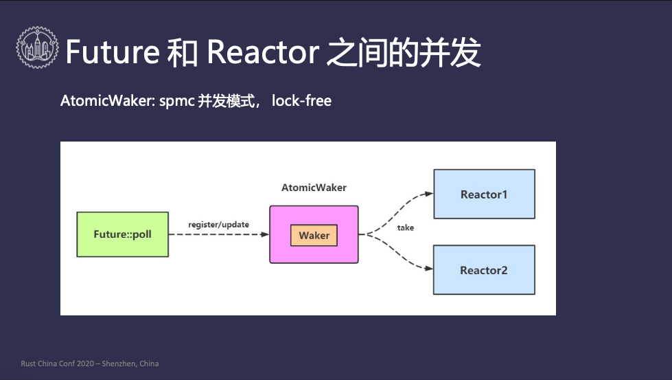
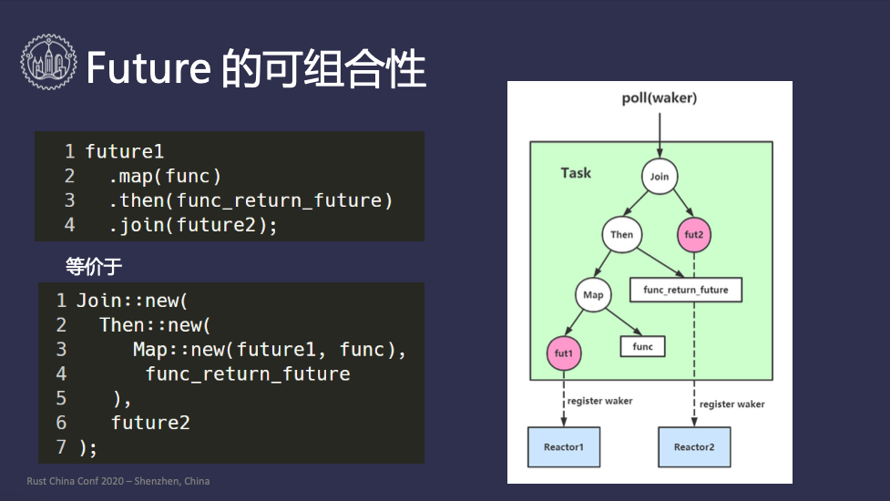
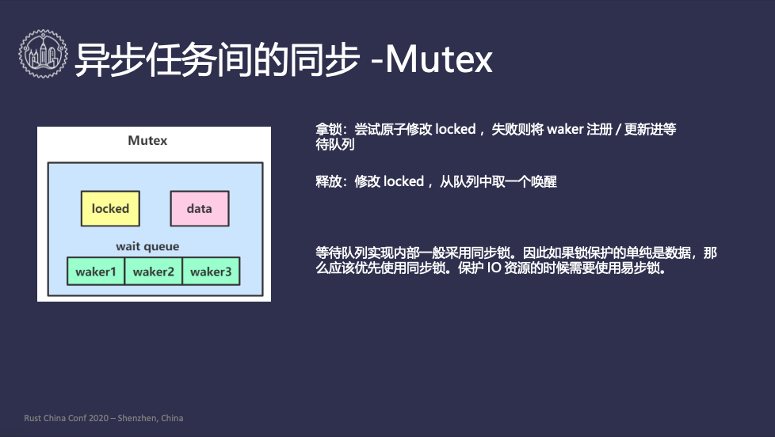
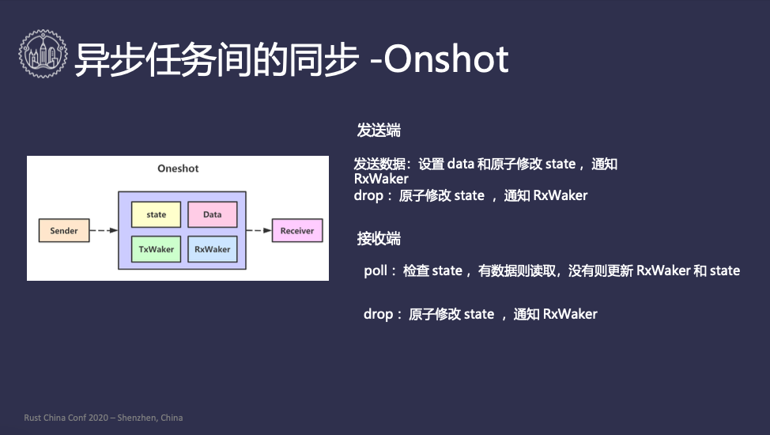
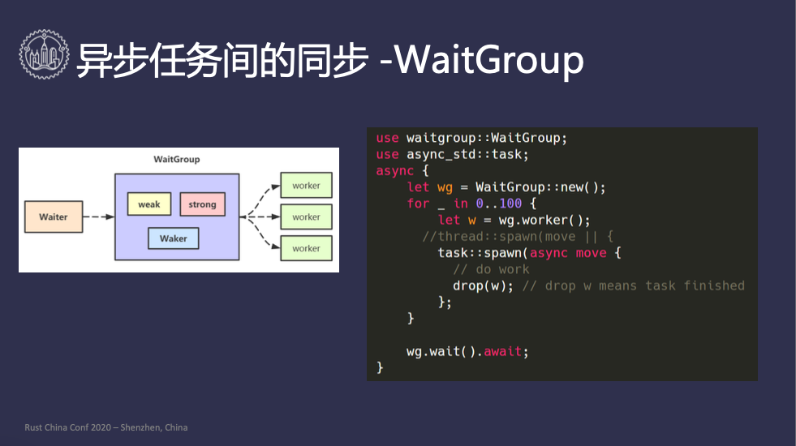

# RustChinaConf2020 精选 | Rust 异步与并发

讲师：赖智超 - Onchain 区块链架构师

视频地址：https://www.bilibili.com/video/BV1Yy4y1e7zR?p=14

后期编辑：李冬杰

主持人：异步与并发在任何语言中都是一个中高阶的难题，在我一开始学 Rust 时，在 Rust Book 中提到异步与并发部分，使用的形容词是“无畏”，下面请到分布科技区块链结构师赖智超先生，为我们带来他的 Rust 异步与并发的硬核解读。

————————

## 自我介绍


大家好，今天我跟大家分享一下 Rust 的异步模型，以及实现这个模型时面临的一些并发方面的挑战。首先介绍一下 Rust 在我们公司的应用情况，我们公司在区块链是布局比较早的，现在大概成立有四年多了，目前我们公司主要还是 golang 为核心的技术栈，但是在 Rust 方面我们也在积极探索，有一些应用的实践。首先我们的区块链支持 wasm 虚拟机，使用 Rust 基于 cranelift/wasmtime 实现了 JIT 的版本，目前已经运行了一年多了。有了 wasm 虚拟机的支持后，我们也在智能合约和配套的工具链上下了功夫，目前团队智能合约开发首选 Rust，它具有开发效率高和迭代速度快的优点，前些天统计我们使用 Rust 开发的智能合约代码已经上 10 万了。还有密码学库，我们也是用的 Rust。

1. 区块链 wasm JIT 虚拟机：基于 cranelift/wasmtime;
2. 智能合约开发库和配套的工具链：目前合约开发都首选 Rust，开发效率高，迭代速度快；
3. 密码学库；

## 同步任务多线程池


为了讲解异步编程模型，我们先来看一看大家都比较熟悉的同步任务多线程池的实现，一个比较典型的实现如 PPT 左图所示，有一个全局的队列（Global Task Queue），由用户调用 `spawn` 把任务压到全局队列，全局队列关联着一个或者多个 `worker` 线程，每个工作线程都会轮询的从全局队列中把任务拿出来执行，用代码实现也比较简单。

```rust
use std::thread;
use crossbeam:channel::{unbounded, Sender};
use once_cell:sync::Lazy;

type Task = Box<dyn FnOnce() + Send + 'static>;

static QUEUE: Lazy<Sender<Task>> = Lazy::new(|| {
    let (sender, reciver) = unbounded::<Task>();
    for _ in 0..4 {
        let rece = reciver.clone();
        thread::spawn(|| {
            for task in recv {
                task();
            }
        })
    }
    sender
});

fn spawn<F>(task: F) where F: FnOnce() + Send + 'static {
    QUEUE.send(Box::new(task)).unwrap();
}
```

首先我们在第5行代码定义了什么叫做同步任务，因为同步任务的话只需要执行一次就行了，所以是 `FnOnce()`，因为这个任务是从用户线程 push 到全局队列，跨线程到工作线程，所以需要由 `Send` 约束，这个过程需要 `static` 生命周期，然后封装到 Box 中。第 8 行我们构建了一个并发的队列，我们起 4 个线程，每个线程拿到队列的接收端，然后在一个循环中执行 task，当然执行 task 的过程可能会 panic，这里为了演示我就没有处理。第17行 `sender` 就保存着在全局静态变量 QUEUE 上，当用户调用 `spawn` 拿到 `QUEUE` 调用 `send` 方法，将任务 push 到队列中。

## 异步任务的多线程


```rust
type Task = Box<dyn FnMut() -> bool + Send + 'static>;
```

接下来我们看一下异步任务的多线程池，首先定义一下异步任务，不能立即完成，需要多次执行，因此 `FnOnce()` 就不满足了，需要使用 `FnMut`，它返回的结果是个布尔值，表示是否执行完任务。但是这样定义就有个问题，如果这个函数没有被工作线程执行完，工作线程就不知道接下来该怎么办了，如果一直等着这个任务能够执行，全局队列中的其他任务就不能被执行，直接扔掉这个任务也不行。因此有个很巧妙的办法，`Exector` 就不关心这个任务什么时候好，在执行的时候创建一个 `Waker`，然后告诉 task，“如果你什么时候好了，可以通过 `Waker` 把它重新放到全局队列里去” 以便再次执行，这样的话 Task 的定义就多出了 `Waker` 参数，如下所示：

```rust
type Task = Box<dyn FnMut(Waker: &Waker) -> bool + Send + 'static>;
```

这样异步任务执行没有 ready 的时候，可以将拿到 `Waker` 注册到能监控任务状态的 `Reactor` 中，如 ioepoll、timer 等，`Reactor` 发现任务 ready 后调用 `Waker` 把任务放到全局队列中。

### 异步任务的多线程 Executor


对于异步计算的标准 Rust 定义了 Future trait

```rust
pub enum Poll<T> {
    Ready(T),
    Pending,
}

pub trait Future {
    type Output;
    fn poll(&mut self, cx: &Waker) -> Poll<Self::Output>;
    // fn poll(self: Pin<&mut Self>, cx: &mut Context<'_>) -> Poll<Self::Output>;
}
```

poll 方法返回的是一个枚举类型 Poll，它和返回布尔值是类似的，只不过语义会更清晰一些，如果没好的话就返回一个 Pending，好了的话就返回一个 Ready。标准库里有个 Pin<&mut Self>，因为30分钟讲不完，所以在这里先跳过。下面就是整个异步任务多线程的模型图：


首先用户通过 `spawn` 函数把异步任务 push 到全局队列里去，然后工作线程会拿到 task 执行，并且创建一个 `Waker`，传给执行的 `Future`，如果执行成功，那就 ok 了；如果执行没成功，`Future` 负责把 `Waker` 注册到 `Reactor` 上面，`Reactor` 负责监听事件，收到事件后会把 `Waker` 唤醒，把 task 放到全局队列中，这样下次其他线程可以拿到这个 task 继续执行，直到执行完毕。

### Waker 接口的要求


`Waker` 在这个过程中充当着十分重要的角色，我们来看一下 Waker 的接口需要满足哪些要求：

```rust
impl Waker {
    pub fn wake(self);
}

impl Clone for Waker;

impl Send for Waker;

impl Sync for Waker;
```

对于使用方的要求，首先 `Waker` 本身是唤醒的功能，所以它要提供一个 `wake` 方法。异步任务可能会关心多个事件源，比如说定时器、IO，也就是说 `Waker` 可能对应不同的 `Reactor`，因为 `Future` 在 `poll` 的时候只是穿了一个 `Waker`，现在要把 `Waker` 注册到多个 `Reactor` 上，就需要 `clone`。然后 `Executor` 和 `Waker` 可能不再一个线程里面，`Waker` 需要跨线程发送到 `Reactor` 上面，所以也就需要一个 `Send` 的约束。最后多个事件源可能同时调用这个 `Waker`，这里就存在并发调用的问题，要满足并发调用的话就比需实现一个 `Sync`。这是对 `Waker` 使用方的要求。


```rust
impl Waker {
    pub unsafe fn from_raw(waker: RawWaker) -> Waker
}

pub struct RawWaker {
    data: *const (),
    vtable: &'static RawWakerTable,
}

pub struct RawWakerTable {
    clone: unsafe fn(*const ()) -> RawWaker,
    wake: unsafe fn(*const ()),
    wake_by_ref: unsafe fn(*const ()),
    drop: unsafe fn(*const ())
}
```

不同的 `Executor` 有不同的内部实现，而 `Waker` 就是一个公共的统一的 API，也就是说不同的实现有的是一个全局队列，有的可能是搞到一个线程局部队列里，有的 `Executor` 可能只支持单个 task 的执行，他们的唤醒机制是完全不一样的。要构造统一的 `Waker` 必然涉及多态，Rust 中是采用自定虚表实现的，通过 `RawWaker` 来构造 `Waker`，`RawWaker` 有个数据字段，和一个静态的虚表，不同的 `Executor` 就是要把这些虚表中的方法实现，

### Waker 实现需要考虑的并发问题


`Waker` 在实现上可能会有一些并发上的问题，我们先说第一个问题，`wake` 调用之间的并发，保证只 push 执行队列一次。如果有多个 `Reactor` 同时执行 `Waker` 的话，两个 `Reactor` 都想把 task push 到全局队列里去，如果第一次让线程 A 拿到了，第二次让线程 B 拿到了，线程 A 和 B 现在同时想 `poll`，因为 `poll` 本身 `Self` 参数是 `Mut` 的，也就是说是互斥的，这样就会造成线程安全问题。

第二个问题，`wake` 调用和 `poll` 之间的并发，一个 task 正在 `poll` 里执行，但是之前 `poll` 的时候注册到一个 `Reactor` 中，这个 `Reactor` 突然好了，现在它想把 `Waker` 唤醒 push 到并发队列里去，当前已经有一个 `Executor` 正在 `poll`，现在又要把 task 放到全局队列里去，然后被另一个线程拿到了，这个线程的 `Executor` 也可以 `poll`，最终会导致跟第一个一样的问题。

`async-task` 完美的解决了这些并发问题，并且它提供了十分优雅的 API，我把[源码解析](https://zhuanlan.zhihu.com/p/92679351)放在了知乎上面，大家有兴趣可以看一下。

### 异步任务多线程 Executor


如果用 `async-task` 处理处理这个问题，代码应该是这样的：

```rust
use std::thread;
use crossbeam:channel::{unbounded, Sender};
use once_cell:sync::Lazy;
use async_task;

static QUEUE: Lazy<Sender<async_task::Task<()>>> = Lazy::new(|| {
    let (sender, reciver) = unbounded::<Task>();
    for _ in 0..4 {
        let rece = reciver.clone();
        thread::spawn(|| {
            for task in recv {
                task();
            }
        })
    }
    sender
});

fn spawn<F, R>(future: F) -> async_task::JoinHandle<R, ()> 
where 
    F: Future<Output = R> + Send + 'static
    R: Send + 'static
{
    let schedule = |task| QUEUE.send(task).unwrap();
    let (task, handle) = async_task::spawn(future, schedule, ());
    task.schedule();
    handle
}
```

可以看到和之前的同步任务多线程池相比，`spawn` 函数有一些区别，使用 `async_task` 很简单实现了异步任务多线程池的处理。

### Future 和 Reactor 之间的并发


`Future` 负责任务没有好的时候把 `waker` 注册到 `Reactor` 里，这里面会有一个 `waker` 过期的问题。第一次调用 `poll` 和第二次调用 `poll` 时，`Executor` 传的 `waker` 可能不是同一个，只有最新的 `waker` 能把 task 唤醒，老得 `waker` 就唤不醒，这样导致的问题是每次 `poll` 的时候都要把 `waker` 更新到 `Reactor` 里，以确保能够唤醒 task。

比如过图中的例子，`Future` 同时对两个事件感兴趣，对应着两个 `Reactor`。`Future` 在 `poll` 的时候需要注册 `Reactor1` 的 `waker`，也要注册 `Reactor` 的 `waker`，当它下次 `poll` 的时候每次都要把两个 `waker` `更新，那么现在问题来了，Future` 的 `poll` 执行在 `Executor` `线程，Reactor` 执行在 `Reactor` 线程，一个线程往里面写，另一个线程试图从里面读，并发问题就出现了。为了处理这个问题，最简单的方式就是加一把锁，每个 `Reactor` 都要加锁解锁，这个操作本身就比较复杂，比较耗时。



`AtomicWaker` 完美处理了这个问题，它通过单生产者多消费者的模式，将 `waker` 放到 `AtomicWaker` 里面，`AtomicWaker` 被多个 `Reactor` 共享，所有 `Reactor` 就能拿到最新的 `waker`。

## Future 的可组合性



异步任务本身是可以组合的，比如书一个 HTTPS 请求，查询 DNS 拿到 IP，建立 TLS 链接，发送请求数据，拿到响应数据，过程中的每一步都是异步任务，把这写异步任务组合到一起就是一个大的异步任务。`async_task` 的 `Future` 是可组合的，比如说：

```rust
future1
    .map(func)
    .then(func_return_future)
    .join(future2);
```

因为 `Future` 要执行的话必须发到 `Executor` 里面，因此上面的代码执行时还没有发到 `Executor` 里面去，所以它本身是没有执行的。上面的代码等于：

```rust
Join::new(
    Then::new(
        Map::new(future1, func), 
        func_return_future
    ), 
    future2
);
```

它是一个声明式的，最终会产生一个结构体，是一个如上图所示的树形结构，所以当整个 task 丢到 `Executor` 里去执行的时候，`poll` 方法只人 `Future` 的根结点，这颗 task 会一直执行到叶子节点，最底层的叶子节点是专门跟 `Reactor` 打交道的，所以大部分开发者是不需要关心 `Reactor` 的，因此可能对 `Reactor` 概念可能了解不多。

当一个叶子节点没好的时候，它会把传下来的 `waker` 注册到 `Reactor` 里面去，`Reactor` 发现任务可以继续推进了，会调用 `waker` 把 task 放入到全局队列中，某个线程拿到 task 后，会从叶子节点继续执行，这是真个的执行过程。

### JoinN 组合的效率


上面的 `Future` 组合模型涉及到一个 `JoinN` 组合的效率问题，问题是怎么产生的呢？`waker` 只用于唤醒整体 task，但是没有携带任何唤醒信息，比如 task 是怎么被唤醒的，`JoinN` 负责把多个 `Future` 组合在一起同时并发的执行，`join4:poll(waker)` 把 4 个 `Future` 组合，每次 `poll` 的时候挨个去执行 `Future`，如果没有好的话就会注册到 `Reactor` 里面，假设第二个突然就好了，下一次 `poll` 时 join4 并不知道自己为什么被唤醒了，只能挨个再跑一遍 `Future`，但其实第一、三、四都是浪费掉的。


怎么解决这个问题呢？`async_task` 里面有一个 `FuturesUnordered` 专门处理这个事情，它管理成千上万个子 `Future`，它内置了一个并发队列，维护已经 ready 的子 `Future`。当 `Executor` 在 `poll` 整体 task 的时候，它只遍历并发队列挨个拿出来执行，执行的时候并不是把 `waker` 原封不动的传下去，它是进行了一次包装进行拦截，一旦 `Future` 好了它会把 `Future` 添加到 ready 队列里面去，再去通知全局队列，`Executor` 下次再 `poll` 的时候直接从内置的并发队列去执行 `Future`，这样能达到效率最大化。

## 异步任务之间的同步


传统多个线程之间也有同步的问题，比如说锁。异步任务之间也不可能是完全隔离的，它们之间可能做一些消息的交互，我们比较一下线程和 Task 之间的区别：

｜｜ 线程 ｜ Task ｜
｜----｜----｜----｜
｜睡眠｜ thread::park｜return Pending｜
｜唤醒｜thread::unpark｜Waker::wake｜
｜获取方式｜thread::current()｜poll的参数｜

线程如果不想工作了，可以调用 `thread::park`，task 如果不想工作了可以直接 `return Pending`；线程可以通过 `thread::unpark` 唤醒，task 需要调用 `Waker::wake`；获取方式线程直接调用 `thread::current`，task 是通过 `poll` 的参数拿到 `waker`。

### 异步任务之间的同步 Mutex



`Mutex` 数据结构里面又一个数据段，表示要锁的数据，一个 `locked` 原子变量表示有没有被锁住，异步任务想拿锁却没有拿到，它就只能进如等待队列里面，等着别人去通知它。先看一下拿锁的过程，如果 `waker` 拿到锁之前 `locked` 是 false，表示拿锁成功了，如果没拿到失败了的话，就只能等，把 `waker` 丢到等待队列里。拿到锁的任务想释放这把锁的时候，把 `locked` 改成 false，从等待队列中拿一个 `waker` 出来。

这里跟大家讲一个很多人误区的地方，很多人认为异步任务里面是必须要用异步锁的，同步锁有阻塞就不行，这是不对的。大部分的等待队列实现都是用了同步锁，也就是说 `Mutex` 也不是完全异步的，它本身有个同步锁在里面。如果你在应用里面只是想保护一段数据，共享的数据想要做个加减法，那么应该用 std 里面的同步锁，如果你要用异步锁的话，它里面有个等待队列，这比同步锁复杂很多。

那么什么时候用异步锁呢？答案是在保护 IO 资源的时候，当你的锁需要跨越多个 `.await`，时间差的比较大的时候，那应该优先使用异步锁。

### 异步任务之间的同步 Oneshot



`Onshot` 是做什么事情的呢？它负责在两个线程之间传递一个数据，一个 task 在执行，另一个 task 在等待，前者执行完会通过 `Oneshot` 把数据传递给后者。图上所示就是 `Oneshot` 的数据结构，`state` 中纪录了很多元信息，比如数据是否已经写了，`sender` 是否应析构掉了，`TxWaker` 是否已经存了，`RxWaker` 是否已经存了，`reciver` 是否已经 `drop` 掉了。

发送端发送数据的时候是怎么做的，首先在修改数据前 data 是完全由 `sender` 去访问的，写完 data 后把 `state` 状态改掉，表示这个 data 已经写完了。然后把接收端的 `waker` 取出来然后唤醒，唤醒之后 task 下次执行就可以把数据拿到了，如果 `sender` 没有发送数据，现在要把它析构掉，析构时要注意接收端还在一直等，因此 `sender` 析构是也要把 `state` 修改掉，把相关的 `waker` 唤醒，让 `reciver` 不要再等了。

接收端的实现是一个 `Future`·，它本身在 `poll` 的时候拿到 `state`，如果有数据那就 OK 了，说明发送段已经发送完成，直接读取数据。如果没有数据的话它就要等，把它的 `waker` 存在 `Oneshot` 里面，同时也跟新响应的 `state`，表示接收端的 `waker` 已经存在这里。接收端在 `drop` 的时候，也要通知 `sender`，表示“我现在对你的数据没有兴趣了，你可以不用继续结算下去”，然后终止掉，所以接受端在 drop 的时候也要修改 `state`，从 `Oneshot` 里面拿到发送端的 `waker`，把发送端唤醒。

### 异步任务之间的同步 WaitGroup



接下来讲一下我自己实现的 `WaitGroup`，它在 golang 里面是非常常见的。它可以构造出多个子任务，等所有的子任务完成后，再继续执行下去，下面是一个演示代码：

```rust
use waitgroup::WaitGroup;
use async_std::task;

async {
    let wg = WaitGroup::new();
    for _ in 0..100 {
        let w = wg.worker();
        task::spawn(async move {
            drop(w);
        });
    }
    wg.wait().await;
}
```

首先先构造一个 `waitGroup`，然后创建 100 个 `woker`，在每个任务执行完后，只要把 `worker` drop 掉，就说明任务已经完成了。然后 `waitGroup` 就一直在等，直到所有的子任务完成后继续执行。下面介绍一个它的实现，其实比较简单：

```rust
struct Inner {
    waker: AtomicWaker,
}

impl Drop for Inner {
    fn drop(&mut self) {
        self.waker.wake();
    }
}

pub struct Worker {
    inner: Arc<Inner>,
}

pub struct WaitGroup {
    inner: Weak<Inner>
}

impl Future for WaitGroup {
    type Output = ();

    fn poll(self: Pin<&mut Self>, cx: &mut Context<'_>) -> Poll<Self::Output> {
        match self.inner.upgrade() {
            Some(inner) => {
                inner.waker.register(cx.waker());
                Poll::Pending
            }
            None => Poll::Ready(())
        }
    }
}
```

如果某一个 `woker` 完成了 task，它并不需要去唤醒 `waker`， `waitGrou`p 只关心所有任务都结束了，只让最后一个 `worker` 去唤醒 `waker`。什么时候是最后一个 `worker` 呢？我们可以用标准库里的 `Arc`，`Arc` 是一个共享引用，让所有的 `Arc` 强引用都销毁的时候，也就是剩下最后一个了，所以只要在 `Arc` 包装的数据的 `drop` 方法里面把 `waker` 唤醒就可以了。

`WaitGroup` 持有一个弱引用，所有的 `Worker` 都持有强引用，`WaitGroup` 在 `poll` 的时候试图把弱引用升级成强引用，如果升级失败了，说明所有的强引用都没了，也就是任务都执行完了，就可以返回 `Ready`。如果升级成功了，说明现在至少还有一个强引用，那就把 `waker` 注册到 `AtomicWaker` 里面。在升级结束的瞬间，所有的 `worker` 全部 `drop` 掉了，但是它还没有调用 `wake`，在升级成功的一瞬间会产生一个临时的强引用 `inner`，最后在这个临时的强引用销毁的时候调用 `drop`，然后调用 `waker.wake()` 整个过程就完整了。
