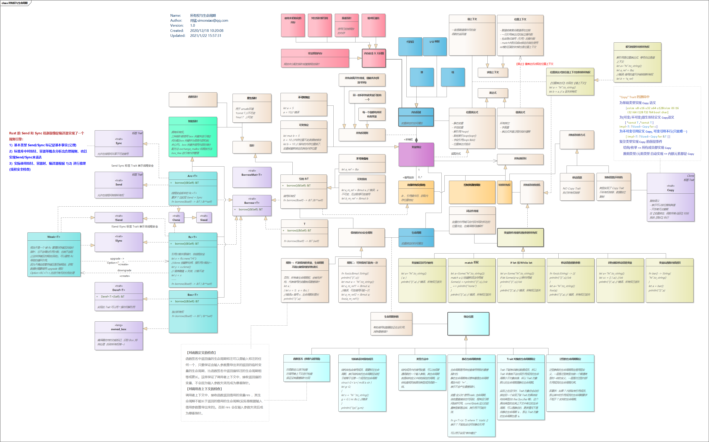
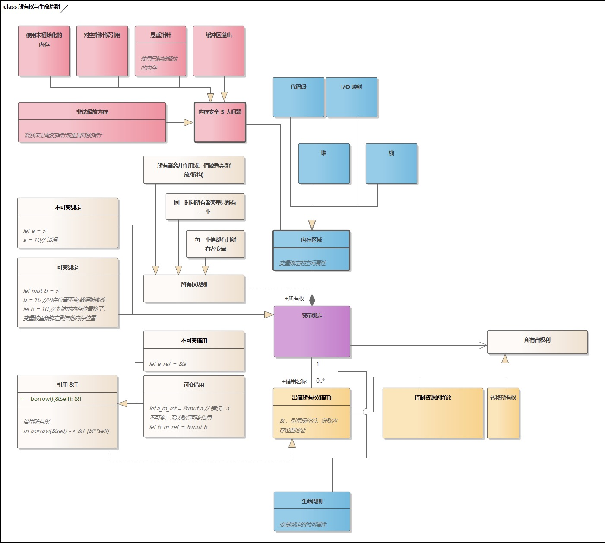
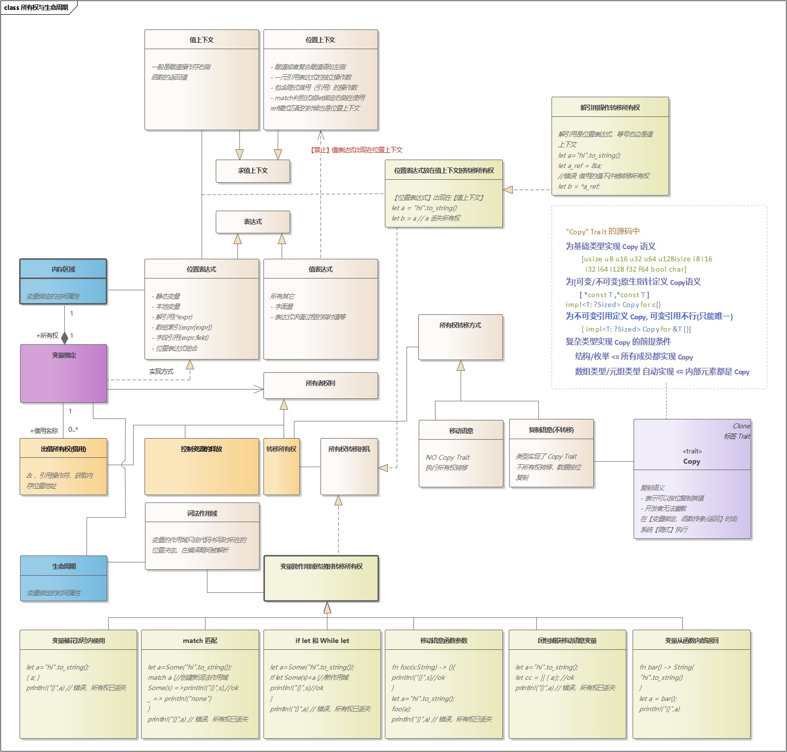
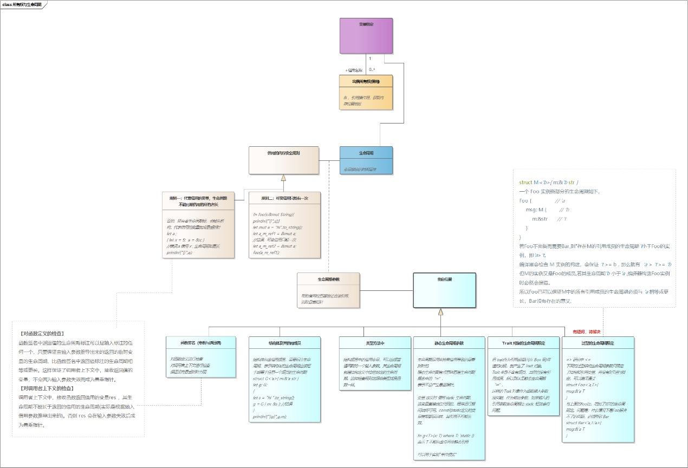

# 图解 Rust 所有权与生命周期

作者：肖猛

后期编辑：高宪凤

---

作者简介：

肖猛

二十年从桌面到云端到嵌入式的软件架构经验，跨通讯、游戏、金融、智能网联汽车多个行业，领域系统分析专家、全栈软件架构专家。

目前致力于智能驾驶基础软件开发。历任吉利亿咖通自动驾驶软件平台总监，国汽智控自动驾驶软件研发总监。对在汽车领域推广 Rust 技术栈有浓厚兴趣，并有实际的量产实践。

---

## 1.引言

**所有权**与**生命周期**是  `Rust`  语言非常核心的内容。其实不仅仅是 `Rust` 有这两个概念，在`C/C++` 中也一样是存在的。而几乎所有的内存安全问题也源于对所有权和生命周期的错误使用。只要是不采用垃圾回收来管理内存的程序语言，都会有这个问题。只是 `Rust` 在语言级明确了这两个概念，并提供了相关的语言特性让用户可以显式控制所有权的转移与生命周期的声明。同时编译器会对各种错误使用进行检查，提高了程序的内存安全性。

所有权和生命周期其涉及的语言概念很多，本文主要是对梳理出与“所有权与生命周期”相关的概念，并使用  `UML` 的类图表达概念间的关系，帮助更好的理解和掌握。

**图例说明**

本文附图都是 `UML` 类图，`UML` 类图可以用来表示对概念的分析。表达概念之间的依赖、继承、聚合、组成等关系。图中的每一个矩形框都是一个语义概念，有的是抽象的语言概念，有的是 `Rust` 库中的结构和 `Trait`。

所有图中使用的符号也只有最基础的几个。图 1 对符号体系做简单说明，主要解释一下表达概念之间的关系的符号语言。

<div align=center>
    
</div>
<center>图 1UML 符号</center>

**依赖关系：**

依赖是 `UML` 中最基础的关系语义。 以带箭头的虚线表示，`A` 依赖与 `B` 表达如下图。直观理解可以是 `A` “看的见” `B`，而 `B` 可以对 `A` 一无所知。比如在代码中 结构体 `A` 中有 结构体 `B` 的成员变量，或者 `A` 的实现代码中有 `B` 的局部变量。这样如果找不到 `B`，`A` 是无法编译通过的。

**关联关系：**

一条实线连接表示两个类型直接有关联，有箭头表示单向"可见",无箭头表示相互之间可见。关联关系也是一种依赖，但是更具体。有时候两个类型之间的关联关系太复杂，需要用一个类型来表达，叫做关联类型，如例图中的 `H`.

**聚合与组成：**

聚合与组成都是表示的是整体和部分的关系。差别在于“聚合”的整体与部分可以分开，部分可以在多个整体之间共享。而“组成”关系中整体对部分有更强的独占性，部分不能被拆开，部分与整体有相同的生命周期。

**继承与接口实现：**

继承与接口实现都是一种泛化关系，`C` 继承自 `A`，表示 `A` 是更泛化的概念。`UML` 中各种关系语义也可以用 `UML` 自身来表达，如图 2：“关联”和“继承”都是“依赖”的具体体现方式。

<div align=center>
    
</div>
<center>图 2用 UML表达UML自身</center>

**总图**

图 3 是本文的总图，后续各节分局部介绍。


<center>图 3Rust 所有权与生命周期总图</center>

## 2.所有权与生命周期期望解决的问题

我们从图中间部分开始看起，所谓“所有权”是指对一个变量拥有了一块“内存区域”。这个内存区域，可以在堆上，可以在栈上，也可以在代码段，还有些内存地址是直接用于 `I/O` 地址映射的。这些都是内存区域可能存在的位置。

在高级语言中，这个内存位置要在程序中要能被访问，必然就会与一个或多个变量建立关联关系（低级语言如汇编语言，可以直接访问内存地址）。也就是说，通过这一个或多个变量，就能访问这个内存地址。

这就引出三个问题：

1. 内存的不正确访问引发的内存安全问题
2. 由于多个变量指向同一块内存区域导致的数据一致性问题
3. 由于变量在多个线程中传递，导致的数据竞争的问题

由第一个问题引发的内存安全问题一般有 5 个典型情况：

- 使用未初始化的内存
- 对空指针解引用
- 悬垂指针(使用已经被释放的内存)
- 缓冲区溢出
- 非法释放内存(释放未分配的指针或重复释放指针)


<center>图 4变量绑定与内存安全的基本概念</center>

这些问题在 `C/C++` 中是需要开发者非常小心的自己处理。 比如我们可以写一段 `C++` 代码，把这五个内存安全错误全部犯一遍。

```C++
#include <iostream>

struct Point {
	int x;
	int y;
};

Point* newPoint(int x,int y) {
	Point p { .x=x,.y=y };
	return &p; //悬垂指针
}

int main() {
	int values[3]= { 1,2,3 };
	std::cout<<values[0]<<","<<values[3]<<std::endl; //缓冲区溢出

	Point *p1 = (Point*)malloc(sizeof(Point));
	std::cout<<p1->x<<","<<p1->y<<std::endl; //使用未初始化内存

	Point *p2 = newPoint(10,10); //悬垂指针
	delete p2; //非法释放内存

	p1 = NULL;
	std::cout<<p1->x<<std::endl; //对空指针解引用
	return 0;
}
```

这段代码是可以编译通过的，当然，编译器还是会给出警告信息。这段代码也是可以运行的，也会输出信息，直到执行到最后一个错误处“对空指针解引用时”才会发生段错误退出。

`Rust` 的语言特性为上述问题提供了解决方案，如下表所示：

| 问题                                                             | 解决方案                                                                                                                                                                                                                                                                      |
| ---------------------------------------------------------------- | ----------------------------------------------------------------------------------------------------------------------------------------------------------------------------------------------------------------------------------------------------------------------------- |
| <div style="width: 200px">使用未初始化的内存</div>               | 编译器禁止变量读取未赋值变量                                                                                                                                                                                                                                                  |
| <div style="width: 200px">对空指针解引用</div>                   | 使用 Option<T> 枚举替代空指针                                                                                                                                                                                                                                                 |
| <div style="width: 200px">悬垂指针</div>                         | 生命周期标识与编译器检查                                                                                                                                                                                                                                                      |
| <div style="width: 200px">缓冲区溢出</div>                       | 编译器检查，拒绝超越缓冲区边界的数据访问                                                                                                                                                                                                                                      |
| <div style="width: 200px">非法释放内存</div>                     | 语言级的 RAII 机制，只有唯一的所有者才有权释放内存                                                                                                                                                                                                                            |
| <div style="width: 200px">多个变量修改同一块内存区域</div>       | 允许多个变量借用所有权，但是同一时间只允许一个可变借用                                                                                                                                                                                                                        |
| <div style="width: 200px">变量在多个线程中传递时的安全问题</div> | 对基本数据类型用 Sync 和 Send 两个 Trait 标识其线程安全特性，即能否转移所有权或传递可变借用，把这作为基本事实。再利用泛型限定语法和 Trait impl 语法描述出类型线程安全的规则。编译期间使用类似规则引擎的机制，基于基本事实和预定义规则为用户代码中的跨线程数据传递做推理检查。 |

## 3.变量绑定与所有权的赋予

`Rust` 中为什么叫“变量绑定”而不叫“变量赋值"。我们先来看一段 `C++` 代码，以及对应的 `Rust` 代码。

C++:

```C++
#include <iostream>
 
int main()
{
	int a = 1;
	std::cout << &a << std::endl;   /* 输出 0x62fe1c */
	a = 2;
	std::cout << &a << std::endl;   /* 输出 0x62fe1c */
}
```

Rust:

```Rust
fn main() {
	let a = 1;
	println!("a:{}",a);     // 输出1
	println!("&a:{:p}",&a); // 输出0x9cf974
	//a=2;                  // 编译错误，不可变绑定不能修改绑定的值
	let a = 2;              // 重新绑定
	println!("&a:{:p}",&a); // 输出0x9cfa14地址发生了变化
	let mut b = 1;          // 创建可变绑定
	println!("b:{}",b);     // 输出1
	println!("&b:{:p}",&b); // 输出0x9cfa6c
	b = 2;
	println!("b:{}",b);     // 输出2
	println!("&b:{:p}",&b); // 输出0x9cfa6c地址没有变化
	let b = 2;              // 重新绑定新值
	println!("&b:{:p}",&b); // 输出0x9cfba4地址发生了变化
}
```

我们可以看到，在 `C++` 代码中，变量 `a` 先赋值为 1，后赋值为 2，但其地址没有发生变化。`Rust` 代码中，`a` 是一个不可变绑定，执行`a=2`动作被编译器拒绝。但是可以使用 `let` 重新绑定，但这时 `a` 的地址跟之前发生了变化，说明 a 被绑定到了另一个内存地址。`b` 是一个可变绑定，可以使用`b = 2`重新给它指向的内存赋值，`b` 的地址不变。但使用 `let` 重新绑定后，`b` 指向了新的内存区域。

可以看出，"赋值" 是将值写入变量关联的内存区域，"绑定" 是建立变量与内存区域的关联关系，`Rust` 里，还会把这个内存区域的所有权赋予这个变量。

不可变绑定的含义是：将变量绑定到一个内存地址，并赋予所有权，通过该变量只能读取该地址的数据，不能修改该地址的数据。对应的，可变绑定就可以通过变量修改关联内存区域的数据。从语法上看，有 `let` 关键字是绑定, 没有就是赋值.。

这里我们能看出 `Rust` 与 `C++` 的一个不同之处。`C++` 里是没有“绑定”概念的。`Rust` 的变量绑定概念是一个很关键的概念，它是所有权的起点。有了明确的绑定才有了所有权的归属，同时解绑定的时机也确定了资源释放的时机。

所有权规则：

- 每一个值都有其所有者变量
- 同一时间所有者变量只能有一个
- 所有者离开作用域，值被丢弃(释放/析构)

作为所有者，它有如下权利：

- 控制资源的释放
- 出借所有权
- 转移所有权

## 4.所有权的转移

所有者的重要权利之一就是“转移所有权”。这引申出三个问题：

1. 为什么要转移？
2. 什么时候转移？
3. 什么方式转移？

相关的语言概念如下图。


<center>图 5所有权转移</center>

**为什么要转移所有权？**
我们知道，C/C++/Rust 的变量关联了某个内存区域，但变量总会在表达式中进行操作再赋值给另一个变量，或者在函数间传递。实际上期望被传递的是变量绑定的内存区域的内容，如果这块内存区域比较大，复制内存数据到给新的变量就是开销很大的操作。所以需要把所有权转移给新的变量，同时当前变量放弃所有权。所以归根结底，转移所有权还是为了性能。

**所有权转移的时机总结下来有以下两种情况：**

1. 位置表达式出现在值上下文时转移所有权
2. 变量跨作用域传递时转移所有权

第一条规则是一个精确的学术表达，涉及到位置表达式，值表达式，位置上下文，值上下文等语言概念。它的简单理解就是各种各样的赋值行为。能明确指向某一个内存区域位置的表达式是位置表达式，其它的都是值表达式。各种带有赋值语义的操作的左侧是位置上下文，右侧是值上下文。

当位置表达式出现在值上下文时，其程序语义就是要把这边位置表达式所指向的数据赋给新的变量，所有权发生转移。

第二条规则是“变量跨作用域时转移所有权”。

图上列举出了几种常见的跨作用域行为，能涵盖大多数情况，也有简单的示例代码

- 变量被花括号内使用
- match 匹配
- if let 和 While let
- 移动语义函数参数传递
- 闭包捕获移动语义变量
- 变量从函数内部返回

为什么变量跨作用域要转移所有权？在 `C/C++` 代码中，是否转移所有权是程序员自己隐式或显式指定的。

试想，在 `C/C++` 代码中，函数 `Fun1` 在栈上创建一个 类型 `A` 的实例 `a`， 把它的指针 `&a` 传递给函数 `void fun2(A* param)` 我们不会希望 `fun2` 释放这个内存，因为 `fun1` 返回时，栈上的空间会自动被释放。

如果 `fun1` 在堆上创建 `A` 的实例 `a`， 把它的指针 `&a` 传递给函数 `fun2(A* param)`,那么关于 `a` 的内存空间的释放，`fun1` 和 `fun2` 之间需要有个商量，由谁来释放。`fun1` 可能期望由 `fun2` 来释放，如果由 `fun2` 释放，则 `fun2` 并不能判断这个指针是在堆上还是栈上。归根结底，还是谁拥有 `a` 指向内存区的所有权问题。 `C/C++` 在语言层面上并没有强制约束。`fun2` 函数设计的时候，需要对其被调用的上下文做假定，在文档中对对谁释放这个变量的内存做约定。这样编译器实际上很难对错误的使用方式给出警告。

`Rust` 要求变量在跨越作用域时明确转移所有权，编译器可以很清楚作用域边界内外哪个变量拥有所有权，能对变量的非法使用作出明确无误的检查，增加的代码的安全性。

**所有权转移的方式有两种：**

- 移动语义-执行所有权转移
- 复制语义-不执行转移，只按位复制变量

这里我把 ”复制语义“定义为所有权转移的方式之一，也就是说“不转移”也是一种转移方式。看起来很奇怪。实际上逻辑是一致的，因为触发复制执行的时机跟触发转移的时机是一致的。只是这个数据类型被打上了 `Copy` 标签 `trait`, 在应该执行转移动作的时候，编译器改为执行按位复制。

`Rust` 的标准库中为所有基础类型实现的 `Copy Trait`。

这里要注意，标准库中的

```Rust
 impl<T: ?Sized> Copy for &T {}
```

为所有引用类型实现了 `Copy`, 这意味着我们使用引用参数调用某个函数时，引用变量本身是按位复制的。标准库没有为可变借用 `&mut T` 实现“Copy” `Trait` , 因为可变借用只能有一个。后文讲闭包捕获变量的所有权时我们可以看到例子。

## 5.所有权的借用

变量拥有一个内存区域所有权，其所有者权利之一就是“出借所有权”。

与出借所有权相关的概念关系如图 6


<center>图 6出借所有权</center>

拥有所有权的变量借出其所有权有“引用”和“智能指针”两种方式：

- 引用（包含可变借用和不可变借用)
- 智能指针

  - 独占式智能指针 `Box<T>`
  - 非线程安全的引用计数智能指针 `Rc<T>`
  - 线程安全的引用计数智能指针 `Arc<T>`
  - 弱指针 `Weak<T>`

引用实际上也是指针，指向的是实际的内存位置。

借用有两个重要的安全规则：

1. 代表借用的变量，其生命周期不能比被借用的变量(所有者)的生命周期长
2. 同一个变量的可变借用只能有一个

第一条规则就是确保不出现“悬垂指针”的内存安全问题。如果这条规则被违反，例如：变量 `a` 拥有存储区域的所有权，变量 `b` 是 `a` 的某种借用形式，如果 `b` 的生命周期比 `a` 长，那么 `a` 被析构后存储空间被释放，而 `b` 仍然可以使用，则 `b` 就成为了悬垂指针。

第二条是不允许有两个可变借用，避免出现数据一致性问题。

```Rust
Struct Foo{v:i32}
fn main(){
    let mut f = Foo{v:10};
    let im_ref = &f;        // 获取不可变引用
    let mut_ref = & mut f;  // 获取可变引用
    //println!("{}",f.v);
    //println!("{}",im_ref.v);
    //println!("{}",mut_ref.v);
}
```

变量 `f` 拥有值的所有权，`im_ref` 是其不可变借用，`mut_ref` 是其可变借用。以上代码是可以编译过去的，但是这几个变量都没有被使用，这种情况下编译器并不禁止你同时拥有可变借用和不可变借用。最后的三行被注释掉的代码(6,7,8)使用了这些变量。打开一行或多行这些注释的代码，编译器会报告不同形式的错误：

| 开放注释行 | 编译器报告                                                 |
| ---------- | ---------------------------------------------------------- |
| 6          | 正确                                                       |
| 7          | 第 5 行错误：不能获得 f 的可变借用，因为已经存在不可变借用 |
| 8          | 正确                                                       |
| 6, 7       | 第 5 行错误：不能获得 f 的可变借用，因为已经存在不可变借用 |
| 6,8        | 第 6 行错误：不能获得 f 的不可变借用，因为已经存在可变借用 |

**对"借用" 的抽象表达**

`Rust` 的核心包中有两个泛型 `trait` ，[core::borrow::Borrow](https://doc.rust-lang.org/beta/core/borrow/trait.Borrow.html) 与 [core::borrow::BorrowMut](https://doc.rust-lang.org/std/borrow/trait.BorrowMut.html)，可以用来表达"借用"的抽象含义，分别代表可变借用和不可变借用。
前面提到，“借用”有多种表达形式 `（&T,Box<T>，Rc<T> 等等）`，在不同的使用场景中会选择合适的借用表达方式。它们的抽象形式就可以用 [core::borrow::Borrow](https://doc.rust-lang.org/beta/core/borrow/trait.Borrow.html) 来代表. 从类型关系上， `Borrow` 是"借用" 概念的抽象形式。从实际应用上，某些场合我们希望获得某个类型的“借用”，同时希望能支持所有可能的“借用”形式，`Borrow Trait` 就有用武之地。

Borrow 的定义如下：

```Rust
pub trait Borrow<Borrowed: ?Sized> {
    fn borrow(&self) -> &Borrowed;
}
```

它只有一个方法，要求返回指定类型的引用。

`Borrow` 的文档中有提供例子

```Rust
use std::borrow::Borrow;

fn check<T: Borrow<str>>(s: T) {
    assert_eq!("Hello", s.borrow());
}

fn main(){
    let s: String = "Hello".to_string(); 
    check(s);

    lets: &str = "Hello"; 
    check(s);
}
```

`check` 函数的参数表示它希望接收一个 “str”类型的任何形式的“借用”，然后取出其中的值与 “Hello”进行比较。

标准库中为 `String` 类型实现了 `Borrow<str>`,代码如下

```Rust
impl Borrow<str> for String{
    #[inline]
    fn borrow(&self) -> &str{
        &self[..]
    }
}
```

所以 `String` 类型可以作为 `check` 函数的参数。

从图上可以看出，标准库为所有类型 `T` 实现了 `Borrow Trait`, 也为 `&T` 实现了 `Borrow Trait`。

代码如下 ，这如何理解。

```Rust
impl<T: ?Sized> Borrow<T> for T {
    fn borrow(&self) -> &T { // 是 fn borrow(self: &Self）的缩写，所以 self 的类型就是 &T
        self
    }
}

impl<T: ?Sized> Borrow<T> for &T {
    fn borrow(&self) -> &T {
        &**self
    }
}
```

这正是 `Rust` 语言很有意思的地方，非常巧妙的体现了语言的一致性。既然 `Borrow<T>` 的方法是为了能获取 `T` 的引用，那么类型 `T` 和 `&T` 当然也可以做到这一点。在 `Borrow for T` 的实现中，

`fn borrow(&self)->&T` 是 `fn borrow(self: &Self)->&T` 的缩写，所以 `self` 的类型就是 `&T`,可以直接被返回。在 `Borrow for &T` 的实现中，`fn borrow(&self)->&T` 是 `fn borrow(self: &Self)->&T` 的缩写，所以 `self` 的类型就是 `&&T`, 需要被两次解引用得到 `T`, 再返回其引用。

智能指针 `Box<T>`,`Rc<T>`,`Arc<T>`,都实现了 `Borrow<T>` ，其获取 `&T` 实例的方式都是两次解引用在取引用。`Weak<T>` 没有实现 `Borrow<T>`, 它需要升级成 `Rc<T>` 才能获取数据。

## 6.生命周期参数

变量的生命周期主要跟变量的作用域有关，在大部分程序语言中都是隐式定义的。`Rust` 中能显式声明变量的生命周期参数，这是非常独特的设计，其语法特性在其他语言也是不太可能见到的。以下是生命周期概念相关的图示。


<center>图 7生命周期</center>

**生命周期参数的作用**

生命周期参数的核心作用就是解决悬垂指针问题。就是让编译器帮助检查变量的生命周期，防止出现变量指向的内存区域被释放后，变量仍然可以使用的问题。那么什么情况下会让编译器无法判断生命周期，而必须引入一个特定语法来对生命周期进行标识？

我们来看看最常见的悬垂指针问题，函数以引用方式返回函数内部的局部变量：

```Rust
struct V{v:i32}
 
fn bad_fn() -> &V{  //编译错误：期望一个命名的生命周期参数
    let a = V{v:10};
    &a
}
let  res = bad_fn();
```

这个代码是一个典型的悬垂指针错误，`a` 是函数内的局部变量，函数返回后 `a` 就被销毁，把 `a` 的引用赋值给 `res` ，如果能执行成功，`res` 绑定的就是未定义的值。

但编译器并不是报告悬垂指针错误，而是说返回类型 `&V` 没有指定生命周期参数。`C++` 的类似代码编译器会给出悬垂指针的警告（警告内容:局部变量的地址被返回了）。

那我们指定一个生命周期参数看看：

```Rust
fn bad_fn<'a>() -> &'a V{
    let a = V{v:10};
    let ref_a = &a;
    ref_a   //编译错误：不能返回局部变量的引用
}
```

这次编译器报告的是悬垂指针错误了。那么编译器的分析逻辑是什么？

首先我们明确一下 <font color=#fa8919>'a 在这里的精确语义到底是什么？</font>

函数将要返回的引用会代表一个内存数据，这个数据有其生命周期范围，`'a` 参数是对这个生命周期范围提出的要求。就像 `&V` 是对返回值类型提的要求类似，**'a 是对返回值生命周期提的要求**。编译器需要检查的就是实际返回的数据，其生命是否符合要求。

那么 <font color=#fa8919>'a 参数对返回值的生命周期到底提出了什么要求？</font>

我们先区分一下"函数上下文"和“调用者上下文”，函数上下文是指函数体内部的作用域范围，调用者上下文是指该函数被调用的位置。上述的悬垂指针错误其实并不会影响函数上下文范围的程序执行，出问题的地方是调用者上下文拿到一个无效引用并使用时，会出现不可预测的错误。

函数返回的引用会在“调用者上下文”中赋予某个变量，如：

```Rust
let res = bod_fn();
```

`res` 获得了返回的引用, 函数内的 `ref_a` 引用会按位复制给变量 `res` （标准库中 `impl<T: ?Sized> Copy for &T {}` 指定了此规则）`res` 会指向 函数内 `res_a` 同样的数据。为了保证将来在调用者上下文不出悬垂指针，编译器真正要确保的是 `res` 所指向的数据的生命周期，不短于 `res` 变量自己的生命周期。否则如果数据的生命周期短，先被释放，`res` 就成为悬垂指针。

可以把这里的 `'a` 参数理解为调用者上下文中接收函数返回值的变量 `res` 的生命周期，那么 `'a` 对函数体内部返回引用的要求是：**返回引用所指代数据的生命周期不短于 'a ，也就是不短于调用者上下文接收返回值的变量的生命周期。**

上述例子中函数内 `ref_a` 指代的数据生命周期就是函数作用域，函数返回前，数据被销毁，生命周期小于调用者上下文的 `res`, 编译器根据 返回值的生命周期要求与实际返回值做比较，发现了错误。

实际上，返回的引用或者是静态生命周期，或者是根据函数输入的引用参数通过运算变换得来的，否则都是这个结果，因为都是对局部数据的引用。

**静态生命周期**

看函数

```Rust
fn get_str<'a>() -> &'a str {
    let s = "hello";
    s
}
```

这个函数可以编译通过，返回的引用虽然不是从输入参数推导，不过是静态生命周期，可以通过检查。

因为静态生命周期可以理解为“无穷大”的语义，实际是跟进程的生命周期一致，也就是在程序运行期间始终有效。

`Rust` 的字符串字面量是存储在程序代码中，程序加载后在代码空间，始终有效。可以通过一个简单试验验证这一点：

```Rust
let s1="Hello";
println!("&s1:{:p}", &s1);//&s1:0x9cf918

let s2="Hello";
println!("&s2:{:p}",&s2);//&s2:0x9cf978
//s1,s2是一样的值但是地址不一样，是两个不同的引用变量

let ptr1: *const u8 = s1.as_ptr();
println!("ptr1:{:p}", ptr1);//ptr1:0x4ca0a0

let ptr2: *const u8 = s2.as_ptr();
println!("ptr2:{:p}", ptr2);//ptr2:0x4ca0a0
```

`s1`,`s2` 的原始指针都指向同一个地址，说明编译器为 "Hello" 字面量只保存了一份拷贝，所有引用都指向它。

`get_str` 函数中静态生命周期长于返回值要求的`'a`，所以是合法的。

如果把 `get_str` 改成

```Rust
fn get_str<'a>() -> &'static str
```

即把对返回值生命周期的要求改为无穷大，那就只能返回静态字符串引用了。

**函数参数的生命周期**

前面的例子为了简单起见，没有输入参数，这并不是一个典型的情况。大多数情况下，函数返回的引用是根据输入的引用参数通过运算变换而来。比如下面的例子：

```Rust
fn  remove_prefix<'a>(content:&'a str,prefix:&str) -> &'a str{
    if content.starts_with(prefix){
        let start:usize = prefix.len();
        let end:usize = content.len();
        let sub = content.get(start..end).unwrap();
        sub
    }else{
        content
    }
}
let  s = "reload";
let sub = remove_prefix(&s0,"re");
println!("{}",sub); // 输出: load
```

`remove_prefix` 函数从输入的 `content` 字符串中判断是否有 `prefix` 代表的前缀。 如果有就返回 `content` 不包含前缀的切片，没有就返回 `content` 本身。

无论如何这个函数都不会返回前缀 `prefix` ，所以 `prefix` 变量不需要指定生命周期。

函数两个分支返回的都是通过 `content` 变量变换出来的，并作为函数的返回值。所以 `content` 必须标注生命周期参数，编译器要根据 `content` 的生命周期参数与返回值的要求进行比较，判断是否符合要求。即：**实际返回数据的生命周期，大于或等于返回参数要求的生命周期。**

前面说到，我们把返回参数中指定的生命周期参数 `'a` 看做调用者上下文中接收返回值的变量的生命周期，在这个例子中就是字符串引用 `sub`，<font color=#fa8919>那么输入参数中的 'a 代表什么意思 ？</font>

这在 `Rust` 语法设计上是一个很让人困惑的地方，输入参数和输出参数的生命周期都标志为 `'a` ，似乎是要求两者的生命周期要求一致，但实际上并不是这样。

我们先看看如果输入参数的生命周期跟输出参数期待的不一样是什么情况，例如下面两个例子：

```Rust
fn echo<'a, 'b>(content: &'b str) -> &'a str {
    content //编译错误：引用变量本身的生命周期超过了它的借用目标
}
fn longer<'a, 'b>(s1: &'a str, s2: &'b str) -> &'a str {
    if s1.len() > s2.len()
        { s1 }
    else
        { s2 }//编译错误：生命周期不匹配
}
```

`echo` 函数输入参数生命周期标注为 `'b` , 返回值期待的是 `'a` .编译器报错信息是典型的“悬垂指针”错误。不过内容似乎并不明确。编译器指出查阅详细信息 [--explain E0312](https://doc.rust-lang.org/error-index.html#E0312) ，这里的解释是"借用内容的生命周期与期待的不一致"。这个错误描述就与实际的错误情况是相符合的了。

`longer` 函数两个参数分别具有生命周期 `'a` 和 `'b` , 返回值期待 `'a` ,当返回 `s2` 时，编译器报告生命周期不匹配。把 `longer` 函数中的生命周期 `'b` 标识为比 `'a` 长，就可以正确编译了。

```Rust
fn longer<'a, 'b: 'a>(s1: &'a str, s2: &'b str) -> &'a str {
    if s1.len() > s2.len()
        { s1 }
    else
        { s2 }//编译通过
}
```

回到我们前面的问题，<font color=#fa8919>那么输入参数中的 'a 代表什么意思 ？</font>

我们知道编译器在函数定义上下文中所做的生命周期检查就是要确保”**实际返回数据的生命周期，大于或等于返参数要求的生命周期**“。当输入参数给出与返回值一样的生命周期参数 `'a` 时，实际上是人为地向编译器保证：**在调用者上下文中，实际给出的函数输入参数的生命周期，不小于将来用于接收返回值的变量的生命周期。**

当有两个生命周期参数 `'a` `'b` , 而 `'b` 大于 `'a`，当然 也保证了在调用者上下文 `'b` 代表的输入参数生命周期也足够长。

在函数定义中，编译器并不知道将来实际调用这个函数的上下文是怎么样的。生命周期参数相当是函数上下文与调用者上下文之间关于参数生命周期的协议。

就像函数签名中的类型声明一样，类型声明约定了与调用者之间输入输出参数的类型，编译器编译函数时，会检查函数体返回的数据类型与声明的返回值是否一致。同样对与参数与返回值的生命周期，函数也会检查函数体中返回的变量生命周期与声明的是否一致。

前面说的是编译器在“**函数定义上下文的生命周期检查**”机制，这只是生命周期检查的一部分，还有另一部分就是“**调用者上下文对生命周期的检查**”机制。两者检查的规则如下：

**函数定义上下文的生命周期检查：**

函数签名中返回值的生命周期标注可以是输入标注的任何一个，只要保证由输入参数推导出来的返回的临时变量的生命周期，比函数签名中返回值标注的生命周期相等或更长。这样保证了调用者上下文中，接收返回值的变量，不会因为输入参数失效而成为悬垂指针。

**调用者上下文对生命周期的检查：**

调用者上下文中，接收函数返回借用的变量 `res` ，其生命周期不能长于返回的借用的生命周期(实际是根据输入借用参数推导出来的)。否则 `res` 会在输入参数失效后成为悬垂指针。

前面 `remove_prefix` 函数编译器已经校验合格，那么我们在调用者上下文中构建如下例子

```Rust
let res: &str;
{
    let s = String::from("reload");
    res = remove_prefix(&s, "re") //编译错误：s 的生命周期不够长
}
println!("{}", res);
```

这个例子中 `remove_prefix` 被调用这一行，编译器会报错 “s 的生命周期不够长”。代码中的 大括号创建了一个新的词法作用域，导致 `res` 的生命周期比大括号内部的 `s` 更长。这不符合函数签名中对生命周期的要求。函数签名要求输入参数的生命周期不短于返回值要求的生命周期。

**结构体定义中的生命周期**

结构体中有引用成员时，就会有潜在的悬垂指针问题，需要标识生命周期参数来让编译器帮助检查。

```Rust
struct G<'a>{ m:&'a str}
 
fn get_g() -> () {
    let g: G;
    {
        let  s0 = "Hi".to_string();
        let  s1 = s0.as_str();              //编译错误：借用值存活时间不够长
        g = G{ m: s1 };
    }
    println!("{}", g.m);
}
```

上面的例子中，结构体 `G` 包含了引用成员，不指定生命周期参数是无法编译的。函数 `get_g` 演示了在使用者上下文中如何出现生命周期不匹配的情况。

结构体的生命周期定义就是要保证在一个结构体实例中，其引用成员的生命周期不短于结构体实例自身的生命周期。否则如果结构体实例存活期间，其引用成员的数据先被销毁，那么访问这个引用成员时就构成了对悬垂指针的访问。

实际上结构体的生命周期参数可以和函数生命周期参数做类比，成员的生命周期相当函数的输入参数的生命周期，结构体整体的生命周期相当函数返回值的生命周期。这样所有之前对函数生命周期参数的分析一样可以适用。

如果结构体有方法成员会返回引用参数，方法同样需要填写生命周期参数。返回的引用来源可以是方法的输入引用参数，也可以是结构体的引用成员。在做生命周期分析的时候，可以把“方法的输入引用参数”和“结构体的引用成员”都看做普通函数的输入参数，这样前面对普通函数参数和返回值的生命周期分析方法可以继续套用。

**泛型的生命周期限定**

前文说过生命周期参数跟类型限定很像，比如在代码

```Rust
fn longer<'a>(s1:&'a str, s2:&'a str) -> &'a str
 
struct G<'a>{ m:&'a str }
```

中，`'a` 出现的位置参数类型旁边，一个对参数的静态类型做限定，一个对参数的动态时间做限定。`'a` 使用前需要先声明，声明的位置与模板参数的位置一样，在 `<>` 括号内，也是用来放泛型的类型参数的地方。

那么，<font color=#fa8919>把类型换成泛型可以吗，语义是什么？使用场景是什么？</font>

我们看看代码例子：

```Rust
use std::cmp::Ordering;

#[derive(Eq, PartialEq, PartialOrd, Ord)]
struct G<'a, T:Ord>{ m: &'a T }
 
#[derive(Eq, PartialEq, PartialOrd, Ord)]
struct Value{ v: i32 }
 
fn longer<'a, T:Ord>(s1: &'a T, s2: &'a T) -> &'a T {
    if s1 > s2 { s1 } else { s2 }
}
 
fn main(){
    let v0 = Value{ v:12 };
    let v1 = Value{ v:15 };
    let res_v = longer(&v0, &v1);
    println!("{}", res_v.v);//15
     
    let g0 = G{ m: &v0 };
    let g1 = G{ m: &v1 };
    let res_g = longer(&g0, &g1);//15
    println!("{}", res_g.m.v);
}
```

这个例子扩展了 `longer` 函数，可以对任何实现了 `Ord trait` 的类型进行操作。 `Ord` 是核心包中的一个用于实现比较操作的内置 `trait`. 这里不细说明。`longer` 函数跟前一个版本比较，只是把 `str` 类型换成了泛型参数 `T`, 并给 `T` 增加了类型限定 `T:Ord`.

结构体 `G` 也扩展成可以容纳泛型 `T`,但要求 `T` 实现了 `Ord trait`.

从代码及执行结果看，跟 把 `T` 当成普通类型一样，没有什么特别，生命周期参数依然是他原来的语义。

但实际上 "`&'a T`" 还隐含另一层语义：**如果 `T` 内部含有引用成员，那么其中的引用成员的生命周期要求不短于 `T` 实例的生命周期。**

老规矩，我们来构造一个反例。结构体 `G` 内部包含一个泛型的引用成员，我们将 `G` 用于 `longer` 函数，但是让 `G` 内部的引用成员生命周期短于 `G`。代码如下：

```Rust
fn  main(){
    let v0 = Value{ v:12 };
    let v1_ref: &Value;      // 将 v1 的引用定义在下面大括号之外，有意延长变量的生命周期范围
    let res_g: &G<Value>;

    {
        let v1 = Value{ v:15 };
        v1_ref = &v1;      //编译错误：v1的生命周期不够长。
        let res_v = longer(&v0,v1_ref);
        println!("{}",res_v.v);
    }

    let g0 = G{ m:&v0 };
    let g1 = G{ m:v1_ref };   // 这时候 v1_ref 已经是悬垂指针
    res_g = longer(&g0, &g1);
    println!("{}", res_g.m.v);
}
```

变量 `g1` 自身的生命周期是满足 `longer` 函数要求的，但是其内部的引用成员，生命周期过短。

这个范例是在“调用者上下文”检查时触发的，对泛型参数的生命周期限定比较难设计出在“函数定义或结构体定义上下文”触发的范例。毕竟 `T` 只是类型指代，定义时还没有具体类型。

实际上要把在 “`struct G<'a,T>{m:&'a T}`中，`T` 的所有引用成员的生命周期不短于`'a` ”这个语义准确表达，应该写成：

```Rust
struct G<'a,T:'a>{m:&'a T}
```

因为 `T:'a` 才是这个语义的明确表述。但是第一种表达方式也是足够的(我用反证法证明了这一点)。所以编译器也接受第一种比较简化的表达形式。

总而言之，泛型参数的生命周期限定是两层含义，一层是泛型类型当做一个普通类型时一样的含义，一层是对泛型内部引用成员的生命周期约束。

**Trait 对象的生命周期**

看如下代码

```Rust
trait Foo{}
struct Bar{v:i32}
struct Qux<'a>{m:&'a  i32}
struct Baz<'a,T>{v:&'a T}
 
impl Foo for Bar{}
impl<'a> Foo for Qux<'a>{}
impl<'a,T> Foo for Baz<'a,T>{}
```

结构体 `Bar`,`Qux`,`Baz` 都实现了 `trait Foo`, 那么 `&Foo` 类型可以接受这三个结构体的任何一个的引用类型。

我们把 `&Foo` 称为 `Trait` 对象。

`Trait` 对象可以理解为类似其它面向对象语言中，指向接口或基类的指针或引用。其它`OO`语言指向基类的指针在运行时确定其实际类型。`Rust` 没有类继承，指向 `trait` 的指针或引用起到类似的效果，运行时被确定具体类型。所以编译期间不知道大小。

`Rust` 的 `Trait` 不能有非静态数据成员，所以 `Trait` 本身就不会出现引用成员的生命周期小于对象自身，所以 `Trait` 对象默认的生命周期是静态生命周期。我们看下面三个函数：

```Rust
fn check0() -> &'static Foo { // 如果不指定 'static , 编译器会报错，要求指定生命周期命参数, 并建议 'static
    const b:Bar = Bar{v:0};
    &b
}
fn check1<'a>() -> &'a Foo { //如果不指定 'a , 编译器会报错
    const b:Bar = Bar{v:0};
    &b
}
fn check2(foo:&Foo) -> &Foo {//生命周期参数被省略，不要求静态生命周期
    foo
}
fn check3(foo:&'static Foo) -> &'static Foo {
    foo
}
fn main(){
    let bar= Bar{v:0};
    check2(&bar);                               //能编译通过，说明 chenk2 的输入输出参数都不是静态生命周期
    //check3(&bar);                          //编译错误：bar的生命周期不够长
    const bar_c:Bar =Bar{v:0};
    check3(&bar_c);                         // check3 只能接收静态参数
}
```

`check0` 和 `check1` 说明将 `Trait` 对象的引用作为 函数参数返回时，跟返回其他引用类型一样，都需要指定生命周期参数。函数 `check2` 的生命周期参数只是被省略了(编译器可以推断)，但这个函数里的 `Trait` 对象并不是静态生命周期，这可以从 `main` 函数内能成功执行 `check2(bar)` 分析出来，因为 `bar` 不是静态生命周期.

实际上在运行时，`Trait` 对象总会动态绑定到一个实现了该 `Trait` 的具体结构体类型(如 `Bar`,`Qux`,`Baz` 等)，这个具体类型的在其上下文中有它的生命周期，可以是静态的，更多情况下是非静态生命周期 `'a` ，那么 `Trait` 对象的生命周期也是 `'a`.

|                    | 结构体或成员生命周期 | Trait 对象生命周期 |
| ------------------ | -------------------- | ------------------ |
| Foo                | 无                   | 'static            |
| Bar                | 'a                   | 'a                 |
| Qux<'a>{m:&'a str} | 'a                   | 'a                 |
| Baz<'a,T>{v:&'a T} | 'a                   | 'a                 |

```Rust
fn qux_update<'a>(qux: &'a mut Qux<'a>, new_value: &'a i32)->&'a Foo {
    qux.v = new_value;
    qux
}

let value = 100;
let mut qux = Qux{v: &value};
let new_value = 101;
let muted: &dyn Foo = qux_update(& mut qux, &new_value);
qux_update 函数的智能指针版本如下：
 
fn qux_box<'a>(new_value: &'a  i32) -> Box<Foo +'a> {
    Box::new(Qux{v:new_value})
}
 
let new_value = 101;
let boxed_qux:Box<dyn Foo> = qux_box(&new_value);
```

返回的智能指针中，`Box` 装箱的类型包含了引用成员，也需要给被装箱的数据指定生命周期，语法形式是在被装箱的类型位置增加生命周期参数，用 "+" 号连接。

这两个版本的代码其实都说明一个问题，就是 `Trait` 虽然默认是静态生命周期，但实际上，其生命周期是由具体实现这个 `Trait` 的结构体的生命周期决定，推断方式跟之前叙述的函数参数生命周期并无太大区别。

## 7.智能指针的所有权与生命周期

如图 6，在 `Rust` 中引用和智能指针都算是“指针”的一种形态，所以他们都可以实现 [std::borrow::Borrow](https://doc.rust-lang.org/beta/core/borrow/trait.Borrow.html) `Trait`。一般情况下，我们对栈中的变量获取引用，栈中的变量存续时间一般比较短，当前的作用域退出时，作用域范围内的栈变量就会被回收。如果我们希望变量的生命周期能跨越当前的作用域，甚至在线程之间传递，最好是把变量绑定的数据区域创建在堆上。

栈上的变量其作用域在编译期间就是明确的，所以编译器能够确定栈上的变量何时会被释放，结合生命周期参数生命，编译器能找到绝大部分对栈上变量的错误引用。

堆上变量其的内存管理比栈变量要复杂很多。在堆上分配一块内存之后，编译器无法根据作用域来判断这块内存的存活时间，必须由使用者显式指定。`C` 语言中就是对于每一块通过 `malloc` 分配到的内存，需要显式的使用 `free` 进行释放。`C++`中是 `new / delete`。但是什么时候调用 `free` 或 `delete` 就是一个难题。尤其当代码复杂，分配内存的代码和释放内存的代码不在同一个代码文件，甚至不在同一个线程的时候，仅仅靠人工跟踪代码的逻辑关系来维护分配与释放就难免出错。

智能指针的核心思想是让系统自动帮我们决定回收内存的时机。其主要手段就是“**将内存分配在堆上，但指向该内存的指针变量本身是在栈上，这样编译器就可以捕捉指针变量离开作用域的时机。在这时决定内存回收动作，如果该指针变量拥有内存区的所有权就释放内存，如果是一个引用计数指针就减少计数值，计数为 0 就回收内存**”。

`Rust` 的 `Box<T>` 为独占所有权指针，`Rc<T>`为引用计数指针，但其计数过程不是线程安全的，`Arc<T>`提供了线程安全的引用计数动作,可以跨线程使用。

我们看 `Box<T>` 的定义

```Rust
pub struct Box<T: ?Sized>(Unique<T>);
pub struct Unique<T: ?Sized>{
    pointer: *const T,
    _marker: PhantomData<T>,
} 
```

`Box` 本身是一个元组结构体，包装了一个 `Unique<T>`， `Unique<T>`内部有一个原生指针。

_(注：Rust 最新版本的 Box<T> 实现还可以通过泛型参数指定内存分配器，让用户可以自己控制实际内存的分配。还有为什么通过 Unique<T>多层封装，这涉及智能指针实现的具体问题，这里不详述。）_

`Box` 没有实现 `Copy Trait`,它在所有权转移时会执行移动语意。

示例代码：

```Rust
Struct Foo {v:i32}
fn inc(v:& mut Foo) -> &Foo {//省略了生命周期参数
    v.v = v.v + 1;
    v
}
//返回Box指针不需要生命周期参数，因为Box指针拥有了所有权，不会成为悬垂指针
fn inc_ptr(mut foo_ptr:Box<Foo>) -> Box<Foo> {//输入参数和返回参数各经历一次所有权转移
    foo_ptr.v = foo_ptr.v + 1;
    println!("ininc_ptr：{:p}-{:p}", &foo_ptr, &*foo_ptr);
    foo_ptr
}
fn main() {
    let foo_ptr1 = Box::new(Foo{v:10});
    println!("foo_ptr1：{:p}-{:p}", &foo_ptr1, &*foo_ptr1);
    let mut foo_ptr2 = inc_ptr(foo_ptr1);
    //println!("{}",foo_ptr1.v);//编译错误，f0_ptr所有权已经丢失
    println!("foo_ptr2：{:p}-{:p}", &foo_ptr2, &*foo_ptr2);
     
    inc(foo_ptr2.borrow_mut());//获得指针内数据的引用，调用引用版本的inc函数
    println!("{}",foo_ptr2.v);
}
```

`inc` 为引用版本，`inc_ptr` 是指针版本。改代码的输出为：

```
foo_ptr1：0x8dfad0-0x93a5e0
in inc_ptr：0x8df960-0x93a5e0
foo_ptr2：0x8dfb60-0x93a5e0
12
```

可以看到 `foo_ptr1` 进入函数 `inc_ptr` 时,执行了一次所有权转移，函数返回时又执行了一次。所以三个 `Box<Foo>` 的变量地址都不一样，但是它们内部的数据地址都是一样的，指向同一个内存区。

`Box` 类型自身是没有引用成员的，但是如果 `T` 包含引用成员，那么其相关的生命周期问题会是怎样的？

我们把 `Foo` 的成员改成引用成员试试，代码如下：

```Rust
use std::borrow::BorrowMut;
struct Foo<'a>{v:&'a mut i32}
    fn inc<'a>(foo:&'a mut Foo<'a>) ->&'a Foo<'a> {//生命周期不能省略
    *foo.v=*foo.v + 1; // 解引用后执行加法操作
    foo
}
fn inc_ptr(mut foo_ptr:Box<Foo>) -> Box<Foo> {//输入参数和返回参数各经历一次所有权转移
    *foo_ptr.v = *foo_ptr.v + 1; / 解引用后执行加法操作
    println!("ininc_ptr：{:p}-{:p}", &foo_ptr, &*foo_ptr);
    foo_ptr
}
fn main(){
    let mut value = 10;
    let foo_ptr1 = Box::new(Foo{v:& mut value});
    println!("foo_ptr1：{:p}-{:p}", &foo_ptr1, &*foo_ptr1);
    let mut foo_ptr2 = inc_ptr(foo_ptr1);
    //println!("{}",foo_ptr1.v);//编译错误，f0_ptr所有权已经丢失
    println!("foo_ptr2：{:p}-{:p}", &foo_ptr2, &*foo_ptr2);
     
    let foo_ref = inc(foo_ptr2.borrow_mut());//获得指针内数据的引用，调用引用版本的inc函数
    //println!("{}",foo_ptr2.v);//编译错误，无法获取foo_ptr2.v的不可变借用，因为已经存在可变借用
    println!("{}", foo_ref.v);
}
```

引用版本的 `inc` 函数生命周期不能再省略了。因为返回 `Foo` 的引用时，有两个生命周期值，一个是`Foo` 实例的生命周期，一个是 `Foo` 中引用成员的生命周期，编译器无法做推断，需要指定。但是智能指针版本 `inc_ptr` 函数的生命周期依然不用指定。`Foo` 的实例被智能指针包装，生命周期由 `Box` 负责管理。

如果 `Foo` 是一个 `Trait` ，而实现它的结构体有引用成员，那么 `Box<Foo>` 的生命周期会有什么情况。示例代码如下：

```Rust
trait Foo{
    fn inc(&mut self);
    fn value(&self)->i32;
}

struct Bar<'a>{v:&'amuti32}

impl<'a> Foo for Bar<'a> {
    fn inc(&mutself){
        *(self.v)=*(self.v)+1
    }
    fn value(&self)->i32{
        *self.v
    }
}

fn inc(foo:& mut dyn Foo)->& dyn Foo {//生命周期参数被省略
    foo.inc();
    foo
}

fn inc_ptr(mut foo_ptr:Box<dyn Foo>) -> Box< dyn Foo> {//输入参数和返回参数各经历一次所有权转移
    foo_ptr.inc();
    foo_ptr
}

fn main() {
}
```

引用版本和智能指针版本都没生命周期参数，可以编译通过。不过 `main` 函数里是空的，也就是没有使用这些函数，只是定义编译通过了。我先试试使用引用版本：

```Rust
fn main(){
    let mut value = 10;
    let mut foo1= Bar{v:& mut value};
    let foo2 =inc(&mut foo1);
    println!("{}", foo2.value());  // 输出 11
}
```

可以编译通过并正常输出。再试智能指针版本：

```Rust
fn main(){
    let mut value = 10;
    let foo_ptr1 = Box::new(Bar{v:&mut value});   //编译错误：value生命周期太短
    let mut foo_ptr2 = inc_ptr(foo_ptr1); //编译器提示：类型转换需要value为静态生命周期
}
```

编译失败。提示的错误信息是 `value` 的生命周期太短，需要为 `'static` 。因为 `Trait` 对象（ `Box< dyn Foo>`）默认是静态生命周期，编译器推断出返回数据的生命周期太短。去掉最后一行 `inc_ptr` 是可以正常编译的。

如果将 `inc_ptr` 的定义加上生命周期参数上述代码就可以编译通过。修改后的 `inc_ptr` 如下：

```Rust
fn inc_ptr<'a>(mut foo_ptr:Box<dyn Foo+'a>) -> Box<dyn Foo+'a> {
    foo_ptr.inc();
    foo_ptr
}
```

为什么指针版本不加生命周期参数会出错，而引用版没有生命周期参数却没有问题？

因为引用版是省略了生命周期参数，完整写法是：

```Rust
fn inc<'a>(foo:&'a mut dyn Foo)->&'a dyn Foo {
    foo.inc();
    foo
}
```

## 8. 闭包与所有权

这里不介绍闭包的使用，只说与所有权相关的内容。闭包与普通函数相比，除了输入参数，还可以捕获上线文中的变量。闭包还支持一个 `move` 关键字，来强制转移捕获变量的所有权。

我们先来看 `move` 对输入参数有没有影响：

```Rust
//结构 Value 没有实现Copy Trait
struct Value{x:i32}
 
//没有作为引用传递参数，所有权被转移
let mut v = Value{x:0};
let fun = |p:Value| println!("in closure:{}", p.x);
fun(v);
//println!("callafterclosure:{}",point.x);//编译错误：所有权已经丢失
 
//作为闭包的可变借用入参，闭包定义没有move,所有权没有转移
let mut v = Value{x:0};
let fun = |p:&mut Value| println!("in closure:{}", p.x);
fun(& mut v);
println!("call after closure:{}", v.x);
 
//可变借用作为闭包的输入参数，闭包定义增加move,所有权没有转移
let mut v = Value{x:0};
let fun = move |p:& mut Value| println!("in closure:{}", p.x);
fun(& mut v);
println!("call after closure:{}", v.x);
```

可以看出，变量作为输入参数传递给闭包时，所有权转移规则跟普通函数是一样的，**move 关键字对闭包输入参数的引用形式不起作用，输入参数的所有权没有转移。**

对于闭包捕获的上下文变量，所有权是否转移就稍微复杂一些。

下表列出了 10 多个例子，每个例子跟它前后的例子都略有不同，分析这些差别，我们能得到更清晰的结论。


首先要明确被捕获的变量是哪个，这很重要。比如例 8 中，`ref_v` 是 `v` 的不可变借用，闭包捕获的是 `ref_v` ，那么所有权转移的事情跟 `v` 没有关系，`v` 不会发生与闭包相关的所有权转移事件。

明确了被捕获的变量后，是否转移所有权受三个因素联合影响：

1. 变量被捕获的方式（值，不可变借用，可变借用）
2. 闭包是否有 move 限定
3. 被捕获变量的类型是否实现了 "Copy" Trait

是用伪代码描述是否转移所有权的规则如下：

```
if 捕获方式 == 值传递 {
    if 被捕获变量的类型实现了 "Copy"
        不转移所有权 // 例 ：9
    else
        转移所有权 // 例 ：1
    }
}
else { // 捕获方式是借用
    if 闭包没有 move 限定
        不转移所有权 // 例：2,3,6,10,12
    else { // 有 move
        if 被捕获变量的类型实现了 "Copy"
            不转移所有权 // 例: 8
        else
            转移所有权 // 例: 4,5,7,11,13,14
    }
}
```

先判断捕获方式，如果是值传递，相当于变量跨域了作用域，触发转移所有权的时机。`move` 是对借用捕获起作用，要求对借用捕获也触发所有权转移。是否实现 "Copy" 是最后一步判断。 前文提到，我们可以把 `Copy Trait` 限定的位拷贝语义当成一种转移执行的方式。`Copy Trait` 不参与转移时机的判定，只在最后转移执行的时候起作用。

- 例 1 和(例 2、例 3) 的区别在于捕获方式不同。
- (例 2、例 3) 和例 4 的区别在于 move 关键字。
- 例 6 和例 7 的区别 演示了 move 关键字对借用方式捕获的影响。
- 例 8 说明了捕获不可变借用变量，无论如何都不会转移，因为不可变借用实现了 Copy.
- 例 8 和例 11 的区别就在于例 11 捕获的 "不可变借用"没有实现 "Copy" Trait 。
- 例 10 和例 11 是以“不可变借用的方式”捕获了一个“可变借用变量”
- 例 12，13，14 演示了对智能指针的效果，判断逻辑也是一致的。

`C++11` 的闭包需要在闭包声明中显式指定是按值还是按引用捕获，`Rust` 不一样。`Rust` 闭包如何捕获上下文变量，不取决与闭包的声明，取决于闭包内部如何使用被捕获的变量。实际上编译器会尽可能以借用的方式去捕获变量（例，除非实在不行，如例 1.)

这里刻意没有提及闭包背后的实现机制，即 `Fn`,`FnMut`,`FnOnce` 三个 `Trait`。因为我们只用闭包语法时是看不到编译器对闭包的具体实现的。所以我们仅从闭包语法本身去判断所有权转移的规则。

## 9.多线程环境下的所有权问题

我们把前面的例 1 再改一下，上下文与闭包的实现都没有变化，但是闭包在另一个线程中执行。

```Rust
let v = Value{x:1};
let child = thread::spawn(||{  // 编译器报错，要求添加 move 关键字
    let p = v;
    println!("inclosure:{}",p.x)
});
child.join();
```

这时，编译器报错，要求给闭包增加 `move` 关键字。也就是说，闭包作为线程的入口函数时，强制要求对被捕获的上下文变量执行移动语义。下面我们看看多线程环境下的所有权系统。

前面的讨论都不涉及变量在跨线程间的共享，一旦多个线程可以访问同一个变量时，情况又复杂了一些。这里有两个问题，一个仍然是内存安全问题，即“悬垂指针”等 5 个典型的内存安全问题，另一个是线程的执行顺序导致执行结果不可预测的问题。这里我们只关注内存安全问题。

首先，多个线程如何共享变量？前面的例子演示了启动新线程时，通过闭包捕获上下文中的变量来实现多个线程共享变量。这是一个典型的形式，我们以这个形式为基础来阐述多线程环境下的所有权问题。

我们来看例子代码：

```Rust
//结构 Value 没有实现Copy Trait
struct Value{x:i32}
 
let v = Value{x:1};
let child = thread::spawn(move||{
    let p = v;
    println!("in closure:{}",p.x)
});
child.join();
//println!("{}",v.x);//编译错误：所有权已经丢失
```

这是前面例子的正确实现，变量 `v` 被传递到另一个线程(闭包内)，执行了所有权转移

```Rust
//闭包捕获的是一个引用变量，无论如何也拿不到所有权。那么多线程环境下所有引用都可以这么传递吗？
let v = Value{x:0};
let ref_v = &v;
let fun = move ||{
    let p = ref_v;
    println!("inclosure:{}",p.x)
};
fun();
println!("callafterclosure:{}",v.x);//编译执行成功
```

这个例子中，闭包捕获的是一个变量的引用，`Rust` 的引用都是实现了 `Copy Trait`，会被按位拷贝到闭包内的变量 `p.p` 只是不可变借用，没有获得所有权，但是变量 `v` 的不可变借用在闭包内外进行了传递。那么把它改成多线程方式会如何呢？这是多线程下的实现和编译器给出的错误提示：

```Rust
let  v:Value = Value{x:1};
let ref_v = &v;           // 编译错误：被借用的值 v0 生命周期不够长
let child = thread::spawn(move||{
    let p = ref_v;
    println!("in closure:{}",p.x)
});                                // 编译器提示：参数要求 v0 被借用时为 'static 生命周期
child.join();
```

编译器的核心意思就是 `v` 的生命周期不够长。当 `v` 的不可变借用被传递到闭包中，并在另一个线程中使用时，主线程继续执行， `v` 随时可能超出作用域范围被回收，那么子线程中的引用变量就变成了悬垂指针。 如果 `v` 为静态生命周期，这段代码就可以正常编译执行。即把第一行改为：

```Rust
const  v:Value = Value{x:1};
```

当然只能传递静态生命周期的引用实际用途有限，多数情况下我们还是希望能把非静态的数据传递给另一个线程。可以采用 `Arc<T>`来包装数据。 `Arc<T>` 是引用计数的智能指针，指针计数的增减操作是线程安全的原子操作，保证计数的变化是线程安全的。

```Rust
//线程安全的引用计数智能指针Arc可以在线程间传递
let v1 = Arc::new(Value{x:1});
let arc_v = v1.clone();
let child = thread::spawn(move||{
    let p = arc_v;
    println!("Arc<Value>in closure:{}",p.x)
});
child.join();
//println!("Arc<Value>inclosure:{}",arc_v.x);//编译错误，指针变量的所有权丢失
```

如果把上面的 `Arc<T>` 换成 `Rc<T>` ,编译器会报告错误，说"`Rc<T>` 不能在线程间安全的传递"。

通过上面的例子我们可以总结出来一点，因为闭包定义中的 `move` 关键字，以闭包启动新线程时，被闭包捕获的变量本身的所有权必然会发生转移。无论捕获的变量是 "值变量"还是引用变量或智能指针（上述例子中 `v`,`ref_v`,`arc_v` 本身的所有权被转移）。但是对于引用或指针，它们所指代的数据的所有权并不一定被转移。

那么对于上面的类型 `struct Value{x:i32}`, **它的值可以在多个线程间传递**(转移所有权)，它的**多个不可变借用可以在多个线程间同时存在**。同时 `&Value` 和 `Arc<Value>` 可以在多个线程间传递（转移引用变量或指针变量自身的所有权），但是 `Rc<T>` 不行。

要知道，`Rc<T>` 和 `Arc<T>` 只是 `Rust` 标准库(`std`)实现的，甚至不在核心库(`core`)里。也就是说，它们并不是 `Rust` 语言机制的一部分。那么，<font color=#fa8919>编译器是如何来判断 Arc<T> 可以安全的跨线程传递，而 Rc<T> 不行呢？</font>

`Rust` 核心库 的 `marker.rs` 文件中定义了两个标签 `Trait`:

```Rust
pub unsafe auto trait Sync{}
pub unsafe auto trait Send{}
```

标签 `Trait` 的实现是空的，但编译器会分析某个类型是否实现了这个标签 `Trait`.

- 如果一个类型 `T`实现了“**Sync**”，其含义是 `T` 可以安全的通过引用可以在多个线程间被共享。
- 如果一个类型 `T`实现了“**Send**”，其含义是 `T` 可以安全的跨线程边界被传递。

那么上面的例子中的类型，`Value` ，`&Value`，`Arc<Value>` 类型一定都实现了“`Send`”`Trait`. 我们看看如何实现的。

`marker.rs` 文件还定义了两条规则：

```Rust
unsafe impl<T:Sync + ?Sized> Send for &T{}
unsafe impl<T:Send + ?Sized> Send for & mut T{}
```

其含义分别是：

- 如果类型 T 实现了“**Sync**”，则自动为类型 `&T` 实现“**Send**”.
- 如果类型 T 实现了“**Send**”，则自动为类型 `&mut T` 实现“**Send**”.

这两条规则都可以直观的理解。比如：对第一条规则 `T` 实现了 “**Sync**”, 意味则可以在很多个线程中出现同一个 `T` 实例的 `&T` 类型实例。如果线程 `A` 中先有 `&T` 实例，线程 `B` 中怎么得到 `&T` 的实例呢？必须要有在线程 `A` 中通过某种方式 `send` 过来，比如闭包的捕获上下文变量。而且 `&T` 实现了 "`Copy`" `Trait`, 不会有所有权风险，数据是只读的不会有数据竞争风险，非常安全。逻辑上也是正确的。<font color=#fa8919>那为什么还会别标记为 unsafe ?</font> 我们先把这个问题暂时搁置，来看看为智能指针设计的另外几条规则。

```Rust
impl <T:?Sized>!marker::Send for Rc<T>{}
impl <T:?Sized>!marker::Sync for Rc<T>{}
impl<T:?Sized>!marker::Send for Weak<T>{}
impl<T:?Sized>!marker::Sync for Weak<T>{}
unsafe impl<T:?Sized+Sync+Send>Send  for Arc<T>{}
unsafe impl<T:?Sized+Sync+Send>Sync for Arc<T>{}
```

这几条规则明确指定 `Rc<T>` 和 `Weak<T>` 不能实现 “**Sync**”和 “**Send**”。

同时规定如果类型 `T` 实现了 “**Sync**”和 “**Send**”，则自动为 `Arc<T>` 实现 “**Sync**”和 “**Send**”。`Arc<T>` 对引用计数增减是原子操作，所以它的克隆体可以在多个线程中使用(即可以为 `Arc<T>` 实现”**Sync**”和“**Send**”)，但为什么其前提条件是要求 `T` 也要实现"**Sync**”和 “**Send**”呢。

我们知道，`Arc<T>`实现了 `std::borrow`，可以通过 `Arc<T>`获取 `&T` 的实例，多个线程中的 `Arc<T>` 实例当然也可以获取到多个线程中的 `&T` 实例，这就要求 `T` 必须实现“**Sync**”。`Arc<T>` 是引用计数的智能指针，任何一个线程中的 `Arc<T>`的克隆体都有可能成为最后一个克隆体，要负责内存的释放，必须获得被 `Arc<T>`指针包装的 `T` 实例的所有权，这就要求 `T` 必须能跨线程传递，必须实现 “**Send**”。

`Rust` 编译器并没有为 `Rc<T>`或 `Arc<T>` 做特殊处理，甚至在语言级并不知道它们的存在，编译器本身只是根据类型是否实现了 “**Sync**”和 “**Send**”标签来进行推理。实际上可以认为编译器实现了一个检查变量跨线程传递安全性的规则引擎，编译器为基本类型直接实现 “**Sync**”和 “**Send**”，这作为“公理”存在，然后在标准库代码中增加一些“定理”，也就是上面列举的那些规则。用户自己实现的类型可以自己指定是否实现 “**Sync**”和 “**Send**”，多数情况下编译器会根据情况默认选择是否实现。代码编译时编译器就可以根据这些公理和规则进行推理。这就是 `Rust` 编译器支持跨线程所有权安全的秘密。

对于规则引擎而言，"公理"和"定理"是不言而喻无需证明的，由设计者自己声明，设计者自己保证其安全性，编译器只保证只要定理和公理没错误，它的推理也没错误。所以的"公理"和"定理"都标注为 `unsafe`,提醒声明着检查其安全性，用户也可以定义自己的"定理"，有自己保证安全。反而否定类规则 （实现 `!Send` 或 `!Sync`）不用标注为 `unsafe` , 因为它们直接拒绝了变量跨线程传递，没有安全问题。

当编译器确定 “**Sync**”和 “**Send**”适合某个类型时，会自动为其实现此。

比如编译器默认为以下类型实现了 `Sync` ：

- [u8] 和 [f64] 这样的基本类型都是 [Sync]，
- 包含它们的简单聚合类型（如元组、结构和名号）也是[Sync] 。
- "不可变" 类型（如 &T）
- 具有简单继承可变性的类型，如 Box <T>、Vec<T>
- 大多数其他集合类型（如果泛型参数是 [Sync]，其容器就是 [Sync]。

用户也可以手动使用 `unsafe` 的方式直接指定。

下图是与跨线程所有权相关的概念和类型的 `UML` 图。


<center>图 8与多线程相关的所有权转移</center>

---

编辑简介：

高宪凤(.nil?)，软件开发工程师，Rust 语言爱好者，喜欢有计划、有条理、有效率的工作，热爱开源文化，愿意为 Rust 中文社区的发展尽绵薄之力。