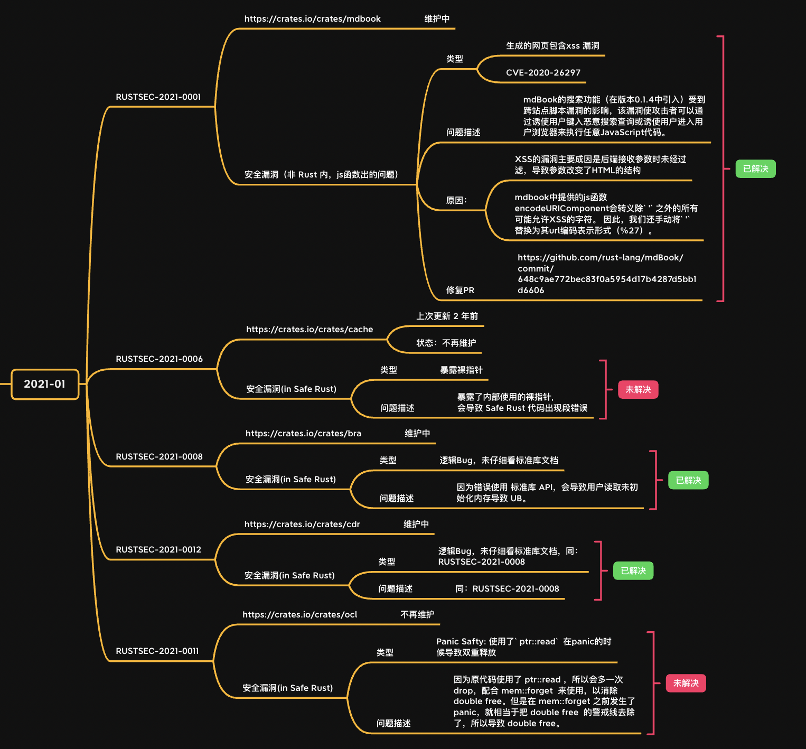
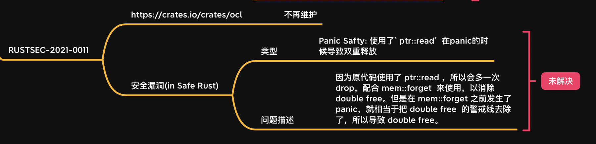

# `Rust`生态安全漏洞总结系列 | Part 1

作者：张汉东
后期编辑：张汉东

本系列主要是分析[`RustSecurity` 安全数据库库](https://rustsec.org/advisories/)中记录的`Rust`生态社区中发现的安全问题，从中总结一些教训，学习`Rust`安全编程的经验。

---

作为本系列文章的首篇文章，我节选了[`RustSecurity` 安全数据库库](https://rustsec.org/advisories/)中 2021 年 1 月份记录的前五个安全漏洞来进行分析。




## 01 | Mdbook XSS 漏洞 (RUSTSEC-2021-0001)


正好《Rust 中文精选（RustMagazine）》也用了 mdbook，不过读者朋友不用害怕，本刊用的 mdbook 是修补了该漏洞的版本。

该漏洞并非 Rust 导致，而是生成的网页中 JS 函数使用错误的问题。

漏洞描述：

问题版本的 mdBook 中搜索功能（在版本`0.1.4`中引入）受到跨站点脚本漏洞的影响，该漏洞使攻击者可以通过诱使用户键入恶意搜索查询或诱使用户进入用户浏览器来执行任意`JavaScript`代码。

漏洞成因分析：

XSS的漏洞主要成因是后端接收参数时未经过滤，导致参数改变了HTML的结构。而`mdbook`中提供的`js`函数`encodeURIComponent`会转义除`'`之外的所有可能允许`XSS`的字符。 因此，还需要手动将`'`替换为其`url`编码表示形式（％27）才能解决该问题。

[修复 PR](https://github.com/rust-lang/mdBook/commit/648c9ae772bec83f0a5954d17b4287d5bb1d6606) 也很简单。

## 02 | 暴露裸指针导致段错误 (RUSTSEC-2021-0006)


该漏洞诞生于第三方库[cache](https://crates.io/crates/cache)，该库虽然已经两年没有更新了，但是它里面出现的安全漏洞的警示作用还是有的。该库[问题`issue`](https://github.com/krl/cache/issues/2)中说明了具体的安全漏洞。

该安全漏洞的特点是，因为库接口中将裸指针（raw pointer) 公开了出来，所以该裸指针可能被用户修改为空指针，从而有段错误风险。因为这个隐患是导致 Safe Rust 出现 UB，所以是不合理的。

以下代码的注释分析了漏洞的产生。

```rust
use cache;


/**

    `cache crate` 内部代码：

    ```rust
    pub enum Cached<'a, V: 'a> {
        /// Value could not be put on the cache, and is returned in a box
        /// as to be able to implement `StableDeref`
        Spilled(Box<V>),
        /// Value resides in cache and is read-locked.
        Cached {
            /// The readguard from a lock on the heap
            guard: RwLockReadGuard<'a, ()>,
            /// A pointer to a value on the heap
            // 漏洞风险
            ptr: *const ManuallyDrop<V>,
        },
        /// A value that was borrowed from outside the cache.
        Borrowed(&'a V),
    }

    ```
**/
fn main() {
    let c = cache::Cache::new(8, 4096);
    c.insert(1, String::from("test"));
    let mut e = c.get::<String>(&1).unwrap();

    match &mut e {
        cache::Cached::Cached { ptr, .. } => {
            // 将 ptr 设置为 空指针，导致段错误
            *ptr = std::ptr::null();
        },
        _ => panic!(),
    }
    // 输出：3851，段错误
    println!("Entry: {}", *e);
}

```

启示：

所以，这里我们得到一个教训，就是不能随便在公开的 API 中暴露裸指针。值得注意的是，该库处于失去维护状态，所以这个漏洞还没有被修正。


## 03 | 读取未初始化内存导致`UB` (RUSTSEC-2021-0008)


该漏洞诞生于 [bra](https://crates.io/crates/bra) 库。该库这个安全漏洞属于逻辑 Bug 。因为错误使用 标准库 API，从而可能让用户读取未初始化内存导致 UB。

披露该漏洞的[issue](https://github.com/Enet4/bra-rs/issues/1)。目前该漏洞已经被修复。

以下代码注释保护了对漏洞成因对分析：

```rust
// 以下是有安全风险的代码示例：
impl<R> BufRead for GreedyAccessReader<R>
    where
        R: Read,
{
    fn fill_buf(&mut self) -> IoResult<&[u8]> {
        if self.buf.capacity() == self.consumed {
            self.reserve_up_to(self.buf.capacity() + 16);
        }

        let b = self.buf.len();
        let buf = unsafe {
            // safe because it's within the buffer's limits
            // and we won't be reading uninitialized memory
            // 这里虽然没有读取未初始化内存，但是会导致用户读取
            std::slice::from_raw_parts_mut(
                self.buf.as_mut_ptr().offset(b as isize),
                self.buf.capacity() - b)
        };

        match self.inner.read(buf) {
            Ok(o) => {
                unsafe {
                    // reset the size to include the written portion,
                    // safe because the extra data is initialized
                    self.buf.set_len(b + o);
                }

                Ok(&self.buf[self.consumed..])
            }
            Err(e) => Err(e),
        }
    }

    fn consume(&mut self, amt: usize) {
        self.consumed += amt;
    }
}
```

`GreedyAccessReader::fill_buf`方法创建了一个未初始化的缓冲区,并将其传递给用户提供的Read实现（`self.inner.read（buf）`）。这是不合理的，因为它允许`Safe Rust`代码表现出未定义的行为（从未初始化的内存读取）。

在标准库`Read` trait 的 `read` 方法文档中所示：

> 您有责任在调用`read`之前确保`buf`已初始化。
> 用未初始化的`buf`（通过`MaybeUninit <T>`获得的那种）调用`read`是不安全的，并且可能导致未定义的行为。
https://doc.rust-lang.org/std/io/trait.Read.html#tymethod.read

解决方法：

在`read`之前将新分配的`u8`缓冲区初始化为零是安全的，以防止用户提供的`Read`读取新分配的堆内存的旧内容。

修正代码：

```rust
// 修正以后的代码示例，去掉了未初始化的buf：
impl<R> BufRead for GreedyAccessReader<R>
    where
        R: Read,
{
    fn fill_buf(&mut self) -> IoResult<&[u8]> {
        if self.buf.capacity() == self.consumed {
            self.reserve_up_to(self.buf.capacity() + 16);
        }

        let b = self.buf.len();
        self.buf.resize(self.buf.capacity(), 0);
        let buf = &mut self.buf[b..];
        let o = self.inner.read(buf)?;

        // truncate to exclude non-written portion
        self.buf.truncate(b + o);

        Ok(&self.buf[self.consumed..])
    }

    fn consume(&mut self, amt: usize) {
        self.consumed += amt;
    }
}
```

启示：

该漏洞给我们对启示是，要写出安全的 Rust 代码，还必须掌握每一个标准库里 API 的细节。否则，逻辑上的错误使用也会造成`UB`。

## 04 | 读取未初始化内存导致`UB`  (RUSTSEC-2021-0012)


该漏洞诞生于第三方库[cdr-rs]中，漏洞相关[issue](https://github.com/hrektts/cdr-rs/issues/10)中。

该漏洞和 RUSTSEC-2021-0008 所描述漏洞风险是相似的。

`cdr-rs` 中的 `Deserializer::read_vec`方法创建一个未初始化的缓冲区，并将其传递给用户提供的`Read`实现（self.reader.read_exact）。

这是不合理的，因为它允许安全的`Rust`代码表现出未定义的行为（从未初始化的内存读取）。

漏洞代码：

```rust
fn read_vec(&mut self) -> Result<Vec<u8>> {
    let len: u32 = de::Deserialize::deserialize(&mut *self)?;
    // 创建了未初始化buf
    let mut buf = Vec::with_capacity(len as usize);
    unsafe { buf.set_len(len as usize) }
    self.read_size(u64::from(len))?;
    // 将其传递给了用户提供的`Read`实现
    self.reader.read_exact(&mut buf[..])?;
    Ok(buf)
}
```

修正：

```rust
fn read_vec(&mut self) -> Result<Vec<u8>> {
    let len: u32 = de::Deserialize::deserialize(&mut *self)?;
    // 创建了未初始化buf
    let mut buf = Vec::with_capacity(len as usize);
    // 初始化为 0；
    buf.resize(len as usize, 0);
    self.read_size(u64::from(len))?;
    // 将其传递给了用户提供的`Read`实现
    self.reader.read_exact(&mut buf[..])?;
    Ok(buf)
}
```

启示：同上。

## 05 | Panic Safety && Double free (RUSTSEC-2021-0011)



该漏洞诞生于[ocl](https://crates.io/crates/ocl)库，漏洞相关[issue](https://github.com/cogciprocate/ocl/issues/194)。该库已经处于不再维护状态，但是这个漏洞背后的成因需要引起我们重视。

该库中使用了`ptr::read`，并且没有考虑好`Panic Safety`的情况，所以会导致双重释放（double free)。

以下两段代码是漏洞展示，注意注释部分都解释：

```rust
//case 1
macro_rules! from_event_option_array_into_event_list(
    ($e:ty, $len:expr) => (
        impl<'e> From<[Option<$e>; $len]> for EventList {
                fn from(events: [Option<$e>; $len]) -> EventList {
                    let mut el = EventList::with_capacity(events.len());
                    for idx in 0..events.len() {
                    // 这个 unsafe 用法在 `event.into()`调用panic的时候会导致双重释放
                        let event_opt = unsafe { ptr::read(events.get_unchecked(idx)) };
                        if let Some(event) = event_opt { el.push::<Event>(event.into()); }
                    }
                    // 此处 mem::forget 就是为了防止 `dobule free`。
                    // 因为 `ptr::read` 也会制造一次 drop。
                    // 所以上面如果发生了panic，那就相当于注释了 `mem::forget`，导致`dobule free`
                    mem::forget(events);
                    el
                }
        }
    )
);

// case2

impl<'e, E> From<[E; $len]> for EventList where E: Into<Event> {
    fn from(events: [E; $len]) -> EventList {
        let mut el = EventList::with_capacity(events.len());
        for idx in 0..events.len() {
        // 同上
            let event = unsafe { ptr::read(events.get_unchecked(idx)) };
            el.push(event.into());
        }
        // Ownership has been unsafely transfered to the new event
        // list without modifying the event reference count. Not
        // forgetting the source array would cause a double drop.
        mem::forget(events);
        el
    }
}
```

以下是一段该漏洞都复现代码（我本人没有尝试过，但是提交issue都作者试过了），注意下面注释部分的说明：

```rust
// POC:以下代码证明了上面两个case会发生dobule free 问题

use fil_ocl::{Event, EventList};
use std::convert::Into;

struct Foo(Option<i32>);

impl Into<Event> for Foo {
    fn into(self) -> Event {
        /*
        根据文档，`Into <T>`实现不应出现 panic。但是rustc不会检查Into实现中是否会发生恐慌，
        因此用户提供的`into（）`可能会出现风险
        */
        println!("LOUSY PANIC : {}", self.0.unwrap()); // unwrap 是有 panic 风险

        Event::empty()
    }
}

impl Drop for Foo {
    fn drop(&mut self) {
        println!("I'm dropping");
    }
}

fn main() {
    let eventlist: EventList = [Foo(None)].into();
    dbg!(eventlist);
}

```

以下是 Fix 漏洞的代码，使用了`ManuallyDrop`，注意注释说明：

```rust
macro_rules! from_event_option_array_into_event_list(
    ($e:ty, $len:expr) => (
        impl<'e> From<[Option<$e>; $len]> for EventList {
            fn from(events: [Option<$e>; $len]) -> EventList {
                let mut el = ManuallyDrop::new(
                    EventList::with_capacity(events.len())
                );

                for idx in 0..events.len() {
                    let event_opt = unsafe {
                        ptr::read(events.get_unchecked(idx))
                    };

                    if let Some(event) = event_opt {
                        // Use `ManuallyDrop` to guard against
                        // potential panic within `into()`.
                        // 当 into 方法发生 panic 当时候，这里 ManuallyDrop 可以保护其不会`double free`
                        let event = ManuallyDrop::into_inner(
                            ManuallyDrop::new(event)
                            .into()
                        );
                        el.push(event);
                    }
                }
                mem::forget(events);
                ManuallyDrop::into_inner(el)
            }
        }
    )
);

```

启示：

在使用 `std::ptr` 模块中接口需要注意，容易产生 UB 问题，要多多查看 API 文档。

