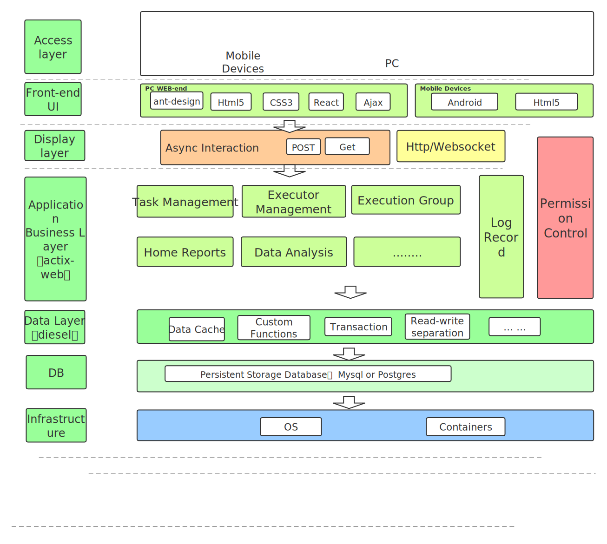

# `Delicate` 为什么从 `actix-web` 迁移到 `poem`

作者： 槟橙炮炮

> 槟橙炮炮离开了原来的工作岗位，准备找一份新的工作。如果你对他的工作感兴趣并需要一名 Rust工程师，请与他联系 `binchengZhao@outlook.com` .

---

## What is delicate ?

[delicate](https://github.com/BinChengZhao/delicate) 一个轻量的分布式的任务调度平台. 


<a href="">
    
</a>


## 特性
- **友好的用户界面：** [前端]方便地管理任务和执行器，监控其状态，支持手动维护运行中的任务等。

- **灵活的操作：** 灵活的任务操作，支持限制单个节点的最大并行数，与cron表达式相对应的时区设置，调度模式（单一、固定数量、不断重复），能够在任何时候手动触发任务，手动终止任务实例，在线查看任务日志。

- **高可用性：** Delicate支持横向扩展。通过部署尽可能多的Delicate服务器和执行器，很容易实现高可用性和性能。

- **高性能：** 轻量级和基本功能加快了性能，`delicate'的基本资源开销大约是（小于0.1%的cpu使用率，10m的内存.)

- **可观察性:** 有许多有意义的统计数据定期以图表的方式展现。

- **升级：** 系统的动态升级（升级是通过获得最新的源代码和进行数据库迁移.)

- **复用性：**  执行器提供`restful-api` ，可以让用户应用维护自定义任务.

- **权限管理：**  基于casbin实现的权限管理功能，持续优化体验.


`delicate` 架构图:




项目效果图参见：[https://github.com/BinChengZhao/delicate/tree/main/doc/src/_media](https://github.com/BinChengZhao/delicate/tree/main/doc/src/_media)

### 技术栈

* 后端( scheduler & executor ): Rust  

* 原主要的依赖: (actix-web & diesel & delay-timer & serde & tracing)

* 现主要的依赖: (poem & tokio & diesel & delay-timer & serde & tracing)

* 前端: antd-admin (React)

* Ui: Ant Design

* 数据库: mysql , postgres (计划支持)


### 为什么要迁移到`poem`？

* 在使用 `actix-web` 迭代时， 由于`actix-web` 4 稳定版一直没有正式发布，想升级核心依赖，引入新功能， 却被动受限。技术栈革新是一个刻不容缓的计划，当`poem`发布时我知道机会来了。

* 在使用 `poem` 且透明的依赖tokio时，我感到了前所未有的灵活性。
直接使用tokio生态的组件，去代替原来 actix-web 的一些组件,并且把大量的依赖进行了升级，
再也不用自己人工制作补丁，或者使用陈旧的依赖。

#### 关于 `poem`的简要背景。

1. 该框架具有极快的性能，一致的理念，以及清晰的实现。
2. 基于`hyper`，与`tokio`结合，用户有更多的控制。


#### 迁移的重点：

1. 网络组件的重新组合，不同风格的维护应用状态。

2. api级别的修改，避免业务逻辑调整。


迁移前的基本梳理：

* poem中的`handler`是一个会生成一个`Future`的`Endpoint`对象，框架与`tokio`的协作可以让请求在多线程运行时中进行效计算。

   而actix-web则不是这样，它是内部由多个单线程的`Runtime`组成。
   由于这种微妙的差别，以前用于actix-web的`handler`不能直接用于`poem`，
   因为需要确保每一个`handler`的输入状态，并且保证跨越.await的值需要都Send。

* poem的路由是一个可嵌套的`Endpoint`数据结构，与原来`actix-web`的配置不同。

* poem公开的数据结构大多支持Send，可以高效利用线程资源， 而`actix-web`与之相反。

* 需要修改所有的中间件实现，改造所有的后台Task，调整所有的全局状态。

* 在直接依赖 `tokio` 1.0 的情况下升级多处依赖。

* 全链路的测试，并编写迁移纪要。


### 下面是一些 `poem` & `actix-web` 的对比:

#### 路由侧

之前基于`actix-web`的实现，大量路由组通过`configure`去注册， 应用状态通过 `app_data`注册，中间件通过`wrap`注册：

```rust
let app = App::new()
    .configure(actions::task::config)
    .configure(actions::user::config)
    .configure(actions::task_log::config)
    .configure(actions::executor_group::config)
    .configure(actions::executor_processor::config)
    .configure(actions::executor_processor_bind::config)
    .configure(actions::data_reports::config)
    .configure(actions::components::config)
    .configure(actions::operation_log::config)
    .configure(actions::user_login_log::config)
    .app_data(shared_delay_timer.clone())
    .app_data(shared_connection_pool.clone())
    .app_data(shared_scheduler_meta_info.clone())
    .wrap(components::session::auth_middleware())
    .wrap(components::session::session_middleware());
```

路由配置实例：

```rust
pub fn config(cfg: &mut web::ServiceConfig) {
    cfg.service(create_user)
        .service(show_users)
        .service(update_user)
        .service(delete_user)
        .service(login_user)
        .service(logout_user)
        .service(check_user)
        .service(change_password)
        .service(roles)
        .service(permissions)
        .service(append_permission)
        .service(delete_permission)
        .service(append_role)
        .service(delete_role);
}

```

`handler` 处理请求示例：

```rust
#[post("/api/user/create")]
async fn create_user(
    web::Json(user): web::Json<model::QueryNewUser>,
    pool: ShareData<db::ConnectionPool>,
) -> HttpResponse {

    // do someting.
}
```

现基于 `poem`的实现， 大量路由组通过Route去组织，可以多重嵌套。应用状态 & 中间件都是通过`with`注册， 所有的组件都有通用的特征 `Endpoint`：

```rust
let app = Route::new().nest_no_strip(
            "/api",
            Route::new()
                .nest_no_strip("/api/task", actions::task::route_config())
                .nest_no_strip("/api/user", actions::user::route_config())
                .nest_no_strip("/api/role", actions::role::route_config())
                .nest_no_strip("/api/task_log", actions::task_log::route_config())
                .nest_no_strip("/api/tasks_state", actions::data_reports::route_config())
                .nest_no_strip("/api/task_instance", actions::task_instance::route_config())
                .nest_no_strip("/api/binding", actions::components::binding::route_config())
                .nest_no_strip("/api/operation_log", actions::operation_log::route_config())
          )
          .with(shared_delay_timer)
          .with(shared_connection_pool)
          .with(shared_scheduler_meta_info)
          .with(shared_request_client)
          .with(components::session::auth_middleware())
          .with(components::session::cookie_middleware());

```

`poem`中的路由配置实例：

```rust
pub fn route_config() -> Route {
    Route::new()
        .at("/api/user/create", post(create_user))
        .at("/api/user/list", post(show_users))
        .at("/api/user/update", post(update_user))
        .at("/api/user/delete", post(delete_user))
        .at("/api/user/login", post(login_user))
        .at("/api/user/logout", post(logout_user))
        .at("/api/user/check", post(check_user))
        .at("/api/user/change_password", post(change_password))
        .at("/api/user/roles", post(roles))
        .at("/api/user/permissions", post(permissions))
        .at("/api/user/append_permission", post(append_permission))
        .at("/api/user/delete_permission", post(delete_permission))
        .at("/api/user/append_role", post(append_role))
        .at("/api/user/delete_role", post(delete_role))
}
```

`poem` 中 `handler` 处理请求示例：

```rust
async fn create_user(
    web::Json(user): web::Json<model::QueryNewUser>,
    pool: ShareData<db::ConnectionPool>,
) -> HttpResponse {

    // do someting.
}
```

### `poem` 理念的代入:

#### handler

`poem` 中的 handler, 与`actix-web`差异并不大只需要调整一些 `extractor`, 对于一些阻塞性的task，切换到`tokio`的api去计算

```rust
#[handler]

async fn show_task_log_detail(
    Json(query_params): Json<model::RecordId>,
    pool: Data<&Arc<db::ConnectionPool>>,
) -> impl IntoResponse {
    use db::schema::task_log_extend;

    if let Ok(conn) = pool.get() {
        let f_result = spawn_blocking::<_, Result<_, diesel::result::Error>>(move || {
            let task_log_extend = task_log_extend::table
                .find(query_params.record_id.0)
                .first::<model::TaskLogExtend>(&conn)?;

            Ok(task_log_extend)
        })
        .await;

        let log_extend = f_result
            .map(|log_extend_result| {
                Into::<UnifiedResponseMessages<model::TaskLogExtend>>::into(log_extend_result)
            })
            .unwrap_or_else(|e| {
                UnifiedResponseMessages::<model::TaskLogExtend>::error()
                    .customized_error_msg(e.to_string())
            });
        return Json(log_extend);
    }

    Json(UnifiedResponseMessages::<model::TaskLogExtend>::error())
}
```

#### Endpoint

`Endpoint` 抽象HTTP请求的Trait, 是所有 `handler` 的真实面貌。

你可以实现`Endpoint`来创建你自己的`Endpoint`处理器。

如下是`Endpoint`的定义:

```rust
/// An HTTP request handler.
#[async_trait::async_trait]
pub trait Endpoint: Send + Sync {
    /// Represents the response of the endpoint.
    type Output: IntoResponse;

    /// Get the response to the request.
    async fn call(&self, req: Request) -> Self::Output;
}
```

`poem` 的 `Endpoint` 哲学，跟tower中的`Service`非常相似，但是poem更简洁一些, 并且`poem`也兼容`tower`可以复用其生态与组件。

```rust
/// `Service` provides a mechanism by which the caller is able to coordinate
/// readiness. `Service::poll_ready` returns `Ready` if the service expects that
/// it is able to process a request.
pub trait Service<Request> {
    /// Responses given by the service.
    type Response;

    /// Errors produced by the service.
    type Error;

    /// The future response value.
    type Future: Future<Output = Result<Self::Response, Self::Error>>;

    /// Returns `Poll::Ready(Ok(()))` when the service is able to process 
    fn poll_ready(&mut self, cx: &mut Context<'_>) -> Poll<Result<(), Self::Error>>;

    /// Process the request and return the response asynchronously.
    fn call(&mut self, req: Request) -> Self::Future;
}
```

#### IntoResponse

`IntoResponse` 是响应数据的抽象。 

所有可以转换为HTTP响应的Response类型都应该实现IntoResponse，并且它们可以作为`handler`的返回值。

```rust
pub trait IntoResponse: Send {
    /// Consume itself and return [`Response`].
    fn into_response(self) -> Response;

    /// Wrap an `impl IntoResponse` to add a header.
    fn with_header<K, V>(self, key: K, value: V) -> WithHeader<Self>
    where
        K: TryInto<HeaderName>,
        V: TryInto<HeaderValue>,
        Self: Sized,
    {
        let key = key.try_into().ok();
        let value = value.try_into().ok();

        WithHeader {
            inner: self,
            header: key.zip(value),
        }
    }

    /// Wrap an `impl IntoResponse` to set a status code.
    fn with_status(self, status: StatusCode) -> WithStatus<Self>
    where
        Self: Sized,
    {
        WithStatus {
            inner: self,
            status,
        }
    }

    /// Wrap an `impl IntoResponse` to set a body.
    fn with_body(self, body: impl Into<Body>) -> WithBody<Self>
    where
        Self: Sized,
    {
        WithBody {
            inner: self,
            body: body.into(),
        }
    }
}

```

#### middleware

使用`poem`制作中间件非常的轻松，如下是一个给请求增加 logger-id 的middlware的示例：

```rust
// Unit-struct of logger-id for impl Middleware.
pub struct LoggerId;

impl<E: Endpoint> Middleware<E> for LoggerId {
    type Output = LoggerIdMiddleware<E>;

    fn transform(&self, ep: E) -> Self::Output {
        LoggerIdMiddleware { ep }
    }
}
// Wraps the original handler and logs the processing of the request internally.
pub struct LoggerIdMiddleware<E> {
    ep: E,
}

#[poem::async_trait]
impl<E: Endpoint> Endpoint for LoggerIdMiddleware<E> {
    type Output = E::Output;

    async fn call(&self, req: Request) -> Self::Output {
        let unique_id = get_unique_id_string();
        self.ep
            .call(req)
            .instrument(info_span!("logger-", id = unique_id.deref()))
            .await
    }
}

```

如下是actix-web 实现middlware的模板示例,模板代码确实稍有冗长,且耐人寻味。

```rust
pub(crate) struct CasbinService;

impl<S, B> Transform<S> for CasbinService
where
    S: Service<Request = ServiceRequest, Response = ServiceResponse<B>, Error = ActixWebError>
        + 'static,
    S::Future: 'static,
    B: 'static,
{
    type Request = ServiceRequest;
    type Response = ServiceResponse<B>;
    type Error = ActixWebError;
    type InitError = ();
    type Transform = CasbinAuthMiddleware<S>;
    type Future = Ready<Result<Self::Transform, Self::InitError>>;

    fn new_transform(&self, service: S) -> Self::Future {
        ok(CasbinAuthMiddleware {
            service: Rc::new(RefCell::new(service)),
        })
    }
}

pub struct CasbinAuthMiddleware<S> {
    service: Rc<RefCell<S>>,
}


impl<S, B> Service for CasbinAuthMiddleware<S>
where
    S: Service<Request = ServiceRequest, Response = ServiceResponse<B>, Error = ActixWebError>
        + 'static,
    S::Future: 'static,
    B: 'static,
{
    type Request = ServiceRequest;
    type Response = ServiceResponse<B>;
    type Error = ActixWebError;
    type Future = MiddlewareFuture<Self::Response, Self::Error>;

    fn poll_ready(&mut self, cx: &mut Context<'_>) -> Poll<Result<(), Self::Error>> {
        self.service.poll_ready(cx)
    }

    fn call(&mut self, req: ServiceRequest) -> Self::Future {
        Box::pin(async move {

           // do something.
           return service.call(req).await;
        })
    }
```

## 总结

0. 本次迁移涉及到45个文件的修改和4000行代码的修改（增加了2500行，删除了1579行）。

1. 切换到`poem`上，陈旧依赖得以升级，且透明的依赖tokio生态时，项目拥有了前所未有的灵活性。再也不用自己人工制作补丁，或者使用陈旧的依赖。

2. 迁移后有了`poem` & `tokio` 生态加持更容易扩展功能，也降低了维护成本。

3. 在不影响性能指标的情况下，更好的提升了资源利用率，发挥多核优势。


## 感谢

在迁移过程中，我有一些需求使用`poem` 是无法直接处理
随后在 `poem` 上打开了几个issues，不到一天内就与作者沟通完成，并在`poem`支持了该功能，太强大了！

- 我要感谢整个社区和代码贡献者。特别是`poem`的作者:
[油条哥](https://github.com/sunli829)
- 感谢用户报告文档中的拼写错误, 这非常感谢大家。
- 感谢用户加入我们，提供反馈，讨论功能，并获得帮助!
- 我也很感谢`actix-web`社区这么好的作品，因为技术选择问题，我决定迁移到`poem`。


### Repos:

[poem](https://github.com/poem-web/poem)

[delicate](https://github.com/BinChengZhao/delicate)
