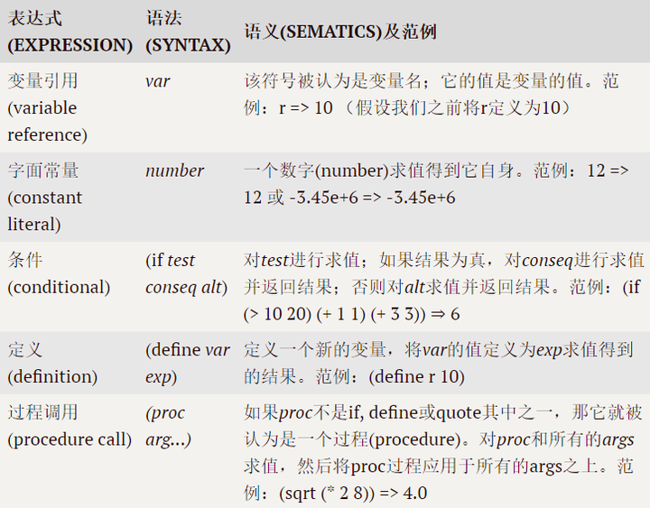

>* 文章标题：用 Rust 实现 Lisp 解释器
>* 深度参考：https://stopachka.essay.dev/post/5/risp-in-rust-lisp
>* 本文作者：[suhanyujie](https://github.com/suhanyujie/rust-cookbook-note)
>* 文章来自：https://github.com/suhanyujie/rust-cookbook-note
>* ps：水平有限，翻译不当之处，还请指正，谢谢！

## 前言
一段时间没有写 Rust 了，感觉有些生疏了，打算找个 Rust 小项目复习一下。在[芽之家](https://blog.budshome.com/)博客看到了这个博文，讲的是用 Rust [实现 lisp](https://stopachka.essay.dev/post/5/risp-in-rust-lisp)。有感兴趣的同学，可以一起看看。

作者介绍到，这是他的第一个练手项目，有些地方可能会实现的不是很好，但我觉得也是很有参考价值的，尤其是对于我这样的 Rust 新手。此外，作者还提到了另一篇 [python 实现 lisp](http://norvig.com/lispy.html)，这应该也是参考资料之一。

## Lisp
在开始前，我们需要了解一些关于 lisp 的背景知识。[Lisp](https://zh.wikipedia.org/wiki/LISP) 是一种高阶编程语言，在其基础上演变出了很多中方言，如：Scheme、Common Lisp 等。查阅了下百度百科，其描述可读性不强，建议阅读维基百科的[描述](https://zh.wikipedia.org/wiki/LISP)，或者这个 [Lisp 教程](https://www.yiibai.com/lisp/lisp_overview.html)。

在实现一个 Lisp（子集）的解析器之前，先要了解 Lisp 的[语法规则](https://www.yiibai.com/lisp/lisp_basic_syntax.html)。如果你想大概了解一下它的语法和简单使用，可以自己在本地[安装一个环境](https://lisp-lang.org/learn/getting-started/)，并尝试。这里以 Ubuntu 20.04 为例。可通过以下命令安装一个 common lisp 的实现 —— sbcl，用于熟悉 lisp：

```
sudo apt-get install sbcl
```

然后，在命令行中输入 sbcl，即可进入它的交互式命令行：

```
$ sbcl
This is SBCL 2.0.1.debian, an implementation of ANSI Common Lisp.
More information about SBCL is available at <http://www.sbcl.org/>.

SBCL is free software, provided as is, with absolutely no warranty.
It is mostly in the public domain; some portions are provided under
BSD-style licenses.  See the CREDITS and COPYING files in the
distribution for more information.
```

输入一个加法运算试一试：

```
$ * (+ 1 2)
3
```

可以看到，能得到计算后地结果 —— 3。

关于更多关于 Lisp 的语法在这里就不详细说明了，可以参考这个[教程](https://www.yiibai.com/lisp/lisp_basic_syntax.html)进行进一步学习。

## Lisp 的算术运算
为了能尽快地实现目标，我们只是简单地实现一个类似于计算器的运算功能，别看只是一个小小的计算器，但也包含了很多的基础知识。

在开始之前，我们先确定好最终的目标，我们最终实现的效果如下：

```
(+ 10 5) //=> 15
(- 10 5) //=> 5
```

输入简单的 lisp 程序，就能输出对应的计算结果。在开始之前，先介绍一下我们的程序执行，所经历的大体过程：

> 程序 -> parse（解析） -> 抽象语法树 -> eval（执行） -> 结果

这个过程中的 parse 和 eval 就是我们要实现的功能。比如下面这个程序示例：

```
$ (+ 1 2)
3
$ (* 2 3)
6
```

换句话说，就是我们需要将我们输入的源代码解析转换成语法树，然后执行语法树就能得到我们想要的结果。而源码中，我们只需有三类输入：

* 符号
* 数值
* 列表

将其用 Rust 枚举类型表示，如下：

```rust
#[derive(Clone)]
enum RispExp {
  Symbol(String),
  Number(f64),
  List(Vec<RispExp>),
}
```

你可能有些疑惑，没关系，我们继续向后看。

在解析源码时，我们会遇到错误，因此需要定义错误类型：

```Rust
enum RispErr {
    Reason(String),
}
```

如果你想定义更健壮、好用的错误类型，可以[参考这个](https://news.ycombinator.com/item?id=19812159)。但这里，为了简化实现，我们只是将错误类型定义成一个枚举变体 `Reason(String)`，一旦遇到异常，我们将异常信息装入其中，返回给调用方即可。

我们还需要一个作用域类型，用它来存储定义的变量、内置函数等。

```rust
#[derive(Clone)]
struct RispEnv {
  data: HashMap<String, RispExp>,
}
```

## 解析
根据前面的过程描述，我们要将源码解析成语法树，也就是 RispExp 的表示形式。这样做之前，我们需要将源码解析成一个一个 token。

比如我们的输入是 `(+ 10 5)`，将其 token 化的结果是 `["(", "+", "10", "5", ")"]`。使用 Rust 实现如下：

```rust
fn tokenize(expr: String) -> Vec<String> {
    expr.replace("(", " ( ")
        .replace(")", " ) ")
        .split_whitespace()
        .map(|x| x.to_string())
        .collect()
}
```

根据 lisp 表达式的规则，表达式一般都是由小括号包裹起来的，为了更好的通过空格分割 token，我们将小括号替换为两边各带有一个空格的括号。然后通过 split_whitespace 函数将字符串进行分割，并把每段字符串转换成带所有权的字符串，最后通过 collect 收集，以字符串数组的形式存放到变量中。

然后通过 parse 函数将其转化成 RispExp 类型结构：

```rust
fn parse<'a>(tokens: &'a [String]) -> Result<(RispExp, &'a [String]), RispErr> {
    let (token, rest) = tokens
        .split_first()
        .ok_or(RispErr::Reason("could not get token".to_string()))?;
    match &token[..] {
        "(" => read_seq(rest),
        ")" => Err(RispErr::Reason("unexpected `)`".to_string())),
        _ => Ok((parse_atom(token), rest)),
    }
}

fn read_seq<'a>(tokens: &'a [String]) -> Result<(RispExp, &'a [String]), RispErr> {
    let mut res: Vec<RispExp> = vec![];
    let mut xs = tokens;
    loop {
        let (next_token, rest) = xs
            .split_first()
            .ok_or(RispErr::Reason("could not find closing `)`".to_string()))?;
        if next_token == ")" {
            return Ok((RispExp::List(res), rest));
        }
        let (exp, new_xs) = parse(&xs)?;
        res.push(exp);
        xs = new_xs;
    }
}
```

得到 token 列表后，我们对 token 逐个解析，通过 split_first 取出 token 列表中的第一个 token，以及第一个以外的其余元素。
对第一个 token 进行模式匹配：

* 如果表达式以 `(` 开头，则调用 read_seq 读取表达式剩余部分的 token
* 如果表达式以 `)` 开头，则意味着当前表达式是错误的表达式。
* 以上之外，则是要按正常情况解析 lisp 表达式中的原子 —— [atom](https://www.yiibai.com/lisp/lisp_basic_syntax.html)。parse_atom 的实现如下：

```rust
fn parse_atom(token: &str) -> RispExp {
    let potential_float: Result<f64, ParseFloatError> = token.parse();
    match potential_float {
        Ok(v) => RispExp::Number(v),
        Err(_) => RispExp::Symbol(token.to_string().clone()),
    }
}
```

根据[语法规则](https://www.yiibai.com/lisp/lisp_basic_syntax.html)，一个原子是一个数字连续字符或字符串，它包括数字和特殊字符。
我们先尝试将其解析为数值类型，如果解析失败，则意味着它是字符串 —— RispExp::Symbol(token.to_string().clone())。

我们会在全局符号表中存储变量的定义和函数定义，因此我们需要扩展一下 RispExp：

```rust
#[derive(Clone)]
enum RispExp {
    Symbol(String),
    Number(f64),
    List(Vec<RispExp>),
    Func(fn(&[RispExp]) -> Result<RispExp, RispErr>), // new
}
```

我们先创建一个存储特定符号的容器，每一个符号都有特殊的功能：

```rust
fn default_env() -> RispEnv {
    let mut data: HashMap<String, RispExp> = HashMap::new();
    data.insert(
        "+".to_string(),
        RispExp::Func(|args: &[RispExp]| -> Result<RispExp, RispErr> {
            let sum = parse_list_of_floats(args)?
                .iter()
                .fold(0.0, |sum, a| sum + a);
            Ok(RispExp::Number(sum))
        }),
    );
    data.insert(
        "-".to_string(),
        RispExp::Func(|args: &[RispExp]| -> Result<RispExp, RispErr> {
            let floats = parse_list_of_floats(args)?;
            let first = *floats
                .first()
                .ok_or(RispErr::Reason("expected at least one number".to_string()))?;
            let sum_of_rest = floats[1..].iter().fold(0.0, |sum, a| sum + a);

            Ok(RispExp::Number(first - sum_of_rest))
        }),
    );

    RispEnv { data }
}
```

这里我们先实现 `+`、`-` 运算符的功能。并且为了简化实现，我们先简单粗暴地认为参数都是合法的数值类型，可以通过 parse_list_of_floats 解析这些参数：

```rust
fn parse_list_of_floats(args: &[RispExp]) -> Result<Vec<f64>, RispErr> {
    args.iter().map(|x| parse_single_float(x)).collect()
}

fn parse_single_float(exp: &RispExp) -> Result<f64, RispErr> {
    match exp {
        RispExp::Number(num) => Ok(*num),
        _ => Err(RispErr::Reason("expect a number".to_string())),
    }
}
```

## 执行
接下来是实现 eval（程序执行）部分了。
* 1.程序体（表达式）的第一部分如果是标识符，则在全局环境中查询该标识符，如果存在，则返回（如果是 `+`、`-` 等操作符，则返回 `RispExp::Func` 类型的操作逻辑实现）。
* 2.如果是数值，则返回该数值
* 3.如果是列表，则尝试步骤一。即先返回 `RispExp::Func`（函数类型），然后列表中的其他原子作为参数执行该函数。

```rust
fn eval(exp: &RispExp, env: &mut RispEnv) -> Result<RispExp, RispErr> {
    match exp {
        RispExp::Symbol(k) => env
            .data
            .get(k)
            .ok_or(RispErr::Reason(format!("unexpected symbol k={}", k)))
            .map(|x| x.clone()),
        RispExp::Number(_a) => Ok(exp.clone()),
        RispExp::List(list) => {
            let first_form = list
                .first()
                .ok_or(RispErr::Reason("expected a non-empty list".to_string()))?;
            let arg_forms = &list[1..];
            let first_eval = eval(first_form, env)?;
            match first_eval {
                RispExp::Func(f) => {
                    let args_eval = arg_forms
                        .iter()
                        .map(|x| eval(x, env))
                        .collect::<Result<Vec<RispExp>, RispErr>>();
                    f(&args_eval?)
                }
                _ => Err(RispErr::Reason("first form must be a function".to_string())),
            }
        }
        RispExp::Func(_) => Err(RispErr::Reason("unexpected form".to_string())),
    }
}
```

前面提到过，我们要实现一个简单的计算器，而 lisp 的计算表达式一般是以符号原子开始的，如：`(+ 1 2)`。
当把这个表达式转换为 RispExp 结构后的形式类似于：

```
// 伪代码
PlusFunc(
  num1,
  num2,
  ...
)
```

我们先通过 `+` 匹配到事先在 default_env 中注册好的函数 f，然后向该函数中传入第一个原子之后的所有参数：`f(num1, num2)`，就能得到执行结果。

## REPL
REPL 的全称是 Read Evel Print Loop，表示一种交互形式：读取 -> 执行 -> 打印结果 -> 循环。

针对前面实现的 lisp 子集，我们可以为其实现一个 repl，用于更好的使用该“lisp 解释器”。

我们要做的很简单，读取用户输入，然后解析执行，把执行结果打印出来，然后不断地循环整个过程。那接下来，把解释器的实现用循环包裹起来试试：

```rust
fn parse_eval(expr: String, env: &mut RispEnv) -> Result<RispExp, RispErr> {
    let (parsed_exp, _) = parse(&tokenize(expr))?;
    let evaled_exp = eval(&parsed_exp, env)?;
    Ok(evaled_exp)
}
```

获取用户输入的表达式，再调用 parse_eval：

```rust
fn slurp_expr() -> String {
    let mut expr = String::new();
    io::stdin()
        .read_line(&mut expr)
        .expect("Failed to read line");
    expr
}

pub fn run_repl() {
    let env = &mut default_env();
    loop {
        println!("risp >");
        let expr = slurp_expr();
        match parse_eval(expr, env) {
            Ok(res) => println!("// 🔥 => {}", res),
            Err(e) => match e {
                RispErr::Reason(msg) => println!("// 🙀 => {}", msg),
            },
        }
    }
}
```

好了，接下来我们把 run_repl 放入 main 函数中：

```rust
fn main() {
    run_repl();
}
```

大功告成！我们只需在命令行中输入 `cargo run` 即可启动你的 repl 程序。完整的代码可以[点此查看](../src/notes/lisp1)。

启动后，输入简单的 lisp 表达式，看看效果：

```
risp >
(+ 1 2 )
// 🔥 => 3
risp >
(+ 1 10 (+ 20 1))
// 🔥 => 32
```

可以看出，单一的表达式和嵌套的表达式的加、减法都可以正确地计算出结果。这样，我们算是实现了这个简单的加减法计算。

## 版本 0.1.1
目前，我们的“lisp”仅支持简单的加、减等算数运算，我们需要扩展它。先给它增加 bool 类型的支持。

```rust
#[derive(Clone)]
enum RispExp {
    Symbol(String),
    Number(f64),
    List(Vec<RispExp>),
    Func(fn(&[RispExp]) -> Result<RispExp, RispErr>),
    Bool(bool),  // ->new
}
```

对应的我们需要调整 parse_atom 中的代码：

```rust
fn parse_atom(token: &str) -> RispExp {
    match token {
        "true" => {
            RispExp::Bool(true)
        },
        "false" => {
            RispExp::Bool(false)
        },
        _ => {
            let potential_float: Result<f64, ParseFloatError> = token.parse();
            match potential_float {
                Ok(v) => RispExp::Number(v),
                Err(_) => RispExp::Symbol(token.to_string().clone()),
            }
        }
    }
}
```

有了布尔类型之后，我们可以实现 `>`，`<`，`=` 等比较运算符，因为通过这些运算符计算后的结果值是布尔值。

要能支持这些比较运算符，我们需要将 `=` 对应的处理逻辑加到 default_env 中：

```rust
// = 逻辑实现
data.insert(
    "=".to_string(),
    RispExp::Func(|args: &[RispExp]| -> Result<RispExp, RispErr> {
        let floats = parse_list_of_floats(args)?;
        // 要想比较，需要有两个值
        if floats.len() != 2 {
            return Err(RispErr::Reason("expected two number".to_string()));
        }
        // 将第 0 个元素和第 1 个元素进行比较
        if floats.get(0).is_none() || floats.get(1).is_none() {
            return Err(RispErr::Reason("expected number".to_string()));
        }
        let is_ok = floats.get(0).unwrap().eq(floats.get(1).unwrap());
        Ok(RispExp::Bool(is_ok))
    }),
);
```

此时，我们的 lisp 解释器已经支持了 `=` 的操作，使用 `cargo run` 运行 repl：

```
risp >
(= 12 12)
// 🔥 => true
risp >
(= 1 2 3)
// 🙀 => expected two number
risp >
```

真不错，我们实现了 `=` 操作的扩展支持。我们还需要继续支持 `>`、`>=`、`<`、`<=`。以 `>=` 为例，将其实现加入到 default_env 函数中：

```rust
data.insert(
    ">=".to_string(),
    RispExp::Func(|args: &[RispExp]| -> Result<RispExp, RispErr> {
        let floats = parse_list_of_floats(args)?;
            // 要想比较，需要有两个值
        if floats.len() != 2 {
            return Err(RispErr::Reason("expected two number".to_string()));
        }
            // 校验这两个值必须存在
        if floats.get(0).is_none() || floats.get(1).is_none() {
            return Err(RispErr::Reason("expected number".to_string()));
        }
        Ok(RispExp::Bool(
            floats.get(0).unwrap().gt(floats.get(1).unwrap()),
        ))
    }),
);
```

根据[原博客](https://stopachka.essay.dev/post/5/risp-in-rust-lisp#comparison-operators#language-12-almost-risp)，为了简化代码，这部分的实现可以用宏实现：

```rust
macro_rules! ensure_tonicity {
    ($check_fn:expr) => {{
        |args: &[RispExp]| -> Result<RispExp, RispErr> {
            let floats = parse_list_of_floats(args)?;
            let first = floats
                .first()
                .ok_or(RispErr::Reason("expected at least one number".to_string()))?;
            let rest = &floats[1..];
            fn f(prev: &f64, xs: &[f64]) -> bool {
                match xs.first() {
                    Some(x) => $check_fn(prev, x) && f(x, &xs[1..]),
                    None => true,
                }
            };
            Ok(RispExp::Bool(f(first, rest)))
        }
    }};
}

data.insert(
    ">".to_string(),
    RispExp::Func(ensure_tonicity!(|a, b| a > b)),
);

data.insert(
    "<".to_string(),
    RispExp::Func(ensure_tonicity!(|a, b| a < b)),
);

data.insert(
    "<=".to_string(),
    RispExp::Func(ensure_tonicity!(|a, b| a <= b)),
);
```

这样就实现了所有比较运算符的处理逻辑了。

要实现一个更接近 lisp 的语言，我们还需要引入 `def` 和 `if` 这两关键字了。这两关键字的作用见下表：



_图片来自[知乎专栏](https://zhuanlan.zhihu.com/p/28989326)_

因此，我们先更新 eval 函数，使其**优先**匹配**内置标识符**（关键字），如果不是关键字，则直接按照原先逻辑执行：

```
fn eval(exp: &RispExp, env: &mut RispEnv) -> Result<RispExp, RispErr> {
    match exp {
        ...
        ...

        RispExp::List(list) => {
            let first_form = list
                .first()
                .ok_or(RispErr::Reason("expected a non-empty list".to_string()))?;
            let arg_forms = &list[1..];
            // 优先匹配并处理“关键字”
            match eval_built_in_form(first_form, arg_forms, env) {
                Some(built_in_res) => built_in_res,
                None => {
                    let first_eval = eval(first_form, env)?;
                    match first_eval {
                        RispExp::Func(f) => {
                            let args_eval = arg_forms
                                .iter()
                                .map(|x| eval(x, env))
                                .collect::<Result<Vec<RispExp>, RispErr>>();
                            f(&args_eval?)
                        }
                        _ => Err(RispErr::Reason("first form must be a function".to_string())),
                    }
                }
            }
        }
        RispExp::Func(_) => Err(RispErr::Reason("unexpected form".to_string())),
    }
}

// 处理内置标识符
fn eval_built_in_form(
    exp: &RispExp,
    other_args: &[RispExp],
    env: &mut RispEnv,
) -> Option<Result<RispExp, RispErr>> {
    match exp {
        RispExp::Symbol(symbol) => match symbol.as_ref() {
            "if" => Some(eval_if_args(other_args, env)),
            "def" => Some(eval_def_args(other_args, env)),
            _ => None,
        },
        _ => None,
    }
}

fn eval_if_args(args: &[RispExp], env: &mut RispEnv) -> Result<RispExp, RispErr> {
    let test_form = args
        .first()
        .ok_or(RispErr::Reason("expected test form".to_string()))?;
    let test_eval = eval(test_form, env)?;
    match test_eval {
        RispExp::Bool(b) => {
            let form_idx = if b { 1 } else { 2 };
            let res_form = args
                .get(form_idx)
                .ok_or(RispErr::Reason(format!("expected form idx={}", form_idx)))?;
            let res_eval = eval(res_form, env);
            res_eval
        }
        _ => Err(RispErr::Reason(format!(
            "unexpected test form='{}'",
            test_form.to_string()
        ))),
    }
}
```

根据上图表格中的描述，`if` 语法如下：`(if test conseq alt)`，对 `test` 表达式求值，如果为真，则对 `conseq` 表达式求值并返回；否则，对 `alt` 表达式求值并返回。例如：`(if (> 10 20) (+ 2 3) (- 1 2))`。

同理，`def` 语法：`(def var exp)`。用于定义一个新的变量 `var`，它的值是 `exp` 表达式的值，例如：`(def k1 10)`。逻辑实现如下：

```rust
fn eval_def_args(args: &[RispExp], env: &mut RispEnv) -> Result<RispExp, RispErr> {
    let var_exp = args.first().ok_or(RispErr::Reason(format!("unexepceted string for var")))?;

    let val_res = args.get(1).ok_or(RispErr::Reason(format!("expected second param.")))?;
    let evaled_val = eval(val_res, env)?;

    match var_exp {
        RispExp::Symbol(ref var_name) => {
            env.data.insert(var_name.clone(), evaled_val);
            Ok(var_exp.clone())
        },
        _ => Err(RispErr::Reason(format!("unexpected var name")))
    }
}
```

我们运行 repl（`cargo run`），通过一些输入，看看实现的效果：

```
risp >
(def a 1)
// 🔥 => a
risp >
(+ 1 a)
// 🔥 => 2
risp >
(if (> 2 1) true false)
// 🔥 => true
risp >
(if (< 2 1) true false)
// 🔥 => false
```

太棒了，一切都运行的很完美！

接下来，我们尝试支持另一种语法 —— lambda。下面是一个翻译文章对 lambda 的描述：

>lambda 特殊形式会创建一个过程(procedure)。（lambda这个名字来源于Alonzo Church的lambda calculus）     —— 来自[译文](https://zhuanlan.zhihu.com/p/29186794)

lambda 其实就是一种匿名函数，既然是函数也就意味着有参数列表和函数体，所以，lambda 的语法形式如下：`(lambda (var...) exp)`，其中的 `(var...)` 是参数列表，`exp` 是函数体，因此我们定义 lambda 结构体：

```rust
#[derive(Clone)]
struct RispLambda {
    params: Rc<RispExp>,
    body: Rc<RispExp>,
}
```

解析 lambda 表达式：

```rust
fn eval_lambda_args(args: &[RispExp]) -> Result<RispExp, RispErr> {
    let params = args
        .first()
        .ok_or(RispErr::Reason(format!("unexpected args form")))?;
    let body = args
        .get(1)
        .ok_or(RispErr::Reason(format!("unexpected second form")))?;
    if args.len() != 2 {
        return Err(RispErr::Reason(format!("lambda can only have two forms")));
    }
    Ok(RispExp::Lambda(RispLambda {
        params: Rc::new(params.clone()),
        body: Rc::new(body.clone()),
    }))
}
```

对用户的输入进行解析，基于已经解析了的 RispExp 结构，当遇到的 List 是 lambda 类型时，将跟随在 lambda 后的第一个表达式视为“参数列表”，第二个表达式视为“lambda 函数体”。然后返回一个 RispExp::Lambda 实例。

当 lambda 被调用时，会生成一个不同于 default_env 的新 env，可将其视为当前函数的作用域，当执行函数体的时候，会使用新的 env 中的符号、参数等信息，如果查找不到，则在全局环境（default_env）中查找，所以需要调整一下 RispEnv：

```rust
struct RispEnv<'a> {
    data: HashMap<String, RispExp>,
    outer: Option<&'a RispEnv<'a>>,
}

/// 构建 lambda 执行环境
fn env_for_lambda<'a>(
    params: Rc<RispExp>,
    args: &[RispExp],
    outer_env: &'a mut RispEnv,
) -> Result<RispEnv<'a>, RispErr> {
    let ks = parse_list_of_symbol_strings(params)?;
    if ks.len() != args.len() {
        return Err(RispErr::Reason(format!(
            "expected {} params, got {}",
            ks.len(),
            args.len()
        )));
    }
    let vs = eval_forms(args, outer_env)?;
    let mut data: HashMap<String, RispExp> = HashMap::new();
    for (k, v) in ks.iter().zip(vs.iter()) {
        data.insert(k.clone(), v.clone());
    }

    Ok(RispEnv {
        data,
        outer: Some(outer_env),
    })
}

/// 执行一组表达式，将结果放入数组中
fn eval_forms(args: &[RispExp], env: &mut RispEnv) -> Result<Vec<RispExp>, RispErr> {
    args.iter().map(|x| eval(x, env)).collect()
}

/// 解析参数列表
fn parse_list_of_symbol_strings(params: Rc<RispExp>) -> Result<Vec<String>, RispErr> {
    let list = match params.as_ref() {
        RispExp::List(s) => Ok(s.clone()),
        _ => Err(RispErr::Reason(format!("expected params to be a list"))),
    }?;
    list.iter()
        .map(|x| match x {
            RispExp::Symbol(s) => Ok(s.clone()),
            _ => Err(RispErr::Reason(format!(
                "expected symbol in the argument list"
            ))),
        })
        .collect()
}
```

`env_for_lambda` 函数中的 `data` 是 lambda 内部环境，`outer` 则是外层（全局环境）env。
通过构建好的 lambda body，将其基于新构建的 lambda 环境执行，得到的结果即 lambda 调用结果。

```
fn eval(exp: &RispExp, env: &mut RispEnv) -> Result<RispExp, RispErr> {
    ...

    RispExp::List(list) => {
        ...

        match eval_built_in_form(first_form, arg_forms, env) {
            Some(built_in_res) => built_in_res,
            None => {
                let first_eval = eval(first_form, env)?;
                match first_eval {
                    RispExp::Func(f) => {
                        let args_eval = arg_forms
                            .iter()
                            .map(|x| eval(x, env))
                            .collect::<Result<Vec<RispExp>, RispErr>>();
                        f(&args_eval?)
                    }
                    RispExp::Lambda(lambda) => {    // ->  New
                        let new_env = &mut env_for_lambda(lambda.params, arg_forms, env)?;
                        eval(&lambda.body, new_env)
                    },
                    _ => Err(RispErr::Reason("first form must be a function".to_string())),
                }
            }
        }
    }
}
```

基本完成了 lambda 的支持，我们编译代码试试吧！（`cargo run`）

```
risp >
(def add-one (lambda (a) (+ a 1)))
// 🔥 => add-one
risp >
(add-one 1)
// 🔥 => 2
risp >
(add-one 5)
// 🔥 => 6
```

REPL 中，我们通过 def 定义了一个名为 `add-one` 的 lambda 表达式。
然后调用 `add-one`，传入的参数为 1，结果为 2，入参为 `5` 时，计算结果为 6。符合预期！

至此，lambda 表达式支持完成！完整的代码可以[点此查看](https://github.com/suhanyujie/rust-cookbook-note/tree/master/src/notes/lisp1)。

Lisp 是非常早期的高阶编程语言之一，它的出现开创了很多先驱概念，如：树、动态类型、高阶函数等。它结构简单，却是计算机语言发展中非常重要的基础。本文通过使用 Rust 实现 Lisp 子集，即是学习 Lisp 本身，也是学习 Rust 的语法和使用。基于此，你可以探索更加完整的 Lisp 实现。希望对读者你有帮助，感谢阅读！

## 参考资料
* https://stopachka.essay.dev/post/5/risp-in-rust-lisp
* 如何（用Python）写一个（Lisp）解释器（译文） https://zhuanlan.zhihu.com/p/28989326
* https://lisp-lang.org/learn/getting-started/
* mod 作用域，关于 Rust 模块详解，可以查看[这篇文章](https://blog.frankel.ch/start-rust/1/)
* Lisp 教程 https://www.yiibai.com/lisp/lisp_overview.html
* Lisp 维基百科 https://zh.wikipedia.org/wiki/LISP
