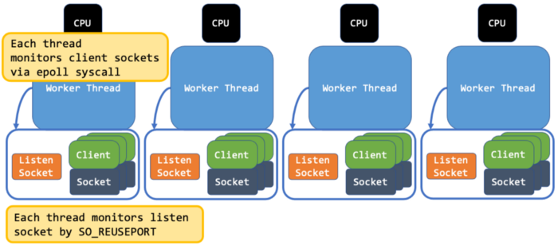

# 对外输出 Mocks 接口 和 Tokio 的高延展性服务器设计

作者：陈明煜

> 《This Week in Rust》是由Rust语言组编写的一份Rust社区周报，简要介绍一周内Rust社区新动态，例如Rust项目更新、应用、语言介绍、新的crate、项目组通过的语言修订、相关工作、等等。可以通过Rust官网 - Community - Read about Rust (This Week in Rust)来阅读原文以及其他周报，或者通过以下链接阅读10.06的[第411篇推文](https://this-week-in-rust.org/blog/2021/10/06/this-week-in-rust-411/)。

本篇主要包含了以下内容

- 对外输出Mocks接口
- Tokio的高延展性服务器设计

# 对外输出Mocks接口

一个Rust Library通常会被细分成好几个crate，这样做极大地简化了代码结构，但却留下了一个问题：任何被标注了` #[cfg(test)]  `特性的代码通常无法被export到该crate外。这样的设计在大多数情况下是非常合理的，但在有些时候，如果多个crate需要用到同一套测试性的接口，比如说打桩，这就需要将这些标有` #[cfg(test)]`的代码公开出去。这篇文章将会阐述如何将打桩接口公开出去，使其他crate甚至是其他用户可以打桩你的结构体和函数，以此来测试他们自己的代码。

为了能更清楚的讲明白这个问题，下面我们用一个叫 `testable-renderer` 的库进行举例。这个库使用了一个十分常见的打桩工具`faux`，并在 `dev-dependencies` 里标明使用了 `faux` 打桩库。

```rust
[package]
name = "testable-renderer"

[dev-dependencies]
faux = "^0.1"
```

`testable-render`的具体实现：

```rust
#[cfg_attr(test, faux::create)]
pub struct Renderer {
    /* snip */
}

#[cfg_attr(test, faux::methods)]
impl Renderer {
    pub fn new() -> Renderer {
        /* snip */
    }

    pub fn render(&mut self, texture: &Texture) -> Result<(), RenderError> {
        /* snip */
    }
}

pub struct Texture;

impl Texture {
    pub fn render(&self, renderer: &mut Renderer) -> Result<(), RenderError> {
        renderer.render(self)
    }
}

#[derive(Debug)]
pub struct RenderError;

#[cfg(test)]
mod tests {
    use super::*;

    #[test]
    fn renders_textures() {
        let mut renderer = Renderer::faux();
        faux::when!(renderer.render).then(|_| Ok(()));

        let subject = Texture {};
        subject.render(&mut renderer).expect("failed to render the texture")
    }
}
```

为了将Render这个结构体的可打桩版本公开出去，要做的第一步是让 `faux` 在测试外也能被构建到，但同时我们又不想让它污染我们Library原有的构建依赖，所以需要将对`faux`的依赖标注为optional

```rust
[dependencies]
# 在dev-dependencies外设置一个可选的依赖，这样使用该Library的用户就可以选择性的使用我们提供的打桩接口来测试他们自己的代码
faux = { version = "^0.1", optional = true }

[dev-dependencies]
# 当然我们的测试还是需要依赖faux的，所以它必须得包含在dev-dependencies内
faux = "^0.1"
```

将Config设置为如上之后，Cargo会将 `faux` 的feature flag暴露出去。只有在进行测试，或是feature flag被设置为true的时候，`faux` 才会被构建。

做完这一步骤后，下面我们要将打桩对外输出。解决问题的关键在于`any`字段

```rust
// 在标注了any关键字后，在测试中或者faux feature flag被设置为true时，该结构体的可打桩版本将会被对外输出
#[cfg_attr(any(test, feature = "faux"), faux::create)]
pub struct Renderer {
    /* snip */
}

// 在标注了any关键字后，在测试中或者faux feature flag被设置为true时，该结构体的函数的可打桩版本将会被对外输出
#[cfg_attr(any(test, feature = "faux"), faux::methods)]
impl Renderer {
    pub fn new() -> Renderer {
        /* snip */
    }

    pub fn render(&mut self, texture: &Texture) -> Result<(), RenderError> {
        /* snip */
    }
}
```

将原本的

```rust
#[cfg_attr(test, ...)]
```

替换成

```rust
#[cfg_attr(any(test, feature = "faux"), ...)]
```

这样在测试中或者feature flag设置为true时，rust就会使用`faux`的特性（ `create` 和 `method `  ）。关于 `any` 关键词，你可以在[rust reference][https://doc.rust-lang.org/reference/conditional-compilation.html]里了解到更多。


现在一切准备就绪，下面让我们看看该如何在另一个库里使用`test-renderer`里的桩函数和桩结构体。

现在我们定义另一个库，以下是该库的`Cargo.toml`

```rust
[dependencies]
testable-renderer = * // 版本号
```

该库里使用了`testable-renderer`的接口的代码

```rust
use testable_renderer::{RenderError, Renderer, Texture};

struct World {
    player: Texture,
    enemy: Texture,
}

impl World {
    pub fn new() -> Self {
        World {
            player: Texture {},
            enemy: Texture {},
        }
    }

    pub fn render(&self, renderer: &mut Renderer) -> Result<(), RenderError> {
        self.player.render(renderer)?;
        self.enemy.render(renderer)?;

        Ok(())
    }
}
```

我们想要给 `World::render` 这个函数写测试，但是 `render` 是一个非常费时的操作。不过好在 `testable-renderer` 里有打桩功能可以使用，我们首先要将它的打桩功能开启。

```rust
[package]
# 设置后，被dev-dependencies开启的特性不会影响在正常构建下生成的二进制文件
resolver = "2"

[dependencies]
# 正常的依赖不会激活faux打桩
testable-renderer = * # some version

[dev-dependencies]
# 在测试内，我们会激活faux，以此来使用该库里的桩函数
testable-renderer = { version = "*", features = ["faux"] }

# 需要依赖faux以此来设置Mocks
faux = "^0.1"
```

需要注意的是：

- `resolver = "2"`. 为了让`faux`在正常构建中不被包括，需要注明这一点。具体请看[Cargo reference][https://doc.rust-lang.org/nightly/cargo/reference/features.html#feature-resolver-version-2]
- 在 `dev-dependencies` 内开启 `faux` 特性，我们只想在测试中使用这个功能。

下面我们就可以正常的写测试啦

```rust
#[cfg(test)]
mod tests {
    use super::*;

    #[test]
    fn renders_the_world() {
        // the test target enables the faux feature on `testable-renderer`
        // thus allowing us to use the mocks of the *external* crate
        let mut renderer = Renderer::faux();
        faux::when!(renderer.render).then(|_| Ok(()));

        let world = World::new();
        world.render(&mut renderer).expect("failed to render the world")
    }
}
```


# Tokio的高延展性服务器设计

Tokio是目前最被广泛使用的异步运行时库，使用它可以轻松的设计出一个可用的服务器。但是在一些常见的使用Tokio的库上，用它设计出的代码经常无法在多CPU环境下保持性能高效。


#### gRPC greeter server

以下代码是一个常见的 gRPC Greater 服务器的实现，即使你对Tokio只是略有涉猎，你也能写出这样的服务器应用。

```rust
#[tokio::main]
async fn main() -> Result<(), Box<dyn std::error::Error>> {
    let addr = "[::1]:50051".parse().unwrap();
    let greeter = MyGreeter::default();

    println!("GreeterServer listening on {}", addr);

    Server::builder()
        .add_service(GreeterServer::new(greeter))
        .serve(addr)
        .await?;

    Ok(())
}
```

但如果你对Tokio运行机制有了较深的理解，你可以写出性能提升两倍的代码


#### 在多CPU环境下的服务器设计

为什么常见的服务器设计表现的不是特别理想呢？Tokio的内部运行机制给了我们一点提示：


​																														常见的服务器设计

Tokio创建的线程数量一般和CPU核数保持一致。每个线程都会处理多个clients，但却只有一个监视线程通过epoll监听所有的socket，除此之外，也只有一个listen socket来接收新的连接。这样的设计非常容易成为性能的瓶颈。

下图中的设计大大增加了服务器的延展性，这也是[Envoy](https://github.com/tetratelabs/envoy-wasm-rust-sdk), [Nginx](https://github.com/nginxinc/ngx-rust)使用的设计方法。每个线程都会通过epoll监视它所持有的client的socket，且每个线程都有一个自己的listen socket用来接收新的连接，并通过设置`SO_REUSEPORT`在同一个端口进行监听。




通过更改一小段代码，可以极大的提升在多CPU环境下的性能。对该设计感兴趣的话可以在这里找到一个例子：[tokio-reuseport](https://github.com/fujita/tokio-reuseport)


# Reference

- [https://nrxus.github.io/faux/guide/exporting-mocks.html](https://nrxus.github.io/faux/guide/exporting-mocks.html)
- [https://medium.com/@fujita.tomonori/scalable-server-design-in-rust-with-tokio-4c81a5f350a3](https://medium.com/@fujita.tomonori/scalable-server-design-in-rust-with-tokio-4c81a5f350a3)
- [https://this-week-in-rust.org/blog/2021/10/06/this-week-in-rust-411/](https://this-week-in-rust.org/blog/2021/10/06/this-week-in-rust-411/)

