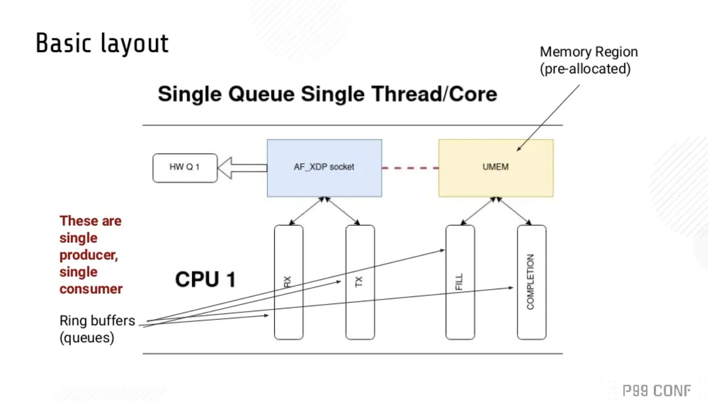
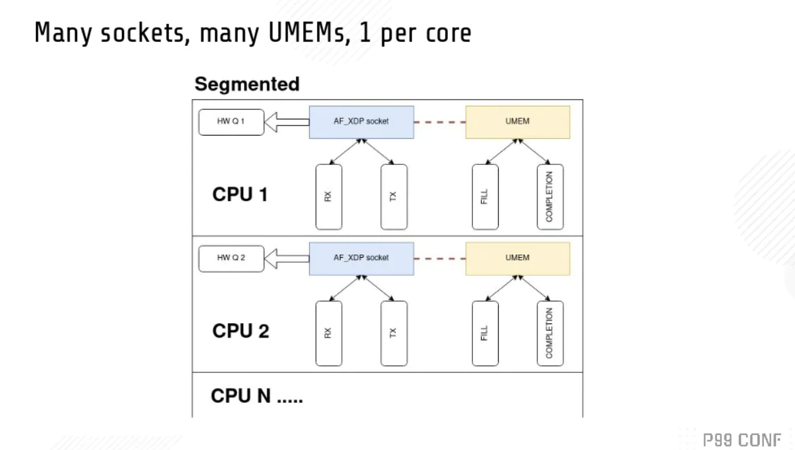

# 通过 P99 Conf  中 四场 Talk来了解 Rust 在高性能低延迟系统中的应用

[P99 Conf](https://www.p99conf.io/) 是一个由 [Scylladb](https://www.scylladb.com/) 组织的新的跨行业的线上Conf，为工程师而设。该活动以低延迟、高性能设计为中心，范围包括操作系统（内核、eBPF、IO_uring）、CPU（Arm、Intel、OpenRisc）、中间件和语言（Go、Rust、JVM、DPDK）、数据库和可观测性方法。P99 CONF只面向技术人员，你的老板不在邀请之列。

四场演讲分别为：

1. [Rust，莱特定律和低延迟系统的未来](https://www.p99conf.io/session/rust-wrights-law-and-the-future-of-low-latency-systems/)
2. [芜湖！我用 Rust 重写了推特的内存缓存框架 Pelikan 模块 ！](https://www.p99conf.io/session/whoops-i-rewrote-it-in-rust/)
3. [Rust 确实安全，但是它快吗？](https://www.p99conf.io/session/rust-is-safe-but-is-it-fast/)
4. 

以下是本人观看四场 Talk 的过程中记录的摘要笔记。

---

##  Rust，莱特定律 和 低延迟系统的未来

《Rust, Wright’s Law, and the Future of Low-Latency Systems》- 作者： Bryan Cantrill, Oxide 计算公司 CTO

> 关于 Oxide 公司： https://cloud.tencent.com/developer/news/567765

> 莱特定律（Wright's Law）： 莱特定律在1936年由西奥多·莱特（Theodore Wright）率先提出，核心内容就是说某种产品的累计产量每增加一倍，成本就会下降一个恒定的百分比。 在汽车领域，从1900年就遵循这一规律，产量每累计增加一倍，成本价格就会下降15％。
>
> 莱特定律 和 摩尔定律 共同被应用于预判科技如何改进。

系统性能的仲裁者：硬件。

系统性能的历史，能看到三类性能改革：

1. process revolutions。半导体工艺（process）改革。
2. Architectural revolutions。架构改革。
3. Software revolutions。软件改革。

不管技术如何改革，这一切都得受经济的制约。

谈到 半导体工艺改革，就得谈到摩尔定律。

作者说到现在的 7nm、5nm、3nm工艺时，比较激动，他说，作为这个芯片行业的人，他觉得应该对这类术语负责，实际上并没有什么东西可以是5nm、3nm长，没有那么长的晶体管，这里实际指的是晶体管密度。

在晶体管工艺上，摩尔定律实际已经减速。因为低纳米的制程工艺成本很高，摩尔定律不再成为经济规律。

莱特定律比摩尔定律可以更好地预测晶体管变化的规律，它代表的是一个规模经济。晶体管累计产量越多，成本就会下降一个恒定的百分比。 

你的电脑上有一堆隐藏的cpu核心，并且可能会越来越多。并且这些核心可能是不同工艺的核心的复合体。并且还可以把核心放到它需要的地方。

这就是来自莱特定律的礼物。这对性能产生了影响。

> 我想到了苹果发布的 m1 macbook。

当这些CPU 核心充斥到很多角落的时候，也就意味着那里多了很多计算单元，并且有很大一部分是资源有限的情况，比如没有过多内存等。

那如果你要为这些计算单元编写程序，你选择什么语言呢？ Python ？Go ？Java？ Cpp？ C？  

有些人说 CPP 和 C ，但是作者作为二十多年的 资深 C 开发者，他推荐 Rust。 Rust 在专用计算领域有杀手级特性： 它不依赖于标准库，所有核心功能都在 core里。作者的公司 Oxide 开发了一套基于消息传递、内存保护的操作系统，只需要 30k 空间（未优化）。

>  其实 tockOS 更小，自身编译后大小  4 KB 左右，内存占用 900 B，不到 1KB。

因为莱特定律的原因，未来将会在更多地方进行计算，并且这些计算元素将为特殊用途服务，在这些领域，Rust 将成为首选语言，而C 语言它存在于 软件与 硬件的边界。

作者最后说，不要等待，现在正是开发高性能低延迟系统的一个非常激动人心的时刻， Rust  革命就在这里发生。

## 芜湖！我用 Rust 重写了推特的内存缓存框架 Pelikan 模块 ！

《Whoops! I Rewrote It in Rust》 - 作者 ：Brian Martin,  Twitter 软件工程师

### 用 Rust 的机遇 ？

Pelikan 框架 （之前是C 实现）需要增加 tls 支持，因为 Brian 的 经理没有时间做这个模块，就交给了他。 他认为这个模块用 Rust 实现会很舒服，所以就用了 Rust。

### 如何看待性能测试？

在深入之前，需要介绍下性能测试，他们对性能有两个目标：

1. 最大化吞吐量
2. 提供良好的延迟： p999 < 1ms  (过去10秒内最慢的0.1%的请求的平均延迟要小于 1ms)

这里面需要考虑尾延迟（Tail Latency）的问题。

> 少量响应的延迟高于均值，我们把这些响应称为尾延迟（Tail Latency）。对于大规模分布式系统来说，尾延迟的影响尤其严重。 磁盘老化、超时、后台任务、超负载运行、全局资源共享等等。

1. fanout = 1 ， 只有 0.1% 的请求比 p999 慢
2. fanout = 10， 会有 1% 的请求比 p999 慢
3. fanout = 100， 会有 10% 的请求比 p999 慢

尾延迟发生的频率比你想象的高。

### 开始第一次尝试

对 2019 年用 Rust 实现的 Rust 缓存 Twemcache 为基础来添加 tls 支持，该项目特性：

1. memcached 兼容
2. Tokio 异步实现网络部分
3. 使用 C 存储库

先进行了性能测试，发现吞吐量不满足要求。尾延迟比性能测试目标也高出 25%。和 C 实现的 Twemcache 版本相比，Rust 的延迟更高，吞吐量也是 Rust 更低。

Brian 再想， Rust 的性能是否可以更好。

他于是进行了第二次尝试。

### Rust  Pingserver  vs C  Pingserver

为了验证 Rust 的性能，他分别用 Rust 和 C 实现了一个简单的 Ping/Pong 服务。

然后为它们支持 性能测试相关内容，增加 tls 支持。

基准测试以后发现 Rust 版本 和 C 版本的 吞吐、延迟是完全持平的。

### 继续开始 Twemcache 原型实现

验证了 Rust 的性能之后，继续 Twemcache 原型实现：

1. 临时将 C 存储库换成 Rust 的hashmap，为了专注于实现 memchached 协议的兼容
2. 然后再把 C 存储库换回来

但是后面因为性能监控部分 metrics 和 log 导致会出现 Rust和C 交互的一些问题，Brian花了大量时间来处理这个问题，虽然找到了解决办法，但是也让他萌生了一个想法：为什么不用 Rust 完全重写 Twmcache 呢？

### 用 Rust 重写

C 存储库用 Rust 重写相当复杂。包括了很多自引用类型、内存分配、链表、到处都是指针、要用很多unsafe等等。

也许可以先从单线程版的 C 存储库开始会更简单。然后他就用 Rust 重写了。

优点：

1. 纯 Rust
2. 重写有助于改进代码
3. 为设计增加新的idea
4. 抛弃 make和cmake，愉快地使用 cargo

缺点：

两个月的工作量，还没有100%完成。

### 小结

Brian以及他的经理，认为这次重写，从 Rust 得到了很多收益。 Rust 让他们突破了 C 的限制，觉得这就应该是 Pelikan  模块的正确方向。

最终性能指标也达到了要求，并且比 memcached 延迟更低。

## Rust 确实安全，但是它快吗？

《Rust Is Safe. But Is It Fast?》- 作者： Glauber，Rust异步框架 Glommio作者，曾经是Datadog 资深工程师，非常关注性能和资源管理。现在是 ChiselStrike 公司 CEO。

### Why Rust

他选择 Rust 的理由：

因为 Rust 功能不如 Cpp 强大。 你没看错，他认为 Rust 不如 Cpp强大，所以选 Rust。他认为，当你给了代码编写者强大的力量，意味着，与此同时也剥夺了代码阅读者的权力。

### Rust 的特性

依次介绍了 Rust 的一些特性，比如 Lifetime、 trait系统、Sync/Send 。异步 等。 

###  Glommio

Glommio 是一个基于 io_uring 的 Thread-per-Core 架构的异步运行时框架。

> 什么是 Thread per core？
>
> 为了消除线程上下文的切换成本，引入了该架构。Thread-per-core 就是指每个内核或CPU都运行一个线程，而且通常（不是必须）这些线程都被“钉在”同一个特定 CPU 上。操作系统调度程序将不会随意移动这些线程，而且同一个CPU 内也不会有其他线程，因此就不会有上下文切换。
>
> 每个异步任务都会明确分配给特定线程。这种模式不需要锁。一般用于降低系统延迟。

Glommio有自己的内部调度器，它选择运行哪个任务队列，并为每个队列提供与其份额成比例的时间。通过从一开始就利用io_uring，Glommio可以重新审视Rust中的I/O应该是什么样子。

对于每个执行线程，Glommio都注册了自己的独立 ring （角色不同），可以无锁地操作。一个正常的请求，比如打开或关闭一个文件，从一个套接字中发送或接收数据，将进入主ring 或延迟ring，这取决于其延迟需求。

当这些请求准备好了，它们就会发布到io_uring的完成ring 上，Glommio就可以消费它们了。由于io_uring的架构，甚至不需要发出系统调用。事件存在于Linux和应用程序之间的共享内存区域，并由一个环形缓冲器管理。

**相比于 Tokio** 

Tokio 默认是多线程运行时，所以需要 static 生命周期和 实现 Send 的 任务，而不能发送引用，这对于系统延迟是一个影响。

但是 Glommio 因为是 thread-per-core，所以可以方便地使用引用。Glommio 整个运行时没有使用太多的原子类型。

>  tokio 最近也在支持 io_uring 。

**与其他运行时性能比较：**

glommio 的吞吐量比 tokio、async-std、smol更高。

**其他心得**

在 Rust 中很难实现 零拷贝（zero-copy），并且很难与您希望进行零拷贝的任何接口一起使用。

## 使用eBPF、XDP和 io_uring 构建高性能网络

《High-Performance Networking Using eBPF, XDP, and io_uring》 - 作者：Bryan McCoid，  Couchbase  分布式系统工程师，也是 Glommio 的积极贡献者，他更喜欢 thread-per-core 模型，因为这个模型更像分布式。

在网络世界中，有许多方法可以提高性能，而不是只会使用基本的Berkeley套接字。

这些技术包括轮询阻塞套接字，由 Epoll 控制的非阻塞套接字，io_uring ，一直到完全绕过Linux内核，通过使用像 DPDK 或 Netmap 这样的东西直接与网络接口卡对话，来获得最大的网络性能。

Bryan 这次演讲会介绍AF_XDP的设计，使用的eBpf代码，以及驱动这一切所需的用户空间代码。它还将包括与常规内核网络相比，这种设置的性能数字。最重要的是如何把所有这些放在一起，在一个现代多核系统上处理尽可能多的数据。

为什么不用 DPDK ？ Bryan回答，因为它太复杂。

> **eBPF 是什么？**
>
> eBPF 是一套通用执行引擎，可以在 Linux内核执行沙箱程序。提供了可基于系统或程序事件高效安全执行特定代码的通用能力，通用能力的使用者不再局限于内核开发者；eBPF 可由执行字节码指令、存储对象和 Helper 帮助函数组成，字节码指令在内核执行前必须通过 BPF 验证器 Verfier 的验证，同时在启用 BPF JIT 模式的内核中，会直接将字节码指令转成内核可执行的本地指令运行。
>
> 同时，eBPF 也逐渐在观测（跟踪、性能调优等）、安全和网络等领域发挥重要的角色。Facebook、NetFlix 、CloudFlare 等知名互联网公司内部广泛采用基于 eBPF 技术的各种程序用于性能分析、排查问题、负载均衡、防范 DDoS 攻击，据相关信息显示在 Facebook 的机器上内置一系列 eBPF 的相关工具。
>
> 相对于系统的性能分析和观测，eBPF 技术在网络技术中的表现，更是让人眼前一亮，BPF 技术与 XDP（eXpress Data Path） 和 TC（Traffic Control） 组合可以实现功能更加强大的网络功能，更可为 SDN 软件定义网络提供基础支撑。XDP 只作用与网络包的 Ingress 层面，BPF 钩子位于**网络驱动中尽可能早的位置**，**无需进行原始包的复制**就可以实现最佳的数据包处理性能，挂载的 BPF 程序是运行过滤的理想选择，可用于丢弃恶意或非预期的流量、进行 DDOS 攻击保护等场景；而 TC Ingress 比 XDP 技术处于更高层次的位置，BPF 程序在 L3 层之前运行，可以访问到与数据包相关的大部分元数据，是本地节点处理的理想的地方，可以用于流量监控或者 L3/L4 的端点策略控制，同时配合 TC egress 则可实现对于容器环境下更高维度和级别的网络结构。
> ---- 来自于 [《eBPF 技术简介》](https://cloudnative.to/blog/bpf-intro/)
>
> **XDP 是什么？**
>
> XDP 的引入是为了解决 Kernel Bypass 存在的一些问题。解决方案就是：给内核网络栈添加可编程能力。
>
> 这使得我们能在 **兼容各种现有系统、复用已有网络基础设施**的前提下，仍然实现高速包处理。 这个框架称为 XDP，
>
> - XDP 定义了一个**受限的执行环境**（a limited execution environment），运行在一个 **eBPF 指令虚拟机**中。eBPF 是 BSD Packet Filter (BPF) [37] 的扩展。
> - XDP 程序运行在**内核上下文中**，此时**内核自身都还没有接触到包数据**（ before the kernel itself touches the packet data），这使得我们能在网卡收到包后 **最早能处理包的位置**，做一些自定义数据包处理（包括重定向）。
> - 内核在**加载（load）时执行静态校验**，以确保用户提供的 XDP 程序的安全。
> - 之后，程序会被**动态编译成原生机器指令**（native machine instructions），以获得高性能。
>
> 参考：[[译] [论文] XDP (eXpress Data Path)：在操作系统内核中实现快速、可编程包处理（ACM，2018）](http://arthurchiao.art/blog/xdp-paper-acm-2018-zh/)

### 如何使用 XDP ，以及设计一个 Rust 运行时

Bryan 要把现存的 Glommio 框架，改为基于 xdp socket 的实现。

基本布局 ：

我们使用普通的 `socket() `系统调用创建一个`AF_XDP`套接字（XSK）。每个XSK都有两个ring：`RX RING`和 `TX RING`。套接字可以在` RX RING` 上接收数据包，并且可以在 `TX RING` 环上发送数据包。这些环分别通过` setockopts()` 的 `XDP_RX_RING `和` XDP_TX_RING` 进行注册和调整大小。每个 socket 必须至少有一个这样的环。`RX`或`TX`描述符环指向存储区域（称为`UMEM`）中的数据缓冲区。`RX`和`TX`可以共享同一`UMEM`，因此不必在`RX`和`TX`之间复制数据包。

`UMEM`也有两个 ring：`FILL RING` 和` COMPLETION RING`。应用程序使用 `FILL RING` 向内核发送可以承载报文的 addr (该 addr 指向UMEM中某个chunk)，以供内核填充`RX`数据包数据。每当收到数据包，对这些 chunks 的引用就会出现在`RX`环中。另一方面，`COMPLETION RING`包含内核已完全传输的 chunks 地址，可以由用户空间再次用于` TX` 或 `RX`。

> 参考 [AF_XDP技术详解](https://rexrock.github.io/post/af_xdp1/) ，有助于理解该 Talk内容。

也有很多其他设计。

以上是两种其他方案。

如何集成到 Glommio 中，请看代码 ： https://github.com/bryandmc/glommio/blob/xdp/glommio/src/net/xdp_socket.rs

