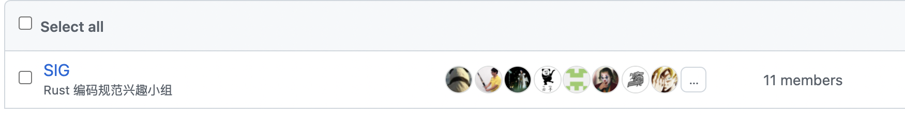

#  《Rust 安全编码规范》 初稿发布

作者： 张汉东

---

## 为什么需要《Rust 编码规范》

在最初学习 Rust 的那几年，我觉得 Rust 有` rustfmt `和` Clippy` 这样的静态检查工具，就没有必要搞什么编码规范了。

也许大部分人也是这么想的，所以整个 Rust 社区现在都非常依赖这两个工具。

但我通过对 Rust 社区里各种开源项目观察，虽然大家都在用这两个工具，但却对这两个工具依赖的规则都不是非常了解。

比如，有的项目将 `rustfmt` 里的规则全部写到 `rustfmt.toml` 文件中，也不管里面有多少规则其实是默认的；有的项目则严格依赖 `clippy` 的警告去修改代码，而不去思考是否适合当前场景。

Rust 语言优秀的地方就在于，让开发者在编写代码的过程中就去思考代码的安全性和健壮性。Rust 项目每天都在不断增多，社区在不断涌入新人。`rustfmt` 和 `clippy` 这种工具也只能在他们编写完代码之后，才能进行检测，无法在编写代码的过程中给予其规范和指导。并且 `rustfmt` 和 `clippy` 只记录了一些可以静态检查的规则，实际 Rust 编程中还有一些原则性的问题是无法检测的。所以，社区需要《Rust 编码规范》。

《Rust 编码规范》有以下四个好处：

1. 帮助 Rust 开发者在写代码之前或者写代码过程中，就了解地道的用法。
2. 可以帮助开发人员，在面对 `rustfmt` 和 `clippy` 这样的工具的规则，可以更好地做出决策。
3. 同时，也提供了一个针对 Rust 编码规范的平台，帮助大家思考和讨论更加合理的规范，帮助 `rustfmt` 和 `clippy` 进化。
4. 可以让公司和开源产品以此为蓝本，定制自己的《Rust 编码规范》，更好地帮助 Rust 在企业内部落地，帮助开源贡献者们统一代码规范。

## 内容介绍

《Rust 编码规范》中文版项目仓库地址：[https://github.com/Rust-Coding-Guidelines/rust-coding-guidelines-zh](https://github.com/Rust-Coding-Guidelines/rust-coding-guidelines-zh)

《Rust 编码规范》在线渲染版地址： [https://rust-coding-guidelines.github.io/rust-coding-guidelines-zh/index.html](https://rust-coding-guidelines.github.io/rust-coding-guidelines-zh/index.html)

### 规范的内容组织结构

目前《Rust 编码规范》包括以下六大部分：

1. 《Rust 安全编码规范》，包括 Rust 开发环境、代码风格、 编程实践等内容，形成原则和规则。其中规则是可以静态检查的。
2. 《Rust 领域最佳实践》， 包括 Rust 在各个领域中的最佳实践。
3. 《Rust Cheat Sheet》， 综合 Rust 中的 Cheat Sheet ，开发技巧等。
4. 《Rust 工具链使用指南》，介绍 Rust 生态中好用的工具链，比如 `rustfmt`、 `clippy`等静态分析工具，以及其他一些安全类工具。
5. 《Rust 优化指南》， 综合 Rust 代码 性能、编译时间、编译大小的优化心得。
6. 《Rust 生态常用库指南》，介绍 Rust 生态中常用的基础库、 框架等用法。

目前发布的是 《Rust 安全编码规范》 初稿。

#### **《Rust 安全编码规范》的内容组织结构：**

1. 前言。 主要是安全编码规范的整体介绍，组织结构，规范约定。
2. 开发环境。介绍了 Rust 开发环境的一些配置，包括 编辑器、IDE选择，国内镜像等。
3. 代码风格。介绍 Rust 命名、 格式、注释的编码风格规范。
4. 编程实践。按 Rust 语法特性分类，介绍 Rust 编程实践中该特性下需要注意的一些安全、技巧、性能方面相关的规范。
5. 附录。包括 测试、术语、以及 建议的 `rustfmt` 和 `clippy` 配置模板。

目前发布的初稿还比较粗糙，需要大家一起贡献完善。

## 贡献者召集

欢迎各大使用 Rust 开发产品的公司和开源项目团队试用和反馈。

如果愿意长期一起维护和完善该规范的朋友，可以申请加入 Rust编码规范 SIG 小组。

目前已经得到了以下公司中团队成员和开源项目作者的支持：

- 华为 
- 字节跳动 
- 知乎
- PingCAP
- Datenlord 
- Databend 
- 非凸团队
- 海致图数据库成员
- AsyncGraphql / Poem 作者
- Rbatis ORM 作者 
- Delicate 作者
- Rustsbi 作者

也欢迎各大 Rust 开发者和爱好者们，一起参与讨论和贡献。在 Rust 编码规范的 GitHub 项目下的 [Discussions](https://github.com/Rust-Coding-Guidelines/rust-coding-guidelines-zh/discussions) 里发帖交流。

关于具体如何贡献，我后面也会写一篇贡献者参考文档。

## 未来计划

本规范未来计划大概分个阶段：

1.  将中文版规范继续完善，推进到 `1.0` 的状态。 
2. 翻译为 英文版，接受国际 Rust 社区开发者的意见和贡献。
3. 推广到 Rust 官方。

希望能借助开源的力量，在 2022 年完成以上三个阶段的目标。

