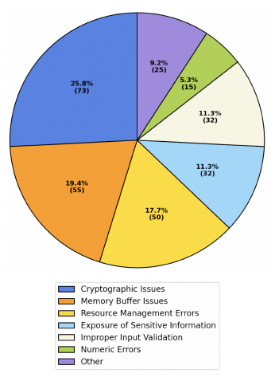
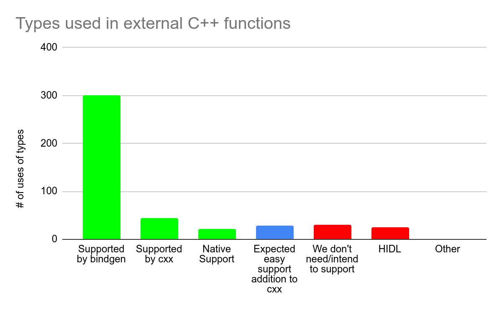

# Rust调研与内存安全

作者： 王江桐

> 本篇将会简要介绍什么是《This Week in Rust》，[Rust 2021(1.56)](https://blog.rust-lang.org/2021/10/21/Rust-1.56.0.html)，第409篇推文中有关已通过的RFC2845，[supertrait_item_shadowing](https://rust-lang.github.io/rfcs/2845-supertrait-item-shadowing.html)，Rust安全性，以及第413篇推文中关于OpenSUSE 2021 Rust Survey和Rust安全性的内容。

---

## 社区新闻与更新

### Rust 2021（1.56）

Rust 2021如预期已于10.21号上线，具体可见官方博文[“Announcing Rust 1.56.0 and Rust 2021”](https://blog.rust-lang.org/2021/10/21/Rust-1.56.0.html)或是官方[《Edition Guide》](https://doc.rust-lang.org/edition-guide/rust-2021/index.html)。可以使用如下命令更新到1.56.0版本：

```shell
$ rustup update stable
```

具体的版本更新内容基本同5.11的新版本前瞻，以及具体如何迁移到新版本使用新的功能，可见之前的总结[《This Week in Rust #404：Rust 2021 与 周期性服务发现》](http://openx.huawei.com/Ylong_Rust/dynamicDetail/3212)，在此不再赘述。前瞻中未提及的新功能恢复了Rust 1.0之后移除的功能，使用`@`符号绑定值，如以下例子：

```Rust
struct Matrix {
    data: Vec<f64>,
    row_len: usize,
}

// Before, we need separate statements to bind
// the whole struct and also read its parts.
// 之前，在获取结构式中某一个属性的值时，我们必须一步步操作，先将结构式的值绑定给某个变量，然后从它的从属属性中获取值
let matrix = get_matrix();
let row_len = matrix.row_len;
// or with a destructuring pattern:
// 或者使用分解模式
let Matrix { row_len, .. } = matrix;

// Rust 1.56 now lets you bind both at once!
// 现在，使用@，Rust 1.56可以同时做到这两件事情
let matrix @ Matrix { row_len, .. } = get_matrix();
```


### RFC 2845：supertrait item shadowing

概括来说，RFC 2845修改了作用域内方法定位，当泛型实现的子trait和父trait有同名方法时，除非显式声明，否则不再考虑父方法trait，从而消除之前编译器认为方法名混淆的问题。

如以下例子：

```Rust
mod traits {
    trait Super {
        fn foo(&self);
    }

    trait Sub: Super {
        fn foo(&self);
    }
}
```

两个trait拥有同名方法`foo`。如果我们再定义一个泛型类型：

```Rust
use traits::Sub;

fn use_trait_obj(x: Box<dyn Sub>) {
    x.foo();
}
```

那么编译器会产生如下告警：

```Rust
error[E0034]: multiple applicable items in scope
  --> src\main.rs:10:4
   |
10 |     x.foo();
   |       ^^^ multiple `foo` found
   |
note: candidate #1 is defined in the trait `traits::Super`
  --> src\main.rs:2:2
   |
2  |     fn foo(&self);
   |     ^^^^^^^^^^^^^^
   = help: to disambiguate the method call, write `traits::Super::foo(x)` instead
note: candidate #2 is defined in the trait `traits::Sub`
```

如同这个例子，实际应用的问题在于，对于定义父trait的底层库和子trait的上层库，如果开发者更新底层库，使父trait拥有和子trait的同名方法，那么使用泛型调用方法时，代码就会告警，并且这些告警可能会造成一系列的连锁反应。修改这些告警可能是非常费事费力的，并且要求双方库都对彼此知情，从而消除名称混淆。然而，在逻辑上，底层库并不应知道上层库，同时开发或使用上层库的用户也并一定不知道底层库。

因此，为了解决这个问题，RFC 2845决定优先使用子trait中的方法，并且除非明确声明，不考虑使用父trait的同名方法。例如：

```Rust
fn generic_fn<S: Sub>(x: S) {
    // This:
    x.foo();
    // is the same as:
    // x.foo()将会使用Sub::foo而不是Super::foo
    Sub::foo(x);
    // also still possible:
    // 但是可以通过显式声明来调用Super::foo
    Super::foo(x);
}
```

如果同时引入子trait和父trait，那么由于此时两个trait的关系是并列的，用户需要显式声明使用哪个方法：

```Rust
fn generic_fn<S: Sub+Super>(x: S) {
    // Error: both Sub::foo and Super::foo are in scope
    x.foo();
}
```

类似的，在子trait中编写方法时，也需要声明使用的是自己的方法还是父trait的方法：

```Rust
trait Super {
    fn foo(&self);
}

trait Sub: Super {
    fn foo(&self);

    fn bar(&self) {
        // Is and will continue to be an error
        self.foo();
    }
}
```


## Rust与内存安全

### OpenSUSE 2021 Rust Survey

从2006年到2021年，个人项目到Rust基金会成立、Rust发布2021版本，Rust作为新兴开发语言之一，其高可靠、高性能、高生产力的特性使得它逐渐成为了新的热点，并且成为StackOverflow调研中连续六年最受欢迎的语言。从2021年9月8日至10月7日，OpenSUSE帮助调研了1360人他们关于Rust的想法，以及如何使用Rust工具链。详细的报告可见”[Results from the OpenSUSE 2021 Rust Survey](https://fy.blackhats.net.au/blog/html/2021/10/08/results_from_the_opensuse_2021_rust_survey.html)“。以下是部分调研结果：

- 态度
  - 44%的人认为Rust对于他们的项目和工作很重要（评分4-5 / 5；599 / 1360）
  - 57%的人认为Rust会对他们未来的项目和工作越来越重要（评分4-5 / 5；778 / 1360）
  - 60%的人人为Rust会对未来的其他开发者和项目越来越重要（评分4-5 / 5；820 / 1360）
- 使用
  


虽然数据可能因为调研者大多来自于Rust社区而略有偏差，但这个调研依旧可以部分证明Rust在目前以及未来的重要性。


### Rust与内存安全

Rust致力于实现能与C和C++相匹配的高性能，但是相较于C和C++，Rust的另一优势在于内存安全。"[You Really Shouldn’t Roll Your Own Crypto:
An Empirical Study of Vulnerabilities in Cryptographic Libraries](https://arxiv.org/abs/2107.04940)"中指出，对于密码库中的安全问题，27.2%的问题来自于算法，但是37.2%的问题来自于内存安全，而发现这些错误的中位数为4.18年。非常著名的密码与安全协议C语言库，Openssl，在文中证实平均每1000行代码就存在1个问题。



谷歌对于[Chromium项目](https://www.chromium.org/Home/chromium-security/memory-safety)的调研得出了类似的结论：70%的安全问题是内存安全问题，例如由C/C++错误指针导致的问题。同时，非安全的bug根错误也与此相同。此外，超过50%的安全问题时间超过1年，约25%超过3年。


目前谷歌的解决方案是使用沙盒隔离每一个网站和Tab，然而这个解决方案并不是完美的。进程是沙盒隔离的最小单位，但是进程的开销并不是免费的，例如在安卓环境下，进程过多会影响设备安全，例如杀死后台其他进程。同时，共享网页之间信息的进程仍然是需要的，越来越多的进程会超出Chromium需要的进程，同时影响运行效率。


### Rust：可能的解决方案

除了沙盒，谷歌也在探索新的解决方案，例如自研C++库，硬件迁徙，以及使用其他更安全的语言。谷歌的2021年9月21日博文中简要介绍了目前正在实施的解决方案，运用编译时和运行时检查保证指针正确，以及，探索Rust。

运行时检查有性能开销，对于内存较小的移动设备并不一定适用；对于编译时检查，C++借用检查的实现则不是非常容易。关于谷歌对于C++借用检查的文档可见[“Borrowing Trouble: The Difficulties Of A C++ Borrow-Checker”](https://docs.google.com/document/d/e/2PACX-1vSt2VB1zQAJ6JDMaIA9PlmEgBxz2K5Tx6w2JqJNeYCy0gU4aoubdTxlENSKNSrQ2TXqPWcuwtXe6PlO/pub)。

对于Rust，谷歌担心C++和Rust的代码是否可以互相兼容使用，Rust在Chrome的开发使用仍在测试阶段，不过已开始逐渐在各项目使用，例如安卓。自从2019年，安卓开源项目（Android Open Source Project）支持Rust作为开发语言开发操作系统，作为一种方案用来代替C和C++，并且使用更少的沙盒隔离。


#### 将Rust集成进安卓项目

[将Rust集成进安卓开源项目](https://security.googleblog.com/2021/05/integrating-rust-into-android-open.html)时，谷歌进行了一些改进。谷歌不使用Cargo作为默认构建系统和包管理器，而是使用自研Soong来调用rustc。这样做的理由有：

- 维系之前建立的体系。在Rust引入之前，Soong有一套成熟的体系构建C库和依赖，同时安卓会控制编译器的版本和全局编译变量，来保证库以某种特定的方式被编译。如果使用Cargo，那么这些设置将不再被Soong所控制，可能会导致同一个库的版本差异，影响内存和存储使用。
- 保证体系稳定性和控制性。尽管Cargo通过Cargo.toml也可以做到一些控制，Soong并不理解Cargo.toml如何影响rustc，因此不如只使用Soong。
- 维系封闭构建体系。自包含且对主机配置不敏感的构建，也就是封闭构建，是Android生成可重现构建所必需的。Cargo 依赖于build.rs脚本，尚未提供密封性保证。
- 保证可拓展性。Cargo并不是为了集成到现有构建系统内而设计的，因此并不会公开它的编译单元。每次Cargo的调用都会以给定的Cargo.toml编译整个crate依赖关系图，使得在一整个项目中，crate会被构建多次、对于Soong而言，这样构建方式太过于粗糙；Soong需要更小的构建单元，来控制Rust的使用规模。

Cargo通过build.rs脚本编译Rust二进制文件并处理这个过程中的一些构建之前的任务，例如设置环境等。因此，避免build.rs在某种程度上可以避免使用Cargo。同时，谷歌开源项目也有其他的理由避免使用build.rs：

- build.rs可以在构建主机上执行任意代码，如果使用三方库，这会导致额外的安全问题或是安全检查问题。
- 三方库的build.rs脚本可能并不是封闭构建或者是可以重复使用的。同时，对于build.rs脚本，获取构建文件夹之外的文件并不少见，然而这意味着build.rs并不是封闭构建，需求额外的本地补丁或者是上游合作来解决这个问题。
- build.rs最常用的功能室构建C库，不过Soong已经解决了这个问题，并不额外需要build.rs。
- 基于类似的理由，其他语言库的构建也会避免构建脚本的使用，而是在Android.bp文件中使用它们来告知架构。


#### Rust和先存C代码库的交互

谷歌对于[Rust和现存C代码库的交互](https://security.googleblog.com/2021/06/rustc-interop-in-android-platform.html)这一问题同样得出了结论。通常而言，在安卓平台上，语言之间的交互通过定义外部函数接口（Foreign Function Interface, FFI）来实现。对于C而言，Rust可以提供相应的FFI接口，并且C也有充足的应用二进制接口（Application Binary Interface，ABI），因此C和Rust的交互并不是大问题。

Rust和C++的交互相对则会更困难。虽然Rust和C++的交互支持都使用C的ABI，但是这两个语言的特性使得两个语言本身并不能非常容易地直接翻译彼此的功能。对于谷歌而言，Rust和C代码库的交互问题根源来源于大量已存在的C/C++代码库。谷歌侧重于调研在Rust中使用C++函数的可能性，查看了导出的C++函数以及Rust通过C ABI和兼容库支持的兼容性，最后将可表达的类型分类至以下几类：

- 可以被原始类型支持的类型，包括指针和对这些指针的引用。Rust现有的FFI可以正确地处理它们，安卓本身的构建系统会自动生成绑定。
- 可以被cxx compat crate支持的类型，目前包括std::string，std::vector，以及C++的一些方法。只要用户定义了他们想要兼容的类型和函数，这些crate就会产生正确的对应代码，从而实现兼容。
- 对于有些类型，虽然它们不能被直接支持，但是使用它们的接口已被手动修改并添加Rust支持，例如AIDL和protobufs使用的类型。
- 未来可能会添加到cxx crate的类型，例如std::optional和std::chrono::duration。
- 我们不打算支持或不需要支持的类型，例如互斥锁，native_handle，std::local&。
- 其他不属于以上任何分类的其他类型，例如以值传递的std::string。以值传递的std::string目前并不被任何cxx crate所支持。

谷歌随后调研了安卓上最常用的C++库（liblog，libbase，libutils，libcutils，libhidlbase，libbinder，libhardware，libz，libcrypto，libui）以及Mainline模块，分析并分类了这些库使用的所有外部C++函数和参数，以确定它们是否可以和Rust互通。

- 常用的C++库



- Mainline模块


对于库而言，87%属于前四类；对于Mainline模块而言，90%属于前四类。对于已进行一年的安卓开源项目，当前的交互分析如下：


也就是说，原始类型和 cxx crate提供了安卓锁需要的绝大多数的Rust和C++的互操作性，大部分的其他的类型也有对应的解决方案。Rust和C++之间的互操作性使得在安卓环境下使用Rust开发是可实现的。


## 引用

- [Rust in the Android platform](https://security.googleblog.com/2021/04/rust-in-android-platform.html)
- [Integrating Rust Into the Android Open Source Project](https://security.googleblog.com/2021/05/integrating-rust-into-android-open.html)
- [Rust/C++ interop in the Android Platform](https://security.googleblog.com/2021/06/rustc-interop-in-android-platform.html)


