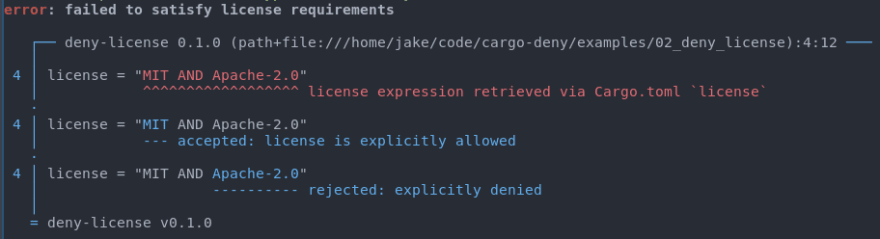

# Rust Crates后门与Cargo

作者： 王江桐

> 本篇将会简要介绍什么是《This week in Rust》，[第409篇推文](https://this-week-in-rust.org/blog/2021/09/22/this-week-in-rust-409/)中有关于Cargo优化二进制大小，[第417篇推文](https://this-week-in-rust.org/blog/2021/11/17/this-week-in-rust-417/)中有关于crates后门、Cargo指令与工具相关的内容。


## Crates与后门（Backdoor）

Rust crates一般在crates.io上统一进行管理，然而并不是所有的crates都是可信安全的。尽管对于新上传的库，Rust语言组正在努力建立管理机制，对于已上传在crates.io的库，这些管理机制可能并没有被良好应用。例如之前第415篇周报中提到的[Rust安全漏洞](https://zhuanlan.zhihu.com/p/428305373)，由于Unicode编码支持的双向覆写不可见代码点，用户在编辑器中阅读的代码和实际的代码可能并不是匹配的。除了这个已经修复的安全漏洞以外，"[Backdooring Rust crates for fun and profit](https://kerkour.com/rust-crate-backdoor/)"中另外提到了八种可以在目标机器远程执行代码的方式。

比较简单的方式包括使用类似crate名以及前缀来迷惑不够仔细的用户。例如对于已有库`num_cpus`，攻击者可以上传一个类似名字的库`num_cpu`，并仿照`num_cpus`的文档来迷惑用户。此外，所有在crates.io上的库并不像github一样，列在组织或个人账户下，而是放置于公共的平台。因此，一些项目或开发者会使用前缀来区分他们的库，例如`tokio-stream`或`actix-http`。然而，这些前缀任何人都可以使用，攻击者可以给不安全的库加上前缀来迷惑用户，而对于相似的readme，github库，tags，以及等等仿造的属性，有时用户并不能一眼区分出这些库并不来源于可信项目。

另外的方式例如，将带有后门的依赖藏在库的依赖树中。当用户使用某个库时，用户几乎不会查看库的依赖树，从而在第一时间发现这个库依赖了不安全的库。

涉及到管理上的漏洞例如，攻击者发布某个库的更新只需要一个token。如果攻击者获取了token，如果使用`cargo publish --allow-dirty`指令，那么发布更新并不会需要攻击者将代码上传到公共仓，而如果发布了更新，在用户使用Cargo时，所有使用该库旧版本的crates会下载这个恶意更新。

此外，使用某些库编写代码、恶意宏和恶意build.rs也可能带来问题。

Rust中，程序的运行由main函数开始，然而，通过使用Linux或FreeBSD的`.init_array`区块，macOS / iOS的`__DATA, __mod_init_func`区块，Windows的`.ctors，.CRT$XCU`区块，可以在调用函数之前运行一些代码。例如对于crate [startup](https://github.com/thomcc/startup/blob/main/src/lib.rs)：

```rust
#[macro_export]
macro_rules! on_startup {
    ($($tokens:tt)*) => {
        const _: () = {
            // pulled out and scoped to be unable to see the other defs because
            // of the issues around item-level hygene.
            extern "C" fn __init_function() {
                // Note: currently pointless, since even when loaded at runtime
                // via dlopen, panicing before main makes the stdlib abort.
                // However, if that ever changes in the future, we want to guard
                // against unwinding over an `extern "C"` boundary, so we force
                // a double-panic, which will trigger an abort (rather than have
                // any UB).
                let _guard = $crate::_private::PanicOnDrop;
                // Note: ensure we still forget the guard even if `$tokens` has
                // an explicit `return` in it somewhere.
                let _ = (|| -> () { $($tokens)* })();
                $crate::_private::forget(_guard);
            }
            {
                #[used]
                #[cfg_attr(
                    any(target_os = "macos", target_os = "ios", target_os = "tvos"),
                    link_section = "__DATA,__mod_init_func",
                )]
                // These definitely support .init_array
                #[cfg_attr(
                    any(
                        target_os = "linux",
                        target_os = "android",
                        target_os = "freebsd",
                        target_os = "netbsd",
                    ),
                    link_section = ".init_array"
                )]
                // Assume all other unixs support .ctors
                #[cfg_attr(all(
                    any(unix, all(target_os = "windows", target_env = "gnu")),
                    not(any(
                        target_os = "macos", target_os = "ios",
                        target_os = "tvos", target_os = "linux",
                        target_os = "android", target_os = "freebsd",
                        target_os = "netbsd",
                    ))
                ), link_section = ".ctors")]
                #[cfg_attr(all(windows, not(target_env = "gnu")), link_section = ".CRT$XCU")]
                static __CTOR: extern "C" fn() = __init_function;
            };
        };
    };
}
```

可以在库中创建后门：

- lib.rs

```rust
pub fn do_something() {
    println!("do something...");
}

startup::on_startup! {
    println!("Warning! You just ran a malicious package. Please read https://kerkour.com/rust-crate-backdoor for more information.");
}
```

- main.rs

```rust
fn main() {
    backdoored_crate::do_something();
}
```

恶意代码将会在main函数开始之前运行。

宏代码会在编译或使用`cargo check`指令的时候运行，`rust-analyzer`在编辑器打开项目时也会展开宏，因此，如果依赖库中的宏中含有恶意代码，这些代码可能会在用户未知的时候运行。例如：

- lib.rs

```rust
use proc_macro::TokenStream;
use std::path::Path;

fn write_warning(file: &str) {
    let home = std::env::var("HOME").unwrap();
    let home = Path::new(&home);
    let warning_file = home.join(file);

    let message = "Warning! You just ran a malicious package. Please read https://kerkour.com/rust-crate-backdoor for more information.";
    let _ = std::fs::write(warning_file, message);
}

// 属性宏
#[proc_macro_derive(Evil)]
pub fn evil_derive(_item: TokenStream) -> TokenStream {
    write_warning("WARNING_DERIVE");

    "".parse().unwrap()
}
```

- 依赖这个库的lib.rs

```rust
use malicious_macro::Evil;

#[derive(Evil)]
pub struct RandomStruct {}
```

另一个例子：

- lib.rs

```rust
// 类函数过程宏
#[proc_macro]
pub fn evil(_item: TokenStream) -> TokenStream {
    write_warning("WARNING_MACRO");

    "".parse().unwrap()
}
```

- 依赖于此库的lib.rs

```rust
pub fn do_something() {
    println!("do something...");
}

malicious_macro::evil!();
```

- main.rs

```rust
fn main() {
    lib::do_something();
}
```

在编译时，两个宏都会被展开，而其中的代码会被运行。

build.rs可以帮助自定义编译流程，例如编译或链接非Rust三方库。build.rs类似于宏，在使用`cargo check`指令或使用`rust-analyzer`时被调用。类似的，如果build.rs内含有恶意代码，在使用这些指令时代码会被运行，导致安全问题。例如：

```rust
use std::path::Path;

fn main() {
    let home = std::env::var("HOME").unwrap();
    let home = Path::new(&home);
    let warning_file = home.join("WARNING_BUILD");

    let message = "Warning! You just ran a malicious package. Please read https://kerkour.com/rust-crate-backdoor for more information.";
    let _ = std::fs::write(warning_file, message);
}
```

不过，虽然使用crates存在风险，但是这些风险并不是完全不可控，可以使用例如如下方式预防安全问题：

- 使用较大的标准库，减少对三方库依赖
- 使用Rust git依赖，定位更新到具体commit
- 使用云开发环境以及沙盒环境减少安全问题的损害


## Cargo

Cargo是Rust的包管理器，负责管理Rust的主要工作流程，可以提供控制整理Rust项目的依赖、帮助编译Rust项目等功能。官方的英文手册可见https://doc.rust-lang.org/cargo/，同时也有中文译本https://cargo.budshome.com/，可以对照英文手册查看。


### Cargo指令

根据"[Top 10 Rust Cargo Commands](https://dev.to/davidadewoyin/top-rust-cargo-commands-2b70)"，常用的十条指令如下：

- `cargo install [option] crate ...`

  - 在Rust安装根目录下的bin文件夹中安装Rust二进制包，只有包含可执行的bin或是example文件目标才可以被安装
  - 默认包位置为crate.io，但是如果设置flag，例如`--git`，`--path`，`--registry`等， 也可以从别的地址安装包。华为内部使用可参考此篇设置：http://openx.huawei.com/communityHome/postDetail?sid=1e3bc00ebdfd11eba17afa163efec54d&postId=2744&id=90。【外发删除】参数详解可见https://doc.rust-lang.org/cargo/commands/cargo-install.html
  - e.g. 
    - cargo install sqlx
    - cargo install --path PATH

- `cargo uninstall [options] [spec...]`

  - 卸载二进制包，spec参数为待卸载的包ID，参数详解可见https://doc.rust-lang.org/cargo/commands/cargo-uninstall.html
  - e.g.
    - cargo uninstall ripgrep

- `cargo tree [options]`

  - 查看依赖树，参数可见https://doc.rust-lang.org/cargo/commands/cargo-tree.html

  - e.g.

    - ```
      myproject v0.1.0 (/myproject)
      └── rand v0.7.3
          ├── getrandom v0.1.14
          │   ├── cfg-if v0.1.10
          │   └── libc v0.2.68
          ├── libc v0.2.68 (*)
          ├── rand_chacha v0.2.2
          │   ├── ppv-lite86 v0.2.6
          │   └── rand_core v0.5.1
          │       └── getrandom v0.1.14 (*)
          └── rand_core v0.5.1 (*)
      [build-dependencies]
      └── cc v1.0.50
      ```

- `cargo search [options] [query...]`

  - 在crate.io上搜索指定字符，并返回排版后的结果。query指搜索字符，option可见https://doc.rust-lang.org/cargo/commands/cargo-search.html

  - e.g. 

    - `cargo search serde`会返回：

    - ```
      serde = "1.0.130"                         # A generic serialization/deserialization framework
      discord_typed_interactions = "0.1.0"      # suppose you're working with discord slash commands and you want statically typed requ…
      serde_json_experimental = "1.0.29-rc1"    # A JSON serialization file format
      alt_serde_json = "1.0.61"                 # A JSON serialization file format
      serde_json = "1.0.70"                     # A JSON serialization file format
      serde_partiql = "1.1.65"                  # A PartiQL data model serialization file format
      cargo-geiger = "0.11.1"                   # Detects usage of unsafe Rust in a Rust crate and its dependencies.
      serde-encrypt = "0.6.0"                   # Encrypts all the Serialize
      serde-encrypt-core = "0.6.0"              # Encrypts all the Serialize
      typescript-definitions = "0.1.10"         # serde support for exporting Typescript definitions
      ... and 2787 crates more (use --limit N to see more)
      ```

- `cargo edit`

  - 是cargo的拓展，需要通过`cargo install cargo-edit`安装
  - 编辑依赖除了直接编辑cargo.toml以外，也可以使用edit指令编辑。子命令包括：
    - cargo add
    - cargo rm
    - cargo upgrade
    - cargo set-version

- `cargo +nightly udeps`

  - 需要通过`cargo install cargo-udeps --locked`安装
  - 可以帮助发现Cargo.toml中未使用的依赖。需要nightly版本运行

- `cargo expand`

  - 需要通过`cargo install cargo-expand`安装

  - 对于当前crate，打印出宏与`#[derive]`的扩展结果

  - e.g.

    - 原代码：

    ```rust
    #[derive(Debug)]
    struct S;
    
    fn main() {
        println!("{:?}", S);
    }
    ```

    - 使用指令展开后

    ```rust
    #[prelude_import]
    use std::prelude::v1::*;
    #[macro_use]
    extern crate std;
    struct S;
    #[automatically_derived]
    #[allow(unused_qualifications)]
    impl ::core::fmt::Debug for S {
        fn fmt(&self, f: &mut ::core::fmt::Formatter) -> ::core::fmt::Result {
            match *self {
                S => {
                    let mut debug_trait_builder = f.debug_tuple("S");
                    debug_trait_builder.finish()
                }
            }
        }
    }
    fn main() {
        {
            ::std::io::_print(::core::fmt::Arguments::new_v1(
                &["", "\n"],
                &match (&S,) {
                    (arg0,) => [::core::fmt::ArgumentV1::new(arg0, ::core::fmt::Debug::fmt)],
                },
            ));
        };
    }
    ```

- `cargo tarpaulin`

  - 需要通过`cargo install cargo-tarpaulin`安装。tarpaulin可以报告Cargo测试的代码覆盖率，不过目前只能在x86_64的CPU架构与Linux系统上使用
  - e.g.
    - 使用指令`cargo tarpaulin --ignore-tests`计算除了测试函数之外的代码覆盖率

- `cargo audit`

  - 需要通过`cargo install cargo-audit`安装
  - 可以审核Cargo.lock文件，查找被[RustSec Adivisory数据库](https://github.com/RustSec/advisory-db/)中记录的有安全隐患的库

- `cargo deny`

  - 需要通过`cargo install --locked cargo-deny && cargo deny init && cargo deny check`安装

  - 可以审核Cargo.lock文件，查找依赖树中被[RustSec Adivisory数据库](https://github.com/RustSec/advisory-db/)中记录的有安全隐患的库，限制某些依赖的使用、许可、下载源以及版本。

  - e.g.

    - `cargo deny check licenses`
    - 
    


其他一些常用的指令例如：

- `cargo help [subcommand]`
  - 帮助菜单，可以查找某个指令的帮助菜单
  - 同样也可以在指令之后加`--help` flag
- `cargo version [options]`
  - 查看版本
- `cargo bench [options] [benchname] [-- bench-options]`
  - 编译并执行benchmarks。只能在nightly版本执行，详细参数可见https://doc.rust-lang.org/cargo/commands/cargo-bench.html
  - e.g.
    - cargo bench -- foo --exact：只运行名为foo的benchmark
- `cargo build [options]`
  - 编译当前包
  - 可通过`--package`，`--workspace`，`--exclude`等flag来设置编译哪些包。参数详解可见https://doc.rust-lang.org/cargo/commands/cargo-build.html
- `cargo check [option]`
  - 验证当前包以及其依赖是否有错误
- `cargo clean [option]`
  - 清除Cargo生成的target。有时更新代码测试或benchmark测试前，最好先clean
- `cargo doc [option]`
  - 生成文档，文档位于target/doc文件夹。参数详解可见https://doc.rust-lang.org/cargo/commands/cargo-doc.html
- `cargo fix [option]`
  - 修复rustc告警，等同于`cargo check --all-targets`。参数详解可见https://doc.rust-lang.org/cargo/commands/cargo-fix.html
- `cargo run [option] [-- args]`
  - 运行当前包的二进制或example文件。在`--`之后的参数都会作为二进制文件参数运行。如果二进制文件本身需要命令行输入，在`--`之前的参数会传递给Cargo，而在之后的参数会传递给二进制文件。参数详解可见https://doc.rust-lang.org/cargo/commands/cargo-run.html
  - e.g.
    - cargo run --example exname -- --exoption exarg1 exarg2
- `cargo test [options] [testname] [-- test-options]`
  - 运行单元和集成测试，也就是运行由`#[test]`属性修饰的函数。与`cargo run`相同，在`--`之前的参数会传递给Cargo，而在之后的参数会传递给测试二进制文件。参数详解可见https://doc.rust-lang.org/cargo/commands/cargo-test.html
  - e.g.
    - cargo test foo -- --test-threads 3


以及一些其他的拓展：

- `cargo depgraph`

  - 需要通过`cargo install cargo-depgraph`安装。使用Cargo metadata和graphviz，生成项目依赖图

  - 详细可见：https://sr.ht/~jplatte/cargo-depgraph/

  - e.g.

    - `cargo depgraph --all-deps`
    - 可以生成如下依赖图：

    

- `cargo bloat`

  - 需要通过`cargo install cargo-bloat`安装。查找可执行文件中占用存储位置最大的部分

  - 详细可见：https://github.com/RazrFalcon/cargo-bloat

  - e.g.

    - `cargo bloat --crates --release`

    ```
    ❯ cargo bloat --crates --release 
       Compiling bar v0.1.0 (/home/okno/_Workshop/playground/bar)
       Compiling foo v0.1.0 (/home/okno/_Workshop/playground/foo)
        Finished release [optimized] target(s) in 0.47s
        Analyzing target/release/foo
    
    File  .text     Size Crate
    6.0%  92.2% 204.5KiB std
    0.3%   4.0%   8.9KiB rand_chacha
    0.1%   0.9%   2.0KiB getrandom
    0.0%   0.7%   1.6KiB rand
    0.0%   0.1%     230B [Unknown]
    0.0%   0.1%     219B rand_core
    0.0%   0.1%     185B foo
    0.0%   0.0%      68B ppv_lite86
    6.5% 100.0% 221.9KiB .text section size, the file size is 3.3MiB
    
    Note: numbers above are a result of guesswork. They are not 100% correct and never will be.
    ```

    


### cargo-sonar

除了这些指令以外，417篇周报中提到了一个新的Cargo拓展：[cargo-sonar](https://hole.tuziwo.info/cargo-sonar.html#_footnotedef_1)。可以通过如下指令安装：

```
cargo install cargo-sonar
```

Sonar指包括SonarQube，SonarCloud，SonarSource等一系列[SonarSource](https://www.sonarqube.org/)公司的静态代码质量与安全分析工具，支持包括C、C#、Java、Python等一系列语言。具体的介绍可参阅此链接：https://www.cnblogs.com/lfpriest/p/13366171.html

尽管社区提供了SonarQube的Rust插件，`sonar-rust`，插件只能装在服务端侧，无法在本地使用。`cargo-sonar`使用clippy的输出，然后使用Sonar分析输出得到sonar.json，随后将新生成的json文件上传至sonarcloud.io分析得到结果。

使用过程大致如下：

```
# 首先使用cargo clippy生成json输出
cargo clippy --all-features --all-targets --message-format=json -- --warn clippy::pedantic > clippy.json
# 使用sonar分析，生成sonar.json
cargo sonar --clippy
```

使用[sonar-scanner](https://docs.sonarqube.org/latest/analysis/scan/sonarscanner/)可以扫描sonar.json并在sonarcloud.io上生成结果。sonar-scanner的sonar-project.properties文件样例如下：

```
sonar.organization=woshilapin
sonar.projectKey=woshilapin_cargo-sonar
sonar.projectName=cargo-sonar
sonar.sources=.
sonar.host.url=https://sonarcloud.io
sonar.sourceEncoding=UTF-8
sonar.externalIssuesReportPaths=sonar.json	# 指向之前生成的sonar.json
sonar.login=the_token_of_the_project		# 账号相关 
```

使用sonarcloud.io需要注册账号，不过开源项目的分析是免费的。

此外，cargo-sonar也可以分析别的一些cargo拓展的输出，例如：

- cargo-audit

```
cargo audit --json > audit.json
cargo sonar --audit
```

- cargo-deny

```
cargo deny --format json check 2> deny.json
cargo sonar --deny
```

- cargo-outdated

```
cargo outdated --depth 1 --format json --workspace > outdated.json
cargo sonar --outdated
```


### Cargo与二进制大小优化

除了管理包和依赖，Cargo同时也负责项目编译。可以通过配置Cargo.toml文件以及编译时选项进行一些编译优化。生成库的格式和形式，以及动态库形式编译结果的段和对应大小介绍可见《[Rust 编译后二进制大小和常用优化方式](https://rustmagazine.github.io/rust_magazine_2021/chapter_4/hw_bin_opt.html)》，其中有非常详细的解释以及与C的对比。此章节将主要基于"[Optimize Rust binaries size with cargo and Semver](https://oknozor.github.io/blog/optimize-rust-binary-size/)"，概述配置文件可实现的编译优化。


#### 优化等级

在Cargo.toml中，可以通过配置`opt-level`属性来控制rustc编译时的优化等级。一般来说，等级越高，编译时间越长。`opt-level`属性在`[profile.dev]`下，可以通过更改Cargo.toml来设置：

```
[profile.dev]
opt-level = 1               # Use slightly better optimizations.
```

Cargo只会根据位于workspace根目录下的Cargo.toml来配置profile，依赖项与子crate中的Cargo.toml设置会被忽略，并且产生提醒。不过，根目录下的Cargo.toml中的设置会被环境变量或config定义所覆盖。

config文件可以放置在当前crate目录、父目录、Cargo安装目录来分别配置当前crate、父目录内crates、或所有的crates。例如，如果Cargo在文件路径`/projects/foo/bar/baz`被调用，那么Cargo会按序查找config：

1. `/projects/foo/bar/baz/.cargo/config.toml`
2. `/projects/foo/bar/.cargo/config.toml`
3. `/projects/foo/.cargo/config.toml`
4. `/projects/.cargo/config.toml`
5. `/.cargo/config.toml`
6. `$CARGO_HOME/config.toml`
   - Windows: `%USERPROFILE%\.cargo\config.toml`
   - Unix: `$HOME/.cargo/config.toml`

其余关于config参数等详细的描述可见https://doc.rust-lang.org/cargo/reference/config.html。

opt-level可选的赋值为：

| opt-level | 描述                                               | 备注                       |
| --------- | -------------------------------------------------- | -------------------------- |
| 0         | 无优化                                             | 优化强度随着数字增长而增长 |
| 1         | 基础优化                                           |                            |
| 2         | 一些优化                                           |                            |
| 3         | 所有的优化                                         |                            |
| "s"       | 优化二进制大小                                     |                            |
| "z"       | 优化二进制大小，并且关闭SIMD对于loop并行计算的优化 |                            |

其余的profile设置可见https://doc.rust-lang.org/cargo/reference/profiles.html。

在使用任何优化之前，"Optimize Rust binaries size with cargo and Semver"中初始二进制包大小为：

- coco: 5.1M
- cog: 5.7M

默认使用level 2。

使用level s：

- coco: 5.3M
- cog: 5.9M

使用level z：

- coco: 5.5M
- cog: 6.2M

使用level 1：

- coco: 9.4M
- cog: 12M

使用level 3：

- coco: 5.1M
- cog: 5.7M

也就是说，尽管可能对于其他项目有用，对于文中的例子，opt-level并没有起到优化二进制大小作用。不过，除了opt-level，Cargo也提供了其他的编译优化选项。


#### 链接时间优化

链接时间优化决定了后端LLVM如何优化二进制大小，以时间换空间，优化等级越高，编译时间越长，但是二进制包大小相对越小。同样，可以通过更改Cargo.toml来设置：

```
[profile.dev]
lto = "fat"
```

可选参数值列表如下：

| lto          | 描述                                                         |
| ------------ | ------------------------------------------------------------ |
| false        | 仅在当前crate的代码生成单元上执行"thin" LTO。如果代码生成单元按为1或者优化等级为0，那么不进行LTO |
| true / "fat" | 对于依赖图上所有crates执行优化                               |
| "thin"       | 类似于"fat"，但是平衡性能和时间，尽量使优化后结果持平于"fat"设置 |
| "off"        | 不进行LTO                                                    |

当`lto = "fat"`，`opt-level = 3`时，文中例子二进制大小为：

- coco: 3.0M
- cog: 3.8M

当`lto = "fat"`，`opt-level = 2`时，文中例子二进制大小为：

- coco: 2.9M
- cog: 3.7M


#### 代码生成单元

`codegen-units`属性决定编译器将一个crates分解为代码生成单元的数量，这些代码生成单元会被并行编译，但是并行编译可能会降低性能。`codegen-units`属性值取值范围是正整数，默认使用256，属性值越小，生成单元数量越少，编译时间越长。

当使用如下配置时，文中例子二进制大小为：

```
[profile.release]
opt-level = 2
lto = "fat"
codegen-units = 1
```

- coco: 2.6M
- cog: 3.6M

尽管二进制文件变小了，但是编译时间延长了5秒。对于更大的项目，使用优化设置时，编译时间或许会更长。


#### 重复依赖

对于含有重复依赖的项目，这些重复的依赖会不必要地增加二进制文件的大小。例如对于有如下重复依赖的项目：

```
❯ cargo tree --duplicates -e=no-dev            
num-traits v0.1.43
└── serde-hjson v0.9.1
    └── config v0.11.0
        └── cocogitto v3.0.0 (/home/okno/_Workshop/MyRepos/cocogitto)

num-traits v0.2.14
├── chrono v0.4.19
│   └── cocogitto v3.0.0 (/home/okno/_Workshop/MyRepos/cocogitto)
├── num-integer v0.1.44
│   └── chrono v0.4.19 (*)
└── num-traits v0.1.43 (*)

serde v0.8.23
└── serde-hjson v0.9.1 (*)

serde v1.0.130
├── cocogitto v3.0.0 (/home/okno/_Workshop/MyRepos/cocogitto)
├── config v0.11.0 (*)
├── serde_json v1.0.67
│   └── config v0.11.0 (*)
└── toml v0.5.8
    ├── cocogitto v3.0.0 (/home/okno/_Workshop/MyRepos/cocogitto)
    └── config v0.11.0 (*)
```

如果使用`cargo depgraph --build-deps | dot -Tpng > graph.png`分析，可以得到如下依赖图：


如图中`serde-hjson`等以虚线链接的依赖是可选的，可以通过关闭cargo feature的方式来去除，而不影响总体功能。config默认开启的feature包括：`toml`，`json`，`yaml`，`hjson`，`ini`；可以通过修改config features的方式关闭这些cargo feature：

```
config = { version = "^0", default-features = false, features = ["toml"] }
```

此外，对于部分项目而言，也可以使用版本兼容符号`^`来避免编译某个依赖的多个版本：

```
[dependencies]
rand = "^0.7" # crate requirement: >=0.7.0, <0.8.0
```

修改之后的二进制大小为：

- coco: 2.3M
- cog: 3.1M


#### 去除末尾字节

二进制文件的目标文件符号是用于连接或debug的元数据，例如解决不同模块之间符号交叉引用的信息、重定位信息、堆栈展开信息、注释、程序符号、调试或分析信息。其他元数据可能包括日期和编译时间、编译器名称和版本以及其他识别信息。虽然一般不推荐，但是如果希望极限压缩二进制文件大小，可以通过unix程序`strip`删除这些符号：

```
strip -S cog
strip -S coco
```

在删除之后，裸二进制文件大小为：

- coco: 1.1M
- cog: 1.5M


## 引用

The Cargo Book，https://doc.rust-lang.org/cargo/index.html

Top 10 Rust Cargo Commands，https://dev.to/davidadewoyin/top-rust-cargo-commands-2b70

cargo-sonar，https://hole.tuziwo.info/cargo-sonar.html

Optimize Rust binaries size with cargo and Semver，https://oknozor.github.io/blog/optimize-rust-binary-size/

Backdooring Rust crates for fun and profit，https://kerkour.com/rust-crate-backdoor/

Rust 编译后二进制大小和常用优化方式，https://rustmagazine.github.io/rust_magazine_2021/chapter_4/hw_bin_opt.html


