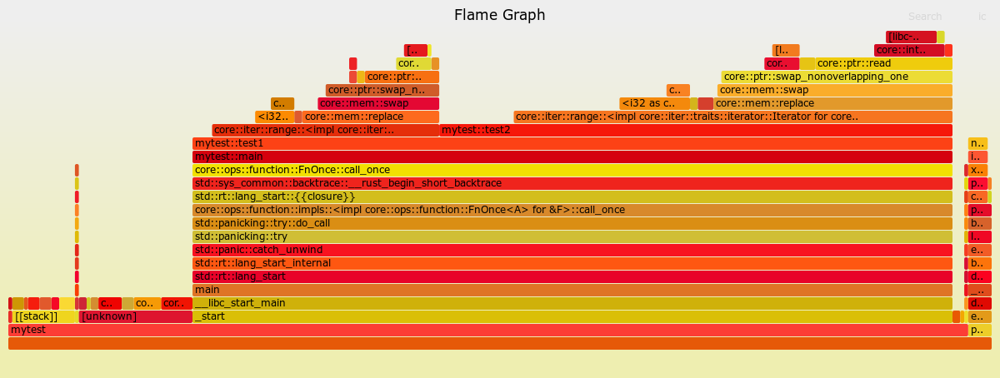
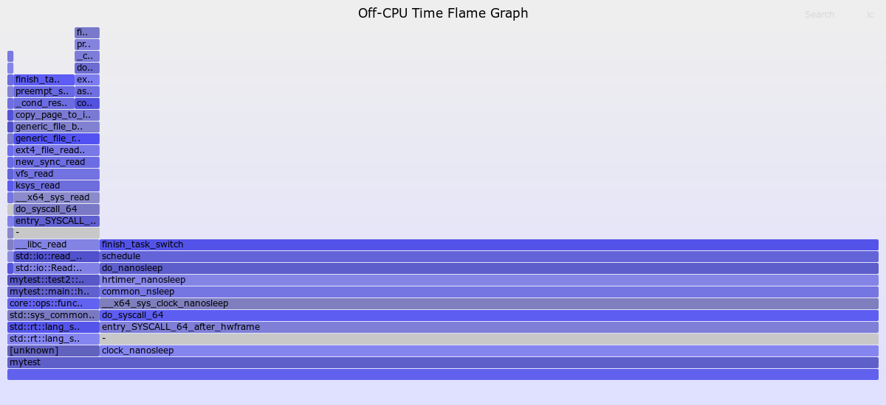

# DatenLord | Rust程序性能分析

作者：潘政

---

## 简介
程序的性能分析是一个很广很深的话题，有各种各样的工具来对不同的指标进行测试分析。本文主要介绍如何用`profiling`工具对`Rust`程序进行`On-CPU`和`Off-CPU`的性能分析，以及如何绘制火焰图对结果测试进行可视化处理。
## On-CPU性能分析
`On-CPU`的性能分析为了找出占用CPU时间多的任务或者函数，进而找出程序的性能瓶颈。这里主要介绍[perf](https://perf.wiki.kernel.org/index.php/Main_Page)工具，`perf`是`Linux`提供的命令，也叫`perf_events`，它属于`Linux kernel`，在`tools/perf`目录下。`perf`提供了强大的功能包括监测CPU performance counters, tracepoints, kprobes和 uprobes等。这里我们使用`perf`的CPU profiling功能。由于`perf`会拿到系统的信息，所以运行需要root权限。`perf`做`On-CPU`性能分析的原理是以一个指定的频率对CPU进行采样，进而拿到正在CPU上运行的指令乃至整个函数调用栈的快照，最后对采样的数据分析，比如说在100次采样中有20次在运行A指令或者A函数，那么`perf`就会认为A函数的CPU使用率为20%。  
下面我们使用一个简单的程序来展示如何用`perf`来进行`On-CPU`的性能分析，需要使用debug编译，程序如下：
```Rust
fn test2() {
    for _ in 0..200000 {
        ()
    }
}
fn test1() {
    for _ in 0..100000 {
        ()
    }
    test2();
}
fn main() {
    for _ in 0..10 {
        test1();
    }
}
```
我们在`test1()`函数和`test2()`函数中分别加入了一个段循环来消耗`CPU`资源，在`test2()`中我们循环了200000次是在`test1()`中的两倍。我们使用如下`perf`命令来做`CPU profiling`:
```shell
$ sudo perf record --call-graph=dwarf ./target/debug/mytest
```
采样的数据默认会存到`perf.data`文件中。参数`--call-graph`的目的是开启函数调用栈的记录，这样在`profiling`的结果中可以打印出完整的函数调用栈。目前`perf`支持`fp(frame pointer)`, `dwarf(DWARF's CFI - Call Frame Information)`和`lbr(Hardware Last Branch Record facility)`三种方式来获取函数调用栈。稍后我们会简单介绍`fp`和`dwarf`的原理。由于`Rust`编译器默认生成了`dwarf`格式的调试信息，我们可以直接使用`--call-graph=dwarf`。我们可以使用如下命令来读取`profiling`的结果：
```shell
$ sudo perf report --stdio
```
这个命令会默认读取`perf.data`中的数据并格式化输出。命令的输出如下，因为输出很长，部分无关信息被省略掉，
```
# Children      Self  Command  Shared Object      Symbol
# ........  ........  .......  .................  .........................................................................................................
#
    77.57%     0.00%  mytest   mytest             [.] _start
            |
            ---_start
               __libc_start_main
               main
               ......
               mytest::main
               mytest::test1
               |
               |--52.20%--mytest::test2
               |          |
               |           --46.83%--core::iter::range::<impl core::iter::traits::iterator::Iterator for core::ops::range::Range<A>>::next
               |                     |......
               |
                --23.87%--core::iter::range::<impl core::iter::traits::iterator::Iterator for core::ops::range::Range<A>>::next
                          |......
               |......            
```
从输出可以看出整个测试程序占用了77.57%的CPU资源，在`mytest::test1`函数中有23.87%的时间在做`for`循环，有52.20%的时间被调用的`mytest::test2`函数占用，然后在`mytest::test2`函数中，有45.32%时间在做for循环，剩下的时间是一些其他的开销。`profiling`的结果基本体现了我们测试程序`CPU`占用率的实际情况。我们在`mytest::test2`函数中`for`循环次数是`mytest::test1`函数中两倍，相应的我们也看到了在`CPU`占用率上也几乎是两倍的关系。  
### 火焰图
火焰图是对`profiling`进行可视化处理的一种方式，从而更直观地展示程序`CPU`的使用情况，通过如下命令可以生成火焰图
```shell
$ git clone https://github.com/brendangregg/FlameGraph
$ cd FlameGraph
$ sudo perf record --call-graph=dwarf mytest
$ sudo perf script | ./stackcollapse-perf.pl > out.perf-folded
$ ./flamegraph.pl out.perf-folded > perf.svg
```
可以使用Chrome浏览器打开`perf.svg`，生成的火焰图如下
  
火焰图的纵轴代表了函数调用栈，横轴代表了占用`CPU`资源的比例，跨度越大代表占用的`CPU`资源越多，从火焰图中我们可以更直观的看到程序中`CPU`资源的占用情况以及函数的调用关系。
### Frame Pointer 和 DWARF
前文有提到`Frame Pointer`和`DWARF`两种方式拿到函数的调用栈，这里做一个简单的介绍。

`Frame Pointer`是基于标记栈基址`EBP`的方式来获取函数调用栈的信息，通过`EBP`我们就可以拿到函数栈帧的信息，包括局部变量地址，函数参数的地址等。在做`CPU profiling`的过程中，`fp`帮助函数调用栈的展开，具体原理是编译器会在每个函数入口加入如下的指令以记录调用函数的`EBP`的值
```assembly
push ebp
mov	ebp, esp
sub	esp, N
```
并在函数结尾的时候加入如下指令以恢复调用函数的`EBP`
```assembly
mov	esp, ebp
pop	ebp
ret
```
通过这种方式整个函数调用栈像一个被`EBP`串起来的链表，如下图所示  
  
这样调试程序就可以拿到完整的调用栈信息，进而进行调用栈展开。

因为`Frame Pointer`的保存和恢复需要引入额外的指令从而带来性能开销，所以`Rust`编译器，`gcc`编译器默认都是不会加入`Frame Pointer`的信息，需要通过编译选项来开启。`Rust`编译器加入`Frame Pointer`的选项如下
```shell
$ RUSTFLAGS="-C force-frame-pointers=yes" cargo build
```
加入`Frame Pointer`的信息后就可以通过`--call-graph=fp`来打印函数的调用栈。

`DWARF`是被广泛使用的调试格式，`Rust`编译器默认加入了`DWARF`调试信息，`DWARF`格式提供了各种调试信息，在帮助函数调用栈展开方面，编译器会插入`CFI(Call Frame Information)`指令来标记`CFA(Canonical Frame Address)`，`CFA`指的是调用函数在`call`被调函数前`ESP`的地址。通过`CFA`再加上预先生成的调试信息，就可以解析出完整的函数调用栈信息。
## Off-CPU性能分析
`Off-CPU`性能分析与`On-CPU`性能分析是互补的关系。`Off-CPU`性能分析是为了分析进程花在等待上的时间，等待包括被`I/O`请求阻塞，等待锁，等待timer，等等。有很多可以做`Off-CPU`性能分析的工具，这里我们使用`eBPF`的前端工具包[bcc](https://github.com/iovisor/bcc)中的`offcputime-bpfcc`工具。这个工具的原理是在每一次内核调用`finish_task_switch()`函数完成任务切换的时候记录上一个进程被调度离开`CPU`的时间戳和当前进程被调度到`CPU`的时间戳，那么一个进程离开`CPU`到下一次进入`CPU`的时间差即为`Off-CPU`的时间。为了模拟`Off-CPU`的场景我们需要修改一下我们的测试程序，需要使用debug编译，因为`offcputime-bpfcc`依赖于`frame pointer`来进行栈展开，所以我们需要开启`RUSTFLAGS="-C force-frame-pointers=yes"`的编译选项，程序如下：
```rust
use std::io::Read;
fn test1() {
    std::thread::sleep(std::time::Duration::from_nanos(200));
}
fn test2() {
    let mut f = std::fs::File::open("./1.txt").unwrap();
    let mut buffer = Vec::new();
    f.read_to_end(&mut buffer).unwrap();
}
fn main() {
    loop {
        test1();
        test2();
    }
}
```
程序中一共有两种会导致进程被调度出`CPU`的任务，一个是`test1()`函数中的`sleep()`，一个是在`test2()`函数中的读文件操作。这里我们需要开启`Frame Pointer`编译选项以便打印出用户态的函数栈。我们使用如下的命令获取`Off-CPU`的分析数据，
```shell
$ ./target/debug/mytest &
$ sudo offcputime-bpfcc -p `pgrep -nx mytest` 5
    .......
    b'finish_task_switch'
    b'preempt_schedule_common'
    b'_cond_resched'
    b'copy_page_to_iter'
    b'generic_file_buffered_read'
    b'generic_file_read_iter'
    b'ext4_file_read_iter'
    b'new_sync_read'
    b'vfs_read'
    b'ksys_read'
    b'__x64_sys_read'
    b'do_syscall_64'
    b'entry_SYSCALL_64_after_hwframe'
    b'__libc_read'
    b'std::io::read_to_end::hca106f474265a4d9'
    b'std::io::Read::read_to_end::h4105ec7c4491a6c4'
    b'mytest::test2::hc2f1d4e3e237302e'
    b'mytest::main::h9ce3eef790671359'
    b'core::ops::function::FnOnce::call_once::hac091ad4a6fe651c'
    b'std::sys_common::backtrace::__rust_begin_short_backtrace::h071a56f0a04107d5'
    b'std::rt::lang_start::_$u7b$$u7b$closure$u7d$$u7d$::hc491d6fbd79f86bd'
    b'std::rt::lang_start_internal::h73711f37ecfcb277'
    b'[unknown]'
    -                mytest (179236)
        52

    b'finish_task_switch'
    b'schedule'
    b'do_nanosleep'
    b'hrtimer_nanosleep'
    b'common_nsleep'
    b'__x64_sys_clock_nanosleep'
    b'do_syscall_64'
    b'entry_SYSCALL_64_after_hwframe'
    b'clock_nanosleep'
    -                mytest (179236)
        1093
```
这里只截取了最后两个函数栈，输出显示有52ms的`Off-CPU`时间在等待文件读取的`syscall`，有1092ms的`Off-CPU`时间在等待`sleep`。
### 火焰图
`Off-CPU`性能分析的结果同样可以用火焰图进行可视化处理，命令如下，
```shell
$ git clone https://github.com/brendangregg/FlameGraph
$ cd FlameGraph
$ sudo offcputime-bpfcc -df -p `pgrep -nx mytest` 3 > out.stacks
$ ./flamegraph.pl --color=io --title="Off-CPU Time Flame Graph" --countname=us < out.stacks > out.svg
```
生成的火焰图如下：
  
与`On-CPU`的火焰图相同，纵轴代表了函数调用栈，横轴代表了`Off-CPU`时间的比例，跨度越大代表`Off-CPU`的时间越长。
## 总结
本文介绍了如何对`Rust`程序进行`On-CPU`和`Off-CPU`的性能分析，两者相结合就实现了对一个程序100%运行时间的分析。至此我们对程序的性能有了初步的理解，进而可以通过更加具体的工具和编写`profiling`程序来对我们关心的点进行更深入的分析。

## 参考引用
https://www.brendangregg.com/FlameGraphs/offcpuflamegraphs.html  
https://www.brendangregg.com/FlameGraphs/cpuflamegraphs.html  
https://en.wikipedia.org/wiki/Function_prologue_and_epilogue
