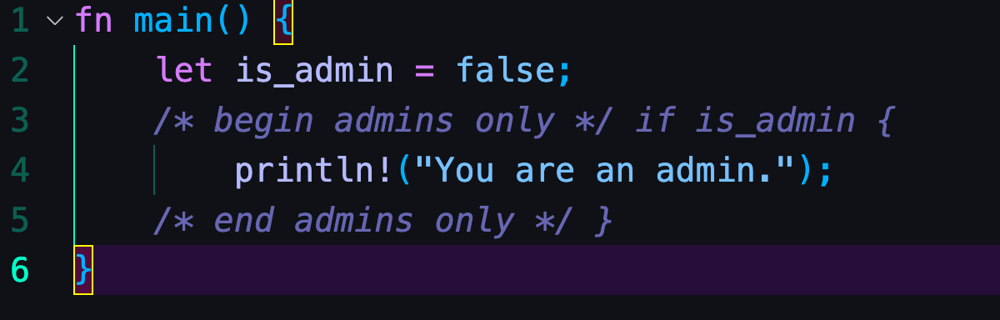

# 特洛伊之源｜ 在 Rust 代码中隐藏无形的漏洞

作者： 张汉东

---

今天 Rust 官方安全应急响应工作组发布了 [Rust 编译器安全公告（CVE-2021-42574）](https://blog.rust-lang.org/2021/11/01/cve-2021-42574.html) ，宣称该工作组被告知 Rust 编译器存在一个安全问题，这个安全问题可能会导致 「人眼审查」的 Rust 代码 与 「编译后给机器用的」机器码 完全不一致。

这个安全问题并不是 Rust 编译器自身的缺陷导致的，而是由 Unicode 相关的双向算法 漏洞（[CVE-2021-42574](https://cve.mitre.org/cgi-bin/cvename.cgi?name=CVE-2021-42574)）而导致的。

而利用这个 Unicode 漏洞的攻击方法叫做：[特洛伊之源（Trojan Source）](https://trojansource.codes/) 。

## 特洛伊之源（Trojan Source）： 无形的漏洞

在 特洛伊之源（Trojan Source）的官方网站上链接了一篇论文: [特洛伊之源 ：无形的漏洞（Trojan Source: Invisible Vulnerabilities）](https://trojansource.codes/trojan-source.pdf) 。

这篇论文来自于剑桥大学的研究人员，在其中介绍了在程序源代码中隐藏一种人眼无法识别的漏洞的攻击方法，就是 特洛伊之源，[POC 攻击代码](https://github.com/nickboucher/trojan-source)已发布在 GitHub 上。

这种被称为 特洛伊之源 的攻击方法利用的是字符编码标准 `Unicode` 中的微妙之处，利用方向覆盖、同形异义等创造出对编译器和人类代码审查员视觉上存在差异的源代码，人眼看不出漏洞，但对编译器来说逻辑编码顺序和显示的顺序是不同的。这种攻击方法对 `C`、`C++`、`C#`、`JavaScript`、`Java`、`Rust`、`Go` 和` Python` 都有效，研究人员已经将漏洞报告给了相关项目。

特洛伊之源攻击方法的危害是非常大的。试想一下，你从 GitHub 下载的依赖 `crate` 中，可能植入了被进行特洛伊之源攻击的代码。而这种攻击，可以通过 GitHub 这类开源平台中的 PR 像任意开源项目进行攻击，防不胜防。

### POC 代码

让我们看一下 POC 中的 Rust 代码。POC Rust 代码一共给了四个案例，其中有三个案例是可以执行成功的。

#### 移花接木：通过注释进行攻击

该文件包含双向Unicode文本，其解释或编译方式可能与下面的内容不同。要审查，请在一个能显示隐藏的Unicode字符的编辑器中打开该文件。



```rust
// 该文件包含双向Unicode文本，其解释或编译方式可能与下面的内容不同。要审查，请在一个能显示隐藏的Unicode字符的编辑器中打开该文件。
// 执行输出 
fn main() {
    let is_admin = false;
    /*‮ } ⁦if is_admin⁩ ⁦ begin admins only */
        println!("You are an admin.");
    /* end admins only ‮ { ⁦*/
}
```

代码看上去好像 不会执行打印语句，实际上，if 表达式和块早已被注释。

#### 暗渡陈仓：字符串攻击


```rust
fn main() {
    let access_level = "user";
    if access_level != "user‮ ⁦// Check if admin⁩ ⁦" {
        println!("You are an admin.");
    }
}
```

这段代码不应该输出里面的打印语句，但实际上输出了。因为开发者看上去条件表达式里 确实等于 `"user"`，但实际上不等于`"user"`，因为这个字符串里被加了隐藏字符。

#### 李代桃僵：同形字符攻击


```rust
fn say_hello() {
    println!("Hello, World!\n");
}

fn say_һello() {
    println!("Goodbye, World!\n");
}

fn main() {
    say_һello();
}
```

图片中代码里有两个 `say_hello` 函数，但实际上函数名不一样，main 函数里调用的是被篡改过的函数，有种李代桃僵的感觉。

当然，有时候 Rust 编译器也能发现问题，编译出错，但上面这三个例子，则是完全编译通过。

###  特洛伊之源的漏洞机制

看到这里，你是否感觉特洛伊之源攻击虽然危害性很大，但其实也很有意思？

其实这个 Unicode 漏洞只要是玩过 QQ / 微信的，大部分人都利用过：你肯定改过你的qq签名，让大家看到语句是从右到左的逆向显示。

严格来说，它也不算是漏洞，只是 Unicode 的一种特性。但因为` Unicode` 的设计缺陷，就很容易被利用实施恶意攻击，而 视觉欺骗，是最常见考虑最多的 `Unicode` 安全问题。

`Unicode`（统一码、万国码、单一码）是一种在计算机上使用的字符编码。它为每种语言中的每个字符设定了统一并且唯一的二进制编码，以满足跨语言、跨平台进行文本转换、处理的要求。1990年开始研发，1994年正式公布。

为了兼容世界各地不同的语言书写习惯，Unicode 引入了双向算法来控制文本显示顺序。大多数语言的文本在水平方向都是按从左到右(Left To Right，简称LTR)的顺序显示字符的，但也有不少语言是按从右到左(Right To Left，简称RTL)的顺序显示字符的(比如阿拉伯语、希伯来语)。当然还有按垂直方向书写的文本，比如中国古代的汉字、蒙语就是从上到下从右到左书写的。

`Unicode` 标准内规定两种文本顺序：在内存中表示的顺序为逻辑顺序，而最终显示的文本顺序为显示顺序。文本的逻辑顺序和显示顺序并不一定会一致。

**`Unicode` 中如果出现 双向文本 ，若不明确确定文本的显示顺序，在显示的时候就会出现歧义。特洛伊之源攻击利用的就是这一点！**

`Unicode` 引入 定向格式化字符 来解决这个问题。比如，使用`RLO`控制符来控制字符从右向左显示，`PDF`表示`RLO`的终止字符，那么`ab cd RLO EF GH PDF x`，将被显示为`ab cd HG FE x` 。

除了双向显示之外，`Unicode` 还提供一些同形字符 和隐藏字符等，这些都是构成了 视觉欺骗 攻击的特性基础。

## Rust 的解决方式

为了评估生态系统的安全性，官方分析了 crates.io 上发布的所有 crate 版本（截至 2021 年 10 月 17 日），只有 5 个 crate 的源代码中包含受影响的代码点，但没有一个是恶意的。

官方就在发布此安全公告的当天（2021.11.01），已经发布了 `1.56.1` 版本，通过新增两个 `lint` 来解决此问题。lint 将阻止包含这些码点的源代码文件被编译，从而保护 Rust 开发者免受攻击。如果你的代码对代码点有合法用途，官方建议将它们替换为相关的转义序列。错误消息也将建议使用正确的转义。

#### 1.56.1 相关 PR

- [[stable] Fix CVE-2021-42574 and prepare Rust 1.56.1](https://github.com/rust-lang/rust/pull/90460/files)

被加入的两个lint 是 :

- [`text-direction-codepoint-in-comment`](https://doc.rust-lang.org/rustc/lints/listing/deny-by-default.html#text-direction-codepoint-in-comment)
- [`text_direction_codepoint_in_literal`](https://doc.rust-lang.org/rustc/lints/listing/deny-by-default.html#text-direction-codepoint-in-literal)

```rust
#![deny(text_direction_codepoint_in_comment)]
fn main() {
    println!("{:?}"); // '‮');
}

#![deny(text_direction_codepoint_in_literal)]
fn main() {
    println!("{:?}", '‮');
}
```

这两个 `lint` 拒绝代码中出现可以更改显示顺序的 `Unicode` 码点出现。并且特别禁止 `\u{202A}`，`\u{202B}`，`\u{202D}`，`\u{202E}`，`\u{2066}`， `\u{2067}`，`\u{2068}`，`\u{202C}`和`\u{2069}` 这几个特殊的 `Unicode` 码点。

**但是这两个 `lint` 并不能防止 同形攻击，好在 Rust 编译器还能通过识别同名方法给予 警告，写代码的时候要注意警告，识别代码中隐藏的同形攻击。**

#### 事件响应时间表

- 2021-07-25：官方收到了报告并开始着手修复。
- 2021-09-14：接到漏洞公开的解禁日期（2021-11-01）。
- 2021 年 10 月 17 日：对发布到 crates.io 的所有源代码进行了分析，以检查是否存在此攻击。
- 2021-11-01：解禁日，漏洞公开，Rust 1.56.1 发布。

看得出来 Rust 官方对此类安全事件的处理还是非常到位的。

#### GitHub 应对

在 GitHub 网站上，现在会检测这类双向 Unicode 字符并发出警告，但是对于 隐藏字符和同形攻击的 Unicode 字符就无法警告了。


