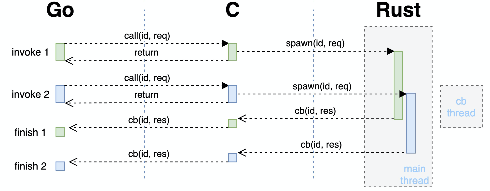

# 蚂蚁集团 | 一次 Go 使用嵌入式 Rust 库的踩坑实践

作者：RuihangXia 

--- 

## 背景

故事发生在一个内部项目上，这个项目有 Go 和 Rust 两个部分，其中 Rust 库作为一个存储组件被 Go 的业务部分依赖着。出于种种原因，两个部分需要作为同一个进程来运行，中间有一层 C FFI 接口作为理想与现实的桥梁。大概是这个样子的


Rust 部分首先将使用到的 Library 的接口和结构使用另一个小小的 cdylib [1] shim 项目封装一下，并通过这个项目生成 Rust 库的编译产物一个动态链接对象和 C 的接口定义。再基于 C 的定义写一个 Go 的 SDK 给上层使用。单独的左边 Go 或者右边 Rust 项目都不够刺激，本文主要集中在中间那一团麻花的部分上，也是我 too young too simple 掉了很多头发的地方。

本文从线程、内存和信号三个大概的方面讲几个事故。

## 线程

刚开始的时候 shim 和 SDK 都非常简单，SDK 每个请求都通过 cgo 走到 shim，shim 在进行一些结构的转换后调用 library 来处理请求，等待请求完成之后把结果返回给 SDK。比较符合直觉的流程，但是在测试的时候出现了问题，整个程序的行为都不太正常。当时刚开始连调，在这之前 component 和 library/shim 都只进行了单独的测试，当然单独测试的时候都是一切正常，所以场景大概是这样的…


虽然很快就怀疑到了 SDK 和 shim 部分，但是也不清楚问题到底出在哪里。直到在 library 的日志中发现了一条原本只应该在启动的时候输出的日志出现了复数次的时候才意识到不对劲。出于一些原因，shim 和 library 中都存在有 TLS [2]（thread local storage，线程局部存储）结构，在 Rust std 中就提供了一种实现 [3]。它会在每个线程第一次使用这个结构的时候进行初始化，之后同一个线程都会一直访问到这个结构，而不同的线程之间访问到的是不同的结构。而那条重复出现的日志就是一个 TLS 结构在初始化时输出的，也就是说 TLS 不符合预期地被重复初始化了。

先看下 Go 在进行 cgo 调用的时候会发生什么，Go 中每个线程与系统线程不是一一对应，在进行非 Go 的调用时，会把当前 goroutine 放在一个系统线程上，使用这个系统线程后完成后续的调用流程。所以如果不做特殊处理的话对于 shim 来说每次请求都有可能发生在一个新的线程上，而使得之前保存在 TLS 中的状态失效。并且更加严重的是，shim 的 TLS 中包括了一些 library 的线程句柄，导致 library 的部分状态也出现了混乱，最终整个进程的行为都变得很奇怪。

为了解决这个问题，我们需要把 shim 和 library 的线程固定住，shim 接到请求后通过线程信息传递的方式与 library 交互，包括发送请求与接收结果。代码如下

```rust
struct Handle {
    runtime: Runtime // this was TLS
}

impl Handle {
    fn new() -> Self{
        let worker_thread = std::thread::spawn(|| {}); // main thread, channels inside
        let runtime = Runtime::new(); // cb threads
        Self { runtime }
    }
}
```

同时来都来了，也顺便将 library 异步的接口暴露到了上层，由原来一次 cgo 完成整个请求的方式变成了一次 cgo 提交请求，结果通过后续另一次 C->Go 调用异步地返回，也能够防止大请求把 Go runtime spawn 出来的 cgo 线程阻塞太长时间。现在的交互流程类似下图：



不过这只是很基础的方案，“变电器” cgo 的原理很简单，但也存在许多优化空间，能够在解决问题的同时降低损耗 [5, 6, 7]。

## 内存

除此之外，为了通过 C 的接口来传递数据，需要对数据结构进行一些修改，这一部分主要在 shim 和 SDK 进行。简单来说就是把所有需要传递的类型都能够用 C 表示出来，在这里 [13] 提供了一些例子，下面也有我们的一段示例：

```rust
#[repr(C)]
pub struct Bytes {
    ptr: *mut libc::c_void,
    len: libc::size_t,
}

crate fn make_bytes(mut bytes: Vec<u8>) -> Self {
    bytes.shrink_to_fit();
    let (ptr, len, cap) = bytes.into_raw_parts();
    debug_assert_eq!(len, cap);

    Bytes {
        ptr: unsafe { mem::transmute::<*mut u8, *mut libc::c_void>(ptr) },
        len,
    }
}
```

Go 与 Rust 在远离 FFI 边界的地方（一般来说）都能够很好地处理内存问题，这些非法的指针和地址基本上都是另一方丢过来的。在这个场景下，为了减少工作量我们已经通过使用大量的拷贝减少了许多使用裸指针的地方，剩下的主要集中在两处，即接收对方传递过来的数据以及通知对方回收这一块数据的内存。除开遵守老生常谈的“**谁分配谁释放**”原则外，我们也要能够对出现的问题进行定位。

最先的入手点就是发生错误时所打出来的堆栈，按照经验跟着上面的错误信息后的第一条 Go routine backtrace 通常是发生问题的地方。可以先顺着调用栈检查一下代码中是否有不正确的指针使用。不过这个堆栈中只会存在 Go 这一部分的信息。当问题出现在 Go 之外的时候我们只能够知道是哪一个 cgo 函数值得怀疑。这一部分就和普通的内存问题排查差不多，我们几个常用的方法如下：

#### 打印日志

如果问题比较好复现的话，可以在路径上多增加一些日志输出，把值得怀疑的指针地址以及它们解引用之后的内容打印出来，有时能够观察到一个指针是如何一步步走向非法的。注意解引用时最好放到另一行日志中，每一个解引用操作都是在非法边缘试探，如果这个指针在解引用的时候出错可能会带着其他有用的日志输出一起消失。

#### 借助工具

也可以通过一些工具来监测内存的使用情况，比如各种 sanitizer [8]，valgrind [9] 等，有的时候不是所有的内存问题都会导致程序挂掉，一些非法的内存操作有可能被忽略，比如数组稍微越界一点点，不小心 free 多次或忘记 free 等。这些工具能够帮助及时的发现这些问题。不过它们都或多或少会带来一些性能影响，所以并不是所有情况都适用。

```bash
# valgrind
$ cargo build
$ valgrind --leak-check=full --show-leak-kinds=all --tool=memcheck $(BIN)

# address sanitizer
$ export RUSTFLAGS=-Zsanitizer=address RUSTDOCFLAGS=-Zsanitizer=address
$ cargo run -Zbuild-std --target x86_64-unknown-linux-gnu
```

#### 特殊值

有些环境会在内存操作前后把那一块内存设置上特殊值来表示这块内存的状态，使它能方便地被观察到。如 jemalloc 的 `--enable-fill` 参数 [10] 或 MariaDB 的 `TRASH_ALLOC()` [11] 宏。

#### 缩小范围

分为两个方面的缩小。如果条件允许的话也可以通过注释掉一些代码来缩小排查范围，比如先不进行 free 操作或者暂停部分路径进行观察；以及缩短调用路径，对各个组件进行 mock 测试。

还有一些其他的小地方，比如观察指针是否对齐，出错的指针与周围指针的范围等。比如这里 Go 与 Rust 运行在同一个进程内，能够观察出 Go 出来的指针和 Rust 出来的指针在两个地址段上，指针的值有时候也能够说明一些信息（不是故意讲这么玄乎的…）。不过说归说，在实际调试过程中遇到的内存问题表面上千篇一律，背地里各有千秋。当程序有一个内存问题时可能会带来各种千奇百怪的表现，因此也需要能够对不同的问题进行分类并案。在有各种方法手册的同时也避免形成固定流程，而是能够根据新得到的信息及时调整手段。毕竟一般来说全然无计可施的情况比较少，而经常是有许多手段但不知道哪一个才能得到信息。每个技能都会有施法时间消耗，万一被 invalid pointer 纠缠太久导致做梦都是 panic 就很痛苦了 TAT。


在制作 shim，binding 和它们的 c demo 的时候通过一些 C 重新体验了一下文明的进步，但是回过头想想是不是有更先进的方法来避免 unsafe 一把梭的 FFI 呢，这是我们后面需要继续思考的问题。

## 信号

这是一个花了比较久时间的问题，由一次 SIGSEGV 开始，先剧透一下这个本质上也是一个内存问题。

```plain
fatal error: unexpected signal during runtime execution
[signal SIGSEGV: segmentation violation code=0x2 addr=0x18589091b1 pc=0x7f9205f814ba]

runtime stack:
runtime.throw({0xace954, 0xefc4e055})
        /home/go/src/runtime/panic.go:1198 +0x71 fp=0x7f91dce8afe8 sp=0x7f91dce8afb8 pc=0x448451
runtime.sigpanic()
        /home/go/src/runtime/signal_unix.go:719 +0x396 fp=0x7f91dce8b038 sp=0x7f91dce8afe8 pc=0x45fdf6
```

这里的复现比较花时间，原始场景一般需要半天到一天才能出现，同时也有其他未解决的问题混杂在一起，并且存在许多不同的系统环境和流量，各方面提高了排查的难度。


在花了一些时间把其他的因素都排除掉之后，我们把精力集中到了 SIGSEGV 产生的 core dump 文件上。但是通过 gdb 查看 core 时，它们都基本上是这样的

```plain
Thread  (Thread 0x7f7c45fef700 (LWP 47715)):
#0  0x0000000000895b93 in runtime.futex ()
#1  0x0000000000860a20 in runtime.futexsleep ()
#2  0x0000000001dea010 in runtime.sched ()
#3  0x0000000000000080 in ?? ()
#4  0x00007f7c45feccb0 in ?? ()
#5  0x0000000000000000 in ?? ()
Thread  (Thread 0x7f7c457ee700 (LWP 47716)):
#0  0x0000000000895b93 in runtime.futex ()
#1  0x00000000008609ab in runtime.futexsleep ()
#2  0x000000c00011e840 in ?? ()
#3  0x0000000000000080 in ?? ()
#4  0x0000000000000000 in ?? ()
Thread  (Thread 0x7f7c4468c700 (LWP 52927)):
#0  0x00007f7c49301489 in syscall () from /lib64/libc.so.6
#1  0x00007f7c49834da9 in futex_wait (self=0x7f7c4468a640, ts=...) at parking_lot_core-0.8.5/src/thread_parker/linux.rs:112
```

问号的很好猜是 Go 的 m:n 线程来的，但是其他非 Go 的线程却都停在 syscall 上。完全不知道到底该 blame 谁，为了查看下 Go 里面发生了什么事情，我们使用 delve [12] 来查看 Go 的堆栈，用法和 gdb 类似。这是一个有些痛苦的过程，dump 出了几千个 goroutine 的 backtrace，花了些时间简单对栈顶分析了一下之后，也发现基本都是业务 goroutine，没有什么值得怀疑的。

```plain
(dlv)   Goroutine 1 - User: main.go:207 main.main (0xfa6f0e) [chan receive (nil chan) 451190h16m34.324364485s]
  Goroutine 2 - User: /root/go/src/runtime/proc.go:367 runtime.gopark (0x7f8076) [force gc (idle) 451190h16m34.619109482s]
  Goroutine 3 - User: /root/go/src/runtime/proc.go:367 runtime.gopark (0x7f8076) [GC sweep wait]
  Goroutine 4 - User: /root/go/src/runtime/proc.go:367 runtime.gopark (0x7f8076) [GC scavenge wait]
  Goroutine 5 - User: /root/go/src/runtime/proc.go:367 runtime.gopark (0x7f8076) [finalizer wait 451190h14m6.860088484s]
* Goroutine 17 - User: /root/go/src/runtime/sys_linux_amd64.s:165 runtime.raise (0x82acc1) (thread 71636) [GC assist marking]
  Goroutine 47 - User: /root/go/src/runtime/proc.go:367 runtime.gopark (0x7f8076) [select 451190h16m34.324667846s]
  Goroutine 48 - User: /root/go/src/runtime/sigqueue.go:169 os/signal.signal_recv (0x825998) (thread 67111)
```

唯一的信息就是看到了 SIGSEGV 是从哪里出来的（Goroutine 17）

```plain
runtime.throw({0xace954, 0xefc4e055})
        /home/go/src/runtime/panic.go:1198 +0x71 fp=0x7f91dce8afe8 sp=0x7f91dce8afb8 pc=0x448451
runtime.sigpanic()
        /home/go/src/runtime/signal_unix.go:719 +0x396 fp=0x7f91dce8b038 sp=0x7f91dce8afe8 pc=0x45fdf6
```

看着有点眼熟，就是经常在错误信息里面出现的第一行 stack。这个 goroutine 只有上面两层，只能说这个信息虽然有用，但也基本没用 : (

又经过了一些时间的挣扎，最后怀疑上面看到的 core dump 并不是实际上的第一手堆栈。通过把进程挂在 gdb 里面运行，终于能够拿到非法操作实际上出现的位置，gdb 在信号第一次抛出的时候先于 Go runtime 捕获到它。现在回看起来想说：如果早知道，堆栈信号会被 Go runtime 转手…


在能够看到第一案发现场之后，后续的流程就比较普通了，也是在当天下午就完成了修复解脱了出来。

## 最后

每次调 bug 一般最花时间的就是定位，包括本文没怎么提的事前准备，如避免 bug 产生，提前准备好趁手的工具，有各种复现方法等；和出现 bug 之后根据信息来一步步排查的手段都很重要。最后祝各位和自己时常一写就对一跑就过🤤。

## 参考

- [1: https://doc.rust-lang.org/reference/linkage.html](https://doc.rust-lang.org/reference/linkage.html)
- [2: https://en.wikipedia.org/wiki/Thread-local_storage](https://en.wikipedia.org/wiki/Thread-local_storage)
- [3: https://doc.rust-lang.org/std/macro.thread_local.html](https://doc.rust-lang.org/std/macro.thread_local.html)
- [5: https://mp.weixin.qq.com/s/PdeLX4loFaXr4E74hsrHCw](https://mp.weixin.qq.com/s/PdeLX4loFaXr4E74hsrHCw)
- [6: https://about.sourcegraph.com/go/gophercon-2018-adventures-in-cgo-performance/](https://about.sourcegraph.com/go/gophercon-2018-adventures-in-cgo-performance/)
- [7: https://www.cockroachlabs.com/blog/the-cost-and-complexity-of-cgo/](https://www.cockroachlabs.com/blog/the-cost-and-complexity-of-cgo/)
- [8: https://doc.rust-lang.org/beta/unstable-book/compiler-flags/sanitizer.html](https://doc.rust-lang.org/beta/unstable-book/compiler-flags/sanitizer.html)
- [9: https://valgrind.org/](https://valgrind.org/)
- [10: https://github.com/jemalloc/jemalloc/wiki/Use-Case%3A-Find-a-memory-corruption-bug](https://github.com/jemalloc/jemalloc/wiki/Use-Case%3A-Find-a-memory-corruption-bug)
- [11: https://github.com/MariaDB/server/blob/c9fcea14e9e1f34a97451706eac51276c85bbea7/include/my_valgrind.h?_pjax=%23js-repo-pjax-container%2C%20div%5Bitemtype%3D%22http%3A%2F%2Fschema.org%2FSoftwareSourceCode%22%5D%20main%2C%20%5Bdata-pjax-container%5D#L97-L100](https://github.com/MariaDB/server/blob/c9fcea14e9e1f34a97451706eac51276c85bbea7/include/my_valgrind.h?_pjax=%23js-repo-pjax-container%2C%20div%5Bitemtype%3D%22http%3A%2F%2Fschema.org%2FSoftwareSourceCode%22%5D%20main%2C%20%5Bdata-pjax-container%5D#L97-L100)
- [12: https://github.com/go-delve/delve](https://github.com/go-delve/delve)
- [13: http://jakegoulding.com/rust-ffi-omnibus/](http://jakegoulding.com/rust-ffi-omnibus/)