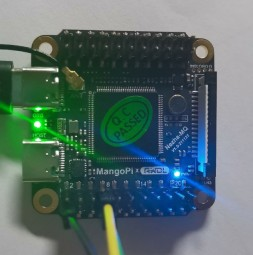
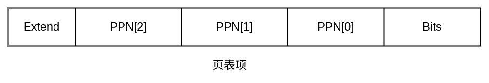
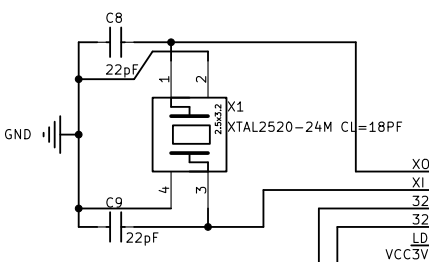

# 来造一个OS吧

作者：李睿

> 作者正积极寻找寒暑假实习机会，欢迎通过文章底部联系方式联系作者。如果本文有错或建议欢迎在评论区指出。

> 项目地址：https://github.com/KernelErr/MoeOS

MoeOS在哪吒MQ开发板（全志D1s芯片）上最新运行截图：


从中学时期看《30天自制OS》到最近学习rCore-Tutorial-Book，愈发想做一个自己的玩具操作系统。但一直以来看这类教程内心都是一个感想：“我看不懂，但大受震撼”。真正决定开始动手的契机是看到麻雀开发板的问世和查阅了国内外的一些资料，发现有可行性。

目前MoeOS已经完成了基本的MMU（内存管理单元）的设置，中断处理和时钟，一共耗时一个月时间，接下来会完成用户态等工作。做MoeOS主要还是为了学习操作系统的知识，可以看作为优秀的教程交作业，这里对rCore团队等开源贡献者表示感谢。

本篇文章将记录我在学习的过程中踩的坑和所思所想，文章会根据一个个遇到的问题分节讲述。

## 载入内存

开发MoeOS遇到的第一个问题就是想办法把系统载入内存然后跑起来，如果是QEMU，我们可以使用下面的命令轻松指定启动的镜像：

```Bash
qemu-system-riscv64 \
        -machine virt \
        -nographic \
        -bios sbi/fw_payload.bin \
        -device loader,file=$(bin),addr=0x80200000
```

在早期阶段，我决定先不制作SD卡镜像，转而使用[xfel](https://github.com/xboot/xfel)工具。xfel是由xboot大佬制作的工具，对于全志系列芯片，在BootROM中固化了一个名为FEL的低级子程序，我们可以用FEL完成内存初始化、载入文件到内存、执行二进制等操作。

在MoeOS的Makefile中我们可以看到下面这段命令：

```Plain%20Text
d1s: d1s_lds build
    xfel ddr ddr2
    xfel write 0x40000000 ./sbi/fw_jump_d1.bin
    xfel write 0x40200000 $(bin)
    xfel exec 0x40000000
```

这里我们先初始化ddr2内存（MQ开发板内置64M DDR2内存），然后将OpenSBI写入`0x40000000`地址，将MoeOS的二进制写入`0x40200000`地址，最后执行SBI。这里有一个问题，我们怎么知道应该写入哪个地址？

对于QEMU来说，我们可以查看位于`hw/riscv/virt.c`的源码：

```C
static const MemMapEntry virt_memmap[] = {
    [VIRT_DEBUG] =       {        0x0,         0x100 },
    [VIRT_MROM] =        {     0x1000,        0xf000 },
    [VIRT_TEST] =        {   0x100000,        0x1000 },
    [VIRT_RTC] =         {   0x101000,        0x1000 },
    [VIRT_CLINT] =       {  0x2000000,       0x10000 },
    [VIRT_PCIE_PIO] =    {  0x3000000,       0x10000 },
    [VIRT_PLIC] =        {  0xc000000, VIRT_PLIC_SIZE(VIRT_CPUS_MAX * 2) },
    [VIRT_UART0] =       { 0x10000000,         0x100 },
    [VIRT_VIRTIO] =      { 0x10001000,        0x1000 },
    [VIRT_FW_CFG] =      { 0x10100000,          0x18 },
    [VIRT_FLASH] =       { 0x20000000,     0x4000000 },
    [VIRT_PCIE_ECAM] =   { 0x30000000,    0x10000000 },
    [VIRT_PCIE_MMIO] =   { 0x40000000,    0x40000000 },
    [VIRT_DRAM] =        { 0x80000000,           0x0 },
};
```

可以知道DRAM内存以`0x80000000`开始，而对于我们的开发板，我们需要查看全志D1s的芯片手册的Memory Mapping一节，找到`0x40000000`。

## SBI

在RISC-V中，存在SBI这个概念，官方的描述如下：SBI (Supervisor Binary Interface) is an interface between the Supervisor Execution Environment (SEE) and the supervisor. It allows the supervisor to execute some privileged operations by using the ecall instruction.

SBI会在M态（Machine）下面工作，与硬件打交道，而我们的内核是在S态（Supervisor）工作，可以通过ecall去调用SBI提供的接口。（如果是我们写的一些用户软件，是在User态工作，各个态会有不同的权限限制）

SBI会作为系统启动的一个阶段，在Makefile中可以发现我们先执行了SBI，SBI完成工作后会跳转到我们在编译时指定的地址去执行系统。

MoeOS就是使用SBI提供的接口完成时钟设置、输入输出的。目前基于标准实现的SBI有很多，我们使用的是[OpenSBI](https://github.com/riscv/opensbi)，但这里也很推荐我们国产也是Rust编写的的[RustSBI](https://github.com/rustsbi/rustsbi)。

```Rust
pub fn putchar(c: char) {
    sbi_call(LegacyExt::ConsolePutchar.into(), 0, c as usize, 0, 0);
}

pub fn sbi_call(eid: usize, fid: usize, arg0: usize, arg1: usize, arg2: usize) -> usize {
    let ret;
    unsafe {
        asm!("ecall",
             inout("x10") arg0 => ret,
                in("x11") arg1,
                in("x12") arg2,
                in("x17") eid,
                in("x16") fid,
        );
    }
    ret
}
```

上面展示的是ecall调用SBI接口以输出一个字符的代码，对于这些接口的定义，可以查看参考资料中的Binary Interface Specification。

## Inline asm

一个好消息是，Rust[正在稳定化inline asm](https://github.com/rust-lang/rust/issues/72016)，目前的Nightly版本我们可以像下面这样去使用inline asm和global asm：

```Rust
use core::arch::{asm, global_asm};
...
global_asm!(include_str!("asm/boot.S"));
...
unsafe {
    asm!(
        "",
        out("x10") a0,
        out("x11") a1,
    );
}
```

做系统的时候我们需要使用inline asm来直接调用SBI接口、读取寄存器的值等。

## 点亮LED灯

对应源码：`src/device/d1s/mq.rs`




MQ开发板上带有一颗蓝色LED，在原理图上标明这颗LED挂在PD22上面。查阅芯片文档可以看到控制PD22的寄存器地址为`0x02000098`，而针对PD22是第27到24位，我们可以对其写入0001来调至输出模式。下面是点亮LED的代码：

```Rust
pub fn blue_led_on() {
    let pd2_controller = 0x02000098 as *mut u32;
    let mut pd2_controller_val: u32;
    unsafe {
        pd2_controller_val = ptr::read(pd2_controller);
    }
    pd2_controller_val &= 0xf0ffffff;
    pd2_controller_val |= 0x01000000;
    unsafe {
        ptr::write_volatile(pd2_controller, pd2_controller_val);
    }
}
```

熄灭LED灯只需要把或改为`pd2_controller_val |= 0x0f000000;`即可。

## 设置MMU

对应源码：`src/mem/mmu.rs`

我们使用的芯片支持Sv39标准的MMU，MMU是一块负责处理CPU的内存访问请求的硬件，可以帮助我们完成虚拟地址到物理地址的转换，下面我将结合代码和图来说明MMU的工作原理。这里我们的Page Size是4KByte。



上图画出了我们页表项的样子，在头部几位是厂商扩展的内容，表示该页是否能够Cache等。PPN是我们的物理地址。末尾的Bits定义了详细的状态和权限标识，如代码所示，如果末尾为1说明页表有效，如果第一位为1说明对该页表对应的地址有写权限。

map函数的作用是把虚拟地址和其对应的物理地址映射到页表上，我们一步步来解析代码。首先我们将VPN（虚拟页面号）和PPN（物理页面号）对应的地址位按照标准给设置好，然后从第二级页表（有512个项）取VPN[2]对应的项，如果无效（即末尾为0）则调用zalloc申请到内存并初始化内容为0，并把地址保存到页表项中。然后我们还原之前申请的地址，将这块地址空间作为下一级页表，重复以上操作完成再第一级页表的初始化。这里我们申请的是4096个字节给一个页表项，我们的VPN一段是9位，即512个数，4096/512=8字节，8*8=64位。

一共三级页表的最后一级页表保存了我们的物理地址和相应的权限。

```Rust
pub enum EntryBits {
    None = 0,
    Valid = 1 << 0,
    Read = 1 << 1,
    Write = 1 << 2,
    Execute = 1 << 3,
    User = 1 << 4,
    Global = 1 << 5,
    Access = 1 << 6,
    Dirty = 1 << 7,

    ReadWrite = 1 << 1 | 1 << 2,
    ReadExecute = 1 << 1 | 1 << 3,
    ReadWriteExecute = 1 << 1 | 1 << 2 | 1 << 3,

    UserReadWrite = 1 << 1 | 1 << 2 | 1 << 4,
    UserReadExecute = 1 << 1 | 1 << 3 | 1 << 4,
    UserReadWriteExecute = 1 << 1 | 1 << 2 | 1 << 3 | 1 << 4,

    // T-HEAD Extend
    Sec = 1 << 59,
    Buffer = 1 << 61,
    Cacheable = 1 << 62,
    StrongOrder = 1 << 63,
}

pub fn map(root: &mut Table, vaddr: usize, paddr: usize, bits: u64, level: usize) {
    if bits & 0xe == 0 {
        panic!("Invalid PTE bits found");
    }

    let vpn = [
        // VPN[0] = vaddr[20:12]
        (vaddr >> 12) & 0x1ff,
        // VPN[1] = vaddr[29:21]
        (vaddr >> 21) & 0x1ff,
        // VPN[2] = vaddr[38:30]
        (vaddr >> 30) & 0x1ff,
    ];

    let ppn = [
        // PPN[0] = paddr[20:12]
        (paddr >> 12) & 0x1ff,
        // PPN[1] = paddr[29:21]
        (paddr >> 21) & 0x1ff,
        // PPN[2] = paddr[55:30]
        (paddr >> 30) & 0x3ff_ffff,
    ];

    let mut v = &mut root.entries[vpn[2]];

    for i in (level..2).rev() {
        if !v.is_valid() {
            let page = zalloc(1);
            v.set_entry(
                // Set PTE's PPN
                // As page size is 4kb, we have 12 zeros
                // Set the address start from 10th bit
                (page as u64 >> 2) | EntryBits::Valid.val(),
            );
        }
        // Store next level PTE
        let entry = ((v.entry & !0x3ff) << 2) as *mut Entry;
        v = unsafe { entry.add(vpn[i]).as_mut().unwrap() };
    }

    // TODO: Complete C-SKY Extentions
    let entry = (ppn[2] << 28) as u64 |   // PPN[2] = [53:28]
                (ppn[1] << 19) as u64 |   // PPN[1] = [27:19]
                (ppn[0] << 10) as u64 |   // PPN[0] = [18:10]
                bits |
                EntryBits::Valid.val();
    v.set_entry(entry);
}
```

那么我们如果取得了一个虚拟地址，我们怎么获取物理地址呢？

```Rust
pub fn virt_to_phys(root: &Table, vaddr: usize) -> Option<usize> {
    let vpn = [
        // VPN[0] = vaddr[20:12]
        (vaddr >> 12) & 0x1ff,
        // VPN[1] = vaddr[29:21]
        (vaddr >> 21) & 0x1ff,
        // VPN[2] = vaddr[38:30]
        (vaddr >> 30) & 0x1ff,
    ];

    let mut v = &root.entries[vpn[2]];
    for i in (0..=2).rev() {
        if !v.is_valid() {
            break;
        } else if v.is_leaf() {
            let off_mask = (1 << (12 + i * 9)) - 1;
            let vaddr = vaddr & off_mask;
            let addr = ((v.entry << 2) as usize) & !off_mask;
            return Some(addr | vaddr);
        }
        let entry = ((v.entry & !0x3ff) << 2) as *mut Entry;
        v = unsafe { entry.add(vpn[i - 1]).as_mut().unwrap() };
    }

    None
}
```

我们逐级寻找即可，确保找到的每一级页表有效。在`src/init.rs`中可以发现我们初始化MMU（将内核的内存地址映射好）后设置了satp寄存器（MMU 地址转换寄存器）为我们第二级页表的地址，并通过`sfence.vma`指令去完成虚拟内存同步。

需要注意的是我们需要设置内核的页面为Access和Dirty，否则QEMU能正常运行但实机会出问题。

## 中断

对应源码：`src/asm/trap.S` `src/trap.rs` 

对于RISC-V，MoeOS将stvec（超级用户模式向量基址寄存器）设置为中断处理函数的地址，同时设置模式为Direct。

模式解释：

- 00: Direct 所有中断都会使用同一个地址作为异常入口

- 01: Vectored 使用BASE + 4 * Exception Code的地址作为异常入口

当中断发生，我们使用汇编编写的代码会先从栈开辟一块空间出来用于保存现场（如寄存器的值等），然后去调用Rust编写的`trap_handler`函数。当函数返回后再恢复现场。

```Rust
#[no_mangle]
extern "C" fn trap_handler(cx: &mut TrapContext) -> &mut TrapContext {
    let scause = scause::read();
    let stval = stval::read();
    match scause.cause() {
        Trap::Exception(Exception::UserEnvCall) => {
            cx.sepc += 4;
            cx.x[10] = 0;
        },
        Trap::Exception(Exception::StoreFault) |
        Trap::Exception(Exception::StorePageFault) => {
            error!("{:?} va = {:#x} instruction = {:#x}", scause.cause(), stval::read(), sepc::read());
            panic!("page fault!");
        },
        Trap::Exception(Exception::IllegalInstruction) => {
            error!("IllegalInstruction");
        },
        Trap::Interrupt(Interrupt::SupervisorTimer) => {
            timer_next_triger();
        }
        _ => {
            panic!("Unhandled trap: {:?} stval = {:#x}", scause.cause(), stval);
        }
    }
    cx
}
```

scause保存了中断的类型，stval保存了异常的原因。我们使用sepc寄存器保存从异常处理函数退出后的PC值。

## 时钟

对应源码：`stc/timer.rs`

SBI为我们提供了接口用于设置过了多少时钟时间后触发中断，从上面的中断处理函数也能发现我们对SupervisorTimer的处理。

```Rust
pub static mut CLOCK_FREQ: usize = 24000000;
const MICRO_PER_SEC: usize = 1_000_000;
const TICKS_PER_SEC: usize = 1000;

pub fn get_time_us() -> usize {
    unsafe {
        time::read() / (CLOCK_FREQ / MICRO_PER_SEC)
    }
}

pub fn get_time() -> usize {
    time::read()
}

pub fn timer_next_triger() {
    unsafe {
        set_timer(get_time() + CLOCK_FREQ / TICKS_PER_SEC);
    }
}
```



查阅资料可知时钟为24Mhz，我们设定一秒钟有1000个tick，即每过24000个单位时间我们就触发一次中断，这样我们就能知道过了多少时间了。

## 总结

目前MoeOS要做的工作很多，我也会在学习和工作之余继续完善MoeOS，做OS的过程中踩了不少坑，但也学到了不少东西。在经历几场面试后，我发现自己对很多基础知识掌握得并不过关，于是决定做点有趣的事情学习知识。

让我们在2022年继续加油！

## 学习资料

- [哪吒MQ开发板](https://mangopi.org.cn/mangopi_mq)（[BOM](https://mangopi.org.cn/_media/zh/mq_v1.5_bom.html)）
- [rCore-Tutorial-Book 第三版](https://rcore-os.github.io/rCore-Tutorial-Book-v3/)
- [The Adventures of OS: Making a RISC-V Operating System using Rust](https://osblog.stephenmarz.com/index.html)
- [RISC-V SBI specification](https://github.com/riscv-non-isa/riscv-sbi-doc)
- [RISC-V Supervisor Binary Interface Specification](https://github.com/riscv-non-isa/riscv-sbi-doc/blob/master/riscv-sbi.adoc)
- 芯片、核心官方文档

## 关于作者

北邮大二学生，开源爱好者。目前正在努力学习Linux内核、Rust中，对技术抱有热情。欢迎在飞书Rust 中文社群搜索李睿添加好友。

GitHub：https://github.com/KernelErr

个人博客：https://lirui.tech/

联系邮箱：me@lirui.tech 
