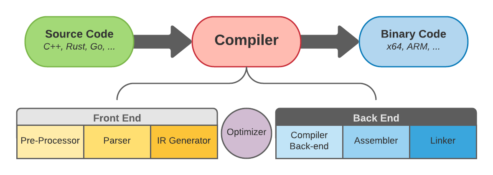
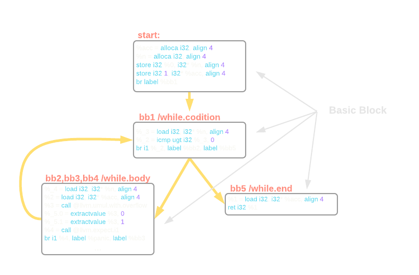

# LLVM基础设施和Rust

>     原文地址: [LLVM Infrastructure and Rust](https://www.bexxmodd.com/log/llvm-infrastrucutre-and-rust/7)
>     翻译来源: [LLVM基础设施和Rust](https://www.ttalk.im/2021/12/llvm-infrastructure-and-rust.html)

LLVM是许多编程语言后端引擎。 它被C、C++、Rust、Go和Swift等使用。这篇博客主要是LLVM相关话题，我将探讨以下主题： 

- [什么是LLVM基础设施](#什么是LLVM基础设施)
- [LLVM是如何工作的](#LLVM是如何工作的)
- [LLVM的程序结构](#LLVM的程序结构)
- [LLVM和Rustc](#LLVM和Rustc)

## 什么是LLVM基础设施

LLVM基础设施是模块化和可重用的编译器和工具链技术的集合。 LLVM包含几个子项目，如Clang、C/C++/Objective-C 编译器、调试器 LLDB、libc++ 等。数十年的研究和改进创造了一个惊人的用于构建语言和编译器的工具，并且一些现代技术正在利用这些工具的。

LLVM项目于2000年由在伊利诺伊大学厄巴纳-香槟分校的Vikram Adve和Chris Lattner启动。 LLVM的名称最初是Low-Level Virtual Machine的首字母缩写词。 尽管现代LLVM基础设施已经与虚拟机无关，但名称保持不变。 但缩写本身的背后含义被删除，而LLVM成为该项目的全名。 

LLVM项目是在开源许可下发布的。 后来Lattner被Apple聘用，整个团队被分配到LLVM体系上进行研发，用于满足Apple产品中的各种需求。 LLVM开始扩展其功能并成长为一个综合项目，该项目结合了LLVM IR、LLVM调试器和LLVM API C++库。 

LLVM Compiler Framework是一个模块化和可重用的编译器框架，它使用LLVM基础设施来提供端到端的代码编译。 它用于构建、优化、清理和生成中间代码（IR）或二进制（机器）代码（BC）。LLVM允许将编程语言代码转换为中间代码（IR），中间代码（IR）可以转换为任何给定硬件架构的二进制代码（BC）。IR语言独立于源语言和目标语言。 

LLVM有很多用途。它的主要用途是作为编译器框架。在这里，我们提供的所谓的前端和后端，或机器代码，它会生成IR。 该IR可以通过生成并链接目标平台的汇编语言转换为目标平台的二进制代码。 

LLVM的中间代码（IR）是一种类似于汇编的低级编程语言。 但是除了汇编之外，它还提供了更好的类型注释和人性化的语法。 此外，IR 使用无限组寄存器而不是预定义数量的寄存器。 我们将在后面的部分探讨IR的内部运作。

## LLVM是如何工作的

如前所述，LLVM是一个模块化且可重用的编译器框架，支持多个前端和后端。 程序的生命周期包括编写源代码，然后将其编译为二进制的代码执行。 我们的兴趣点是编译器阶段。 当源代码被编译成二进制文件时，它会按后续顺序经历几个步骤。 

编译过程可以分为三个部分。 前端、优化、后端（图 1-a）。 编译过程从前端开始。 首先，预处理器开始组织源代码。 这是外部库扩展到目标源代码的阶段。 在Rust中，该指令由use语句定义。 C和C++中的一个类似指令是#include语句。 



其次，是解析。 在此阶段，代码会被解析，从而发现语法错误，并构建[抽象语法树 (AST)](https://en.wikipedia.org/wiki/Abstract_syntax_tree?utm_source=ttalk.im&utm_medium=website&utm_campaign=Tech%2520Talk)。 前端编译的第三步是IR Generation。 在这一步，编译器将AST转换为中间代码（IR）并输出结果。 

在优化阶段，编译器对程序执行各种转换和清理。 这提高了程序性能，通过减少各种Bug的产生使程序更安全可靠，同时运行一些辅助程序完成一些工作。 稍后我们将探索IR并查看编译器附带的一些优化过程。 

程序优化后进入后端阶段。 在这，Compiler Back-Endd将IR转换为特定于目标的汇编代码。 然后汇编程序将特定于目标的汇编代码转换为特定于目标的机器代码。 最后，Linker将多个机器代码文件组合成一个文件，我们称之为可执行文件。 

目前我们已经有几种特定于语言的前端。我们有C和C++的clang，Go有gollvm，而Rust有一个叫做rustc的编译器。 类似地，在完成LLVM IR的优化之后，代码被转换为特定于架构的后端，如 x86、ARM、MIPS。

前端和后端之间的部分称为优化器，是代码优化和清理的神奇之处。 这是通过一系列所谓的Pass 来完成的。 每一个Pass都一个接一个地运行，因此可以有N个Pass。 Pass可以分为两组：分析和转换。 Analysis pass分析IR来检查程序属性，而Transformation pass转换IR来监控和优化程序。 

当源代码转换为LLVMIR 时，它可以采用三种格式之一（图 1-b）。内存格式是一种二进制文件，适用于编译过程中的前端。 其他两种格式是Bitcode和Assembly。Bitcode是一种二进制磁盘存储格式，适用于快速加载，因为它具有更高的内存效率。Assembly是一种便于人类阅读的文本格式。


你可能想知道为什么要使用IR/BC而不是原生汇编和原生二进制？原因是本机程序集与平台的机器代码一对一绑定。 这取决于目标的体系结构，例如，x86的程序汇编和ARM的汇编会有所不同。 原生汇编通过汇编程序转换为原生二进制文件，当然LLVM也包含此功能。 这是[开箱即用的LLVM pass列表](https://github.com/llvm/llvm-project/blob/main/llvm/docs/Passes.rst)。 但这还不是全部，你可以实现你自己的pass来清理或优化源代码。

## LLVM的程序结构

LLVM IR，就像任何其他系统一样，它有自己的程序结构（图2-a）。 顶层容器是一个模块，对应前端编译器的每个翻译单元。 模块可以由一个或多个函数组成。 每个函数都有一个或多个基本块，其中是指令。每个指令一行，IR语言中有非常多的指令。

我们可以通过在终端中运行以下命令从Rust源代码中获取`.ll`（IR 程序集）文件： 

```
 $ rustc someprogram.rs --emit=llvm-ir -o somename.ll 
```

在这里，我们告诉`rustc`编译器为`someprogram.rs`生成llvm-ir（这是由选项`--emit=llvm-ir`指定）格式，并将其输出（使用选项 -o）作为`someoname.ll`。 同样，我们可以使用`--emit=llvm-bc`标志生成位代码。 

LLVM IR 中的实际程序结构由分层容器组成。 在顶层，我们有模块。 它对应前端编译器的每个翻译单元。 模块可以与合并函数定义，以供LLVM链接器链接时使用。函数是下一级容器，包括函数签名及其基本块。基本块是一组按顺序执行的指令。 基本块有一个入口和一个出口。 第一个块称为入口块。 最后，IR有指令。 指令是可执行的单行（图 2-a）。 


在IR文件中你会遇到两种变量，局部变量，用%符号表示，全局变量用@符号表示。LLVM IR可以使用无限数量的临时寄存器，而不是像本地汇编程序那样使用预定义数量的寄存器。 IR的寄存器由整数定义，例如 1,2,3,..N。 例如，`%2 = load i32, i32* %x` 表示将存储在局部变量x 的地址处的值加载到临时寄存器2中。 

LLVM IR的另一个优点是它利用了所谓的[静态单赋值(SSA)形式](https://en.wikipedia.org/wiki/Static_single_assignment_form)。这允许对代码进行各种优化。 SSA 变量只能分配一次，而不是可以多次重新分配的常规变量。 这允许编译器进行更有效的寄存器分配，因为很容易在任何给定的地方获得还活动的变量的数量。 它可以检测未使用的变量并防止程序进行不必要的指针分配。 

例如，SSA形式中的以下代码`x = x * x`将是`x_2 := x_1 * x_1`。如果我们进入变量不断获得新值的循环，SSA将使用所谓的Phi节点。 Phi会将变量合并到将从分支或循环返回/输出的最终值中。 我们将在此博文的下一部分中查看具体示例并回顾IR语法。 


## LLVM和Rustc

Rustc的官方指南列出了他们使用LLVM的所有原因，我就直接引用：

- 我们不必编写整个编译器后端。 这减少了实施和维护负担。 
- 我们受益于LLVM项目一直在收集的大量高级优化。 
- 我们可以自动将Rust编译到LLVM支持的任何平台。 例如，一旦LLVM添加了对 wasm 的支持，瞧！ rustc、clang 和许多其他语言都能够编译为wasm！（好吧，当然还有一些额外的事情要做，但无论如何我们拥有了这90%的完成度）。 
- 我们和其他编译器项目相互受益。 例如，当发现Spectre和Meltdown安全漏洞时，只需要修补LLVM。 

现在，当我们熟悉了LLVM IR是什么、它的作用以及为什么有这么多编译器基于它构建时，是时候动手并使用一个名为`simple1.rs`的简单Rust程序来探索IR的内部结构了： 

```rust

//simple1.rs

fn square(x: u32) -> u32 {
    x * x
}

fn factorial(mut n: u32) -> u32 {
    let mut acc = 1u32;
    while n > 0 {
        acc *= n;
        n = n - 1;
    }
     acc
}
    
fn main() {
    let s = square(4);
    let f = factorial(s);
}
    
```

我们的程序有三个函数，`main`函数是我们程序的入口点，`square`函数返回给定数字的平方，以及`factorial`函数提供的整数的阶乘的计算。 我们通过在终端中调用以下命令来输出LLVM IR文件： 

```
 
 >$ rustc simple1.rs --emit=llvm-ir 
 
```

现在我们应该在与源代码相同的文件夹中出现`simple1.ll`文件了。 让我们在文本编辑器中打开 `.ll`文件并开始探索。在文件的开头，你会发现一堆与程序相关的元数据和其他信息和指令，但我们的兴趣是深入研究我们的Rust函数是如何转换为IR的，我们将首先开始看`square`函数。

搜索带有注释`simple1::square`的行，在它旁边你会找到一个给定函数的LLVM IR容器。 看起来像这样： 

```assembly

; simple1::square
; Function Attrs: nonlazybind uwtable
define internal i32 @_ZN7simple16square17h74fdb775aec225a0E(i32 %x) unnamed_addr #1 {
start:
  %0 = call { i32, i1 } @llvm.umul.with.overflow.i32(i32 %x, i32 %x)
  %_4.0 = extractvalue { i32, i1 } %0, 0
  %_4.1 = extractvalue { i32, i1 } %0, 1
  %1 = call i1 @llvm.expect.i1(i1 %_4.1, i1 false)
  br i1 %1, label %panic, label %bb1

bb1:                                              ; preds = %start
  ret i32 %_4.0

panic:                                            ; preds = %start
; call core::panicking::panic
  call void @_ZN4core9panicking5panic17h50b51d19800453c0E([0 x i8]* ...
}

```

IR首先定义具有随机生成的唯一名称（其中还包括原始函数名称）的函数，该函数返回i32值并将 i32值作为参数。`start`是函数入口点的标签。 在第一条指令中，LLVM IR调用其内在函数 `@llvm.umul.with.overflow.i32`。 此函数接受两个i32参数（在本例中均为`x`），执行无符号乘法并输出类似元组的结果，其中第一个值为i32，第二个值为i1。 结果分配给未命名的临时量`%0`。 

至此，你可能会有几个问题。首先，为什么`square`函数参数和返回值都是i32而不是源代码中声明的u32？ LLVM IR不为有符号和无符号值提供单独定义的数据类型。 相反，它执行特定于值类型的操作，有符号值的有符号操作，无符号值的无符号操作。 如果我们的`square`函数将i32作为参数并返回i32，IR将调用`@llvm.smul.with.overflow.i32`，这是有符号乘法的内在函数。 

你可能会问的下一个问题是为什么将整数乘以整数会返回一个元组？ 如果查看输出元组的类型，第二项是i1（单个位值），它常用于二进制/布尔值。 被调用函数的名称表明它执行带溢出的无符号乘法。 如果检测到溢出，即乘法值超过32位可以容纳的最大无符号值，因为我们执行了无符号乘法，它将i1设置为1，或者说是`true` 。

在以下两条指令中，IR解包乘法的结果。未命名的临时量`%_4.0`取相乘后的值，并将布尔结果分配给`%_4.1`。 接下来，IR调用另一个内部函数`@llvm.expect.i1(i1 %_4.1, i1 false)`，它期望分配给未命名临时量`%_4.1`的值为`false`。 程序将执行结果分配给另一个未命名的临时量`%1`。 未命名的临时变量是由IR创建的带有前缀%或@的无符号数值（例如`%1`）。命名值表示为具有从源代码引入的相同前缀规则的字符串字符（例如 %acc）。 

之后，IR执行分支。 `br`指令检查放置在临时量`%1`中的值是否为真，如果是，则跳转到`%panic`，否则跳转到`%bb1`。上面提到的两个名称是基本块的标签。 `%panic`调用Rust的panic 方法（如果你用Rust编程过你应该知道 panic 是做什么的），而`bb1`从函数`square`返回存储在临时量`%_4.0`中的值。 

让我们在看下我们的`factorial`函数，这里有更多有趣的事情发生：

```assembly

; simple1::factorial
; Function Attrs: nonlazybind uwtable
define internal i32 @_ZN7simple19factorial17hceebae2a8a73b808E(i32 %0) unnamed_addr #1 {
start:
  %acc = alloca i32, align 4
  %n = alloca i32, align 4
  store i32 %0, i32* %n, align 4
  store i32 1, i32* %acc, align 4
  br label %bb1

bb1:                                              ; preds = %bb4, %start
  %_3 = load i32, i32* %n, align 4
  %_2 = icmp ugt i32 %_3, 0
  br i1 %_2, label %bb2, label %bb5

bb5:                                              ; preds = %bb1
  %1 = load i32, i32* %acc, align 4
  ret i32 %1

bb2:                                              ; preds = %bb1
  %_4 = load i32, i32* %n, align 4
  %2 = load i32, i32* %acc, align 4
  %3 = call { i32, i1 } @llvm.umul.with.overflow.i32(i32 %2, i32 %_4)
  %_5.0 = extractvalue { i32, i1 } %3, 0
  %_5.1 = extractvalue { i32, i1 } %3, 1
  %4 = call i1 @llvm.expect.i1(i1 %_5.1, i1 false)
  br i1 %4, label %panic, label %bb3

bb3:                                              ; preds = %bb2
  store i32 %_5.0, i32* %acc, align 4
  %_6 = load i32, i32* %n, align 4
  %5 = call { i32, i1 } @llvm.usub.with.overflow.i32(i32 %_6, i32 1)
  %_7.0 = extractvalue { i32, i1 } %5, 0
  %_7.1 = extractvalue { i32, i1 } %5, 1
  %6 = call i1 @llvm.expect.i1(i1 %_7.1, i1 false)
  br i1 %6, label %panic1, label %bb4

panic:                                            ; preds = %bb2
; call core::panicking::panic
  call void @_ZN4core9panicking5panic17h50b51d19800453c0E ...

bb4:                                              ; preds = %bb3
  store i32 %_7.0, i32* %n, align 4
  br label %bb1

panic1:                                           ; preds = %bb3
; call core::panicking::panic
  call void @_ZN4core9panicking5panic17h50b51d19800453c0E  ...
  
```

回想一下，作为参数，`factorial`采用可变的u32值，在IR中它被定义为未命名的临时量`%0`。而函数`square`的定义以命名变量`%n`作为参数，就像在源代码中一样。 这是因为`square`从不修改它的值，而`factorial`要求它是可变的，然后在函数的作用域内制作参数的副本。 在函数的开头定义了两个命名变量`%n`和 `%acc`。 它们都分配了（使用`alloca`调用）32位内存，因为数据对齐为4字节。 你可以在[此处](https://www.geeksforgeeks.org/structure-member-alignment-padding-and-data-packing/)阅读有关内存对齐的更多信息。 

分配内存后，`store`指令将`%0中`的内容临时存储在`%n`的地址中。在`%acc`的地址中，它存储常量值1。最后，它跳转到while循环的入口点。 `bb1`标签标志着进入while条件。 IR将`%n`地址中存储的值加载到临时量`%_3`中，并将其与常量值0进行比较。`icmp`检查`%_3`中存储的值是否无符号大于(`ugt`)0并将结果分配给另一个临时量`%_2`。 之后，它检查`%_2`的内容。 如果为真，则分支跳转到标签`%bb2`,如果为假-就去标签`%bb5`。 

`bb5`标签标记了while循环的退出块。 在这里，它将`%acc`地址中的值加载到临时量`%1`中，并从函数中返回它。 标签`bb2`是while循环体的入口。 while循环的主体分为两半。 第一个，负责乘法运算（`bb2`标签），第二个负责递减`n`，或者说是减法运算。 操作`n = n - 1`是通过调用另一个用于无符号减法的内部函数来完成的。 其余的操作与我们在`square`函数中看到的相同（图4-a）。 



你应该已经注意到SSA在此处起作用。对于每条赋值指令，IR都为每条指令引入了新的未命名临时量，而不是像源代码中定义的那样将值重新赋值给`n`和`acc`。未命名临时量的编号在每个实例生成时在函数内是从0开始递增。 

LLVM IR支持二进制数的二进制补码。它具有整数数据类型，如i8、i16、i32、i64和浮点数f16、f32等，它们被称为es操作数。 如果您在整数类型后看到星号符号，则表示我们正在处理指针（例如：i32*）。 当然值也可以是常数。 每条指令也有其类型，例如算术运算符、二进制比较、数据存储和加载。 IR中还有更多的操作，你可以在本节末尾的链接中找到完整列表。 

LLVM的类层次结构有点复杂。 基础对象是所谓的`Value`，用于表示SSA寄存器。 所有其他类都继承自它。 然后是`User`类，然后是`Instruction`、`Operator`、`Contstnt`类等（图4-b）。 这是LLVM中[完整类继承树](https://llvm.org/doxygen/classllvm_1_1Value.html)。 


LLVM语言有许多高级结构、类型、常量、函数、代码生成指令等。如果你有兴趣了解更多信息，可以翻阅浏览[参考手册](https://llvm.org/docs/LangRef.html)。 

## 总结

正如我们在本文中所回顾的，LLVM IR有许多用例，允许我们通过它的pass来分析和优化源代码。了解IR语言本身将帮助我们编写我们的pass并围绕它构建项目以进行调试、测试、优化。 目前，LLVM IR没有Rust API。它主要通过作为C++库来使用。 但是，一些用户在crates.io上创建了仓库上用来绑定LLVM。 有一个Rust绑定LLVM C API的实现-[llvm-sys](https://lib.rs/crates/llvm-sys)和另外两个同样使用LLVM的但是提供更Rust化的API：[inkwell](https://github.com/TheDan64/inkwell)和[llvm-ir](https://github.com/cdisselkoen/llvm-ir)。 最后，如果你想学习如何编写 LLVM pass，你应该从[这里开始](https://github.com/cdisselkoen/llvm-ir)。 
