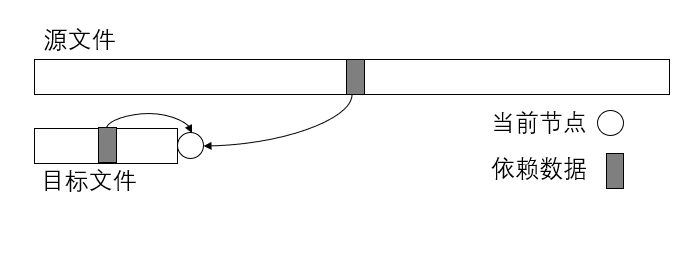
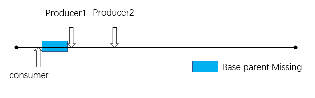
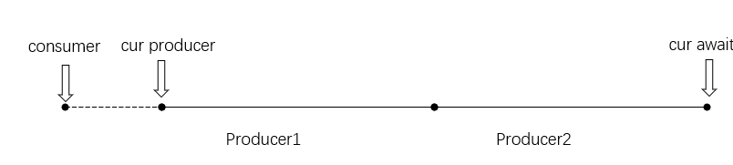
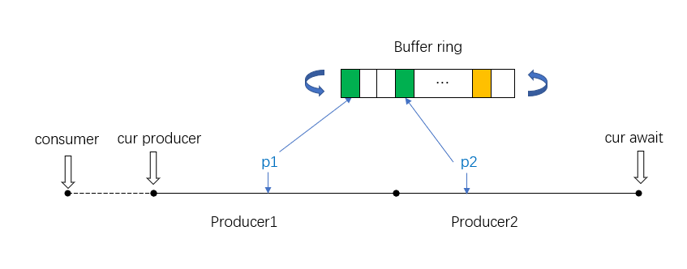
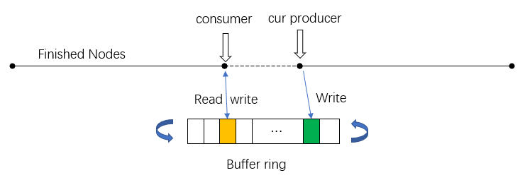

# 特定场景下的Rust无锁队列实现


作者: **Joshua022** 上海飞蓬网络科技有限公司
-------------------------
## 问题抽象

现有一个较大文件A(>20G)，通过某种算法可以利用文件A生成另外一个相同大小的文件B，而这个目标文件B的生成同时需要用到已经产生的数据部分，即假设两个文件均有n个节点，而新文件中的i号节点需要用到原始文件中的部分节点以及新文件中[0,i-1]中的部分节点。

由于这种数据依赖关系的限制，导致在生成目标文件B的过程中，每个新生成的节点必须等待其前一个节点生成后才能生成，杜绝了同时生成文件B的不同节点的可行性。但在每次生成节点前，其依赖关系是已知的，因此，采用生产者-消费者模型预读取依赖的数据，当消费者生成节点i时，其依赖的数据已经被预读取到队列中，从而加速生成过程。这里通过无锁队列来完成新文件的生成。



---

## 解决思路

**总体逻辑**

算法实现的难点在于生成新文件依赖两部分数据，一部分是旧文件的，一部分是新文件已经生成的数据，不能将程序单独拆分为读取和运算两部分，当读取领先于计算部分时，会存在需要的数据还未生成的情况，需要计算单元单独从已经计算完毕的部分再次载入已经完成的部分。

将整个算法拆分成两个部分，由三个线程实现。两部分分别为纯读取部分，以及读取运算混合部分。由于读取数据的速率慢于计算的速度，所以使用多个线程负责读取以及标记本层缺失的部分。使用一个线程负责执行计算，以及从标记缺失处读取缺失的数据。

为了提升程序的效率，将全部的待运算数据放入内存中连续的地址中，对于复杂的运算，这样会大大提升程序的运行效率。



**预备知识** 

-[Linux线程](https://www.cnblogs.com/leisure_chn/p/10393707.html)


-[自旋锁](https://www.cnblogs.com/cxuanBlog/p/11679883.html)
自旋锁的定义：当一个线程尝试去获取某一把锁的时候，如果这个锁此时已经被别人获取(占用)，那么此线程就无法获取到这把锁，该线程将会等待，间隔一段时间后会再次尝试获取。这种采用循环加锁 -> 等待的机制被称为自旋锁(spinlock)。

-[CAS算法](https://zhuanlan.zhihu.com/p/137261781)
CAS操作需要我们提供一个期望值，当期望值与当前线程的变量值相同时，说明还没线程修改该值，当前线程可以进行修改，也就是执行CAS操作，但如果期望值与当前线程不符，则说明该值已被其他线程修改，此时不执行更新操作，但可以选择重新读取该变量再尝试再次修改该变量，也可以放弃操作。


数据共享
--------

**共享内存的实现**

三个线程共享两片内存，分别为本层数据内存(layer_label)，读取算法参数内存(ring_buf)，本层内存主线程(consumer)具有读写的权利，子线程(producer)只有读的权力；算法参数内存首先由子线程填充原始文件数据，再填充已经生成的新文件中的数据，并将缺失的数据标记。

子线程之间共享原始文件所对应的内存，二者只负责将所对应的数据放入与主线程共享的算法参数内存中。


为了实现内存在三个线程中共享，定义了结构体`UnsafeSlice`以及`RingBuf`，`UnsafeCell`中存放的原始数据可以通过`ptr`以及`length` 重新构建，`RingBuf`的重新构建与`UnsafeSlice`相似，只不过指针需要临时获得。

``` rust
#[derive(Debug)]
pub struct UnsafeSlice<'a, T> {
	// holds the data to ensure lifetime correctness
	data: UnsafeCell<&'a mut [T]>,
	/// pointer to the data   
	ptr: *mut T,   
	/// Number of elements, not bytes.   
	len: usize,
}

#[derive(Debug)]
pub struct RingBuf {    
	data: UnsafeCell<Box<[u8]>>,   
	slot_size: usize,   
	num_slots: usize,
}
```
`UnsafeSlice`的重构方法
``` rust
#[inline]
pub unsafe fn as_mut_slice(&self) -> &'a mut [T] {
    slice::from_raw_parts_mut(self.ptr, self.len)
}
```

`RingBuf`的重构方法
``` rust
#[allow(clippy::mut_from_ref)]
unsafe fn slice_mut(&self) -> &mut [u8] {
    slice::from_raw_parts_mut((*self.data.get()).as_mut_ptr(), self.len())
}
```

原始文件所对应的内存(exp_label)，当前层的文件(layer_label)类型为: UnsafeSlice。

**RingBuf**
参数内存(ring­_buf)的类型为：RingBuf，由于其大小有限，因此为环状结构，即当数据填满buf之后会从头开始填充，覆盖掉之前的数据，因此consumer的长度不能超过producer的规定长度(lookahead)。


**共享参数的实现**

主线程和子线程之间共享主线程的进度参数(consumer)和子线程总进度(cur_producer)，这两个变量的读取和修改应该为原子操作，即当一个线程在读取数据或修改时，另一个线程不能去访问这个数据。子线程的进度不能超过主线程的进度过多，否则会导致用于参数共享的内不足，并且本层数据的缺失率会增大。而主线程需要等待子线程进度超过主线程进度后才能继续执行（主线程需要子线程读取原始文件中的数据）。

子线程之间需要同步进度，使用两个原子变量实现，所有子线程已经完成的总进度(cur_producer)，而用于告知其余子线程这一段由自己来处理的变量(cur_await)。在整个程序执行中，占位变量要领先于子线程总进度。子线程首先读取占位变量，获取自己可以执行的位置，获取成功后将站为变量进行自增操作，当别的子线程再次访问此变量时，便可以知晓前一段已经被其他线程获取，只需要接着执行即可。数据填充完毕后子线程并不能直接将总进度变量增加，为了防止数据共享内存中空段的出现，需要获取等待上一段的的线程执行完毕（cur_producer增加后），才能将总进度增加，否则会一直等待。这样可以保证每一段数据都被获取到，不会出现空线程的现象。`cur_awaiting`、`cur_producer`、`consumer`的类型为[AtomicU64](https://doc.rust-lang.org/std/sync/atomic/struct.AtomicU64.html)，满足[RMW (read modify write)](https://preshing.com/20120612/an-introduction-to-lock-free-programming/) 无锁程序(Lockfree program) 的规则。


代码结构
--------

用crossbeam开辟三个线程，首先启动子线程producer，然后执行主线程consumer的循环，直至所有节点产生完毕。

``` rust
Crossbeam::thread::scope(|s| {
    let mut runners = Vec::with_capacity(num_producers);
     
     for i in 0..num_producers {
        
        // sub-thread consumer 
        runners.push(s.spawn(move |_| {
        // read data
        }))
     }
     
     // main-thread producer 
     // calculate
     for runner in runners {
            runner.join().expect("join failed");
     }
     
}).expect("crossbeam scope failure");
```
-**共享参数**


`layer_label: UnsafeSlice` 新文件数据

`exp_label: UnsafeSlice` 原始文件数据

`base_parent_missing: UnsafeSlice` 子线程标记的数据数据缺失

`consumer: AtomicU64` 主线程的进展

`cur_producer: AtomicU64` 子线程的总进展

`cur_awaiting: AtomicU64` 子线程的已经被分配的任务

`ring_buf: RingBuf` 数据传递共享内存


子线程
------
子线程通过参数实现同步，通过填充函数`fill_buffer()`完成在`ring_buf`的数据填充以及缺失节点`base_parent_missing`的标记。

**输入参数**

`ring_buf`（算法参数内存）：由producer所传入的参数节点

`cur_producer`：当前所有producer的进度

`cur_awaiting`：当前所有producer已经分配的进度

`layer_label`s：新文件数据所对应的内存

`exp_labels`：源文件中所对应的内存

`base_parent_missing`：由producer标记的缺失节点

`consumer`：当前consumer的进度

`stride`：每个子线程每次前进的最大步长

`number_nodes`：总结点的数量

`lookahead`：Ring_buf的大小，能存储节点信息的个数

**伪代码**

子线程执行一个循环结构，当所有的任务都被分配完毕时`cur_awaiting >= num_nodes`退出循环。函数大致分为两部分，同步部分和填充数据部分，读取数据通过调用读取函数实现。

``` rust
Loop{

	If Cur_await >=  num_nodes then quit loop
	Cur_await += stride
	For node between origin
	{
		cur_await and added cur_await
		If node –consumer > lookahead then sleep
		Calling fill_buffer function
	}

	If origin cur_await > cur_producer then sleep

}
```

**线程同步**

子线程(producer)之间通过共同维护子线程总进度变量`cur_producer`，子线程“占位”变量`cur_awaiting`实现同步。对于每个子线程首先从“占位”变量中取出已经被分配的任务节点，向占位变量增加一定的长度告知其他子线程此处任务已经被分配。而在一个子线程获取占位变量后，便可以执行数据填充操作，在向算法参数内存`ring_buf`中填充数据前需要判断待填充数据的序号不能领先主程序超过预留的节点个数`lookahead`，否则算法参数内存中还未使用的数据将会被覆盖掉，在要填充的数据序号不领先于主线程一定长度`lookahead`长度的情况下，将数据填充至共享内存当中，假设子线程当前的进度为`p`，那么应满足`p - consumer <=lookahead`

填充完数据后，子线程则需要修改`cur_producer`变量，在此使用了[CAS(Compare And Swap)的概念](https://zhuanlan.zhihu.com/p/137261781)，子线程不能直接调节子线程总进度变量`cur_producer`，需要判断之前节点的参数是否填充完毕，如果填充完毕则可以修改`cur_producer`变量，告知所有线程(producer)的新完成了部分数据，并且存放在`ring_buf`中，这样不会`ring_buf`中不会出现有些数据还未填充但其他线程(producer)的变量已经显示完毕的情况，与主线程实现同步。


**填充函数**

函数`fill_buffer()`首先处理当前层所需要的节点对应序号的数据。由于数据来自于本层需要由主程序处理产生，因此存在概率部分节点还未产生，但基于无锁队列的设计，并且程序也不希望在此处等待这些未产生的节点，因此将这些还未产生的节点标记至`base_parent_missing`中，由主程序执行到此自行获取。
``` rust
fn fill_buffer(
    cur_node: u64,
    parents_cache: &CacheReader<u32>,
    mut cur_parent: &[u32], 
    layer_labels: &UnsafeSlice<'_, u32>,
    exp_labels: Option<&UnsafeSlice<'_, u32>>, 
    buf: &mut [u8],
    base_parent_missing: &mut BitMask,
) 
```
在标记完毕本层的数据后，取出放入缓存中或者标记为"missing"。程序从上层节点取出数据，写入buffer（上层数据已经产生，因此不存在missing的情况）。

主线程
------
主函数从`ring_buf`中读取当前已经准备好的数据，从`base_parent_missing`读取缺失的数据自行填充，然后计算得到新文件中的当前节点的数据。

**输入参数**

`ring_buf`：由producer所传入的参数节点

`cur_producer`：当前所有producer的进度

`layer_labels`：新文件数据所对应的内存

`base_parent_missing`(本层缺失标记)：由producer标记的缺失节点

`consumer`：当前consumer的进度

`number_nodes`：总结点的数量

`lookahead`：Ring_buf的大小，能存储节点信息的个数

`i`：现已完成的阶段序号，不断自增直至所有节点计算完毕i>=num_nodes。

**主线程逻辑**

主线程执行一个有限循环结构，直至所有节点都产生完毕，对于每个子线程准备完毕的节点首先根据本层缺失标记填充相应的节点，然后利用算法参数内存中已经准备完毕的所有数据计算得到此节点。

``` rust
While i < num_nodes
{

	If cur_producer < i then sleep
       	
	Get all the done node
	
	For known done nodes
	{
       		
		Use base_parent_missing to fill ring_buf
		Generate node[i] with ring_buf
		i +=1
		consumer +=1
	}
}
```

**主线程执行流程**

首先从共享变量中取出`cur_producer`，并等待主线程中的当前序号数(i)小于producer的总进度时`cur_producer> i`，然后根据现有所有已完成的producer的节点进行运算。

对于已知的consumer完成的所有节点，进行如下操作。首先从`base_parent_missing`中读取缺失的本层节点填充至`ring_buf`中，为接下来的运算做准备。当计算完毕后，将consumer 变量自增（告诉所有子线程已经计算完毕），再把其他必要的变量自增，为下一个节点的计算做准备。当所有已经准备好的节点计算完毕后，需要再次访问判断是否有准备好的节点，如果有则与上相同将所有节点取出并运算。


整体模型
--------

"producer"和"consumer"通过`ring_buf`交互，实现同步。


总结
------
并行访问同一块内存是极其不安全的，如果对同一个地址同时进行读写，极有可能引发程序崩溃。因此需要对读写的时序加以控制。在rust所有权机制的制约下，并行读写某个变量，需要增加Mutex或者Rwlock，才能保证安全，但也引入一定的性能开销。
比如对已开辟好的内存区域中的不同部分，并行进行读操作和写操作，理论上互不影响，但如果加锁，会带来对整个内存区域访问的严格控制，而且降低运行效率，对于本文描述的问题场景，并不适用。

这里是通过*UnsafeCell* 的方式，封装了内存，再通过ptr的方式，在每次访问内存的时候，通过unsafe获取可变引用。通过不同的原子变量，控制生产者和消费者的进度，保证对与同一地址的内存，同一时刻只有一个线程进行读或者写操作，进而保证内存安全。

当然，将内存安全的控制权交由开发者决定并不符合Rust的设计哲学，这里实现的无锁队列也只是针对特定算法场景下的一种实践，供大家一起学习研究参考。附源码地址


源代码
------

``` rust
fn create_layer_labels(
    parents_cache: &CacheReader<u32>,
    replica_id: &[u8],
    layer_labels: &mut MmapMut,
    exp_labels: Option<&mut MmapMut>,
    num_nodes: u64,
    cur_layer: u32,
    core_group: Arc<Option<MutexGuard<'_, Vec<CoreIndex>>>>,
) 
```
[code](https://github.com/filecoin-project/rust-fil-proofs/blob/master/storage-proofs-porep/src/stacked/vanilla/create_label/multi.rs)
 at `fn create_layer_labels()`


