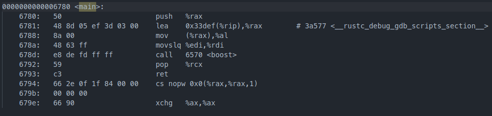
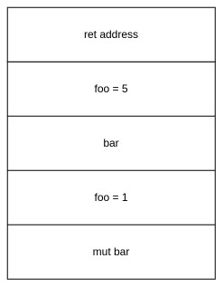
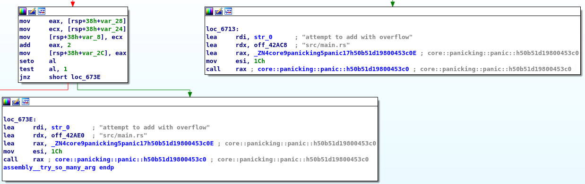

# Rust基础语句汇编分析

作者：李睿

> 作者正在积极寻找寒暑假实习机会，如果您能提供帮助，请通过文章底部的联系方式联系作者，不胜感激。

从开始接触Rust以来，我一直在惊叹于Rust的安全、高效，享受Rust带来的开发的愉悦。但随着开发的Rust项目越来越多，我的疑惑也逐渐增大，我们知道Rust可以很好的工作，但它是如何运作的？Rust是怎么处理每一条`match`语句的？是怎么传递参数的？

下面我们尝试去理解它，窥视Rust运作原理的一部分（非常小的一部分）。我们将编写一系列包含简单语句的函数，用静态分析工具分析汇编指令，搞明白程序是怎么执行的。希望这篇文章能够帮助到您，当然这篇文章可能包含部分甚至完全的错误，如果您能够在评论区指出，既能够帮助作者纠正错误，也能让其他读者免受作者之害（笑）。

## 本文的代码

作者的二进制水平有限，目前只能对于简单的语句进行分析，因此我们的第一篇文章就围绕下面的简单代码展开，争取搞懂每一个函数。作者事先也没有分析过Rust的二进制，希望能在写这篇文章的时候和读者一起学习。如果遇到带有疑问的地方，作者会用**加粗字体标识**，大家可以一起讨论。

在编译代码的时候，我们的项目名称为`assembly`，使用debug编译，而非release。

```Rust
#![feature(start)]

#[start]
#[no_mangle]
fn boost(argc: isize, argv: *const *const u8) -> isize {
    mangled();
    try_variable();
    try_match();
    try_match_with_arg(1);
    try_so_many_arg(0, 1, 2, 3, 4, 5, 6, 7, 8, 9, 10, 11);
    try_str_arg("wow");
    0
}

fn mangled() {}

#[no_mangle]
fn try_variable() {
    let foo = 1;
    let bar = 2;
    let mut bar = 3;
    bar += 1;
    let foo = 5;
}

#[no_mangle]
fn try_match() {
    let mut foo = 1;
    match foo {
        1 => {
            foo = 2;
        }
        _ => {
            foo = 3;
        }
    }
}

#[no_mangle]
fn try_match_with_arg(foo: i32) -> i32 {
    match foo {
        1 => {
            0
        }
        2 => {
            1
        }
        _ => {
            2
        }
    }
}

#[no_mangle]
fn try_so_many_arg(a: i32, b: i32, c: i32, d: i32, e: i32, f: i32, g: i32, h: i32, i: i32, j: i32, k: i32, l: i32) {
    let a = a + 1;
    let b = b + 2;
}

#[no_mangle]
fn try_str_arg(s: &str) {
    let _ = s.len();
}
```

## #[no_mangle]是什么

本节对应的RFC页面：[2603-rust-symbol-name-mangling-v0](https://rust-lang.github.io/rfcs/2603-rust-symbol-name-mangling-v0.html)

在Rust中，我们程序中的符号在编译时会经过名字修饰这一过程，这是为了保证实体名字必须唯一的一种技术。比如我们的函数名为`mangled`，在经过名字修饰后，函数名会变为类似`_ZN8assembly7mangled17hdae1ffd2c2da5f53E`的一串，具体的规则可以查看RFC中的讲述。为了保证我们可以轻松找到编译后的函数，我们需要为函数加上`#[no_mangle]`这一属性，保证函数保留原本的名称。

## #[start]是什么

相信部分读者已经注意到了，我们的函数没有main函数，而是为boost加上了start属性。Rust和C语言不一样，我们一般情况编写的main函数在编译后同样会经过上面说的名字修饰。而Rust在执行时，会经过`_start -> main -> our_main`的过程，我们的main函数实际上是被调用的，而不是入口！

下面我们来验证：

首先读取ELF头，得到入口点地址为0x6470。

```Plain%20Text
ELF 头：
  Magic：  7f 45 4c 46 02 01 01 00 00 00 00 00 00 00 00 00 
  类别:                              ELF64
  数据:                              2 补码，小端序 (little endian)
  Version:                           1 (current)
  OS/ABI:                            UNIX - System V
  ABI 版本:                          0
  类型:                              DYN (共享目标文件)
  系统架构:                          Advanced Micro Devices X86-64
  版本:                              0x1
  入口点地址：              0x6470
  程序头起点：              64 (bytes into file)
  Start of section headers:          3585048 (bytes into file)
  标志：             0x0
  Size of this header:               64 (bytes)
  Size of program headers:           56 (bytes)
  Number of program headers:         14
  Size of section headers:           64 (bytes)
  Number of section headers:         43
  Section header string table index: 42
```

查看Objdump的结果：


而main函数：



验证成功！

这里我们想为main设置no_mangle属性，但实际上已经有一个main了，重复的符号是不允许的，因此我们需要使用start+no_mangle来自定义我们程序的“入口”。

## boost函数

### 源码

```Rust
fn boost(argc: isize, argv: *const *const u8) -> isize {
    try_variable();
    try_match();
    try_match_with_arg(1);
    try_so_many_arg(0, 1, 2, 3, 4, 5, 6, 7, 8, 9, 10, 11);
    try_str_arg("wow");
    0
}
```

### 汇编

```Assembly%20language
0000000000006570 <boost>:
    6570:        48 83 ec 48                  sub    $0x48,%rsp
    6574:        48 89 7c 24 38               mov    %rdi,0x38(%rsp)
    6579:        48 89 74 24 40               mov    %rsi,0x40(%rsp)
    657e:        e8 7d 00 00 00               call   6600 <_ZN8assembly7mangled17hdae1ffd2c2da5f53E>
    6583:        e8 88 00 00 00               call   6610 <try_variable>
    6588:        e8 b3 00 00 00               call   6640 <try_match>
    658d:        bf 01 00 00 00               mov    $0x1,%edi
    6592:        e8 c9 00 00 00               call   6660 <try_match_with_arg>
    6597:        31 ff                        xor    %edi,%edi
    6599:        be 01 00 00 00               mov    $0x1,%esi
    659e:        ba 02 00 00 00               mov    $0x2,%edx
    65a3:        b9 03 00 00 00               mov    $0x3,%ecx
    65a8:        41 b8 04 00 00 00            mov    $0x4,%r8d
    65ae:        41 b9 05 00 00 00            mov    $0x5,%r9d
    65b4:        c7 04 24 06 00 00 00         movl   $0x6,(%rsp)
    65bb:        c7 44 24 08 07 00 00         movl   $0x7,0x8(%rsp)
    65c2:        00 
    65c3:        c7 44 24 10 08 00 00         movl   $0x8,0x10(%rsp)
    65ca:        00 
    65cb:        c7 44 24 18 09 00 00         movl   $0x9,0x18(%rsp)
    65d2:        00 
    65d3:        c7 44 24 20 0a 00 00         movl   $0xa,0x20(%rsp)
    65da:        00 
    65db:        c7 44 24 28 0b 00 00         movl   $0xb,0x28(%rsp)
    65e2:        00 
    65e3:        e8 c8 00 00 00               call   66b0 <try_so_many_arg>
    65e8:        48 8d 3d 11 fa 02 00         lea    0x2fa11(%rip),%rdi        # 36000 <_fini+0x3d8>
    65ef:        be 03 00 00 00               mov    $0x3,%esi
    65f4:        e8 67 01 00 00               call   6760 <try_str_arg>
    65f9:        31 c0                        xor    %eax,%eax
    65fb:        48 83 c4 48                  add    $0x48,%rsp
    65ff:        c3                           ret  
```

### 伪代码

```C%2B%2B
isize __fastcall assembly::boost(isize argc, u8 **argv)
{
  _str v2; // rdi

  assembly::mangled::hdae1ffd2c2da5f53();
  assembly::try_variable();
  assembly::try_match();
  assembly::try_match_with_arg(1);
  assembly::try_so_many_arg(0, 1, 2, 3, 4, 5, 6, 7, 8, 9, 10, 11);
  v2.data_ptr = (u8 *)"wowsrc/main.rs";
  v2.length = 3LL;
  assembly::try_str_arg(v2);
  return 0LL;
}
```

### 分析

在我们boost函数中，包含了一系列函数调用和参数传递，从中可以看出：Rust中的参数传递，前六个参数放到rdi rsi rdx rcx r8d r9d寄存器，之后的参数放入栈中。

而对于&str类型，Rust会用一个结构去存储，这个结构包含下面两个元素：

- data_ptr：指向数据地址的指针
- length：长度

这里我们的第一个放置了指向"wow"的地址，其保存在.rodata段中。第二个参数为3，代表&str的长度为3。如果不指定长度，&str也不像C语言会以'\0'进行截断，我们将不知道&str的值为什么。

最后的返回值部分可以看到eax用异或清零，直接返回。

## try_variable函数

### 源码

```Rust
fn try_variable() {
    let foo = 1;
    let bar = 2;
    let mut bar = 3;
    bar += 1;
    let foo = 5;
}
```

### 汇编

```Assembly%20language
0000000000006610 <try_variable>:
    6610:        48 83 ec 10                  sub    $0x10,%rsp
    6614:        c7 44 24 04 01 00 00         movl   $0x1,0x4(%rsp)
    661b:        00 
    661c:        c7 44 24 08 02 00 00         movl   $0x2,0x8(%rsp)
    6623:        00 
    6624:        c7 04 24 03 00 00 00         movl   $0x3,(%rsp)
    662b:        c7 04 24 04 00 00 00         movl   $0x4,(%rsp)
    6632:        c7 44 24 0c 05 00 00         movl   $0x5,0xc(%rsp)
    6639:        00 
    663a:        48 83 c4 10                  add    $0x10,%rsp
    663e:        c3                           ret    
    663f:        90                           nop
```

### 分析

在Rust中i32的类型会占用4Byte内存，在函数头部我们可以看到栈顶地址被减去16Byte为局部变量开辟空间，此时栈的分布如下：



由于Rust中支持变量遮蔽，我们能够重复声明foo和bar变量并赋值，但他们都拥有各自的内存空间，而不是覆盖原有的空间。同时编译器已经为我们把加法优化为了mov指令直接赋值。

在可变性上，Rust会在编译上为我们强调mut和非mut的区别，而实际的编译结果是看不出来的。

## try_match函数

### 源码

```Rust
fn try_match() {
    let mut foo = 1;
    match foo {
        1 => {
            foo = 2;
        }
        _ => {
            foo = 3;
        }
    }
}
```

### 汇编

```Assembly%20language
0000000000006640 <try_match>:
    6640:        48 83 ec 04                  sub    $0x4,%rsp
    6644:        c7 04 24 01 00 00 00         movl   $0x1,(%rsp)
    664b:        c7 04 24 02 00 00 00         movl   $0x2,(%rsp)
    6652:        48 83 c4 04                  add    $0x4,%rsp
    6656:        c3                           ret    
    6657:        66 0f 1f 84 00 00 00         nopw   0x0(%rax,%rax,1)
    665e:        00 00 
```

### 分析

我们可以看到这里编译器已经为我们优化了代码，由于match的变量可知，所以只需要包含值为1的分支即可。

这里抛出一个疑问：**最后的nopw指令有何作用？**

## try_match_with_arg函数

### 源码

```Rust
#[no_mangle]
fn try_match_with_arg(foo: i32) -> i32 {
    match foo {
        1 => {
            0
        }
        2 => {
            1
        }
        _ => {
            2
        }
    }
}
```

### 汇编

```Assembly%20language
0000000000006660 <try_match_with_arg>:
    6660:        48 83 ec 0c                  sub    $0xc,%rsp
    6664:        89 3c 24                     mov    %edi,(%rsp)
    6667:        89 7c 24 08                  mov    %edi,0x8(%rsp)
    666b:        83 ef 01                     sub    $0x1,%edi
    666e:        74 16                        je     6686 <try_match_with_arg+0x26>
    6670:        eb 00                        jmp    6672 <try_match_with_arg+0x12>
    6672:        8b 04 24                     mov    (%rsp),%eax
    6675:        83 e8 02                     sub    $0x2,%eax
    6678:        74 16                        je     6690 <try_match_with_arg+0x30>
    667a:        eb 00                        jmp    667c <try_match_with_arg+0x1c>
    667c:        c7 44 24 04 02 00 00         movl   $0x2,0x4(%rsp)
    6683:        00 
    6684:        eb 12                        jmp    6698 <try_match_with_arg+0x38>
    6686:        c7 44 24 04 00 00 00         movl   $0x0,0x4(%rsp)
    668d:        00 
    668e:        eb 08                        jmp    6698 <try_match_with_arg+0x38>
    6690:        c7 44 24 04 01 00 00         movl   $0x1,0x4(%rsp)
    6697:        00 
    6698:        8b 44 24 04                  mov    0x4(%rsp),%eax
    669c:        48 83 c4 0c                  add    $0xc,%rsp
    66a0:        c3                           ret    
    66a1:        66 2e 0f 1f 84 00 00         cs nopw 0x0(%rax,%rax,1)
    66a8:        00 00 00 
    66ab:        0f 1f 44 00 00               nopl   0x0(%rax,%rax,1)
```

### 分析

和上面一个函数的区别是我们这里match的是传入的参数，得到的汇编变得稍微复杂了一些。首先我们的参数在了rsp和rsp+8的内存处保存了副本。

之后保存参数的rdi与1进行比较，这里的cmp与sub、je与jz指令效果相同，在进行比较的时候，计算机会两数相减，如果等于零说明相等（即ZF标志为1）。如果我们的foo为1，则跳转到+0x26处，将rsp+4内存置为0。

如果不为1，可以看到Rust的编译结果会jmp到下一条指令处，这里并未做优化做了一次无谓的跳转。和之前的类似，只不过这里我们从rsp处取得了保存的参数值，交由eax寄存器比较是否为2，如果等于2则将rsp+4内存置为1。

如果不等于1和2，将使用默认匹配_，直接将rsp+4内存置为2。最后rsp+4内存的值交由eax寄存器作为返回值，释放局部变量空间。

看到这里有个疑问：**为什么会保存两次副本，在rsp+8内存的副本并没有被使用到？**

## try_so_many_arg函数

### 源码

```Rust
fn try_so_many_arg(a: i32, b: i32, c: i32, d: i32, e: i32, f: i32, g: i32, h: i32, i: i32, j: i32, k: i32, l: i32) {
    let a = a + 1;
    let b = b + 2;
}
```

### 汇编

```Assembly%20language
00000000000066b0 <try_so_many_arg>:
    66b0:        48 83 ec 38                  sub    $0x38,%rsp
    66b4:        89 74 24 10                  mov    %esi,0x10(%rsp)
    66b8:        8b 44 24 68                  mov    0x68(%rsp),%eax
    66bc:        8b 44 24 60                  mov    0x60(%rsp),%eax
    66c0:        8b 44 24 58                  mov    0x58(%rsp),%eax
    66c4:        8b 44 24 50                  mov    0x50(%rsp),%eax
    66c8:        8b 44 24 48                  mov    0x48(%rsp),%eax
    66cc:        8b 44 24 40                  mov    0x40(%rsp),%eax
    66d0:        89 7c 24 18                  mov    %edi,0x18(%rsp)
    66d4:        89 74 24 1c                  mov    %esi,0x1c(%rsp)
    66d8:        89 54 24 20                  mov    %edx,0x20(%rsp)
    66dc:        89 4c 24 24                  mov    %ecx,0x24(%rsp)
    66e0:        44 89 44 24 28               mov    %r8d,0x28(%rsp)
    66e5:        44 89 4c 24 2c               mov    %r9d,0x2c(%rsp)
    66ea:        ff c7                        inc    %edi
    66ec:        89 7c 24 14                  mov    %edi,0x14(%rsp)
    66f0:        0f 90 c0                     seto   %al
    66f3:        a8 01                        test   $0x1,%al
    66f5:        75 1c                        jne    6713 <try_so_many_arg+0x63>
    66f7:        8b 44 24 10                  mov    0x10(%rsp),%eax
    66fb:        8b 4c 24 14                  mov    0x14(%rsp),%ecx
    66ff:        89 4c 24 30                  mov    %ecx,0x30(%rsp)
    6703:        83 c0 02                     add    $0x2,%eax
    6706:        89 44 24 0c                  mov    %eax,0xc(%rsp)
    670a:        0f 90 c0                     seto   %al
    670d:        a8 01                        test   $0x1,%al
    670f:        75 2d                        jne    673e <try_so_many_arg+0x8e>
    6711:        eb 1e                        jmp    6731 <try_so_many_arg+0x81>
    6713:        48 8d 3d f6 f8 02 00         lea    0x2f8f6(%rip),%rdi        # 36010 <str.0>
    671a:        48 8d 15 a7 c3 03 00         lea    0x3c3a7(%rip),%rdx        # 42ac8 <__do_global_dtors_aux_fini_array_entry+0x8>
    6721:        48 8d 05 78 f5 ff ff         lea    -0xa88(%rip),%rax        # 5ca0 <_ZN4core9panicking5panic17h50b51d19800453c0E>
    6728:        be 1c 00 00 00               mov    $0x1c,%esi
    672d:        ff d0                        call   *%rax
    672f:        0f 0b                        ud2    
    6731:        8b 44 24 0c                  mov    0xc(%rsp),%eax
    6735:        89 44 24 34                  mov    %eax,0x34(%rsp)
    6739:        48 83 c4 38                  add    $0x38,%rsp
    673d:        c3                           ret    
    673e:        48 8d 3d cb f8 02 00         lea    0x2f8cb(%rip),%rdi        # 36010 <str.0>
    6745:        48 8d 15 94 c3 03 00         lea    0x3c394(%rip),%rdx        # 42ae0 <__do_global_dtors_aux_fini_array_entry+0x20>
    674c:        48 8d 05 4d f5 ff ff         lea    -0xab3(%rip),%rax        # 5ca0 <_ZN4core9panicking5panic17h50b51d19800453c0E>
    6753:        be 1c 00 00 00               mov    $0x1c,%esi
    6758:        ff d0                        call   *%rax
    675a:        0f 0b                        ud2    
    675c:        0f 1f 40 00                  nopl   0x0(%rax)
```

### 分析

看上去简单的函数没想到我们得到了这么复杂的结果！

我们前6个参数被手动保存到了rsp+0x18到rsp+0x2c处，而后6个参数在最开始的rsp+0x40到rsp+0x68处：


这里我们并未使用到后面的参数，但编译结果仍然可以看到这些参数分别被赋给了eax一次。

对于局部变量a和b的加法分别对应66ea和6703处的inc和add指令，有趣的是，可以看到这里Rust会校验加法是否溢出。即seto指令将OF标志赋给al寄存器，如果不为零就会将报错的信息、文件名作为参数调用panic函数。这保证了我们不会因为传入的参数为INT_MAX导致溢出为负数。



## try_str_arg函数

### 源码

```Rust
fn try_str_arg(s: &str) {
    let _ = s.len();
}
```

### 汇编

```Assembly%20language
0000000000006760 <try_str_arg>:
    6760:        48 83 ec 18                  sub    $0x18,%rsp
    6764:        48 89 7c 24 08               mov    %rdi,0x8(%rsp)
    6769:        48 89 74 24 10               mov    %rsi,0x10(%rsp)
    676e:        e8 2d 00 00 00               call   67a0 <_ZN4core3str21_$LT$impl$u20$str$GT$3len17h99821c36485a7d2eE>
    6773:        48 83 c4 18                  add    $0x18,%rsp
    6777:        c3                           ret    
    6778:        0f 1f 84 00 00 00 00         nopl   0x0(%rax,%rax,1)
    677f:        00 
```

### 分析

终于来到了我们最后一步，这里我们接受了上文提到的data_ptr（str地址）和长度参数。在本地保存副本后调用core库str的[len方法](https://doc.rust-lang.org/src/core/str/mod.rs.html#144)。由于没有使用返回值，我们可以看到这里没有处理rax而是直接返回。

## release编译

以上的分析都是在debug编译下面进行的，如果我们使用release编译呢？

稍微修改一下boost函数的代码：

```Rust
fn boost(argc: isize, argv: *const *const u8) -> isize {
    let a = 1;
    mangled();
    try_variable();
    try_match();
    try_match_with_arg(1);
    try_so_many_arg(0, 1, 2, 3, 4, 5, 6, 7, 8, 9, 10, 11);
    try_str_arg("wow");
    1
}
```

然后让我们来看看release编译的main函数：

```Assembly%20language
0000000000001120 <main>:
    1120:        b8 01 00 00 00               mov    $0x1,%eax
    1125:        c3                           ret    
    1126:        66 2e 0f 1f 84 00 00         cs nopw 0x0(%rax,%rax,1)
    112d:        00 00 00 
```

我们的函数调用都没了，也找不到try_variable等函数！这些没有必要的函数在release下面都会被删除掉，没有使用的局部变量也会直接删除。这保证了release编译下面的高效和二进制文件精简。

## 总结

通过这次分析，我们可以看到Rust中一些基础语句在编译后的结果。个人觉得比较有趣的是，因为传入的参数不可知，Rust会主动判断加法后是否会溢出，而不是产生溢出出现UB。而在release模式下，Rust能够发现我们写的无用的函数，直接删除。如果文章有什么错误或者您有什么建议，欢迎在评论区指出～

最后希望大家在2022年都能达成自己的目标，心想事成。:)

## 关于作者

北邮大二学生，开源爱好者。目前正在努力学习Linux内核、Rust中，对技术抱有热情。欢迎在飞书Rust 中文社群搜索李睿添加好友。

GitHub：https://github.com/KernelErr

个人博客：https://lirui.tech/

联系邮箱：me@lirui.tech
