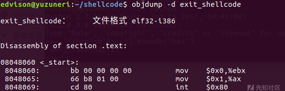
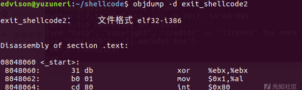

# Rust RFC static async fn in trait

> 本篇将会简要介绍什么是《This Week in Rust》，第420篇推文中有关Rust新通过RFC 3185 static async fn in trait、Linux支持以及Shellcode相关的内容。


## RFC 3185：static async fn in trait

在《[This Week in Rust #412](https://this-week-in-rust.org/blog/2021/10/13/this-week-in-rust-412/)》中，语言组发布了十月月会的决策内容，包括实现[traits中的异步函数](https://rust-lang.github.io/async-fundamentals-initiative/updates/2021-oct.html)，对于这一部分具体的说明可见《[This Week in Rust #412：Rust Async trait更新与多线程](http://openx.huawei.com/Ylong_Rust/dynamicDetail/3379)》。而在第420篇周报中，尽管dyn async fn in traits可能还需要时间，目前Rust已正式支持static async fn in traits。具体的RFC可见《[Static async fn in traits](https://rust-lang.github.io/rfcs/3185-static-async-fn-in-trait.html)》。

概括来说，Rust现在支持如下写法：

```rust
trait Service {
    async fn request(&self, key: i32) -> Response;
}

struct MyService {
    db: Database
}

impl Service for MyService {
    async fn request(&self, key: i32) -> Response {
        Response {
            contents: self.db.query(key).await.to_string()
        }
    }
}
```

`async fn request`的实现必须包含`async`关键字，不可以使用去糖化的形式（即在函数体内编写`async`块），不然编译器会报错，提示"expected async fn"。

原理上来说，去糖化后，`async fn request(&self, key: i32) -> Response`的实际返回值为一个匿名泛型关联类型（Generic Associated Type，GAT）。这个类型的限制会与`fn request`保持一致，也就是说，如果`request`这个函数含有`where`语句限定，这个类型也会保留这些限定。例如：

```rust
trait Example {
    async fn method<P0..Pn>(&self)
    where
        WC0..WCn;
}

// Becomes:

trait Example {
    type $<'me, P0..Pn>: Future<Output = ()>
    where
        WC0..WCn, // Explicit where clauses
        Self: 'me; // Implied bound from `&self` parameter

    // use $ to represent the anonymous GAT's name
    fn method<P0..Pn>(&self) -> Self::$<'_, P0..Pn>
    where
        WC0..WCn;
}
```

`async fn`的去糖化与其他异步函数相同：

```rust
// Source
async fn example(x: &str) -> usize {
    x.len()
}

// Desugared
// For async fn, type Self::$<'_, P0..Pn> is equal to an impl Future type, but not exactly the impl Future
fn example<'a>(x: &'a str) -> impl Future<Output = usize> + 'a {
    async move { x.len() }
}
```


## Rust与Linux

在[2020年Linux线上会议](https://www.linuxplumbersconf.org/blog/2020/)中，由于内存安全的特性，Rust被提议作为Linux内核的第二官方语言使用。当三分之二的安全问题可以追溯至内存使用，相当程度上保证内存安全但并不增加任何运行时开销的Rust无疑是可行的解决方案。尽管无法用Rust重构内核近25,000,000行C代码，Linux内核作者Linus Torvalds认为在驱动以及一些非核心内核程序上引入Rust是一个不错的开头，因为这些组件并不被核心内核程序依赖，修改它们并不会带来连锁反应。[`Rust-for-linux`项目](https://github.com/Rust-for-Linux/linux)由此成立。

2021年4月14日，新的[Linux RFC](https://lore.kernel.org/lkml/20210414184604.23473-1-ojeda@kernel.org/)介绍了Rust for Linux项目、使用Rust的理由以及设计理念，该项目目前只涉及在编写驱动以及非核心程序时提供Rust支持。尽管在内核中重新引入新的语言有失去长期支持的风险，Rust本身也不够成熟，项目组人员认为Rust的内存安全特性、由此带来的错误减少以及重构便利会超过引入Rust所带来的麻烦。

项目组于7月4日以及12月6日发布了项目进度汇总Patch series [v1](https://lore.kernel.org/lkml/20210704202756.29107-1-ojeda@kernel.org/)以及[v2](https://lkml.org/lkml/2021/12/6/461)。Patch series v2中，内核项目的Rust代码不再依赖于beta版本的编译器，而是稳定版本的，使得Rust代码将会更可靠。项目组将会持续推进演进代码，尽量使其不依赖于任何不稳定功能。


## Rust与Shellcode


### 机器码（Machine Code）

任何低级编程语言都可以被称为机器码，机器码可以视作是汇编程序更低一层的表示，是一种更原始的、依赖于硬件的编程语言。机器码由架构指令集组成，可以直接控制CPU执行某些指令，例如load，store，jump，等等。机器码由纯数字构成，例如：

> - 指令部分的示例
>   1. 0000 代表 加载（LOAD）
>   2. 0001 代表 存储（STORE）
>
> ...
>
> - 寄存器部分的示例
>   1. 0000 代表寄存器 A
>   2. 0001 代表寄存器 B
>
> ...
>
> - 存储器部分的示例
>   1. 000000000000 代表地址为 0 的存储器
>   2. 000000000001 代表地址为 1 的存储器
>   3. 000000010000 代表地址为 16 的存储器
>   4. 100000000000 代表地址为 2^11 的存储器
>
> - 集成示例
>   1. 0000,0000,000000010000 代表 LOAD A, 16
>   2. 0000,0001,000000000001 代表 LOAD B, 1
>   3. 0001,0001,000000010000 代表 STORE B, 16
>   4. 0001,0001,000000000001 代表 STORE B, 1

另一个例子是，在MIPS架构环境下，机器码指令固定长度为32 bits。不同类型指令以及对应格式为：

> ```
>    6      5     5     5     5      6     bits
> [  op  |  rs |  rt |  rd |shamt| funct]  R-type
> [  op  |  rs |  rt | address/immediate]  I-type
> [  op  |        target address        ]  J-type
> ```

示例机器码：

> R-type:
> ```
> [  op  |  rs |  rt |  rd |shamt| funct]
> 0     1     2     6     0     32     decimal
> 000000 00001 00010 00110 00000 100000   binary
> ```
>
> I-type:
>
> ```
> [  op  |  rs |  rt | address/immediate]
> 35     3     8           68           decimal
> 100011 00011 01000 00000 00001 000100   binary
> ```
>
> J-type:
>
> ```
>  [  op  |        target address        ]
>     2                 1024               decimal
>  000010 00000 00000 00000 10000 000000   binary
> ```


由于手算地址以及管理bits太过繁琐，一般开发并不会直接编写机器码。高级语言的编译器会将代码转译成机器码。

例如对于gcc编译器：

- `gcc -E hello.c -o hello.i`：展开`#include`与宏进行预编译，输出对应的体积更大的文本文件
- `gcc -S hello.i -o hello.s`：生成汇编代码
- `gcc -c hello.s -o hello.o`：将汇编代码转译为机器码
- `gcc hello.o -o hello`：链接机器码，生成可执行文件

可执行文件相当于以某种格式链接、排布机器码，使得计算机可以根据机器码执行一系列指令。`*.o`文件并不一定是计算机可执行的机器码，可执行文件可能会包括实际执行中需要的额外信息，例如运行时。实际执行时，可执行文件必须与当前系统的应用二进制接口（Application Binary Interface，ABI）一致。应用二进制接口指两程序模块间的接口，通常其中一个程序模块会是库或操作系统所提供的服务，而另一边的模块则是用户所执行的程序。ABI定义了机器码如何访问数据结构与运算程序，此处所定义的界面相当低端并且相依于硬件。而类似概念的API则在源代码定义，较为高端，并不直接依赖于硬件，通常会是人类可阅读的代码。对于某些比较简单的接口，执行这些文件会将其装在到内存中，跳转到指令开始地址，并且从此开始执行指令；更复杂的接口或许会要求可执行文件提供metadata，说明程序入口。

不过，虽然机器码是纯数字，不可以直接阅读，可执行文件反而并不一定如此。以脚本语言撰写的脚本文件，都可以是可执行文件，而且内含的资料可被人类阅读，多数以ASCII文本存档。脚本语言无需经过编译器预先编译，就可经过解释器（如Perl、Python、Shell）执行。


### 字节码

字节码的定义可见《[机器码(machine code)和字节码(byte code)是什么？](https://blog.csdn.net/Nathan1987_/article/details/100932502)》：

> 字节码（Bytecode）是一种包含执行程序、由一序列 OP代码（操作码）/ 数据对组成的二进制文件。
> 字节码是一种中间码，它比机器码更抽象，需要直译器转译后才能成为机器码的中间代码。
>
> 通常情况下它是已经经过编译，但与特定机器码无关。字节码通常不像源码一样可以让人阅读，而是编码后的数值常量、引用、指令等构成的序列。
>
> 字节码主要为了实现特定软件运行和软件环境、与硬件环境无关。字节码的实现方式是通过编译器和虚拟机器。编译器将源码编译成字节码，特定平台上的虚拟机器将字节码转译为可以直接执行的指令。
>
> 字节码的典型应用为Java bytecode。
> 字节码在运行时通过JVM（JAVA虚拟机）做一次转换生成机器指令，因此能够更好的跨平台运行。
>
> 总结：字节码是一种中间状态（中间码）的二进制代码（文件）。需要直译器转译后才能成为机器码。


### Shellcode

Shellcode是十六进制的机器码。在计算机攻防中，shellcode通常被作为传输信息的一部分（Payload）使用。攻击者通常用指定机器码打开命令行（Command Shell），从而通过Shell控制机器，Shellcode也因此得名。不过，机器码不仅仅可以打开命令行，也可以执行其他的指令，因此Shellcode的命名在某种程度上实际上并不准确。

缓冲区溢出攻击就利用了Shellcode，通过缓冲区溢出覆写内存中原有的代码，使得当其他指令跳转到该代码地址时，由于原有代码已被覆盖，程序并不会按原逻辑执行，而是执行给定的机器码。如果运行程序本身具有root权限，此时再利用机器码打开Shell，那么攻击者就获得了具有root权限的Shell，可以对系统进行任意操作。不过，对于Rust而言，Rust并不像C直接使用指针读写数据，而是使用借用检查等机制，在非`unsafe`代码块中避免内存问题，因此对于Rust非`unsafe`代码块，缓冲区溢出攻击几乎是不可能的。

由于手写机器码并不现实，通常编写Shellcode的方式是反汇编可执行文件或从汇编后二进制中提取十六进制Shellcode。对于`*.o`文件，可以通过Linux的反汇编指令objdump来获取二进制文件可能带有的附加信息，在这个场景下，即阅读其中的机器码。

例如，对于代码：

```C
main()
{
    exit(0);
}
```

生成`exit_shellcode.o`以后，输入`objdump -d exit_shellcode`：



不过，这串Shellcode中还包括Null字符，即`\x00`，尽管逻辑成立，但是在实际使用时需要想办法去掉这些字符，否则该值会被认为是终止符，运行会发生异常。由于xor指令在操作数相等的情况下返回0，也就是可以在指令里不使用0，但是结果返回0，可以使用xor来代替mov指令，一个可能的改写方式为：



由此，获得的Shellcode为：

```C 
// 机器码
char shellcode[] = "\x31\xdb"
                   "\xb0\x01"
                   "\xcd\x80";
int main()
{
    int *ret;
    ret = (int *)&ret + 2;
    (&ret) = (int)shellcode;
}
```

在该程序中，直接使用该Shellcode会导致程序退出，即执行`exit(0)`。


### Rust与Shellcode

《[How to execute shellcodes from memory in Rust](https://kerkour.com/rust-execute-from-memory/)》介绍了如何在Rust中运行Shellcode。例如，对于Shellcode：

```
488d35140000006a01586a0c5a4889c70f056a3c5831ff0f05ebfe68656c6c6f20776f726c640a
```

在`x86_64`架构下，本质上这段Shellcode打印了字符串`hello world!`。具体指令如下：

```apl
$ echo '488d35140000006a01586a0c5a4889c70f056a3c5831ff0f05ebfe68656c6c6f20776f726c640a' | xxd -r -p > shellcode.bin\
$ objdump -D -b binary -mi386 -Mx86-64 -Mintel shellcode.bin

shellcode.bin:     file format binary


Disassembly of section .data:

00000000 <.data>:
   0:   48 8d 35 14 00 00 00    lea    rsi,[rip+0x14]        # 0x1b
   7:   6a 01                   push   0x1
   9:   58                      pop    rax
   a:   6a 0c                   push   0xc
   c:   5a                      pop    rdx
   d:   48 89 c7                mov    rdi,rax
  10:   0f 05                   syscall           // <- write(1, "hello world\n", 12)
  12:   6a 3c                   push   0x3c
  14:   58                      pop    rax
  15:   31 ff                   xor    edi,edi
  17:   0f 05                   syscall           // <- exit
  19:   eb fe                   jmp    0x19
  1b:   68 65 6c 6c 6f          push   0x6f6c6c65 // <- hello world\n
  20:   20 77 6f                and    BYTE PTR [rdi+0x6f],dh
  23:   72 6c                   jb     0x91
  25:   64                      fs
  26:   0a                      .byte 0xa
```

`std::mem::transmute`的[接口](https://doc.rust-lang.org/stable/std/mem/fn.transmute.html)定义如下：

```rust
pub const unsafe extern "rust-intrinsic" fn transmute<T, U>(e: T) -> U
```

这一函数可以将组成某一个值的bits认定为另一个给定的类型。由于编译器无法保证这个转换，非常可能导致未定义行为，转换是`unsafe`。

可以通过这个函数，将Shellcode中包含的内容认定为某个函数，通过调用函数来执行机器码。可以通过如下代码将Shellcode存储至程序`.text`部分，并调用`std::mem::transmute`来执行：

```rust
use std::mem;

// we do this trick because otherwise only the reference of the buffer is in the .text section
// and not the buffer itself
const SHELLCODE_BYTES: &[u8] = include_bytes!("../shellcode.bin");
const SHELLCODE_LENGTH: usize = SHELLCODE_BYTES.len();

#[no_mangle]
#[link_section = ".text"]
static SHELLCODE: [u8; SHELLCODE_LENGTH] = *include_bytes!("../shellcode.bin");

fn main() {
    let exec_shellcode: extern "C" fn() -> ! =
        unsafe { mem::transmute(&SHELLCODE as *const _ as *const ()) };
    exec_shellcode();
}
```

[`include_bytes!`宏](https://doc.rust-lang.org/std/macro.include_bytes.html)会读取目标文件的内容，并将变量`SHELLCODE_BYTES`视作是对其内容的引用。通过解引用，Shellcode的实际内容存储至`.text`区块，并通过`std::mem::transmute`将其认定为函数。

另一个方法是使用crate mmap。mmap可以将内存中指定的某个区域认作是可执行的，经过一些变换以后，可以通过函数名来尝试执行区域中的代码。使用mmap的例子如下：

```rust
use mmap::{
    MapOption::{MapExecutable, MapReadable, MapWritable},
    MemoryMap,
};
use std::mem;

// as the shellcode is not in the `.text` section, we can't execute it as it
const SHELLCODE: &[u8] = include_bytes!("../shellcode.bin");

fn main() {
    let map = MemoryMap::new(SHELLCODE.len(), &[MapReadable, MapWritable, MapExecutable]).unwrap();

    unsafe {
        // copy the shellcode to the memory map
        std::ptr::copy(SHELLCODE.as_ptr(), map.data(), SHELLCODE.len());
        let exec_shellcode: extern "C" fn() -> ! = mem::transmute(map.data());
        exec_shellcode();
    }
}
```


