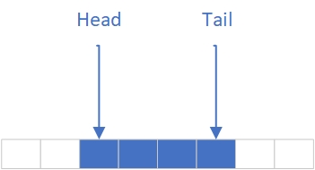
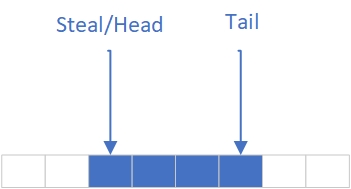

达坦科技 ｜ Tokio 解析之任务调度

作者： 施继成

---

# 简介

Tokio 是 Rust 世界里最著名的异步执行框架，该框架包罗了几乎所有异步执行的接口，包括但不限于文件、网络和文件系统管理。在这些方便使用的高层接口之下则是一些“基石”，他们并不存在于用户直接交互的接口中，而是藏于表层之下默默完成任务。这其中就包括了线程池，执行异步任务的基本单元，本文就来介绍一下 tokio 的线程池及其调度，尽可能说明其中有趣的关键点。本文涉及的代码主要在 `tokio/src/runtime` 下。

# 线程池

线程池的概念在许多语言中都有，一般大家使用线程池的原因是减少创建和销毁线程带来的性能损失。在 tokio 中线程池被用作执行异步 task 的执行资源，例如下列代码其实就是创建了一个异步任务放到了 tokio 线程池中：

```rust
tokio::spawn(
    // This is an async task
    async { ... }
);
```

至于如何存放这些 task，有几种显而易见的选择（并非只有这几种）：
1. 将所有的待执行 task 都放到一个公共的队列中（即全局队列），每个线程都从这个队列中拿取信息。
2. 每个线程自己一个独立队列，只抓取自己队列中的 task 执行，队列中 task 空了就歇着。
3. 每个线程自己一个独立队列，首先抓取自己队列中的 task 执行，如果自己的队列为空，则从其他线程的队列中偷取。

第一种实现很糟糕，无论如何优化那个公共队列——用锁或者原子操作——竞争带来的性能下降是无法避免的。这里需要指明一点，用原子操作并不是没有竞争，原子操作是将竞争放到了硬件，竞争多了效率仍然不好。

第二种实现也不太好，当一个线程堆满任务时，他的任务来不及执行，而其他空闲线程“无事可做”，造成线程间的不平等。这种不平等也会使得多线程并行执行的优势发挥不出来。

第三种实现则是现在常用的“任务偷取（Work Stealing）”方式，该方法避免了上述两种方法的问题，但在实现细节上仍然有许多值得优化的地方。

# Work Steal 如何才能高效

Work Steal 的实现方法虽然很直接，但是有个问题仍然无法避免，存在两个或者多个线程同时从一个队列中拿取 task。想要线程安全，要么采用锁，要么采用无锁数据结构。Tokio 在早期版本中采用了基于 [crossbeam](https://github.com/crossbeam-rs/crossbeam) 的无锁队列，但是 Tokio 作者认为这种实现仍然太重了（epoch-based gc 仍然效率不高，此为 Tokio 作者观点，本文作者未实验论证），因此之后采用了现在的实现方法。

现在 Tokio 任务队列实现仍然是无锁的，采用的是环形队列数据结构，即 [ring buffer](https://en.wikipedia.org/wiki/Circular_buffer)。该数据结构为了能够知道哪些 slot 已经被使用，一般会使用两个 index —— head 和 tail，从 tail 初放入 item，从 head 处拿出 item，如下图所示：



但是这样的数据结构如果不做修改，仍然无法满足并行访问的需求，因此 tokio 对数据结构进行了一些调整。其将 head 这个 index 变成了两部分，一部分为 head，另一外一部分为 steal。原来的 head index 为 u32，修改后前面 16 bits 是 steal, 后面 16 bits 为 head，组合一下变成了 AtomicU32。如下图所示：



当没有人来偷取任务时，Tail 和 Head 相等，指向同一块位置。下面我们分析几种情况，看看该数据结构如何处理多人并发访问的问题。

## 当前 Thread 拿取本地的 Task

1. 如果开始操作时还没有人来偷取任务，那么读取（使用 Atomic Load 方法读取，并 unpack）到的 Steal 和 Head 一定相等，那么只需要将 Steal 和 Head 都加一，再利用 compare and swap (cmp-swp) 操作存入结果，成功的话则说明 task 拿取成功。这里存在两个原子操作，第一个为 load，第二个为 cmp-swp，第二个操作有可能失败，失败的原因是此时恰巧其他线程来偷取任务，修改了该原子变量。如果cmp-swp 操作失败，则头开始再尝试一次即可，直到成功。
2. 如果开始操作时已经有人正在偷取任务，那么读取到的 Steal 和 Head 一定不相等，那么只需要将 Head 加一，Steal 保持不变，再利用 cmp-swp 操作存入结果即可。同上，cmp-swp 如果成功，说明拿取本地 task 成功，否则失败，重复上述操作直到成功。

## 偷取其他 Thread 的任务

1. 如果开始操作时，已经有其他 Thread 在偷取任务，那么 load 出来的结果中 Steal 和 Head 的值一定不等，那么放弃本次偷取，直接结束操作。

2. 如果开始操作时，只有该 Thread 在偷取任务，那么 load 出来的结果 Steal 和 Head 一定相等，那么 Steal 值不变，仅仅增加 Head，然后利用 cmp-swp 操作存入结果。此操作的内在含义为，提前预留一块区域为偷取区域。如果 cmp-swp 成功则表明偷取任务可以继续，当前状态如下图所示。当偷取（将Steal 到 Head 中间的任务移动到偷窃者队列中）完成时，再将 Steal 变为和 Head 一样，最后利用 cmp-swp 操作存入结果。偷窃结束后的状态和开始前一样，Steal 和 Head 保持一致。这里值得注意的是，偷取包括三个原子操作，第一个为 load，第二个和第三个为 cmp-swp。第二个 cmp-swp 成功表明可以开始偷窃任务，第二个 cmp-swp 失败表明还有其他线程在操作队列（可能是其他线程在做偷取，也有可能本地线程在拿自己的任务），则从头再试一次。第三个 cmp-swp 成功表明没有线程在同步操作，失败则表明本地线程在拿取任务，这里重试将第一个load 和 第三个 cmp-swp再做一次即可。


总结一下，任务偷取的关键点：

1. 使用一个原子变量存储 Steal 和 Head 两个值。
2. 使用 cmp-swp 操作，保证操作过程中，没有其他人进行改动，如果有则重试。
3. 同一时间只有一个偷窃操作能够成功。

上述的方法就实现了仅仅使用一个原子变量也能保证并发安全的 ring buffer，非常巧妙。

## Work Steal 的其他优化

除了上述的核心数据结构，还有一些其他的技巧，被用以提高任务偷取的效率，这里简单列出几项：

1. 限制同时实施任务偷取的线程数量。由于等待线程唤醒是一次性唤醒所有人，所以有可能发生大家都在偷其他线程的任务，竞争太激烈。为了避免上述情况的发生，Tokio 默认只允许一半的线程实施任务偷取，剩下的线程继续进入睡眠。
2. 偷取对象的公平性。所谓“薅羊毛不能盯着一头羊薅”，偷取目标的选择也应该是随机的，因此初试偷窃目标是通过一个随机数生成器来决定，保证了公平性，让队列的任务更加平均。
3. 偷取操作不应该太频繁，所以每次偷取任务的数量也不能太少，所以 Tokio 采取了“批发”的策略，每次都偷取当前队列一半数量的任务。

# Work Steal 没有解决的问题

Work Steal 还有一些问题没有解决，例如当本地队列一下子涌入过多 task 的时候，这些 task 应该放在哪里？不限制长度的本地队列显然不是一个可选方案，这样会完全打破上述的 ring buffer 设计。Tokio 的解决方法是，在本地队列之外仍然维护了一个共有队列，本地放不下的任务可以放到共有队列中，由于本地队列的存在，访问共有队列的机会不多，所以竞争不会太激烈，效率也就得到了保证。

即使如此仍然存在后续问题，例如如果所有线程都优先考虑本地队列，则会出现一种可能情况——共有队列上的任务永远没有被调度起来的机会。为了避免这种不均衡的情况出现，Tokio 规定了每个线程在拿取了 61 个本地队列的 task 后就需要去共有队列中看一看，通过这种机制保证了共有队列中的任务在有限的时间内一定会被调度起来。至于为何采用了 61 这样奇怪的数字，代码中的解释如下，翻译过来就是“抄golang的，具体为啥问golang去”。

```rust
/// The number is fairly arbitrary. I believe this value was copied from golang.
```

# 总结
Tokio 为其多线程执行器实现了一个高效的任务偷取机制，保证了多线程能够高效并且均衡地调度任务。Tokio 的任务调度系统是其他组件的“基石”，之后的文章会继续分析 Tokio 的其他组件，一定会提到这块 “基石” 在其中起到的作用。