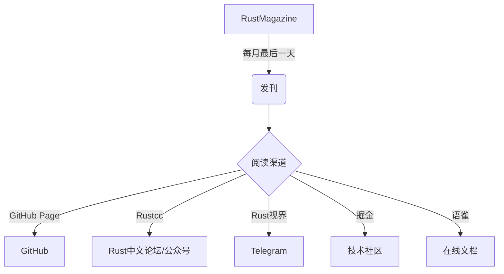

# 二月发刊通告

时光易逝，转眼二月即将过去，春暖花开的三月即将到来。过年的余味犹在，但我们不得不继续踏上征途。

《 RustMagazine 中文月刊 》期待大家投稿。

### 本刊 mdbook 模版功能改进

**mdbook 模版功能新增：**

- 增加评论功能。评论会自动同步到 RustMagazine GitHub 仓库 与文章同名的 issues 下（文章下有评论就自动创建）。
- 增加画图功能。利用 mermaid 来画图。参考：[mermaid 在线使用指南](https://mermaid-js.github.io/mermaid-live-editor/)。

画图示例：

欢迎大家直接使用本刊 mdbook 模版进行创作投稿发PR！

### 上期（一月刊）访问数据统计小结

**浏览量：**

- 网页浏览量 ：3,678
- 唯一身份浏览量 ：2,889

**读者访问最多时段：**

- 每天上午 8点 到 下午 6点。
- 周四 和 周五 阅读量相对更多。

**读者分布地区排名：**

- 中国
- 北美
- 加拿大
- 澳洲

**一月份比较受欢迎的文章 Top 5（按访问量依次排名）：**

- 《图解 Rust 所有权》，作者：肖猛
- 《用 Rust 写操作系统 | rCore 教程介绍》，作者：清华大学
- 《RustChinaConf2020 精选 | Rust 异步开发》，作者：赖智超
- 《关于 io_uring 与 Rust 的思考》，作者：王徐旸
- 《图解 Rust 编译器 | Part 1》，作者：张汉东

阅读量最低为：

- 《Rust 生态安全漏洞总结系列 | Part 1》，作者：张汉东 
- 《Rustc Dev Guide 中文翻译启动》，作者：张汉东

**简报关注分类依次为：**

- Rust 官方动态
- 学习资源
- 推荐项目
- 社区热点
- Rust 唠嗑室

**读者阅读渠道依次为：**

- 直接访问
- GitHub
- 百度
- ⾕歌
- rustcc
- 其他

