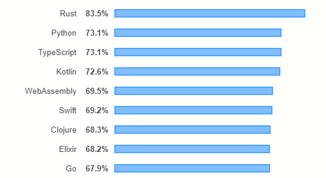
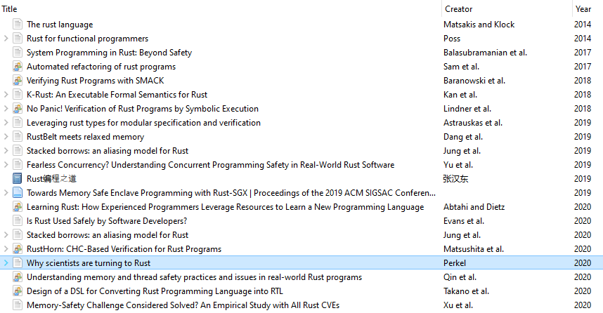
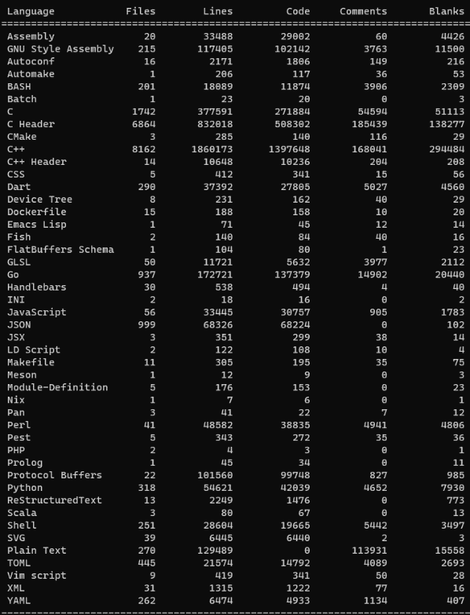
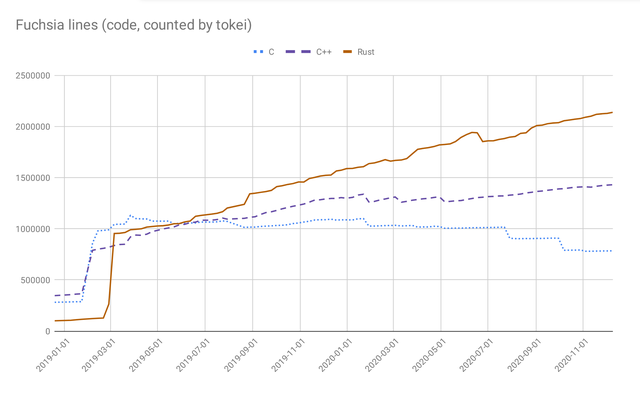
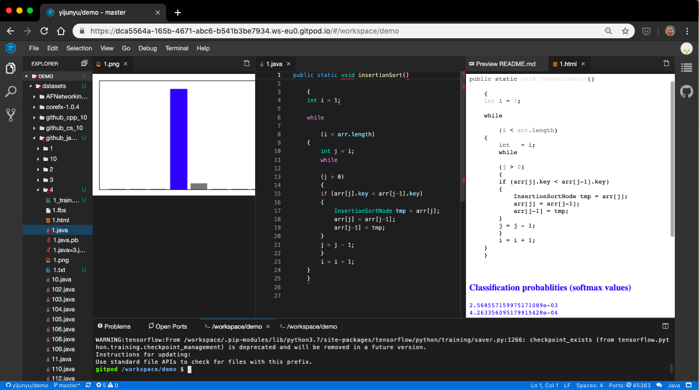

# 华为 | 可信编程 -- 华为引领Rust语言开发的实践和愿景

作者：（俞一峻、Amanieu d'Antras、Nghi D. Q. Bui） / 后期编辑：张汉东

---

## 本文结构

- 可信编程 -- 华为引领 Rust 语言开发的实践和愿景
    - Rust带来的创新
    - Rust在华为的初步推进
    - 华为对 Rust 社区的贡献
    - 配置华为的端到端 Rust 工具链
        - tokei
        - cargo-geiger
    - 通过深度代码学习研究 Rust
    - 结论


## Rust带来的创新

StackOverflow 的调查表明, 自 2015 年以来，Rust 一直是开发者最爱的编程语言。



学术界对于Rust也越来越重视，在编程语言和软件工程顶会上发表的关于Rust的论文正逐年增加。



不仅如此，《自然》杂志2020年尾的文章《Why Scientists are Turning to Rust》中也强调：科学家极为推崇Rust。


## Rust在华为的初步推进

华为的目标是引领通信系统软件向安全可信演进，其中 Rust 语言正在发挥很大的作用。

例如，我们希望通过部分 C/C++ 代码的迁移，在保证高性能的同时，拥有更高的安全性。在此过程中， 我们为开发者提供一套自动化工具支持：基于开源的 C2Rust 转译工具， 首先从 C 代码生成 Rust 代码, 然后通过源到源变换工具自动重构。

在华为内部我们还基于 Actor 的并发编程模式开发了 Rust 库，方便程序员充分利用 Rust的语言特性, 例如`async/await`等。

以华为代表的通信系统软件的开发以 C/C++ 代码为主, 这些 Rust 库将使 C/C++ 到 Rust 的迁移更加顺畅。 作为业界领先公司和 Rust基金会 的创始成员，华为致力于 Rust 在通信软件行业，并将持续为 Rust 社区做出贡献。

## 华为对Rust社区的贡献

我们为 Rust 社区贡献了许多重要的功能特性。例如，我们最近为 Rust 编译器提交了一系列代码，使得 Rust 编译目标可以支持`ARM AArch64 32`位大端变体[ILP32](https://developer.arm.com/documentation/dai0490/latest/)芯片组, 用于我们的通信产品中。 这些改进使得我们和友商可以在这些常用网络硬件架构上执行Rust 原生程序。这些代码已经通过我们的 Rust 专家`Amanieu d'Antras` 提交给了 [LLVM 编译器](https://reviews.llvm.org/rG21bfd068b32ece1c6fbc912208e7cd1782a8c3fc), [libc 库](https://github.com/rust-lang/libc/pull/2039), 以及 [Rust 编译器](https://github.com/rust-lang/rust/pull/81455)等开源社区。

这些对 Rust 编译器的更改引入了新的端到端交叉编译目标，针对定制硬件构建 Rust 产品变得更容易,只需要简单的命令，比如：

```rust
cargo build --target aarch64_be-unknown-linux-gnu
cargo build --target aarch64-unknown-linux-gnu_ilp32
cargo build --target aarch64_be-unknown-linux-gnu_ilp32
```

华为在中国 Rust 社区方面也走在前列，战略支持 12月26日至27日 在 深圳 举办了[第一届 Rust China Conf 大会](https://2020conf.rustcc.cn/)，并推行多项 社区活动，包括为中国的开发者提供 Rust教程 和 Rust编码规范。

## 配置华为的端到端Rust工具链

Rust社区中有几种端到端的工具，我们已经开始从开发人员和工具的交互中获取信息。

这里有一些例子:

**tokei**

由于可信编程项目通常涉及多个编程语言，我们采用了tokei作为多语言代码复杂性度量工具，识别多达200种编程语言。例如，开源的 Fuchhia 项目涉及了多种编程语言，下面的统计信息显示有多少行不同语种的代码：



C、C++、Rust 代码在 Fuchhia 项目的占比，可以绘制成如下演进图：




为了在大型项目中满足处理多种编程语言的场景需求，我们提交代码到tokei支持识别编程语言的批处理。

**cargo-geiger**

为了提高安全性，我们经常想知道有多少代码已经被 Rust 编译器检查过。幸运的是，通过统计"Unsafe"项目，如`fn`、`expr`，`struct`、`impl`、`trait`及其在各相关库实现中的出现次数， [cargo-geiger](https://github.com/rust-secure-code/cargo-geiger)几乎做到了这点。


不过，统计数字中并没有反映安全性，所以没办法展现Rust项目总体上取得了多少进展的比例。因此，我们 提交了[代码](https://github.com/rust-secure-code/cargo-geiger/pull/167)，在改进的 cargo-geiger 计数器报告中提供 Rust 项目的安全检查比率。这个代码采纳后，我们的产品团队现在每天定期都在使用这个工具，一份典型的报告能够更容易理解哪些代码库还没被 Rust 编译器完全检查到。


## 通过深度代码学习研究 Rust

随着 Rust 开源社区代码的发展和革新，初学者需要学习掌握Rust最佳的实践，其包括但不限于 Rust 语言本身。把统计机器学习的方法应用到源代码数据上，也称为[大代码](https://arxiv.org/abs/1709.06182)，正被全世界的软件工程研究团队关注：类似于 图像处理和自然语言处理中的机器学习问题，这些问题都需要通过深度神经网络(deep neural networks DNN)提取大量的特征，Big Code 可能同样需要去训练DNN来反映程序的统计特性，所以也称为"深度代码学习"。

在这方面，华为与[英国开放大学](https://mcs.open.ac.uk/yy66)和[新加坡管理大学](http://www.mysmu.edu/faculty/lxjiang/)进行技术合作，在现在最先进的“跨语言”深度代码学习基础上进行优化研究。

例如，最初的深度代码学习方法应用于北京大学编程课程收集到的104个算法类的5.2万个C/C++程序。对此数据集，树基卷积神经网络(TBCNN)算法分类准确率达到94%([AAAI'16](https://github.com/bdqnghi/tbcnn.tensorflow))。最近的 SOTA 在语句级使用抽象语法树 ([ICSE '19](https://github.com/zhangj111/astnn))准确率达到98%。近期我们同英国开放大学和新加坡管理大学在树基胶囊网络的合作研究进展推动了SOTA进一步提高，达到98.4%的准确率([AAAI'21](https://arxiv.org/abs/2009.09777))。

早些时候我们已经使用跨语言的数据集表明，对一种编程语言的深度代码学习模型也适用于另一种编程语言。例如，从GitHub 爬取的数据集 Rosetta Code，从 Java 到 C 语言，可以获得86%的算法分类准确度 ([SANER'19](https://github.com/bdqnghi/bi-tbcnn))，在Java到C#的跨语言API映射 问题也能发挥重要作用(ESEC/FSE'19)。这些统计语言模型在软件工程中可以应用于很多方面，比如代码分类、代码搜索、代码推荐、代码摘要、方法名称预测、代码克隆检测等等([ICSE'21](https://github.com/bdqnghi/infercode))。

为了进一步研究分析 Rust 项目，我们向 Rust 解析器项目`tree-sitter`和 XML序列化 `quick-xml`等项目提交了代码，通过 Rust 程序的抽象语法树来训练深度代码学习模型。研究的初步结果很有希望，算法检测任务在 Rust代码上的精度高达85.5%。随着工具链的改进，这个比例还有望进一步提升。

在 IDE 上的原型是在`Visual Studio Code IDE`上，我们开发扩展插件，使得程序员可以得到合适的算法推荐和可解释性的帮助。



## 结论

综上所述，华为可信开源软件工程实验室正在开展的 Rust 工作为程序员提供智能化端到端 IDE 工具链，以期最大限度地提高代码的安全性和性能。走向可信编程远景的旅程刚刚开始，我们希望与 Rust社区 和 Rust基金会深度合作，引领电信软件产业的可信革新。

---

作者简介：

俞一峻：
可信编程首席专家/华为可信软件工程开源实验室/华为爱尔兰研究所

Amanieu d'Antras:
可信编程首席专家/华为可信软件工程开源实验室/华为爱尔兰研究所

Nghi D. Q. Bui:
可信编程首席专家/华为可信软件工程开源实验室/华为爱尔兰研究所