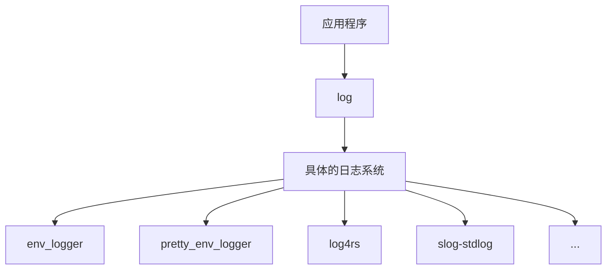

# Rust中的错误传递和日志记录

作者：楼智豪 / 后期编辑：张汉东

---

## 简介以及背景

在Rust代码的编写过程中，开发者也需要关注错误处理和日志记录的过程，程序能够及时反馈信息，保证程序的正常运行。
本文分两部分，第一部分讲述如何进行错误传递和处理，第二部分讲述应该如何记录日志。

## 错误处理

以前在使用C进行错误处理时，通常采用的是函数传递错误码的方式，而对于Rust而言这种方式显得有些古老。

首先，Rust当中的错误处理基于两个特性，Result和Error。

```rust
pub enum Result<T, E> {
    /// Contains the success value
    Ok(T),
    /// Contains the error value
    Err(E),
}
```

Result是Rust提供的一个枚举类，它里面应当包含，程序成功运行时返回的值T，或者是程序运行失败时返回的错误类型E。如果一个函数，它的返回值是一个Result，那么就表明，它有可能失败并返回一个错误类型，需要我们来处理这个Result。

Rust在标准库中提供了一个trait，`sdt::error::Error`，目前错误处理都是基于这个trait来进行，一个结构体/枚举如果实现了这个trait，那么我们认为，它就是一个错误类型。

```rust
//为自定义的结构体实现Error的trait，该trait要求同时实现Display和Debug
//Error tarit包含多个方法，但通常情况下impl的时候除了source方法其他无需重写
pub trait Error: Debug + Display {
    //如果该错误类型中包含了底层的错误Err，那么source方法应该返回Some(err),如果没有返回None。不重写则默认为None
    fn source(&self) -> Option<&(dyn Error + 'static)>;
    //type_id()：该方法被隐藏
    fn type_id(&self, _: private::Internal) -> TypeId;
    //backtrace()：返回发生此错误的堆栈追溯，目前为unstable，默认禁用，且占用大量内存，性能很差
    fn backtrace(&self) -> Option<&Backtrace>;
    //description()：已废弃，改使用Display
    fn description(&self) -> &str;
    //cause()：已废弃，改使用source()
    fn cause(&self) -> Option<&dyn Error>;
}
```

错误传递的背景在于，在开发过程中，可能各个模块自身都定义了一个错误类型，那么当这些模块需要一起使用时，不同错误类型的结构体应该如何转换和处理，如何传递。

### 方式一：自定义错误类型

* 自定义错误类型，并且通过From trait进行转换
* 用 `?`来传递错误，自动执行类型转换

```rust
impl Error for MyError {

}

/// MyError属于当前自定义的枚举，其中包含了多种错误类型
/// MyError也包含了从下层传递而来的错误类型，统一归纳
#[derive(Debug)]
pub enum MyError {
    BadSchema(String, String, String),
    IO(io::Error),
    Read,
    Receive,
    Send,
}

//实现Display
impl fmt::Display for MyError {
    fn fmt(&self, f: &mut fmt::Formatter) -> fmt::Result {
        match self {
            MyError::BadSchema(s1, s2, s3) => {
                write!(f, "BadSchema Error:{}, {}, {}", s1, s2, s3)
            }
            MyError::IO(e) => {
                write!(f, "IO Error: {}", e)
            }
            MyError::Read => {
                write!(f, "Read Error")
            }
            MyError::Receive => {
                write!(f, "Receive Error")
            }
            MyError::Send => {
                write!(f, "Send Error")
            }
        }
    }
}
```

在定义MyError时，其中包括了多种错误类型，有当前模块产生的错误（比如Read, Receive, Send），也有从下层模块传递上来的错误，比如IO(io::Error)，针对从下层传递而来的这种错误，我们需要将它归纳到自己的MyError中，统一传递给上层。为了实现这个目的，我们就需要实现From 方法，当我们为一个错误类型的转换实现了From方法，就可以使用`?`来进行自动转换。如下所示

```rust
impl From<io::Error> for MyError {
    fn from(err: io::Error) -> MyError {
        MyError::IO(err)
    }
}
```

```rust
//这两个示例是相同的
fn test_error() -> Result<i32, MyError> {
    let s = std::fs::read_to_string("test123.txt")?;
    Ok(s)
}

fn test_error2() -> Result<String, MyError> {
    let s = match std::fs::read_to_string("test123.txt") {
        Ok(s)=>{
            s
        }
        Err(e)=>{
            return Err(MyError::from(e));
        }
    };
    Ok(s)
}
```

注意在示例一当中`?`的作用，它等效于示例二中的match，意思是

- 该函数的返回值是一个`Result<T,Error>`，需要进行处理。

- 如果该函数运行正确，那么返回T，上述的示例中返回String

- 如果该函数运行失败，返回了一个错误类型Error，这里返回了io::Error， 并且因为我们实现了From方法，io::Error被自动转换成了MyError::IO(io::Error)，然后程序在此处直接return，不再继续往下走。

  

  注意From的类型转换是通过`?`来隐式调用的，如果不使用`?`而是直接return一个错误，它是不会自动进行类型转换的。


### 方式二 ： 使用trait Object传递错误

* 不定义自己的类型，而直接使用 `Box<dyn Error>` 来统一错误类型。

* 用 `?`来传递错误，自动把Error转换成 `Box<dyn Error>` 

```rust
fn test_error() -> Result<i32, Box<dyn Error>> {
    let s = std::fs::read_to_string("test123.txt")?;
    let n = s.trim().parse::<i32>()?;
    Ok(n)
}
```
在上面这个示例中，可以看到，我们返回了一个Box<dyn Error>，他是一个trait Object，意思是泛指一个具有Error trait的结构体/枚举类型。我们之所以可以这么写，其实是因为Rust本身为Box<dyn Error>实现了From方法，所以可以实现自动转换。

上述代码中，第一行和第二行分别返回了io:Error和ParseIntError，都可以被转换成Box<dyn Error>。这种方式的好处在于开发者不用再一个个地去定义错误类型，编写From方法，坏处在于丢失了具体的错误类型的信息，如果要对于不同的错误类型进行不同处理，就会遇到麻烦。

虽然Rust提供的downcast方法可以将Box<dyn Error>重新还原成具体的结构体，但是`e.downcast::<MyError>();`这种形式的调用也还是需要预先知道结构体类型，所以使用起来还是有困难。

### 对比

| 方式            | 优点                                                         | 缺点                                                         |
| --------------- | ------------------------------------------------------------ | ------------------------------------------------------------ |
| 自定义错误类型  | 可以统一错误类型，方便上层用户对不同的错误类型采取不同的措施 | 需要进行各式的类型转换，较为繁琐                             |
| Box\<dyn Error> | Error可以直接透传，不需要在乎具体的类型                      | 丢失了结构体类型信息，但是也可以通过downcast把trait object转换回具体的结构体 |

结论：综合以上两种方式的优缺点以及各方给出的意见，得出结论如下

* 如果是编写一个库，那么最好采取方式一，因为我们需要给上层用户传递具体的错误类型，来方便他们进行处理。
* 如果是编写一个完整的应用程序，所有错误都在自身内部进行处理了，不需要传递给其他人，那么可以考虑采取方式二

### 其他：第三方库

### anyhow ：专门为错误处理设计的第三方库

```rust
use anyhow::Result;

fn get_cluster_info() -> Result<ClusterMap> {
    //从std::io::Error转换成了anyhow::Error
    let config = std::fs::read_to_string("cluster.json")?;
    let map: ClusterMap = serde_json::from_str(&config)?;
    Ok(map)
}

```

```rust
match root_cause.downcast_ref::<DataStoreError>() {
    //从anyhow::Error转换成自定义的DataStoreError
    Some(DataStoreError::Censored) => Ok(),
    None => Err(error),
}
```

anyhow这个库可以把用户自定义的，所有实现了`std::Error trait`的结构体，统一转换成它定义的`anyhow::Error`。这样用户在传递错误的过程中就使用的是统一的一个结构体，不用自定义各种各样的错误。

论用法，其实anyhow和第二种trait Object方法是类似的，但是有几点不同

* `anyhow::Error` 的错误是`Send`, `Sync` 和 `'static`的
* `anyhow::Error` 保证`backtrace`方法可用，即便你的底层Error没有提供`backtrace`
* `anyhow::Error`是一个机器字长，而`Box<dyn Error>`是两个机器字长

### thiserror ：提供便捷的派生宏的第三方库

前面有提到，一个自定义的MyError结构体，需要实现很多内容，Error trait，Display，Debug以及各种From函数，手动编写可能较为麻烦，而thiserror这个库则提供了过程宏来简化这个过程

```rust
use thiserror::Error;

#[derive(Error, Debug)]
pub enum DataStoreError {
    #[error("data store disconnected")]
    Disconnect(#[from] io::Error),
    #[error("the data for key `{0}` is not available")]
    Redaction(String),
    #[error("invalid header (expected {expected:?}, found {found:?})")]
    InvalidHeader {
        expected: String,
        found: String,
    },
    #[error("unknown data store error")]
    Unknown,
    #[error("Utf data store error")]
    Utf{
        #[from]
        source: Utf8Error,
        backtrace: Backtrace
    },
    #[error(transparent)]
    Other(#[from] anyhow::Error)
}
```

* 在我们自定义的结构体前加上`#[derive(Error)]`，就可以自动impl Error

* `#[error("invalid header (expected {expected:?}, found {found:?})")]`这条语句代表如何实现Display，后面的字符串就代表Display会输出的字符，同时支持格式化参数，比如这条语句里的expected就是代表结构体里面的元素。如果是元组则可以通过`.0`或者`.1`的方式来表示元素

* `#[from]`表示会自动实现From方法，将对应的子错误进行转换

  * `#[from]`有两种写法，第一种就是`Disconnect(#[from] io::Error)`这样，自动将`io::Error`转换成`DataStoreError::Disconnect`，简单的结构体嵌套
  * 第二种写法是`Utf { #[from] source: Utf8Error, backtrace: Backtrace }`这种，这种格式有且只能有两个字段，`source`和`backtrace`，不能有其他字段。它会自动将`Utf8Error`转换成`DtaStoreError::Utf`，并且自动捕获原错误中的`backtrace`方法

* `#[source]`表示将这个结构体字段的值作为`source`方法的返回值，如果字段本身的名称就是`source`的话就不用加`#[source]`而会自动应用。而`backtrace`方法则会自动寻找结构体里类型为`std::backtrace::Backtrace`的字段来作为返回值。

  ```rust
  #[derive(Error, Debug)]
  pub struct MyError {
      msg: String,
      #[source]  // optional if field name is `source`
      source: anyhow::Error,
      backtrace: Backtrace,  // automatically detected
  }
  ```

* `#[error(transparent)]`表示将源错误的`source`方法和`Display`方法不加修改直接应用到`DataStoreError::Other`

## 日志记录

### [log库](https://crates.io/crates/log)

```rust
error!(target: "yak_events", "Commencing yak shaving for {:?}", yak);
// target默认为当前crate的名称
warn!( "hello world");
info!( "hello world");
debug!( "hello world");
trace!( "hello world");
```

* 记录当前crate的名字、文件名路径、行号、文本信息

**日志门面库**

通过定义统一的接口，使用统一的日志记录方式，可以在多个日志框架中灵活切换，可以让开发者不必关心底层的日志系统。如果你是Rust库的开发者，自然不期望自己的框架绑定某个具体日志库，而是只使用log门面日志库，由使用者自行决定日志库。



```rust
struct SimpleLogger {};

impl log::Log for SimpleLogger {};

log::set_logger(SimpleLogger);
```

使用方式：调用set_logger方法绑定底层的日志系统，然后用户只需调用error!、log!这几个宏，其余的如何写入日志的问题则交给系统自己去做。

### 开源库如何记录日志

下面列出了一些开源库使用了什么日志工具，以及它们是如何记录日志的。
	
可以得到结论，绝大部分开源库都在使用log这个日志门面库，而且日志记录的方式，通常是直接写入字符串信息，以及调用Error的Display方法进行写入。

* [ivanceras / diwata](https://github.com/ivanceras/diwata) —用于PostgreSQL的数据库管理工具 ： 使用log库

  ```rust
  debug!("ERROR: {} ({})", msg, status);
  ```

* [habitat](https://community.chef.io/products/chef-habitat/)—由[Chef](https://www.chef.io/)创建的用于构建，部署和管理应用程序的工具：使用log库

  ```rust
    match server::run(args) {
        Err(err) => {
            error!("Launcher exiting with 1 due to err: {}", err);
            process::exit(1);
        }
        Ok(code) => {
            let level = if code == 0 { Level::Info } else { Level::Error };
            log!(level, "Launcher exiting with code {}", code);
            process::exit(code);
        }
    } 
  ```

* [kytan](https://github.com/changlan/kytan) —高性能对等VPN ：使用log库

  ```rust
  warn!("Invalid message {:?} from {}", msg, addr);
  ```


* [Servo](https://github.com/servo/servo) —原型Web浏览器引擎 :  使用log库和gstreamer库

  ```rust
  gst_element_error!(src, CoreError::Failed, ["Failed to get memory"]);
  // 引用C动态库，采取错误码方式传递u32
  ```

* [wezterm](https://github.com/wez/wezterm) — GPU加速的跨平台终端仿真器和多路复用器 ：使用log库

  ```rust
  log::error!("not an ioerror in stream_decode: {:?}", err);
  ```

* [nicohman / eidolon](https://github.com/nicohman/eidolon) —适用于linux和macosx的无Steam和drm的游戏注册表和启动器：使用log库

  ```rust
  error!("Could not remove game. Error: {}", res.err().unwrap());
  ```

* [Mio](https://github.com/tokio-rs/mio) - Mio是一个用于Rust的，快速的底层I/O库：使用log库

  ```rust
  if let Err(err) = syscall!(close(self.kq)) {
              error!("error closing kqueue: {}", err);
          }
  ```

* [Alacritty](https://github.com/alacritty/alacritty) —跨平台，GPU增强的终端仿真器：使用log库 

  ```rust
  if let Err(err) = run(window_event_loop, config, options) {
          error!("Alacritty encountered an unrecoverable error:\n\n\t{}\n", err);
          std::process::exit(1);
      }
  ```
* 最后，关于Error的Display方法具体应当输出什么内容，这里可以参考`std::io::Error`的内容（这里的`io::Error`并不是一个trait，而是一个实现了`std::error::Error`的trait的具体类型，是一个结构体）
  ```rust
  impl ErrorKind {
    pub(crate) fn as_str(&self) -> &'static str {
        match *self {
            ErrorKind::NotFound => "entity not found",
            ErrorKind::PermissionDenied => "permission denied",
            ErrorKind::ConnectionRefused => "connection refused",
            ErrorKind::ConnectionReset => "connection reset",
            ErrorKind::ConnectionAborted => "connection aborted",
            ErrorKind::NotConnected => "not connected",
            ErrorKind::AddrInUse => "address in use",
            ErrorKind::AddrNotAvailable => "address not available",
            ErrorKind::BrokenPipe => "broken pipe",
            ErrorKind::AlreadyExists => "entity already exists",
            ErrorKind::WouldBlock => "operation would block",
            ErrorKind::InvalidInput => "invalid input parameter",
            ErrorKind::InvalidData => "invalid data",
            ErrorKind::TimedOut => "timed out",
            ErrorKind::WriteZero => "write zero",
            ErrorKind::Interrupted => "operation interrupted",
            ErrorKind::Other => "other os error",
            ErrorKind::UnexpectedEof => "unexpected end of file",
        }
    }
  }
  ```
  

### slog库：结构化日志

这里还要提到一个库，slog，意为structured log，结构化日志。前面提到的日志都是非结构化日志，直接记录一段话，没有具体的格式。如果程序的日志数量比较小，那么非结构化日志是可以满足要求的，如果日志的数量很大，那么非结构化的日志就会带来诸多问题，就比如，格式多种多样，难以进行查询和解析。

何为结构化日志，就是具有明确具体结构的日志记录形式，最主要的是具有key-value的键值对的形式，典型的是使用json来记录日志，一个json条目就是一条日记，每个字段就是一个键值对。

```rust
debug!(log, "Here is message"; key1 => value1, key2 => value2);
```

```json
//传统的非结构化日志
DEBUG 2018-02-05 02:00:45.541 [file:src/main.rs][line:43] CPU OVerload in location 100,ThreadId is 123456,MemoryUsage is 0,ThreadId is 234567,MemoryUsage is 0

//结构化日志
{
    "Timestamp": "2018-02-05 02:00:45.541",
    "Severity": "Debug",
    "File": "src/main.rs",
    "Line": "43",
    "Message": "Memory overflow",
    "Info": {
        "ThreadId": "123456",
        "MemoryUsage": "0",
        "ThreadId": "234567",
        "MemoryUsage": "0",
    }
}
```

日志是维测能力的一个重要方面，也是调试的重要工具。 传统上非结构化的字符串，很难进行后续的二次分析，日志的相关处理也很麻烦。目前结构化日志日趋流行，使用结构化日志，使日志文件具有机器可读性和更高级的功能，以易于解析的结构化格式编写日志文件。这意味着日志分析工具可以轻松地获取结构化日志数据，这也使处理和查询日志更容易，并且分析日志更快，针对特定的条目进行过滤和跟踪分析。

非结构化的日志查询，往往就是搜索关键字，速度慢，准确性差，容易查询出其他不相关的内容，效率低下。而目前的许多json分析工具，支持使用sql语言对条目进行查询；[Google Cloud](https://cloud.google.com/logging/docs/view/logs-viewer-interface)的提供的结构化日志的服务还内置了日志解析工具，提供图形化界面解析日志，定义了日志查询语言来进行查询。

最后，结构化日志可以帮助降低日志的存储成本，因为大多数存储系统上，结构化的键值数据比非结构化的字符串有更高的压缩率。

* * *

作者：楼智豪 

任职于华为技术有限公司嵌入式软件能力中心，本文章仅代表作者个人观点，不代表公司意见。


* * *


