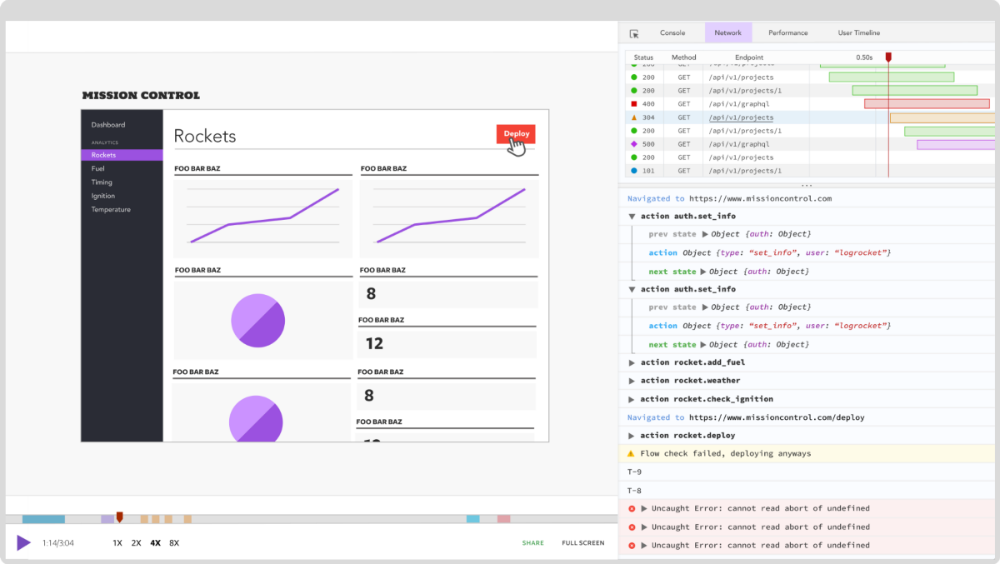

# 「译」Unsafe Rust 的取舍

译者： （ [MATRIXKOO](https://github.com/MATRIXKOO) 和 [NiZerin](https://github.com/NiZerin) ） / 后期编辑： 张汉东

> 原文：[Unsafe Rust: How and when (not) to use it](https://blog.logrocket.com/unsafe-rust-how-and-when-not-to-use-it/)

---

## 在本中，我将说明您需要了解的有关`unsafe Rust`的所有信息。我将专注于以下几个方面来讲解。

- 有关于`unsafe Rust`代码的误解
- 什么时候不使用`unsafe`代码
- 处理未初始化的内存
- 不可处理的异常
- 内在机制
- 内联汇编
- 接口外部功能
- 编写`unsafe Rust`代码的工具

## 关于`unsafe Rust`代码的几个误解

在解释如何以及何时使用`unsafe Rust`（或不使用）之前，我想先说明一些关于 Rust 中不安全代码的常见误解。

###误解1：所有 Rust 代码都不安全
不是的。
区别是微妙的，但是安全的 Rust 代码不能违反安全保证，只要编译器和它所构建的不安全代码都没有任何允许这种情况发生的bug。
因此，与其他低级语言不同，在其他低级语言中，代码的安全性取决于每一行代码和编译器实现，您可以显著减少需要审核错误的攻击面。

[RustBelt](https://plv.mpi-sws.org/rustbelt/) 项目从数学上证明，如果你有一部分安全代码和一部分不安全代码来保护它的不变量，那么只要不安全代码不允许，安全代码就不能破坏保证。

顺便说一句，不变量是一种条件，它不会被某一类型的所有方法或模块的所有函数改变。

从统计上讲，在 Crates.io 上发现的 Rust 代码中，只有不到1%是不安全的代码-这可能不到现有代码的50%，但仍然应该是一个足够有代表性的样本-而且许多项目里没有任何不安全的代码行。

### 误解2：它依赖于标准库代码，其中包含许多不安全因素
是的，标准库有比普通项目更多的不安全代码，这是意料之中的，因为它提供的许多抽象不能在`Safe Rust`中有效地实现，或者根本不能实现。
此外，我们可以放心，标准库已经收到了更多的审查，因此比您的项目更值得信赖。

这并不是说它是完美的-毕竟，过去也发现了很多错误。
尽管如此，在验证和模糊标准库的大部分方面还是做了很好的工作，这使得所有的 Rust 代码都更加安全。

### 误解3：一旦我们编写了 `unsafe` 代码，就感觉打开了地狱之门
不是的。 [Rustonomicon](https://doc.rust-lang.org/nomicon/what-unsafe-does.html) 仔细地列出了不安全代码授予您的额外权限，以换取您保证维护该部分代码中的安全常量。
例如，您可以：
- 取消引用原始指针
- 调用`unsafe`函数(包括C函数、编译器内部函数和原始分配器)
- 实现`unsafe`traits
- 改变静态变量
- 访问联合体内的成员
  

然而，即使是那些看起来可能是安全的代码，也可能会产生你应该注意的后果：

- 原始指针不能保证指向它们声称要指向的数据的有效实例，因此取消对它们的引用可能会导致空域(很可能是分段错误)，或者更糟糕的是，会导致类型混乱，在这种情况下，您破坏了数据，破坏了程序的状态，可能会造成不利的影响。
- 调用`unsafe`函数有使用不符合其安全要求的参数调用它们的风险，这可能会造成可利用的漏洞。
- 为未能维护其不变式的类型实现`unsafe` traits 还可能导致调用方无意中导致其安全要求失败，并可能造成不利的影响。
- 在另一个线程中观察静态变量时对其进行改变可能会导致数据竞争和读取异常，这意味着读取的值不再需要与旧值或新值相关。
  根据读取的类型和使用方式的不同，这也可能导致未定义的行为，可能会造成不利的影响。
- 访问联合体的字段可能会让您将数据解释为它们不表示有效实例的类型，或者观察未初始化的数据(如果类型的长度不同，一个字段可以包括另一个字段的填充)，这两种情况都会导致未定义的行为和可能被利用的漏洞。  

因此，尽管不安全代码并不像某些人所说的那样可怕，但需要小心安全地处理它。
然后，您可以在不安全代码的基础上编写安全代码。

### 误解4：只要不会有人意外地使用参数调用我的安全代码，从而导致下面的不安全代码失败，我就没问题
不是的。
一旦您在不安全的代码之上提供了一个安全接口，您的代码要么无论如何都会维护安全常量，要么您的代码是不健全的。

有些人对不健全的感觉非常强烈，没有理由大发雷霆。
这仍然是一个错误，你应该公开和冷静地解决它。
如果错误可以通过更仔细的设计来解决，那就去做吧。
同时，您可以公开声明您的代码不健全，用户需要格外小心，以免违反安全常量。
如果你想出了一个合理的设计，就把所有发布的不完善的版本都撤回，并报告漏洞。

### 误解5：我试过运行它，它运行得很好
未定义行为的问题不在于它会直接失败。
事实上，它可能永远不会失败。
在您将代码投入生产之前，它也可能一直正常工作，在这一点上，它可能会灾难性地失败。
或者，它可能会起作用，直到黑客尝试它，并手工制作正确的输入，以破解您的不健全的代码。
现在，您的所有用户都在其PC上安装了密码勒索特洛伊木马程序。

即使多次运行它，也不能保证下一次就能正常工作。
正如哥伦比亚号航天飞机灾难所显示的那样，仅仅因为它成功了135次并不意味着它在第136次尝试中就不会失败。

###但如果这只发生在内存泄漏时呢？
内存泄漏无法可靠地避免，并且本身不会对内存安全构成任何危险-尽管操作系统可能会停止您的程序，或者在您耗尽可用内存时简单地崩溃，但这在最坏的情况下会导致拒绝服务。
因此，它被认为超出了内存安全保障的范围，`mem：：forget`成为一个安全函数。
如果您的代码依赖于一些不泄漏的值来保证安全性，那么在某些时候，泄漏可能就会发生，安全保证的损失将由您承担。

请注意，这个误解是如此常见，直到Rust1.0之后，它才最终允许安全代码泄漏。
这种不安全来源的解决方案通常是泄漏放大-在尝试不安全操作之前，泄漏所有可能由泄漏导致的可观察到的损坏状态，然后将所有东西重新组合在一起。
这样，泄漏会变得更大，有时甚至更大，但至少不会破坏内存安全。

### 好的，我明白了。 一旦我的项目中有一行不安全的代码，所有其他代码都必须小心，以免违反安全规则

因此，通常的做法是在模块中创建不安全的代码。
这通常不打算从外部使用，但有时它可以是公开的，因为如果人们想要承担随后的责任以换取性能(或其他东西)，他们可能会在代码中使用不安全的方法。

下一步是编写另一个模块，该模块将使用前面提到的不安全代码提供安全接口。
这个模块应该是允许所有其他用例的最低抽象，如果您愿意的话，它是核心功能。
省略所有可以通过构建此安全代码来实现的内容。
这是需要仔细审核的部分。

最后，在您的安全API之上编写您想让人们使用的实际接口。
因为您处于安全的 Rust 区域，所以这段代码不需要太多关注。
如果您在核心接口实现上做得很好，编译器将维护其所有保证。

既然我们已经消除了与`unsafe` Rust 代码相关的误解，在进入实际代码之前，我们只有一件事要讨论。

## 什么时候不该用 `unsafe`


通常, `unsafe` 实际上是在追求性能的过程中使用的。但是，正如我在 [How to write CRaP Rust code](https://blog.logrocket.com/how-to-write-crap-rust-code) 中所写的那样，即使只是作为要测试的快照和作为基准进行基准测试，也应该始终运行较慢但是安全的版本。

只是因为使用 `unsafe` 的代码有时可以更快，并不意味着一定要这样做。合理的评估情况, 在保持原有速度或者更快的时候, 就应该继续使用 `safe` 版本的代码。

例如，在尝试加快 [Benchmark Game](https://benchmarksgame-team.pages.debian.net/benchmarksgame/) 条目之一作为练习时，我想通过使用数组而不是 `Vec` 来减少内存分配，这需要一些不安全的代码来处理未初始化的数据。但是，事实证明改用数组的版本要比基于 `Vec` 的版本慢，因为这个我就没继续下去了。克里夫·比佛尔（ Cliff L. Biffle ）在 [Benchmark Game](https://benchmarksgame-team.pages.debian.net/benchmarksgame/) 一书中也谈到了类似的经历。 使用 `unsafe` 不仅会让编译器减少对代码的安全性的保证，也减少了要做的检查,因此实际上可能会禁用某些优化以避免破坏代码。因此，在切换到 `unsafe` 之前，请务必先进行评估，进尽量保持  `safe` 的代码。

好的，让我们开始吧！

### 处理未初始化的内存

当 Rust 版本更新到1.0.0时，标准库有一个 `unsafe` 函数来获取未初始化的内存: `std::mem::uninitialized` (还有 `std::mem::zeroed`（），但是两者之间的唯一区别是 后者将返回的内存区域用0初始化)。

人们普遍认为这是个坏主意，现在该函数已经处于废弃 (`deprecated`) 状态，建议使用`std::mem::MaybeUnit` 类型代替。 未初始化的麻烦的原因是，该值可能会在恐慌 (`panic`)或在之前返回时隐式删除。 例如：

````rust
let x = std::mem::uninitialized();
this_function_may_panic();
mem::forget(x);
````


如果 `this_function_may_panic` 函数实际上 `panic ` 了，则x会在我们调用 `forget` 之前就被 `drop` 。但是，删除未初始化的值是未定义的行为，并且由于删除通常是隐式的，因此很难避免这种情况。因此， `MaybeUninit` 被设计为能够处理潜在的未初始化数据。该类型永远不会自动 `drop` （如 `std::mem::ManuallyDrop` ），编译器知道该类型可能未初始化，并且具有许多函数来正确处理未初始化的数据。

让我们回顾一下。我们可能不会调用 `std::ptr::read` 去读未初始化内存。我们甚至不能引用它（ `&` 或者 `&mut` ），因为引用规则要求引用的值必须是引用类型的有效实例，而未初始化的数据不是这种情况(除了使用 `MaybeUninit<_>` ，因为这显然不需要初始化）。

因此，我们也不应该 `drop`，因为这会创建一个可变的引用（注意，`fn drop(&mut self))` 。我们可以将其转换为其他允许储存未初始化数据的类型( 创建一个未初始化的数组还是最简洁的方法)或用 `std :: ptr :: write`  到从  `as_mut_ptr()` 方法获得的指针，又或者使用 `MaybeUninit` 等等。请注意，即使类型未初始化，我们也可以分配给 `MaybeUninit` ，因为类型不会 `drop` 。

举例来说，假设我们要使用一个函数创建一个值数组。数组的没有实现 `Copy` 或没有const 的 `initializer` ，或者 [LLVM](https://en.wikipedia.org/wiki/LLVM)  由于某种原因无法优化 `double` 。这种时候就用 `unsafe` ：

````rust
use std::mem::{MaybeUninit, transmute};

unsafe {
    // first part: initialize the array. This is one of the rare cases where
    // directly calling `assume_init` is OK, because an array of
    // `MaybeUninit` may contain uninitialized data.
    
    // 第一部分: 初始化这个数组。这种就是几种特殊情况之一，直接
    // 调用 `assume_init` 是可行的,因为 `MaybeUninit` 可以放未初		// 始化数组
    let mut array: [MaybeUninit<MyType>; 256] =
        MaybeUninit::uninit().assume_init();

    // second part: initialize the data. This is safe because we assign
    // to a `MaybeUninit`, which is exempt from `drop`.
    
    //  第二部分: 初始化数据。因为 `Maybeuninit` 避免了 `drop`
    for (i, elem) in array.iter_mut().enumerate() {
        *elem = MaybeUninit::new(calculate_elem(i));
    }

    // third part: transmute to the initialized array. This works because
    // `MaybeUninit<T>` is guaranteed to have the same Layout as `T`.
    
   // 第三部分: 转换成初始化过的数组。这是可行的，因为 `MaybeUninit<T>` 保证了数据填充是和 `T` 一致的
    transmute::<_, [MyType; 256]>(array)
}
````

如果任何 `calculate_elem(_)` 调用失败，则将删除整个 `MaybeUninits` 数组。 因为 `MaybeUninit` 不会 `drop` ，所以现在所有的数据都将泄漏。

为了避免这种情况，我们应该加入额外的移动语义的部分:

````rust
use std::mem::{forget, MaybeUninit, transmute};

// first extra part: We need a "guard" that drops all *initialized* elements
// on drop

// 加入的第一个额外部分: 我们需要一个 "guard"(守护) 来销毁所有初始化过的元素

struct Guard<'a> {
    // a mutable ref to access the array from
    array: &'a mut [MaybeUninit<MyType>; 256],
    // the index until which all elements are initialized
    index: usize,
    // 一个可变引用允许用索引访问,使得所有元素都被初始化
}

impl Drop for Guard<'_> {
    // drop all elements that are initialized
    // 销毁所有被初始化的元素
    fn drop(&mut self) {
        for i in 0..self.index {
            unsafe {
                std::ptr::drop_in_place(self.array[i].as_mut_ptr());
            }
        }
    }
}

unsafe {
    let mut array: [MaybeUninit<MyType>; 256] =
        MaybeUninit::uninit().assume_init();

    // second extra part: here we initialize the guard. From here on, it
    // borrows our array mutably. All access will be done through the guard
    // (because the borrow checker won't let us access `array` directly
    // while it's mutably borrowed).
    
    // 加入的第二个额外部分: 这里我们用 `&mut array` 初始化了 `guard`。
    // (当使用可变借用时，借用检查器并不让我们直接访问数组)
    let mut guard = Guard { array: &mut array, index: 0 };
    for i in 0..256 {
        guard.array[guard.index] = MaybeUninit::new(calculate_elem(i));
        // update the index so `drop` will include the newly created element.
        // 更新索引，使得包含新创建的元素
        guard.index += 1;
    }
    // third extra part: forget the guard to avoid dropping the initialized
    // elements and also end the borrow.
    
    // 加入的第三部分: 调用 `forget` ,销毁 `guard`，防止内存泄漏
    forget(guard);

    transmute::<_, [MyType; 256]>(array)
}
````

如果你认为只是为了初始化数组居然就需要这么多步骤，你是对的。同样，在这一点上，一定要衡量对性能的影响。当然不是和 `Vec <MyType>` 比。

无论如何，这显示了处理未初始化数据的规范方法：标志一个不变量(“在`index` 之前的都应该不可变 ”)，对其进行维护(“写入一个元素后索引增加”)，你可以从中受益——在这种情况下，`panic` 时也不会发生泄漏。

这种方法也适用于其他数据结构，但那里通常使用不同的不变量。例如，`Vec` 在 `resize` 操作前, 将内存拷贝一份放在后备内存里，并将长度设置为零，并在操作完成后将其恢复(发生泄漏时,泄漏的内存其实是比 `vec` 长度要大的)。这确保了 `drop` 不会用在未初始化或已经释放的内存上。

取决于不同的数据机构，这个不变量将变的晦涩难懂。例如，可以使用一个 `bit set` 对初始化的元素进行编码，因此需要比普通数组多八分之一的内存，但允许随机访问任意元素。在这种情况下，将是“初始化和 `bit set` 一一对应”。 Rust的` HashMaps` 基本上是这样做的。

> 译者注:  bit set 其实就是位示图法


### 不可变的转换

Rust关于引用的规则非常严格——在每个给定的时间点可以读取或写入多少变量。 但是有时候我们确实需要稍微改变规则。

为此，Rust为内部可变性提供了一种(显然得用 `unsafe`)类型，它可以使用 `get(＆self)`方法从不可变的借项中获得一个可变的指针(当然不是引用)。 还有一个`get_mut(&mut self)` 的方法，该方法向内容返回可变的借用。

这意味着编译器将假定所有 `UnsafeCell` 中的内容都被引用了。 标准库在顶层提供了许多安全抽象，特别是 `Cell`，`RefCell` ，`RwLock` ，`Mutex` 和各种`Atomic*`类型。

> 译者注: Atomic* 的意思是以Atomic开头的类型 , 这是[正则表达式](https://zh.wikipedia.org/wiki/%E6%AD%A3%E5%88%99%E8%A1%A8%E8%BE%BE%E5%BC%8F)的一种

例如，[AtomicBool](https://doc.rust-lang.org/std/sync/atomic/struct.AtomicBool.html) 的定义如下(为简洁起见删除了注释)：

````rust
pub struct AtomicBool {
    v: UnsafeCell<u8>,
}
````

当然，该实现必须确保避免数据竞争(是指在非线程安全的情况下，多线程对同一个地址空间进行写操作)，通过 LLVM 内部函数使用实际的原子操作来完成的。 我还没有检查即将到来的  [Cranelift](https://github.com/bytecodealliance/cranelift) 后端的功能，但它似乎也有某种类似的实现。 同样，在直接使用 `UnsafeCell` 之前，请检查是否有任何 `safe` 的替代品可用，虽然确定 `unsafe` 是否会给你带来足够的性能提升(或其他好处)。


### 使用CPU的特有指令集

Rust的标准库在`std:: arch` 模块中有按CPU类型分类的固有函数。它们都被定义为 `unsafe` 的，主要是因为它们可能未在你的CPU上实现。 幸运的是，有一种规范的方法可以确保你在编译时或运行时拥有相应的CPU。

假设你以"标准"的方式编写了算法，看了生成的汇编，觉得编译器生成的代码不够好。是时候掏出"屠龙刀"了。 但基本上就是在 Rust 里编写汇编了(因为 `arch` 内部函数是和不同架构一一对应的)。 如上所述，你需要确保用户的平台和你的一致。 以下代码显示了在编译时和运行时检查 CPU是否支持的方法：

````rust
// compile time check 编译时检查
#[cfg(any(target_arch = "x86", target_arch = "x86_64"))]
mod simd {
    fn calculate() -> .. {
        // this is a std library macro that allows us to safely access CPU
        // features by doing runtime detection
        // 这里是标准库的一个宏，通过它我们可用进行CPU的编译器检查
        
        if is_x86_feature_detected!("avx2") {
            // code using avx2 intrinsics here
        } else if is_x86_feature_detected!("sse2")
            // code using sse2 intrinsics here
        } else {
            // code using no special features, using e.g. avx2 intrinsics
            // would be UB!
        }
    }
}

#[cfg(not(any(target_arch = "x86", target_arch = "x86_64")))]
mod simd {
    // fallback code here
}
````

此示例仅具有针对x86和x86_64架构的专用代码，以及各种运行时检测到的CPU功能。 如果你希望程序在其他平台(例如ARM-NEON)上使用SIMD内部函数，则需要添加另一个 `#[cfg]` 声明。不用多说，最后你就得写上不少代码。

除了可用性之外，一些指令还要考虑内存对齐。 为了简化 `bit` ，内存对齐告诉我们有些地址的最后几位必须为零。 例如，一个32位值的对齐方式可能为 `4` ，这意味着其地址的最后两位应为零。 请参阅库文档以获取详细信息，并参考 [上一章]() 以获取适当的帮助。

### 内联汇编

假设你正在编写内核，并且需要使用堆栈指针来处理一些"奇怪"的事情，或者其他不得不需要用汇编的地方。 Rust有两个 `FFI` 接口：一个是C语言，另一个是汇编。 不幸的是，这既不稳定又不安全，所以你就得使用`nightly` 版本来编译`#[feature(asm)]` 和 `unsafe` 的块。 显然，Rust无法检查你在汇编中所做的事情。 使用内联汇编的细节不在本文讨论范围之内。 请查看 [Rust Book chapter](https://doc.rust-lang.org/1.8.0/book/inline-assembly.html)  或者 [RFC text](https://rust-lang.github.io/rfcs/2873-inline-asm.html)。 就本文而言，不需要你熟悉 `FFI` 。

### 与其他语言交互

假如你有非常庞大的 C 代码库，并希望将其移至 Rust，不用多说，这是一项艰巨的任务。你可以先使用外部函数接口来重写代码库的一小部分，然后逐个模块进行重写，直到整个程序都用 Rust 编写，然后你就可以扔掉C了(😀)(顺带一说 [librsvg](https://people.gnome.org/~federico/blog/a-rust-api-for-librsvg.html) 就是这样做的)。或者在 C ++ 中使用 Rust。

无论如何，你都得在安全的，充满温暖的 Rust 世界与艰难而又无情的世界之间架起一座桥梁。既然外面的世界很危险，显然你得用 `unsafe` 与之交互。 首先，请确保你拥有正确的接口，以免你在调试时踩坑。 [bindgen](https://github.com/rust-lang/rust-bindgen)（用于从 Rust 访问 C ）和[cbindgen](https://github.com/eqrion/cbindgen/)（用于从 C 访问 Rust）的工具箱就显得非常有用。 如果你从 C ( 使用C接口的C++ ) 访问 Rust，请注意对象的生命周期，并将Rust对象的生存期保留在Rust代码中-也就是说，让Rust删除它们; 而对于 C 的指针，就让 C 处理它们。众所周知，Rust 有非常特殊的管理生命周期的方法，记住你的需求。

另一方面，如果将 C（(或是C++ 使用了 `extern` ) 包装在Rust中，则会发现 C 库通常还需要考虑数据的生命周期。一旦有了绑定，就尝试考虑类型的生命周期的问题。 unofficial patterns book 有这样一章 [instructive chapter](https://rust-unofficial.github.io/patterns/patterns/ffi-intro.html)  。

如果与 C++ 交互，需要使用 [cxx](https://docs.rs/cxx) 。但是，请注意，与通常的 `bindings generators` 不同，`cxx` 不会用 `unsafe` 标记你的函数 ！我在这里的看法是，绑定机制部分是在 Rust 中构建的，一部分是在 C++ 中构建的，它是否是 `safe` 的，这取决于你审查 C++ 的代码。你可能仍然希望将结果接口包装在一个友好的接口中，并且不会以不安全的方式被滥用。


## 编写 `unsafe rust` 的工具 


正如我们所见，编写 `unsafe` Rust比 `safe` 的 Rust 需要多做许多工作，因为这样将不再依靠编译器检查。 因此，要踏上这条道路，最好先"带上"下面的这些工具：


### Miri

[Miri ](https://github.com/rust-lang/miri)是 `Rustc` 的 MIR (中级中间语言)，这是 Rust 在移交给 `LLVM` 或者`Cranelift`之前用来优化程序的中间表示，是一种解释器。 你可以用 `rustup` 运行 `rustup component add miri` 安装它。 它跑在  `cargo miri` 上-例如，` cargo miri test` 将在解释器中运行测试。 Miri 采用了很多可以检测未定义行为的技术，例如访问未初始化的数据，并会指出问题所在。 但是，它只会在被执行的代码上检测未定义行为，因此不能完整的覆盖代码。 

### Clippy and Rust lints

Rust的官方 lints (静态分析工具) 中有很多对编写 `unsafe`  有帮助的 lint。 至少，missing_safety_docs棉绒将帮助您将所有不安全方法的要求记录在案。 另外，Rust编译器默认情况下不会激活所有棉绒； 致电rustc -W help将显示最新列表。

### Prusti

[Prusti](https://github.com/viperproject/prusti-dev)  仍在开发中（目前在更新到最新的稳定Rust时存在一些问题，因此最新的稳定版本针对某些2018 Rust编译器），但是这个工具非常有前景，可让你在数学上验证给定特定条件的代码的安全性。

基本上，你可以用数学证明代码中某些不变量是 "真的" 保持不变的，这对于必须支持不安全代码的不变量的安全抽象是理想的。 有关更多信息，请参见[用户指南](https://viperproject.github.io/prusti-dev/user-guide/)。


### Fuzzers

[Rust Fuzz Book](https://rust-fuzz.github.io/book/) 列出了许多可与Rust一起使用的 `Fuzzer` (模糊测试器)。目前，可使用的`Fuzzer` 有 [cargo-fuzz/libfuzzer](https://github.com/rust-fuzz/cargo-fuzz) 和 [American Fuzzy Lop / afl.rs](http://lcamtuf.coredump.cx/afl/)的。两者都将为的代码创建大量的测试输入，并运行它以查找触发崩溃的某种组合。

> 译者注: 这个地方的 Fuzzer 是安全测试里面常用的模糊测试工具, 常见的就是上文提到的AFL 。而这种随机生成的测试样例被用于保证代码覆盖率, 每当遇到 crash (崩溃的样例) 并会记录下, 提示此处可能有漏洞。

为了检测未初始化内存的使用，[libdiffuzz](https://github.com/Shnatsel/libdiffuzz)是一个侵入式内存分配器，它将使用不同的值来初始化每个内存分配。通过运行两次代码并比较结果，可以确定未初始化内存的哪一部分是造成了问题。更不错的是，`memory sanitizer`  是每天更新的（[tracking lssue](https://github.com/rust-lang/rust/issues/39699)列出了各种`memory sanitizer`及其在各个平台上的支持），会监测每一次对未初始化内存的读取，哪怕没有造成任何问题。 

尽管从统计学上讲， `Fuzzer` 比普通的属性测试更有可能找到代码路径，但不能保证他们会在任何时间后找到特定的代码路径。比如说我曾经遇到的标记化函数的 `bug`，就是由我在互联网上的一个随机文档中发现的一个 `unicode` 宽的空格触发的，当在运行了数十亿个测试案例的模糊测试一周后也并未发现。Rust fuzz 在 [trophy case](https://github.com/rust-fuzz/trophy-case) 上展示了不少没被 Fuzzing 到的 `bug`。如果你找到一个同样的 `bug` ，请添加它。

> 译者注: Fuzzer 不保证100%的代码覆盖率, 因为种子是随机的

 [rutenspitz](https://github.com/jakubadamw/rutenspitz) 是一个过程宏，非常适合对状态代码（例如数据结构）进行模型测试。模型测试意味着您拥有一个 “模型” ，即一个简单但缓慢的版本，可以对要确保的行为进行建模，然后使用它来测试不安全的实现。然后它将生成一系列操作，以测试相等关系是否成立。如果你遵循了我的上述建议，则应该已经有一个安全的实施方案可以进行测试。 

##  [LogRocket](https://logrocket.com/signup): Full visibility into production Rust apps
(广告时间到) 调试 Rust 应用程序是艰辛的，当我们遇到难以重现的问题时更是如此。 如果希望监视和跟踪 Rust 应用程序的性能，自动显示错误以及跟踪缓慢的网络请求和加载时间，请尝试 [LogRocket](https://logrocket.com/signup)。 





`LogRocket` 就像Web应用程序中的 `DVR` ，实际上记录了 Rust 应用程序中发生的所有事情。 它可以汇总并报告问题发生时应用程序所处的状态，而不用猜测为什么会发生问题。 `LogRocket` 还会监视应用程序的性能，报告诸如客户端CPU负载，客户端内存使用情况等指标。 

走一条 rust debug 现代化之路吧!  [点击即用](https://logrocket.com/signup).

