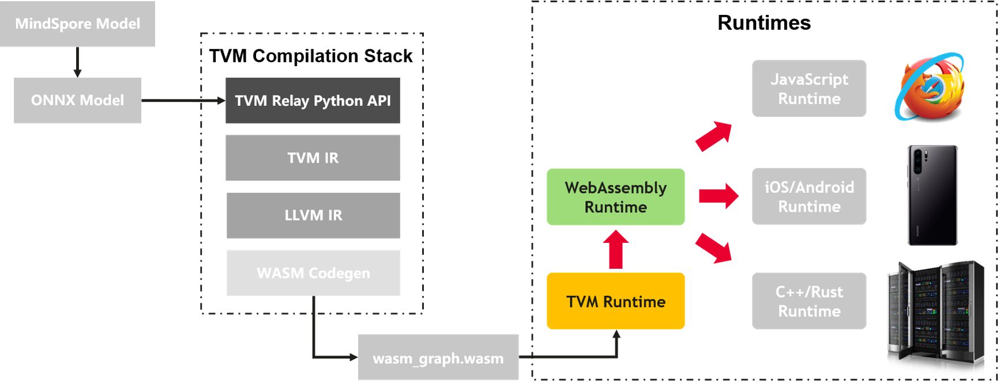
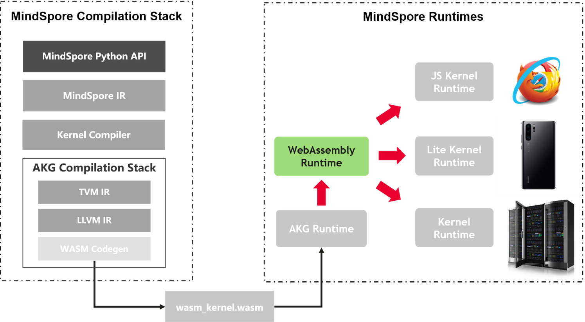

# 华为 | 基于 TVM Rust Runtime 和 WASM 沙箱运行 AI 模型

作者： 王辉 / 后期编辑： 张汉东

> 此文来自于 3.27号 深圳 Meetup 大会
> 3月27日活动PPT和现场视频链接：  [https://disk.solarfs.io/sd/6e7b909b-133c-49f7-be0f-a51f65559665](https://disk.solarfs.io/sd/6e7b909b-133c-49f7-be0f-a51f65559665)


---

# 基于TVM Rust Runtime和WASM沙箱运行AI模型

## 说明

本文介绍了一种WASM与TVM在AI领域的结合方案：依托TVM端到端深度学习编译全栈的能力，将AI框架训练好的模型编译成WASM字节码，然后在运行时环境中通过Wasmtime进行图加载进而实现模型的无缝迁移部署。

## 图解TVM和WASM技术

### TVM与Rust运行时


作为Apache基金会的顶级开源项目，TVM是用于深度学习领域的一个全栈编译器，旨在高效地在任何硬件平台进行模型的编译优化和部署工作。通过统一的中间表示层（包括Relay和Tensor IR两层），TVM可将AI框架训练的模型编译成与后端硬件架构无关的计算图表达，然后基于统一运行时实现不同环境下的计算图加载和执行操作。

为实现上述的图加载执行操作，TVM制定了一套抽象的运行时接口，并根据不同的运行时环境提供多种编程语言的接口实现（包括C++、Python、Rust、Go及Javascript等），本文主要介绍TVM Rust运行时的接口定义。TVM Rust运行时接口主要包含`tvm_rt`和`tvm_graph_rt`两个crate，前者完全实现了TVM runtime API的Rust接口，而后者则具体实现了TVM graph运行时的Rust版本；本文着重针对`tvm_graph_rt`的接口实现展开介绍。

* 结构体定义

    | 结构体名称 | 功能介绍 |
    | :--------- | :------- |
    | [DLTensor](https://tvm.apache.org/docs/api/rust/tvm_graph_rt/struct.DLTensor.html) | Plain C Tensor object, does not manage memory. |
    | [DsoModule](https://tvm.apache.org/docs/api/rust/tvm_graph_rt/struct.DsoModule.html) | A module backed by a Dynamic Shared Object (dylib). |
    | [Graph](https://tvm.apache.org/docs/api/rust/tvm_graph_rt/struct.Graph.html) | A TVM computation graph. |
    | [GraphExecutor](https://tvm.apache.org/docs/api/rust/tvm_graph_rt/struct.GraphExecutor.html) | An executor for a TVM computation graph. |
    | [SystemLibModule](https://tvm.apache.org/docs/api/rust/tvm_graph_rt/struct.SystemLibModule.html) | A module backed by a static system library. |
    | [Tensor](https://tvm.apache.org/docs/api/rust/tvm_graph_rt/struct.Tensor.html) | A n-dimensional array type which can be converted to/from `tvm::DLTensor` and `ndarray::Array`. `Tensor` is primarily a holder of data which can be operated on via TVM (via `DLTensor`) or converted to `ndarray::Array` for non-TVM processing. |

* 枚举定义

    | 枚举名称 | 功能介绍 |
    | :------- | :------- |
    | [ArgValue](https://tvm.apache.org/docs/api/rust/tvm_graph_rt/enum.ArgValue.html) | A borrowed TVMPODValue. Can be constructed using `into()` but the preferred way to obtain a `ArgValue` is automatically via `call_packed!`. |
    | [RetValue](https://tvm.apache.org/docs/api/rust/tvm_graph_rt/enum.RetValue.html) | An owned TVMPODValue. Can be converted from a variety of primitive and object types. Can be downcasted using `try_from` if it contains the desired type. |
    | [Storage](https://tvm.apache.org/docs/api/rust/tvm_graph_rt/enum.Storage.html) | A `Storage` is a container which holds `Tensor` data. |

* 常量定义

    * [DTYPE_FLOAT32](https://tvm.apache.org/docs/api/rust/tvm_graph_rt/constant.DTYPE_FLOAT32.html)
    * [DTYPE_FLOAT64](https://tvm.apache.org/docs/api/rust/tvm_graph_rt/constant.DTYPE_FLOAT64.html)
    * [DTYPE_INT32](https://tvm.apache.org/docs/api/rust/tvm_graph_rt/constant.DTYPE_INT32.html)
    * [DTYPE_UINT32](https://tvm.apache.org/docs/api/rust/tvm_graph_rt/constant.DTYPE_UINT32.html)

* trait定义

    * [Module](https://tvm.apache.org/docs/api/rust/tvm_graph_rt/trait.Module.html)
    * [PackedFunc](https://tvm.apache.org/docs/api/rust/tvm_graph_rt/trait.PackedFunc.html)

### WASM与WASI


[WebAssembly技术](https://webassembly.org/)（WASM）是一个基于二进制操作指令的栈式结构的虚拟机，其可以被编译为机器码，进而更快、高效地执行本地方法和硬件资源；当然凭借WASM强大的安全和可移植特性，其不仅可以嵌入浏览器增强Web应用，也可以应用于服务器、IoT等场景。

由于浏览器领域天然具备屏蔽后端硬件平台的特点，WASM技术本身不需要考虑浏览器后端的运行时环境；但是面向非Web领域必须要针对不同的操作系统进行适配和兼容（文件读写、时钟同步、中断触发等），针对这种情况WASM社区提出了一套全新的WASI标准（WASM System Interface）。正如WASM是面向逻辑机层面的汇编语言一样，WASI是一套面向逻辑操作系统的标准接口，目的是为了实现WASM平台在不同操作系统间的无缝迁移运行。针对WASI标准的详细解读，请查阅[此博文](https://hacks.mozilla.org/2019/03/standardizing-wasi-a-webassembly-system-interface/)。

## 方案介绍

### 前期调研

当前业界针对WASM技术在AI领域已经有了比较多的探索：[TF.js社区](https://blog.tensorflow.org/2020/03/introducing-webassembly-backend-for-tensorflow-js.html)基于WASM编译传统手写算子提升执行速度；[TVM社区](https://tvm.apache.org/2020/05/14/compiling-machine-learning-to-webassembly-and-webgpu)基于WASM编译模型用于浏览器领域的模型推理；还有利用WASM可移植性解决算子库与硬件设备不兼容的问题（详见[XNNPACK](https://github.com/google/XNNPACK)）等等。

### 方案设计

之前我们团队分享了WASM与AI领域结合的初步思路（详见[此处](https://leonwanghui.github.io/machine-learning/2020/04/15/some-thoughts-on-using-wasm-in-ml.html)），正如TF.js和TVM社区开展的探索工作，我们发现WASM具有的可移植性天然地解决了AI模型在全场景落地的问题：针对传统深度学习框架定义的模型，用户在不同硬件环境上进行模型训练/推理时必须要进行额外的定制化开发工作，甚至需要单独开发一套推理引擎系统。

那么如何利用WASM的可移植性实现硬件环境的统一呢？以MindSpore深度学习框架为例，如果我们把MindSpore模型分别从宏观和微观的角度来分析，宏观来看它就是一张基于MindSpore IR定义的**计算图**，微观来看它是一系列MindSpore**算子**的集合。那么我们就可以尝试分别从计算图和算子的维度将WASM与深度学习框架进行结合，也就是提出`WASM计算图`和`WASM算子库`这两种概念。

* WASM计算图

    WASM计算图，顾名思义就是将训练好的模型（包括模型参数）编译成WASM字节码，然后在Runtime环境中通过WASM Runtime加载便可直接进行模型推理，借助WASM的可移植性可以实现任何环境下的模型推理工作：
    * Web领域通过`Emscripten`工具将WASM字节码加载到JS Runtime中进而在浏览器中执行；
    * 非Web领域通过`Wasmtime`工具加载WASM字节码到系统环境中执行。

    对于WASM计算图这种情况，由于训练好的模型（和参数）都是提前保存在系统环境中，因此需要引入`WASI`接口与系统资源进行交互，进而完成离线加载模型的操作。所以在选择WASM Runtime的时候需要选择支持WASI（WASM System Interface）标准的工具（例如`Wasmtime`），或者也可以像TVM社区那样简单粗暴地直接对Emscripten进行WASI扩展。

* WASM算子库

    WASM算子库相对来说比较好理解，就是把单个算子编译成WASM字节码，然后对上层框架提供一种封装好的算子调用接口。但是和传统手写算子的调用方式不同，框架需要通过一种类似于动态链接的方式来加载WASM算子，但考虑到当前WASM本身不支持动态链接的方式，因此需要提前将所有编译好的WASM算子进行整合，然后对框架层提供算子库的调用接口。

通过对上述两种思路进行分析比较，同时在**借鉴了TVM社区已有工作**的情况下，我们决定首先从`WASM计算图`这条路开始进行深入探索，最大程度地利用TVM全栈编译的能力快速实现方案的原型。

### 方案实现



* WASM图编译

    如上图所示，我们可以利用TVM Relay的Python接口直接把模型编译成`graph.o`的可执行文件，但是需要注意的是生成的graph.o文件无法直接被WASM runtime模块识别，必须首先要通过TVM的Rust runtime加载然后通过Rust编译器把图中所示的`WASM Graph Builder`模块直接编译成WASM字节码（即图中的`wasm_graph.wasm`文件）。为什么非得要经过这一步繁琐的转换呢？主要是因为`graph.o`文件中包含了Relay和TVM IR的原语，我们无法直接将这些原语转换成WASM的原语，具体转换的步骤这里就不做赘述了。

* WASM图加载

    图加载阶段（由上图看来）似乎是非常简单的，但是实际情况要复杂地多。首先，WASM的运行时针对WASM IR定义了一整套汇编层面的用户接口，这对于上层应用开发者来说是极度不友好的；其次，WASM当前只支持整数类型（例如i32、u64等）作为函数参数，这就导致深度学习领域的张量类型无法通过原生方式传入；更别说还要增加thread、SIMD128这些高级特性的支持等等。

    当然每个新领域的探索都离不开各种各样的问题，而且解决问题本身就是技术/科研人员的本职工作，所以我们没有寄希望于WASM社区而是主动尝试解决这些问题：既然WASM没有面向上层用户的高级API，我们就根据自己的需求开发一套；虽然WASM不支持传入Struct或Pointer，我们可以通过Memory机制将数据提前写入到WASM内存中然后将内存地址转成i32类型作为函数参数。虽然有些改动有点“反人类”，但是它可以清晰地展示出我们的思路和想法，这就已经足够了。

由于篇幅有限，此处附上项目实现的[完整代码](https://github.com/apache/incubator-tvm/tree/master/apps/wasm-standalone)，欢迎感兴趣的大佬进行交流讨论。

如下展示的是项目整体的codebase：

```
wasm-standalone/
├── README.md
├── wasm-graph      // WASM图生成模块
│   ├── build.rs    // build脚本
│   ├── Cargo.toml  // 项目依赖包
│   ├── lib         // 通过TVM Relay API编译生成的计算图的存放目录
│   │   ├── graph.json
│   │   ├── graph.o
│   │   ├── graph.params
│   │   └── libgraph_wasm32.a
│   ├── src         // WASM图生成模块源代码
│   │   ├── lib.rs
│   │   ├── types.rs
│   │   └── utils.rs
│   └── tools       // Relay Python API编译脚本的存放目录
│       ├── build_graph_lib.py
└── wasm-runtime    // WASM图生成模块
    ├── Cargo.toml
    ├── src         // WASM图生成模块源代码
    │   ├── graph.rs
    │   ├── lib.rs
    │   └── types.rs
    └── tests      // WASM图生成模块测试用例
        └── test_graph_resnet50
```

为了让大家对该方案有一个更形象具体的理解，我们准备了一个简单的原型：通过TVM Relay API将基于ONNX生成的ResNet50模型编译成`wasm_graph_resnet50.wasm`文件，然后在运行时环境中通过Wasmtime加载WASM完成模型推理功能（具体操作流程详见[此处](https://github.com/apache/incubator-tvm/blob/master/apps/wasm-standalone/README.md#poc-guidelines)）。

## 未来规划

### TVM社区联动

正如前面所说的，该方案仍处于**试验**阶段，因此我们会和TVM社区一起共同探索更多可能性，目前初步规划的特性有：

* 支持基于SIMD128的数据并行处理；
* 进一步完善TVM社区的Rust runtime API模块，使其能原生支持WASM Memory特性的对接；
* 基于WASM后端的AutoTVM优化；
* 更多网络支持。

### WASM算子库

当前我们只是针对WASM计算图这个方向进行了深入探索，但如果要是将WASM技术与深度学习框架（比如MindSpore）相结合的话，WASM算子库的方向可能会释放更大的潜能。这里首先列举几个更适合WASM算子库的场景：

* 很多深度学习框架本身已经定义了自己的IR以及编译流水线，只有WASM算子库可以无缝地与这些框架的图编译层相融合；
* WASM计算图只能用于模型推理，而WASM算子库可以适用于模型训练/验证/推理等场景；
* 在可移植性这个层面，WASM计算图无法提供其内部算子的一致性保证，而WASM算子库真正实现了端边云全场景中算子的可移植性。



如上图所示，我们计划从WASM算子库这个层面梳理出一套端到到的集成方案（优先覆盖上述几个场景），真正实现WASM技术在AI领域全场景的结合。

## 加入我们

为了更好地推动Rust编程语言生态在AI领域的落地，我们发起了一个叫Rusted AI的非商业性组织，任何对Rust和AI技术感兴趣的开发者均可申请加入，社区当前提供如下几种交流渠道：

* **Rusted AI微信群**：欢迎添加小助手的微信（微信号：`mindspore0328`，备注：`Rusted AI`），认证通过后小助手会将您拉进Rusted AI讨论群
* **GitHub Teams**：社区当前依托GitHub Teams提供公开讨论的渠道，由于GitHub Teams仅对组织成员开放，请以邮件形式发送`个人GitHub ID`至<wanghui71leon@gmail.com>，认证通过后即可参与[社区话题讨论](https://github.com/orgs/tinyms-ai/teams/rustedai)
* **生态众筹项目**：近期社区发布了[awesome-rusted-ai](https://github.com/tinyms-ai/awesome-rusted-ai)众筹项目，用于记录所有与Rust语言和AI领域联动相关的开源项目
