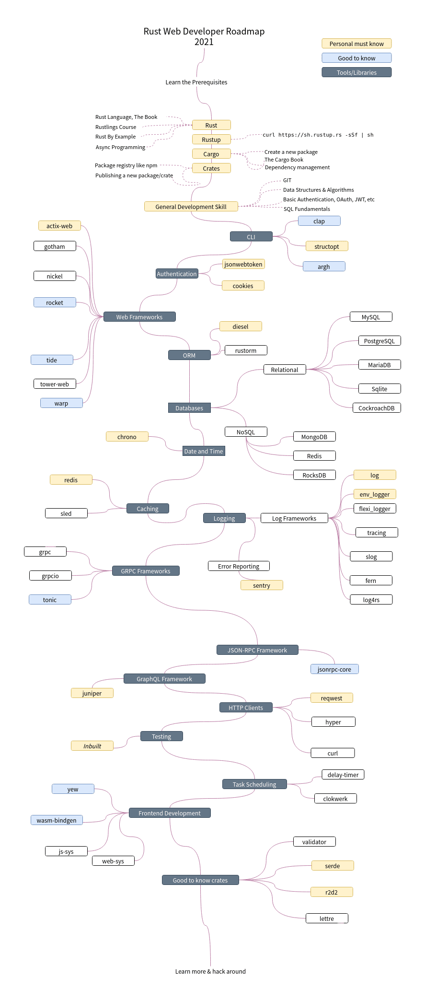

# 本月简报 | 学习资源

- 来源：[Rust日报](https://rustcc.cn/section?id=f4703117-7e6b-4caf-aa22-a3ad3db6898f)
- 作者：`Rust`日报小组
- 后期编辑：苏胤榕（DaviRain）

## Rust 常见疑问汇总

Rust tg 群 「Rust 众」总结了这份 Rust 常见疑问汇总。

本期摘录：

1. 如何在特质(trait)里添加异步函数？

目前 Rust 不支持在特质里直接添加异步函数，但可以使用 [async-trait](https://crates.io/crates/async-trait) 这个库来实现。这个库会将异步函数改写为返回 `Pin<Box<dyn Future>>` 的普通函数以绕过目前语言层面的限制，但也因此有堆分配以及动态分发这两个额外的代价，所以不会被直接添加到 Rust 语言中。

在特质里不支持使用异步函数是由于异步函数本质上是一个返回 `impl Future<Output = T>` 的函数，而目前 Rust 的类型系统还无法表达在特质的方法的返回类型上使用 impl Trait。有两个已经通过的 RFC 旨在解决这一问题：[RFC 1598](https://rust-lang.github.io/rfcs/1598-generic_associated_types.html) 泛型关联类型和 [RFC 2071](https://rust-lang.github.io/rfcs/2071-impl-trait-existential-types.html) `impl Trait` 存在类型，但它们的编译器支持还在实现中。

2. 为什么 Rust 生成的程序体积比较大？如何最小化程序体积？

有多个因素使得 Rust 在默认情况下有着相对较大的程序体积，包括了单态化、调试符号、标准库等。一般来说，Rust 偏向于为性能优化而非更小的体积。

通常使用发布模式编译（--release），以及（在 Linux 和 macOS 下）使用 strip 删除符号信息可以在一定程度上缩小程序体积。更多方法可以参考 [`Minimizing Rust Binary Size`](https://github.com/johnthagen/min-sized-rust)，对这一问题有较完整的介绍。

欢迎贡献：

更多阅读： [https://rust-zh.github.io/faq/](https://rust-zh.github.io/faq/)

## C++ to Rust - or how to render your mindset

作者打算使用 Rust 重新实现 C++教程 `<<Ray tracing in One Weekend>>`，本文目标人群是对于 Rust 感兴趣的，或者对图像渲染感兴趣的人。

通过本教程，最终会得到下面的预览图。

整个过程， 作者既给出了`C++`代码， 也给出了`Rust`代码，对于熟悉 C++的同学，可以更加清晰的了解两种语言的不同。

[链接](https://jduchniewicz.com/posts/2021/02/c-to-rust-or-how-to-render-your-mindset/)

## rust-algorithms 用 Rust 写算法的教科书

作者 @EbTech 是应用数学出生，因此本书提供的算法主要包括应用数学（傅里叶变换等）的算法以及图的算法使用 Rust 的实现。

[仓库](https://github.com/EbTech/rust-algorithms)

## 回顾异步Rust

parity 工程师 tomaka 这篇博文，总结了他在日常开发中遇到的 Rust 异步的一些关键问题，值得一读。

[阅读](https://tomaka.medium.com/a-look-back-at-asynchronous-rust-d54d63934a1c)

## Rust: 提防转义序列 \n

[serde](https://github.com/serde-rs/serde)是在Rust生态系统最流行的crate，一个用于高效地序列化和deseri一个LIZING数据结构。它支持多种数据格式，包括JSON，YAML，MessagePack等。与许多其他（反）序列化器不同，它不使用运行时反射，而是使用Rust的引人注目的特征系统。这使Serde异常有效，因为数据结构本质上知道如何序列化或反序列化自身，并且它们通过实现`Serialize`or`Deserialize`特性来实现。幸运的是，这要归功于大多数类型，这要归功于derive宏。您可能会像我一样遇到陷阱，在这篇博客文章中，作者想特别谈一谈：**转义序列。**

[ReadMore](https://d3lm.medium.com/rust-beware-of-escape-sequences-85ec90e9e243#ee0e-58229fc84d02)

## bevy-physics-weekend 项目

这个项目是使用 Rust 编程语言和 Bevy 游戏引擎对 [Game Physics in a Weekend](https://gamephysicsweekend.github.io/)这本书的实践。这对我来说是一个学习练习，以便更好地理解如何使用 Bevy 和数学库 glam 来实现物理引擎。项目

[地址](https://github.com/bitshifter/bevy-physics-weekend)

## Rust 优化技巧

如果您希望用 Rust 编写速度更快的代码，那么有好消息!Rust 让编写快速代码可以变得非常容易。对零成本抽象的关注、缺乏隐式装箱和静态内存管理意味着，即使是 naïve 代码也往往比其他语言中的同类代码要快，当然也比任何同等安全的语言的代码要快。但是，也许像大多数程序员一样，您在整个编程生涯中都不必担心机器的任何细节，而现在您想要更深入地了解并找出重写的 Python 脚本的真正原因。 Rust 的运行速度快了 100 倍，并使用了十分之一的内存。毕竟，它们都做相同的事情并在相同的 CPU 上 运行，对吧？

因此，这里有一个优化指南，针对那些知道如何编程，但可能不知道代码如何 CPU 上映射到真实的 1 和 0 的人。我将尝试编写关于优化 Rust 代码的实用技巧，并解释为什么它比替代方法更快，最后我们将以 Rust 标准库中的一个案例研究作为结束。

[原文地址](https://gist.github.com/little-dude/674de61df7f48547bdcc5bbe2860563d)

## 用Rust给我的操作系统写乒乓（Pong）

我们上一讲结束了为我们的操作系统编写图形驱动程序和事件驱动程序。我们还添加了几个系统调用来处理绘图原语以及处理键盘和鼠标输入。现在我们将使用这些动画来制作简单的pong游戏。就像《hello world》是对所有编程语言的测试，《pong》也是对我们所有图形和事件系统的测试。

[文章链接](https://blog.stephenmarz.com/2021/02/22/writing-pong-in-rust/)

## Rust Style Guidelines

rust-guidelines 收集了用于编写Rust代码的新出现的原理，约定，抽象和最佳实践。

[Docs](https://doc.rust-lang.org/1.0.0/style/README.html)

[GitHub](https://github.com/rust-lang/rust-guidelines)

## 避免使用Rust进行单线程内存访问错误

在本文中，我们将研究单线程C ++中的几种内存访问错误，以及Rust如何防止我们犯这些错误。我写了一篇简短的文章，展示了C ++中的内存访问错误以及Rust如何阻止我们访问这些错误。目录：Returning references to temporariesShort lifetimesReferenes to container contentsTricky lifetime extensions

[阅读原文](https://radekvit.medium.com/avoiding-single-threaded-memory-access-bugs-with-rust-for-c-developers-2b7fc9c877ec)

## Rust Web开发人员路线图

超详细 Rust Web 开发人员的路线图。

[github](https://github.com/anshulrgoyal/rust-web-developer-roadmap)

## Rust 中返回引用的各种策略

本文总结了常见的返回引用的几种方式，强烈推荐。

[原文链接](https://bryce.fisher-fleig.org/strategies-for-returning-references-in-rust/)

## Learning Rust: Structs and Traits

这是一系列学习 Rust 视频的第三部分，`Structs and Traits`， 内容相对比较简单， 有喜欢看视频学习 Rust 的小伙伴可以翻墙看一下。

[油管视频](https://youtu.be/tYfA5rjrhqk)

## 教程：如何在Rust中实现一个迭代器

这篇教程中你将会学到如何为一个树结构实现迭代器。

[阅读更多](https://aloso.github.io/2021/03/09/creating-an-iterator)

## 【博客】Rust 命名空间

关于Rust中命名空间的内容讲解。

[链接](https://aloso.github.io/2021/03/10/rusts-universes.html)

## 我是如何使用 Rust 大幅提高笔记软件的性能的？

[Giganotes](https://github.com/giganotes) 是作者开发的一个笔记软件，作者尝试使用 Rust 来提高软件的性能，并取得了很好的成效。

[链接](https://www.reddit.com/r/rust/comments/m14agf/how_i_significantly_improved_giganotes_app/)

## learn wgpu系列教程终于完全升级到了0.7版本！

wgpu 创建渲染管道的方式已经进行了改进。大多数属于自己的字段都被分组为结构，例如 [MultisampleState](https://docs.rs/wgpu/0.7.0/wgpu/struct.MultisampleState.html) 。这意味着简单的管道更容易创建，因为我们可以对我们不关心的字段使用`Default::Default()`或`None`。

[Read More](https://sotrh.github.io/learn-wgpu/) 

[Github](https://github.com/sotrh/learn-wgpu) 

## 教你如何用Rg3d制作一个射击游戏！

教你如何用Rg3d制作一个射击游戏系列教程更新第二章了！

Rg3d是一个使用Rust编写的游戏引擎，渲染后端用的是OpenGl的Rust绑定：glutin ，说到这个教程出现的原因，很心酸的想贴上这段话：

> I have a simple question for the community: what stops you from using the engine? The lack of tutorials, immaturity, different approaches (no-ecs for example, or maybe you have your reason you want to share? I need to know what should be done first to make engine more newcomer-friendly. I have ~10 years of experience in gamedev and some things may be not obvious to me, so I need your help.

消息是Rg3d的作者在Discord上发布的，时间是2月16日的时候，发布之后有不少人表达了自己的想法，同时现在你看到的教程，也正是通过这次调查得到大家反馈之后才出的。作者本人在Discord上对大家的提问回复都很及时，Rust社区本身不是很大，同时Rust游戏社区就更小了，但是仍然有很多人对此不断耕耘，所以如果你对游戏开发很有兴趣，同时也是Rust厨的话，一直还没有去尝试过使用Rust开发游戏的你，一定要去感受一下使用Rust开发游戏！

[Read More](https://rg3d.rs/tutorials/2021/03/09/tutorial2.html)

## Rust 异步不是有色函数！

本篇blog名字是`Rust's async isn't f#@king colored!`

本篇blog衍生自15年的一篇著名blog：[What Color is Your Function?](https://journal.stuffwithstuff.com/2015/02/01/what-color-is-your-function/)，在这篇blog种将编程语言的函数调用区分为不同的颜色，特别指出多种语言种的异步调用和同步函数是两种不同的颜色，在编写程序的时候会给程序员造成一些痛苦。而文中所说go、java之类的则不属于这类语言，详细的可以去看看原文。

而本篇blog也就沿着上面提到的这篇blog讨论了Rust异步编程种是否存在同样的问题。结论已经被标题出卖了，Rust异步不是有色函数！

[What Color is Your Function?](https://journal.stuffwithstuff.com/2015/02/01/what-color-is-your-function/)

[Rust's async isn't f#@king colored!](https://www.hobofan.com/blog/2021-03-10-rust-async-colored/)

## Rust的异步是有颜色, 但没什么大不了

语言设计领域的一个争议点是 `有色函数`， 即将函数分为异步函数和非异步函数。这个术语来源于2015年一篇名为`《What Color is Your Function?》`的文章, 它用颜色来比喻JavaScript和其他带有显式异步函数的语言中的同步和异步函数之间常常令人痛苦的不匹配。

Rust 中，也有很多人讨论这个问题， 比如前几天有一片文章 `Rust’s async isn’t f#@king colored!`。

这里作者将通过原始的定义和实践，来表达自己的观点: Rust 是有颜色的。

[原文链接](https://morestina.net/blog/1686/rust-async-is-colored)

## 看到Toml文件，真是相见恨晚

有位作者在`Reddit`发表了一篇帖子：`I really love TOML files`。

> “我没在使用Rust之前，并不了解Toml文件。现在我想用它来做任何事。” 这不就是传说中的：相见恨晚嘛。

为什么`Toml`文件会被人喜爱？下面有人评论： “对于许多简单的配置，它们真的很酷！ 它们没有YAML陌生性，也没有JSON的字符串性，并且它们大多是扁平的，几乎没有级别缩进。”

[详细链接](https://www.reddit.com/r/rust/comments/m37zya/i_really_love_toml_files/)

## 使用rg3d编写的射击游戏

用Rust写游戏:神枪在手，说抖不抖。

本教程是系列教程的后续部分，我们将使用rg3d游戏引擎制作3D射击游戏。

[详细链接](https://rg3d.rs/tutorials/2021/03/11/tutorial3.html)

## Rust 和 C 速度比较

Rust 和 C 的编程风格差异很大，但两者开发的程序在运行速度和内存使用情况上大致相同。语言在理论上可以实现什么，但在实践中如何使用它们之间有很大的区别。作者总结了Rust 和 C 各自在哪些地方会更快。

简而言之

- Rust 可以在必要时以足够底层的方式对其进行优化，使其达到与 C 一样的性能；
- Rust 拥有更高层次的抽象，便捷的内存管理和丰富的第三方库；
- Rust 最大的潜力在于无畏并发（fearless concurrency）能力。

[文章链接](https://kornel.ski/rust-c-speed)

## 为什么 Rust 和 Go 一起更好？

简单，性能和开发者的生产力，使得 Go 成为创建面向用户应用服务的理想语言。更好的控制粒度使得 Rust 成为底层操作的理想语言。这并不意味着非得二选一，反而两者一起使用时会具有很高的灵活性和性能。

本文讨论了 Rust 和 Go 的优缺点，以及如何互相补充支持。

[文章链接](https://thenewstack.io/rust-vs-go-why-theyre-better-together/?s=09)

## 使用 Rust 写一个 Postgres SQL 打印器: Part I

这是作者`pg-pretty`项目项目的一系列文章第一篇。

作者不能忍受非格式化的代码，对于大型项目来说，统一风格可以消除很多理解障碍。但是作者没有找到一个很好的 Postgres SQL 风格打印器，所以打算自己动手写一个。

[原文链接](https://blog.urth.org/2021/03/14/writing-a-postgres-sql-pretty-printer-in-rust-part-1/)

## Crust of Rust: The Drop Check

这是 `Crust of Rust` 系列视频的最新一期: `The Drop Check`, 相信很多小伙伴对 Drop check 都很感兴趣，可以翻墙看一下。

[油管视频](https://youtu.be/Das3XSWo1GU)

## 《Rust vs. Go》:为什么它们一起会更好

来自 Jonathan Turner and Steve Francia 的 blog，虽然其他人可能认为 Rust 和 Go 是有竞争力的编程语言，但 Rust 和 Go 团队都不这么认为。恰恰相反，我们的团队非常尊重其他人正在做的事情，并将这些语言视为对整个软件开发行业现代化状态的共同愿景的赞美。

注 Steve Francia【@spf13】 是隔壁 go 社区大佬，
[更多请看](https://thenewstack.io/rust-vs-go-why-theyre-better-together/)

## 如何使用 Rust 发邮件

在 Rust 中发送电子邮件可以通过两种方式实现：使用 SMTP 服务器或使用带有 API 的第三方服务，如 AWS SES 或 Sendgrid。

[详细实现请看](https://kerkour.com/blog/rust-send-email/)

## 构建Async Rust的共同愿景

近期，Rust官方博客推出了一篇文章，《Building a shared vision for Async Rust》：构建Async Rust的共同愿景。

Rust Async基金会工作组认为,Rust可以成为构建分布式系统（从嵌入式设备到基础云服务）的最受欢迎选择之一。不管他们用它做什么，我们都希望所有的开发者都喜欢使用Async-Rust。为了实现这一点，我们需要将Async Rust从现在的“MVP”状态转移出去，尽可能让每个人都能使用。

[文章地址](https://blog.rust-lang.org/2021/03/18/async-vision-doc.html)

## Rust 的 零大小类型(ZST) 的神奇应用

Rust 中有 零大小类型的概念，简称 `ZST` (Zero-Sized Types). 这些类型不会在他们的布局上包含任何的信息。 但是这并不意味着他们不重要,本文将深入解释 ZST 的设计理念和应用。 感兴趣的小伙伴可以看一下。

[原文链接](https://www.hardmo.de/article/2021-03-14-zst-proof-types.md)

## lens-rs 指路

来自 `脚趾头` 的知乎投稿。作者之前使用 `Rust` 实现了 `lens`， 本文主要说明如何来把玩这个库 `len-rs`。

[原文链接](https://zhuanlan.zhihu.com/p/358678675)

## 使用 Rust 构建 OpenStreetMap 应用: Part VI

`使用 Rust 构建 OpenStreetMap 应用` 的最新章节， 结合之前的内容， 本章结束会完成一个基本的应用。

[原文链接](https://blogg.bekk.no/building-an-openstreetmap-app-in-rust-part-vi-8cfc8c3f7798)

## 使用 Rust Iterator 的一些技巧

作者总结了 Rust Iterator 相关的几条技巧，感觉还不错。

[链接](https://robinmoussu.gitlab.io/blog/post/2021-03-25_rust_iterators_tips_and_tricks/)

## Pin and suffering

`Cool bear`系列的最新文章，可以让你深入的了解 `Rust` 中的 `async`。

[原文链接](https://fasterthanli.me/articles/pin-and-suffering)

## 2021年去哪里学习 Rust

2021 年了，去哪里学习 Rust 呢？

本文总结列出了一系列的 Rust 学习资料，想学习的 Rust 的小伙伴可以看看。

[原文链接](https://loige.co/where-to-go-to-learn-rust-in-2021/)

## Rusts Module System Explained

本文详细的介绍了 Rust 模块系统，从为什么需要模块系统？ 到如何使用的非常详细，希望对模块系统深入掌握的同学可以看看。

[原文链接](https://aloso.github.io/2021/03/28/module-system.html)

## LibP2p 指南

这个教程展示如何使用Rust和出色的libp2p库构建一个非常简单的点对点应用程序。

[阅读](https://blog.logrocket.com/libp2p-tutorial-build-a-peer-to-peer-app-in-rust/)

[示例代码](https://github.com/zupzup/rust-peer-to-peer-example)

## 指南： 写一个 微ECS （ Entity Component System）系统

通过编写一个简单的 ECS 系统来学习什么是 ECS 。

[阅读](https://ianjk.com/ecs-in-rust/)

## 【系列文章】学会飞行：使用 Rust / 神经网络 / 遗传算法 来模拟进化

- [Part I](https://pwy.io/en/posts/learning-to-fly-pt1/)
- [Part II](https://pwy.io/en/posts/learning-to-fly-pt2/)
- [Part III](https://pwy.io/en/posts/learning-to-fly-pt3/)
