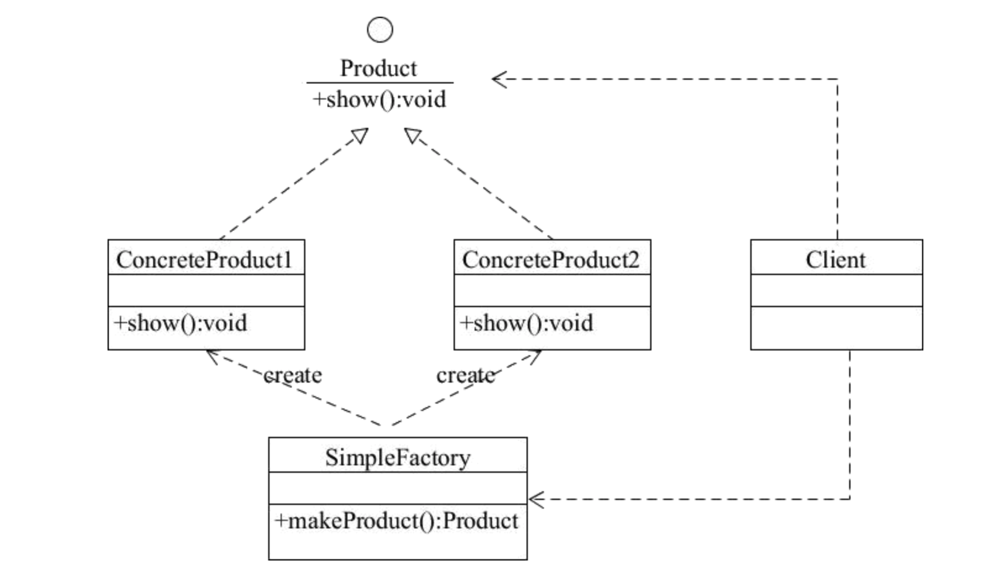

# 「系列」设计模式之工厂模式

作者：苏胤榕（DaviRain） / 后期编辑：张汉东

---

# 创建型设计模式 之 工厂模式

> 工厂方法模式 (虚拟构造函数，Virtual Constructor, Factory Method）

## 意图

工厂方法模式是一种创建型设计模式，其在父类中提供一个创建对象的方法，允许子类决定实例化对象的类型。在Rust中的实现就是提供一个抽象的trait，结构体实现该trait。

## 问题

假如你正在开发一款应用，最初的版本只能处理的业务逻辑只有单一的一个，比如开始只有简单的邮寄个人信的业务。而后面随着业务的扩大，需要增加邮寄公司订单业务。

如果代码其余部分与现有的类已经存在耦合关系，那么向程序中添加新类其实没有那么容易。

如果以后需要在程序支持另一种新的业务类型，很可能需要再次对这些代码进行大幅修改。

最后，你将不得不编写纷繁复杂的代码，根据不同的业务类，在应用中进行不同的处理。

## 解决方案

工厂方法模式建议使用特殊的工厂方法代替对象构造函数的直接调用。对象的创建仍然通过new运算符，只是该运算符改在工厂中调用。工厂方法返回的对象通常被称作“产品”。

虽然看似很简单，我们只是改变了程序中调用构造函数的位置。但是我们可以在子类中重写工厂方法，从而改变其创建产品的类型。（这里的话在Rust中是有新的结构体实现抽象的triat）仅当这些产品具有共同的基类或者接口时，子类才能返回不同类型的产品，同时基类中的工厂方法还应该将其返回类型声明为这一共有接口。

## 工厂方法模式结构

- 产品将会对接口进行声明。对于所有由创建者及其子类构建的对象，这些接口都是通用的。
- 具体产品是产品接口的不同实现。
- 创建者类声明返回产品对象的工厂方法。该方法的返回对象必须与产品接口相匹配。你可以将工厂方法声明为抽象方法，强制要求每个子类以不同的方式实现该方法。或者，也可以在基础工厂方法中返回默认产品类型。注意。尽管它的名字是创建者，但他最主要的职责并不是创建产品。一般来说，创建者类包含一些与产品相关的核心业务逻辑。工厂方法将这些逻辑处理从具体产品类中分离出来。

## 示例结构图



## 代码

```rust
enum ProductType {
    Product1,
    Product2,
}

// 定义接口
trait Product {
    fn show(&self);
}

// 工厂模式
trait Factory {
    fn make_product(&self, product_type : ProductType) -> Box<dyn Product>;
}

struct ConcreteProduct1(String);
struct ConcreteProduct2(String);

impl Product for ConcreteProduct1 {
    fn show(&self) {
        println!("red color, {}", self.0);
    }
}

impl Product for ConcreteProduct2  {
    fn show(&self) {
        println!("blue color, {}", self.0);
    }
}

struct SimpleFactory;

impl SimpleFactory {
    fn new() -> Self {
        Self
    }
}

impl Factory for SimpleFactory {
    fn make_product(&self, color_type : ProductType) -> Box<dyn Product> {
        match color_type {
            ProductType::Product1 => Box::new(ConcreteProduct1("blue".to_string())),
            ProductType::Product2 => Box::new(ConcreteProduct2("red".to_string())),
        }
    }
}

fn main() {
    let factory =  SimpleFactory::new();
    let product = factory.make_product(ProductType::Product1);
    product.show();
    let product = factory.make_product(ProductType::Product2);
    product.show();
}
```

## 工厂方法模式适合应用的场景

- 当你在编写代码的过程中，如果无法预知对象确切类别及其依赖关系时，可使用工厂方法
    - 工厂方法将创建产品的代码和实际使用产品的代码分离，从而能在不影响其他代码的情况下扩展产品创建部分代码
- 如果你希望用户能扩展你软件库或架构的内部组件，可使用工厂方法
    - 通过将需要实现的共同特性的接口特性抽象为trait， 当有新的结构体时，将该结构体实现拥有共同特性的trait。从而实现新组件的假如，而不会破坏别的代码结构。
- 如果你希望复用现有对象对象来节省系统资源，而不是每次都重新创建对象，可使用工厂方法。

## 实现方法

- 让所有的产品都遵循统一triat接口，该接口必须声明对所有产品都有意义的方法
- 在工厂trait中添加一个工厂方法，该方法的返回类型都必须遵循通用的产品接口（返回的是由Box包裹起来的trait对象）
- 在创建者代码中找到对于产品构造函数的所有引用，将它们依次替换为对于工厂方法的调用。，同时将创建产品的代码移入工厂方法。
- 为工厂方法中的每种产品编写一个结构体，然后将该结构体实现抽象出来的统一triat，并将基本方法中的相关创建代码移动到工厂方法中。
- 如果代码经过上述移动之后，基础工厂方法中已经没有任何代码，你可以将其转变为抽象trait方法。如果基础工厂方法中还有其他语句，你可以将其设置为该方法的默认行为。

## 工厂方法模式优缺点

- 优点
    - 你可以避免创建者和具体产品之间的紧密耦合
    - 单一职责原则，你可以将产品创建代码放在程序的单一位置，从而使得代码更容易维护
    - 开闭原则，无需更改现有客户端代码你就可以在程序中引入新的产品类型。
- 缺点
    - 应用工厂方法模式需要引入许多新的子类，代码可能会因此变得更复杂。最好的情况是将该模式引入创建者类的现有层次结构中。