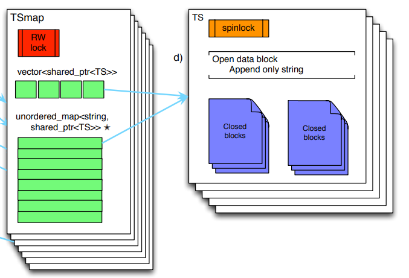
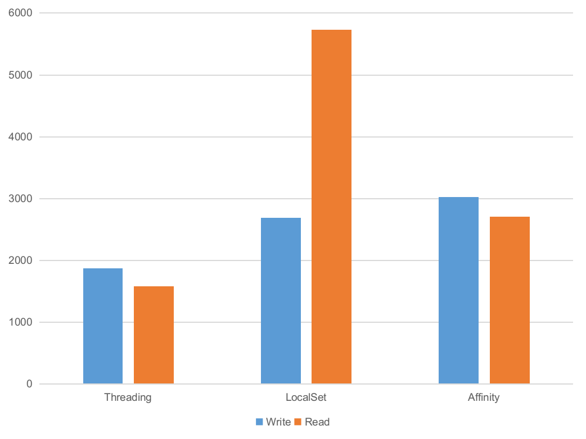
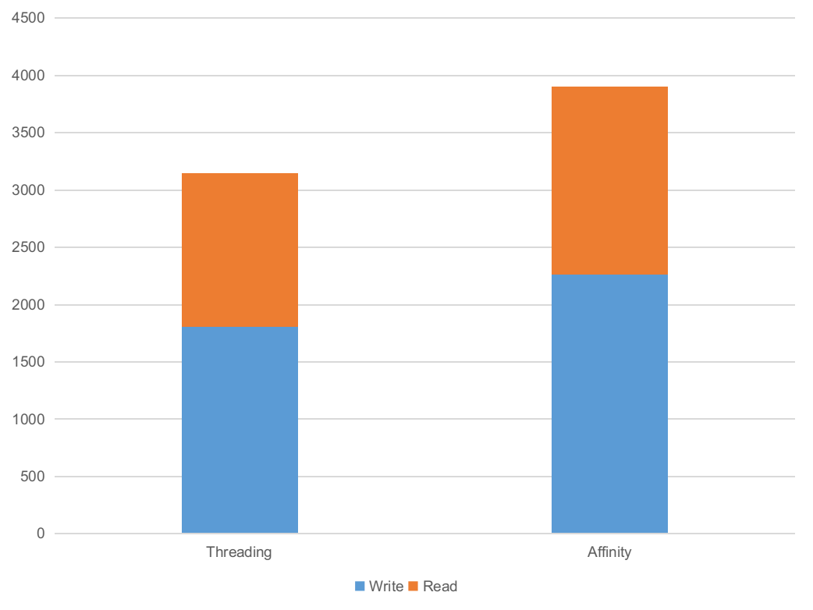

# 蚂蚁集团 CeresDB 团队 | Rust CPU Affinity 初探

作者：Ruihang Xia / 后期编辑：张汉东

# Brief

在看 [Apache Cassandra](https://cassandra.apache.org/) 的时候了解到 [ScyllaDB](https://www.scylladb.com/) 能在完全兼容它的情况下性能提升很多，通过进一步了解接触到了 thread per core 这种架构，这篇文章从一个简单的 cache 结构出发，实现了三个不同的方案，并对它们进行比较，最后给出了在这个过程中学习到的一些东西。

Thread Per Core 简单来说就是将应用的每一个线程绑定到一个计算核心上，通过 sharding 的方式将计算拆解分配到对应的核上。这是一种 shared nothing 的方式，每个核单独持有计算所需要的数据，独立完成计算任务，从而避免掉多余的线程同步开销。同时每个核心和工作线程一一对应，减少上下文切换的开销。

在 [waynexia/shard-affinity](https://github.com/waynexia/shard-affinity) 中，我分别用普通的不做限制调度、local set 给计算任务分组以及 绑定任务、核心与线程三种方式实现同一个目的的 cache 结构。这三种实现分别对应 *shard-affinity/load/src* 目录下的 *threading-rs*, *local_set-rs* 和 *affinity-rs* 三个文件。接下来将对这三种方法实现方法进行分析。下文提到的原始代码都在这个仓库里面，为了简洁进行了部分省略。

# Cache

假设我们有一个类似 `Map<Id, Data>` 的结构，它缓存了我们所需要的数据，请求分为对它进行 `append()` 或者 `get()`，通过读写锁进行线程同步并提供内部可变性，对外暴露 `&self` 的接口。

```rust
pub struct CacheCell {
    items: RwLock<Map<Id, RwLock<Item>>>,
}

impl CacheCell {
    pub fn get(&self, id: Id, size: usize) -> Option<Bytes>{}
    pub fn append(&self, id: usize, bytes: Bytes) {}
}
```

首先为了能让多个任务在同时操作 cache 的时候仍能得到符合预期的结果，我们可以使用 lock-free 的结构，或者对它加上一把锁将并发的操作串行化。而我们发现对不同的 id 进行的操作并不会互相影响。所以可以将线程同步所影响的结构粒度变小，以这个 cache 所参考的 gorilla in-memory data structure 为例，将 id 分为进行分组，由对应的 cell 进行管理。将锁的粒度变小，以支持更高的并发操作。



> 图一，from [Gorilla](https://www.vldb.org/pvldb/vol8/p1816-teller.pdf) paper Fig.7: Gorilla in-memory data structure.

选这个结构作为实例有两个原因，首先这是一个实际生产系统所使用的结构，比较有实际意义；并且它比较简单易于实现，而且本身就已经对 id 进行了 sharding，方便进行后续的使用。

# Threading

先来看比较常见的做法，拿若干个 `cache` 放一起合成一个 `Vec<Cache>>`，根据每次请求的 id 路由到对应的 cache 进行操作。

```rust
impl ThreadingLoad{
    pub fn append(&self, id: Id, bytes: Bytes) {
        self.shards[route_id(id)].append(id, bytes);
    }
}
```

而在使用的时候，则是开一个多线程的 tokio runtime，向里面 spawn 不同 id 的请求。

```rust
let rt = Builder::new_multi_thread().build();
let load = ThreadingLoad::new();

rt.spawn(async move {
    let id = random::<usize>();
    load.append(id, bytes);
})
```
在这之后，由 tokio 去调度任务执行，完成之后给我们结果，我们不用关心这个任务具体是怎样被调度的，产生的计算发生在哪个核上。而且我们底下的所有结构都付出了代价让它们 `Send` 和 `Sync`，也不用去担心一个对象同时被多个东西操作会出现奇怪的结果。

# LocalSet

这里是使用 tokio 的 [LocalSet](https://docs.rs/tokio/1.3.0/tokio/task/struct.LocalSet.html) 来实现的。它能将指定的任务绑在同一个线程上进行执行。这样子带来的好处就是我们可以使用 `!Send` 的东西了。

具体来说，由上面我们知道不同的 id 之间的操作不会互相影响，所以能够将锁粒度变小。同样的，不同 id 的任务计算所需要用到的数据也不会重叠，也就是避免了一份数据可能被多个内核同时访问的场景，从而不需要考虑我们的修改对其他内核的可见性。基于这一点，之前付出的性能代价来给数据实现 `Send` 和 `Sync` 也可以被节省下来。比如引用计数可以从 `Arc` 变成 `Rc`，或者说所有为了保证可见性所加的指令屏障都可以去掉。

从实现来看，在我的这台有十六个逻辑核心的设备上，将所有的 shards 分给15个线程进行管理，另外一个来进行任务的分发，任务分发线程与其余每个线程之间都有一个 channel 来进行任务的传输。这里分发的任务有两种：

```rust
enum Task {
    Append(Id, Bytes, oneshot::Sender<()>),
    Get(Id, usize, oneshot::Sender<()>),
}
```
每个里面包含对应任务所需要的参数，以及一个用于通知任务完成的 channel。每次请求到来时，任务分发线程组装好所需要的参数，根据 id 发送给对应的执行线程，之后等待执行结果。

```rust
pub async fn append(&self, id: Id, bytes: Bytes) {
    let (tx, rx) = oneshot::channel();
    let task = Task::Append(id, bytes, tx);
    self.txs[route_id(id)].send(task).unwrap();

    rx.await.unwrap()
}
```

# Affinity

在上面的实现中，我们只是将一组任务所需要的数据和计算绑在了一起，避免线程同步的开销。在运行中核心之间负载不均衡的时候，能够观察到明显的操作系统调度的行为。这样子只减少了开始提到的两种开销中的一种，上下文切换的开销仍然还在。操作系统的调度很多时候并不能明白应用的行为，所以在第三种方法中我们将每个线程与核绑定起来，或者是说告诉操作系统要去如何调度我们的线程。


线程的分配和上面 LocalSet 方案一样，将 shards 分配到除了一个分发线程之外的其余线程中，并每个线程绑一个核。通过 [core_affinity](https://crates.io/crates/core_affinity) crate 来设置 [cpu affinity](https://en.wikipedia.org/wiki/Processor_affinity)。

```rust
let core_ids = core_affinity::get_core_ids().unwrap();
core_affinity::set_for_current(_);
```
```rust
for core_id in core_ids {
    thread::spawn(move || {
        core_affinity::set_for_current(core_id);
    });
}
```

除了设置了 cpu affinity 之外，还有其他地方与上一种方案不同。首先这里在 channels 中分发的是已经构造好的 future，而不是分发参数之后再构造；其次这里的 runtime 是一个简单的 FIFO 队列；最后每个线程的 caches 通过 thread local storage 的方式存储。

```rust
self.runtime.spawn(route_id(id), async move {
    thread_local! (static SHARD:AffinityShard = AffinityShard::new() );

    SHARD.with(|shard| {
        shard.append(id, bytes);
    });

    tx.send(()).unwrap();
});
```

这些区别只是单纯展现实现差异，并且由于 cache 内部的内存还是采用的默认分配器从堆上分配，这里的 TLS 实际上也没有起到什么作用，后文会继续提到这个点。

在这种情况下，每个计算线程可以在一定程度上简化成一个单线程模型进行考虑，整个系统也变成了非抢占式、协作的调度，利用 rust 的 coroutine 由任务自己在需要等待资源的时候通过 await yield 出来。除了之前提到的那些方面之外相信还有许多其他可以开发的空间。

以及这种 affinity 的方案也是一个能很好的在应用侧进行 NUMA 实践的场景，结合前面提到的 TLS，另一种方法就是使用一个感知 NUMA 的内存分配器。不过我的设备并不支持 NUMA，所以没有进行进一步的测试。

# Test
在 *shard_affinity/src* 下有三个 binary 代码文件，分别是对三种情况进行的一个简单的测试。工作负载的参数可以在 *shard_affinity/src/lib.rs* 下看到。在我的环境下，三个方案以 128 并发分别进行 1024 次写以及 4096 次读 16KB 的数据耗时如下。为了让数据集中，将 id 的范围设置到了 0 至 1023.



> 图二，本地进行测试结果。纵坐标为延时（毫秒），越低越好。

可以看到，local set 和 affinity 两种方案的表现并不如 threading 的好。初步分析时在 local set 和 affinity 两种方案下都是由一个线程做入口进行任务生成和分发，即多出了额外的任务路由开销，在测试的时候能看到 cpu 的负载也是一高多底，而且由于模拟的任务单个执行时间都比较短，路由线程也会更先到达瓶颈。

在将工作线程数都调整为 8 （逻辑核心数量的一半）之后，可以看到 threading 和 affinity 的差别有所减小。对于目前仍然存在的 gap，通过 flamegraph 分析可能是 affinity 需要对每个任务收发请求和结果带来的.



> 图三，调整 worker 数量之后的结果。纵坐标为延时（毫秒），越低越好。

由于所有的内存数据，即状态都被预先分散到各个核上，因此对 sharding 的方案也有要求。当 affinity 由于热点等原因出现负载不均衡时，进行 re-balance 一般会是一个比较耗时的操作，灵活性这方面不如 threading 模式。此外计算的分布方法也很重要，比如目前由一个线程向其他线程分发的方式就在测试中出现了问题。考虑到实际的系统计算负载的组成更加复杂，如何很好的分散计算任务也是需要慎重决定的。

# Others

在 affinity 的实现中，为了展示大部分组件都是手造的简单模型。而 thread per core 其实已经有许多优秀的框架能够简化在这种架构下开发的难度，比如开头提到的 [scylladb](https://www.scylladb.com/) 所使用的框架 [seastar](http://seastar.io/)，这篇文章的写作过程中也参考了它们的很多文档。rust 也有类似的框架 [glommio](https://crates.io/crates/glommio)，这是一个比较新的库，前不久刚放出第一个比较正式的 release。

在 thread per core 架构下，除了应用的逻辑需要发生变化，许多常用的组件也都要产生改动，为了一般多线程场景设计的那些向线程同步付出了代价的结构如使用了 Arc 的地方是不是可以换成 Rc 等，这些都是需要考虑的。也希望能围绕这个发展出很好的生态。

# Conclusion

在简单的对比过不同方法的实现和性能之后，从我的观点来看 thread per core 是一个非常值得尝试的方法，它能够在某种程度上简化开发时所考虑的场景，也很适合目前动辄几十上百核的服务器，而且也有 [scylladb](https://www.scylladb.com/) 这种成熟的实践。不过这个对于已经基本成型的系统来说所需要作的改动比较大。我们期望 thread per core 带来的提升是通过减小同步开销以及提高的缓存命中率实现更低的延时以及更平稳的性能，而且这些改动所能带来的提升与增加的复杂度，工作量和风险性相比则需要进行权衡。

# 关于我们
我们是蚂蚁智能监控技术中台的时序存储团队，我们正在使用 Rust 构建高性能、低成本并具备实时分析能力的新一代时序数据库，欢迎加入或者推荐，目前我们也正在寻找优秀的实习生，也欢迎广大应届同学来我们团队实习，请联系：jiachun.fjc@antgroup.com