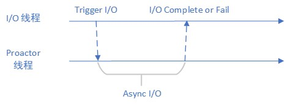
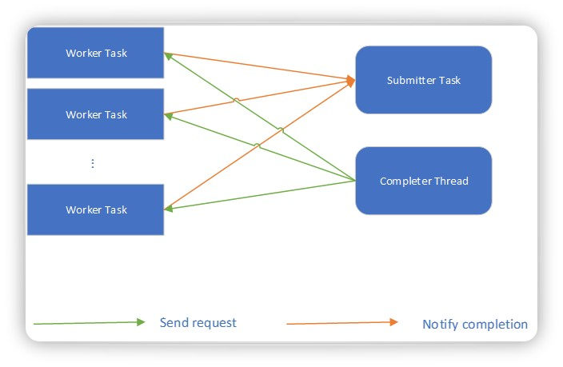

# Datenlord | io_uring Rust 异步库实现方法

作者：施继成 / 后期编辑：张汉东

---

## 简介

io_uring 是 Linux 最新的异步 I/O 接口，采用两个用户和内核共享的 ring buffer 进行交互，性能优于之前的接口且限制更少。虽然 io_uring 仍然处于开发迭代中，但是基本的 I/O 接口已经基本定型，作为高效系统语言的 Rust 则成为使用该接口的不二之选。现在已经有许多针对 io_uring 的 Rust 封装，但是有的存在soundness问题，有的存在性能问题，都不是安全高效 I/O 的好选项。我们团队（DatenLord）也进行了自己的尝试，本文就是介绍我们的 io_uring 异步库实现方法。

## Rust 现有异步模式

Rust 的异步库都有自己的异步 I/O 实现方法，但是内部原理大同小异，都是 Reactor 模式，如下图所示:


Worker 线程将关注的 fd 注册到 Epoll 等待队列中，Reactor 线程通过 Epoll wait 等待可以进行操作的 fd，当有 fd 可以操作时，Reactor 线程通知 Worker 线程进行真正的 I/O 操作。在此过程中，Reactor 线程仅仅起到等待和通知的作用，并不真正进行 I/O 操作，并且这里的 I/O 接口仍然是同步 I/O 接口。这种模式就好比请人帮忙烧开水，但是泡茶的过程还是自己亲自来。

Reactor 模式中，内存 buffer 一直在用户的控制下，在进行真正的 I/O 操作发生前，随时可以cancel正在等待的请求，因此Reactor 模式中不存在内存data race的情况，接口也就顺势使用了 reference，及借用机制。接口示例如下：

```rust
fn read<'a>(&'a mut self, buf: &'a mut [u8]) -> ImplFuture<'a, Result<usize>>
```

## io_uring Rust 底层封装

io_uring 的官方库只有 C 语言版本及 [liburing](https://github.com/axboe/liburing)，因此 Rust 异步封装之前必须有一套可用的 Rust 底层封装。这一层封装大家有不同的选择：有的选择自己从头实现，如 tokio 的 [io-uring](https://github.com/tokio-rs/io-uring)；我们的选择则是复用 liburing，先进行一层binding，然后在进行一层面向对象的封装，抽象出 SQ，CQ 和 Register 等，这一层抽象借鉴的 tokio 的 io-uring。前一种方法对实现具有更强的控制力，后一种方法则降低了维护成本。无论哪一种方法，最终的目的和效果是一样的——搭建脚手架，为异步封装扫平障碍。

## io_uring 异步模式

io_uring 和 Rust 现有异步模型不同，该异步操作是由操作系统完成的，并不需要用户线程参与，该工作方式非常适合 Proactor 模式。下图为 Proactor 模式示意图：



根据图中所示，异步操作由 Proactor 线程完成，更准确说是由 Proactor 线程提交 I/O 任务给内核，等内核完成了 I/O 操作再讲结果通知给 Worker 线程。和 Reactor 模式相比，Proactor 为用户完成了更多的任务，这就好比请人帮忙把烧水和泡茶的活一起干了，直接喝茶就行。

## io_uring Proactor 设计

在决定了采用 Proactor 模式来完成 io_uring 之后，我们还需要考虑 io_uring 自己的特性。io_uring 在设计的时候只考虑了一个线程一个io_uring实例，因此无论是内核接口还是libfuse的封装接口都不易实现多线程并发访问。基于这个考虑，有两个方法解决，第一个方法为 io_uring 操作上锁，也就是间接的将多线程并发操作串行化；第二个方法为只用单线程进行 io_uring 操作，其他任务给该线程提交任务。[ringbahn](https://github.com/tokio-rs/io-uring) 采用了第一种方法，我们采取了第二种方法。第二种方法的好处在于，可以将连续的多个 I/O 操作一次提交，在繁忙的系统中能够提高性能。

下图为我们的架构设计：



在我们的设计中，所有的Worker Task通过全局的channel向 Submitter Task 提交 I/O 任务，当没有 I/O 任务时Submitter Task 会在等待在该 channel 上，而当请求繁忙时 Submitter Task 会打包多个任务一次性提交。Completer Thread 会收取 ring 上完成的任务，并且唤醒等待这些任务的 Worker Task。

单个 io_uring 实例同时处理的 I/O 请求数目是有上限的，如果完成的任务不及时接收则会出现丢失的情况，因此我们维护了一个全局计数器来统计正在被处理的 I/O 请求数目，当数目达到上限时则会挂起 Worker Task 让其等待。

## 内存安全

Rust 语言的内存安全要求不能出现 data race 和 use after free 的情况，而 io_uring 的使用模型则存在现在的风险。操作系统会异步地操作内存 buffer，这块 buffer 如果被用户同步操作测会出现 data race 的情况。因此被Proactor 线程占用的内存必须独占，否则任何被取消的 I/O 操作都会导致内存被用户态同时使用。

为了达到上述目的，Reactor 的基于 reference 的接口不能被使用，需要采用新的接口，如下所示：

```rust
pub async fn read(
    fd: RawFd,
    buffer: Vec<u8>,
    count: usize,
    offset: isize,
) -> (io::Result<usize>, (RawFd, Vec<u8>)) 
```
在该接口中用户会在 I/O 操作过程中交出 buffer 所有权，在任务完成时返还 buffer 所有权。

## 总结

现有的 Rust 异步 I/O 模型（Reactor）其实分为两步，第一步由操作系统通知用户哪些 fd 可以使用，第二步再由用户完成 I/O 操作，操作系统仅仅负责通知，真正干活的还是用户自己。区别于该 I/O 模型，io_uring 的 I/O 模型为 Proactor，所有的异步 I/O 请求都是操作系统来完成，用户仅仅需要发送请求和接收结果。

我们 DatenLord 团队在充分考虑了 io_uring 特点和 Rust 语言的需求后实现了一个 io_uring 的异步库。这个库同时照顾到性能和易用性，方便用户迁移现有代码，同时该库不依赖于任何一部框架，可以和绝大多数已知的异步框架一起使用。此[链接](https://github.com/datenlord/datenlord/tree/master/async_fuse/src/proactor
)为该库的代码地址，欢迎大家提交 PR 和 issue，帮助进一步完善功能。