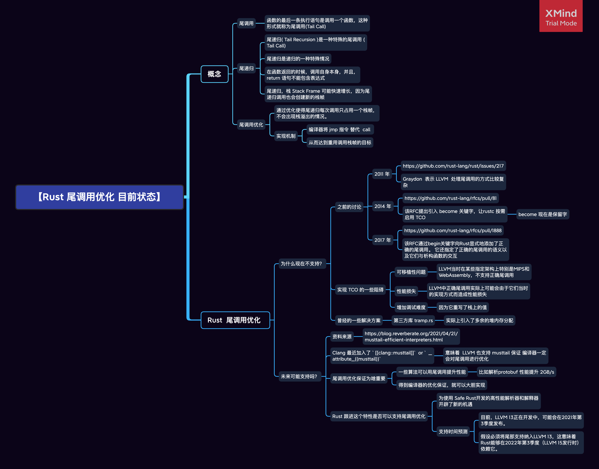

# 社区热点

编辑：张汉东

---

## 【RFC】Rust : Linux 内核的第二语言 

以下是 RFC 的一些摘要：

We believe that, even today, the advantages of using Rust outweighs the cost.

内核中支持 Rust 去编写驱动和一些类似 “叶子” 模块，而不打算用 Rust 重写内核核心和内核子系统。

### 在 Linux 内核中对 使用 Rust  的期望：

1. 用 Rust 新编写的代码能降低内存安全/ 数据竞争 / 逻辑 Bug 的风险
2. 维护人员对 重构和 接受模块补丁 更有信心
3. 新的驱动程序和模块变得更容易编写
4. 使用新的现代的语言，吸引更多的人参与内核开发
5. 通过利用Rust工具，建立的文档指南。 例如，要求记录所有公共API，安全前提条件，“Unsafe”块和类型不变式。

### Rust与C相比也有缺点：

- 围绕内核开发的 C 语言工具有很多年的积累，但是，如果内核 Rust 使用量上来，也会有相应工具。
-  Rust 基于 LLVM 的单一实现。目前通过第三方的努力来改善这种情况，比如 GCC 前端，基于 Cranelift 的 rust 后端，以及减少 bootstrapping chain 的 mrustc。
- 未标准化。虽然尚不清楚标准化是否会对内核有利，但在任何情况下都有几点可以最小化此问题：Rust稳定性承诺，广泛的文档，WIP参考，详细的RFC等。
- 编译速度太慢。
- 目前需要一些 nightly 功能，目标是一年内帮助 rustc 稳定这些功能，或者是，找到替代的稳定的功能。在这里维护相关报告：https://github.com/Rust-for-Linux/linux/issues/2
- 其他。

「 我们认为Rust很可能会就像C一样，成为系统编程的重要组成部分」 

### 关键设计选择

1. Rust内核模块需要一些共享代码，即
通过配置选项（`CONFIG_RUST`）启用。这使得
单个模块更小。此支持包括：
   - Rust 标准库。当前包含了 alloc 和 core，未来可能仅有 core 的子集。
  - 包装内核API  的 安全抽象 API，目的是为了让 Rust 编写的模块中尽可能减少 Unsafe 代码的数量。
- 其他。 例如“模块！”过程宏，编译器内置函数，生成的绑定和帮助程序等。

2. 用Rust编写的模块永远不要直接使用C内核API。在内核中使用Rust的全部要点是，我们开发了安全的抽象，因此模块更易于推理，因此更易于查看，重构等  。此外，通过“ bindgen”（正式的Rust工具）即时生成与内核C端的绑定。使用它可以避免在Rust方面更新绑定。

3. 在Rust代码库中，大多数文档都是在Markdown中与源代码一起编写的。我们遵循此约定，因此尽管在`Documentation / rust /`中有一些常规文档，但大多数实际文档都在源代码本身中。

强制执行自动代码格式，使用 clippy/ fmt 等。例如，这意味着4个空格用于缩进，而不是制表符。我们认为重要的是保持格式自动化。

4. 为避免将GPL符号公开为非GPL（甚至间接），将内核中的所有Rust支持符号导出为GPL。

### 目前状态

目前提供的 Rust 支持是实验性的，因为还有很多细节需要完善，比如内核API需要安全抽象等。但是，现在可以编写一些模块等原型了。

目前支持 Clang 构建内核，支持 x86_64，arm64和`ppc64le`等衍生架构，以及 RISC-V等。

### 上游计划

与往常一样，尽早进入主线是解决所有遗漏细节的最佳方法，但是，我们何时提交它们取决于我们收到的有关此RFC的反馈以及高层维护者的总体看法。

我们希望得到反馈的另一个主题是 kernel crate： https://rust-for-linux.github.io/docs/kernel/

### 相关链接

https://lkml.org/lkml/2021/4/14/1023

仓库地址：https://github.com/Rust-for-Linux/linux

## Linus 对 Rust 进内核给出了珍贵的指导意见

```text

So I replied with my reactions to a couple of the individual patches, but on the whole I don't hate it.

HOWEVER.

I do think that the "run-time failure panic" is a fundamental issue.

I may not understand the ramifications of when it can happen, so maybe it's less of an issue than I think it is, but very fundamentally I think that if some Rust allocation can cause a panic, this is simply fundamentally not acceptable.

Allocation failures in a driver or non-core code  and that is by definition all of any new Rust code can never EVER validly cause panics. Same goes for "oh, some case I didn't test used 128-bit integers or floating point".

So if the Rust compiler causes hidden allocations that cannot be caught and returned as errors, then I seriously think that this whole approach needs to be entirely NAK'ed, and the Rust infrastructure - whether at the compiler level or in the kernel wrappers - needs more work.

So if the panic was just some placeholder for things that _can_ be caught, then I think that catching code absolutely needs to be written, and not left as a to-do.

And if the panic situation is some fundamental "this is what the Rust compiler does for internal allocation failures", then I think it needs more than just kernel wrapper work - it needs the Rust compiler to be *fixed*.

Because kernel code is different from random user-space system   tools. Running out of memory simply MUST NOT cause an abort.  It needs to just result in an error return.

I don't know enough about how the out-of-memory situations would be triggered and caught to actually know whether this is a fundamental problem or not, so my reaction comes from ignorance, but basically the rule has to be that there are absolutely zero run-time "panic()" calls. Unsafe code has to either be caught at compile time, or it has to be handled dynamically as just a regular error.

With the main point of Rust being safety, there is no way I will ever accept "panic dynamically" (whether due to out-of-memory or due to anything else - I also reacted to the "floating point use causes dynamic panics") as a feature in the Rust model.

           Linus

```

详细：[https://lkml.org/lkml/2021/4/14/1099](https://lkml.org/lkml/2021/4/14/1099)

## Google: Linux 内核中使用 Rust

Google 发布的这篇博文中宣布支持 Rust ，并且还给出一个驱动开发示例来对比 Rust 和 C 。

[https://security.googleblog.com/2021/04/rust-in-linux-kernel.html](https://security.googleblog.com/2021/04/rust-in-linux-kernel.html)

## 字节码联盟成为非营利组织并且迎来新成员

字节码联盟（Bytecode Alliance）成为了 501(c)(6) 非营利组织，并且有新成员加入 Arm, DFINITY Foundation, Embark Studios, Google, Shopify, 和 University of California at San Diego 。

**一直以来的工作：**

1. 推动 nanoprocess 并推动标准化，包括 WASI/ Interface Types/Module Linking等。
2. Cranelift WebAssembly编译器创建了一个新的代码生成后端，重点关注性能和安全性。这个新的后端是由Fastly，Mozilla，Intel和Arm之间紧密合作创建的，现在是Wasmtime和Lucet的默认后端，并且Fastly最近对该技术进行了全面的安全评估，并为 Compute @ Edge 切换到了这个新后端。
3. 改进了协作流程；例如，引入了RFC流程来提高可见性，并能够集中讨论我们核心项目的重大变化

**未来社区治理**

我们欢迎新成员加入字节码联盟。 在加入新成员的同时，在接下来的几个月中，我们将为技术指导委员会（TSC）和董事会全面定义章程，作为引导阶段的一部分。 在此期间结束时，我们将组织理事会和TSC选举，以全面建立Bytecode Alliance的开放治理模型。 更多细节将在不久的将来出现。

[https://bytecodealliance.org/articles/bytecode-alliance-update](https://bytecodealliance.org/articles/bytecode-alliance-update)


## Rust 在过去一年中是增长最快的语言之一

SlashData指出，Rust和Lua是过去12个月中增长最快的两个编程语言社区，尽管其基础比Python低。

Rust并未得到广泛使用，但今年它的社区走出了Mozilla的阴影，并创建了自己的Rust Foundation，该基金会得到了Amazon Web Services，Microsoft Azure，Google和Mozilla的支持。

Google力求Rust成为Linux内核的第二种语言，并使用它为Android操作系统编写新代码，因为它的内存安全性保证有助于避免内存错误。 开发人员还赞赏Rust的Crates软件包管理系统。

[https://www.zdnet.com/article/programming-languages-javascript-has-most-developers-but-rust-is-the-fastest-growing/](https://www.zdnet.com/article/programming-languages-javascript-has-most-developers-but-rust-is-the-fastest-growing/)

## 整理了一下 Rust 尾调用优化的状态



起因是 reddit 上面看到一篇帖子，作者说他看到 Clang 加了一个` [[clang::musttail]]` 属性，可以保证编译器对尾调用的优化，意味着 LLVM后端 目前应该也支持了尾调用优化的保证，那 Rust  是不是就离支持 尾调用优化不远了呢？


[https://www.reddit.com/r/rust/comments/my6k5i/are_we_finally_about_to_gain_guaranteed_tail/](https://www.reddit.com/r/rust/comments/my6k5i/are_we_finally_about_to_gain_guaranteed_tail/)

参考：

[https://blog.reverberate.org/2021/04/21/musttail-efficient-interpreters.html](https://blog.reverberate.org/2021/04/21/musttail-efficient-interpreters.html)

[https://dev.to/seanchen1991/the-story-of-tail-call-optimizations-in-rust-35hf](https://dev.to/seanchen1991/the-story-of-tail-call-optimizations-in-rust-35hf)

## Rust OSDev 发布 2021 年 3 月简讯

Rust OSDev 组织是 Blog OS 系列文章作者创建，维护着一些 OS 相关项目。

- [https://rust-osdev.com/this-month/2021-03/](https://rust-osdev.com/this-month/2021-03/)
- [https://github.com/rust-osdev/about](https://github.com/rust-osdev/about)

## GCC Rust 发布第四期月报

GCC Rust成为了 Google Summer of Code 2021 指导组织的一员，吸引了来自世界各地的一些对编译器开发感兴趣的学生。

此编译器的长期目标是前端可以与GCC分离，并成为自己的项目（同时保持GCC版权分配），这就是为什么我们使用rust-gcc.cc分支的原因 go-gcc.cc通用抽象。

更多：

- [https://github.com/Rust-GCC/gccrs/wiki/Google-Summer-of-Code](https://github.com/Rust-GCC/gccrs/wiki/Google-Summer-of-Code)
- [https://thephilbert.io/2021/04/02/gcc-rust-monthly-report-4-march-2021/](https://thephilbert.io/2021/04/02/gcc-rust-monthly-report-4-march-2021/)

## mrustc 支持 Rust 1.39.0

1. mrustc 是一个 基于 Cpp 的 Rust 编译器的替代实现，最终目标是成为一个单独的重新实现。
2. 目前官方 rustc 版本为 1.51.0 。

[https://github.com/thepowersgang/mrustc/](https://github.com/thepowersgang/mrustc/)

## Flott 月报发布

Flott 是基于 Rust 实现的运动控制软件的工具包。

Flott的目的是通过提供库来简化运动控制软件的开发，这些库可以抽象出通常用于运动控制的硬件，例如电动机，编码器以及其他传感器和执行器。

上个月看到了通用步进电机接口步进器（Stepper）的新版本。 还发布了Stepper Terminal，这是一个基于Stepper的新应用程序，用于从计算机上的命令行控制步进电机。

- [https://flott-motion.org/news/last-month-in-flott-april-2021/](https://flott-motion.org/news/last-month-in-flott-april-2021/)
- [https://github.com/flott-motion](https://github.com/flott-motion)

## 社区雄文：Rust 是为专业程序员准备的

专业的程序员通过创作和维护可解决问题的软件来创造价值。 （专业程序员还有其他重要的方式可以交付价值，但是本文是关于编程的。）

程序员依靠各种工具来编写软件。 可以说，最重要和最重要的工具选择是编程语言。

在这篇文章中，作者将阐明为什么他相信Rust对于软件专业人员来说是一种非常引人注目的编程语言选择。 简而言之，他希望说服你学习和部署Rust。

[https://gregoryszorc.com/blog/2021/04/13/rust-is-for-professionals/](https://gregoryszorc.com/blog/2021/04/13/rust-is-for-professionals/)


## Tokio 发布 io_uring 设计方案

该 RFC 提出了一个新的异步Rust运行时，它由`io-uring`作为新的 Crate 支持：[tokio-uring](https://github.com/tokio-rs/tokio-uring)。 该API的目的是尽可能接近惯用的Tokio，但在必要时会有所偏离，以提供对io-uring功能的完全访问权限。 它还将与现有的Tokio库兼容。 运行时将使用隔离的每核线程模型，并且许多类型将是`!Send`。

[https://github.com/tokio-rs/tokio-uring/pull/1](https://github.com/tokio-rs/tokio-uring/pull/1)

## Starlark -- Facebook 用 Rust 重新实现了 Starlark 这门编程语言

Starlark 是 Google 开发的类似于 Python3 的一门编程语言，主要用在 Google 自己的构建工具 Bazel 和 Facebook 的构建工具 Buck 中。Starlark 目前有三种实现，一种是 Go，一种是 Java，另外一种就是现在这个项目，使用 Rust 实现。Rust 的初版是 Google 实现的，现在给了 Facebook。Rust 实现包括了完整的 parser，evaluator，linter 和 debugger。对编程语言感兴趣的朋友可以看看。

- [https://developers.facebook.com/blog/post/2021/04/08/rust-starlark-library/](https://developers.facebook.com/blog/post/2021/04/08/rust-starlark-library/)
- [https://github.com/facebookexperimental/starlark-rust](https://github.com/facebookexperimental/starlark-rust)

## enso 编程语言发布 2.0

enso 是一种可视化编程语言，同时也支持支持 Java、Python、R、JavaScript。使用 Rust 和 Java 编写。

[https://github.com/enso-org/enso](https://github.com/enso-org/enso)

## 42 个在生产环境使用 Rust 的公司

[https://kerkour.com/blog/rust-in-production-2021/](https://kerkour.com/blog/rust-in-production-2021/)

## Google 提供资金，ISRG 联合 Rustls 作者和 GoogleOSS 对 Rustls 进行改进

改进包括：

1. 强制执行免恐慌（no-panic policy）策略，以消除在C语言边界上使用Rustls时出现未定义行为的可能性。
2. 改进C API，以便Rustls可以更轻松地集成到现有的基于C的应用程序中。将C API合并到主要的Rustls存储库中。
3. 添加对验证主题备用名称扩展中包含IP地址的证书的支持。
4. 使基于客户端输入来配置服务器端连接成为可能。

目前已经完成了curl和Apache httpd 中集成 rustls，未来希望在 Let's Encrypt 中 用 Rustls 取代 OpenSSL 和其他不安全的TLS库

[https://www.abetterinternet.org/post/preparing-rustls-for-wider-adoption/](https://www.abetterinternet.org/post/preparing-rustls-for-wider-adoption/)

##  寻找 Rust  工作是一种痛

Reddit 上面有人发帖问，有没有区块链之外的Rust工作？ 

看来 Rust  工作不好找，不只是 国内的问题。

评论区有人回复摘录：

> 70%的 Rust 职位是很区块链相关的，他之前找过一个 非区块链 Rust 后端工作，但是不久之后就变成 Go 了。。。

> 如果每个人都只是寻找Rust工作，而不是将现有公司代码转换为Rust，那么就不会有Rust工作。

>  还有人直接在评论区招聘，视频流/webrtc 相关职位

> 有人一直在寻找 Rust 工作，并为此付出一些代价。比如专门去寻找适合 一个人开发的 工作，这样就有机会选择 Rust ，最终让他找到了工作机会，一家视频游戏公司，围绕unity开发一些工具，最终目标是从他们的工作流中干掉unity

> 也有一个电力行业的人说他们会在今年夏天发布一些 Rust 职位

> 还有一家 科学仪器设计和生产商在使用 Rust ，其中一种仪器在每个实验中收集了几Tb的图像数据，这些数据使用rust编写的代码进行处理和分析。

>  如果您对计算机视觉/零售结帐感兴趣，请访问https://standard.ai。在过去的几年中，很大一部分生产堆栈已从python / cython迁移到rust。 尽管一些后端和研究团队将长期使用python，但目前它在很大程度上是使用 Rust 的。


> 有人直接发了 JD ，是完全远程的工作，国内也可以看看。 https://www.showseeker.com/backend-developer 

如有任何问题，请联系官方发贴电


相比国外，国内 Rust 岗位虽然不多，但也是有的。

[https://www.reddit.com/r/rust/comments/n05zhh/looking_for_a_rust_job_is_pain/](https://www.reddit.com/r/rust/comments/n05zhh/looking_for_a_rust_job_is_pain/)

## 用Rust重写Tensorbord部分组件带来了100x到400x的速度提升

相比原先Python和C++混合，使用大量的锁和跨语言交互的数据读取器， 在使用了Rust编写的专用进程进行数据读取后，性能提升了100x到400x。

- 相关 Issue: [https://github.com/tensorflow/tensorboard/issues/4784](https://github.com/tensorflow/tensorboard/issues/4784)
- 阅读更多：[https://www.reddit.com/r/rust/comments/mzlg5s/parts_of_tensorboard_are_being_rewritten_in_rust/](https://www.reddit.com/r/rust/comments/mzlg5s/parts_of_tensorboard_are_being_rewritten_in_rust/)

## Rust 生态贡献者 排名

[https://www.johndbeatty.com/rustaceanrank.html](https://www.johndbeatty.com/rustaceanrank.html)