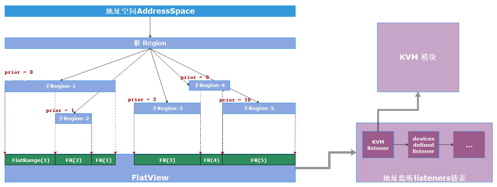
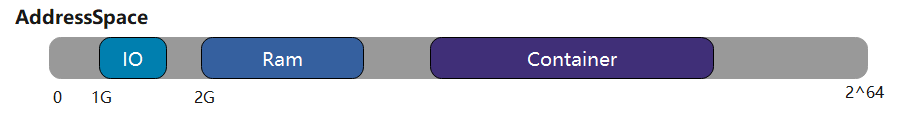
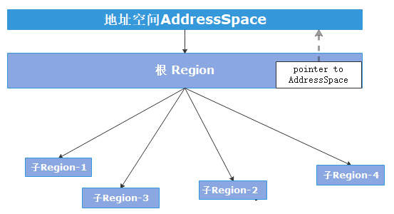

# 华为 | StratoVirt 地址空间管理-基于Rust的实现与优化

作者：杨晓鹤 / 后期编辑： 张汉东

上一篇： [华为 | 基于Rust的下一代虚拟化平台-StratoVirt](../chapter_3/hw_rust_stratovirt.md)

---

StratoVirt是开源在openEuler社区的轻量级虚拟化平台，具备轻量低噪、强安全性的行业竞争力。StratoVirt进程运行在用户态，在虚拟机启动之前， StratoVirt会完成启动之前的准备工作，包括虚拟机内存初始化、CPU寄存器初始化、设备初始化等。其中，内存初始化工作和虚拟机的地址空间管理， 都是由StratoVirt的地址空间管理模块`AddressSpace`完成。如下是StratoVirt地址空间管理模块的组成，以及其在StratoVirt中的位置。

```
stratovirt
├── address_space
│   ├── Cargo.toml
│   └── src
│       ├── address.rs
│       ├── address_space.rs
│       ├── host_mmap.rs
│       ├── lib.rs
│       ├── listener.rs
│       └── region.rs
├── boot_loader
├── Cargo.lock
├── Cargo.toml
├── cpu
├── devices
├── machine_manager
├── micro_vm
├── src
│   └── main.rs
├── sysbus
├── util
└── virtio
```


## StratoVirt 地址空间模块整体设计




上图中的主要结构含义如下：

* `AddressSpace`

  地址空间：为地址空间模块的管理结构， 负责整个虚拟机的地址空间管理

* `Region`

  

  代表一段地址区间，根据这段地址区间的使用者，可以分为以下类型：

  1. RAM： 虚拟机内存使用该段地址区间。

  2. IO： 虚拟机设备使用该段地址区间。
  3. Container ： 作为容器使用，可以包含多个子`Region`。如描述PCI总线域的地址管理就可以使用类型为`Container`的`Region`，它可以包含PCI总线域下的PCI设备使用的地址区间。该类型的`Region`可以帮助管理并区分存储器域、PCI总线域的地址管理。


地址空间模块的设计，采用树状结构和平坦视图结合的方案。通过树状结构可以快速的了解到各个Region之间的拓扑结构关系。这种分层、分类的设计， 可以管理并区分存储器域与PCI总线域的地址管理，并形成与PCI设备树相呼应的树状管理结构。对于平坦视图`FlatView`，则是根据这些`Region`的地址范围和优先级属性形成的线性视图。在通过地址空间管理结构`AddressSpace`访问设备或者内存时， 使用平坦视图`FlatView`可以更加方便快捷地找到对应的`Region`。

在树状拓扑结构中，每个`Region`都会对应一个优先级`priority`属性，如果低优先级的`Region`占用的地址区间和高优先级的`Region`占用的地址区间重叠，则低优先级的`Region` 的重叠部分，将会被覆盖，即在平坦视图`FlatView`中不可见。


树状拓扑结果的更新，很大可能会带来平坦视图`FlatView`的更新。一些设备或者模块需要获取最新的平坦视图，并相应的执行一些操作。例如Vhost设备，需要将平坦视图中的全部内存信息同步到内核Vhost模块，以便通过共享内存方式完成消息通知的流程。另外，我们也需要将已经分配并映射好的虚拟机物理地址和宿主机虚拟地址信息注册到KVM模块，这样可以借助硬件辅助虚拟化加速内存访问的性能。基于以上需求，我们引入上图中的地址空间监听函数链表，该链表在平坦视图`FlatView`更新后被依次调用，可以方便的完成信息同步。该链表允许其他模块添加一个自定义的监听回调函数。


## 地址空间优化

作为StratoVirt的基础模块和访问密集型的模块， 地址空间模块不仅要满足接口易用性、功能鲁棒性，而且需要不断优化性能。 如下是迭代过程中的几个优化点。

###  拓扑结构更新优化

地址空间管理模块提供向树状拓扑结构中添加和删除`Region`的接口，并设定`AddressSpace`结构负责管理整个数据结构并生成更新后的`FlatView`结构。

添加子`Region`的方式为， 调用`Region`结构的`add_subregion`接口，注意父`Region`必须是`Container`类型。这样会带来一个问题，如果向树状结构中的某个`Region`中添加或者删除子`Region`，并引起树状结构的拓扑发生变化，负责生成并更新平坦视图的`FlatView`的`AddressSpace`结构体如何得知已经发生变化呢？



最简单的实现为在`Region`结构中添加成员并指向自己所属的`AddressSpace`，如上图所示。熟悉Rust语言的同学应该知道，这种实现方式会引入资源相互引用的问题，导致`AddressSpace`和`Region`两者因相互引用而在生命周期结束时无法释放内存资源的问题。因此，在地址空间模块的树状结构中，所有 `Region`对自己所属的`AddressSpace`的指针都使用`std::sync::Weak`类指针，`Weak`指针不会增加所指向对象的引用计数，可确保在生命周期结束时对应结构的析构和资源释放。

```rust
pub struct Region {
    region_type: RegionType,
    priority: Arc<AtomicI32>,
    size: Arc<AtomicU64>,
    offset: Arc<Mutex<GuestAddress>>,
    mem_mapping: Option<Arc<HostMemMapping>>,
    ops: Option<RegionOps>,
    io_evtfds: Arc<Mutex<Vec<RegionIoEventFd>>>,
    space: Arc<RwLock<Weak<AddressSpace>>>,
    subregions: Arc<RwLock<Vec<Region>>>,
}
```


### 锁优化

#### 锁粒度最小化

为增加接口的易用性，地址空间模块的设计必须保证多线程安全性，作为主要接口的`AddressSpace`结构体如下。可以看到，`AddressSpace`的关键成员都以`Arc<Mutex<..>>`的方式保证了多线程共享的安全性。

```rust
pub struct AddressSpace {
    root: Region,
    flat_view: ArcSwap<FlatView>,
    listeners: Arc<Mutex<Vec<Box<dyn Listener>>>>,
    ioeventfds: Arc<Mutex<Vec<RegionIoEventFd>>>,
}
```

地址空间空间管理在设计时将锁的粒度最小化，目的是降低多线程数据竞争带来的影响。


#### 锁性能优化

```rust
// AddressSpace优化前结构
pub struct AddressSpace {
    root: Region,
    flat_view: Arc<RwLock<FlatView>>,
    listeners: Arc<Mutex<Vec<Box<dyn Listener>>>>,
    ioeventfds: Arc<Mutex<Vec<RegionIoEventFd>>>,
}
```


对于地址空间管理模块的关键数据结构，代表平坦视图的`FlatView`具有重要作用。其一，在树状拓扑结构发生变化时，例如添加和删除`Region`，会引起平坦视图`FlatView`发生变化，因此应该获取`AddressSpace`中`flat_view`成员的**写锁**，用于更新平坦视图；其二，设备访问内存、VCPU退出到StratoVirt访问设备，都要通过`AddressSpace`的`flat_view`成员，获取**读锁**，找到对应的`Region`，然后进行读写操作。

但是，使用Rust读写锁`RwLock`仍然存在连个问题：其一，经过测试，Rust读写锁的性能比互斥锁差。而读写锁和互斥锁的性能均比原子类型差；其二，在某些场景下，地址空间管理模块需要实现**函数可重入**的支持，即 在持有`FlatView`读锁的情况下，仍可以对树状拓扑结构和平坦视图`FlatView`更新（例如，PCI bar空间更新，需要通过`AddressSpace`访问设备寄存器来设置地址，并将确定好地址的PCI bar空间添加到`AddressSpace`中）。


基于上述问题和场景要求，使用Rust中的读写锁和互斥锁都会带来问题。而RCU锁不但能满足多读者、少写者的并发情况，而且能允许读写同时进行的要求。通过自行实现和已有第三方库的调研，最终我们选用`arc_swap`第三方库的RCU-like的机制，不但可以满足可重入性的要求，而且通过地址空间模块访问内存的性能可以提升20%以上。

```rust
pub struct AddressSpace {
    root: Region,
    flat_view: ArcSwap<FlatView>,
    listeners: Arc<Mutex<Vec<Box<dyn Listener>>>>,
    ioeventfds: Arc<Mutex<Vec<RegionIoEventFd>>>,
}
```


## 关注我们

StratoVirt当前已经在openEuler社区（openEuler是一个开源、免费的Linux发行版平台，将通过开放的社区形式与全球的开发者共同构建一个开放、多元和架构包容的软件生态体系）开源。在未来的一段时间我们将开展一系列主题的分享，让大家更加详细的了解StratoVirt实现，非常期待您的围观和加入！

项目地址：https://gitee.com/openeuler/stratovirt

项目wiki：https://gitee.com/openeuler/stratovirt/wikis

项目交流：[virt邮件列表](https://mailweb.openeuler.org/postorius/lists/virt.openeuler.org/)或是提交一个[issue](https://gitee.com/openeuler/stratovirt/issues)。


