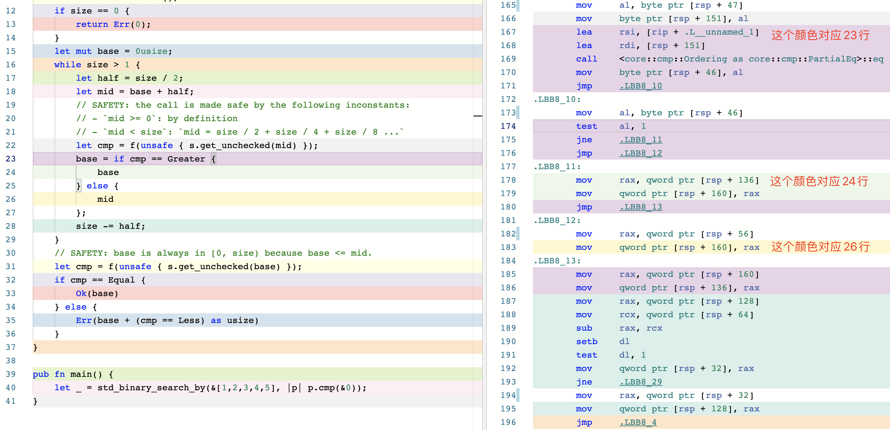
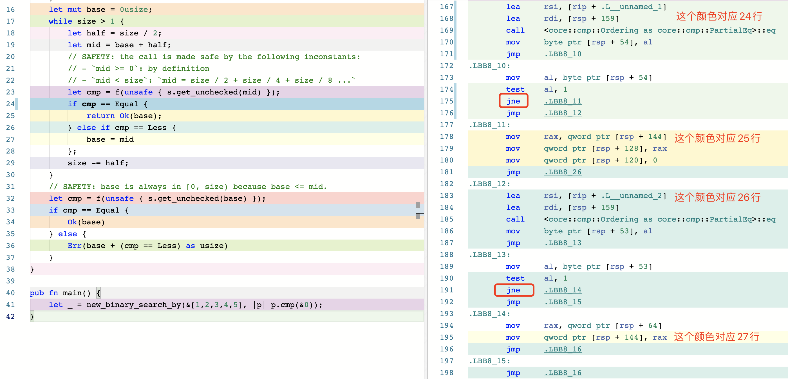
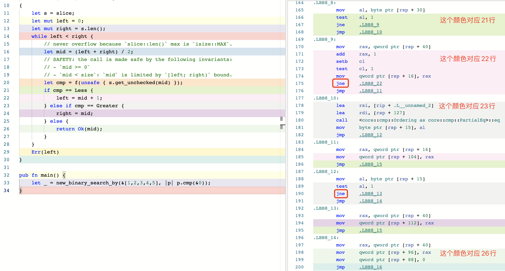

# 优化 Rust 标准库的 binary_search

2021 年 5 月 6 号发布的 Rust 1.52 版将会包含我的一个 PR，将标准库 `slice::binary_search_by()` 的最好时间复杂度优化到 **O(1)**。PR 编号 [#74024](https://github.com/rust-lang/rust/pull/74024)，从 2020 年 7 月初提交的 PR，到 2021 年 3 月 6 号才正式合并，其中包含 70 多条评论，前后历时大半年。这个 PR 虽然改动不算很大，但是笔者在其中也学到了不少知识点，所以特意写一篇文章总结一下，希望能帮助到大家。

首先看一下 [`slice::binary_search_by()`](https://doc.rust-lang.org/std/primitive.slice.html#method.binary_search_by) 这个方法的示例来了解一下它的用途。

```rust
let s = [0, 1, 1, 1, 1, 2, 3, 5, 8, 13, 21, 34, 55];

let seek = 13;
assert_eq!(s.binary_search_by(|probe| probe.cmp(&seek)), Ok(9));
let seek = 4;
assert_eq!(s.binary_search_by(|probe| probe.cmp(&seek)), Err(7));
let seek = 100;
assert_eq!(s.binary_search_by(|probe| probe.cmp(&seek)), Err(13));
let seek = 1;
let r = s.binary_search_by(|probe| probe.cmp(&seek));
assert!(match r { Ok(1..=4) => true, _ => false, });
```

这个函数的作用就是在给定的有序 slice 中二分查找目标值 `seek`。如果找到了返回 `Ok(pos)`，`pos` 即目标值所在的位置；没找到则返回 `Err(pos)`, 这里的 `pos` 的位置可以用来将 `seek` 插入 slice 后依然保持有序。其他的 `slice::binary_search()`，`slice::binary_search_by_key()` 系列方法都是调用这个 `slice::binary_search_by()`，这里不再赘叙。

但是，1.52 之前的实现有一个小问题，如果 slice 中存在多个连续的目标值，则它会一直找到最后一个才返回，所以最好时间复杂度也是 `O(log n)`，而不是 `O(1)`，也就是找到了就马上返回。这是 1.52 之前的代码：

```rust
#[stable(feature = "rust1", since = "1.0.0")]
#[inline]
pub fn binary_search_by<'a, F>(&'a self, mut f: F) -> Result<usize, usize>
where
    F: FnMut(&'a T) -> Ordering,
{
    let s = self;
    let mut size = s.len();
    if size == 0 {
        return Err(0);
    }
    let mut base = 0usize;
    while size > 1 {
        let half = size / 2;
        let mid = base + half;
        // SAFETY: the call is made safe by the following inconstants:
        // - `mid >= 0`: by definition
        // - `mid < size`: `mid = size / 2 + size / 4 + size / 8 ...`
        let cmp = f(unsafe { s.get_unchecked(mid) });
        base = if cmp == Greater { base } else { mid };
        size -= half;
    }
    // SAFETY: base is always in [0, size) because base <= mid.
    let cmp = f(unsafe { s.get_unchecked(base) });
    if cmp == Equal { Ok(base) } else { Err(base + (cmp == Less) as usize) }
}
```

既然我们发现这个问题了，很简单，我们在 `while` 循环中判断 `cmp == Equal` 不就行了？如果相等就直接返回 `Ok`，否则继续二分去查找。

```rust
while size > 1 {
    let half = size / 2;
    let mid = base + half;
    // SAFETY:
    // mid is always in [0, size), that means mid is >= 0 and < size.
    // mid >= 0: by definition
    // mid < size: mid = size / 2 + size / 4 + size / 8 ...
    let cmp = f(unsafe { s.get_unchecked(mid) });
    if cmp == Equal {
        return Ok(base);
    } else if cmp == Less {
        base = mid
    };
    size -= half;
}
```
> 为了简洁性，这里（包括后面）都会适当省略重复代码。

嗯，看起来逻辑上没问题，单测也跑通过了，提交一个 PR，我们暂且叫它**优化(1)**。没过几天 [dtolnay](https://github.com/dtolnay) review 了我的 PR 并回复了：`Would you be able to put together a benchmark assessing the worst case impact? The new implementation does potentially 50% more conditional branches in the hot loop.`

确实，Rust 标准库对性能要求非常高，我们必须要有足够多 case 对新旧版本做 benchmark 对比，尽可能避免新的版本导致性能上的 regression。这是当时我做的 benchmark 数据：

```
// 标准库的实现
test slice::binary_search_l1           ... bench:          59 ns/iter (+/- 4)
test slice::binary_search_l1_with_dups ... bench:          59 ns/iter (+/- 3)
test slice::binary_search_l2           ... bench:          76 ns/iter (+/- 5)
test slice::binary_search_l2_with_dups ... bench:          77 ns/iter (+/- 17)
test slice::binary_search_l3           ... bench:         183 ns/iter (+/- 23)
test slice::binary_search_l3_with_dups ... bench:         185 ns/iter (+/- 19)
```

```
// 新版实现
test slice::binary_search_l1           ... bench:          58 ns/iter (+/- 2)
test slice::binary_search_l1_with_dups ... bench:          37 ns/iter (+/- 4)
test slice::binary_search_l2           ... bench:          76 ns/iter (+/- 3)
test slice::binary_search_l2_with_dups ... bench:          57 ns/iter (+/- 6)
test slice::binary_search_l3           ... bench:         200 ns/iter (+/- 30)
test slice::binary_search_l3_with_dups ... bench:         157 ns/iter (+/- 6)
```

可以看出来在 with_dups 模式（即重复元素较多）下，新的实现有很明显的提升，但是 l3 级别的普通模式性能反而要差很多。可能的原因正如 **dtolnay** 所说的 `The new implementation does potentially 50% more conditional branches in the hot loop`。那 `conditional branches` 具体是什么？为什么它在热循环中如此关键？这里引入这篇文章的第一个知识点：**分支预测**。

## 分支预测(Branch prediction)

**分支预测** (`branch prediction`) 是现代 CPU 为了加快指令并行化速度在碰到分支时提前预测下一个可能执行的分支的一种技术。 CPU 中一般都内置专门的分支预测器 (Branch predictor)。强烈推荐先阅读 Stackoverflow 这个高赞回答 [Why is processing a sorted array faster than processing an unsorted array?](https://stackoverflow.com/questions/11227809/why-is-processing-a-sorted-array-faster-than-processing-an-unsorted-array)，里面比较清晰易懂的解释了分支预测是什么以及对性能带来的影响。关于**分支预测**完全可以写一篇专门的文章介绍了，我这里只把我学到的知识总结一下。

### 分支

首先我们要了解一下[**分支**](https://en.wikipedia.org/wiki/Branch_(computer_science))到底是指什么？在高级语言层面，很显然分支就是 `if/else/else if`，`goto` 或者 `switch/match` 这种语句。他们会转换成汇编代码中的 `jump` 指令。比如 x86 汇编的各种 `j` 开头的 `jump` 指令：

| 指令 | 作用 |
| ---- | ---- |
| jmp| Always jump |
| je | Jump if cmp is equal |
| jne | Jump if cmp is not equal |
| jg | Signed > (greater) |
| jge | Signed >= |
| jl | Signed < (less than) |
| jle | Signed <= |
| ja | Unsigned > (above)|
| jae | Unsigned >= |
| jb | Unsigned < (below) |
| jbe | Unsigned <= |
| jecxz | Jump if ecx is 0
| jc | Jump if carry: used for unsigned overflow, or multiprecision add |
| jo | Jump if there was signed overflow |

比如我们随便写一段包含 `if/else` 逻辑的代码，编译之后的汇编代码中就会包含类似的 `jump` 指令：

```rust
#![allow(unused_assignments)]
pub fn main() {
  // 接收用户从命令行中输入的参数
  let mut a: usize = std::env::args().nth(1).unwrap().parse().unwrap_or_defaul();
  if a > 42 { 
    a = 1;
  } else {
    a = 0;
  }
}
```

这段代码逻辑这么写主要是为了保持汇编指令的尽量简单。这里是对应的汇编代码，只保留了跟 `if/else` 有关的部分，完整的代码链接在这里：[https://rust.godbolt.org/z/ahcKcK1Er](https://rust.godbolt.org/z/ahcKcK1Er)。

```assembly
.LBB99_7:
        cmp     qword ptr [rsp + 56], 42 ; if a > 42
        jbe     .LBB99_10
        mov     qword ptr [rsp + 56], 1  ; a = 1
        jmp     .LBB99_11
.LBB99_10:
        mov     qword ptr [rsp + 56], 0  ; a = 0
.LBB99_11:
        add     rsp, 200
        ret
```

我在代码里面加了几条注释（汇编里面用分号注释）表明了该条指令对应的 Rust 代码，可以看出来 `jbe` 指令会判断是否跳转到 `.LBB99_10` 还是不跳转继续执行下面的 `mov`。

了解了分支是什么之后还不够，我们依然不知道具体是为啥 CPU 需要做分支预测。接下来我们需要了解一下另外一个概念：**指令流水线**。

### 指令流水线(instruction pipelining)

**指令流水线**是从 **instruction pipelining** 翻译过来的一个名词，主要是指为了提高单个处理器指令处理效率的一种技术，早在上个世纪 70 年代的芯片就有这种技术了。

CPU 处理一条指令一般要分为几个步骤：

- 取指令(Instruction Fetch)
- 解指令(Instruction Decode)
- 执行指令 (Execute)
- 回写结果到寄存器 (Register write back)

这非常类似工厂生产某件需要多道工序的商品一样。想象一下，如果工厂每次都是完整的按照工序把第一件商品生产出来之后再进行同样的步骤生产下一件商品的话，这个生产速度得多慢！所以 19 世纪人类就诞生了工业化的流水线，把所有这些工序分解并行化。第一件商品在工序(2)的时候，丝毫不影响第二件商品进入工序(1)。指令也完全可以这样，CPU 可以把指令执行过程流水线化，把不同的指令执行步骤分给不同的逻辑门 ([logic stage](https://en.wikipedia.org/wiki/Logic_gate))处理，第一条指令进入**解指令**阶段的时候，第二条指令就可以进入**取指令**阶段了。

Wikipedia 上的这张图可以帮助理解（图中文字颜色为黑色，推荐用 Light 主题查看）。


了解前面的这些概念之后，我们来看一下为什么 CPU 需要做分支预测？

### 为什么需要分支预测？

**指令流水线**会按照工厂流水线一样执行指令，这其中也包括前面讲的 **jump** 指令。而 **jump** 指令有一个问题就是它需要知道下一个时钟周期该跳转还是不跳转，而这需要等前面的判断逻辑执行完了之后才知道。比如上面的例子 **cmp** 判断完之后，`jump` 指令才能决定是跳转到 `.LBB99_10` 部分，还是不跳转继续执行下去。但是 CPU 指令流水线才不会等，否则白白的浪费一个时钟周期。所以人们发明了一种办法来避免出现这种问题，这就是**分支预测**。

CPU 的分支预测器会提前预测这条 **jump** 指令可能会跳转的到哪个分支，然后把预测的那条分支放到流水线中去执行。如果预测正确，CPU 可以继续执行后面的指令；如果预测失败了(branch misprediction)，那只能丢弃刚刚执行的分支结果，重新切换到正确的分支执行。可以看到，如果出现过多的预测失败，分支预测反而很影响性能。不过现在 CPU 的分支预测器经过这么多年的发展已经越来越先进了，人们会采用各种方式不断提高分支预测器的预测准确率，详细可以查看 Wikipedia 的 [Branch_predictor](https://en.wikipedia.org/wiki/Branch_predictor) 了解更多。


### 热循环中避免分支预测

虽然现代 CPU 都有分支预测器，但我们在软件层面依然要尽量避免发生分支预测，特别是在热循环中。最常用的优化方法就是避免在循环中写 `if/else` 语句，即 `branchless code`。标准库中有大量这种 `branchless code` 的案例来优化性能，比如 `std::collection::Filter` 的 `count()` 方法。

```rust
pub struct Filter<I, P> {
    iter: I,
    predicate: P,
}

impl<I: Iterator, P> Iterator for Filter<I, P>
where
    P: FnMut(&I::Item) -> bool,
{
    type Item = I::Item;

    // this special case allows the compiler to make `.filter(_).count()`
    // branchless. Barring perfect branch prediction (which is unattainable in
    // the general case), this will be much faster in >90% of cases (containing
    // virtually all real workloads) and only a tiny bit slower in the rest.
    //
    // Having this specialization thus allows us to write `.filter(p).count()`
    // where we would otherwise write `.map(|x| p(x) as usize).sum()`, which is
    // less readable and also less backwards-compatible to Rust before 1.10.
    //
    // Using the branchless version will also simplify the LLVM byte code, thus
    // leaving more budget for LLVM optimizations.
    #[inline]
    fn count(self) -> usize {
        #[inline]
        fn to_usize<T>(mut predicate: impl FnMut(&T) -> bool) -> impl FnMut(T) -> usize {
            move |x| predicate(&x) as usize
        }

        self.iter.map(to_usize(self.predicate)).sum()
    }
}
```

标准库的 `Filter` 类型在实现 `Iterator` 的时候重写了 `count()` 方法。想想如果我们没有意识到分支预测这个问题的情况下可能会这么实现：

```rust
// Bad
#[inline]
fn count(self) -> usize {
    let sum = 0;

    self.iter.for_each(|x| {
        if self.predicate(x) {
            sum += 1;
        }
    });
    
    sum
}
```

但这种实现在循环中有一个 `if` 语句，导致 CPU 需要进行大量的分支预测，而这些分支预测几乎都是随机的，CPU 很难根据历史记录提高预测的准确度，导致性能会比较低。而标准库的实现完全是 branchless 的，不仅性能好很多，而且也能方便 LLVM 做更多优化。

> - 关于怎样写好 `branchless code` 来优化性能又是另一个值得专门讨论的主题了，网上也有大量资料可以学习。但是 `branchless code` 会牺牲不少代码可读性，并不建议盲目的使用。
> 
> - `branchless code` 的额外好处是还能帮助避免遭受**旁路攻击**(英文 timing attack 或者 side-channel attack)。参考：[https://en.wikipedia.org/wiki/Timing_attack](https://en.wikipedia.org/wiki/Timing_attack)。

继续回到我们刚才的那个 PR。我们的版本比标准库旧的版本在某些 case 下性能要低确实跟分支预测有关，因为我们的代码多了一种分支需要预测。

为了方便大家对比，我把汇编的截图贴到下面。我们只需要关注我标记文字的那几个颜色就可以。很容易看出来新版实现多了一个 `jne` 的跳转指令，导致 CPU 需要多做一次分支预测。

> 申明：启用 `-O` 参数之后汇编指令会被优化得更精简，这里没有启用 `-O` 是为了对应到每一行源码方便对比。

- 标准库的汇编截图



- 优化(1)的汇编截图



> 需要注意的是 `jmp` 指令是直接跳转，不需要进行分支预测。感兴趣的朋友可以看一下我在 Godbolt 上的对比：[https://rust.godbolt.org/z/8dGbY8Pe1](https://rust.godbolt.org/z/8dGbY8Pe1)。这个网站是神器，强烈推荐！

## 优化（2）

所以我推测原作者实现标准库的 `binary_search_by()` 的时候不考虑 `O(1)` 最好时间复杂度的可能原因之一就是为了避免多余的分支预测。因为你要想 `O(1)` 就避免不了提前 return，要想提前 return 你就避免不了分支判断。那怎么办呢？PR 里面有一个大牛 [tesuji](https://github.com/tesuji) 提供了一种思路：既然我们避免不了分支预测，那我们尽量帮助 CPU 更好的做好分支预测吧。于是我采用了他的方案，具体 commit 在[这里](https://github.com/rust-lang/rust/commit/7d078cfb94fa75e5dee699535f3f9781d3a1d47d)，我们暂且叫它**优化(2)**：

```rust
pub fn binary_search_by<'a, F>(&'a self, mut f: F) -> Result<usize, usize>
where
    F: FnMut(&'a T) -> Ordering,
{
    let mut left = 0;
    let mut right = self.len();
    while left < right {
        // never overflow because `slice::len()` max is `isize::MAX`.
        let mid = (left + right) / 2;
        // SAFETY: the call is made safe by the following invariants:
        // - `mid >= 0`
        // - `mid < size`: `mid` is limited by `[left; right)` bound.
        let cmp = f(unsafe { self.get_unchecked(mid) });
        if cmp == Less {
            left = mid + 1;
        } else if cmp == Greater {
            right = mid;
        } else {
            return Ok(mid);
        }
    }
    Err(left)
}
```

优化(2)的代码明显比标准库和优化(1)的代码更容易理解，再看一下它的生成的汇编代码。



可以看出来依然是两条 `jne` 指令，所以非重复模式下的性能可能还是没有标准库的高，但是确实比优化(1)的性能要好很多。过了几天 libs 组的 [m-ou-se](https://github.com/m-ou-se) 回复了[评论](https://github.com/rust-lang/rust/pull/74024#issuecomment-713818146)。她也做了 benchmark，发现对于原生类型比如 **u32** 下 l1 级别的数据量依然比标准库慢，但是那些需要更多时间比较的类型（比如 String）的情况下，新的实现在所有 case 下性能都要优于标准库的实现。后面大家又讨论了许多，最终  **m-ou-se** 决定先跑一个 crater 测试，先验证一下这个 PR 对 crates.io 上所有的 crate 影响面大不大。最终 library 团队会议一致同意可以 merge 这个 PR。

> 关于 [crater](https://github.com/rust-lang/crater) 测试：
>
> crater 大概就是针对整个 crates.io 上所有的 crate 给要测试的编译器版本（比如我的 PR ）跑一次测试，看这个改动对线上所有 crate 影响大不大。crates.io 上超过5万个 crate，一般跑一次 crater 需要将近一周的时间。我的这个 crater 跑完之后就是因为没有对已发布的 crate 造成什么很大的影响，所以官方才愿意合并。

> From **m-ou-se**:
>
> "We discussed this PR in a recent library team meeting, in which we agreed that the proposed behaviour (stopping on Equal) is preferrable over optimal efficiency in some specific niche cases. Especially considering how small most of the differences are in the benchmarks above."
>
> "The breakage in the crater report looks reasonably small. Also, now that `partition_point` is getting stabilized, there's a good alternative for those who want the old behaviour of `binary_search_by`. So we should go ahead and start on getting this merged. :)"


## 整数溢出问题

然而 [scottmcm](https://github.com/scottmcm) 又指出了另外一个问题：

```rust
// never overflow because `slice::len()` max is `isize::MAX`.
let mid = (left + right) / 2;
```

这行代码在零大小类型(Zero Sized Type，简称 ZST)下却可能会 overflow! 我们来分析一下为什么。

[`slice::len()`](https://doc.rust-lang.org/std/primitive.slice.html#method.len) 的返回值是 `usize` 类型，但是对于非零大小的类型(non-ZST)，`slice::len()` 的值最大也只能是 `isize::MAX`。所以就像注释上写的那样 `(isize::MAX + isize::MAX) / 2` 是不能可能超过 `usize::MAX` 的，所以不会发生 overflow。但是对于 ZST 类型就不一样了，如果 `slice` 里面所有元素都是零大小的（比如 `()`），那这个 `slice` 的长度完全可以达到 `usize::MAX`。虽然对于 `[(); usize::MAX].binary_search(&())` 这种情况我们会在 `O(1)` 的时间复杂度上找到结果并马上返回，但是如果我们这么写 `b.binary_search_by(|_| Ordering::Less)`，它就发生整数溢出了。

### 为什么 `slice::len()` 对于 non-ZST 最大值是 `isize` 呢？

最简单直接的原因是我们不能构造一个所有元素都为 non-ZST 并且长度为 `usize::MAX` 的数组或 `slice`，编译器在编译阶段直接会报错。比如以最简单的只占 1 个字节的 `bool` 类型为例，`[bool; usize::MAX]` 的大小将等于 `std::mem::size_of::<bool>() * usize::MAX`, 这是一个很大的数字了，整个计算机地址空间都不够。

```rust
fn main() {
    assert_eq!(std::mem::size_of::<bool>(), 1);
    // error: values of the type `[bool; 18446744073709551615]` are too big 
    // for the current architecture
    let _s = [true; usize::MAX];
}
```
但是对于 ZST 是可以的，因为 `std::mem::size_of::<()>() * usize::MAX` 依然是零。

```rust
fn main() {
    assert_eq!(std::mem::size_of::<()>(), 0);
    let s = [(); usize::MAX];
    assert_eq!(s.len(), usize::MAX);
}
```

不过上面的解释依然不够严谨，比如 `std::mem::size_of::<bool>() * isize::MAX` 也依然是一个很大的数字呀，为啥 `isize::MAX` 就可以？根本原因在于 Rust 指针寻址最大 offset 只允许 `isize::MAX`，至于为什么是 `isize::MAX`，[`std::pointer::offset()`](https://doc.rust-lang.org/std/primitive.pointer.html#method.offset) 的文档有解释。另外也可以看一下 [`std::slice::from_raw_parts()`](https://doc.rust-lang.org/std/slice/fn.from_raw_parts.html) 的文档。而对于 ZST 的类型，编译器会做优化，它压根不需要寻址，所以最大大小可以是 `usize::MAX`。

## 最终版本

意识到整数溢出的问题之后，解决方式也比较简单，这是我当时的[提交](https://github.com/rust-lang/rust/pull/74024/commits/3eb5bee242fae12c4cf547bfe0665653c20ca0c2)，并且还增加了针对 overflow 的单元测试。

```rust
pub fn binary_search_by<'a, F>(&'a self, mut f: F) -> Result<usize, usize>
    where
        F: FnMut(&'a T) -> Ordering,
    {
        let mut size = self.len();
        let mut left = 0;
        let mut right = size;
        while left < right {
            let mid = left + size / 2;

            // SAFETY: the call is made safe by the following invariants:
            // - `mid >= 0`
            // - `mid < size`: `mid` is limited by `[left; right)` bound.
            let cmp = f(unsafe { self.get_unchecked(mid) });
            // The reason why we use if/else control flow rather than match
            // is because match reorders comparison operations, which is 
            // perf sensitive.
            // This is x86 asm for u8: https://rust.godbolt.org/z/8Y8Pra.
            if cmp == Less {
                left = mid + 1;
            } else if cmp == Greater {
                right = mid;
            } else {
                return Ok(mid);
            }

            size = right - left;
        }
        Err(left)
    }

#[test]
fn test_binary_search_by_overflow() {
    let b = [(); usize::MAX];
    assert_eq!(b.binary_search_by(|_| Ordering::Equal), Ok(usize::MAX / 2));
    assert_eq!(b.binary_search_by(|_| Ordering::Greater), Err(0));
    assert_eq!(b.binary_search_by(|_| Ordering::Less), Err(usize::MAX));
}
```

我们确实应该尽量避免写 `let mid = (left + right) / 2` 这种很容易发生整数溢出的代码，换成 `let mid = left + size / 2` 这种，可以避免发生 overflow。

另外还有人问为什么这里使用 `if/else` 而不是 `match` 语句？我们查看两个版本的汇编指令后发现 `match` 版本生成的汇编代码不仅指令更多而且还重排了 `cmp` 指令的顺序，性能似乎更差。理论上这两个版本生成的汇编指令应该可以做到一致的，我暂时没有深究原因为什么 `match` 版本的汇编会差一些，其他读者感兴趣可以研究一下。

## 总结

表面波澜不惊，实则暗流涌动。一个看起来十分简单的 PR 里面其实涉及到很多内容。学无止境，笔者通过这个 PR 收获了很多，现在分享出来同时也希望能够激励更多国内开发者参与进来。Rust 社区文化是如此开放和包容，任何人只要发现有可以改进的地方都可以随时给 Rust 仓库提交 PR 或 issue，这样做不仅能帮助 Rust 越来越好，你自己也会得到巨大的成长和收获！

---

## 关于我

Id: Folyd，GitHub：[@folyd](https://github.com/folyd)。字节跳动飞书 Rust 工程师，[Rust Search Extension](https://rust.extension.sh) 作者。

## 招聘

字节跳动[飞书](https://feishu.cn)团队自 2017 年就开始使用 Rust 开发飞书多端跨平台 SDK，为 Android / iOS / Window / macOS / Linux 等平台提供高质量的底层基础库，同时飞书内部的效率工具和少数后端系统也全部采用 Rust 开发。我们可能是国内 Rust 工程师最多的团队之一！我们长期招聘热爱 Rust、喜欢 Rust、看好 Rust 前景的工程师加入。支持实习、校招、社招。Base 北京，欢迎大家自荐或推荐，请联系 wx: `newpants629`，或者直接在内推链接投递简历：[https://job.toutiao.com/s/eB1j29f](https://job.toutiao.com/s/eB1j29f)。