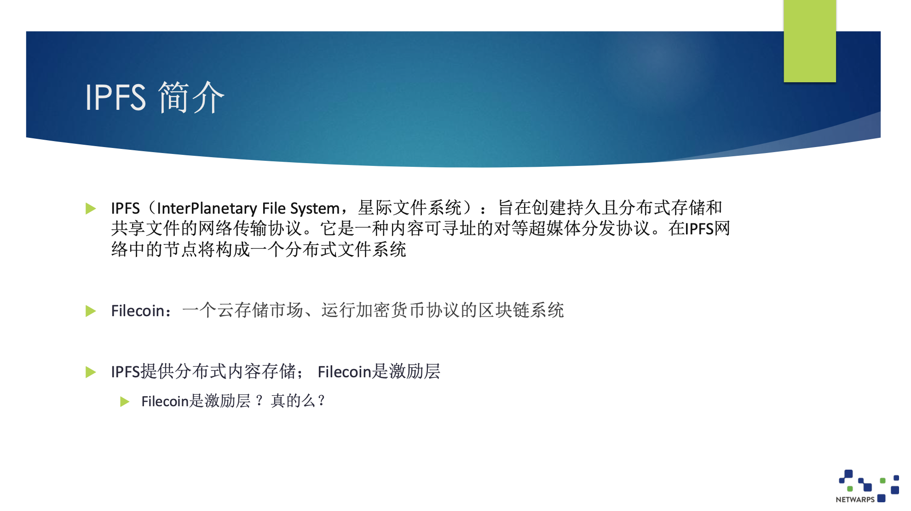
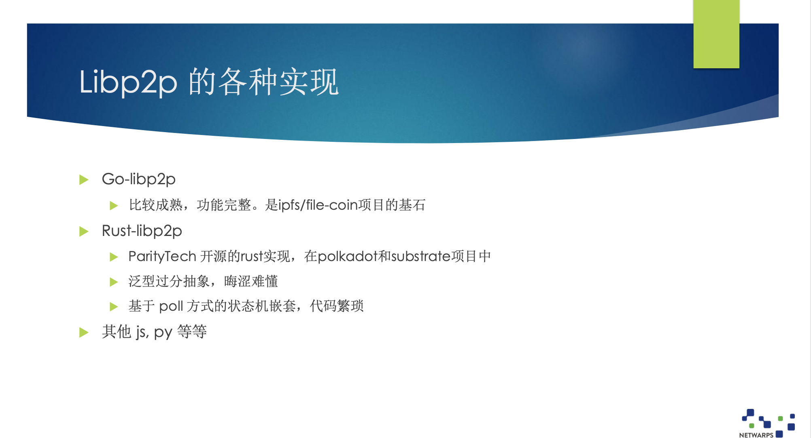
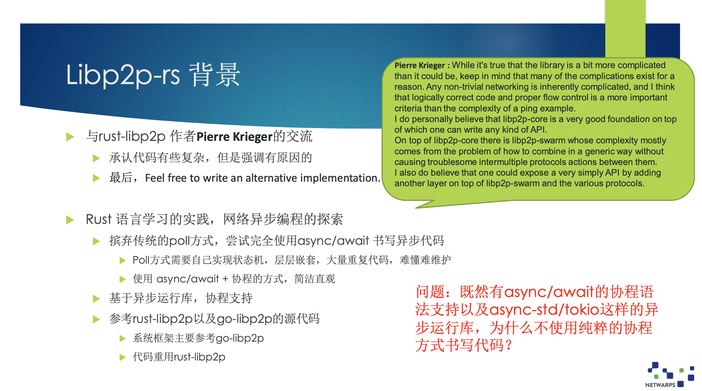
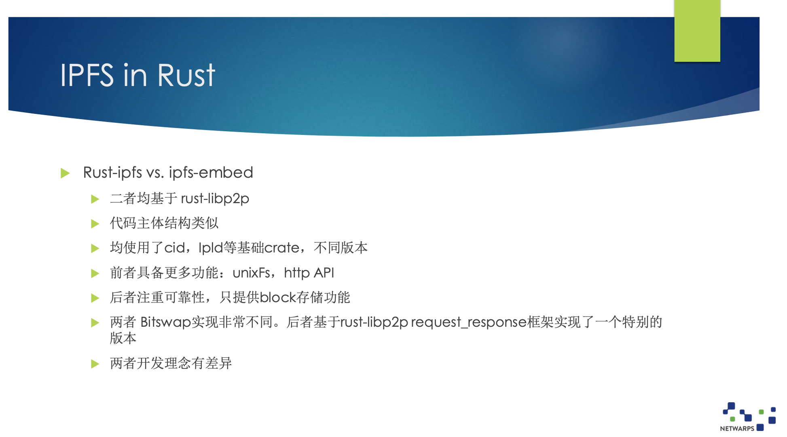
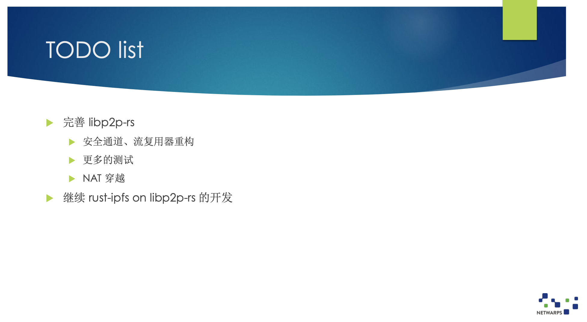
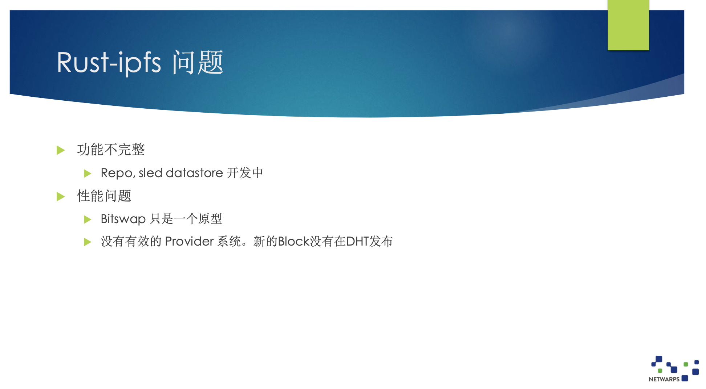
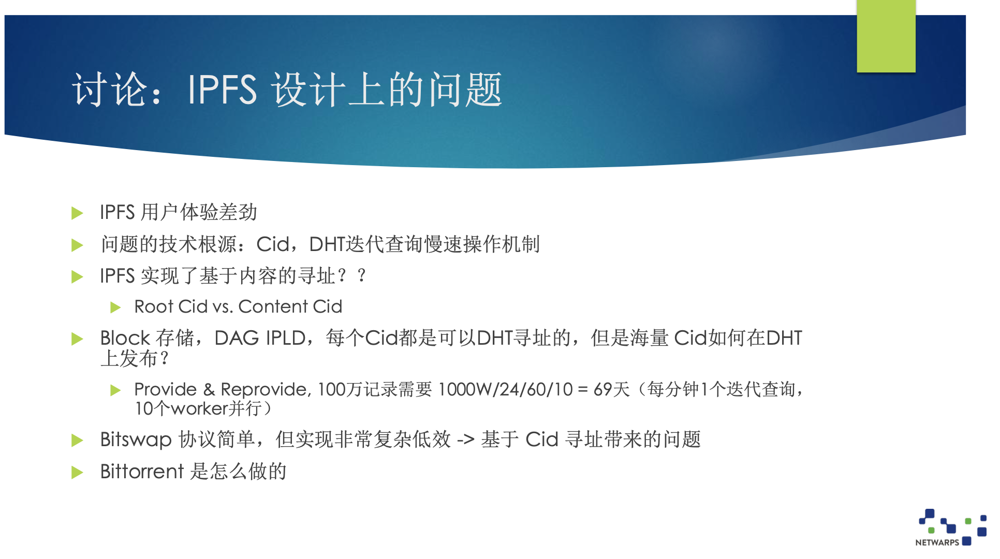

# Netwarp | 从 Libp2p-rs 与 IPFS

作者：刀哥@netwarp / 编辑： 张汉东

> 本文是对 深圳 3.27 Rust Meetup 来自 NetWarp 的刀哥分享的简单摘录， 对内容感兴趣可以直接观看[视频](https://www.bilibili.com/video/BV1C5411A7sG)。

---

Libp2p 主要为 IPFS 和 Filecoin 提供服务，是一个协议集。

Libp2p 分为网络层、路由层和交换层。网络层核心概念是 PeerId（节点标识），路由层负责发现 PeerId的地址，交换层则是其上的各种应用。

Libp2p 被认为是一种基础设施，不仅仅是为 IPFS 使用，还可以给其他应用使用。

概念介绍：

- IPFS（InterPlanetary File System，星际文件系统）： 旨在创建持久且分布式存储和共享文件的网络传输协议。它是一种内容可寻址的对等超媒体分发协议。在IPFS网络中的节点将构成一个分布式文件系统。
- Filecoin：一个云存储市场、运行加密货币协议的区块链系统。
- IPFS提供分布式内容存储； Filecoin是激励层。

IPFS 的愿景看上去很有野心，但实际上它们有些问题，后续会深入讲一下原因。

Filecoin 到底是不是激励层，我认为这种提法不是很准确，后面会稍微提到一点。

今天主要话题是从Libp2p 开始，先来看一下 Libp2p 的一些现有实现。

- Go-libp2p： 比较成熟，功能完整。是ipfs/file-coin项目的基石。
- Rust-libp2p
    - ParityTech 开源的rust实现，在polkadot和substrate项目中
    - 泛型过分抽象，晦涩难懂
    - 基于 poll 方式的状态机嵌套，代码繁琐
- 其他 

Go-libp2p，我们做过深入的代码研究，我认为它们的实现是非常完整的，各种功能很全，代码质量非常好。

我们做的工作和 Rust-libp2p 相关的，这个代码已经使用在波卡等项目中。

但是这个 Rust 代码实现的非常复杂，泛型参数使用的非常非常多，抽象层次很难理解。比如基础网络部分有十个泛型参数。这并不是智商的问题，而是耐心的问题。如果你想把它搞清楚会很花时间。

而且这份代码在几年前就开始做了，代码里还没有使用 aysnc/await 现在的语法，所以比较旧。

Rust-Lip2p 的作者也承认代码非常复杂，但这个也是有原因的。所以，为了简化这个实现，我们重新做了 libp2p-rs，当然也重用了 Rust-libp2p 的一些实现，但最重要的是使用了现在的 async/await 的语法。

### 基本设计原则 1

我们在实现 Libp2p-rs 的时候，遵循了一些原则：

1. 不使用 Unsafe。Unsafe 写不好，会有很大的风险。
    - 底层网络功能由异步运行库提供
    - Libp2p 的应用逻辑暂时看不到有 Unsafe 的必要
2. 除非绝对必要，不手工实现任何 Future。因为 Pin 这个概念比较难以理解，比如 Pin 在栈上和 Pin 在堆上有什么区别。
    - Async 帮助实现 GenFuture
3. 尽可能不使用 future combinator书写代码
    - 代码逻辑更简单易读
    - Combinator等效于`await: a.and_then(b) ➔ a.await; b.await; `
4. 尽可能减少泛型参数以及Trait关联参数的使用
    - 代码可读性问题
    - 参数的限定极为复杂
    - 基于静态派发的多态，使用上诸多不变（参见rust-libp2p 中 `SelectUpgrade<A, B>`。泛型参数需要具体化，实现同一Trait的不同类型具体化后是不同的数据类型。）

### 基本设计原则2: 

- 尽可能使用` <dyn Trait> `动态派发实现多态，避免写泛型参数
    - 典型例子：Swarm子流支持同种协议，协议需要实现 ProtocolHandler Trait，通过 tait object 动态派发
    - 代码篇幅减少，易于理解
- 尽量推迟引入异步运行库
    - Libp2p-core部分 不引入 运行库的依赖
        - Yamux/Mplex需要实现任务循环，作为一个BoxFuture暴露至Swarm，由Swarm调用
task::spwan()来执行
        - Wstransport, TcpTransport 必须使用task与socket。通过 Transport trait 的封装，不必放入 core
    - 在 Swarm以及各种协议的实现正式引入运行库，使用任务/协程完成连接与子流的管理

### 基本设计原则3 ：

- 减少 Mutex<>之类同步原语的使用
    - 使用不当容易造成协程死锁
    - 使用mpsc::channel，通过消息机制解决所有权问题
    - Swarm功能主体运行在一个协程任务上下文，通过channel接收内部或外部事件  
    - 原则上，处理消息不做耗时操作，不可以 `.await`

### 基本设计原则4 ：

- 通过 async-trait加持，在 Trait 中定义 async 方法
    - Trait 实现多态，支持异步方法的Trait可提供更为强大的抽象能力

Rust 异步目前还不太成熟，还不支持 async trait，只能使用 async-trait 库来达成目的。

而且目前 Rust 还不支持 async drop。目前我们的解决办法是实现了一个 引用计数器 GC。

> 编者按：
> 
> 4.23号 `libp2p-rs` 已经发布了 0.3 版本，使用 `AsyncRead & Asyncwrite`来替换 `ReadEx & WriteEx & SplitEx`；简化了 `Kad/DHT `的实现逻辑。

> 详细也可以看这里： [libp2p-rs v0.3.0 版本介绍](https://mp.weixin.qq.com/s/bN7cnFN5KmZIBthBPcdiVA)

---

### 作者介绍：

刀哥，互联网老司机，在 NetWarp 负责分布式存储。

