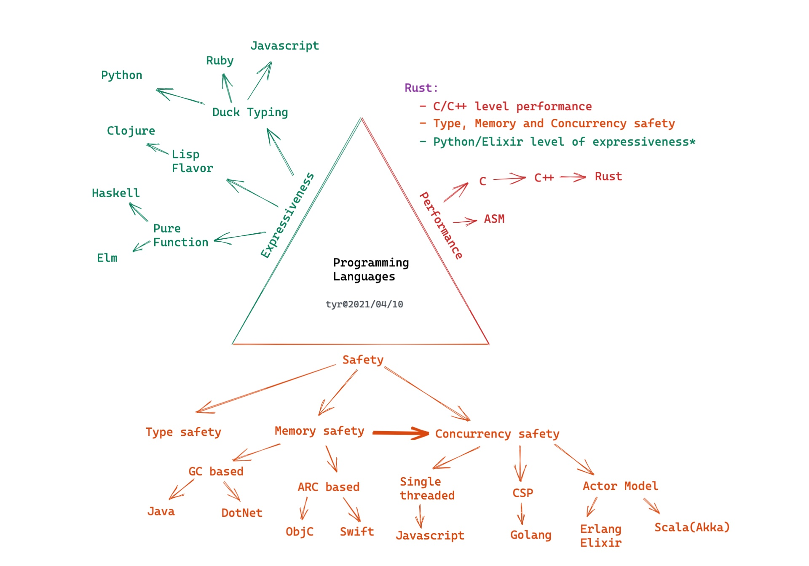
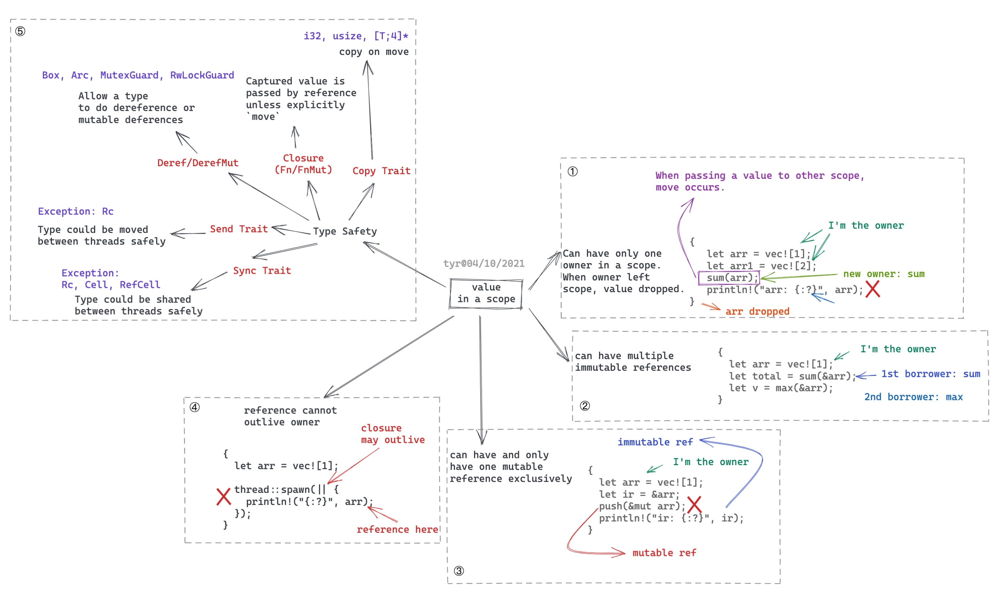
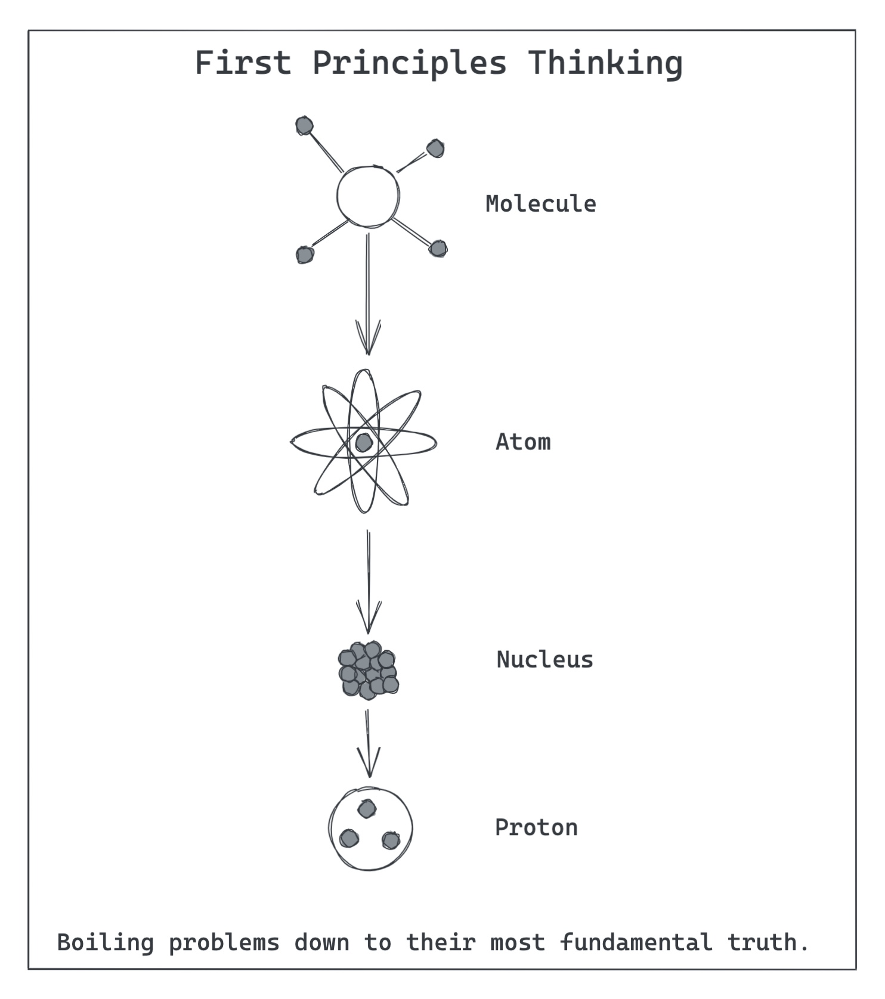
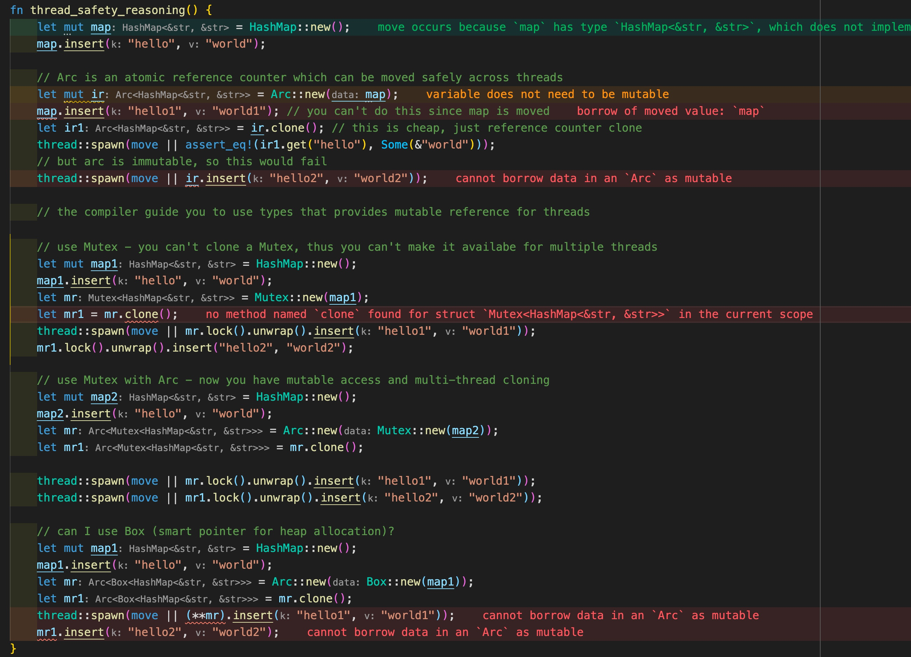

# 透过 Rust 探索系统的本原：编程语言

作者：陈天 / 后期编辑：张汉东

> 原文链接：[https://mp.weixin.qq.com/s/ZA-_BARVAWe0Q4eM0lYgwg](https://mp.weixin.qq.com/s/ZA-_BARVAWe0Q4eM0lYgwg)

---

连续写了好几篇和 Rust 相关的文章，有朋友说：你好像还没有写过一篇比较正式的介绍 Rust 的文章哦。想了想确实如此，我写过不少介绍编程语言的文章，包括：Python，JavaScript，Racket，Clojure，Elixir，甚至我个人不怎么喜欢的 Golang，却没有正儿八经写一篇关于 Rust 特点或者 Rust 世界观的文章。

于是，我开始构思一篇从编程语言设计的角度出发，来探寻 Rust 的独到之处，以及这样的思想可以如何应用在我们的工作当中。正巧，我司（Tubi）内部也渐渐有越来越多的同学对 Rust 感兴趣，想让我做个 BBL 讲讲；我想了想，一个 BBL 似乎很难全面地介绍一门语言，于是构思了九讲，分九周完成；而这其中，第一讲是至关重要的，我需要让一群对 Rust 并不了解的工程师能在 45 分钟内 get 到 Rust 的精髓，这样，后续的讲座才有存在的意义。

结果就诞生了这篇文章，以及与之相关的 slides。

## 编程语言的世界观

一门编程语言的诞生，一定有它想解决的问题。而围绕着这个问题，语言会有自己的一个世界观。比如说我们熟知的 Erlang 的世界观：

- everything is a process.
- process are strongly isolated.
- process creation and destruction is a lightweight operation.
- message passing is the only way for processes to interact.
- processes have unique names.
- if you know the name of a process you can send it a message.
- processes share no resources.
- error handling is non-local.
- processes do what they are supposed to do or fail.

在这个世界观下，Erlang 使用了 6 个基本函数：`spawn`，`send`，`receive`，`register`，`whereis`，`self`，构建了一个恢弘大气的分布式系统。

再比如 Golang，其基本的处理并发的思想人人熟知：Do not communicate by sharing memory; instead, share memory by communicating。但要想轻松地用几句话概括整个 golang 这门语言的世界观，似乎有些费劲。Rob Pike 介绍过 golang 的最初想法 [2]：

- a compiled, concurrent, garbage-collected, statically typed language
- It must work at scale, for large programs with large numbers of dependencies, with large teams of programmers working on them.
- It must be familiar, roughly C-like.
- It must be modern.
- Composition not inheritance.
- No conventional exception facility since exceptions make it too easy to ignore

所谓种瓜得瓜种豆得豆，语言诞生初期的世界观，决定了语言之后的走向。很多人抱怨 golang 没有泛型，但泛型恰恰和 C-like 这个思想是冲突的，因而如果要引入泛型， golang 势必需要对其世界观进行妥协，这种妥协带来的代价将会是巨大的（起码会急剧影响 golang 语言的简单性，以及其引以自豪的编译速度）。

对于 Rust 而言，它诞生的初衷是作为一门可以替代 C++ 的系统级语言，满足如下核心价值观[3]：

- Memory safety
- Speed (Zero cost abstraction)
- Productivity

显然，Memory safety 和 productivity 是 C++ 开发者的痛点。一门新的系统级语言可以在不失其效率的情况下达到内存安全么？C++ 做了很多探索，创造了不少智能指针，把 RAII（Resource Acquisition Is Initialization）引入语言当中，但由于历史的包袱，使得 C++ 只能在现有的体系下修补，无法从根上解决这一问题。Rust 则不然，它站在 C++ 的肩膀上，引入了所有权（ownership）和借用机制来提供内存安全，并创造性地使用了类型安全来辅助并发安全。所有权和借用机制虽然优雅且很容易理解，但它和我们所熟知的编程范式大为不同，让程序员无法随心所欲写出错误的代码，再加上 Rust 有意地在编译时就把这些错误暴露给开发者，使得 Rust 初期的学习曲线变得非常陡峭，对那些学了个一知半解就喜欢上手的开发者来说，尤其陡峭。

也因为 Rust 对自己系统级语言的定位，使得它对性能有一种偏执 —— 语言提供给开发者的抽象需要尽可能达到零成本（Zero-cost abstraction）：任何功能只要你不用，就没有成本；你如果使用，你自己手工优化的代码也不可能比语言为你生成的代码效率更高。因为这种偏执，使得 Rust 即便早期对异步 IO 有 green thread 这样在其他语言看来已经是相当不错的支持，在 Rust 进入 1.0 版本时，这个功能还是被彻底拿掉[3]，因为它会像 golang 一样，即便开发者不使用任何 green thread，其运行时带来的额外开销还在那里。所以 Rust 对异步 IO 的支持，直到 1.0 发布数年后的 Rust 1.39 async/await 正式 stable，才重新完美具备。既然提到了 async/await，容我再多说一句，我认为 Rust 在 async/await 的零成本抽象上带给整个编程语言世界的影响是巨大而长远的，它就像那个打破了「四分钟一英里」魔咒的 Roger Banister，让世界知道：高级的抽象并不必然以牺牲性能或者添加额外的运行时为代价。

Rust 还有一个重要的，被大家低估的世界观：公开透明（explicitness）。使用者可以对他所写的代码做到完全了解和掌控。

很多「高级」编程语言会营造一种易于学习的氛围：你不需要了解一切，不需要熟悉计算机工作原理，不需要掌握操作系统的基本知识，你也可以「高效」编程。这其实是一种假象。如果你做的事情仅仅和 CRUD 相关，那么掌握一些高层次的 API 的确可以很好地完成工作，但当你面临更复杂的系统设计时，当你想成为一名**有追求**的开发者时，你会遭遇瓶颈 —— 你还是得老老实实构建需要的知识体系，可是当初的「轻松」已经成为负担，就像练习钢琴一开始在双手的姿势上走了捷径，随着联系难度的增高，这捷径会反噬你。

而且这种假象还会被人才市场无情戳破。Java 工程师的确不需要了解内存的运作机制也能编程，但面试的时候，GC 的原理，Java memory leak 可能产生的原因，Java VM 是如何工作的这类问题还是屡见不鲜。原因无他，你如果不了解一切，你无法写出高效安全且设计良好的代码。同样是程序员，在并非供不应求的大环境下，用人单位更青睐那些有追求的程序员。

Rust 没有试图遮掩，它将所有你需要了解的细节明确地在编译环节暴露出来，并且把什么可为什么不可为的边界清晰地展现。这的确会给开发者带来学习的负担 —— 如果一个开发者对一门语言的从小工到大牛的掌握过程中所经受的 **全部痛苦** 是 100 分的话，Rust 的公开透明 —— 编译器把丑话说在前面 —— 帮你把 100 分降低为 90 分，然后在头 6 个月让你经受 70 分痛苦，接下来的 5-8 年经受剩下 20 分的痛苦；而其它语言会让你在头一两年只经受 20-30 分的痛苦，哄着你，呵护着你，然后在接下来的 5-8 年让你慢慢经受之后的 70-80 分的痛苦。

此外，很多语言没有明确的边界，有些地方做很多限制，有些地方却什么限制都没有，使得编程本身需要靠开发者额外的自觉或者规范才能保证代码的正确性。比如 Java 在内存分配和回收上设定了边界和限制，但在内存的并发访问上没有设定边界和限制，开发者如果不遵循一定规范，很难做到代码的线程安全。C 语言几乎没有设定任何边界和限制，使得指针的解引用成为开发者的梦魇。而 Rust 对一个值在某个 scope 下的所有可能访问做了严格的限制，并通过编译器将这些规则明确地告诉开发者（我们下文再展开）。

## 编程语言设计上的取舍

不同的编程语言为了解决不同的问题，形成了自己初始的世界观和价值观。而这些世界观和价值观，会严重影响编程语言设计上的取舍。一般而言，一门语言在设计之初，总需要在：性能（performance），安全（safety）和表达力（expressiveness）上做取舍。我画了个图，粗略地概括了不同编程语言在这些方向上的取舍：

Assembly/C/C++ 显然是为了效率牺牲（部分）安全性和表达能力。这带来的后果是开发难度太大。

为了达到内存安全，以 Java 为首的很多语言采用了 GC（垃圾回收）。这意味着用其开发出来的系统不得不忍受三大弊病：1) 巨量内存消耗 —— 内存使用可以达到非垃圾回收系统的 1.5-5 倍之多。2) STW（Stop The World），垃圾回收线程工作时会导致其它线程挂起以方便清理内存。Erlang 为解决这个问题，把垃圾回收的粒度缩小到每个 process。3) 开发者并不太在意堆上内存的分配，甚至会无节制地使用堆上的内存。

OjbC 和 Swift 采用了 ARC（自动引用计数）的方式管理内存，编译器会分析每个对象的生命周期，为其插入维护引用计数的代码，当引用计数为 0 时释放对象使用的内存。这种方式相对于 GC，其内存开销和计算开销都大大减小，没有 STW 的问题。但 ARC 无法很好处理循环引用（retain cycle），需要开发者手工处理（使用 weak reference 或者 unowned reference），如果处理不妥则会带来内存泄漏。

尽管 ARC 带来的开销很小，我们要记得，它还是有额外开销的。

大部分编程语言并不提供太多对并发安全的保护。Java 提供了内存安全，但如果你要保证代码的线程安全，需要遵循某些规范，比如：

- 如果可能，使用 thread-local fields，避免在多个线程内共享状态
- 使用并发安全的数据结构，如 `ConcurrentHashMap`，atomic classes
- 如果要在多线程共享状态，那么，保证共享的状态是只读的
- 如果要在多线程共享可写状态，那么，使用 synchroized method/statement，或者加锁，保证「写」访问是独占的

编译器并不强迫你遵循这些规范，所以，一个不理解并发安全的程序员很可能写出编译通过但导致 race condition 的代码。

而小部分保证了并发安全的语言，则在内存安全的前提下，引入了一些特定的规则：

- Javascript 运行在单线程之下，也就无所谓并发安全。
- Erlang/Elixir/Sala(akka) 使用 actor model，开发者通过消息传递做 process 之间的同步，这样避免了共享内存，从而避免了 race condition。代价是额外的堆上的内存分配和拷贝。
- Golang 采用了 CSP（Communication Sequential Process），使用 channel 来同步 goroutine，也避免了共享内存。同样的，代价是额外的堆上的内存分配和拷贝。

以上无论内存安全还是并发安全的解决方案，都有不菲的代价。这对于把安全和性能作为语言核心要素的 Rust 来说是不可接受的。

所以 Rust 注定要另辟蹊径。这个「蹊径」就是上文提到的所有权和借用规则，其原理非常简单：

1. 在一个作用域（scope）内，一个值（value）只能有一个所有者（owner）：
    1. 当所有者离开作用域时，值被丢弃（Drop）
    2. 值可以从一个作用域移动（move）到另一个作用域，但当前所有者立刻失去对值的所有权
2. 值可以被借用（reference），但借用的生存期不能超过所有者的生存期（lifetime）：
    1. 在一个作用域内，允许有多个不可变借用
    2. 或者至多一个可变借用（可变借用是独占的）

这个规则非常简单，如果你回顾我们写线程安全代码所遵循的规则，二者非常类似。只不过，Rust 把这些规则变得更明确，并且在编译器里强制执行。如果开发者的代码违反了任何一条规则，代码将无法编译通过。

这成为 Rust 带给开发者极大痛苦的一个根源。和 C/C++/Java 相比，Rust 编译器苛责你不仅要写出语法正确的代码，还必须写出符合内存安全和并发安全的代码，否则，不让你编译通过。因而，你需要非常仔细地考虑你是如何设计你的系统的：数据是否共享，如果共享，它们是如何传递，如何被引用，都被谁引用，生存期有多长等等。

也就是说，Rust 强迫你好好设计你的系统，你的接口，减少写代码的随意性，减少内存访问的随意性，把大部分问题都扼杀在摇篮。这看似不近人情的处理方式，其实极大地帮助我们成为更好的程序员。

当然，Rust 的强迫和其它语言的强迫有本质的不同。为了并发安全，Golang 强迫你使用 channel，Erlang 强迫你接受 actor model，它们都剥夺了你创建线程的权力，即便你很明确你要做的事情是计算密集而非 I/O 密集的任务。在这些体系之下，开发者没有太多的选择。Rust 只是强迫你写「对」的代码，但并不强迫你选用什么样的工具来达到这一路径。同样是并发处理，你可以使用 atomics，可以共享内存（`Arc<RwLock<T>>`），可以使用异步任务，当然也可以使用 channel（类似 Golang）。你可以使用线程，使用异步任务，甚至混用它们。Rust 不关心你实现的手段，只是强迫你把代码写对。

单单靠上面的所有权和借用规则，还不足以完全保证并发安全，Rust 巧妙地使用了类型系统，来帮助构建一个完整的并发安全体系。在 Rust 里，类型的行为是通过 Trait 来赋予的，几乎所有的数据结构都实现了一个到多个 Trait。其中，有一些特殊的 Trait 来说明类型安全：

- Send：标记一个类型是否可以安全地在进程间移动（move）所有权
- Sync：标记一个类型是否可以安全地在进程间共享

比如，`Rc<T>`（线程内引用计数的类型）被标记为没有实现 `Send` 或 `Sync`，因而，要想跨线程使用 `Rc<T>` ，Rust 编译器会报错，并且告诉你，你在某个上下文中使用了类型不安全的数据（在这里，你只能使用 `Arc`  - Atomic Reference Counter）。

这是一个非常漂亮地对类型系统的使用，它是如此地简单，优雅，且可扩展，使得编译器的工作只需做好类型安全的检查。

同时，Rust 还有其它一些 Trait，它们跟线程安全没有直接关系，但巧妙地辅助了线程安全：

- Copy：表明一个值在传递时会复制。所有的基本类型，如 `i32` ，被实现成 `Copy`，当你传一个数值到另一个函数或者另一个线程时，它被复制了一份，所以不存在线程安全的问题。
- Closure（`Fn` 和 `FnMut`）：闭包是一种特殊的类型。默认情况下，闭包中使用的闭包外的值使用了引用，但当这个闭包是在另一个线程运行时，我们需要显式移动所有权，否则，会出现借用的生存期超过所有者的生存期的编译错误。通过这种方式，Rust 杜绝了多线程闭包带来的引用问题。
- Deref/DerefMut。对于指针而言，通过解引用可以把指针转化成对应的类型进行操作。对于某些类型，Rust 控制其能否解引用，来控制其可用的范围。比如 `Arc` 类型不能解引用成为可变类型，如果你要多线程修改共享数据，只能通过 `Arc<Mutex<T>>` 类似的结构来完成。

上面说的这么多内容，可以用一张图来浓缩：

当你对这幅图理解地越深，你会愈发感慨 Rust 设计上的巧妙：从定义一个变量的值如何在不同场景下访问，得出几条简单的规则，再辅以类型安全，不引入任何运行时额外的开销，就保证了内存安全和并发安全。这种回归本源的做法，很像物理学的「第一性原理」：我们拨开表面的纷繁复杂，回归事物的本质，往往能得到最简单，同时也是最精妙的解决方案。所谓「大道至简」，不过如此。

下图的代码，我刻意违背几乎所有的所有权和借用规则，Rust 编译器就像坐在我身旁跟我 peer review 的老司机一样，清晰地告诉我代码中所存在的问题：

以及，当我试图像一个 C 程序员那样，写出非并发安全的代码时，Rust 的所有权和借用规则，以及类型系统一起帮助我发现所有的并发安全方面的问题：

## 贤者时刻

Rust 对我们做系统的启示：首先是把系统的运行规则清晰地定义出来，然后对其做类似从特殊化的定理到一般化的公理那样的推敲和抽象，找到满足系统运行的最小化的核心规则，最后用这些规则来限制系统的行为。

## 参考资料

[1] 思考，问题和方法：[https://zhuanlan.zhihu.com/p/38813900](https://zhuanlan.zhihu.com/p/38813900)

[2] Go at Google: Language Design in the Service of Software Engineering: [https://talks.golang.org/2012/splash.article](https://talks.golang.org/2012/splash.article)

[3] How rust views tradeoffs: [https://www.infoq.com/presentations/rust-tradeoffs/](https://www.infoq.com/presentations/rust-tradeoffs/)