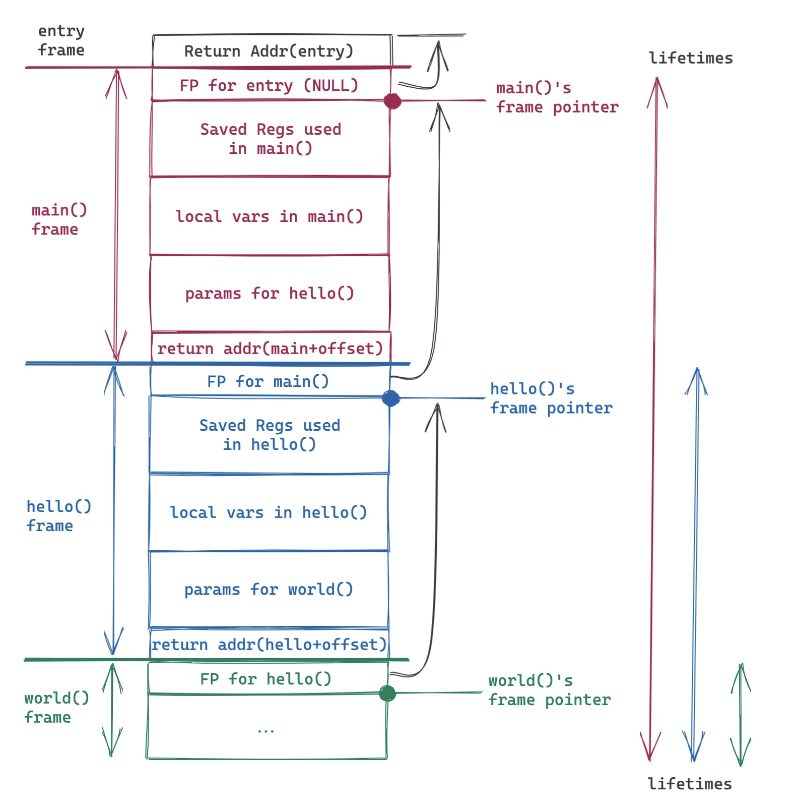
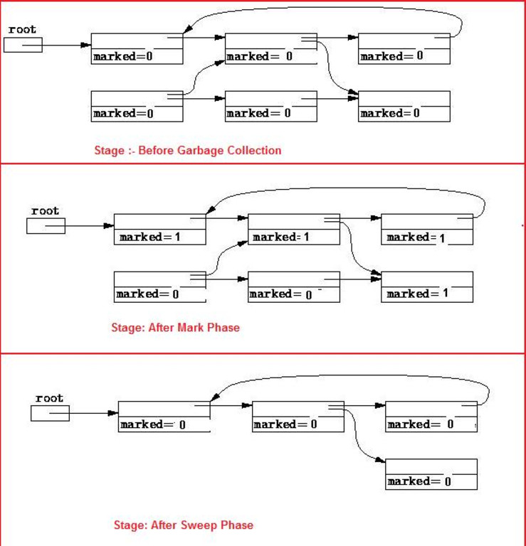
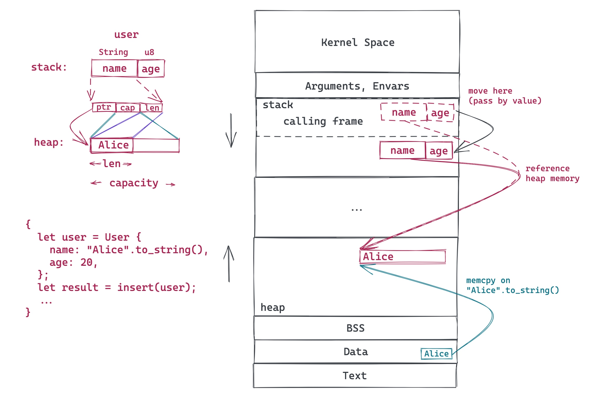
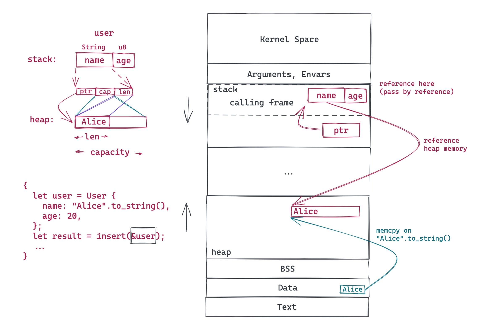
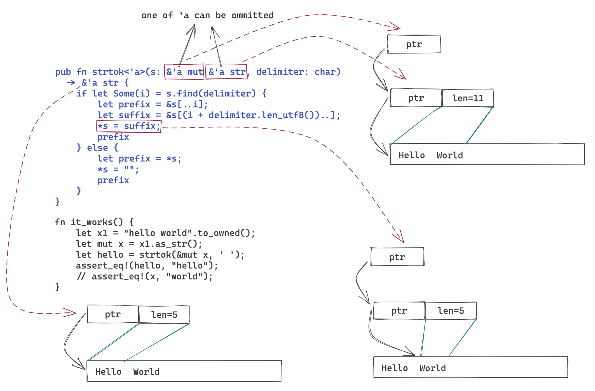

# 透过 Rust 探索系统的本原：内存管理

作者：陈天 / 后期编辑：张汉东

> 原文链接：[https://mp.weixin.qq.com/s/1juaadR3AqHa8H19sHWHmQ](https://mp.weixin.qq.com/s/1juaadR3AqHa8H19sHWHmQ)

---

对于开发者来说，内存无非是两种管理模式：手动管理或者自动管理。C 语言是手动管理内存的大哥大，而 Java 则是自动管理的扛把子。很多人认为 Java 是使用垃圾回收做内存管理的鼻祖，其实不然，lisp 早于 Java 大概二三十年就武装上了简单的 GC。不过公认的高效率的 GC 是 Java 带给我们的。

不管手动管理还是自动管理内存，这个「管理」，我们说的都是堆上的内存。几乎所有的编程语言，一切栈上的内存都是自动管理的，并且在编译时就已经妥善完成了。

那么栈上的内存是怎么管理的呢？下面是一个简单的函数调用的例子：

```c
#include <stdio.h>
static int VALUE = 42;
void world(char *st, int num) {
    printf("%s(%d)\n", st, num);
}

void hello(int num) {
    char *st = "hello world";
    int v = VALUE+num;
    world(st, v);
}

int main() {
    hello(2);
}
```

通过上面的代码，我们不难看出整个调用栈的关系：



可以看到，栈上的内存管理简单高效：栈帧（frame pointer）一压，一个新的帧（frame）就开启了它全新的生命周期（lifetime），这生命周期结束后，栈帧一弹，所有在此期间「分配」的内存都得到了「释放」。分配和释放不过是动动指针的问题，一切在编译期就决定好了（这也是为什么栈上的对象一定是大小明确的）。

所以，生命周期不是个新鲜事，所有的自动内存管理，其实就是在管理内存的生命周期。栈上对象的生命周期非常简单，规则就一条：某个帧里「分配」的内存，其生命期不能超过该帧的生命期。

堆内存的管理就复杂很多。堆上的内存分配可以在运行时才决定长度，可以动态增长（分配新内存，拷贝，释放旧内存），也可以在不同的上下文中共享。这种灵活性，让堆上内存的生命周期不那么容易追踪，所以管理起来也颇费精力。

手动管理我们放下不表，我们看看不同的语言如何做堆内存的自动管理。

对于堆上的内存的生命周期的自动管理，Java 采用的是 Tracing GC。



（图片来自 Mark-and-sweep [1]）

对于 GC 来说，栈上活跃的变量以及全局变量属于 root set。任何由 root set 直接或者间接引用的堆上的对象，都是还在使用的对象。在 GC 定期做标记（Mark）的时候，会标记到这些对象，那些没被标记到的对象，属于生命周期终止的对象，可以安全地被回收。

Mark 阶段结束后，GC 会做内存的清理（Sweep）。在清理阶段，所有没有被标记的对象会被放入 free list 等待释放，而那些被标记过的对象的标记会被清除，等待下一轮的处理。

Tracing GC 管理生命周期的方式很巧妙，它并不跟踪每个具体的对象，而是通过扫描当前还有哪些对象仍然在使用，找到那些已经不再使用的对象，释放之。这种方式简单直观高效，但非常粗犷，无法确保某个对象一定在生命周期结束后得到释放。它还有一些副作用，比如消耗额外的 CPU 时间，GC 工作时会打断工作线程的执行，以及需要在内存消耗情况和 GC 频次之间找到一个平衡点等等。Tracing GC 下的内存管理就像我们的大学生活：平时各种浪，考前狂突击。

Swift 采用的是另一种策略 —— ARC（Atomic Reference Counting）。它通过编译时根据每个对象的引用情况，插入相应的引用计数代码（进入函数时，retain - 被引用的对象引用计数增加，退出时 release - 被引用的对象引用计数减少），从而精确掌控每个对象的生命周期：


（图片来自：Swift: Avoiding Memory Leaks by Examples [2]）

这种方式的虽然规避了 Tracing GC 的很多副作用，但它为了实时追踪对象的引用情况，在运行时也付出了不少代价：retain/release 做了很多事情，并且为了线程安全，修改引用计数需要加锁或者使用 atomics，这比我想象的要吃性能 [3]，并且 ARC 无法处理循环引用 —— 所以需要开发者在适当的地方使用 weak ref 来解除循环引用带来的引用计数问题。

ARC 下的内存管理就像在工厂打工：上班签到，下班打卡，兢兢业业，一丝不苟。

而 Rust，采用了完全不同的方式。对 Rust 而言，像 C/C++ 那样靠开发者手工来追踪对象的生命周期是不靠谱的 —— 人总是会犯错，何况这个世界上合格的程序员非常稀缺；但像 Java/Swift 这样在运行时花费额外代价来追踪生命周期，又和语言本身的目标不符。最终 Rust 沿用和发展了 Cyclone 的生命周期的处理方式。

在我之前的文章《透过 Rust 探索系统的本原：编程语言》中，用一幅图概述了 Rust 的所有权和借用规则：


如果对所有权和借用规则不熟悉的读者，可以看我的那篇文章。我们来深入看看，Rust 的所有权和借用规则是如何结合编译期生命周期的推定，来解决堆上内存的生命周期管理的问题的。

我们先用一幅图看 move 是如何处理的：



这段简单的代码里，我们生成了一个 `User` 对象，然后将其传递给 `insert()` 函数。在 Rust 里，除非特别声明（使用智能指针），对象（结构）是存储在栈上的。而 Rust 的 `String` 对象，会在栈上放一个指针，指向堆里的实际字符串数据。由于 Rust 的单一所有权模型，当 `user` 移动到 `insert` 函数后，`insert` 就是其新的 owner，编译器会确保之前的 owner 失去对 `user` 的访问权：如果继续访问，会得到编译错误。由此，堆上的字符串依旧只有一个 owner（图中红色实线），而旧的 owner 因为被禁止使用，也就间接失去了对堆上数据的引用。当 `insert` 函数结束时，`user` 被丢弃（Drop），也即意味着堆上分配的内存被释放（还记得上篇文章讲的 RAII 么）。所以，对于对象的 move，Rust 轻松搞定堆上的数据的生命周期的管理。

那位问了，move 好懂，borrow（或者 reference）怎么破？

我们把上图稍微变一变，让 `insert` 的参数变成接受一个对 `User` 的引用（ `&User` ）：



引用（reference），在 Rust 中，可以看做是受限的，带额外 metadata 的指针 —— 这里`&user` 指向原有的 `user` 对象。根据所有权和借用规则 4：引用的生命周期不能超过对象的生命周期。在这个上下文中，显然 `user` 的生命期更长一些，所以不存在问题。当 `insert` 结束，借用被丢弃，随后图中整段代码结束，`user` 也被丢弃，堆上的内存于是也得到了释放。一切是那么地显而易见。

那位又问：你这仅仅是一个借用，如果同一个对象有很多借用呢？

其实我们只要把多个借用分开来看：1) 同一个调用栈上的多个借用 2) 不同调用栈上的多个借用。对于 1)，由于 `user` 对象是在最外层的栈分配的，其生命周期必然大于内层的调用栈（见本文开篇的那幅图），因而不存在任何问题；对于 2)，我们继续看图说话：


这个借用跑去另一个调用栈的唯一机会是 `insert` 或者其后的函数创建了一个新的线程，并且将这个借用 move（copy 同理）给新的线程。由于两个独立线程的生命周期完全无法比较，所以存在 `user` 结束生命期被释放，而其另一个线程中的引用还继续存在的情形。

在 C/C++ 里，这样的问题很难规避，需要靠良好的代码规范来杜绝 —— 比如我之前学到的 C 的 best practice 之一就是：尽量避免用指针传递栈上的数据，这样不安全。

但 Rust 巧妙地通过类型推断在编译期就捕获了这样的问题。

怎么个巧妙法？

我们站在编译器的角度想想这个问题：如果我是一个编译器，我该怎么判断这里存在一个编译问题？我有什么信息可以利用？我还需要什么信息？

编译时编译器能够依赖的主要信息来源是类型。对于一个函数调用，其期待的输入（输出）类型，和实际传入（传出）的类型不匹配，那么编译器就可以稳稳地抛出编译错误。

如果我们把变量的生命周期看做类型的一部分，是不是就可以在编译期捕获生命周期的问题？

哈，听起来就像宇宙学中原本无处不在却被忽略的时间被爱因斯坦揉进了广袤无垠的空间，形成了独特的时空观，一下子解决了很多让人费解的问题那样子。在这里，类型是空间，生命周期是时间，两者组合，于是便有了光 —— 一抹如文艺复兴般点亮了内存管理漫长中世纪的亮光。

这抹亮光是 Cyclone 点燃的，后来被 Rust 沿袭，形成燎原之势。

在上图，`&user` 因为在另一个线程中使用，存在和 `user` 生命期不匹配的问题，那么，如果我们明确**界定**在创建线程时，允许传递什么生命周期的数据，不就可以把生命期不匹配的问题杜绝了么？

以下是 Rust 里 `std::thread::spawn` 的函数签名：

```rust
pub fn spawn<F, T>(f: F) -> JoinHandle<T>
where
    F: FnOnce() -> T,
    F: Send + 'static,
    T: Send + 'static
```

我们可以看到，调用 `spawn` 传入的闭包函数（`FnOnce`）需要 `Send + 'static`，这里的 `'static` 类型意味着，这个闭包只能携带生命周期是静态（意味着和整个程序同生共死）的引用，比如 bss/data/text 段中的全局数据/代码的引用，或者具有所有权的数据 —— 也就是说不能传一个非静态的引用。这就是 Rust 的解决之道。

如此一来，上图的场景就无法通过编译了。通过把生命周期嵌入类型系统，Rust 很自然地解决了这个问题。

这种解决方法还带来一个非常棒的副作用：由此，你可以放心地引用栈上的数据 —— 只要编译通过，你的代码就没有安全问题。而其它语言，因为无法规避这类问题，只好无一例外地把引用型数据存放在堆上：

- C/C++：虽然理论上可以引用栈上的数据，但 best practice 不建议你这么做（的确不安全）
- Java：对象都存储在堆上，只有基础类型（primitive type）—— 其实就是拷贝类型，才放在栈上
- Swift：引用类型存储在堆上，拷贝类型存储在栈上

而 Rust，允许你把所有在编译期长度确定的数据放在栈上，并安全引用。相比之下，这能带来很多性能上的提升（大大减少了 heap alloc/dealloc 的开销）。同时，Rust 下，栈的使用更加**有效**，堆的使用更加**纯粹** —— 除非不得已（Rc，Arc 这样的使用场景），我们不再需要依赖堆上的分配来「记录」生命周期。

当然，凡事都有代价。其它语言，生命周期的管理被掩盖在了语言的细节之中，你无需直接跟生命周期打交道。而在 Rust 中，你的数据结构，函数声明，都潜在需要做生命周期的标注，因为它们是类型系统的一部分。虽然 Rust 编译器做了很多工作，使得 80% 常用的场景下，你不需要标注生命周期，编译器会自动推导；但还是有一些场合，你需要手工添加生命周期，告诉编译器你对调用者的期待。在 C 语言里，一个刚入门的工程师可以很轻松地写出 `strtok`，但对 Rust 工程师来说，掌握生命周期，并在实战中运用，需要一定的时间 —— 同样是 `strtok`，在 Rust 里搞明白并且写出来并不轻松：



对此感兴趣的同学，建议你看看 Jon Gjengset 的 Crust of Rust: lifetime annotation[5]。

本文是我上周三在 Tubi 内部的 Rust BBL 的文字版，需要 slides 的同学可以去我的 github：tyrchen/rust-training 或者点击「阅读原文」自取。

## 贤者时刻

对于软件中的缺陷，不同阶段被发现会导致非常不同的解决时间：

1. 不要引入任何缺陷（可惜我们是人，不是神，这不现实）—— 无需解决时间
2. 当敲下代码的那一刻，有缺陷的地方就能够被捕获到（很多语言的 language server 已经在做这样的事情了）—— 秒级
3. 在编译时被捕获到 —— 秒级到分钟级
4. 在 UT 时被捕获到 —— 分钟级
5. 在 CI 时被捕获到 —— 分钟级到小时级
6. 在 code review 时被捕获到 —— 分钟级到天级
7. 在 End-to-End test / QA 时被捕获到 —— 小时级到天级
8. 在部署后被捕获到 —— 若干小时，若干天，甚至若干月之后
9. 部署后被用户捕获到 —— 若干天，若干月，甚至若干年之后（也许永远无法解决 —— 很难复现）

所以：早发现，早隔离，早诊断，早治疗 —— 鲁迅诚不我欺也。

## 参考资料

[1] Mark-and-sweep: [https://www.linkedin.com/pulse/mark-and-sweep-garbage-collection-algorithm-saral-saxena/](https://www.linkedin.com/pulse/mark-and-sweep-garbage-collection-algorithm-saral-saxena/)

[2] Swift: Avoiding Memory Leaks by Examples: [https://medium.com/hackernoon/swift-avoiding-memory-leaks-by-examples-f901883d96e5](https://medium.com/hackernoon/swift-avoiding-memory-leaks-by-examples-f901883d96e5)

[3] How does Object-C runtime do multithreaded reference counting without downgraded performance? [https://stackoverflow.com/questions/13942226/how-does-apples-objective-c-runtime-do-multithreaded-reference-counting-without](https://stackoverflow.com/questions/13942226/how-does-apples-objective-c-runtime-do-multithreaded-reference-counting-without)

[4] Cyclone: [https://en.wikipedia.org/wiki/Cyclone_(programming_language)](https://en.wikipedia.org/wiki/Cyclone_(programming_language))

[5] Crust of Rust: lifetime annotation: [https://www.youtube.com/watch?v=rAl-9HwD858](https://www.youtube.com/watch?v=rAl-9HwD858)
