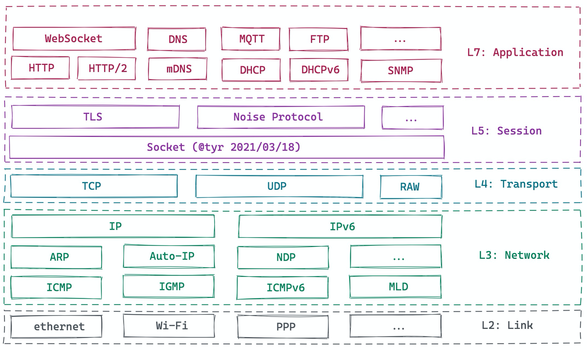
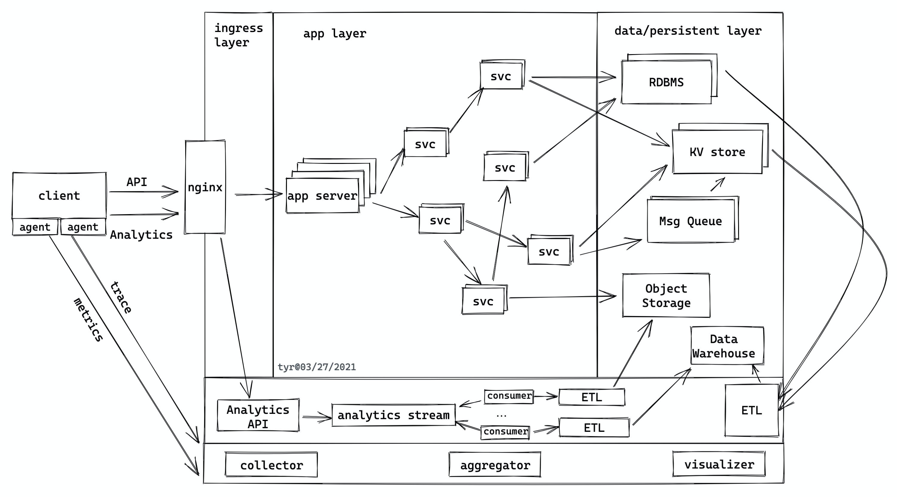
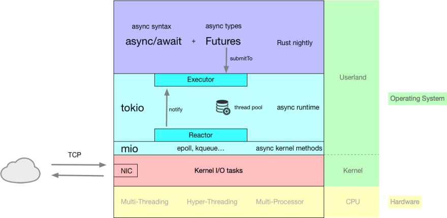
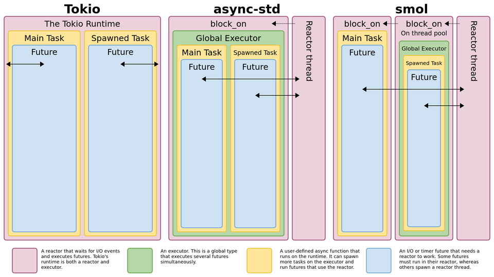
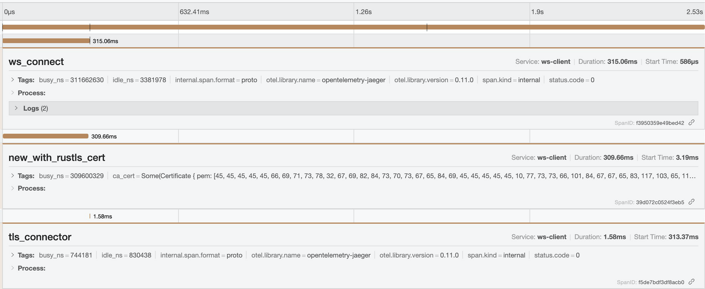
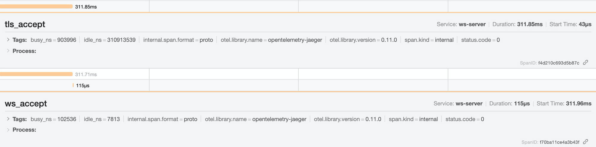
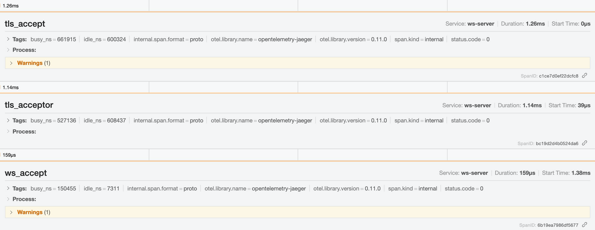
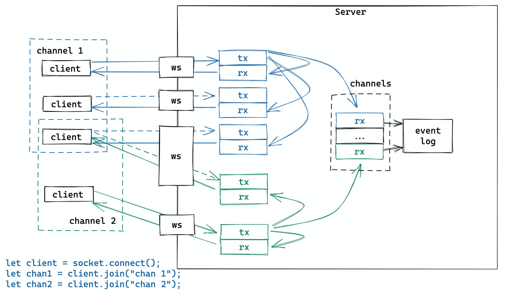
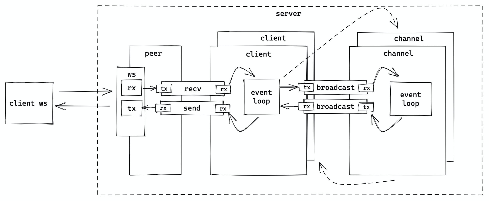
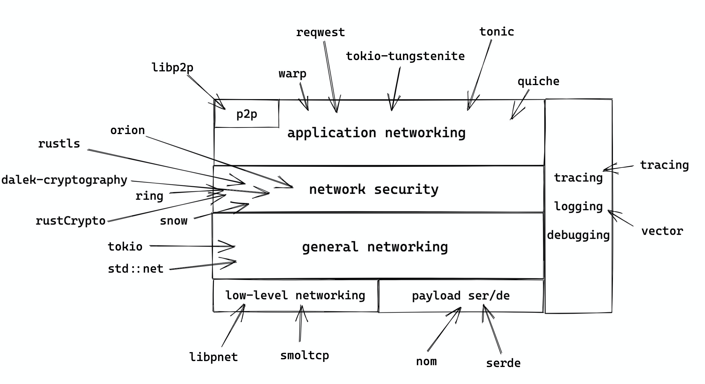

# 透过 Rust 探索系统的本原：网络篇

作者：陈天 / 后期编辑：张汉东

> 原文链接：[https://mp.weixin.qq.com/s/bOxEEK7Hh_tsua8HBahsjg](https://mp.weixin.qq.com/s/bOxEEK7Hh_tsua8HBahsjg)

---

如今所有的应用程序几乎都离不开网络。从应用开发的角度，绝大多数应用以及其后端系统都工作在应用层：

一般来说，应用程序的网络层除了发生在客户端和服务器之间，还存在于整个后端。下图是一个典型的应用程序：

客户端和服务端之间的流量会走这些网络协议：

1. API 和 analytics 大多会走 HTTP(S)/1.1 或 HTTP(S)/2，以及在其之上的 websocket。
2. trace/metrics 走 UDP

服务端内部：

1. 服务和服务间如果走 gRPC 的话，是 HTTP/2。
2. 服务跟数据库之间走数据库自己的网络协议（一般直接建立在 TLS 之上）。
3. 服务跟第三方的云服务，一般走 HTTPS。
4. 服务器和 Message queue 之间，也许会走 AMQP 协议。

大多数时候，这些网络协议都被封装好，或以 SDK 的形式，或以类库的形式供你调用，所以开发者基本不用操心协议的细节是怎么回事。顶多，把 HTTP/1.1 的状态码（200/301/302/304/400/404/429/500），方法（GET/POST/PUT/PATCH/DELETE/HEAD），常见的头字段记一记，知道什么情况下客户端该请求什么方法，返回什么状态码，什么时候数据应该放在头部，什么时候应该放在腰部（body），也就足够应付 80% 的应用场景了。

不过，为了更大的吞吐量，更小的延迟，更好的用户体验，我们还需要掌握更多的细节。本文就谈谈这些内容。

## 异步处理

提升网络性能的第一大法宝是异步处理。网络跟 I/O 相关，发送和接收数据都存在潜在的阻塞线程的风险，如果不妥善处理，会大大降低系统的吞吐量。传统的处理方式是用 non-blocking I/O，自己处理 `EWOULDBLOCK` —— 一般来说，去调度其它能执行的任务，避免线程闲置。当然，现代编程语言都有不错的异步支持，相当于帮助开发者完成这种原本需要手工完成的调度。Rust 提供了 `Future` trait，在语言核心支持了 `async` 和 `await`。相信大家对 `async` 和 `await` 并不陌生，下图对比了 sync/async File I/O：

（图片来自：Writing an OS in Rust - Async/Await [1]）

在众多不同语言的异步实现中，Rust 的实现是独树一帜的。它的异步库（无论 Tokio/async-std）使用了 Reactor/Executor 模式[2]，一个 `Future` 只有被主动 poll（await）才会得到执行。这一点和 javascript 有本质的不同 —— 在 js 里，一个 promise 一旦生成，就会放入 event loop 里等待执行。

在 Reactor/Executor 模式里， executor 就是我们常说的调度器（scheduler）。它负责调度可执行的 `Future` 的执行。每次执行意味着一次 poll，要么 poll 到整个 `Future` 结束，要么 poll 到 `Future` 直到  `Poll::Pending`。当一个 `Future` 不能做更多事情时（`Poll::Pending`），executor 不会再管它，直到有人（`Waker`）通知 executor 这个 `Future` 又重新 ready 了。这个 `Waker` 就是我们所说的 reactor。它一般会跟操作系统的 nonblocking I/O（linux 下是 epoll，bsd 下是 kqueue，以及 windows 下是 IOCP）协作，来唤醒 `Future`。下图概括了 Tokio 下 Reactor/Executor 是如何协作的：

（图片来自 Explained: How does async work in Rust? [3]）

如果你做过多核 CPU 下的（非 ASIC）网络设备相关的开发，会发现这个过程似曾相识。我觉得未来 Rust 会在高性能网络设备领域占据一席之地，这得益于其高效强大的易步处理库。

Rust 下主流的异步库有 Tokio 和 async-std。下图做了不错的总结，大家可以就着原文的讨论一起看：

（图片来自 reddit 讨论：Diagram of Async Architectures [4]，有些旧，async-std 现在已经基于 smol 了，但整个讨论值得一读）

异步开发的好处是：尽管底层的处理相当复杂，各种实现但对开发者来说，接口非常简单，只需要很少的代价就可以把一个同步的处理变成异步的处理。

但是，我们要小心其中的一些陷阱：

- 锁的使用。如果对 I/O 相关的数据结构的锁，需要使用支持异步的锁。比如你要对 TCP stream 的 writer 加锁（不建议这么做，下文会讲），那么要用异步锁。异步锁和同步锁的区别是，异步锁只是让异步任务状态变为 `Poll::Pending`，不会锁线程，等锁 ready 后异步任务重新被唤醒；而同步锁会锁线程，导致性能问题甚至死锁。
- 异步代码和高延时同步代码的混用。如果在两个异步操作之间有高延时同步代码，要么把同步代码放在前面或者后面执行，要么把同步代码异步化（分阶段 poll）。

对于后者，我这两天在做一个类似 Phoenix Channel[5] 的 Websocket 应用（以下简称 WS channel）时遇到了这个问题：我的 WebSocket 在 wss 连接时，每个连接要花大概 300-400ms，很奇怪。后来我用 jaeger 追踪了一下 tracing，发现客户端代码在连接时时间都耗在了 `new_with_rustls_cert` 上，真正花在 TLS handshake 上的时间只有 1.5ms：

由于我客户端做的操作是：

1. TCP connect（异步）
2. 准备 TLS connector（这里会做 `new_with_rustls_cert`），这是同步操作，耗时 ~300ms
3. TLS connect（异步）

这直接导致服务端 `tls_accept` 每个新建连接的延迟奇高（因为客户端 TCP 连上了迟迟不做 handshake）：

解决办法：客户端准备 TLS connector 的步骤提前到第一步。之后，服务器的延迟正常了（~1ms）：

这是个有趣的 bug。`new_with_rustls_cert` 看上去是个人畜无害的纯内存操作，但因为里面有读取操作系统的受信证书的操作，所以延时高一些。其实它应该做成异步操作。

## 队列

在网络开发中，最快能提升性能的工具就是队列。虽然操作系统层面，已经使用了发送队列和接收队列来提升性能，在应用层面，我们最好也构建相应的队列，来让整个服务的处理变得更顺滑，更健壮，更高效。除此之外，队列还能帮助我们解耦，让应用本身的逻辑和 I/O 分离。

我们还是以上文中提到的 WS channel 为例。其产品逻辑是：客户端可以连接 websocket，然后 join/leave 某个 channel，当成功 join 某个 channel 后，客户端可以向 channel 里广播任意消息，其它连接到这个 channel 的客户端可以接收到这条消息。

服务器端需要处理这样的逻辑：

- 收到客户端的 join channel X 的请求后，如果验证通过，就给该客户端发送成功响应，同时给 channel X 的其它客户端发送 presence update 通知。
- 收到客户端发往 channel Y 的消息后，验证客户端确实在 channel Y 中之后，将这条消息广播给 channel Y 中的其它客户端。
- 收到客户端的 leave channel Z 的消息后，如果客户端在 channel Z 中，就将客户端移除，并给 channel Y 的其它客户端发送 presence update 通知。

很简单，是不是？

然而，如果把所有这些逻辑都塞在 accept socket 后的一个大的 `async move { loop {...} }` 里，代码晦涩难懂，到处耦合，不好单元测试；如果分成一个个子函数，又需要对 websocket 的 reader/writer 套上 `Arc<RwLock<...>>` 传递，啰嗦且性能不好，每个子函数还是不好单元测试（websocket reader/writer  不好构造）。

最好的方式是用队列将逻辑和 I/O 分离开：event loop 只负责从 websocket 中接收数据，将其发送到接收队列中，供后续的逻辑处理；以及从发送队列中 poll 出数据，写入 websocket。整体的示意图如下：

我们换个视角，只看一个 client，大概是这个样子： 

服务器：

1. accept socket，为 ws socket 创建一个本地 own 的 peer 结构和一个不在本地 own 的 client 结构。peer own socket 的 writer/reader，peer 和 client 之间建立一个双向队列。然后 spawn tokio task，处理该 peer。
2. peer 的 event loop 很简单，只处理 socket 的收发 —— 收到的消息放入 recv 队列；从 send 队列拿到要发的消息，写入 socket
3. client 在创建后会启动一个 tokio task，运行自己的 event loop：从 recv 队列收消息，根据消息类型进行相应处理（比如说 join 会和 channel 间建立队列）。如果消息需要 broadcast，将其放入 broadcast 的发送队列，由 channel 结构处理。
4. channel 从 broadcast 接收队列里收到消息后，遍历自己的所有 subscribers（排除发送者），然后将消息发送到他们的 broadcast 发送队列。

这是理论上最佳的运作方式。实操的时候，为了节省内存，channel 可以不和 client 建立队列，直接获取 client send 队列的 rx 的浅拷贝，直接发送，省去了一层传递。

使用队列之后，我们可以很方便地测试 client / channel 处理的逻辑，而无需关心 I/O 部分（I/O 的构造是 unit test 中最困难的部分）。同时，整个结构的逻辑也更清晰，效率更高（使用队列缓存减少了等待），且更平滑（队列有效地缓解了 burst 请求）。

此外，我们还可以在 websocket 发送端，对 send 队列的 rx 做批处理，就像 ReactiveX 里的 Window 操作那样，让发送端在一段时间内等够一些数据再统一发送（比如：period=200ms / count=16 messages）：

## 减少内存分配和拷贝

网络应用中，数据从内核态到用户态，在用户态的多个线程之间，以及最后经过内核态把新的数据发送出去，里面免不了有很多内存的分配和拷贝。还是上面 WS Channel 的例子，我大概统计了一下在 channel  中广播一条用 protobuf 序列化的消息，应用程序自己所需要的内存分配和内存拷贝：

1. 首先 WebSocket 服务器收到消息后，需要把二进制的 protobuf 转化成 struct 进行一些处理。如果 protobuf 消息中含有 `repeated` （在 Rust 里对应的是 `Vec`）或者 `map` （在 Rust 里对应 `HashMap`）或者 `string` （在 Rust 里对应的是 `String`），那么都涉及到堆上的内存分配。堆上的内存的分配代价很大，切记。
2. 假设 channel 里有 100 个用户，那么要做 broadcast 的话，这个 struct 需要被拷贝 100 次。
3. 当要发送消息时，需要把 struct 再序列化成二进制，封装成 Websocket 消息，发送。这里面，序列化的过程涉及到承载二进制内容的 buf 的分配，如果不优化，也是在堆上进行。

这里最多的内存分配和复制在 2。为了优化这里的拷贝，我们可以用 `Arc` 来做引用计数，避免拷贝数据本身。

对于 3，我们可以使用一个全局的可增长的 ring buffer，每次需要 buf 时，从 ring buffer 里取；也可以用 slab，预先分配好相同大小的内存，然后使用之。

此外，还可以使用一些零拷贝的序列化/反序列化工具，如 rkyv[8]。

我在开始写 Rust 项目时往往在做应用的时候过多使用拷贝，导致辛辛苦苦编译通过的代码效率低下，有时候做同样一件事，Rust 代码的性能还不如 go 和 java。所以说，合理使用引用，避免代码中不必要的拷贝，是撰写高性能应用的必经之路。

## 降低延时

在服务器和客户端的交互中，往往数据传输本身占据总延迟的大头。一种降低延时的方式是将数据甚至数据和计算本身都挪到网络的边缘处理，这样因为尽可能贴近用户，传输的距离大大减小，延迟就大为改观。目前很多 CDN 都支持了边缘计算（如 aws for edge）

另外一种降低总延时的方式是压缩。如果原本传输完成 1MB 的数据需要 1s，压缩后只剩下 400k，那么传输完成所需要的时间也相应降低到 400ms。一般 http 服务器和客户端都支持的压缩算法有：gzip，deflate，compress 等。随着时间的推移，类似 zstd[9] 这样高性能且高压缩比的算法也会得到越来越多的使用。如果你的应用是自己的客户端（不是浏览器）和服务器交互，那么可以考虑使用 zstd —— 它有媲美 gzip 的性能，以及比 gzip 好不少的压缩比。

## 流式处理 （streaming）

降低延时的另一个手段是流式处理：发送端不需准备好所有数据才发送，而接收端也无需接收到所有数据才处理。gRPC 是应用的最为广泛的支持流式处理的工具。在 Rust 里，有 tonic [10] 这个库支持高性能 gRPC 服务。

流式处理虽然能大大降低延时，并让数据在系统中流动得更加自然（我们的时间是一个流式运转的世界，但大部分系统在处理起数据来，只能做批处理），但它最大的问题是使用起来不想批处理那么显而易见，更要命的是，测试起来很多时候无从下手。

在 Rust 下，我们可以将 channel 和 tonic 的流式接口绑起来，使用起来比较方便。至于测试，我制作了一个 tonic-mock[11]，可以很方便地通过 prost 生成的 struct 从一个数组生成流式接口供测试使用。

如果你想在 TCP 之上构建流式处理，又希望能够避免应用层上的 head-of-line blocking[12]，可以使用 yamux [13]，它是 Hashicorp 提出的一种类似 HTTP/2 的流管理的 multiplexing spec。Rust 下的实现 有 Parity 的 yamux [14]。当然，HTTP/2 或者 yamux 只能解决应用层的 head-of-line blocking，无法解决 TCP 层的问题，如果对你而言，TCP 层是瓶颈所在，那么，可以试试 HTTP/3 或者在 QUIC（目前在 draft 34）[15] 上构建你自己的应用层。Rust 下对 HTTP/3 和 QUIC 的支持有 quinn（支持到 draft 32）[16] 和 cloudflare 出品的 quiche[17]。

## 日志/追踪（logging/tracing）

复杂的网络应用，在追踪问题的时候，合理的 logging/tracing 能帮助我们快速定位问题。在我用过的诸多语言的各种各样的库中，Rust 里的 tracing [18] 库是体验最佳的工具。它可以记录日志，生成 flamegraph，把数据以 opentelemetry[19] 的形式发送给第三方（比如 jaeger）。比如：

上文提到，通过使用它，我解决了一个非常令人困扰的 TLS 新建连接的延迟问题。

当我们构建应用的时候，最好从一开始就设计好你的 tracing infrastructure：

- 日志：什么时候添置什么 level 的日志？日志要包含什么样的 metadata？
- 追踪：什么时候添置什么 level 的 span？span 要包含什么 metadata？
- metrics：系统需要收集什么样的 metrics，它们可以被用作什么样的分析？比如：我想知道 WS channel 广播一条消息的 p99，需要如何收集这个 metrics。

## 贤者时刻

下图囊括了 Rust 下面主流的和网络应用相关的库，希望能够帮助大家在合适的场合使用合适的协议和工具：

## 参考资料

[1] Writing an OS in Rust: [https://os.phil-opp.com/async-await/](https://os.phil-opp.com/async-await/)

[2] The Reactor-Executor Pattern: [https://cfsamsonbooks.gitbook.io/epoll-kqueue-iocp-explained/appendix-1/reactor-executor-pattern](https://cfsamsonbooks.gitbook.io/epoll-kqueue-iocp-explained/appendix-1/reactor-executor-pattern)

[3] Explained: How does async work in Rust: [https://dev.to/gruberb/explained-how-does-async-work-in-rust-46f8](https://dev.to/gruberb/explained-how-does-async-work-in-rust-46f8)

[4] Diagram of Async Architectures: [https://www.reddit.com/r/rust/comments/jpcv2s/diagram_of_async_architectures/](https://www.reddit.com/r/rust/comments/jpcv2s/diagram_of_async_architectures/)

[5] Phoenix channel: [https://hexdocs.pm/phoenix/channels.html](https://hexdocs.pm/phoenix/channels.html)

[6] Futures batch: [https://github.com/mre/futures-batch](https://github.com/mre/futures-batch)

[7] ReactiveX window operation: [http://reactivex.io/documentation/operators/window.html](http://reactivex.io/documentation/operators/window.html)

[8] rkyv: [https://github.com/djkoloski/rkyv](https://github.com/djkoloski/rkyv)

[9] zstd: [https://facebook.github.io/zstd/](https://facebook.github.io/zstd/)

[10] tonic: [https://github.com/hyperium/tonic](https://github.com/hyperium/tonic)

[11] tonic-mock: [https://github.com/tyrchen/tonic-mock](https://github.com/tyrchen/tonic-mock)

[12] Head-of-line blocking: [https://en.wikipedia.org/wiki/Head-of-line_blocking](https://en.wikipedia.org/wiki/Head-of-line_blocking)

[13] Yamux spec: [https://github.com/hashicorp/yamux/blob/master/spec.md](https://github.com/hashicorp/yamux/blob/master/spec.md)

[14] Yamux rust: [https://github.com/paritytech/yamux](https://github.com/paritytech/yamux)

[15] QUIC: [https://tools.ietf.org/html/draft-ietf-quic-transport-34](https://tools.ietf.org/html/draft-ietf-quic-transport-34)

[16] Quinn: [https://github.com/quinn-rs/quinn](https://github.com/quinn-rs/quinn)

[17] Quiche: [https://github.com/cloudflare/quiche](https://github.com/cloudflare/quiche)

[18] tracing: [https://github.com/tokio-rs/tracing](https://github.com/tokio-rs/tracing)

[19] Opentelemetry: [https://opentelemetry.io/](https://opentelemetry.io/)
