# PingCAP | 使用 Rust FFI 心得

作者：骆迪安（AndyLok）/ 后期编辑：张汉东

> 本文是对 深圳 3.27 Rust Meetup 来自 骆迪安（AndyLok）分享的简单摘录， 对内容感兴趣可以直接观看[视频](https://www.bilibili.com/video/BV1C5411A7sG?p=3)。

---

**在 TiKV 里为什么需要 FFi ？**

TiKV 是一个支持事务，也支持强一致性，低延迟（比HBase 延迟低十倍左右），分布式的数据存储。

整体架构如上图所示，每个 TiKV 是一个独立的 Server，多个 TiKV 节点用于处理分布式数据。客户端会通过 RPC 和 TiKV 进行通信。

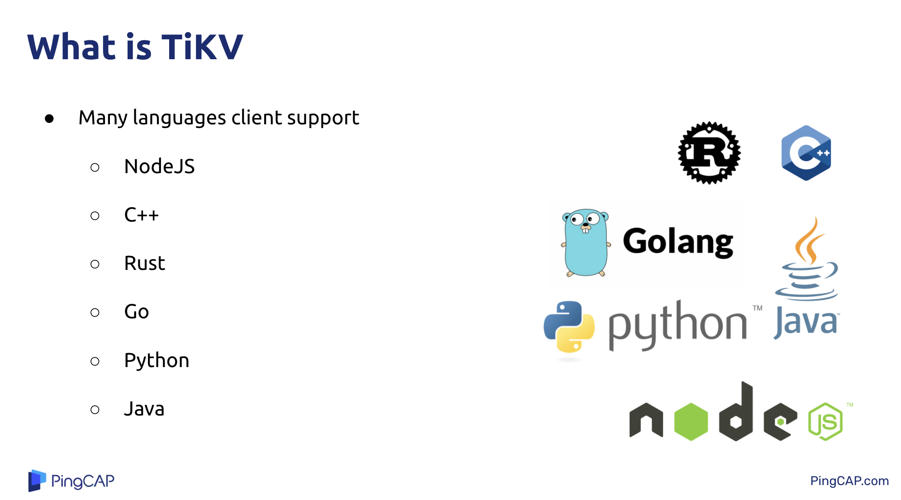

客户端支持多种语言。但是客户端代码核心其实只有一个版本，就是 Rust 版本。其他语言是通过 FFi 来调用 Rust 版本的库，实现多语言客户端支持。

接下来看 Python 客户端。

**为什么不直接使用 Python 实现 Client ？**

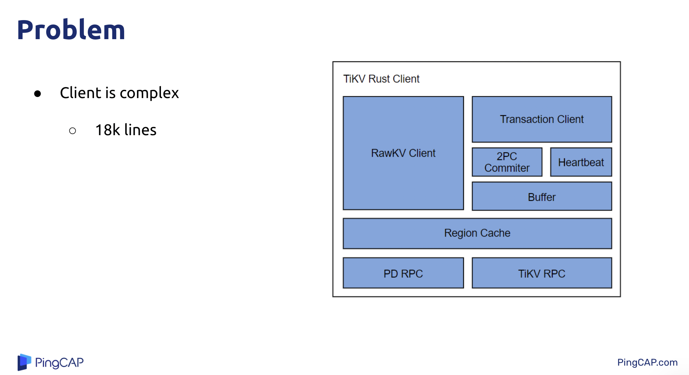
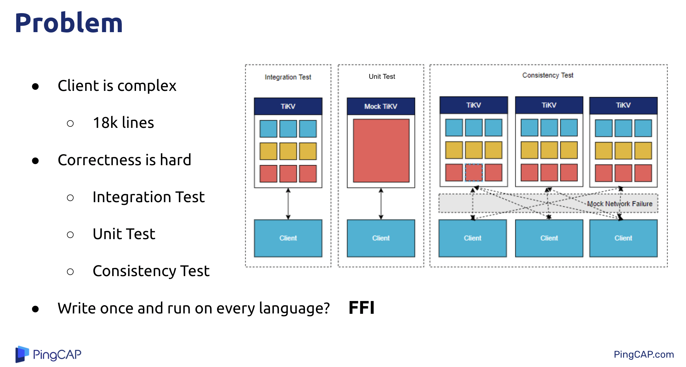

有几个原因:

1. 因为 TiKV Client 很复杂。如上图里面的结构所示，底层是和服务器沟通的 RPC，上面还有缓存，再往上是两种访问模式：RawKV 和 支持事务模块（要求强一致，用于OLTP场景，比如银行）。代码量现在包含 1.8w行代码。
2. 正确性很难。现在有集成测试、单元测试和一致性测试、混沌测试。这些只能跑在 Rust 相关组件上。
3. 需要做到代码只需编写一次，就可以应用到其他语言。

所以就使用了 FFi 。

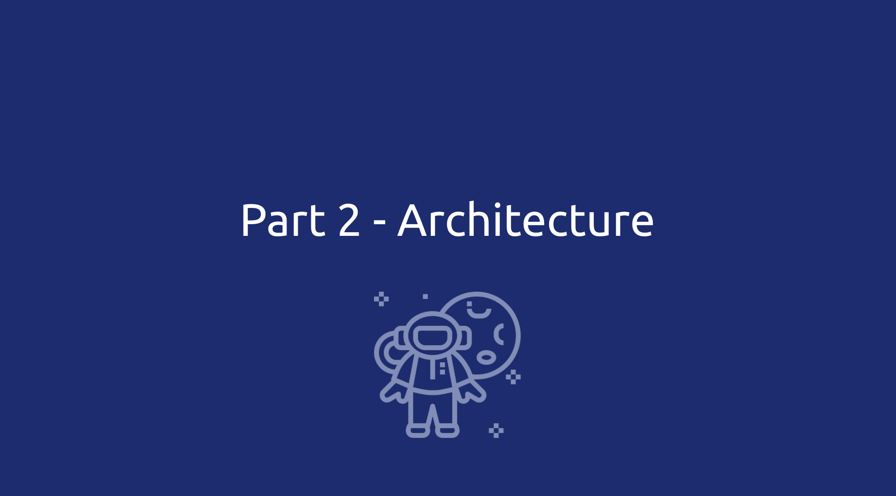

**那么现在 TiKV Client 的架构是怎么样的？**

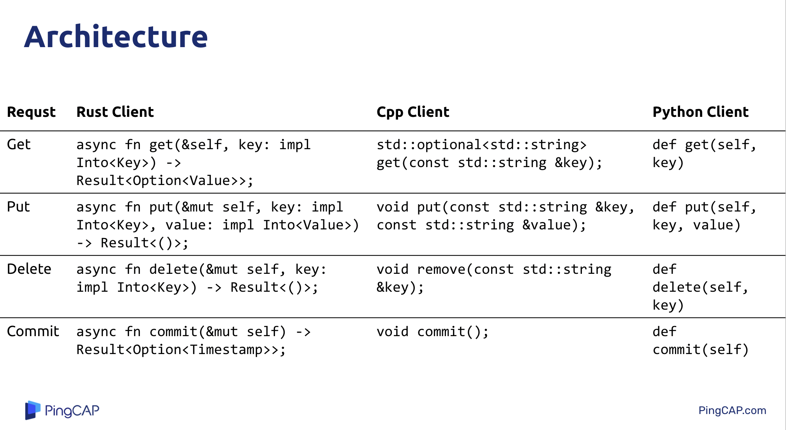

最左边是 Rust Client 的 API，和它对比的是 Cpp Client 和 Python Client。

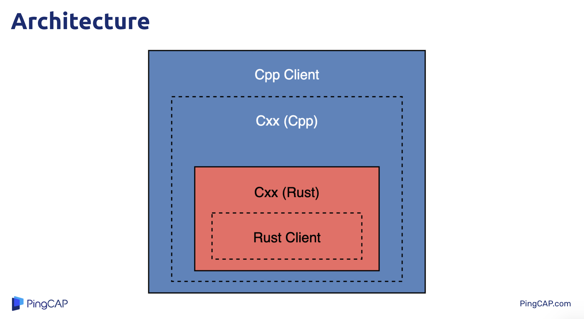

现在是一个洋葱结构。最里面红色部分是那1.8w的Rust 代码。

Cxx 是一个安全沟通 Rust 和 Cpp 的库。在 Rust 这边会封装一个安全的 C-ABI，然后在 Cpp 那边把 C-ABI 转换为 Cpp ，就形成一个胶水层。 最后再把这个胶水层封装为一个让用户使用的库。

这两种颜色实际对应两个静态库，然后把它们链接在一起使用。

其他语言客户端和这个 Cpp 客户端结构完全一致。唯一的区别是 Java 和 Nodejs 客户端需要动态库。

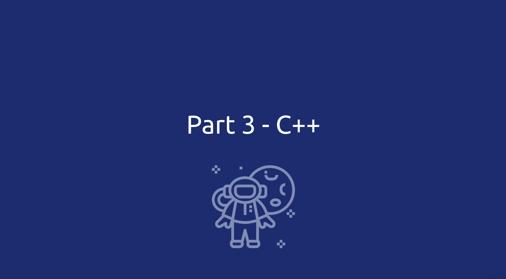

**现在展示 FFi 的一些细节。**

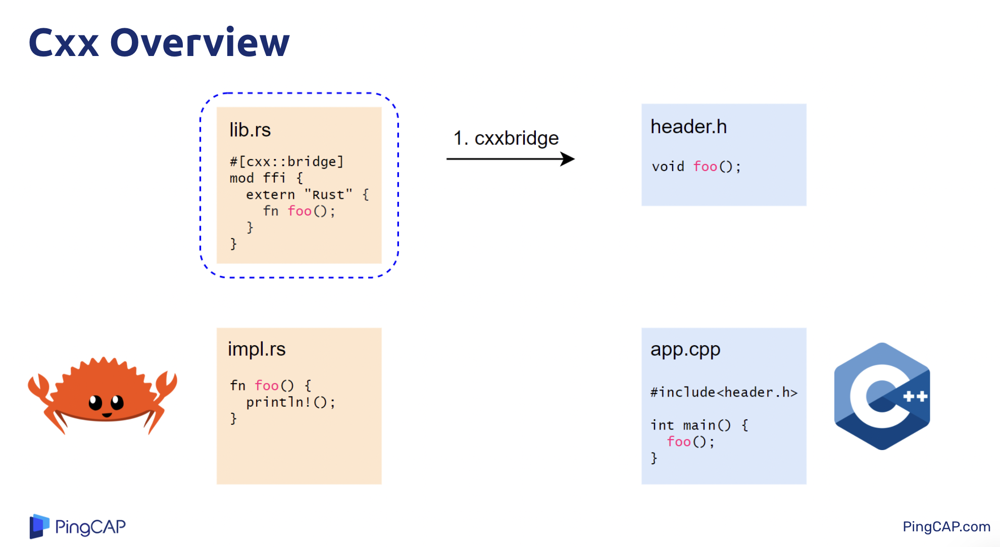

如图，如果想在 Cpp 里调用 左边的 `impl.rs` 中的 `foo` 函数，该怎么做？

我们可以引入 cxx，该库提供了一个过程宏 `#[cxx::bridge]`来帮助我们自动生成 Cpp 里的头文件。

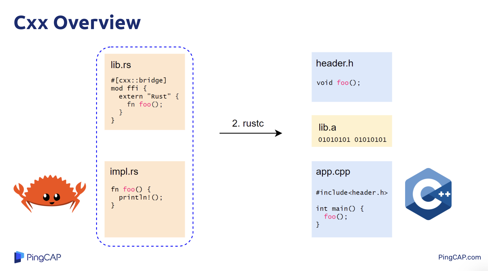

然后编译左边 Rust 代码，会生成一个静态库。

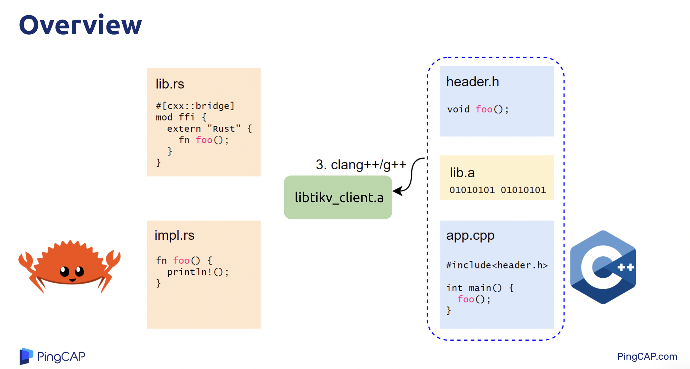

然后使用 Cpp 编译工具把 Cpp 代码编译得到`.o`文件，然后和Rust编译生成的静态库合在一起，最终生成一个新的静态库。这样 Cpp 那边就可以调用 Rust 代码了。

同理，Cpp Client 的机制是类似的。

**接下来看一下 Cxx 在做 FFi 的时候考虑的重点。**

FFi 比较常见的问题就是内存分配问题。比如，想把Rust 里的 String 传递给 Cpp 来使用。如果 Cpp 去析构这个 String，那么就会引发段错误。因为 Cpp 不知道这个String是哪来的，它会当作自己的。

如何解决这个问题？

Rust 这边只传一个引用到 Cpp，Cpp 这边调用 Rust 这边定义的析构函数 Callback。

反过来也一样。谁分配谁负责释放，通过callback函数调用。

Cxx 这个库会帮你来做这些。

Cxx 库还定义了其他类型。

这是从 Cpp Client 里提取出的代码。

首先，在 Rust 这边定义了一个事务 Get 的请求。这个请求就是简单的通过 Key 获取一个 Value 。它返回的值是一个 Optional 的。很有可能这个值是不存在的，所以这里定义了一个 Struct ，添加一个字段来表明这个值是否存在。

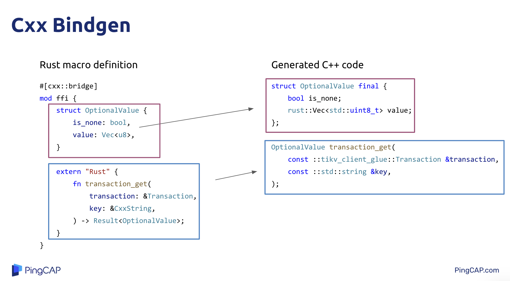

然后 Cxx 会自动生成 Cpp 的头文件，对应关系如图。

用户可以这样去使用。

Cpp 里的 `transaction_get`函数会调用 Rust里对应的函数。

Cpp 这边会把一个 String 的引用传过去，并没有所有权。此时是一个 `cxx::CxxString` 引用。

然后 Rust 这边会通过`transaction.inner.get(key)`调用底层 Rust 实现，然后返回一个 Rust String(Vec)，传给 Cpp 。

经过 Cxx 的包装，开发起来还是极方便的，很爽。

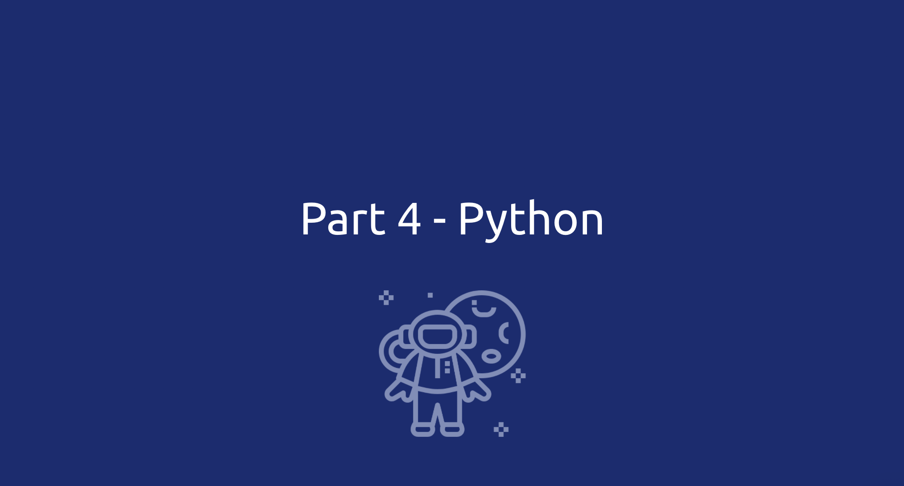

那么 Python Client 怎么样呢？

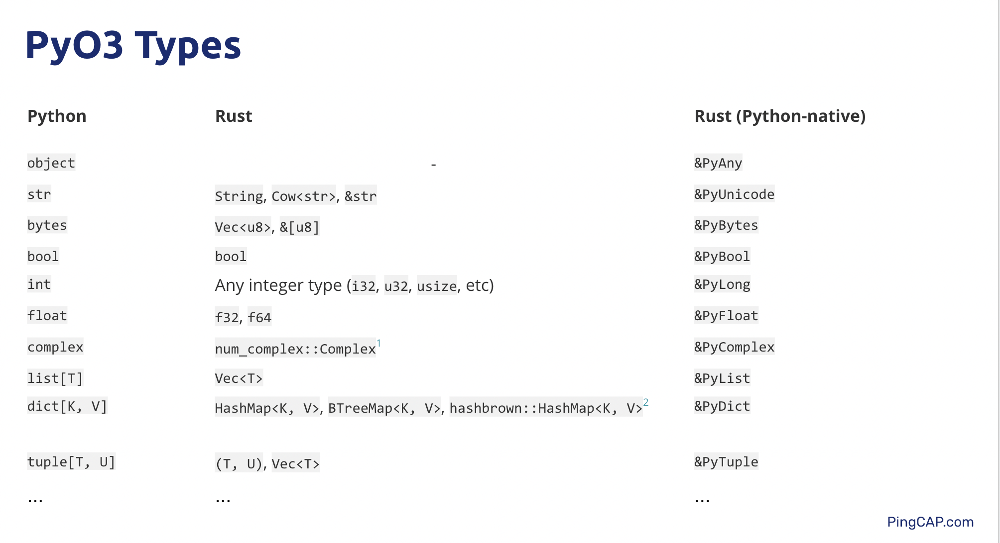

通过 PyO3 库来帮助轻松绑定 Rust 库。

> 编者按：PyO3，命名形式像化学表达式，取自「氧化」之意。这和 Rust 有「锈」这层意思有关。

基本原理和 Cpp Client 类似。

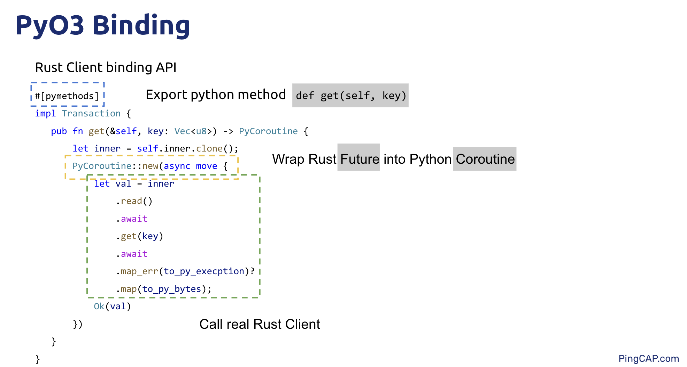

同样是一个 CET 请求。但是这里 Rust 返回的是一个 异步Future 对象，但是 Python 的异步模型是 Python Coroutine。所以需要一个 `PyCoroutine`的类把 Future 包起来。

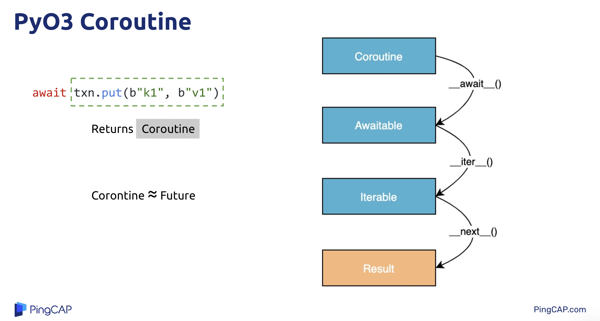

Python 的 Goroutine 调用 await 之后会返回 Awaitable，然后再调用  awaitable的iter得到迭代器，然后进行迭代，直到异步任务完成。

Python 里只要调用方法符合这三步，因为 Duck Type 的设计，就都可以用 Pyhton 都 await 来调用。

所以就可以模仿这个过程。

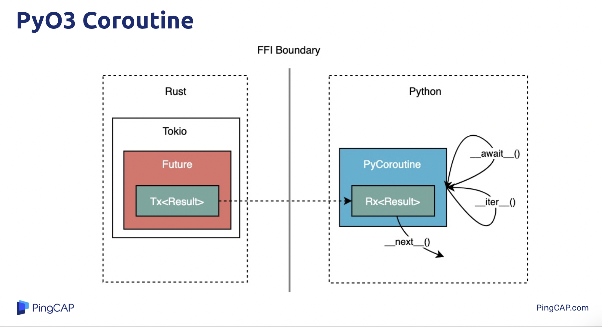

第一步，在生成 Coroutine 的时候，要生成一个配对的 Future。但不去执行它。右边 PyGoroutine 也只是一个包装。它们俩通过 Channel 沟通，PyGoroutine 这边拿着 Reciver。

然后，当 Python 那边调用一个 await 的时候，就会通知 Rust 这边，把 Future 放到 tokio 运行时来跑，真正开始干活。

当 Python 调用 iter 的时候，则什么都不干。因为对于这个模型来说，iter没有用。

当 Python 调用 next 的时候，则会尝试从 channel Reciver 中拿结果。假如 Rust 里 poll 没有完成，那么 Reciver 里就没有值，但是 Python 的 next 会一直轮询，直到有值。

那么 TiKV Client 未来准备做什么？

目前 Java Client 和 Node Client 是正在测试阶段。

Java Client 会调用 JNI ，而 JNI 可能会给 FFI 带来不确定的因素，比如 延时/ GC。

虽然都套用同一套 Rust 实现，但是还需要测试去保证正确性。然后准备在 Client 之上再构建一套统一的测试代码，这样就可以达到 核心代码是同一套，测试代码是同一套。

---

## 作者简介：

骆迪安，目前为 PingCAP 分布式存储工程师，负责 TiKV 事务模块的开发，同时也负责 TiKV 社区管理和运营。对 Rust 社区和函数式编程感兴趣。