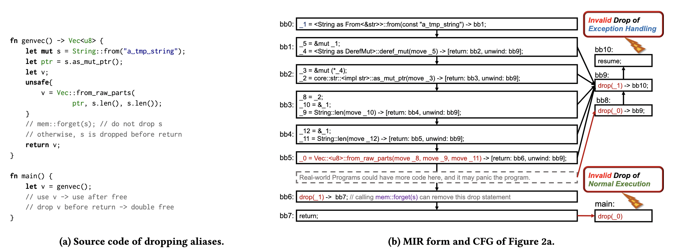
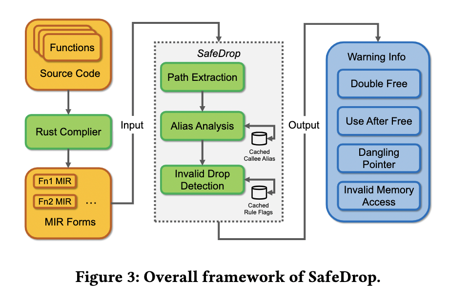

# 论文鉴赏 | SafeDrop：通过静态数据流分析检测Rust程序的内存释放错误

编辑： 张汉东

> 论文原文：[https://arxiv.org/abs/2103.15420](https://arxiv.org/abs/2103.15420)

> 编者按：
>
> 该论文是由复旦大学四位同学共同编写，其中两位共同第一作者 崔莫寒 和 陈澄钧 也参与了 4 月 9 号 RustFriday 飞书群线上沙龙 第三期的活动。回放地址：[https://www.bilibili.com/video/BV1nU4y1h7NN/](https://www.bilibili.com/video/BV1nU4y1h7NN/)
>
> Rust 中文社群 飞书群 邀请你加入：[https://applink.feishu.cn/TeLAcbDR ](https://applink.feishu.cn/TeLAcbDR)
> 
> 论文中提到的 SafeDrop 工具还未开源，等工具得到进一步完善就会开源。
>
> 本文也不是全文翻译，只是摘录关键部分。欢迎观看沙龙视频回放。

---

## 介绍

Rust是一种新兴的编程语言，旨在防止内存安全错误。但是，Rust的当前设计还会带来副作用，这可能会增加内存安全问题的风险。特别是，它采用OBRM（基于所有权的资源管理），并在没有垃圾收集器的情况下自动执行未使用资源的自动重新分配。因此，它可能错误地处理已回收的内存并导致使用后释放或两次释放的问题。在本文中，我们研究了无效的内存分配问题，并提出了SafeDrop，一种静态的路径敏感型数据流分析方法来检测此类错误。

我们的方法通过遍历控制流图并提取每个数据流的所有别名，来迭代地分析 Rust Crate的每个API。为了保证精度和可伸缩性，我们利用改进的Tarjan算法来实现可伸缩的路径敏感分析，以及基于缓存的策略，以实现高效的过程间分析。我们的实验结果表明，我们的方法可以成功地检测出所有此类问题的现有CVE，而误报的数量有限。与原始编译时间相比，分析开销从1.0％到110.7％不等。我们进一步将工具应用于多个真实的Rust Crate，并发现8个涉及无效内存释放问题的Rust Crate。


OBRM（基于所有权的资源管理）模型假定在创建所有者时应分配资源，并在其所有者超出有效范围后进行释放。理想情况下，即使程序遇到异常，该模型也应能够防止指针悬空和内存泄漏。

但是，我们观察到，现实中Rust Crate的许多关键错误都与这种自动释放方案相关，例如，它可能会错误地丢弃一些仍在使用的缓冲区并招致 `use-after-free` 的错误（例如CVE-2019-16140），或者可能会错误地丢弃`dangling pointers`并导致 `double free`（例如CVE-2019-16144）。

通常，内存释放错误是由 Unsafe Rust 代码触发的。在Rust中， Unsafe Rust 的API是必需的，以提供对实现细节的底层控制和抽象。但是，滥用 Unsafe Rust 的API可能会使基于所有权的资源管理系统的健全性失效，并可能导致不确定的行为。例如， Unsafe Rust 的API可能导致共享别名的内存回收，而删除一个实例将导致其余别名的指针悬空。此外，Rust中的内部 Unsafe Rust 允许仅在内部具有不安全代码的函数可以被称为安全函数，内部可能存在内存安全问题。当前的Rust编译器对 Unsafe Rust 代码的内存安全风险一无所知，只是假设开发人员应负责使用它们。内存安全性是Rust提倡的最重要的功能，如果可能的话，降低这种风险非常重要。

针对此问题，本文提出了 SafeDrop，这是一种静态路径敏感的数据流分析方法，用于自动检测内存安全性错误释放机制。 Safe-Drop反复分析Rust Crate的每个API，并仔细检查Rust MIR（中级中间表示）中的每个drop语句是否可以安全启动。由于别名分析的潜在问题是可以决定的，因此它很难解决，因此我们采用了几种设计来提高我们方法的可扩展性，同时又不牺牲太多精度。我们的方法采用路径相遇（MOP）方法，并基于改进的Tarjan算法提取每个函数的所有有价值的路径，这对于消除具有相同别名关系的循环中的冗余路径是有效的。对于每个路径，我们以对流量敏感的方式提取所有别名的集合，并相应地分析每个dropstatement的安全性。当遇到函数调用时，我们在被调用者上递归执行SafeDrop，并分析参数与返回值之间的别名关系。为了避免重复分析，我们缓存并重用每个函数获得的别名结果。

## MIR 介绍

因为 SafeDrop 是基于 MIR 来分析，所以先了解下 MRI 相关。

Rust 的编译过程中会产生 MIR (中级中间语言)，MIR 语法格式：

```rust
BasicBlock := {Statement} Terminator
Statement := LValue = RValue | StorageLive(Value)
    | StorageDead(Value) | ...
LValue := LValue | LValue.f | *LValue | ...
RValue := LValue | move LValue
    | & LValue | & mut LValue
    | * LValue | * mut LValue
    | ...
Terminator := Goto(BB) | Panic(BB)
    | Return | Resume | Abort
    | If(Value, BB0, BB1)
    | LVALUE = (FnCall, BB0, BB1)
    | Drop(Value, BB0, BB1)
    | SwitchInt(Value, BB0, BB1, BB2, ...)
    | ...
```

MIR是基于控制流图（Control Flow Graph，CFG）的有向无环图，主要包含了上面所说的几个语法元素：

- BasicBlock，由基本语句和终止符组成。
- Statement，基本语句，就是每一行 Rust 代码转译为 MIR 的对应代码
- LValue && RValue， 分别对应位置表达式和值表达式。
- Terminator，终止符，BasicBlock 的出口，包含各种形式的跳转，比如 Return/Resume/Abort/IF/Drop等等

## SafeDrop 基于 MIR 分析



如图所示。左侧为代码，右侧为该代码生成的 MIR。

SafeDrop 会依赖 MIR 进行静态路径分析。代码左边从 字符串 S 得到了指向堆的指针 `ptr`，然后通过`Vec::from_raw_parts`又创建了一个新的对该堆内存有所有权的变量，相当于现在同一片堆内存，有了两个指针。然后注释了 `mem::forget(s)`，代码就会发生 `double free` 的问题。但是解开`mem::forget(s)`的注释，又会发生`use-after-free`的问题。

这段代码比较简单，其实用 Miri 也可以检测出来这两种 UB。但是 SafeDrop 检测机制和 Miri 还是有所区别的。

SafeDrop 检测 MIR 中的 调用路径，会发现 `drop(_0)` 和 `drop(_1)`调用了两次，就会发现问题所在。同样，如果把 `mem::forget(s)`注释打开，也会检测到 `drop` 后又使用的情况，让 UB 无所遁形。

## 形式化定义问题

经过一些实验，SafeDrop 团队将 Unsafe Rust 中的遇到的一些常见问题做了形式化定义：

- 使用中释放缓存区(Dropping buffers in use)

    如果该算法错误地释放了一些缓冲区，这些缓冲区将在以后访问，则它将导致容易受到内存安全问题（包括释放后使用和双重释放）的指针的困扰。
- 释放无效指针（Dropping invalid pointers）。
    如果无效指针悬空，则丢弃指针将导致double free；否则，指针将丢失。 如果无效指针指向包含指针类型的未初始化内存，则删除该指针可能会递归删除其嵌套指针，并导致无效的内存访问。


## SafeDrop 中检测无效内存位置的典型模式


- UAF: use after free; 
- DF: double free;
- IMA: invalid memory access

SafeDrop 检测无效内存位置遵循下面 7 种模式：

- Pattern 1: `GetPtr() -> UnsafeConstruct() -> Drop() -> Use()  => UAF`
- Pattern 2: `GetPtr() -> UnsafeConstruct() -> Drop() -> Drop() => DF`
- Pattern 3: `GetPtr() -> Drop() -> UnsafeConstruct() -> Use()  => UAF`
- Pattern 4: `GetPtr() -> Drop() -> UnsafeConstruct() -> Drop() => DF`
- Pattern 5: `GetPtr() -> Drop() -> Use() => UAF`
- Pattern 6: `Uninitialized() -> Use()  => IMA`
- Pattern 7: `Uninitialized() -> Drop() => IMA`

## 检测方法

### 整体架构



上图为 SafeDrop 的工作流程图解。将「通过对路径敏感的数据流分析方法」集成到名为SafeDrop的编译器中进行分析。它输入每个功能的MIR并输出潜在的无效内存警告。

**SafeDrop的关键步骤：**

- 路径提取：SafeDrop采用“ meet-over-path ”方法来实现路径敏感性。由于函数的路径可能是无限的，因此我们采用基于Tarjan 算法的新颖方法来合并冗余路径并生成生成树。 此步骤将遍历此树并最终枚举所有有价值的路径。
- 别名分析：SafeDrop 对字段敏感。 此步骤分析每个数据流的变量和复合类型的字段之间的别名关系。 SafeDrop 也是跨程序的，对上下文不敏感。 它缓存并重用在返回值和参数之间获得的被调用者的别名关系。
- 无效的 drop 检测：基于之前建立的别名集，此步骤为每个数据流搜索有潜在风险的 drop 模式并记录可疑代码段。

上面三个步骤的具体算法在论文中有详细描述，对算法细节感兴趣可以自行阅读论文。

该团队已经把 SafeDrop 和 Rust编译器v1.52 进行了集成（非官方动作），并且可以由诸如 rustc 和 cargo之类的命令行工具使用。

## Miri vs SafeDrop

Rust Miri 是Rust MIR的实验解释器，它可以运行二进制文件，Cargo 项目的测试套件并检测一些未定义的行为。 

Miri的功能比 SafeDrop 更广泛。Miri支持检查越界内存访问，对齐内存访问不足以及违反某些基本类型不变式的情况。 

但是，Miri是一种动态分析方法，无法跟踪无法展开分析和库分析的程序的所有有价值的路径。 相反，SafeDrop是一种静态方法，可以在编译时分析每个函数的所有有价值的路径。

## 未来挑战

- 增强性能。
- 降低检测误差。
- 对 Rust 标准库进行检测。
- 开源
- 其他

