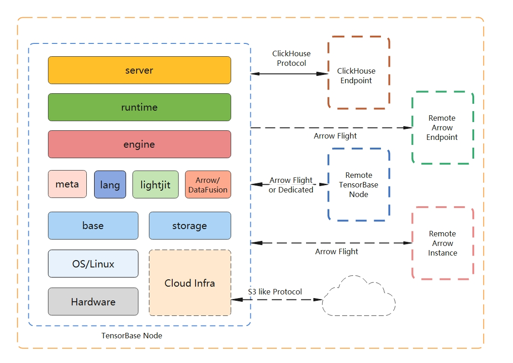
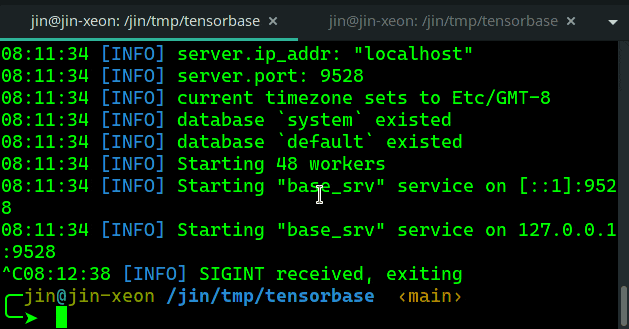

# 开源产品 | TensorBase，基于Rust的现代化开源数据仓库

作者：金明剑 / 后期编辑：张汉东

> 编者按：
>
>在当前国产替代背景下，国产开源软件层出不穷。
> 
> 数据库领域作为占据IT基础架构软件的 20%，目前也有很多国产数据库。比如 国内阿里的 OceanBase、腾讯的 TBase、PingCAP的 TiDB 等。
>
> 而作为基础架构软件领域开发难度最大的三个部分，替代周期非常长，因此国产数据库会有很大替代的机会。
> 
> TensorBase 是金明剑博士的创业项目，使用 Rust 实现的现代化开源数据仓库，也开始迈出了这艰难的一步。据悉，TensorBase 项目目前已获得世界知名创业投资加速机构的天使轮投资，期待 TensorBase 生态繁荣。

---

## TensorBase是什么

这是一个数据以海量方式产生的时代，但我们这个时代的个体和绝大多数企业并没有很好基础设施来发掘这些正在海量产生的数据的价值。TensorBase，从一个现代的全新视角出发，用开源的文化和方式，重新构建一个Rust下的实时数据仓库，服务于这个海量数据时代的数据存储和分析。

## TensorBase的优势

1. All in Rust。Rust的优点已经被Rust月刊中的各种文章所反复“安利”，不多赘述。TensorBase认为，Rust是一次系统工程的编程范式革命。范式的革命为我们提供了利用新的工具和方法去构建新的基础设施平台的契机。作为系统语言“试金石”的数据库类软件，Rust不应缺席。TensorBase已经在日常测试中经历数十TB的数据注入锤炼，是目前Rust社区中，面向用户特别是中小企业实际场景深度优化的、生产完成度最高的通用数据仓库类项目。

2. 开箱即用。TensorBase已经支持从数据插入或导入到查询完整数据仓库流程，具备了较高的早期完成度。从您看到本文的这一刻开始，就可以从TensorBase的Release页下载相关Linux环境下的二进制文件，进行尝试。（Windows 10的WSL2目前应该也是能用的，欢迎反馈！）

3. ClickHouse协议兼容。ClickHouse作为一个C++编写的数据仓库，已经为国内外的很多企业所使用。TensorBase则使用Rust语言从头开始实现了一个高性能的ClickHouse SQL方言解析器和TCP通讯协议栈。ClickHouse TCP客户端可以无缝连接TensorBase。所以，如果你有ClickHouse的使用经验，你可以零学习成本地使用TensorBase。即使没有用过ClickHouse，你也很容易找到相关学习资料，这令你能轻松进入TensorBase。

4. 性能为先。TensorBase期望通过新的软件和系统设计将现代硬件的所有潜力发挥出来。TensorBase首次在核心链路代码上实现了“F4”：Copy-free，Lock-free，Async-free，Dyn-free（无动态对象分发）。[初步的性能评估](https://github.com/tensorbase/tensorbase#benchmarks)显示：在14.7亿行的纽约出租车数据集上，TensorBase的简单查询的性能上已经领先ClickHouse。当然，在复杂的查询上，TensorBase离ClickHouse还有一定差距，但这正是我们开源社区所想要推进的。

5. 化繁为简。目前的大数据系统使用非常复杂，即使想运行一个最简单的系统，都需要配置大量难以理解的参数或者安装大量第三方依赖。
    + 对于用户，除了现在已经达成的开箱即用，TensorBase希望系统在运行时能在自治运行，而不是依赖运维管理员。
    + 对于开发者，TensorBase希望将贡献门槛降低。整个项目架构设计简洁高效（更多信息参见后文），项目外依赖很少，完全重新编译（cargo clean到cargo build）的单机时间在1分钟之内。（大数据系统或者C++数据库的完整构建时间往往以小时计。）

6. 互联未来。TensorBase在核心上改造了Apache Arrow和DataFusion，无缝支持Arrow格式查询、分析和传输。Arrow格式作为越来越广泛采用的大数据交换中间格式，已经被多个数据库及大数据生态平台所支持。TensorBase在引擎上兼容Arrow，未来可以同时支持云原生和云中立场景下的数据仓库体验，提供存储中立的数据湖服务。

## TensorBase的架构

TensorBase整体架构

* Base Server

  TensorBase服务接口层。对外提供数据的接口服务，比如数据的写入和查询入口。TensorBase创造性的实现了世界上第一个非C++的ClickHouse TCP协议服务栈，可以支持ClickHouse客户端（clickhouse-client命令行）以及native协议语言驱动的直接连接。同时，Base Server是第一个async中立的Rust高性能服务器。Base Server基于改造的Actix事件循环，在服务的实现中完全不使用async，在提供绝佳的可调试性的同时，评测性能也大幅超过基于tokio默认async表达层的实现。未来可以引入非tokio的网络io层实现。

* Base Meta/Runtime/Storage

  TensorBase的元数据层、运行时层和存储层。在存储层，TensorBase非经典的列式存储。这其中最重要的，我们给出了一个反重力设计：No LSM。我们不再使用在目前开源数据库及大数据平台流行的LSM Tree（Log Structured Merge Tree）数据结构。而是使用一种我们自己称之为Partition Tree的数据结构，数据直接写入分区文件，在保持append only写入性能的同时，避免了LSM结构的后续compact开销。得益于现代Linux内核的支持和巧妙的写入设计，我们在用户态（User-space）核心读写链路上不使用任何锁（Lock-free），最大程度的发挥了高并发网络服务层所提供的能力，可以提供超高速数据写入服务。

* Base Engine

  TensorBase的引擎层。TensorBase使用改造过的Apache Arrow和DataFusion，并创造性的将底层存储适配到Arrow格式，实现了Zero Copy的数据查询。当然，目前的适配性存储策略，还只算是一个现在进行中的次优解，TensorBase未来会对存储层进行持续迭代，提供更多与时俱进的优化。同时，TensorBase也将进一步地优化帮助Arrow/DataFusion社区优化其查询引擎的性能，和社区一起成长。

* 其他

  TensorBase还有一些基础性的组件，比如：
    * base，通用工具库；
    * lang，语言层（目前主要实现一个ClickHouse兼容解析和表示层）。
    + lightjit，类表达式JIT引擎，未来可扩展至高性能和安全可控的用户定义函数UDF（User Defined Functions）层。

  TensorBase未来将进一步开发和开放自己的高性能基础件，为Rust社区贡献一些独特的高性能可复用基础设施。

  最后，架构图中的虚线连接尚未实现，放在这里提供给大家一个全景式的架构蓝图。

## TensorBase的进展

*TensorBase开箱即用演示*

如上图所示，TensorBase已经能提供开箱即用的单机数据仓库服务，欢迎试用反馈。

在未来的几天内，我们将完成通过TPC-H评测所需的存储层支持（主要是String类型的存储支持），并提供初步的TPC-H测试结果。

近期线路图包括如下几个有趣的方向：

1. 分布式集群。
基于DataFusion的Ballista，很容易实现一个类ClickHouse的简易（半人工）分布式集群方案。然而，我们将这作为开始，TensorBase希望提供新的思维和方向，让分布式查询这件事能做的简单高效、易于开发和维护。
2. 存储层增强。引入主键等高级选项。
3. Arrow和Data Fusion查询内核性能改进。
4. ClickHouse HTTP通讯协议及其他查询前端增强。
5. 单机可靠性加固。

## 加入社区

TensorBase相信，一个能适应时代的基础设施，如同Rust语言本身一样，一定是开源和创新的。欢迎大家到TensorBase社区来分享自己的观点和代码，见证对未来数据仓库的思考和迭代。

+ 项目地址：https://github.com/tensorbase/tensorbase
+ Discord服务器：https://discord.gg/E72n2jzgKD
+ Slack频道：https://join.slack.com/t/tensorbase/shared_invite/zt-ntwmjvpu-TQ9drOdUwNJWmUTXvxMumA
+ 微信群

扫码加微信群：

TensorBase将推出更多的系列文章，以期让大家更深入的理解项目以及Rust语言在项目中的使用，也欢迎所有有兴趣的小伙伴参与到整个开源工程当中。

加入TensorBase社区，一起构建Rust大数据生态的下一个五年！

------------------------------

### 作者简介：

金明剑，TensorBase项目创建人，中国科学院大学博士，17年商业和高性能软件开发经验，Eclipse平台先锋，Scala语言先锋，Scala基金会2010年首次入选谷歌编程之夏的项目完成人，阿里云天池工程系列赛多项赛事记录的保持者。在大数据基础设施、语言和高性能系统等方面长期保持系统性地思考及研究。
