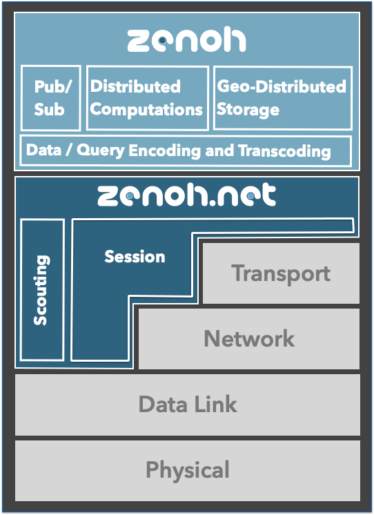

# 开源产品 | eclipse zenoh 助力雾计算和边缘计算

原作者：Angelo @ adlinktech.com  / 编辑整理：张汉东

> 编者按：
>
> 凌华科技（AdlinkTech）公司总部位于台湾，并在美国、新家坡、北京、深圳、上海等40多个国家和地区设立分支机构。
> 
> 在 2020年7月，凌华科技(ROS 2技术指导委员会成员)推动 Eclipse Cyclone DDS (OMG数据分发服务规范的实现) 成为 ROS Tier-1  中间件，将要书写机器人和IoT系统的未来。而 eclipse zenoh 正是 CychoneDDS 的姊妹项目。

---

[eclipse zenoh （读： /zeno/ ）](https://projects.eclipse.org/proposals/eclipse-zenoh) ，提供了零开销的Pub/Sub、Store/Query 和 计算。

zenoh 统一了 动态/静止/使用中的数据并提供计算结果。它颇有分寸地将传统的Pub/Sub与地理分布的存储、查询和计算融合在一起，同时保留了远远超出任何主流协议栈的时间和空间效率水平。

官网是 [zenoh.io](http://zenoh.io/) 。

GitHub代码仓库 [eclipse-zenoh/zenoh](https://github.com/eclipse-zenoh/zenoh) 。

2020 年 12 月 [Eclipse Edge Native](https://edgenative.eclipse.org/) 工作组启动，并将 Zenoh 引入 Eclipse 。并用 Rust 对 zenoh 进行重写。

#### Why Rust

zenoh的第一个版本是用`OCaml`（一种纯的 ML 函数式编程语言）编写的。 OCaml 使开发者能够非常快速地进行实验并具有良好的性能。 但是，zenoh 团队从社区收到的主要反馈之一是，很少有人知道这种编程语言，这限制了人们的贡献。 此外，zenoh团队还希望使zenoh更快更小。 一个显而易见的选择是用`C / C ++`编写新版本，但是zenoh团队不想失去的是使用`OCaml`所享有的安全性。 另外，如果不得不离开心爱的`OCaml`，也不想完全放弃高级抽象。 zenoh团队还想避免运行时间长和垃圾回收器过多的语言。 早在2015年，zenoh团队就已经看过Rust了，但那时他们并不觉得对他们而言是正确的选择。 2018 Edition 在编程语言中引入的改进以及异步的引入使 Rust 成为了 zenoh 的理想选择。在使用 Rust 重写以后，性能得到了很大的提升。

# 概述

zenoh 将动态数据、使用中数据、静态数据与计算整合。它巧妙地将传统的发布/订阅与地理上分散的储存、查询和计算融合，同时保有远胜任何主流堆栈的时间和空间效率。

随着连网设备的数量稳定增加，业界在计算、储存和通信能力方面遇到前所未有的异质性，并且在产生数据以及必须交付和使用数据的规模方面面临新的挑战。

此外，基于性能、效率和隐私考虑，人们越来越希望使数据处理尽可能靠近来源，同时方便存取远距离的应用程序。换句话说，我们正经历主流[架构转换](https://perspectives.tech/2019/12/10/architectural-liberum-arbitrium/)，从以云端为中心的模式（从云端到雾端储存、处理和采集数据）变成[以边缘为中心](https://edgenative.eclipse.org/)的模式（在对性能、能源效率和安全性最有意义的位置储存和处理数据）。

**zenoh** 的目的在于满足必须以可扩展、高效率且位置透明化的数据方式处理动态数据、静态数据和计算的应用程序的需求。

**zenoh** 的目的在于：

- 提供小型原语集合以处理动态数据、静态数据和计算。
- 全面控制储存位置和后端技术整合。
- 将网络负担最小化 – 数据信息的最小线路负担为 4 字节。
- 支持极度受限的装置 – 在 Arduino Uno 上的占用空间为 300 字节。
- 允许数据交换模式和排程交涉以支持低工作周期装置。
- 提供丰富的抽象化集合，在整个系统中分配、查询和储存数据。
- 提供极低延迟和高传输量。我们也提供 zenoh 的效率相对于 MQTT 等主流协议的分析与实证比较。
- 提供称为 zenoh-net 的低端 API，让您全面控制 zenoh 原语。

# zenoh 关键概念

## 部署单元

zenoh 提供三种部署单元：

- 对等方（peers）。用于在 对等网络（peer-to-peer）、网状（mesh）拓扑网络和其他节点通信，也可以通过路由器与广泛的系统通信。
- 客户（clients）。用于连接单个路由器（或点）来和系统其他部分通信。
- 路由器（routers）。用于在 client和peers之间、集团拓扑和网状拓扑网络之间路由数据。

## 用户 API

zenoh 提供 两级 API 。

### zenoh-net

实现能够在数据链路，网络或传输层之上运行的网络层。

zenoh-net支持点对点和路由通信，提供了允许Pub/Sub（Push）通信以及 Query/Reply (Pull) 通信的关键原语。它支持分段和有序可靠交付，并为 [Discovery( ROS2 Discovery Service )](https://docs.ros.org/en/foxy/Tutorials/Discovery-Server/Discovery-Server.html)提供了可插入的侦查抽象。

 zenoh-net定义并建立在会话协议的基础上，该会话协议为有序尽力而为（ best effort）和具有不受限制的 MTU 的可靠信道提供了抽象，而 MTU 与底层无关。

zenoh-net层仅关心数据传输，不关心数据内容或存储数据。

提供的原语：

- **Write**：将实时数据推送给相对应的订阅者。
- **Subscribe**：订阅实时数据。
- **Query**：从匹配的查询对象中查询数据。
- **Queryable**：能够响应查询的实体。

### zenoh

zenoh 层为 Pub/Sub 和分布式查询提供了高级API，以更简单和更面向数据的方式提供与zenoh-net API相同的抽象，并提供所有构建块来创建分布式存储。 zenoh层知道数据内容，并且可以应用基于内容的过滤和代码转换。

它处理数据表示编码和代码转换，并提供地理分布式存储和分布式计算值的实现。 zenoh原生支持一系列数据编码，例如JSON，Properties，Relational，Raw等，以及跨支持格式的转码。 它还基于URI语法定义了规范的查询语法。 zenoh层还提供了存储后端插件API，以简化第三方存储技术的集成。 当前支持的存储后端是Memory，MySQL，MariaDB，PostgreSQL，SQLite和InfluxDB。默认情况下，地理分布式存储在最终一致性下工作。 用户可以利用仲裁（*Quorum*）机制实现更强的一致性。

提供的原语：

- **Put**：将实时数据推送到匹配的订阅者和存储。 （相当于zenoh-net write）
- **Subscribe**：实时数据的订阅者。 （相当于zenoh-net订阅）
- **Get**：从匹配的存储和演算中获取数据。 （相当于zenoh-net查询）
- **Storage**：一个zenoh-net 订阅者侦听要存储的实时数据，以及一个zenoh-net 可查询以响应匹配的get请求的组合。
- **eval**：能够响应请求的实体。 通常用于按需提供数据或构建RPC系统。 （相当于zenoh-net可查询）

## zenoh 目前的一些特性

**更好的协议支持**。在利用网络特定功能的同时将 zenoh 移植到不同类型的网络非常简单。用户提供的附件与数据和查询可以一起携带。 zenoh应用程序可以使用这些附件来扩展协议，或例如增加用户级别的安全性。

**通用的点对点和客户通信**。应用程序可以在运行时决定其行为类似于 对等方（peer） 还是 客户（client）。对等方在彼此之间路由信息，也可以代表客户进行路由，换句话说，对等方的行为类似于路由器。对等网络通信支持任意连接图，并在特殊情况下支持集团。

**基于Closure的发现**。侦察（**scouting**）协议支持zenoh中的发现，以便简化想要利用集团（clique）连接性的系统的部署，在多播不可用或不希望使用多播的情况下，现在支持基于Closure的发现。换句话说，从单个对等方开始，可以发现其 Closure，或者换句话说，可以从此起点直接或间接地到达对等点。

**基于区域（Region）的路由**。这实际上意味着两件事：（1）建立和维护路由表随区域大小缩放所需的路由信息，以及（2）每个区域都可以决定是否要在任意连接图上进行路由的集团。通过允许在区域内使用最合适的路由技术，这种路由方法将极大地提高可伸缩性和性能。

目前，Zenon 发布了 代号为 Aithusa 的版本，提供了[ DDS Plugin](https://github.com/eclipse-zenoh/zenoh-plugin-dds) 和 [ROS2](https://docs.ros.org/en/foxy/index.html) 的集成。

### 参考

- [http://zenoh.io/docs/overview/](http://zenoh.io/docs/overview/)
- [http://zenoh.io/blog/2020-06-29-zenoh-tidings](http://zenoh.io/blog/2020-06-29-zenoh-tidings)
- [http://zenoh.io/blog/2020-10-08-aithusa/](http://zenoh.io/blog/2020-10-08-aithusa/)

- [术语参考](https://support.huawei.com/view/contentview!getFileStream.action?mid=SUPE_DOC&viewNid=EDOC0000605284&nid=EDOC0000605284&partNo=j00d&type=htm#term151)