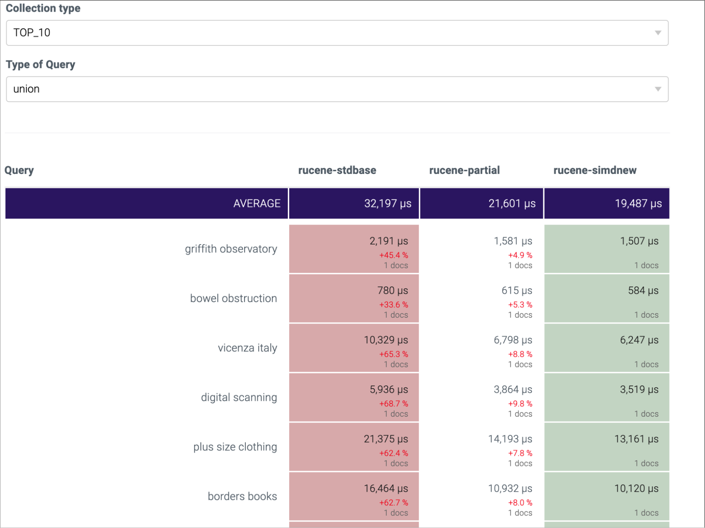
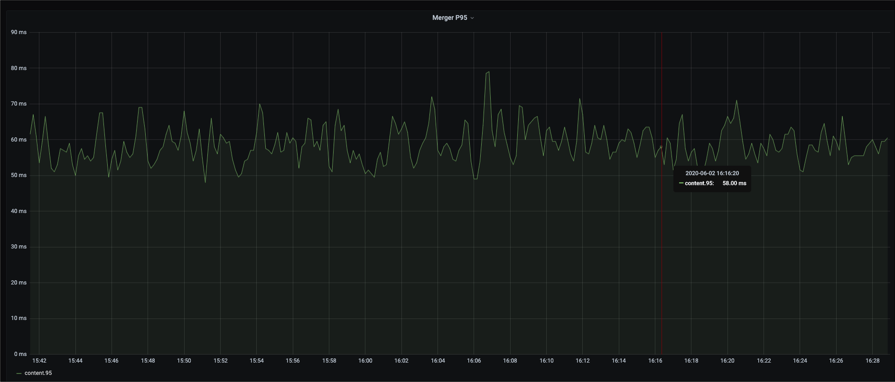
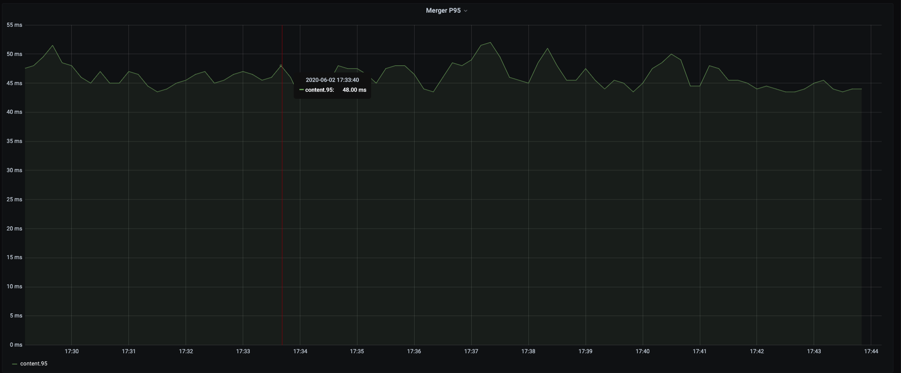

# 知乎 | **基于** **SIMD** **指令优化** **Rucene**

作者：*知乎搜索技术团队* / 后期编辑：张汉东

---


*Rucene*，是知乎搜索技术团队基于 *Lucene*、使用 *Rust* 语言重写的一套搜索引擎核心库。对外，*Rucene* 负责知乎搜索和推荐两大核心业务的召回；对内，*Rucene* 支撑了知乎公司级的 *Logging* 服务。2019 年，我们已将 *Rucene* 开源到 *Github*，项目地址：https://github.com/zhihu/rucene。

*SIMD*，即 *Single Instruction Multiple Data*，单指令多数据，通俗来讲，就是借助现代 *CPU* 架构中提供的扩展指令集，比如 *SSE*、*AVX* 等，通过一条 *CPU SIMD* 指令，一次对多个数据进行并行存取和计算。

目前，在中文互联网上，很少有文章针对具体业务介绍 *SIMD* 优化的，具体到 *Rust* 语言，就更是少之又少。本文基于知乎搜索团队对 *Rucene* 的一些优化实践，总结下如何利用 *SIMD* 指令优化 *Rust* 程序。

利用 *SIMD* 优化程序，大体有三个主要途径：一是让编译器去做优化，这是一种尽力而为的行径，也依赖于编译器具体实现（笔者在调研 *SIMD* 过程中了解到，*Java* 中要使用 *SIMD* 需要按照一些约定来编写程序，然后可以让 *JVM* 去尽量做 *SIMD* 优化，对 *Java* 中使用 *SIMD* 感兴趣的同学可以参考下 *Lucene* 最新版本中关于这个话题的讨论）； 二是使用第三方库，借助别人封装好的库，通过简单调用，针对一些特定场景做 *SIMD* 优化，比如 *simdjson*、*Rust* 中的 *faster* 库等；三是直接手撕 *SIMD* 指令，针对具体的业务特点，有时很难直接调用封装库来使用 *SIMD*，这种情况只能自己编写调用 *SIMD* 指令的程序。接下来，本文将从这三个方面做下介绍。

## **Rust** **编译器参数调优**

我们翻阅了 *Rust* 官方提供的 *rustc* 和 *cargo* 的相关文档，没有发现和 *SIMD* 优化相关的内容，但在这个过程中，我们发现有三个编译参数，通过合理配置，可以明显提升 *Rucene* 的性能，其使用方式如下所示，每个参数的具体含义可以参考官方文档，这里不做详细介绍。

```toml
#使用方式一：配置 Cargo.toml
[profile.release]
lto=true
opt_level=3
codegen_units=1

#使用方式二：通过环境变量传递给 cargo
CARGO_PROFILE_RELEASE_LTO=true \
CARGO_PROFILE_RELEASE_OPT_LEVEL=3 \
CARGO_PROFILE_RELEASE_CODEGEN_UNITS=1 \
cargo build --release
```

使用这三个参数配置有两点需要注意：一是编译过程会变得非常慢，我们的解决方法是使用第二种方式，仅在镜像发布构建时使用；二是并不是所有程序都会有效，我们的一些简单服务使用这三个参数没有任何效果，反而增加了编译时间。因此，当你的 *Rust* 程序相对复杂的时候，我们建议你尝试使用这三个参数来优化程序性能。

## **使用** **faster** **库优化** **Embbeding** **计算** 

2020 年，我们尝试在引擎端做 *Embbeding* 召回提权，当时灰度上线后，*P95* 上涨明显，我们用 *faster* 库做向量计算优化后，*P95* 上涨控制在了可接受范围。大家不用关心什么是 *Embbeding*，需要解决的问题就是优化向量内积计算。以下第一段代码是普通的内积计算，第二段代码是使用 *faster* 利用 *SIMD* 指令的编写方式。随着向量维度的增加，*SIMD* 的方式性能优势会非常明显。*faster* 库的具体使用，大家可以参考相关文档。

```rust
// 简单的内积计算示例
fn main() {
    let mut score = 0.0;
    let dots1: Vec<f32> = vec![1.04177, 0.28162, 2.02021];
    let dots2: Vec<f32> = vec![1.59189, 1.94172, 1.02021];
    for i in 0..dots1.len() {
        score += dots1[i] * dots2[i];
    }
    println!("score={}", score);
}
```

```rust
use faster::{f32s, IntoSIMDRefIterator, IntoSIMDZip, SIMDZippedIterator};
// 使用 faster SIMD 库优化向量内积计算
fn main() {
    let dots1: Vec<f32> = vec![1.04177, 0.28162, 2.02021];
    let dots2: Vec<f32> = vec![1.59189, 1.94172, 1.02021];
    let score = (dots1.simd_iter(f32s(0.0)), dots2.simd_iter(f32s(0.0)))
        .zip()
        .simd_reduce(f32s(0.0), |acc, (a, b)| acc + a * b)
        .sum();
    println!("score = {}", score);
}
```

## **使用** **SIMD** **指令优化倒排链的解压缩性能**

*Rucene* 的高效检索基于倒排索引，倒排索引中的倒排链按文档 *ID* 升序排列，128 个文档 *ID* 组成一个压缩的 *block*。搜索引擎提供在线检索服务时，大量 *block* 的解压操作是引擎的一个主要性能瓶颈点。接下来，我们撇开搜索引擎，将问题描述的更直白一些。

 一个 *block* 中存 128 个整数，升序，以前 8 个数为例:
1，3，8，15，19，31，58，100，…

相邻数字相减，差值称为 *delta*，第一个数减去上一个 *block* 的最后一个数，假使这是第一个块，第一个数减去 0，得到以下 *delta* 序列:
1，2，5，7，4，12，27，42，…

假使 128 个 *delta* 之中 42 是最大值，其二进制表示 101010，共计 6 个有效位，那么128 个 *delta* 值全部用 6 个 *bit* 位存储。

原先的存储方案:一个挨着一个串行存储
1				 2         	  5              7              4               12             27            42              	…
000001      000010    000101   000111   000100    001100    011011   101010    	 ...

*SIMD* 存储方案：并行存储，前 4 个数存储在紧邻的 4 个 i32 的低 6 位，后 4 个数存储在这 4 个i32 的第 7～第 12 个 *bit* 位上

→    第一个 i32   ←   **|**   –>    第二个 i32    ←   **|**   –>   第三个 i32   ←   **|**   –>   第四个 i32   ←  **|** 
**000001** <font color='#ff0000'>**000100**</font> ...      **000010** 001100 ...          **000101** 011011 ...          **000111** 101010 ...  ......
**1**            <font color='#ff0000'>**4**</font>                     **2**            12                       **5**            27                       **7**            42               …

下面的示意图应该会更清晰些


4 个 i32 作为一个存储单元，第一个数存储在第一个 i32 的低六位，第二个数存储在第二个 i32 的低六位，第三个数存储在第三个 i32 的低六位，第四个数存储在第四个 i32 的低六位，第五个数存储在第一个 i32 的第二个六位，依次类推。1 至 32 的位宽都可以用 4n 个 i32 存下，1 位的位宽需要 4 个 i32，32 位的位宽需要 128 个 i32 存储。数据是对齐的，不存在 4 个 i32 中有些 i32 存满了，有些没存满的情况，非常适合并行操作。

解决完如何存储，剩下的解压操作就相对简单了。用一条 *SIMD* 加载指令读取 4 个 i32，用 *SIMD* 的按位与操作，取 4 个 i32 的低 6 位，获取前 4 个整数值，然后，4 个 i32 同时右移 6 个 *bit*，再做按位与操作，又获取 *4* 个整数值，依此类推。下图列出示例代码片段和 *SIMD* 优化中用到的几个主要指令。详细 *SIMD* 指令介绍可以查看 *Rust* 标准库文档或 *Intel* 的官方指令集文档，具体的代码实现可以查看 *Rucene* 的对应 *MR*。

*MR*：https://github.com/zhihu/rucene/commit/6629d2f7971bdc7ff113dbfa627b291bbfb257e9

```rust
//解压前4个i32的伪代码：
mask = _mm_set1_epi32(0b111111)                      // 设置掩码
values = _mm_lddqu_si128(block_ptr)                  // 加载4个i32
new_values = _mm_and_si128(values, mask)             // 还原4个i32
```

```rust
//主要用到的sse指令（共10条）：
_mm_set1_epi32        // 4个i32设为同一个值
_mm_lddqu_si128       // 加载4个i32到寄存器
_mm_storeu_si128      // 存储4个i32到内存
_mm_and_si128         // 128位按位与操作 
_mm_or_si128          // 128位按位或操作
_mm_slli_epi32        // 4个i32同时左移指定位数
_mm_srli_epi32        // 4个i32同时右移指定位数
_mm_sub_epi32         // 4个i32对另外4个i32做减法操作
_mm_add_epi32         // 4个i32对另外4个i32做加法操作
_mm_cvtsi128_si32     // 取4个i32中最右边的一个
```

## **优化效果**

我们先后上线了两个优化版本：一个是部分解压 + 编译器参数调优版本，这个版本，单就编译器参数调优这一点，大概有 10% 的性能提升；第二个是 *SIMD* 的优化版本，这个版本在第一个优化基础上，大概又有 15% 的性能提升。总体来看，*benchmark* 测试，性能提升明显，引擎 *Merger P95* 总体下降 30%+。以下是一些性能表现截图：

版本说明：

*Rucene-stdbase*：	  *Rucene* 基线版本
*Rucene-partial*：	    按需解压 + 编译器参数调优版本
*Rucene-simdnew*：	*SIMD* 优化版本


<center>求交操作性能对比</center>




<center>求或操作性能对比</center>


<center>按需解压 + 编译器参数调优 P95 降 20%+</center>




<center>SIMD 版本上线前 P95</center>




<center>SIMD 版本上线后 P95</center>


<center>SIMD 版本上线 P95 再降 15% 左右（PS：图中抖动是附带上线的其他 MR 所致）</center>

## **总结**

本文结合程序中使用 *SIMD* 技术的三种可能途径，概述了知乎搜索技术团队在 *Rucene* 优化中落地 *SIMD* 优化的一些实践经验。我们自身对 *CPU* 指令集相关技术的了解也比较有限，也是摸着石头过河，文中如有谬误之处，欢迎读者批评指正。

## **参考资料**

1. 基于 SIMD 指令的 PFOR-DELTA 解压和查找：https://zhuanlan.zhihu.com/p/63662886
2. 索引压缩算法New PForDelta简介以及使用SIMD技术的优化：https://yq.aliyun.com/articles/563081
3. SIMD应用：https://www.zhihu.com/market/pub/119608271/manuscript/1102576357040644096Intel 
4. intrinsics guide：https://software.intel.com/sites/landingpage/IntrinsicsGuide/

## **招聘信息**

知乎搜索技术团队目前在招前端、后端、搜索引擎开发人员，欢迎感兴趣的同学踊跃投递简历，邮箱 wangjingjing@zhihu.com。