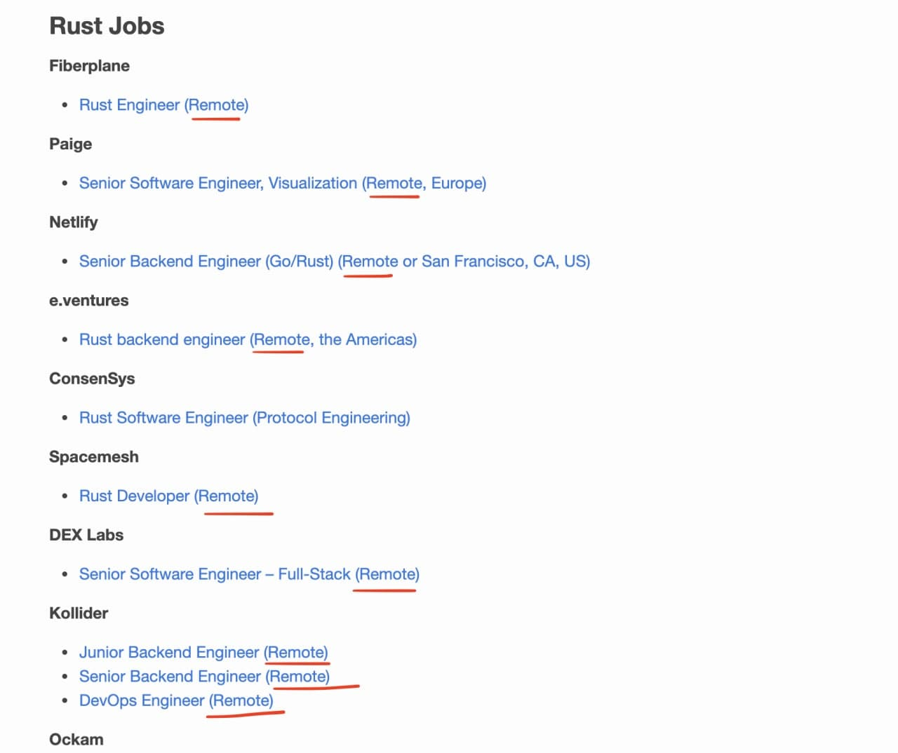

# 本月招聘

## 中国科学院软件研究所 PLCT Lab

### BJ46 Rust 工具链开发实习生

主要就是做 Rust for RISC-V 的工作，这是 Firefox on RISC-V 的一部分。确保 Rust 工具链和软件在 RV64GC 平台和 RV32GC 上可以跑起来，并进行功能的完善和性能的提升。

入职要求： LV3+，能进行英语交流，对编译技术有很好的了解。对 LLVM 工具链和 Rust 有浓厚的兴趣。 远程实习，不需要坐班。

### BJ33 Firefox/Spidermonkey 开发实习生（名额：2 名）

工作内容： 就像将 V8 移植到 RISC-V 平台一样，将 Spidermonkey 移植到 RISC-V 平台。跟 mentor 一起将工作提交到 Mozilla upstream。最好能明白 Rust 相关的编译流程。

入职要求： LV3+ 级别。能够进行英文的交流。 远程实习，不需要坐班。

更多岗位参见 [这里](https://github.com/MATRIXKOO/weloveinterns)

**联系方式**
有意者请投递简历至： 吴老师 wuwei2016@iscas.ac.cn
邮件标题请注明： 实习生 - 岗位编号 - 姓名 - 手机号码 - 学校

---

## 【量化方向】Junior/Senior Rust Algo Developer

应聘者学校要求 C9 或者同级别的海外学校。

**About Injective Protocol**

Injective is building a decentralized exchange that provides limitless access to all financial markets. Injective Protocol enables fully decentralized trading without any restrictions, allowing individuals to trade on any derivative market of their
choosing. Injective Protocol is backed by a prominent group of stakeholders including Pantera Capital, Binance, Mark Cuban, Hashed, and many others.

We have offices in New York City and Hong Kong. Injective is valued at over $1 Billion and has been dubbed the "DeFi Robinhood" by the likes of TechCrunch.

**Job Description **

We can accept remote working, working language is Chinese
and/or English) Algorithm developers are responsible for building and maintaining the models that drive our trading. A typical day involves applying rigorous statistical analysis to vast quantities of market and financial data to produce provably predictive trading
models. Working in close collaboration with fellow algo developers and core developers, you will research, develop, and test novel order execution and model training methods to increase trading efficiency.

**Required Background and Skills**

Candidates must have at least a bachelor's degree from prestigious universities in CS, Physics, Math, and are capable of working independently as well as part of a team. Great experience with Rust. Previous exposure in trading strategy implementation in a production environment will be a plus.
We provide working visa sponsorship in the US / HK for any qualified candidates. Also, we provide US green card sponsorship. 

Free free send your resume to **maxim.shen@injectiveprotocol.com**

## Rust 远程工作，并且有瑞典移民的机会

要求： Rust/ Graphql/ Typescript

The role can optionally be temporarily remote due to the ongoing COVID-19 situation, with the goal of you joining us in Gothenburg, Sweden. We can help with your move and immigration.

[https://technocreatives.homerun.co/senior-rust-full-stack-developer/en](https://technocreatives.homerun.co/senior-rust-full-stack-developer/en)

Rust Remote 工作挺多

不过有些公司限制在本土远程，有些公司限制必须在本土时间范围内工作，有些比较自由。

