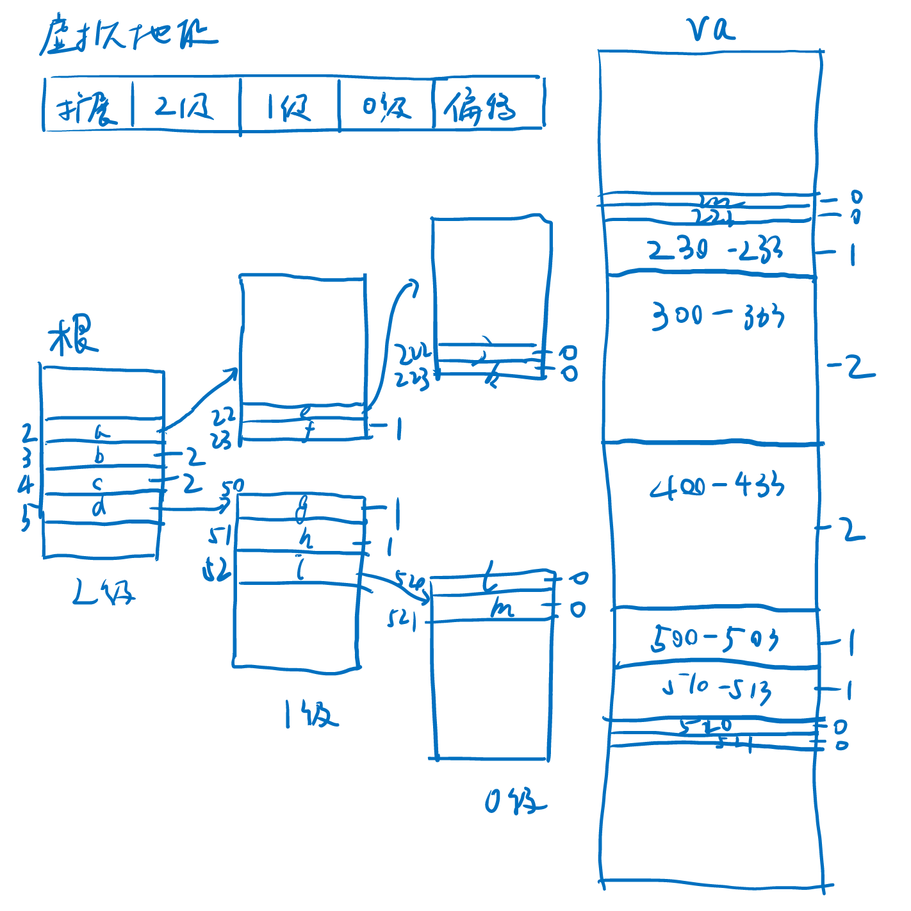

# Rust 与 OS | 一种有效的页表系统抽象设计

作者：洛佳 / 后期编辑 ：张汉东

---

从段进化到页，是操作系统内存抽象的一大进步之处。页式存储管理由软硬件共同实现，软件提供映射关系，
硬件来加速地址翻译的过程。为了更好地设计硬件，往往要求软件页满足一定的数据要求。

这篇笔记尝试梳理软件层次上，页的实现过程。将会包括大页的分配算法，物理地址的对齐，多种分页模式的兼容设计，
以及如何使用泛型、模块化等现代语言技术实现它们。

可能讲得不清楚，请各位看官海涵。

## 大页分配算法

页式存储系统拥有“大页”的概念。在一些架构下，大页要求地址对齐。
即大页的物理地址必须对齐到特定的级别，随后的低级页号和索引，将共同看作更长的索引使用。
这就对分配算法提出了一定的要求。

归纳需要解决的问题。我们的问题是：给定页表系统`M`，最大等级为`n`；对虚拟页号`v = (vn-1, ...v1, v0)`和待映射连续页数`n`,
找到一组页的映射集合`U = { (v_开始, p_开始, 长度) }`，使得页号`v`能映射到物理页号`p`。
考虑使用大页优化这一过程，使`| U |`越少越好，但需要注意对齐要求，即对等级为`k`的大页，
起始地址为`(vn-1, ...vk, 0, ...0)`的`k-1`到`0`级均为0，即假如`k`级的对齐要求为`a[k]`，有`v = 0 (mod a[k])`。

在`M = Sv39系统`中，最大等级`n = 3`，对齐要求`a[0] = 1`, `a[1] = 512`, `a[2] = 26'2144`[注释1]。即，每一级别包含512个页表项。

为了简化问题理解，我们定义一个`M = 简单的页表系统`，最大等级也为`n = 3`，但`a[0] = 1`, `a[1] = 4`, `a[2] = 16`。
每一级别包含3个页表项。给定虚拟地址`v = (2, 2, 2)`到`v + n = (5, 2, 1)`，要映射到物理地址`p = (2, 2, 2)`。

现在我们在最高的3级，将要分配`r(v) = (2, 2, 2)..=(5, 2, 1)`到`p = (2, 2, 2)`。
如果直接使用大页，将必须保证2、1级的编号都为0。也就是说，只能分配`r(v) = (3, 0, 0)..(5, 0, 0)`到`p = (3, 0, 0)`。

为什么不分配`(2, 0, 0)..(3, 0, 0)`到`(2, 0, 0)`呢？因为这将分配超过`(2, 2, 2)..=(5, 2, 1)`的范围，
和我们要求解的问题不同。同理，也不能分配`(5, 0, 0)..(6, 0, 0)`到`(5, 0, 0)`。这部分的范围，需要借助更低级的大页来完成。

第3级的分配完成了，然后我们借助2级页表，分配附近零碎的`(2, 3, 0)..(3, 0, 0)`和`(5, 0, 0)..(5, 2, 0)`。
分配`(2, 3, 0)..(3, 0, 0)`到`(2, 3, 0)`；`(5, 0, 0)..(5, 2, 0)`到`(5, 0, 0)`。

最后，借助1级页表，分配`(2, 2, 2)..(2, 3, 0)`到`(2, 2, 2)`；`(5, 2, 0)..(5, 2, 2)`到`(5, 2, 0)`。
至此，所有的分配完成了。

由于这种方法要求在虚拟的大页上分配物理的大页，两个大页的基地址必须有相同的对齐方式，因此，
初始传入的虚拟页号和物理页号，差值必须对齐到相应的页，即`v = p (mod a[k])`，才可以使用这种分配方法；否则就应当使用更低等级的分配方法。
（想想看为什么？）否则就会在分配过程中，产生对齐要求的异常。

比如`v = (2, 2, 2)`到`p = (2, 2, 2)`，就可以使用3级；而`v = (2, 2, 2)`到`p = (2, 1, 2)`，就只能使用2级。



推广这个结论，我们可以得到一个规律。首先，使用贪心的方法，将地址的上下限分别向内取整，分配最大的大页给最高的地址范围。
然后，对两边的零碎范围，使用低1级的页表，继续分配。继续降低等级，直到所有的页都被分配完毕。


根据对齐规则和所需求的页数，逐级降低算法的起始等级。对等级`n = 3`的页表系统，以分支形式，我们编写顺序规则的伪代码。

```rust
// input: v: VirtPageNum, p: PhysPageNum, n: usize, a: PageMode;
if (v - p) % (a[2].frame_align()) == 0 && n >= a[2].frame_align() {
    let l2n = (vs2 - ve2) / a[2].frame_align();
    map(2, ve2, vs2, ve2-v+p);
    let l1n = (ve2 - ve1 + vs1 - vs2) / a[1].frame_align();
    map(1, ve1, ve2, ve1-v+p); map(1, vs2, vs1, vs2-v+p);
    let l0n = (n + ve1 - vs1) / a[0].frame_align();
    map(0, v, ve1, p); map(0, vs1, v+n, vs1-v+p);
} else if (v - p) % (a[1].frame_align()) == 0 && n >= a[1].frame_align() {
    let l1n = (vs1 - ve1) / a[1].frame_align();
    map(1, ve1, vs1, ve1-v+p);
    let l0n = (n + ve1 - vs1) / a[0].frame_align();
    map(0, v, ve1, p); map(0, vs1, v+n, vs1-v+p);
} else if (v - p) % (a[0].frame_align()) == 0 && n >= a[0].frame_align() {
    let l0n = n / a[0].frame_align();
    map(0, v, v+n, p);
} else {
    panic!("Can't map v to p under this page mode")
}
```

我们发现，等级低算法的中间变量，也在等级高的地方出现了。于是这个算法可以改成循环的形式。

```rust
// input: v: VirtPageNum, p: PhysPageNum, n: usize, M: PageMode;
for i in M::visit_levels_until(PageLevel::leaf_level()) { // 遍历顺序：[n, ...1, 0]
    let align = M::a(i); // i层的对齐要求
    if (v - p) % align != 0 || n < align { // 对齐要求达不到等级，或者数量不够，使用低级算法
        continue;
    }
    let (mut ve_prev, mut vs_prev) = (None, None);
    for j in M::visit_levels_from(i) { // 遍历顺序：[j, j-1, ...0]
        let a = M::a(j); // j层的对齐要求
        let ve_cur = a * roundup(v / a)
        let vs_cur = a * rounddown((v + n) / a)
        if let (Some(ve_prev), Some(vs_prev)) = (ve_prev, vs_prev) {
            map(j, ve_cur..ve_prev); // 执行映射函数
            map(j, vs_prev..vs_cur);
        } else {
            map(j, ve_cur..vs_cur);
        }
        (ve_prev, vs_prev) = (Some(ve_cur), Some(vs_cur));
    }
    break;
} 
```

这个算法就可以用于任何等级的页表系统了，因此题目要求的算法得到解决。
使用Rust语言的生成器或者迭代器包装算法，即可得到比较好的算法实现。

传统分配算法是，将地址段内的所有地址，映射到最小的页帧上。此时，需要管理多少个页帧，就需要分配多少个页。
大页分配算法通过分配满足对齐要求更少的页，就能完成同样的任务。我们如何比较大页分配算法和传统算法分配的页数呢？

我们取用`M = Sv39系统`。其中，最大等级`n = 3`，对齐要求`a[0] = 1`, `a[1] = 512`, `a[2] = 26'2144`。

同样分配`505'5550`个页帧，假设页号对齐能满足最大的`26'2144`，采用不同的虚拟页号。

| 虚拟页号 | 数量 | 所需页表数 | 节省 | 等级0 | 等级1 | 等级2 |
|:--------|:----|:----------|:-----|:-----|:------|:-------|
| 0	 | 505'5550	 | 227	 | 0.00%	 | 62	 | 146	 | 19 |
| 10	 | 505'5550	 | 1249	 | 0.02%	 | 574	 | 657	 | 18 |
| 20	 | 505'5550	 | 1249	 | 0.02%	 | 574	 | 657	 | 18 |
| 512	 | 505'5550	 | 738	 | 0.01%	 | 62	 | 658	 | 18 |
| 1024	 | 505'5550	 | 738	 | 0.01%	 | 62	 | 658	 | 18 |
| 1025	 | 505'5550	 | 1249	 | 0.02%	 | 574	 | 657	 | 18 |
| 26'2144	 | 505'5550	 | 227	 | 0.00%	 | 62	 | 146	 | 19 |
| 100'0000	 | 505'5550	 | 738	 | 0.01%	 | 574	 | 145	 | 19 |

| 虚拟页号 | 数量 | 所需页表数 | 节省 | 等级0 | 等级1 | 等级2 |
|:--------|:----|:----------|:-----|:-----|:------|:-------|
| 30'0000 | 1	 | 1	 | 100.00%	 | 1	 | N/A	 | N/A |
| 30'0000 | 10	 | 10	 | 100.00%	 | 10	 | N/A	 | N/A |
| 30'0000 | 100	 | 100	 | 100.00%	 | 100	 | N/A	 | N/A |
| 30'0000 | 1000	 | 489	 | 48.90%	 | 488	 | 1	 | N/A |
| 30'0000 | 1'0000	 | 291	 | 2.91%	 | 272	 | 19	 | N/A |
| 30'0000 | 10'0000	 | 355	 | 0.36%	 | 160	 | 195	 | N/A |
| 30'0000 | 100'0000	 | 995	 | 0.10%	 | 64	 | 929	 | 2 |
| 30'0000 | 1000'0000	 | 752	 | 0.01%	 | 128	 | 587	 | 37 |

可以发现，Sv39下对齐要求高、页帧数量大时，大页只需要小于一千个页表，就能管理百万个页帧空间，非常节省页表的数量。
页帧数量小时，由于对齐要求不高，节省的数量并不明显；对齐要求低时，节省数量也不明显。

实际使用时，尽量给出最大的对齐要求，这样可以在分配大量页帧时，节省更多的页帧空间。
这一结果对芯片外设的布局也有指导作用，如果高级的嵌入式芯片拥有较多外设，尽量将外设的物理地址放置到更高的对齐要求上，
这样操作系统管理时就可以腾出更多的内存空间，供应用使用。

[注释1]：表格中的'号表示万位分隔符，[成会明院士：传承祖先的智慧，倡导中文中阿拉伯数字书写方式采用“4位数分隔法”. 中国科学院院刊](https://zhuanlan.zhihu.com/p/358635675)

## 抽象软件设计

以Rust语言为例，给出页系统常见结构的抽象方法。

### 页号

首先定义物理和虚拟页号。

```rust
#[derive(Copy, Clone, PartialEq, Eq, Debug)]
pub struct PhysPageNum(usize);

#[derive(Copy, Clone, PartialEq, Eq, Debug)]
pub struct VirtPageNum(usize);
```

“物理页号长度 + 偏移长度”可能大于“架构地址宽度”，这允许我们访问大于架构宽度的地址。
比如RISC-V RV32下，使用Sv32系统，可以访问34位的物理地址，即使架构只有32位。

物理页号和虚拟页号，可以通过对应的地址转换而来。

```rust
impl PhysPageNum {
    pub fn addr_begin<M: PageMode>(&self) -> PhysAddr {
        PhysAddr(self.0 << M::FRAME_SIZE_BITS)
    }
}
```

这种转换关系要求输入页表的模式。不同架构下，地址的偏移量可能不同。

### 页帧分配器

然后我们需要一个页帧分配器。模仿Rust语言alloc包的设计，可以给出结构如下。

```rust
pub trait FrameAllocator {
    fn allocate_frame(&self) -> Result<PhysPageNum, FrameAllocError>;
    fn deallocate_frame(&self, ppn: PhysPageNum);
}
```

构造页帧分配器时，应当给定一个物理页的范围。

而后，每次请求分配，其中的算法将返回分配的结果，或者当没有页存在时，返回一个错误。

```rust
impl StackFrameAllocator {
    pub fn new(start: PhysPageNum, end: PhysPageNum) -> Self {
        StackFrameAllocator { current: start, end, recycled: Vec::new() }
    }
}
```

页帧分配器只分配编号，不会向被分配的内存中存储或读取数据，所以它的设计与alloc库简单。

这种设计是为了方便测试页帧分配器的正确性和性能。

### 装箱的页帧

或者说`FrameBox`，借鉴了Rust中拥有所有权的Box名称，表示拥有所有权的一个页帧。

```rust
#[derive(Debug)]
pub struct FrameBox<A: FrameAllocator = DefaultFrameAllocator> {
    ppn: PhysPageNum, // 相当于*mut类型的指针
    frame_alloc: A,
}
```

每次新建时，从页帧分配器`frame_alloc`中得到新的页帧，然后使用所有权语义包装妥当。
当它的生命周期结束，调用页帧分配器，释放所占有的页帧。

```rust
impl<A: FrameAllocator> FrameBox<A> {
    // 分配页帧并创建FrameBox
    pub fn try_new_in(frame_alloc: A) -> Result<FrameBox<A>, FrameAllocError> {
        let ppn = frame_alloc.allocate_frame()?;
        Ok(FrameBox { ppn, frame_alloc })
    }
}

impl<A: FrameAllocator> Drop for FrameBox<A> {
    fn drop(&mut self) {
        // 释放所占有的页帧
        self.frame_alloc.deallocate_frame(self.ppn);
    }
}
```

装箱的页帧实际地保管了页帧内存的所有权，可以向内写入数据，从中读取数据。

### 页式地址空间

一个表示分页系统实现的结构体，它保管着所有包含的页帧箱子，在释放时会释放其中的所有页帧。

这个结构体拥有一个分页模式的类型参数，用于计算页帧插入算法。

```rust
// 表示一个分页系统实现的地址空间
//
// 如果属于直接映射或者线性偏移映射，不应当使用这个结构体，应当使用其它的结构体。
#[derive(Debug)]
pub struct PagedAddrSpace<M: PageMode, A: FrameAllocator = DefaultFrameAllocator> {
    root_frame: FrameBox<A>,
    frames: Vec<FrameBox<A>>,
    frame_alloc: A,
    page_mode: M,
}
```

当创建页式地址空间时，立即分配一个根页表。

```rust
impl<M: PageMode, A: FrameAllocator + Clone> PagedAddrSpace<M, A> {
    // 创建一个空的分页地址空间。一定会产生内存的写操作
    pub fn try_new_in(page_mode: M, frame_alloc: A) -> Result<Self, FrameAllocError> {
        // 新建一个根页表要求的页帧
        let mut root_frame = FrameBox::try_new_in(frame_alloc.clone())?;
        // 而后，向帧里填入一个空的根页表 
        unsafe { fill_frame_with_initialized_page_table::<A, M>(&mut root_frame) };
        Ok(Self { root_frame, frames: Vec::new(), frame_alloc, page_mode })
    }
}
```

创建结构后，当插入新的映射关系，使用上一节提供的插入算法，得到需要插入的范围，然后读写页帧箱，完成插入操作。

```rust
impl<M: PageMode, A: FrameAllocator + Clone> PagedAddrSpace<M, A> {    
    // 设置页表项。如果寻找的过程中，中间的页表没创建，那么创建它们
    unsafe fn alloc_get_table(&mut self, entry_level: PageLevel, vpn_start: VirtPageNum)
    -> Result<&mut M::PageTable, FrameAllocError> 
    {
        let mut ppn = self.root_frame.phys_page_num();
        for &level in M::visit_levels_before(entry_level) {
            let page_table = unref_ppn_mut::<M>(ppn);
            let vidx = M::vpn_index(vpn_start, level);
            match M::slot_try_get_entry(&mut page_table[vidx]) {
                Ok(entry) => ppn = M::entry_get_ppn(entry),
                Err(mut slot) => {  // 需要一个内部页表，这里的页表项却没有数据，我们需要填写数据
                    let frame_box = FrameBox::try_new_in(self.frame_alloc.clone())?;
                    M::slot_set_child(&mut slot, frame_box.phys_page_num());
                    ppn = frame_box.phys_page_num();
                    self.frames.push(frame_box);
                }
            }
        }
        // println!("[kernel-alloc-map-test] in alloc_get_table PPN: {:x?}", ppn);
        let page_table = unref_ppn_mut::<M>(ppn); // 此时ppn是当前所需要修改的页表
        // 创建了一个没有约束的生命周期。不过我们可以判断它是合法的，因为它的所有者是Self，在Self的周期内都合法
        Ok(&mut *(page_table as *mut _))
    }
    pub fn allocate_map(&mut self, vpn: VirtPageNum, ppn: PhysPageNum, n: usize, flags: M::Flags)
    -> Result<(), FrameAllocError> 
    {
        for (page_level, vpn_range) in MapPairs::solve(vpn, ppn, n, self.page_mode) {
            // println!("[kernel-alloc-map-test] PAGE LEVEL: {:?}, VPN RANGE: {:x?}", page_level, vpn_range);
            let table = unsafe { self.alloc_get_table(page_level, vpn_range.start) }?;
            let idx_range = M::vpn_index_range(vpn_range.clone(), page_level);
            // println!("[kernel-alloc-map-test] IDX RANGE: {:?}", idx_range);
            for vidx in idx_range {
                let this_ppn = PhysPageNum(ppn.0 - vpn.0 + M::vpn_level_index(vpn_range.start, page_level, vidx).0);
                // println!("[kernel-alloc-map-test] Table: {:p} Vidx {} -> Ppn {:x?}", table, vidx, this_ppn);
                match M::slot_try_get_entry(&mut table[vidx]) {
                    Ok(_entry) => panic!("already allocated"),
                    Err(slot) => M::slot_set_mapping(slot, this_ppn, flags.clone())
                }
            }
        }
        Ok(())
    }
}
```

### 包装的页帧分配算法

定义与实现如下。

```rust
#[derive(Debug)]
pub struct MapPairs<M> {
    ans_iter: alloc::vec::IntoIter<(PageLevel, Range<VirtPageNum>)>,
    mode: M,
}

impl<M: PageMode> MapPairs<M> {
    pub fn solve(vpn: VirtPageNum, ppn: PhysPageNum, n: usize, mode: M) -> Self {
        let mut ans = Vec::new();
        /* 省略求解过程 */
        Self { ans_iter: ans.into_iter(), mode }
    }
}

impl<M> Iterator for MapPairs<M> {
    type Item = (PageLevel, Range<VirtPageNum>);
    fn next(&mut self) -> Option<Self::Item> {
        self.ans_iter.next()
    }
}
```

每次迭代它的结果，会返回一个应当分配的页帧。应当根据这个结果，设置映射关系。

### 激活函数

这个函数的实现与具体架构有关，此处以RISC-V Sv39为例。

```rust
// 切换地址空间，同时需要提供1.地址空间的详细设置 2.地址空间编号
pub unsafe fn activate_paged_riscv_sv39(root_ppn: PhysPageNum, asid: AddressSpaceId) {
    use riscv::register::satp::{self, Mode};
    satp::set(Mode::Sv39, asid.0 as usize, root_ppn.0);
    asm!("sfence.vma {}", in(reg) asid.0 as usize);
}
```

执行完毕后，就已经进入新的地址空间了。注意当前的pc地址仍未改变，如果进入新空间后，
指令对应的代码段已经消失了，将产生异常。因此，一般使用各个虚拟空间中共同映射的“跳板页”，完成这一切换过程。

### 本设计的优缺点

这个设计的优点是，你会发现只需要传入泛型参数M，代表页表模式，就能自动填写算法剩余的部分。

比如，RISC-V Sv39模式可以实现为页表模式，传入泛型参数M；它的定义如下。

```rust
// Sv39分页系统模式；RISC-V RV64下有效
#[derive(Copy, Clone, PartialEq, Eq, Debug)]
pub struct Sv39;

impl PageMode for Sv39 {
    const FRAME_SIZE_BITS: usize = 12;
    const PPN_BITS: usize = 44;
    type PageTable = Sv39PageTable;
    type Entry = Sv39PageEntry;
    type Slot = Sv39PageSlot;
    type Flags = Sv39Flags;
    /* 省略了大量的工具函数 */
}
```

只需要实现模式M中的这些参数，就可以无缝使用这个页表空间系统，包括求解算法。

完整的代码实现在[这里](https://github.com/HUST-OS/luojia-os-labs/blob/main/03-virt-addr-kern/src/mm.rs)。

这种方法也有缺点，就是需要支持泛型的编程语言才可以使用；比如操作系统内核用Rust写，可以采用这种编程方法。

## 目前常见的硬件页表系统

RISC-V提供了Sv39和Sv48；它们分别是3、4级的页表系统，等级越高，能管理的虚拟空间越大。

我们使用上一节的描述方法，描述这些页表系统的基本参数。

| 页表系统M | 虚拟地址 | 物理地址 | 等级n | 对齐要求a |
|:---------|:------|:----------|:----------|:----------|
| RISC-V Sv39 | 39 | 55 | 3 | 1, 512, 26'2144 |
| RISC-V Sv48 | 48 | 55 | 4 | 1, 512, 26'2144, 1'3421'7728 |
| RISC-V Sv32 | 32 | 34* | 2 | 1, 1024 |
| 龙芯 LA64   | 48 | 60 | 4 | 1, 4096/2048*, ... |  
| 龙芯 LA32   | 32 | 36 | 2 | 1, 1024 |  
| arm64       | 48 | 39 | 4 | 1, 512, 26'2144, 1'3421'7728 | 
| arm32       | 32 | 32 | 2 | 1, 256 | 
| x86-64 (旧) | 48 | 47 | 4 | 1, 512, 26'2144, 1'3421'7728 |
| x86-64 (新) | 57 | 52 | 5 | 1, 512, 26'2144, 1'3421'7728, 687'1947'6736 |
| x86-32      | 32 | 32 | 2 | 1, 1024 |

*Sv32的物理地址的确超过32位

*龙芯LA64架构中，双页存储结构对齐要求不同

系统启动时，内核可以激活Sv39，页表的等级少，开销较低，启动快。随后，根据需求，可以更换到更大空间的页表系统，来容纳更多应用。

## 页式内存管理笔记

在文章的最后，我们花一些时间尝试整理页式内存管理概念的笔记。

### 页式内存管理

要管理挂载的外设和内存块，我们定义物理地址，它是真实硬件中资源单元的编号。
所有的物理地址构成一个地址空间；地址空间是可由地址索引的，具体资源和硬件的集合。

我们的应用程序可以直接在物理地址上运行。然而，为了便于程序独占地址空间，便于连续地规划内存，
我们为它们构造虚拟空间。于是程序可以在虚拟地址上运行，虚拟地址是虚拟空间中内存单元的编号。

从前我们使用段的方式管理内存。为了减少内碎片和内存的浪费，我们引入了分页管理系统。

分页系统将地址空间分为连续的等大内存块，它们被称作页帧。
又将一个或多个连续页帧组成一个页，页的大小由硬件实现决定，软件必须按硬件给定页的大小。

管理页的数据结构称作页表。在内存中，页表通常占一个页帧的大小，以便硬件上的分页系统管理。
页表在内存中的存储位置被称作页号。

超过一个页帧大小的页，又被称作大页。管理大页的页表中，每个项目代表一个子页。
这个项目被称作页表的页表项，通常由权限位、控制位和物理页号组成。

将地址空间看作最大的页，根页表就是管理最大页的页表。根页表的页号会被保存在专用的位置中，以作为硬件查询的起始地址使用。

### 翻译过程与地址对齐

现代的页表系统中，无论等级，都称管理页的数据结构为页表。页表的翻译过程大致等同于这个步骤：

1. 取出根页表的页号
2. 读取虚拟地址的特定区域，作为本级页表的索引
3. 根据索引，取出管理更小页的页表项
4. 如果页表项指向子页表，读取页号，返回到步骤2

在这个简化的步骤中，可能出现非常多的异常。需要注意的是，如果当前页表项指向物理页号，这个物理页号有对齐要求。

我们如果使用`(v0, v1, v2):offset`代表一个虚拟地址。

如果`rt[v0][v1]`指向子页表，那么将继续查找`rt[v0][v1][v2]`。得到物理页号`(p0, p1, p2)`。
和off结合，得到物理地址`(p0, p1, p2):offset`。

如果`rt[v0][v1]`指向一个物理页，这是一个大页的页表项。页表项中，得到物理页号`(p0, p1, 0)`，
直接将v2、off拼接，得到大页对应的物理地址为`(p0, p1):v2,offset`；相当于延长了偏移量的位数。

采用后一种形式时，硬件通常要求物理页号只有高于大页的等级有效，低于它的无效。
也就是说，如果页表项`(p0, p1, p2)`的p2不等于零，将会返回页异常。这就是大页页表系统的对齐要求。

---

作者简介：

**洛佳**

华中科技大学网络空间安全学院本科生，热爱操作系统、嵌入式开发。3年Rust语言开发经验，社区活跃贡献者。目前致力于向产业、教学等更多的领域推广Rust语言。
