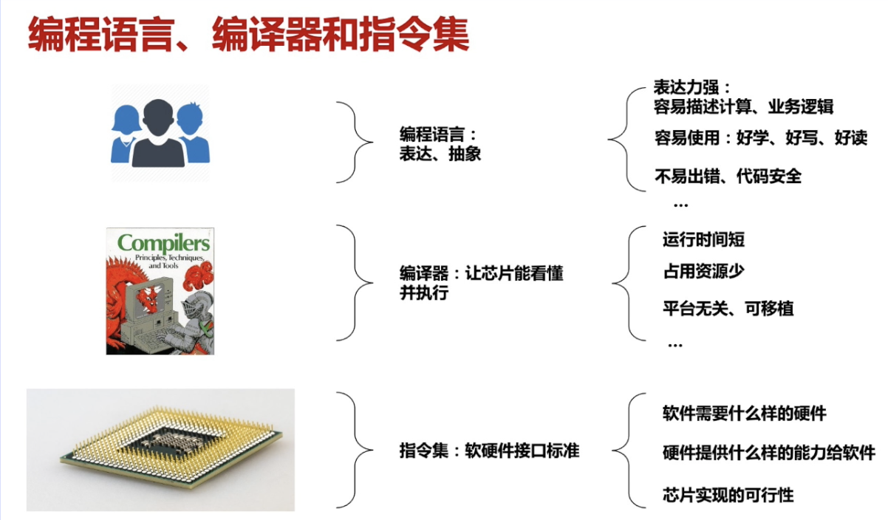
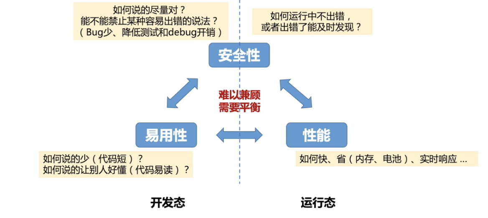
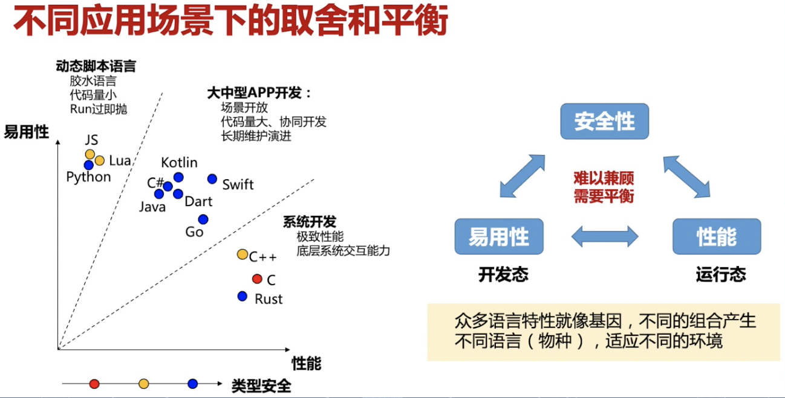
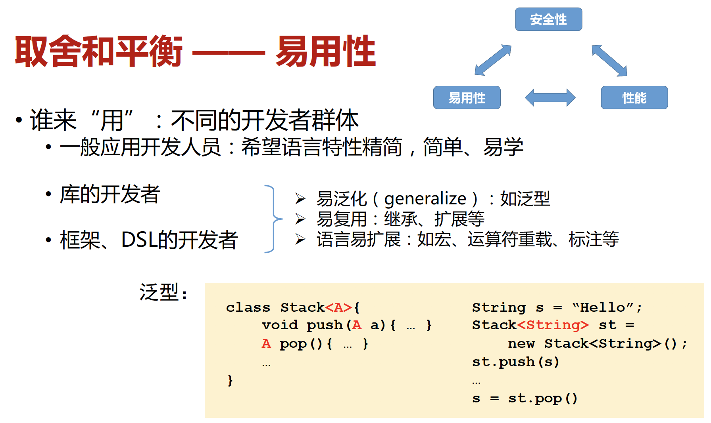
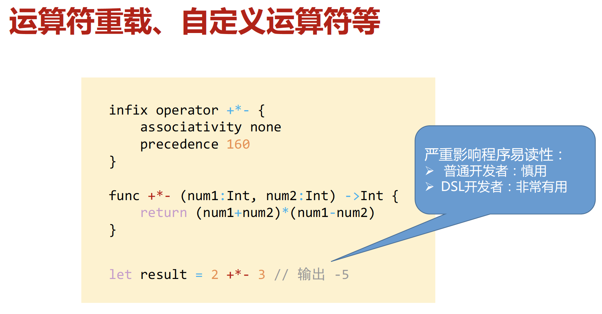
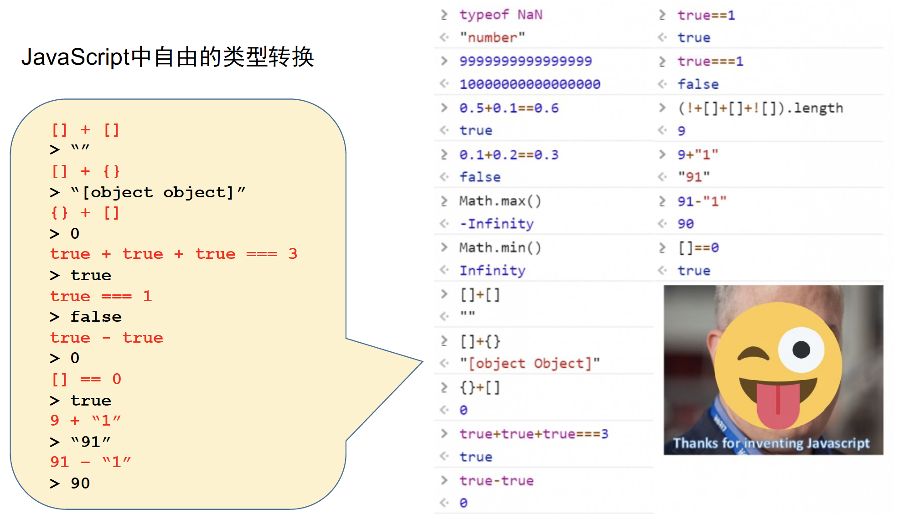
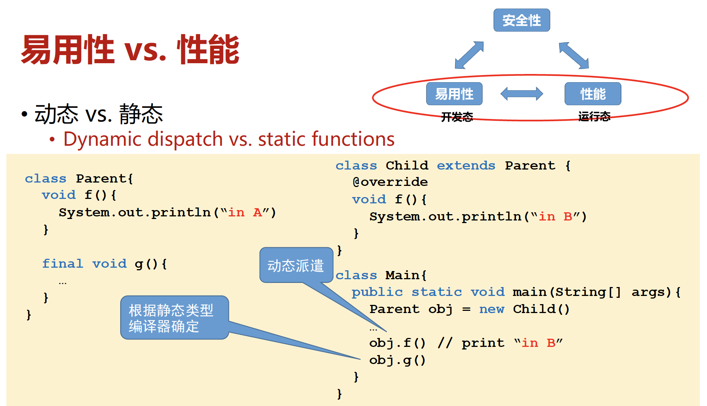
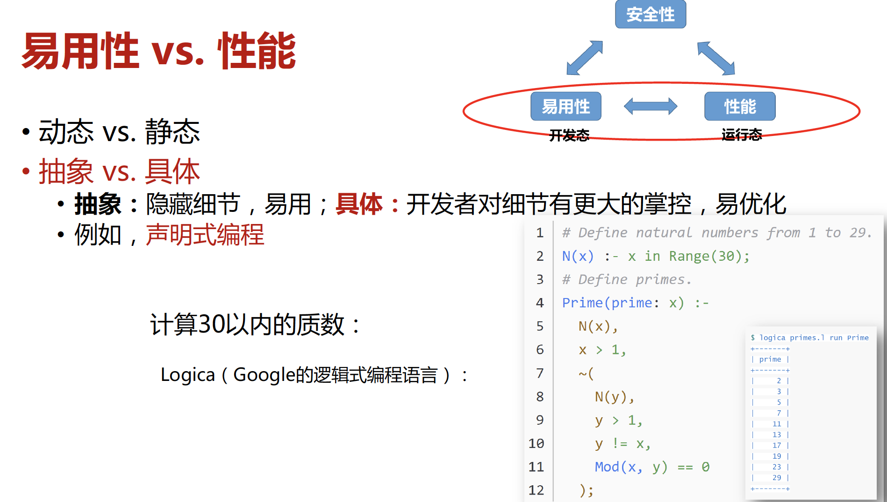
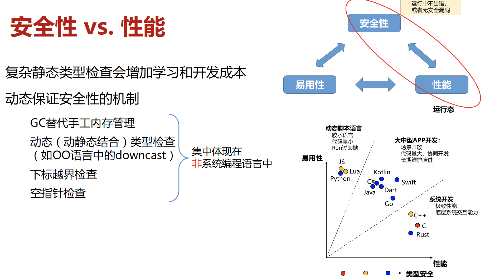

# 漫谈编程语言的设计和实现

作者：柴杰 

---

## 编程语言教育

编程语言虽然复杂，但是其设计是遵循着一些基本规则的。不同语言的语法语义虽然有所不同，但一些基本的核是相似的（例如基于表达式扩展的语法和对基本数据类型的抽象）。编程语言可以顺着这些核一点点展开，根据语言的设计初衷添加规则（即类型系统）和语言特性（例如是否支持多线程、异步编程）。这些规则特性与编程语言之核的组合，造就了琳琅满目的编程语言。

然而，绝大多数国内编程课侧重于某一门具体语言的语法讲解，不解释语言特性与编程语言的本质关系。学生对编程语言普遍缺乏一种抓得住的“全局观”和举一反三的能力，看到的都是被“糖化”后的语法和复杂的语用环境，所以感觉编程语言学起来复杂、枯燥。如此一来，以下情形便容易解释了，例如：

- 你经常对编译器和解释器报出的错误毫无头绪；

- 无法从技术层面判断一门编程语言设计的好坏，人云亦云；

- 对开发任务应该使用什么样的编程语言，或者应该使用哪些语言特性，无法做出独立的判断；

- 无法理解为什么一些framework或library的用法是这样的，对于背后的原理一无所知，只能靠着例子和pattern来编程，遇到问题却难以找出原因，只能google或去问别人；

- 不能对问题简洁的抽象与建模，难以写出简洁、高效、可维护的代码。

理想的编程语言课程应该是语言特性与编程语言理论的融合。因为理论需要实践来解释how，实践需要理论来支撑why，两者相互促进，方能做到知其然知其所以然。如果不把握编程语言的本质，就好比学人体素描不识人体骨骼，学中医不讲阴阳，学音乐不知乐理。如此一来，知识的理解受限且无法融会贯通，不可深究亦不能长远[1]。

编程语言素养是每个人编程知识树的主干（这种结构性很强的知识体系是很难通过经验自我摸索的），每一次的编程经历都是对编程语言抽象表达能力的一次运用和锻炼。日积月累，你会更容易理解新的编程语言和软件框架，建模与抽象的能力越来越好，写出的代码自然简洁、高效、可维护，进而能够构建出复杂的软件系统。

2021年5月18日，冯新宇老师在浙江大学做了讲座：漫谈编程语言的设计和实现[2]。冯新宇老师的讲座向大家介绍了编程语言的设计和实现中一些关键因素以及它们之间的联系，刚好弥补了一些当前编程语言教育的不足。下文是我的讲座笔记，希望对大家学习和理解编程语言（尤其是Rust）有所助益。

（长文预警，下文图片均选自讲座slides～）

## 编程语言设计和实现：关注什么 

### 关注什么

编程语言是人机接口，指令集是软硬件接口，编译器将编程语言翻译成适用于特定指令集的指令序列。

在软件开发活动中，哪些需要程序员说，哪些不用说就可以实现。即编程语言的处理分为静态和动态两个阶段。静态阶段包括 parsing 和type-checking，以确保程序是well-formed；动态阶段是该well-formed程序的执行过程。如果一个well-formed的程序在执行时是well-behaved的，那么就说这个语言是安全的[3]。抽象语义和类型系统是编程语言的核心。

编程语言设计和实现的过程，就是确定两者边界的过程。边界如何确定，答案并不唯一。例如对于释放堆空间，在C语言中，需要在代码中显示的表达出来；在Java中，堆空间的释放不需要在代码中显示的表达出来，Java有垃圾回收机制，堆空间会在运行时自动回收。

开发态是针对软件开发者而言的，开发者希望编程语言能简单、高效、正确的表达计算任务。运行态是针对计算机而言的，希望用尽量少的时间和硬件资源完成计算任务。编程语言面对的是多样化的应用场景、运行环境和开发者群体，众口难调，并不存在一统天下的语言。

在编程语言设计的设计和实现中，易用性、安全性和性能三者难以兼顾，常常是改善了其中一个指标，同时也恶化另一个指标。所以需要根据应用场景做平衡和折衷。

JavaScript、Python、Lua属于动态脚本语言，易用性较高，但性能和可维护性差。适用于代码量小，Run过即抛的小型项目。Java、Go 、Dart 、C# 、Swift 、Kotlin 在安全性、易用性和性能三个方面表现比较均衡，适用于大中型的应用软件开发。C和C++为了追求性能，舍弃了安全性，产生了很多陷阱，造成debug和维护困难。Rust 是目前很受欢迎的一门系统编程语言，它在安全性和性能上做的很好，但上手门槛较高，对使用者的素质有一定要求。

### 易用性

不标注类型的代码更易写。但带有类型标注的代码更易读、更易维护，因为类型标注提供了额外信息，比如fun f(g: int -> int, x: int): int, 从类型标注可知f的第一个参数g是个函数，第二个输入参数x是个整数，函数返回一个整数。

不同的开发者群体对易用性的诉求是不一样的。应用开发人员希望语言特性精简，这样简单易学还容易维护，不要搞那么多稀奇古怪的语法特性，很难掌握，平时做应用开发也用不到。而库、框架和DSL的开发者，希望语言易复用、易扩展，希望编程语言具有泛型、运算符重载、宏等特性。

上述代码自定义了运算符+*-，这对DSL的使用者或许非常有用。但普通开发者却非常讨厌这种自定义运算符，因为它严重降低了程序的可读性。

### 易用性 vs. 安全性

易用性和安全性需要折衷，为了提升安全性，对开发者设置更多约束。这种约束主要体现在两个方面。第一个方面，在语法上禁止某些容易出错的语言特性。比如，Dijkstra 认为go to语句是有害的，所以现代编程语言就没有实现这个语言特性了。第二个方面，通过类型系统禁止可能出错的写法。这些约束虽然提升了安全性，但也降低了语言的易用性，编写代码时总感觉束手束脚。总之，安全性和易用性也是矛盾的，需要折衷和平衡。

根据是否允许自由类型转换，类型系统可以分为弱类型系统和强类型系统。JavaScript就是典型的弱类型系统，允许自由的类型转换，所以会出现各种各样、五花八门的坑。

C/C++也是弱类型系统，带来很多坑：悬空指针、double free、下标越界、缓冲区溢出等等。Rust是强类型的，它通过静态类型系统增强和动态检查来保证安全性，但 Rust 学习门槛较高。由于弱类型难以保证安全性，近年来新设计的编程语言已经很少采用弱类型系统了。

根据何时检查约束规则，类型系统又有静态和动态之分。如果全部或几乎全部的类型检查是在编译期进行的，那么就称为静态类型系统。如果全部或几乎全部的类型检查是在运行时进行的，那么就称为动态类型系统。两者各有优劣，有时候只有在运行时才能确定程序的执行流，所以在运行时做类型检查会更准确，但运行时类型检查会降低程序性能。如果采用静态类型检查，它的原则是宁杀错，不放过，有时会产生一些误判。

动态和静态类型各有优缺点，我们能否兼得两者的优点呢？Gradual type的目标正是兼顾两者优点，也是目前学术界的热门研究方向。

### 易用性 vs. 性能

在易用性和性能之间也需要权衡。虽然动态派遣的易用性高，但性能不如静态派遣。

语言特性越接近底层、越具体，开发者对细节会更有掌控，有利于性能的提高。而抽象会隐藏细节，易用性好，但性能往往不好。最近Intel推出了oneAPI，声称可以对程序员抽象掉具体硬件细节（CPU 、GPU、 AI加速器与FPGA），同时又不损失性能。至于真实效果如何，还有待验证。

### 安全性 vs. 性能

采用复杂的静态类型检查，虽然可以提升安全性，但也增加了学习和开发成本。所以会把一些安全机制（动态类型检查、垃圾回收等）放在运行时来做，但这样做会损失一些性能。这种动态保证安全性的机制集中体现在非系统编程语言中，如Java、Golang等。

## 总结

由于国内编程语言教育的缺陷，学生对编程语言普遍缺乏一种抓得住的“全局观”和举一反三的能力。编程语言是软件开发的基本工具，它一方面直接影响开发效率和开发体验，另一方面也影响软件运行时的表现，如性能和可靠性等。编程语言的设计和实现需要考虑三个关键因素：易用性、安全性和性能。三者难以兼顾，需要平衡和折衷。

## 参考资料

[1] [浅谈国内高效编程语言教育](https://zhuanlan.zhihu.com/p/43914842)

[2] [漫谈编程语言的设计与实现, 冯新宇]( https://www.bilibili.com/video/BV15V41177vF?from=search&seid=4586480071230860986)

[3] Robert Harper, Practical Foundations for Programming Languages, Second Edition, Cambridge University Press, 2016.
