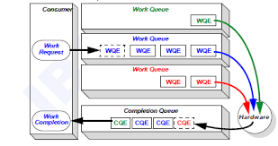

# Datenlord | Rust实现RDMA异步编程（一）：基于`epoll`实现RDMA 异步操作

作者：王璞 / 后期编辑： 张汉东

---

RDMA是一套高性能网络协议栈，多用于高性能计算、高性能存储领域。RDMA的library是用C实现的，但是没有很好用的Rust的binding，不方便Rust开发者使用。于是我们正在封装一层符合Rust风格、便于Rust开发者使用的[RDMA Rust binding](https://github.com/datenlord/async-rdma)。特别的，异步编程是近几年很受关注的编程方式，用Rust异步编程来实现IO操作，可以避免操作系统的进程上下文切换，提高性能，而且Rust的异步编程框架也在逐步成熟和完善。本系列文章探讨下如何用异步的方式实现RDMA的操作。本文先讨论下如何基于Linux的`epoll`机制实现RDMA异步操作，后续的文章再探讨如何用Rust异步编程来实现RDMA异步操作。

## RDMA操作简介

RDMA的编程模型是基于消息的方式来实现网络传输，并且用队列来管理待发送的消息和接收到的消息。RDMA的网络传输相关操作基本上都是跟队列相关的操作：比如把要发送的消息放入发送队列，消息发送完成后在完成队列里放一个发送完成消息，以供用户程序查询消息发送状态；再比如接收队列里收到消息，也要在完成队列里放个接收完成消息，以供用户程序查询有新消息要处理。



由上面的描述可以看出RDMA的队列分为几种：发送队列Send Queue (SQ)，接收队列Receive Queue(RQ)，和完成队列Completion Queue (CQ)。其中SQ和RQ统称工作队列Work Queue (WQ)，也称为Queue Pair (QP)。此外，RDMA提供了两个接口，`ibv_post_send`和`ibv_post_recv`，由用户程序调用，分别用于发送消息和接收消息：
* 用户程序调用`ibv_post_send`把发送请求Send Request (SR)插入SQ，成为发送队列的一个新的元素Send Queue Element (SQE)；
* 用户程序调用`ibv_post_recv`把接收请求Receive Request (RR)插入RQ，成为接收队列的一个新元素Receive Queue Element (RQE)。

SQE和RQE也统称工作队列元素Work Queue Element (WQE)。

当SQ里有消息发送完成，或RQ有接收到新消息，RDMA会在CQ里放入一个新的完成队列元素Completion Queue Element (CQE)，用以通知用户程序。用户程序有两种同步的方式来查询CQ：
* 用户程序调用`ibv_cq_poll`来轮询CQ，一旦有新的CQE就可以及时得到通知，但是这种轮询方式很消耗CPU资源；
* 用户程序在创建CQ的时候，指定一个完成事件通道`ibv_comp_channel`，然后调用`ibv_get_cq_event`接口等待该完成事件通道来通知有新的CQE，如果没有新的CQE，则调用`ibv_get_cq_event`时发生阻塞，这种方法比轮询要节省CPU资源，但是阻塞会降低程序性能。

关于RDMA的CQE，有个需要注意的地方：对于RDMA的Send和Receive这种双边操作，发送端在发送完成后能收到CQE，接收端在接收完成后也能收到CQE；对于RDMA的Read和Write这种单边操作，比如节点A从节点B读数据，或节点A往节点B写数据，只有发起Read和Write操作的一端，即节点A在操作结束后能收到CQE，另一端节点B完全不会感知到节点A发起的Read或Write操作，节点B也不会收到CQE。

## Linux `epoll`异步机制简介

Linux的`epoll`机制是Linux提供的异步编程机制。`epoll`专门用于处理有大量IO操作请求的场景，检查哪些IO操作就绪，使得用户程序不必阻塞在未就绪IO操作上，而只处理就绪IO操作。`epoll`比Linux之前的`select`和`poll`这两种异步机制要强大，`epoll`特别适合有大量IO操作的场景，比如RDMA的场景，每个RDMA节点同时有很多队列，用于大量传输数据，那么就可以用`epoll`来查询每个CQ，及时获得RDMA消息的发送和接收情况，同时避免同步方式查询CQ的缺点，要么用户程序消耗大量CPU资源，要么用户程序被阻塞。

Linux的`epoll`机制提供了三个API接口:
* `epoll_create`用于创建`epoll`实例，返回`epoll`实例的句柄；
* `epoll_ctl`用于给`epoll`实例增加、修改、删除待检查的IO操作事件；
* `epoll_wait`用于检查每个通过`epoll_ctl`注册到`epoll`实例的IO操作，看每个IO操作是否就绪/有期望的事件发生。

具体的`epoll`这三个接口的使用，后面结合代码示例来讲解。这里先解释下`epoll`的IO事件检查规则。如下图所示，`epoll`有两种检查规则：边沿触发Edge Trigger (ET)，和电平触发Level Trigger (LT)。边沿触发和电平触发源自信号处理领域。边沿触发指信号一发生变化就触发事件，比如从0变到1就触发事件、或者从1到0就触发事件；电平触发指只要信号的状态处于特定状态就触发事件，比如高电平就一直触发事件，而低电平不触发事件。


对应到`epoll`，电平触发指的是，只要IO操作处于特定的状态，就会一直通知用户程序。比如当`socket`有数据可读时，用户程序调用`epoll_wait`查询到该`socket`有收到数据，只要用户程序没有把该`socket`上次收到的数据读完，每次调用`epoll_wait`都会通知用户程序该`socket`有数据可读；即当`socket`处于有数据可读的状态，就会一直通知用户程序。而`epoll`的边沿触发指的是`epoll`只会在IO操作的特定事件发生后通知一次。比如`socket`有收到数据，用户程序`epoll_wait`查询到该`socket`有数据可读，不管用户程序有没有读完该`socket`这次收到的数据，用户程序下次调用`epoll_wait`都不会再通知该`socket`有数据可读，除非这个`socket`再次收到了新的数据；即仅当`socket`每次收到新数据才通知用户程序，并不关心`socket`当前是否有数据可读。

## RDMA完成队列CQ读取CQE的同步和异步方法

本节用RDMA读取CQ的操作为例展示如何基于`epoll`实现异步操作。先介绍下RDMA用轮询和阻塞的方式读取CQ，再介绍基于`epoll`的异步读取CQ的方法。下文的代码仅作为示例，并不能编译通过。

### RDMA轮询方式读取CQE

RDMA轮询方式读取CQ非常简单，就是不停调用`ibv_poll_cq`来读取CQ里的CQE。这种方式能够最快获得新的CQE，直接用户程序轮询CQ，而且也不需要内核参与，但是缺点也很明显，用户程序轮询消耗大量CPU资源。
```Rust
loop {
    // 尝试读取一个CQE
    poll_result = ibv_poll_cq(cq, 1, &mut cqe);
    if poll_result != 0 {
        // 处理CQE
    }
}
```

### RDMA完成事件通道方式读取CQE

RDMA用完成事件通道读取CQE的方式如下：
* 用户程序通过调用`ibv_create_comp_channel`创建完成事件通道；
* 接着在调用`ibv_create_cq`创建CQ时关联该完成事件通道；
* 再通过调用`ibv_req_notify_cq`来告诉CQ当有新的CQE产生时从完成事件通道来通知用户程序；
* 然后通过调用`ibv_get_cq_event`查询该完成事件通道，没有新的CQE时阻塞，有新的CQE时返回；
* 接下来用户程序从`ibv_get_cq_event`返回之后，还要再调用`ibv_poll_cq`从CQ里读取新的CQE，此时调用`ibv_poll_cq`一次就好，不需要轮询。

RDMA用完成事件通道读取CQE的代码示例如下：
```Rust
// 创建完成事件通道
let completion_event_channel = ibv_create_comp_channel(...);
// 创建完成队列，并关联完成事件通道
let cq = ibv_create_cq(completion_event_channel, ...);

loop {
    // 设置CQ从完成事件通道来通知下一个新CQE的产生
    ibv_req_notify_cq(cq, ...);
    // 通过完成事件通道查询CQ，有新的CQE就返回，没有新的CQE则阻塞
    ibv_get_cq_event(completion_event_channel, &mut cq, ...);
    // 读取一个CQE
    poll_result = ibv_poll_cq(cq, 1, &mut cqe);
    if poll_result != 0 {
        // 处理CQE
    }
    // 确认一个CQE
    ibv_ack_cq_events(cq, 1);
}
```

用RDMA完成事件通道的方式来读取CQE，本质是RDMA通过内核来通知用户程序CQ里有新的CQE。事件队列是通过一个设备文件，`/dev/infiniband/uverbs0`（如果有多个RDMA网卡，则每个网卡对应一个设备文件，序号从0开始递增），来让内核通过该设备文件通知用户程序有事件发生。用户程序调用`ibv_create_comp_channel`创建完成事件通道，其实就是打开上述设备文件；用户程序调用`ibv_get_cq_event`查询该完成事件通道，其实就是读取打开的设备文件。但是这个设备文件只用于做事件通知，通知用户程序有新的CQE可读，但并不能通过该设备文件读取CQE，用户程序还要是调用`ibv_poll_cq`来从CQ读取CQE。

用完成事件通道的方式来读取CQE，比轮询的方法要节省CPU资源，但是调用`ibv_get_cq_event`读取完成事件通道会发生阻塞，进而影响用户程序性能。

### 基于epoll异步读取CQE

上面提到用RDMA完成事件通道的方式来读取CQE，本质是用户程序通过事件队列打开`/dev/infiniband/uverbs0`设备文件，并读取内核产生的关于新CQE的事件通知。从完成事件通道`ibv_comp_channel`的定义可以看出，里面包含了一个Linux文件描述符，指向打开的设备文件：
```Rust
pub struct ibv_comp_channel {
    ...
    pub fd: RawFd,
    ...
}
```
于是可以借助`epoll`机制来检查该设备文件是否有新的事件产生，避免用户程序调用`ibv_get_cq_event`读取完成事件通道时（即读取该设备文件时）发生阻塞。

首先，用`fcntl`来修改完成事件通道里设备文件描述符的IO方式为非阻塞：
```Rust
// 创建完成事件通道
let completion_event_channel = ibv_create_comp_channel(...);
// 创建完成队列，并关联完成事件通道
let cq = ibv_create_cq(completion_event_channel, ...);
// 获取设备文件描述符当前打开方式
let flags =
    libc::fcntl((*completion_event_channel).fd, libc::F_GETFL);
// 为设备文件描述符增加非阻塞IO方式
libc::fcntl(
    (*completion_event_channel).fd,
    libc::F_SETFL,
    flags | libc::O_NONBLOCK
);
```

接着，创建`epoll`实例，并把要检查的事件注册给`epoll`实例：
```Rust
use nix::sys::epoll;

// 创建epoll实例
let epoll_fd = epoll::epoll_create()?;
// 完成事件通道里的设备文件描述符
let channel_dev_fd = (*completion_event_channel).fd;
// 创建epoll事件实例，并关联设备文件描述符，
// 当该设备文件有新数据可读时，用边沿触发的方式通知用户程序
let mut epoll_ev = epoll::EpollEvent::new(
    epoll::EpollFlags::EPOLLIN | epoll::EpollFlags::EPOLLET,
    channel_dev_fd
);
// 把创建好的epoll事件实例，注册到之前创建的epoll实例
epoll::epoll_ctl(
    epoll_fd,
    epoll::EpollOp::EpollCtlAdd,
    channel_dev_fd,
    &mut epoll_ev,
)
```
上面代码有两个注意的地方：
* `EPOLLIN`指的是要检查设备文件是否有新数据/事件可读；
* `EPOLLET`指的是epoll用边沿触发的方式来通知。

然后，循环调用`epoll_wait`检查设备文件是否有新数据可读，有新数据可读说明有新的CQE产生，再调用`ibv_poll_cq`来读取CQE：
```Rust
let timeout_ms = 10;
// 创建用于epoll_wait检查的事件列表
let mut event_list = [epoll_ev];
loop {
    // 设置CQ从完成事件通道来通知下一个新CQE的产生
    ibv_req_notify_cq(cq, ...);
    // 调用epoll_wait检查是否有期望的事件发生
    let nfds = epoll::epoll_wait(epoll_fd, &mut event_list, timeout_ms)?;
    // 有期望的事件发生
    if nfds > 0 {
        // 通过完成事件通道查询CQ，有新的CQE就返回，没有新的CQE则阻塞
        ibv_get_cq_event(completion_event_channel, &mut cq, ...);
        // 循环读取CQE，直到CQ读空
        loop {
            // 读取一个CQE
            poll_result = ibv_poll_cq(cq, 1, &mut cqe);
            if poll_result != 0 {
                // 处理CQE
                ...
                // 确认一个CQE
                ibv_ack_cq_events(cq, 1);
            } else {
                break;
            }
        }
    }
}
```
上面代码有个要注意的地方，因为`epoll`是用边沿触发，所以每次有新CQE产生时，都要调用`ibv_poll_cq`把CQ队列读空。考虑如下场景，同时有多个新的CQE产生，但是`epoll`边沿触发只通知一次，如果用户程序收到通知后没有读空CQ，那`epoll`也不会再产生新的通知，除非再有新的CQE产生，`epoll`才会再次通知用户程序。

总之，本文用`epoll`机制实现RDMA异步读取CQE的例子，展示了如何实现RDMA的异步操作。RDMA还有类似的操作，都可以基于`epoll`机制实现异步操作。

对Rust和RDMA感兴趣的朋友，可以关注我们的开源项目[https://github.com/datenlord/async-rdma/](https://github.com/datenlord/async-rdma/)