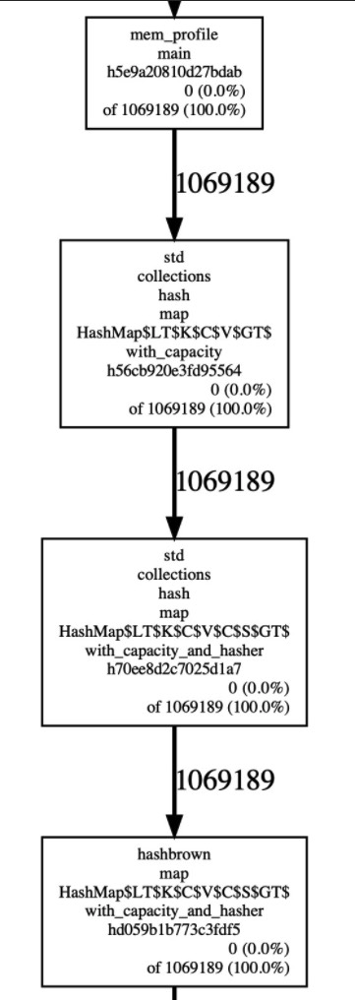

# 蚂蚁集团 ｜ 如何在生产环境排查 Rust 内存占用过高问题

作者：ShiKaiWi / 后期编辑： 张汉东

---

## 背景
内存安全的 Rust，虽然基本不会出现内存泄漏，但如何合理分配内存，是每个复杂应用都要面临的问题。往往随着业务的不同，相同的代码可能会产生不同的内存占用，因此，有不小的概率会出现内存使用过多、内存逐渐增长不释放的问题。

在本文中，我想分享一下，我们在实践过程中，遇到的关于内存占用过高的问题，对于这些内存问题，在本文中，会做出简单的分类以及我们在生产环境下进行排查定位的方法。

## 内存分配器
首先在生产环境，我们往往不会选择默认的内存分配器（malloc），而是会选择 jemalloc，可以提供更好的多核性能以及更好的避免内存碎片（详细原因可以参考[1]），而在 Rust 的生态中，对于 jemalloc 的封装有很多优秀的库，这里我们就不纠结于哪一个库更好，我们更关心如何使用 jemalloc 提供的分析能力，帮助我们诊断内存问题。

阅读 jemalloc 的[使用文档](http://jemalloc.net/jemalloc.3.html#tuning)，可以知道其提供了基于采样方式的内存 profile 能力，而且可以通过 `mallctl` 可以设置 `prof.active` 和 `prof.dump` 这两个选项，来达到动态控制内存 profile 的开关和输出内存 profile 信息的效果。

## 内存快速增长直至 oom
这样的情况一般是相同的代码在面对不同的业务场景时会出现，因为某种特定的输入（往往是大量的数据）引起程序的内存快速增长。

不过有了上面提到的 memory profiling 功能，快速的内存增长其实一个非常容易解决的情况，因为我们可以在快速增长的过程中打开 profile 开关，一段时间后，输出 profile 结果，通过相应的工具进行可视化，就可以清楚地了解到哪些函数调用进行了哪些结构的内存分配。

不过这里分为两种情况：可以复现以及难以复现，对于两种情况的处理手段是不一样的，下面对于这两种情况分别给出可操作的方案。

### 可以复现
可以复现的场景其实是最容易的解决的问题，因为我们可以在复现期间采用动态打开 profile，在短时间内的获得大量的内存分配信息即可。

下面给出一个完整的 demo，展示一下在 Rust 应用中如何进行动态的内存 profile。

本文章，我会采用 `jemalloc-sys` `jemallocator` `jemalloc-ctl` 这三个 Rust 库来进行内存的 profile，这三个库的功能主要是：
-	`jemalloc-sys`: 封装 jemalloc。
-	`jemallocator`: 实现了 Rust 的 `GlobalAlloc`，用来替换默认的内存分配器。
-	`jemalloc-ctl`: 提供了对于 mallctl 的封装，可以用来进行 tuning、动态配置分配器的配置、以及获取分配器的统计信息等。

下面是 demo 工程的依赖：
```toml
[dependencies]
jemallocator = "0.3.2"
jemalloc-ctl = "0.3.2"

[dependencies.jemalloc-sys]
version = "0.3.2"
features = ["stats", "profiling", "unprefixed_malloc_on_supported_platforms"]

[profile.release]
debug = true
```

其中比较关键的是 `jemalloc-sys` 的几个 features 需要打开，否则后续的 profile 会遇到失败的情况，另外需要强调的是 demo 的运行环境是在 Linux 环境下运行的。

然后 demo 的 src/main.rs 的代码如下：
```Rust
use jemallocator;
use jemalloc_ctl::{AsName, Access};
use std::collections::HashMap;

#[global_allocator]
static ALLOC: jemallocator::Jemalloc = jemallocator::Jemalloc;

const PROF_ACTIVE: &'static [u8] = b"prof.active\0";
const PROF_DUMP: &'static [u8] = b"prof.dump\0";
const PROFILE_OUTPUT: &'static [u8] = b"profile.out\0";

fn set_prof_active(active: bool) {
    let name = PROF_ACTIVE.name();
    name.write(active).expect("Should succeed to set prof");
}

fn dump_profile() {
    let name = PROF_DUMP.name();
    name.write(PROFILE_OUTPUT).expect("Should succeed to dump profile")
}

fn main() {
    set_prof_active(true);

    let mut buffers: Vec<HashMap<i32, i32>> = Vec::new();
    for _ in 0..100 {
		buffers.push(HashMap::with_capacity(1024));
    }

    set_prof_active(false);
    dump_profile();
}
```

demo 已经是非常简化的测试用例了，主要做如下的说明：
- `set_prof_active` 和 `dump_profile` 都是通过 jemalloc-ctl 来调用 jemalloc 提供的 mallctl 函数，通过给相应的 key 设置 value 即可，比如这里就是给 `prof.active` 设置布尔值，给 `profile.dump` 设置 dump 的文件路径。

编译完成之后，直接运行程序是不行的，需要设置好环境变量（开启内存 profile 功能）：
```
export MALLOC_CONF=prof:true
```
然后再运行程序，就会输出一份 memory profile 文件，demo 中文件名字已经写死 —— `profile.out`，这个是一份文本文件，不利于直接观察（没有直观的 symbol）。

通过 jeprof 等工具，可以直接将其转化成可视化的图形：
```
jeprof --show_bytes --pdf <path_to_binary> ./profile.out > ./profile.pdf
```

这样就可以将其可视化，从下图中，我们可以清晰地看到所有的内存来源：

 

这个 demo 的整体流程就完成了，距离应用到生产的话，只差一些 trivial 的工作，下面是我们在生产的实践：
- 将其封装成 http 服务，可以通过 curl 命令直接触发，将结果通过 http response 返回。
- 支持设置 profile 时长。
- 处理并发触发 profile 的情况。

说到这里，这个方案其实有一个好处一直没有提到，就是它的动态性，因为开启内存 profile 功能，势必是会对性能产生一定的影响（虽然这里开启的影响并不是特别大），我们自然是希望在没有问题的时候，避免开启这个 profile 功能，因此这个动态开关还是非常实用的。

### 难以复现
事实上，可以稳定复现的问题都不是问题，生产上，最麻烦的问题是难以复现的问题，难以复现的问题就像是一个定时炸弹，复现条件很苛刻导致难以精准定位问题，但是问题又会冷不丁地出现，很是让人头疼。

一般对于难以复现的问题，主要的思路是提前准备好保留现场，在问题发生的时候，虽然服务出了问题，但是我们保存了出问题的现场，比如这里的内存占用过多的问题，有一个很不错的思路就是：在 oom 的时候，产生 coredump。

不过我们在生产的实践并没有采用 coredump 这个方法，主要原因是生产环境的服务器节点内存往往较大，产生的 coredump 也非常大，光是产生 coredump 就需要花费不少时间，会影响立刻重启的速度，此外分析、传输、存储都不太方便。

这里介绍一下我们在生产环境下采用的方案，实际上也是非常简单的方法，通过 jemalloc 提供的功能，可以很简单的进行间接性地输出内存 profile 结果。

在启动使用了 jemalloc 的、准备长期运行的程序，使用环境变量设置 jemalloc 参数：
```
export MALLOC_CONF=prof:true,lg_prof_interval:30
```
这里的参数增加了一个 `lg_prof_interval:30`，其含义是内存每增加 1GB（2^30，可以根据需要修改，这里只是一个例子），就输出一份内存 profile，这样随着时间的推移，如果发生了内存的突然增长（超过设置的阈值），那么相应的 profile 一定会产生，那么我们就可以在发生问题的时候，根据文件的创建日期，定位到出问题的时刻，内存究竟发生了什么样的分配。

## 内存缓慢增长不释放
不同于内存的急速增长，内存整体的使用处于一个稳定的状态，但是随着时间的推移，内存又在稳定地、缓慢的增长，通过上面所说的方法，很难发现内存究竟在哪里使用了。

这个问题也是我们在生产碰到的非常棘手的问题之一，相较于此前的剧烈变化，我们不再关心发生了哪些分配事件，我们更关心的是当前的内存分布情况，但是在没有 GC 的 Rust 中，观察当前程序的内存分布情况，并不是一件很简单的事情（尤其是在不影响生产运行的情况下）。

针对这个情况，我们在生产环境中的实践是这样的：
- 手动释放部分结构（往往是缓存）内存
- 然后观察前后的内存变化（释放了多少内存），确定各个模块的内存大小

而借助 jemalloc 的统计功能，可以获取到当前的内存使用量，我们完全可以重复进行 **释放制定模块的内存+计算释放大小**，来确定内存的分布情况。

这个方案的缺陷也是很明显的，就是参与内存占用检测的模块是先验的（你无法发现你认知以外的内存占用模块），不过这个缺陷还是可以接受的，因为一个程序中可能的占用内存过大的地方，我们往往都是知道的。

下面给出一个 demo 工程，可以根据这个 demo 工程，应用到生产。

下面是 demo 工程的依赖:
```toml
[dependencies]
jemallocator = "0.3.2"
jemalloc-ctl = "0.3.2"

[dependencies.jemalloc-sys]
version = "0.3.2"
features = ["stats", "profiling", "unprefixed_malloc_on_supported_platforms"]

[profile.release]
debug = true
```

demo 的 src/main.rs 的代码：
```Rust
use jemallocator;
use jemalloc_ctl::{epoch, stats};

#[global_allocator]
static ALLOC: jemallocator::Jemalloc = jemallocator::Jemalloc;

fn alloc_cache() -> Vec<i8> {
    let mut v = Vec::with_capacity(1024 * 1024);
    v.push(0i8);
    v
}

fn main() {
    let cache_0 = alloc_cache();
    let cache_1 = alloc_cache();

    let e = epoch::mib().unwrap();
    let allocated_stats = stats::allocated::mib().unwrap();
    let mut heap_size = allocated_stats.read().unwrap();

    drop(cache_0);
    e.advance().unwrap();
    let new_heap_size = allocated_stats.read().unwrap();
    println!("cache_0 size:{}B", heap_size - new_heap_size);
    heap_size = new_heap_size;

    drop(cache_1);
    e.advance().unwrap();
    let new_heap_size = allocated_stats.read().unwrap();
    println!("cache_1 size:{}B", heap_size - new_heap_size);
    heap_size = new_heap_size;

    println!("current heap size:{}B", heap_size);
}
```
比起上一个 demo 长了一点，但是思路非常简单，只要简单说明一下 jemalloc-ctl 的一个使用注意点即可，在获取新的统计信息之前，必须先调用一下 `epoch.advance()` 。

下面是我的编译后运行的输出信息：
```bash
cache_0 size:1048576B
cache_1 size:1038336B
current heap size:80488B
```

 这里可以发现，cache_1 的 size 并不是严格的 1MB，这个可以说是正常的，一般来说（不针对这个 demo）主要有两个原因：
 - 在进行内存统计的时候，还有其他的内存变化在发生。
 - jemalloc 提供的 stats 数据不一定是完全准确的，因为他为了更好的多核性能，不可能使用全局的统计，因此实际上是为了性能，放弃了统计信息的一致性。

不过这个信息的不精确，并不会给定位内存占用过高的问题带来阻碍，因为释放的内存往往是巨大的，微小的扰动并不会影响到最终的结果。

另外，其实还有更简单的方案，就是通过释放缓存，直接观察机器的内存变化，不过需要知道的是内存不一定是立即还给 OS 的，而且靠眼睛观察也比较累，更好的方案还是将这样的内存分布检查功能集成到自己的 Rust 应用之中。

## 其他通用方案
### metrics
另外还有一个非常有效、我们一直都在使用的方案，就是在产生大量内存分配的时候，将分配的内存大小记录成指标，供后续采集、观察。

整体的方案如下：
- 使用 Prometheus Client 记录分配的内存（应用层统计）。
- 暴露出 metrics 接口。
- 配置 Prometheus server，进行 metrics 拉取。
- 配置 Grafana，连接 Prometheus server，进行可视化展示。

### 内存排查工具
在内存占用过高的排查过程中，也尝试过其他的强大工具，比如 heaptrack、valgrind 等工具，但是这些工具有一个巨大的弊端，就是会带来非常大的 overhead，一般来说，使用这类工具的话，基本上应用程序是不可能在生产运行的。

也正因如此，在生产的环境下，我们很少使用这类工具排查内存的问题。


## 总结
虽然 Rust 已经帮我们避免掉了内存泄漏的问题，但是内存占用过高的问题，我想不少在生产长期运行的程序还是会有非常大的概率出现的。本文主要分享了我们在生产环境中遇到的几种内存占用过高的问题场景，以及目前我们在不影响生产正常服务的情况下，一些常用的、快速定位问题的排查方案，希望能给大家带来一些启发和帮助。

当然可以肯定的是，还有其他我们没有遇到过的内存问题，也还有更好的、更方便的方案去做内存问题的定位和排查，希望知道的同学可以一起多多交流。

## 参考
[1] [Experimental Study of Memory Allocation forHigh-Performance Query Processing](http://www.adms-conf.org/2019-camera-ready/durner_adms19.pdf)

[2] [jemalloc 使用文档](http://jemalloc.net/jemalloc.3.html)

[3] [jemallocator](https://github.com/gnzlbg/jemallocator)

## 关于我们

我们是蚂蚁智能监控技术中台的时序存储团队，我们正在使用 Rust 构建高性能、低成本并具备实时分析能力的新一代时序数据库，欢迎加入或者推荐，请联系：jiachun.fjc@antgroup.com