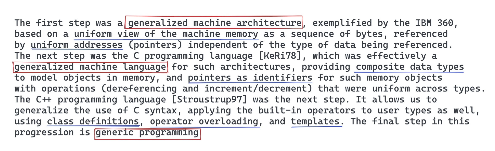
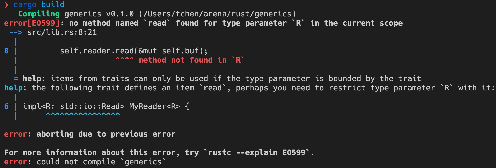
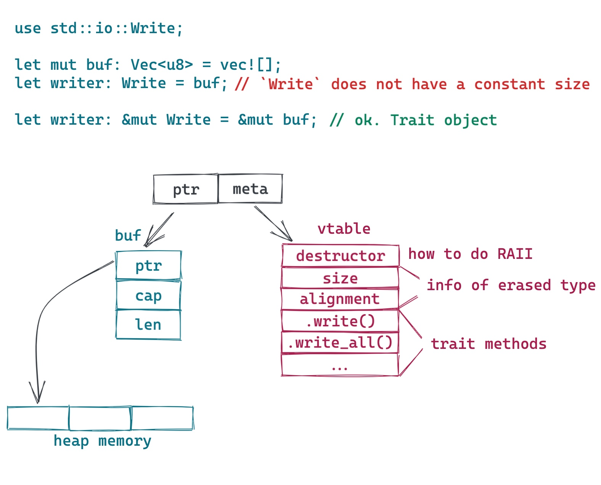
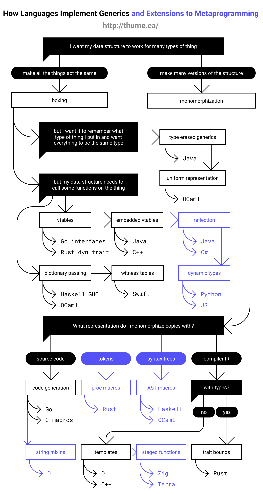
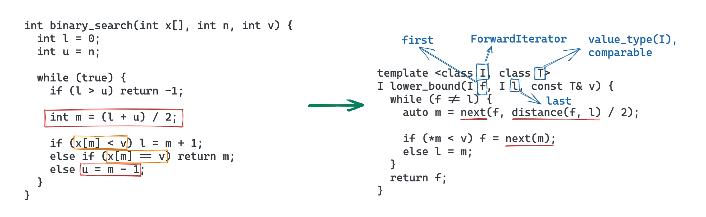

# 透过 Rust 探索系统的本原：泛型

作者：陈天 / 后期编辑：张汉东

> 原文链接：[https://mp.weixin.qq.com/s/SJsEurfZr4TG-I3rncid5A](https://mp.weixin.qq.com/s/SJsEurfZr4TG-I3rncid5A)

---

在 Fundamentals of Generic Programming[1] 里，Alexander Stepanov（泛型概念的创立者）用一段优雅的文字描绘了计算机技术不断泛化（generalized）的历史：



他说，目前我们走了三步：

- 第一步，通用的计算机体系结构：将内存视作一组连续可寻址的空间
- 第二步，通用的计算机语言：使用指针作为统一的引用类型的标识符
- 第三步，泛型编程

今天我们就来讲讲泛型编程。

广义的泛型编程分为两部分：数据类型的泛型（Generic Data Types）或者说参数化类型（Parameterized Type），以及泛型函数（Generic Function）。

## 参数化类型

我们先看参数化类型。参数化类型是指定义数据结构或者类型的时候，不指定具体的类型，而是将其作为参数使用，使得该定义对各种具体类型都适用。参数化类型的好处是语言能够更具表达力（某种程度上接近动态类型语言），同时还保持了完整的静态类型安全。

打个不那么特别恰当，但比较容易理解的比方：类型之于数据，如同泛型之于一般类型。我们从具体的数据中抽象出核心的要素，构造出可以囊括这些数据的类型。比如 `u8`，囊括了 0-255 所有可能的数值。而我们进一步再从类型中抽取出通用的要素，构造出可以囊括这些类型的元类型。比如所有可以做加法操作的元类型 `Add`，它囊括了 `u32`，`f64`，`usize` 甚至 `Complex` 等各种可以进行加法操作的数据类型。

我们看一个实际的例子。

我们要实现一个数据结构，它可以从文件中读取一段数据，放入缓存中，然后对数据做一系列的处理。我们可以很容易定义出这样的结构：

```rust
struct MyReader {
  reader: File,
  buf: Vec<u8>,
}

impl MyReader {
  pub fn process(&mut self) {
    self.reader.read(&mut self.buf);
    // further processing on buf
  }
}
```

然而， 如果需求不仅仅是从文件读取，还可能从网络，从一个加密数据流，甚至从磁带上读取，做同样的缓存和处理，那么，我们不得不为每一种需求使用一个几乎相同的数据结构。如果使用参数化类型，我们可以这样定义：

```rust
struct MyReader<R> {
  reader: R,
  buf: Vec<u8>
}

impl<R> MyReader<R> {
  pub fn process(&mut self) {
    self.reader.read(&mut self.buf);
    // further processing on buf
  }
}
```

从代码中，我们可以更加深刻地领会到上文所说的「参数化类型的好处是语言能够更具表达力，同时还保持了完整的静态类型安全」。它是个非常强大的工具。

但这样给编译器出了一个难题：编译器在编译时如何得知 `reader` 可以执行 `read()` 操作呢？

不能。因为在这里，参数 R 可以是任何类型，而大多数类型并不直接支持 `read()` 操作。所以，这里我们需要对参数 R 进行限制。这个过程和函数的定义很类似：

```rust
fn add(a, b) // error - 我们不知道在函数调用时如何为 a, b 分配内存，因而需要对 a, b 做进一步限制
fn add(a: usize, b: usize) // ok - 现在我们知道 a, b 的限制（内存大小，允许的操作等）
```

对类型的参数的限制（bound），不同的语言使用的方式不同，Java 可以要求 `<R extends ...>`，Rust 使用 trait，而 Swift 使用 protocol，但大家的目标是一致的：编译器需要足够的信息来决定上述的代码是否可以编译通过。

如果你用 rust 编译器编译上述代码，编译器会给出详尽的错误：



它甚至为你推荐合适的 trait 来限制 R，真是比女（男）朋友还要更懂你。

## 泛型函数

### 静态分派

函数操作的对象是类型，当数据类型使用泛型时，使用其作为参数或者返回值的函数，也被称之为泛型函数，比如：

```rust
fn generic<T>(t: T) {
  todo!()
}

fn main() {
  generic::<u8>(42);
  generic::<&str>(&"hello");
}
```

在 `main()` 对 `generic()` 的两次调用中，第一次使用了 `u8` 类型，第二次使用了 `&str` 类型。编译器在编译时就能捕获到使用的类型，从而进行对应的处理，这被称之为静态分派（static dispatch）。不同语言对静态分派的处理很不一样。在 Rust 中，处理的方法叫 monomorphization （单态化）—— 说人话就是编译器会为代码中所有使用到的类型编译出一个副本。对于这个例子，你可以想象编译器生成了类似于如下代码：

```rust
fn main() {
  generic_int(42);
  generic_ref_str(&"hello");
}
```

除了 Rust 外，C++ 也使用了单态化来处理泛型函数，只不过 C++ 使用的 template 并不携带类型，在编译过程中会被直接展开。

Java 对泛型的处理方式和 Rust 不一样。Java 会擦除（erase）类型，编译出的代码类似：

```rust
void main() {
  generic((Object) 42);
  generic((Object) "hello");
}
```

显然，Java 的方式会带来运行时性能上的损失（需要做在具体类型和 Object 间来回做额外的 typecast），并且，由于类型被擦除，所以很难为每种泛型编译的结果做特定的优化。

### 动态分派

静态分派固然很好，效率很高，但很多时候，类型可能很难在编译时决定。比如我要撰写一个格式化工具，这个在 IDE 里很常见。我们可以定义一个 `Formatter` 接口，然后创建一系列实现：

```rust
pub trait Formatter {
    fn format(&self, input &mut str) -> bool;
}

struct MarkdownFormatter;
impl Formatter for MarkdownFormatter {
    fn format(&self, input &mut str) -> bool { todo!() }
}

struct RustFormatter;
impl Formatter for RustFormatter {
    fn format(&self, input &mut str) -> bool { todo!() }
}

struct HtmlFormatter;
impl Formatter for HtmlFormatter {
    fn format(&self, input &mut str) -> bool { todo!() }
}
```

使用什么格式化方法，只有当我们打开文件，分析出文件内容之后才能确定，我们并无法在编译期给定一个具体类型，使其满足如下函数（一个文件可能有一到多个格式化工具，比如一个 markdown 文件里有 rust 代码，因而需要 `MarkdownFormatter` 和 `RustFormatter` 来格式化，所以这里我们使用一个 `Vec` 来提供所有需要的格式化工具）：

```rust
pub fn format(input: &mut str, formatters: Vec<???>) {
    for formatter in formatters {
        formatter.format(input);
    }
}
```

正常情况下，`Vec<>` 容器里的类型需要是一致的，但此处我们无法给定一个一致的类型。

所以我们需要有一种手段，告诉编译器，此处我们需要并且仅需要任何实现了 `Formatter` 接口的数据类型。在 Rust 里，这种类型叫 Trait Object，表现为 `&dyn Trait` 或者 `Box<dyn Trait>`。这里，`dyn` 关键字仅仅是用来帮助更好地区分普通类型和 Trait 类型。于是，上述代码可以写成：

```rust
pub fn format(input: &mut str, formatters: Vec<Box<dyn Formatter>>) {
    for formatter in formatters {
        formatter.format(input);
    }
}
```

这样，我们可以在运行时构造一个 `Formatter` 的列表，传递给 `format` 函数进行文件的格式化。这就是动态分派（dynamic dispatching）。

Trait Object 虽然是 Rust 独有的概念，但这个概念并不新鲜。我们看看它的实现机理。为了方便介绍，我们以 Rust 标准库里的 `Write` 接口为例：

```rust
pub trait Write {
  fn write(&mut self, buf: &[u8]) -> Result<usize>;
  fn flush(&mut self) -> Result<()>;

  fn write_all(&mut self, buf: &[u8]) -> Result<()> { ... }
  ...
}
```

`Write` 接口包含若干个方法，其中 `write()` 和 `flush()` 必须实现。标准库中，`Vec<T>` 实现了 `Write` 接口。

当我们要使用这个接口做动态分派时，我们可以像如下例子一样，将一个具体类型（concrete type，比如 `Vec<u8>`）的引用，赋给 `Write` 接口：



这会生成一个 Trait Object，在上图中，我们可以看到，Trait Object 的底层逻辑不过就是胖指针（fat pointer） —— 一个包含两个指针的数据结构。其中，一个指针指向数据本身，另一个则指向虚函数表（vtable）。在这张表里，包含具体类型的一些信息，如 size，aligment 以及一系列函数指针：

- 这个接口支持的所有方法（比如 `write()`，`flush()` ）
- 具体类型的 drop trait，当 Trait object（比如 `Box<dyn Writer>` ） 被释放，它用来释放其使用的所有资源。

这样，当执行 `writer.write()` 时，就可以从 vtable 里找到对应的函数指针，执行具体的操作。

所以，Rust 里的 Trait Object，没什么神秘的，它不过是 C++/Java 中大家熟知的 vtable 的一个变体而已。当然，C++/Java 指向 vtable 的指针在编译时放在类结构里，而 Rust 放在 Trait object 中。这也是为什么 Rust 很容易对基本类型（primitive type）做动态分派，而 C++/Java 不行。事实上，Rust 也并不区分基本类型，对 Rust 来说，所有的类型的地位都是一致的。

大多数通过接口实现动态分派的语言，都是通过 vtable 来协助接口方法的动态调用，Golang（interfaces）也是如此。Swift 虽然在很多方面跟 Rust 很类似，但在泛型的支持上，走了一条相对独特的道路：witness table[2]。有空讲 Swift 的时候，我可以专门讲讲 witeness table，很有意思（等不及的看参考资料中的视频吧）。

对于不同语言如何实现静态分派和动态分派，下面这个流程图表述地非常清楚，大家可以仔细研读一下。如果你读懂了这幅图，那么你对泛型函数的了解就足够清晰了：



（来源：Models of Generics and Metaprogramming: Go, Rust, Swift, D and More[4]）

## 泛型编程的实践

泛型编程，与其说是一种技术，不如说是一种思想。它不仅仅是类型参数化，函数泛型化那么简单，背后体现的是程序员的抽象思维能力。抽象思维的能力，和语言无关，和工具无关，它是一种在实践中不断探索，不断学习，不断历练得出的能力。支持泛型的语言并不能帮助你更好地做泛型编程，就好比给我一台斯坦威钢琴，并不意味着我就具备了演奏李斯特《钟》的能力。

下图左边的代码是大家都很熟悉的，估计闭着眼睛也能写出来的 C 语言版本的 `binary_search` 算法。右边是 Alexander Stepanov 为 C++ STL 初版设计的类似算法（之所以叫 `lower_bound`，是因为它不仅使用 binary search 返回匹配的结果，在没找到时，还会返回其应该所处的位置）：



可以看到， C 语言版本的算法的实现跟参数的细节绑定得很紧，而 Alex 的 `lower_bound` 版本，除了参数的抽象化之外，所有的实现细节都被不同的函数替代 —— 在不同的数据结构的上下文中，它们有不同的实现。拿 `distance()` 来说，对于数组，它是两个 index 之间的距离，对于链表，它是两个节点之间的跳数。在我看来，能够区分哪些是实现细节，哪些是算法的核心要素，并且能够把实现细节延迟到尽可能靠后的阶段（调用者调用时），这才是泛型编程的核心所在。Alan Perlis 在 Epigrams of Programming 里有个精妙的论断：

> Functions delay binding: data structures induce binding. Moral: Structure data data in the programming process.

我们再看一个例子：客户端和服务器间通过 protobuf 来传递消息，两端约定消息的头四个字节是 protobuf 的长度，之后是 protobuf。我们需要做一个库处理消息的收发：从底层接收一个完整的消息，并反序列化传递给上层，以及上层需要发送消息时，序列化消息，添加长度信息，提交给底层发送出去。

这种需求往往一开始就有确定的底层传输机制，比如 WebSocket，以及确定的上层消息类型。如果照着这样的需求直接处理，很容易把系统做死：上层的消息的变动，会影响消息收发库的设计；底层传输机制的变化（比如另一个项目，改用 HTTP/2），也会影响消息收发库的设计。所以如果一开始没有做好对需求的足够抽象，日后各种变更会让你忙不过来。

我们可以把不变的部分抽取出来：带长度的数据读取/带长度的数据写入，以及序列化，反序列化。至于消息收发时底层的传输机制是什么，我们尽量不去关心；而上层究竟会传递什么样的消息，也不去关心。底层传输，我们可以将其抽象成 Reader / Writer（async 下是 Stream / Sink），上层的消息，我们将其抽象成 Message。接受和发送的数据，可以看做是一个 Frame，里面有不同的格式，于是，我们可以有这样的设计：


如果定义得当，甚至 frame 结构的变化，都可以不必大动干戈就可以很快实现。具体代码大家可以看 [5]。

## 贤者时刻

我在之前的文章中讲过，语言在开发过程形成的世界观极大地影响和限制着语言本身的行为和能力。Rust 为了追求极致的效率（和零成本抽象），在泛型的处理上选择了单态化来处理静态分派，这极大影响了编译速度，同时单态化也意味着 Rust 代码无法很好地以二进制分发，让其他 Rust 代码以 Rust ABI 的方式调用（而非以 C FFI 的方式调用）。这也意味着，即便 Rust 在很多场合能够取代 C，但 Rust 可能永远也无法取代 C 在操作系统应用程序二进制接口 （ABI）中的地位。

本文是上周四我在 Tubi 的有关 Rust 的 BBL 的一个总结和回顾，BBL 的讲稿可以在我的 github: tyrchen/rust-training 里获得，或者点击「阅读原文」查看。很有意思的是，周六（4/30），Jon Gjengset 在他的 Crust of Rust 系列的最新一期，讲了几乎同样的主题：Dispatch and Fat Pointers[6]，感兴趣的同学可以看看那期视频。Jon 的直播期期都是精品，绝对值得花时间学习。

这个系列写到这里，也要告一段落了。原本只是想写个三四篇，没想到前前后后写了八篇。其实要继续写的话，还有很多方向可以写，比如 debug，分布式，状态机等等：


不过，生活中不只有 Rust。我的 Flutter 2，开了个头，尚待完成，Swift 和 iOS 开发，还有很多路要走，最近 Elixir 社区涌现了不少让人激动的项目，也有同学想让我聊一聊。所以，我会花些时间聊聊其它内容。大家有什么感兴趣的和软件开发有关的话题，也欢迎和我探讨。

## 参考资料

[1] Fundamentals of Generic Programming:

[2] Implementing Swift Generics: [https://youtu.be/ctS8FzqcRug](https://youtu.be/ctS8FzqcRug)

[3] How Swift Achieved Dynamic Linking Where Rust Couldn't: [https://gankra.github.io/blah/swift-abi/](https://gankra.github.io/blah/swift-abi/)

[4] Models of Generics and Metaprogramming: Go, Rust, Swift, D and More:  [https://thume.ca/2019/07/14/a-tour-of-metaprogramming-models-for-generics/](https://thume.ca/2019/07/14/a-tour-of-metaprogramming-models-for-generics/)

[5] async-prost: [https://github.com/tyrchen/async-prost](https://github.com/tyrchen/async-prost)

[6] Crust of Rust: Dispatch and Fat Pointers: [https://www.youtube.com/watch?v=xcygqF5LVmM](https://www.youtube.com/watch?v=xcygqF5LVmM)

[https://gist.github.com/Kimundi/8391398](https://gist.github.com/Kimundi/8391398)

语言的设计很多时候也会影响到语言使用的方式。

Swift 使用 witness table 来处理泛型，而 Rust 在编译时为每种使用到的场景复制出专门的代码，这带来一些显著地不同：

- Rust 编译速度更慢，而 Swift 会快不少
- 如果你使用别人做的 Rust library，你需要集成源码进行编译，否则泛型将无法使用（你只能以 C FFI 的形式将其集成）；而 Swift 可以允许你使用第三方的二进制，且不影响泛型的功用。

从这一点我们也可以看出，Rust 和 Swift 生态的显著不同 —— Swift 在设计上考虑了潜在的商业伙伴上的需求。