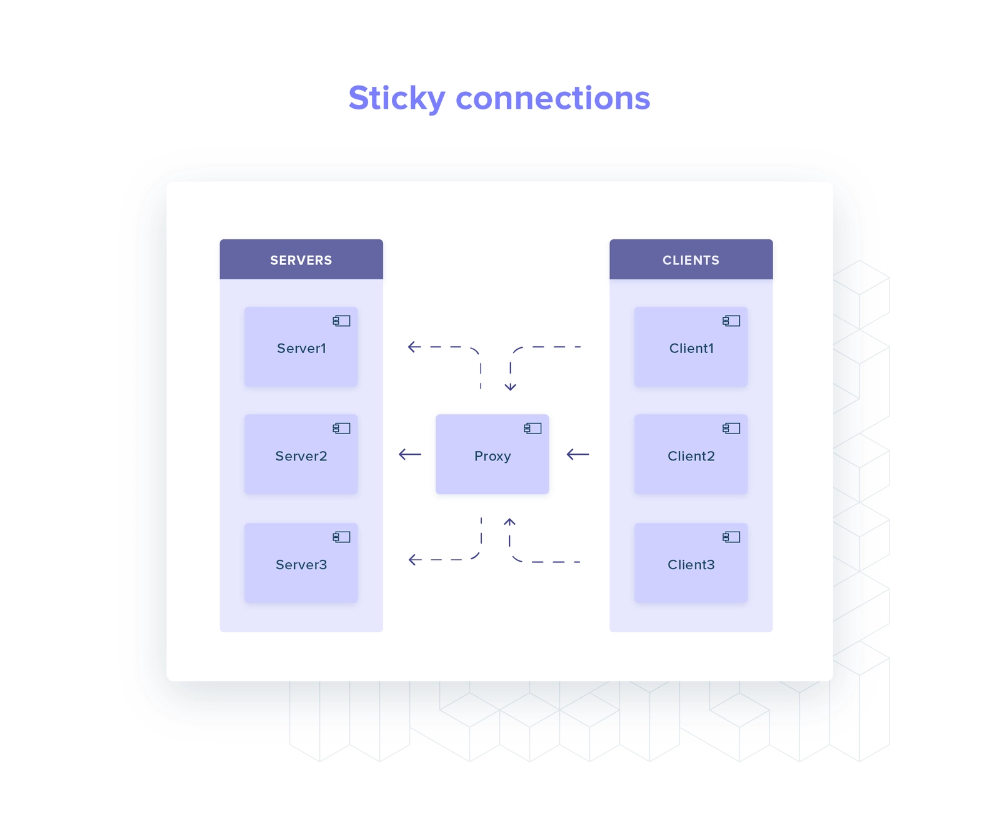
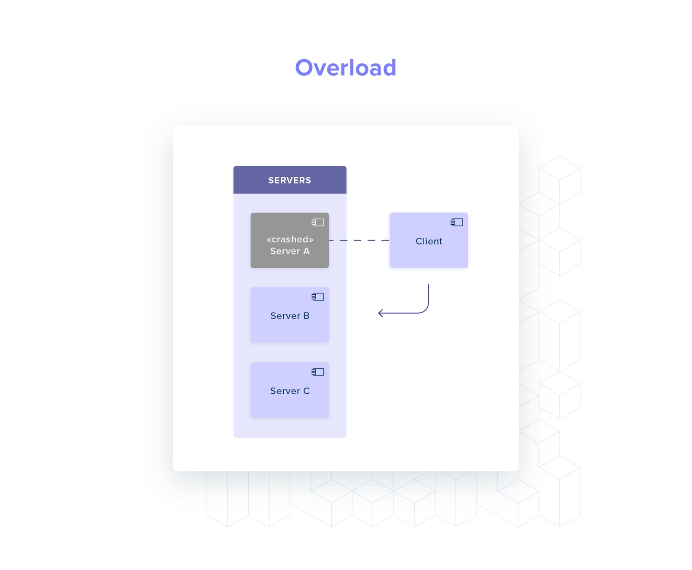

# Rust 中的 gRPC 负载均衡

译者: iamazy 

---

> [原文](https://truelayer.com/blog/grpc-load-balancing-in-rust) / 

**在我们的开源系列的第一篇文章中，我们分享了 gRPC 客户端侧负载均衡的解决方案：使用 ginepro。**

我们希望对广大的开发者社区做出回馈。我们开源系列的每篇文章都将带你了解 TrueLayer 工程团队面临的挑战 - 我们在 OSS 许可下发布了解决这些问题的代码。

在本文中，我们将会解析我们是如何处理 Rust 中 gRPC 负载均衡的挑战的。

我们的解决方案是`ginepro`，一个崭新的用于`tonic`的 gRPC channel 实现。`ginepro`([github](http://github.com/truelayer/ginepro))通过带有周期性 (periodic) 服务发现的丰富的`tonic`通道来提供客户端侧 gRPC 负载均衡。

## 背景

TrueLayer 最近开始[适配 Rust 作为后台开发语言](https://truelayer.com/blog/engineering-paydirect/)。随着我们越来越多的服务部署到生产中，我们必须不断改进我们的应用程序，以便它们能够处理更多负载以及实现所需的可靠性 SLA。

gRPC 请求的负载均衡一直是一个挑战：我们不使用 Service Mesh，并且 Rust 生态系统中也没有任何 gRPC 客户端可以满足我们的所有要求。

为了弥补这个问题，我们构建了`ginepro` - 一个`tonic` channel 的插件，它提供了服务发现功能以便执行客户端侧的 gRPC 负载均衡。

```rust
// Using the `LoadBalancedChannel`.
use ginepro::LoadBalancedChannel;
use ginepro::pb::tester_client::TesterClient;

// Build a load-balanced channel given a service name and a port.
let load_balanced_channel = LoadBalancedChannel::builder(
    ("my_hostname", 5000)
  )
  .await
  .expect("Failed to initialise the DNS resolver.")
  .channel();

// Initialise a new gRPC client for the `Test` service
// using the load-balanced channel as transport
let grpc_client = TestClient::new(load_balanced_channel);
```

`LoadBalanceChannel`是`tonic`的`Channel`的替代品：

```rust
// Using `tonic::Channel`
use tonic::endpoint::Channel;
use ginepro::pb::tester_client::TesterClient;

let channel = Channel::from_static("my_hostname:5000");
let grpc_client = TestClient::new(channel);
```

## 问题

gRPC 使用 HTTP/2 协议在单个 TCP 连接中实现请求与响应的多路复用。

这使得 gRPC 更加高效：你只需付出建立一次连接的成本并且可以更好的利用底层传输的能力。

但是，多路复用在负载均衡方面会有一些影响。

### HTTP/2 负载均衡

HTTP/2 连接是持久的：客户端(或负载均衡器)和特定服务器之间的直连应尽可能长时间保持打开状态。

当我们要请求时，不会重新与服务端建立一个新的连接。

在这里我们可以说负载均衡是基于每个请求完成的：对于每个请求，客户端将选择一个新服务器并通过现有连接发出该请求。

但是如果客户端移除负载均衡会发生什么呢？

客户端将保持与负载均衡器的连接，所有的请求都将通过这单个连接。然而，传统的网络负载均衡器无法区分应用请求。

由于网络负载均衡器在 OSI 栈的第四层（传输层）起作用，因此它们只能推断 TCP 和 UDP 连接。因此，它们只能将流量从一台客户端转发到一台固定的服务器（记住，连接是持久的）。



为了解决这个问题，HTTP/2 负载均衡器必须能够检查应用程序的流量。这就是应用程序负载均衡器的用途：它们可以区分请求，并为每个传入请求选择一个新的服务器。

### 负载倾斜

让我们看一个场景，未能执行 HTTP/2-aware 负载均衡会导致服务器使用不均匀 (unevenly)。

让我们对一个玩具系统进行思考：一个客户端和两个服务器，在 HTTP/2 之上讨论 gRPC。


当客户端启动时，它执行**服务发现**(如 DNS 请求)：我可以将请求发往哪些 IP？

答案是包含服务器 A 和服务器 B 的集合。与它们中的每一个都建立了 HTTP/2 连接。

每当客户端需要执行请求时，它会在两个连接之间随机选择 (round-robin)。

当服务器 A 崩溃时会发生什么？

在大多数 gRPC 实现中，客户端不会再次执行服务发现。

客户端开始将其所有请求路由到服务器 B，即使生成服务器 C 来替换服务器 A。



服务器 C 完全未使用，浪费资源并恶化系统的性能 (服务器 B 过载)。

## gRPC 负载均衡方法概述

我们可以采取几种方法来避免我们刚刚描述的场景：

1. 服务器周期性强制客户端重连
2. 客户端周期性执行服务发现
3. 引入应用级负载均衡

所有这些选项有什么共同点？

某些内容会周期性或在重连时刷新可用服务器列表。

前两个选项相当简单，所以让我们深入研究第三个选项，看看有哪些类型的 gRPC 应用级负载均衡器。

本文中，我们将 gRPC 负载均衡器分为两大类：客户端侧和外部进程。

### 客户端侧

所有的负载均衡逻辑都存在客户端侧：服务器选择，服务发现，健康检查(可选)。

因此，客户端维护 N 个连接，每个服务器一个连接，并且为每个请求选择一个连接发送请求。

所有的逻辑都在客户端：它更容易测试，并且你可以消除与通过网络或外部线程通信的负载均衡器相关的任何开销。

相反，这也增加了很多复杂性，并且你无法在不同语言中重用该实现。


### 外部线程

在此类中，负载均衡的复杂性(全部或部分)从客户端转移到一个或多个专用的进程中。

这些进程可以与应用部署在一起(如 sidecar 容器)，也可以作为独立服务运行。

通常，gRPC 外部线程的负载均衡器有两种形式：

1. [Look-aside](https://github.com/grpc/grpc/blob/master/doc/load-balancing.md) 服务告诉客户端应该请求哪台服务器
2. 对应用完全透明的独立服务，可以执行负载均衡，健康检查，上报负载及服务发现等(如 Envoy)。

### Look-aside

对于 Look-aside 负载均衡器，我们可以将其归类为 hybird 解决方案，大多数的逻辑都从客户端移除：健康检查，服务发现等。

客户端只需要：

- 维护与 look-aside 进程的连接 (我应该请求哪一台服务器)
- 在后台与所有健康的服务器建立并维护开放连接


### 代理

使用代理，将所有逻辑从客户端移除。

这让客户端非常简洁，它只需与代理之间维护一个连接即可。

有几种方法可以将代理整合进你的软件架构中：

- **Service Mesh**：专用基础架构层，用于控制服务到服务的通信(如 Istio 和 Linkerd)，作为 sidecar 进行部署。


- **Service Proxy**：所有客户端都需要连接的单个独立服务，并为每个 gRPC 服务做配置。


- **Sidecar 代理**：sidecar 代理与每个客户端部署在一起，并全部通过相同的 gRPC 服务配置代理。


然而，没有任何一种方案是完美的，它们之间总有一个权衡：

- hot path 中移动部件越多，越影响系统的延迟
- service mesh 和独立代理都为你的设置增加了很多复杂性，并具有新型的故障模式。它们需要被设置，监控和维护。

## TrueLayer 的方案

TrueLayer 利用 gRPC 在各种编程语言 (C#，Rust，TypeScript，Python)编写的应用程序之间建立强类型契约。

我们目前没有在 Kubernetes 集群中运行 service mesh，因此我们没有开箱即用的 gRPC 负载均衡。

### 历史先例，C#：使用 Envoy sidecar

我们大多数早期的 gRPC 服务端和客户端是使用 C# 编写的。

这里我们使用的是 sidecar 方案 - 一个手动配置的 Envoy 代理。

使用 Envoy sidecar，你可以获得一个生产强化解决方案，周边有很多社区。这是当时让 gRPC 负载均衡工作的最快方法。

独立的 sidecar 代理增加了系统整体的负载性：它是另一个需要配置，操作，理解的组件。

特别是，随着服务数量的增加，配置管理的扩展性很差，而在本地或 CI 上测试和重现故障模式相当困难。

### Rust 机遇

Rust 的 gRPC 生态如何呢？支持客户端负载均衡吗？

让我们看下 Rust 中最受欢迎的 gRPC 库：

- [TiKV](https://tikv.org/) 编写的 [grpc-rs](https://github.com/tikv/grpc-rs) - 实现了负载均衡但是无法更新服务 IP。
- [grpc-rust](https://github.com/stepancheg/grpc-rust) 没有实现负载均衡
- [tonic](https://github.com/hyperium/tonic) 实现了负载均衡并具有用于动态更新终结点的构建块。

`tonic`是最合适的候选人：一切开箱即用，**除了周期性服务发现**。

这已足够，`tonic`暴露了我们需要扩展该功能的 API：它在`Channel`原语中提供了动态添加和移除 gRPC 终结点的支持。

```rust
use tonic::transport::{Endpoint, Channel};

// Create a Channel. 
// This returns the sender half of a multi-producer single-consumer channel.
let (channel, sender) = Channel::balance_endpoint(1024);

// Add a new Endpoint.
sender.send(
  Change::Insert(
    "localhost:8080",
    Endpoint::from_static("localhost:8080")
  )
);

// Remove the Endpoint from the list of healthy targets.
sender.send(Change::Remove("localhost:8080"));
```

`tonic`还有一个好处：它基于`tower`构建，这是一个灵活且使用广泛的网络应用程序的中间件框架。

特别是，它基于`tower::balance`实现[负载均衡逻辑](https://docs.rs/tower/0.4.6/tower/balance/index.html)。[Linkerd 的数据平面代理](https://github.com/linkerd/linkerd2-proxy/blob/63ad2eca32b7a06ac3c1270269ad6bb3bf0b169b/linkerd/proxy/http/src/balance.rs#L7)使用了相同的组件：我们构建在一堆生产强化组件之上。

### 构建一个基于`tonic`的解决方案

我们决定尝试一下`tonic`，并投入一些时间来探索功能完备的客户端负载均衡 channel 会是什么样子。结果就是我们开源的`ginepro`库。

本节将更深入的研究实现细节。

在`tonic`中我们需要弥补的功能是服务发现：我们想要在后台周期性刷新健康的服务器 - 我们可以发送请求的 IP 列表。

我们假设每个服务名都映射到一个或多个 IP 地址中(及服务器的副本)。

解析服务名称的逻辑可以通过`LookupService`特征与 channel 实现分离：

```rust
/// Interface that provides functionality to
/// acquire a list of ips given a valid host name.
#[async_trait::async_trait]
pub trait LookupService {
    /// Return a list of unique `SockAddr` associated with the provided
    /// `ServiceDefinition` containing the `hostname` `port` of the service.
    /// If no ip addresses were resolved, an empty `HashSet` is returned.
    async fn resolve_service_endpoints(
        &self,
        definition: &ServiceDefinition,
    ) -> Result<HashSet<SocketAddr>, anyhow::Error>;
}
```

这个契约为我们提供了三个属性：我们可以通过模拟实现轻松诸如故障以测试不满意的场景，我们不限制 IP 的解析方式，我们可以隐藏协议特定的细微差别，如 DNS 记录超时。

例如，在 TrueLayer，我们将服务名称解析为 IP 列表时有两种选择：我们可以查询 Kubernetes 的 DNS 或直接查询 Kubernetes 的 API(`端点`资源)。

`LookupService`是如何适应客户端逻辑的呢？

这里有一个在后台运行的事件循环，由我们的`LoadBalancedChannel`管理。

`LoadBalancedChannel`在一个定时触发的服务发现上保留了一个已知终结点集合。

然后我们移除已经消失的终结点，并添加新发现的终结点。

```rust
loop {
      let discovered_endpoints = self
          .lookup_service
          .resolve_service_endpoints(service_definition).await;
    
      let changeset = self.create_changeset(&discovered_endpoints).await;
      // Report the changeset to `tonic` to update the list of available server IPs.
      self.report_and_commit(changeset, endpoints).await?;    
      
      // Wait until the next interval.
      tokio::time::sleep(self.probe_interval).await;
}
```

需要指出当终结点启动失败时 gRPC 客户端不会移除终结点：它将会一直尝试连接直到我们显式的告诉客户端将它移除(如服务端未通过健康检查探测并被 Kubernetes 移除)。

## 结论

我们能够在部署之前在 CI 中对`ginepro`进行广泛的测试 - 这是在同一服务栈中编写客户端解决方案的好处。

测试发现了`tonic`中的一些 bug (关于传输和 TLS) - 我们因此提交了补丁 ([1](https://github.com/hyperium/tonic/pull/536)和[2](https://github.com/hyperium/tonic/pull/493))

`ginepro`在五个月前在多个 gRPC 客户端上进行了生产部署。

目前我们还没有遇到 gRPC 负载均衡引发的问题。

有一个问题：它仅适用于我们的 Rust 服务。

这可能不是 TrueLayer 关于 gRPC 负载均衡的最后一篇文章。

未来会使用 service mesh 吗，我们拭目以待。

尽管如此，这个解决方案还是有价值的 - 这也是我们向整个 Rust 生态开放的原因。我们希望其他开发人员可以在我们的工作基础上继续推进 Rust 生态中 gRPC 栈的状态。

`ginepro`只是我们开源之旅的开端 - 下一期我们将介绍为扩展支持中间件的 [reqwest](https://docs.rs/reqwest/0.11.3/reqwest/index.html) 而构建的机制。