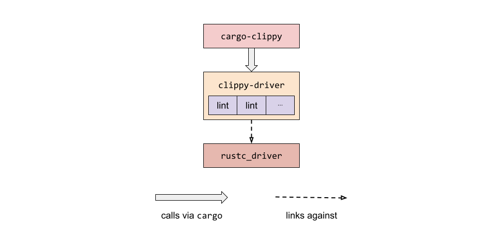
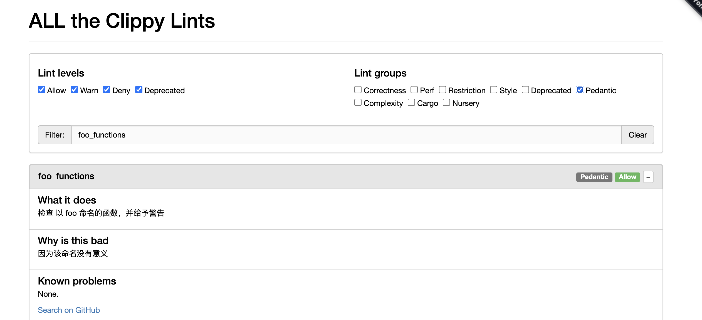
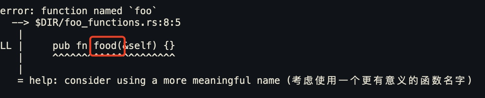
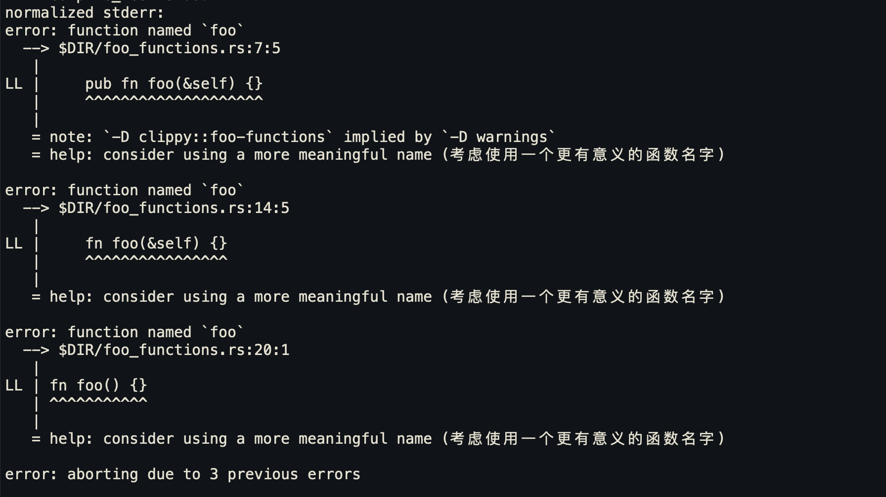
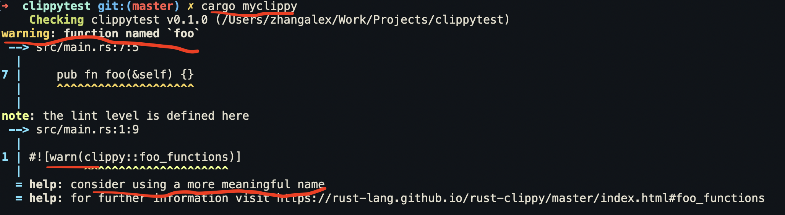

# 华为 | 如何定制 Rust Clippy 

作者：华为可信软件工程和开源2012实验室

---

## Clippy 是什么

Clippy 是 Rust 官方提供的 代码检查 lint 工具，通过静态分析，来检查代码中有问题或不符合指定规范的代码。

项目地址：[https://github.com/rust-lang/rust-clippy](https://github.com/rust-lang/rust-clippy) 

### 安装

> ```rust
> rustup component add clippy
> ```

### 使用

> ```rust
> cargo clippy
> ```

### 配置

可以在项目中添加 `clippy.toml` 或 `.clippy.toml` 来指定使用的 Lints 。

类似于：

```rust
avoid-breaking-exported-api = false
blacklisted-names = ["toto", "tata", "titi"]
cognitive-complexity-threshold = 30
```

Cargo Clippy 中目前包含[超过 450 个 Lint](https://rust-lang.github.io/rust-clippy/master/index.html) 。

### Rust 编译器内置 Lint 介绍

在 Rust 编译器 中 lint 包含四种级别：

- allow ，编译器
- warn
- deny
- forbid

每个 lint 都有一个 默认级别。下面是一个分类：

- [默认允许的  Lints](https://doc.rust-lang.org/rustc/lints/listing/allowed-by-default.html#allowed-by-default-lints) : 默认情况下，编译器允许的 Lints 。
- [默认警告Lints](https://doc.rust-lang.org/rustc/lints/listing/warn-by-default.html) : 默认情况下，编译器会警告的 LInts 。
- [默认拒绝的  Lints](https://doc.rust-lang.org/rustc/lints/listing/deny-by-default.html) ： 默认情况下，编译器会拒绝的lints。

编译器内置 Lint 主要是围绕 Rust 语言特性。开发者可以通过配置文件来修改 Lints 等级。

###  Clippy 中的 Lints 

**Clippy 中的 Lints 级别包括：**

- Allow
- Warn
- Deny
- Deprecated

**Clippy 中的 lints 分类如下表：**

| 分类                  | 描述                                                         | 默认级别      |
| --------------------- | ------------------------------------------------------------ | ------------- |
| `clippy::all`         | all lints that are on by default (correctness, style, complexity, perf)<br />所有默认的 Lints 都会被开启（正确性、风格、复杂性、性能） | **warn/deny** |
| `clippy::correctness` | code that is outright wrong or very useless<br />代码是完全错误或根本无用的 | **deny**      |
| `clippy::style`       | code that should be written in a more idiomatic way<br />代码应该用更惯用的方式来写 | **warn**      |
| `clippy::complexity`  | code that does something simple but in a complex way<br />代码把简单的事情写复杂了 | **warn**      |
| `clippy::perf`        | code that can be written to run faster<br />代码的写法在性能上还可以改进 | **warn**      |
| `clippy::pedantic`    | lints which are rather strict or might have false positives<br />这些 lints 相当严格或可能有误报 | allow         |
| `clippy::nursery`     | new lints that are still under development<br />仍然在开发中的新 lints | allow         |
| `clippy::cargo`       | lints for the cargo manifest<br />用于cargo manifest 的 lints | allow         |

总的来说，Clippy 对代码的检查主要是包括下面五个方面：

- 代码正确性（Correctness）。检查代码中不正确的写法。

- 代码风格（Style）。相比于 rustfmt，clippy 更偏向于代码实践中的惯用法检查。

- 代码复杂性（Complexity）。检查过于复杂的写法，用更简洁的写法代替。

- 代码不灵动 （Pedantic）。写法过于教条。

- 代码性能（Perf）。

  

**代码正确性**

Lint 示例：  [absurd_extreme_comparisons](https://rust-lang.github.io/rust-clippy/master/index.html#absurd_extreme_comparisons) (荒谬的极值比较)

>  检查关系中的一方是其类型的最小值或最大值的比较，如果涉及到永远是真或永远是假的情况，则发出警告。只有整数和布尔类型被检查。

代码示例：

```rust
let vec: Vec<isize> = Vec::new();
if vec.len() <= 0 {}
if 100 > i32::MAX {} // 这里会报错：Deny ，因为 100 不可能大于 i32::MAX
```


**代码风格**

Lint 示例： [assertions_on_constants](https://rust-lang.github.io/rust-clippy/master/index.html#assertions_on_constants) （对常量的断言）

>  用于检查 assert!(true) 和 assert!(false)  的情况。

代码示例：

```rust
assert!(false)
assert!(true)
const B: bool = false;
assert!(B) // 会被编译器优化掉。
```


**代码复杂性**

Lint 示例：  [bind_instead_of_map](https://rust-lang.github.io/rust-clippy/master/index.html#bind_instead_of_map)

> 检查 `_.and_then(|x| Some(y))`, ` _.and_then(|x| Ok(y))` or `_.or_else(|x| Err(y))` 这样的用法，建议使用更简洁的写法 `_.map(|x| y)` or `_.map_err(|x| y) `。

代码示例：

```rust
// bad
let _ = opt().and_then(|s| Some(s.len()));
let _ = res().and_then(|s| if s.len() == 42 { Ok(10) } else { Ok(20) });
let _ = res().or_else(|s| if s.len() == 42 { Err(10) } else { Err(20) });

// good
let _ = opt().map(|s| s.len());
let _ = res().map(|s| if s.len() == 42 { 10 } else { 20 });
let _ = res().map_err(|s| if s.len() == 42 { 10 } else { 20 });
```


**代码不灵动**

Lints 示例： [cast_lossless](https://rust-lang.github.io/rust-clippy/master/index.html#cast_lossless)

>  用于检查可以被安全转换（conversion）函数替代的数字类型之间的转换（ cast ）。

`as`强制转换与`From`转换从根本上不同。 `From`转换是“**简单**和安全”，而`as`强制转换纯粹是“安全”。在考虑数字类型时，仅在保证输出相同的情况下才存在`From`转换，即，不会丢失任何信息(不会出现截断或下限或精度下降)。 `as`强制转换没有此限制。

代码示例：

```rust
// bad
fn as_u64(x: u8) -> u64 {
    x as u64
}

// good
fn as_u64(x: u8) -> u64 {
    u64::from(x) // from内部其实也是as，但只要是实现 from 的，都是无损转换，在代码可读性、语义上更好
}
```


**代码性能**

Lints 示例： [append_instead_of_extend](https://rust-lang.github.io/rust-clippy/master/#append_instead_of_extend)

> 检查动态数组中是否出现 `extend`，建议使用 `append`代替。

代码示例：

```rust
let mut a = vec![1, 2, 3];
let mut b = vec![4, 5, 6];

// Bad
a.extend(b.drain(..));

// Good
a.append(&mut b); // 用 append 代替 extend 更加高效和简洁。
```


还有一些其他分类，比如包括一些「约束性（Restriction）」建议、对 cargo.toml 的检查、以及正在开发中的Lints 等。


### 如何定制 Clippy Lint

**定制 Clippy Lint 有两种办法：**

1. 方法一：fork [rust-clippy](https://github.com/rust-lang/rust-clippy) 项目，自己维护。因为使用了不稳定的接口，所以维护和使用不太方便。
2. 方法二：使用第三方  [Dylint](https://github.com/trailofbits/dylint) 工具。维护自定义 lint 比方法一更方便。


#### 方法一：fork clippy 

在 fork Clippy 定制自己的 LInt 之前，还需要了解 Clippy 的 工作机制。

##### Clippy 工作机制



Clippy 通过 `rust_driver` 和 `rustc_interface` 这两个库，可以把 `rustc` 作为库来调用。

`rustc_driver` 本质上就像是整个`rustc` 编译器的`main函数`（入口）。它使用在`rustc_interface crate`中定义的接口以正确的顺序运行编译器。

`rustc_interface crate`为外部用户提供了一个（未稳定的）API，用于在编译过程中的特定时间运行代码，允许第三方（例如`RLS`或`rustdoc`）有效地使用`rustc`的内部结构作为分析`crate` 或 模拟编译器过程的库。

对于那些使用 `rustc` 作为库的人来说，`rustc_interface::run_compiler() `函数是进入编译器的主要入口。它接收一个编译器的配置和一个接收编译器的闭包。`run_compiler`从配置中创建一个编译器并将其传递给闭包。在闭包中，你可以使用编译器来驱动查询，以编译一个 crate 并获得结果。这也是 `rustc_driver` 所做的。

 `rustc_interface` 组件库中定义了`Compiler` 结构体，持有 `register_lints` 字段。该 `Compiler`结构体就是编译器会话实例，可以通过它传递编译器配置，并且运行编译器。

`register_lints` 是 持有 `LintStore` 可变借用的闭包，其类型签名是 `Option<Box<dyn Fn(&Session, &mut LintStore) + Send + Sync>>`。

`LintStore` 是 [rustc_lint](https://github.com/rust-lang/rust/blob/master/compiler/rustc_lint/src/context.rs#L55) 组件库中定义的类型。

```rust
pub struct LintStore {
    /// Registered lints.
    lints: Vec<&'static Lint>,

    // 构造不同种类的 lint pass
    /// Constructor functions for each variety of lint pass.
    ///
    /// These should only be called once, but since we want to avoid locks or
    /// interior mutability, we don't enforce this (and lints should, in theory,
    /// be compatible with being constructed more than once, though not
    /// necessarily in a sane manner. This is safe though.)
    pub pre_expansion_passes: Vec<Box<dyn Fn() -> EarlyLintPassObject + sync::Send + sync::Sync>>,
    pub early_passes: Vec<Box<dyn Fn() -> EarlyLintPassObject + sync::Send + sync::Sync>>,
    pub late_passes: Vec<Box<dyn Fn() -> LateLintPassObject + sync::Send + sync::Sync>>,
    /// This is unique in that we construct them per-module, so not once.
    pub late_module_passes: Vec<Box<dyn Fn() -> LateLintPassObject + sync::Send + sync::Sync>>,

    /// Lints indexed by name.
    by_name: FxHashMap<String, TargetLint>,

  	// lint group，通过一个名字触发多个警告，把lint分组
    /// Map of registered lint groups to what lints they expand to.
    lint_groups: FxHashMap<&'static str, LintGroup>,
}
```

可以注册的 `lint pass` 还分好几类：

- early_passes：表示该类型的 `lint pass`对应的是 `EarlyContext`，是在 AST 层级的 lint 检查，还未到 HIR 层面。
- late_passes：表示该类型的 `lint pass`对应的是 `LateContext`，是在 类型检查之后的 lint 检查。意味着这样的检查需要获取类型信息。类型检查是在 HIR 层级做的。

在 `rust_interface` 中，还定义了相应的 check 方法：[early_lint_methods! 定义的很多check方法](https://github.com/rust-lang/rust/blob/master/compiler/rustc_lint/src/passes.rs#L156) 和 [late_lint_methods](https://github.com/rust-lang/rust/blob/master/compiler/rustc_lint/src/passes.rs#L12)。

声明一个 `lint pass` 需要使用 `declare_late_lint_pass!` 宏 中定义的 `rustc_lint::LateLintPass trait`。

再来看 `run_compiler`函数。

```rust
pub fn run_compiler<R: Send>(mut config: Config, f: impl FnOnce(&Compiler) -> R + Send) -> R {
    tracing::trace!("run_compiler");
    let stderr = config.stderr.take();
    util::setup_callbacks_and_run_in_thread_pool_with_globals(
        config.opts.edition,
        config.opts.debugging_opts.threads,
        &stderr,
        || create_compiler_and_run(config, f), // 设置一个回调函数
    )
}

// 回调函数
pub fn create_compiler_and_run<R>(config: Config, f: impl FnOnce(&Compiler) -> R) -> R {
    let registry = &config.registry;
    let (mut sess, codegen_backend) = util::create_session(
        config.opts,
        config.crate_cfg,
        config.diagnostic_output,
        config.file_loader,
        config.input_path.clone(),
        config.lint_caps,
        config.make_codegen_backend,
        registry.clone(),
    );
    // 。。。省略
  	let compiler = Compiler {
        sess,
        codegen_backend,
        input: config.input,
        input_path: config.input_path,
        output_dir: config.output_dir,
        output_file: config.output_file,
        register_lints: config.register_lints, // 配置 register_lints
        override_queries: config.override_queries,
    };

}
```

再看看 `rustc_driver`库，其中定义了 [`Callbacks trait`](https://github.com/rust-lang/rust/blob/master/compiler/rustc_driver/src/lib.rs#L84) ：

```rust
pub trait Callbacks {
    /// Called before creating the compiler instance
    fn config(&mut self, _config: &mut interface::Config) {}
    /// Called after parsing. Return value instructs the compiler whether to
    /// continue the compilation afterwards (defaults to `Compilation::Continue`)
    fn after_parsing<'tcx>(
        &mut self,
        _compiler: &interface::Compiler,
        _queries: &'tcx Queries<'tcx>,
    ) -> Compilation {
        Compilation::Continue
    }
    /// Called after expansion. Return value instructs the compiler whether to
    /// continue the compilation afterwards (defaults to `Compilation::Continue`)
    fn after_expansion<'tcx>(
        &mut self,
        _compiler: &interface::Compiler,
        _queries: &'tcx Queries<'tcx>,
    ) -> Compilation {
        Compilation::Continue
    }
    /// Called after analysis. Return value instructs the compiler whether to
    /// continue the compilation afterwards (defaults to `Compilation::Continue`)
    fn after_analysis<'tcx>(
        &mut self,
        _compiler: &interface::Compiler,
        _queries: &'tcx Queries<'tcx>,
    ) -> Compilation {
        Compilation::Continue
    }
}
```

该trait中定义了在编译不同阶段要执行的回调函数。

所以，在 Clippy 的 `driver.rs` 中就做了如下定义：

```rust
struct ClippyCallbacks {
    clippy_args_var: Option<String>,
}

// 为 ClippyCallbacks 实现 rustc_driver::Callbacks ，定义 config 方法
// 该 config 方法创建编译器实例之前被执行的
impl rustc_driver::Callbacks for ClippyCallbacks {
    fn config(&mut self, config: &mut interface::Config) {
        let previous = config.register_lints.take();
        let clippy_args_var = self.clippy_args_var.take();
        config.parse_sess_created = Some(Box::new(move |parse_sess| {
            track_clippy_args(parse_sess, &clippy_args_var);
        }));
        // 注册 lints
        config.register_lints = Some(Box::new(move |sess, lint_store| {
            // technically we're ~guaranteed that this is none but might as well call anything that
            // is there already. Certainly it can't hurt.
            if let Some(previous) = &previous {
                (previous)(sess, lint_store);
            }

            let conf = clippy_lints::read_conf(sess);
            clippy_lints::register_plugins(lint_store, sess, &conf);
            clippy_lints::register_pre_expansion_lints(lint_store);
            clippy_lints::register_renamed(lint_store);
        }));

        // FIXME: #4825; This is required, because Clippy lints that are based on MIR have to be
        // run on the unoptimized MIR. On the other hand this results in some false negatives. If
        // MIR passes can be enabled / disabled separately, we should figure out, what passes to
        // use for Clippy.
        config.opts.debugging_opts.mir_opt_level = Some(0);
    }
}
```

所以，Clippy 通过 `ClippyCallbacks ` 的 `config` 来注册 lints 。在 `config` 函数内部，通过调用 `clippy_lints::read_conf(sess)` 来读取 clippy 配置文件里的lint。在 `clippy_lints` 里还定义了 [register_plugins](https://github.com/rust-lang/rust-clippy/blob/master/clippy_lints/src/lib.rs#L426)，使用 `rustc_lint::LintStore` 来注册 clippy 里定义的 lints。

以上就是 Clippy 的工作机制。

##### 自定义 Clippy lints

通过了解 Clippy 工作机制，可以看得出来，如果要自定义 Clippy lints，是需要严重依赖 `rustc` 版本的，因为 `rustc_interface` 提供的接口并不稳定。所以维护成本比较高。

如果一定要通过这种方式自定义 Clippy lints ，需要按以下步骤开发。

###### **安装配置 Clippy**

1. 下载 Clippy 源码。
2. 执行 `cargo build` 和 `cargo test` 。因为Clippy 测试套件非常大，所以可以只测试部分套件，比如，`cargo uitest`，或 `cargo test --test dogfood`。如果 UITest 和预期不符，可以使用 `cargo dev bless`更新相关文件。
3. Clippy 提供了一些开发工具，可以通过 `cargo dev --help` 查看。

> UI测试的目的是捕捉编译器的完整输出，这样我们就可以测试演示的所有方面。


测试正常的话，修改Clippy 生成二进制的名字，防止影响我们开发环境中安装的 Clippy命令。

1. 在 `Cargo.toml`中修改 

```rust
[[bin]]
name = "cargo-myclippy" // 此处原本是 "cargo-clippy"
test = false
path = "src/main.rs"

[[bin]]
name = "clippy-mydriver" //  此处原本是 "clippy-mydriver"
path = "src/driver.rs"
```

2. 修改 `src/main.rs`

```rust
.with_file_name("clippy-mydriver"); // 将使用 `clippy-driver` 的地方修改为 `clippy-mydriver`
```


###### **起一个有意义的名字**

定义 lints 需要先起一个符合[ Lints 命名规范](https://rust-lang.github.io/rfcs/0344-conventions-galore.html#lints) 的名字。

 Lints 命名规范的首要原则就是：lint 名字要有意义。比如 `allow dead_code`，这是有意义的，但是`allow unsafe_code`这个就有点过分了。

具体来说，有几条注意事项：

1. Lint 名称应该标明被检查的「坏东西」。比如 `deprecated`，所以，`#[allow(deprecated)](items)`是合法的。但是 `ctypes`就不如`improper_ctypes` 更明确。
2. 命名要简洁。比如 `deprecated`，就比 `deprecated_item`更简洁。
3. 如果一个 lint 应用于特定的语法，那么请使用复数形式。比如使用 `unused_variables`而不是`unused_variable`。
4. 捕捉代码中不必要的、未使用的或无用的方面的行文应该使用术语`unused`，例如`unused_imports`、`unused_typecasts`。
5. lint 命名请使用蛇形（snake case）命名，与函数名的方式相同。


######  **设置样板代码**

假如新的 lint 叫 `foo_functions`，因为该lint不需要用到类型信息（比如某结构体是否实现 Drop），所以需要定义 EarlyLintPass。

在 Clippy 项目根目录下，通过以下命令创建 Lint:

```rust
cargo dev new_lint --name=foo_functions --pass=early --category=pedantic
```

如果没有提供 category ，则默认是 nursery 。

执行完该命令以后，在 `Clippy-lint/src/` 目录下就会多一个 `foo_functions.rs `的文件，文件中包含了样板代码：

```rust
use rustc_lint::{EarlyLintPass, EarlyContext};
use rustc_session::{declare_lint_pass, declare_tool_lint};
use rustc_ast::ast::*;

// 此宏用于定义 lint
declare_clippy_lint! {
    /// **What it does:**
    ///
    /// **Why is this bad?**
    ///
    /// **Known problems:** None.
    ///
    /// **Example:**
    ///
    /// ```rust
    /// // example code where clippy issues a warning
    /// ```
    /// Use instead:
    /// ```rust
    /// // example code which does not raise clippy warning
    /// ```
    pub FOO_FUNCTIONS, // lint 名字大写
    pedantic, // lint 分类
    "default lint description" // lint 描述
}

// 定义 lint pass。 注意，lint 和 lint pass 并不一定成对出现
declare_lint_pass!(FooFunctions => [FOO_FUNCTIONS]);

// 因为不需要使用类型信息，此处实现 EarlyLintPass
impl EarlyLintPass for FooFunctions {}


```

除了此文件，还会创建 `test/ui/foo_functions.rs` 测试文件。

接下来，需要执行 ` cargo dev update_lints` 命令来注册新 lint。


######  **添加 Lint pass 内容**

先来写一些测试代码。

Clippy使用UI测试进行测试。UI测试检查Clippy的输出是否与预期完全一致。每个测试都是一个普通的Rust文件，包含我们要检查的代码。Clippy的输出与一个.stderr文件进行比较。注意，你不需要自己创建这个文件，我们将进一步讨论生成.stderr文件。

我们首先打开在test/ui/foo_functions.rs创建的测试文件。

用一些例子来更新该文件，以便开始使用。

```rust
#![warn(clippy::foo_functions)]

// Impl methods
struct A;
impl A {
    pub fn fo(&self) {}
    pub fn foo(&self) {}
    pub fn food(&self) {}
}

// Default trait methods
trait B {
    fn fo(&self) {}
    fn foo(&self) {}
    fn food(&self) {}
}

// Plain functions
fn fo() {}
fn foo() {}
fn food() {}

fn main() {
    // We also don't want to lint method calls
    foo();
    let a = A;
    a.foo();
}
```


可以使用 `TESTNAME=foo_functions cargo uitest`来执行测试。

可以看到输出：

```rust
test [ui] ui/foo_functions.rs ... ok
```


接下来，打开 `src/foo_functions.rs` 编写 Lint 代码。

```rust
declare_clippy_lint! {
    /// **What it does:**
    ///
    /// **Why is this bad?**
    ///
    /// **Known problems:** None.
    ///
    /// **Example:**
    ///
    /// ```rust
    /// // example code
    /// ```
    pub FOO_FUNCTIONS,
    pedantic, // 该类型的lint 等级 默认是 Allow
    "function named `foo`, which is not a descriptive name" // 修改 lint 声明的描述内容
}
```

可以通过执行 `cargo dev serve`在本地打开网页服务，可以查到 `foo_functions`显示的描述。



``Pedantic` 的默认lint 等级是 `allow`，定义于 [https://github.com/rust-lang/rust-clippy/blob/master/clippy_lints/src/lib.rs#L119](https://github.com/rust-lang/rust-clippy/blob/master/clippy_lints/src/lib.rs#L119)


通常在声明了lint之后，我们必须运行`cargo dev update_lints` 来更新一些文件，以便 Clippy 知道新的 Lint。由于上面是用`cargo dev new_lint ... `命令来生成lint声明，所以这是自动完成的。

虽然 update_lints自动完成了大部分工作，但它并没有自动完成所有工作。我们必须在`clippy_lints/src/lib.rs`的`register_plugins`函数中手动注册我们的`lint pass`。

```rust
 
pub fn register_plugins(store: &mut rustc_lint::LintStore, sess: &Session, conf: &Conf) {
    // 此处省略 2000 行代码
		// foo_functions
    store.register_early_pass(|| box foo_functions::FooFunctions);

}
```

该函数有 2000 多行代码，维护起来可想而知多么麻烦了。

因为此 lint pass 只是检查函数名字，不涉及类型检查，所以只需要 AST 层面的处理即可。关于 EarlyLintPass 和 LateLintPass 的区别前文已经介绍过。EarlyLintPass 比 LateLintPass 更快一些，然而 Clippy 的性能并不是关注的重点。

由于我们在检查函数名时不需要类型信息，所以在运行新的lint自动化时，我们使用了`--pass=early`，所有的样板导入都相应地被添加了。

下一步就可以实现 Lint 的检查逻辑了。

```rust
// src/foo_functions.rs 
impl EarlyLintPass for FooFunctions {
  	// 此处 check_fn 是内置 EarlyLintPass trait 包含方法，前文介绍过
    fn check_fn(&mut self, cx: &EarlyContext<'_>, fn_kind: FnKind<'_>, span: Span, _: NodeId) {
        // TODO: Emit lint here 此处编写检查逻辑
    }
}
```

对于如何检查函数名字，在 `clippy_utils/src/diagnostics.rs`中定义了一些帮助函数。经过查找，`span_lint_and_help`函数在此处使用比较适合。

```rust
// src/foo_functions.rs 
use clippy_utils::diagnostics::span_lint_and_help;
use rustc_span::Span;
use rustc_ast::{ast::NodeId, visit::FnKind};

impl EarlyLintPass for FooFunctions {
    fn check_fn(&mut self, cx: &EarlyContext<'_>, fn_kind: FnKind<'_>, span: Span, _: NodeId) {
        span_lint_and_help(
            cx,
            FOO_FUNCTIONS,
            span,
            "function named `foo`",
            None,
            "consider using a more meaningful name"
        );
    }
}
```


执行测试代码，输出如下：





诊断信息是有效果了，但是缺乏一些lint检测逻辑。所以进一步修改：


```rust
impl EarlyLintPass for FooFunctions {
    fn check_fn(&mut self, cx: &EarlyContext<'_>, fn_kind: FnKind<'_>, span: Span, _: NodeId) {
        // 增加判断逻辑
        fn is_foo_fn(fn_kind: FnKind<'_>) -> bool {
            match fn_kind {
                FnKind::Fn(_, ident, ..) => {
                    // check if `fn` name is `foo`
                    ident.name.as_str() == "foo"
                }
                // ignore closures
                FnKind::Closure(..) => false
            }
        }
        // 增加判断逻辑
        if is_foo_fn(fn_kind) {
            span_lint_and_help(
                cx,
                FOO_FUNCTIONS,
                span,
                "function named `foo`",
                None,
                "consider using a more meaningful name (考虑使用一个更有意义的函数名字)"
            );
        }
    }
}
```


再次执行测试输出：



接下来执行：

1. `cargo dev bless` 更新 `.stderr`文件。这个 `.stderr`文件是需要提交的。如果测试出现错误，记得执行这一步。
2. `cargo test`。

执行 `cargo test` 失败，因为 clippy 不允许出现 中文描述。所以，修改：

```rust
if is_foo_fn(fn_kind) {
    span_lint_and_help(
      cx,
      FOO_FUNCTIONS,
      span,
      "function named `foo`",
      None,
      "consider using a more meaningful name (考虑使用一个更有意义的函数名字)" // 此处不允许中文，当然你也可以修改 clippy 自身的 lint 配置
    );
}

// 修改为

if is_foo_fn(fn_kind) {
    span_lint_and_help(
      cx,
      FOO_FUNCTIONS,
      span,
      "function named `foo`",
      None,
      "consider using a more meaningful name"
    );
}

```


测试成功。

最后执行 `cargo dev fmt`，格式化代码。

到目前为止，自定义 clippy lint 已经完成。


######  测试 Clippy lint 效果

因为我们自定义的 Clippy 二进制名字已经被修改了，所以可以直接安装，不怕和已安装的clippy有冲突了。

执行以下命令安装自定义的Clippy:

```rust
cargo install --bin=cargo-myclippy --bin=clippy-mydriver --path=.
```

然后重新使用 `cargo new clippytest`创建一个新项目。

将 `src/main.rs`修改为：

```rust
#![warn(clippy::foo_functions)]

// Impl methods
struct A;
impl A {
    pub fn fo(&self) {}
    pub fn foo(&self) {}
    pub fn food(&self) {}
}

// Default trait methods
trait B {
    fn fo(&self) {}
    fn foo(&self) {}
    fn food(&self) {}
}

// Plain functions
fn fo() {}
fn foo() {}
fn food() {}

fn main() {
    // We also don't want to lint method calls
    foo();
    let a = A;
    a.foo();
}
```


【如有必要】然后在 `clippytest`项目目录下创建 `rust-toolchain` 文件：

```rust
[toolchain]
channel = "nightly-2021-06-17"
components = ["llvm-tools-preview", "rustc-dev", "rust-src"]
```

这个文件里的配置，要和 官方 rust-clippy 下一致，也就是你fork的那个原项目。


然后命令行执行：`cargo myclippy`，输出：



 成功！

然后回去 `src/main.rs`中，将 `#![warn(clippy::foo_functions)]` 改为 `#![error(clippy::foo_functions)]`，再次执行 `cargo myclippy`，输出：


成功！

到此为止，自定义 Clippy Lint 成功！

###### 小结

通过 fork clippy，完全可以定制自己的 Lint 。但是也有很明显的缺陷：

1. Clippy 内置 lint 很多，需要手工注册自定义lint，想想那个 2000 行的函数就头疼。
2. Clippy 依赖 rustc_interface 是未稳定的 API 。**clippy_utils** 里提供的helper方法也是依赖于编译器这个未稳定接口，这样不同编译器版本就会难以兼容。导致不能通用。
3. 需要命名为自己的 Clippy 二进制文件，避免和原本的 Clippy 冲突。

如果自定义 Lint 可以 PR 更好，但并不是所有自定义 Lint 都可以提交到官方 PR ，必然需要维护自己的/团队的特殊场景的 Lint。就会面对上面的缺陷。

有没有更好的办法呢？


#### 方法二：使用 Dylint

参考：[Write Rust lints without forking Clippy](https://www.trailofbits.com/post/write-rust-lints-without-forking-clippy)

社区有人开发了一个工具：  [Dylint](https://github.com/trailofbits/dylint) 。它的特点：

1. 以动态库的方式来提供 lint 。而 Clippy 是静态库。Clippy 的所有 lint 都使用相同的编译器版本，因此只需要 `rustc_driver` 。
2. Dylint 用户可以选择从不同编译器版本的库中加载 lint。


Dylint 可以动态构建 `rustc_driver`。换句话说，如果用户想要 A 版本的编译器库中加载 lint，并且找不到 A 版本的 `rustc_driver`，Dylint 将构建一个新的 A 版本的`rustc_driver`。`rustc_driver`缓存在用户的主目录中，因此仅在必要时重建它们。

Dylint 根据它们使用的编译器版本对库进行分组，使用相同编译器版本的库一起加载，并和它们的 lint 一起运行。这允许在 lint 之间共享中间编译结果(如：符号解析，类型检查，trait求解等)。

在上图中，如果库 U 和 V 都使用了 A 版本的编译器，这两个库将被放到同一个分组中。A 版本编译器的`rustc_driver`将只被调用一次。`rustc_driver`在将控制权移交给 Rust 编译器之前会在库 U 和库 V 中注册 lint。

###### 安装和配置

通过下面命令安全 dylint：

```rust
cargo install cargo-dylint
cargo install dylint-link
```

然后获取模版项目：

```rust
git clone https://github.com/trailofbits/dylint-template
```

或者使用 `cargo-generate`来创建模版

```rust
cargo generate --git https://github.com/trailofbits/dylint-template
```

将项目命名为 ：` mylints `

然后进入到项目根目录，执行：

```rust
cargo build
cargo dylint fill_me_in --list
```

###### 编写 lint

因为生成的模版其实和 上面 fork clippy 自定义生成的代码模版类似，所以直接将上面的 lint 代码复制过来。

创建新文件 `src/foo_functions.rs`。

```rust
use clippy_utils::diagnostics::span_lint_and_help;
use rustc_ast::{ast::NodeId, visit::FnKind};
use rustc_lint::{EarlyContext, EarlyLintPass};
use rustc_span::Span;
use rustc_lint::LateLintPass;
use rustc_session::{declare_lint, declare_lint_pass};

declare_lint! {
    /// **What it does:**
    ///  检查 以 foo 命名的函数，并给予警告
    /// **Why is this bad?**
    ///    因为该命名没有意义
    /// **Known problems:** None.
    ///
    /// **Example:**
    ///
    /// ```rust
    /// // example code where clippy issues a warning
    /// ```
    /// Use instead:
    ///   考虑使用一个更有意义的函数名字
    /// ```rust
    /// // example code which does not raise clippy warning
    /// ```
    pub FOO_FUNCTIONS,
    Warn, //  注意：这里和  fork Clippy 略有不同
    "function named `foo`, which is not a descriptive name"
}

declare_lint_pass!(FooFunctions => [FOO_FUNCTIONS]);


impl EarlyLintPass for FooFunctions {
    fn check_fn(&mut self, cx: &EarlyContext<'_>, fn_kind: FnKind<'_>, span: Span, _: NodeId) {
        fn is_foo_fn(fn_kind: FnKind<'_>) -> bool {
            match fn_kind {
                FnKind::Fn(_, ident, ..) => {
                    // check if `fn` name is `foo`
                    ident.name.as_str() == "foo"
                },
                // ignore closures
                FnKind::Closure(..) => false,
            }
        }

        if is_foo_fn(fn_kind) {
            span_lint_and_help(
                cx,
                FOO_FUNCTIONS,
                span,
                "function named `foo`",
                None,
                "consider using a more meaningful name",
            );
        }
    }
}
```

代码复制完毕之后，在 `src/lib.rs` 中添加：

```rust
mod foo_functions;

#[no_mangle]
pub fn register_lints(_sess: &rustc_session::Session, lint_store: &mut rustc_lint::LintStore) {
    lint_store.register_lints(&[foo_functions::FOO_FUNCTIONS]);
    lint_store.register_early_pass(|| Box::new(foo_functions::FooFunctions));
}
```

注意：需要配置当前项目下 `.cargo/config.toml` 中针对当前架构平台的 target 指定的链接器，否则会报 找不到库 之类的错误。

```rust
[target.aarch64-apple-darwin]
linker = "dylint-link"

[target.x86_64-apple-darwin]
linker = "dylint-link"

[target.x86_64-unknown-linux-gnu]
linker = "dylint-link"
```

然后执行 `cargo build` 编译成功。

接下来需要设置几个环境变量：

```rust
export MY_LINTS_PATH=/Work/Projects/myworkspace/mylints
export DYLINT_LIBRARY_PATH=$MY_LINTS_PATH/target/debug
```

然后执行 `cargo test`。可以看到 uitest 的输出。

但是 dylint 有个缺点，就是 uitest 无法像 clippy那样（`cargo dev bless`） 更新引用。所以 cargo test 会测试失败。

但是可以在 `src/lib.rs` 中，添加：

```rust
#[allow(dead_code)]
fn foo() {}
```

然后在 mylints项目下执行： `cargo dylint --all` 。就能看到 lint 生效了。

以上是我们编写了独立的 lints。


###### 测试独立项目


随便创建一个 新的项目 `myproject`，将 `src/main.rs` 换成和前面测试 clippy 时候用的代码。

基于前面设置好的 mylints ，我们只需要直接使用 `cargo dylint --all ` 命令即可。

然后在该项目根目录下执行：

```rust
cargo dylint --all -- --manifest-path=/Work/Projects/myproject/Cargo.toml
```

然后就可以正常执行 lint 检测了。

###### **小结**

使用 dylint 比较麻烦的是，文档不是很全，测试不支持更新引用，不如 fork clippy 方便测试。

但是 dylint 确实比较小巧，只需要维护我们自定义的lint 即可，不再需要维护 2000 多行的注册lint代码。

使用 dylint 的时候，因为也依赖了 clippy 的 clippy_utils，所以需要和 clippy 的 rustc 版本保持一致。

####  总结

上面总结了两种定制 Clippy Lints 的方法，各有优劣。

一个观点：

- 第一种方法比较适合 大公司/大团队，因为第一种方法比较完善，功能齐备，只是需要一个专门的团队来维护这个 lints。并且还有可能给上游去发 PR （如果需要），形成正向反馈，让工具更加完善。另外，也许可以给 Clippy 提供一个 Plugin 机制，方便维护定制的 Lint。

- 第二种方法适合小团队，没有多余的人力去维护，只需要定制自己的一些 lints 使用即可。

欢迎在评论区留言交流。

### 有用的参考资源：

以下资源对你编写 lint 将很有帮助：

- [添加一个新的 lint](https://github.com/rust-lang/rust-clippy/blob/master/doc/adding_lints.md) (针对 Clippy 但依然很有用)
- [编写 lint 的常用工具](https://github.com/rust-lang/rust-clippy/blob/master/doc/common_tools_writing_lints.md)
- [rustc_hir 文档](https://doc.rust-lang.org/stable/nightly-rustc/rustc_hir/index.html)


