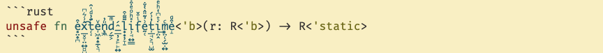

# 官方动态

编辑： 张汉东

---

## 随着 try-v2 RFC 的跟进，`NoneError` 已经被删除

[https://github.com/rust-lang/rust/issues/46871#issuecomment-852663986](https://github.com/rust-lang/rust/issues/46871#issuecomment-852663986)

## Rust 1.53 unicode ident  支持

```rust
const BLÅHAJ: &str = "🦈";

struct 人 {
    名字: String,
}

let α = 1;
```

Rust 1.53 支持了 Unicode 字符作为标识符，这意味着，只要是合法的 Unicode ，就可以作为标识符。对应 [RFC 2457](https://github.com/rust-lang/rfcs/blob/master/text/2457-non-ascii-idents.md)，该 RFC 中也记录了哪些 Unicode 是不安全的，感兴趣可以查看。

团队可以配置lint 属性， `#[deny(uncommon_codepoints)]` ，禁止一些不推荐的 codepoint 。



这样用就有点过分了！也许团队内要针对 Unicode 标识符来做一些编码规范了。

## 一个新的 MCP ：将 rustc_codegen_gcc 作为 compiler/rustc_codegen_gcc 组件合并到  rust-lang/rust 

[https://github.com/rust-lang/compiler-team/issues/442](https://github.com/rust-lang/compiler-team/issues/442)

rustc_codegen_gcc 是rustc的GCC代码生成器，这意味着它可以被现有的rustc前端加载，但受益于GCC，因为它支持更多的架构，并可以获得GCC的优化。

[进展报告 #1](https://blog.antoyo.xyz/rustc_codegen_gcc-progress-report-1)

## Rustup 1.24.3 发布

使用rustup self update更新 rustup,然后使用rustup update更新 toolchain

[Announcing Rustup 1.24.3 | Rust Blog (rust-lang.org)](https://blog.rust-lang.org/2021/06/08/Rustup-1.24.3.html)


